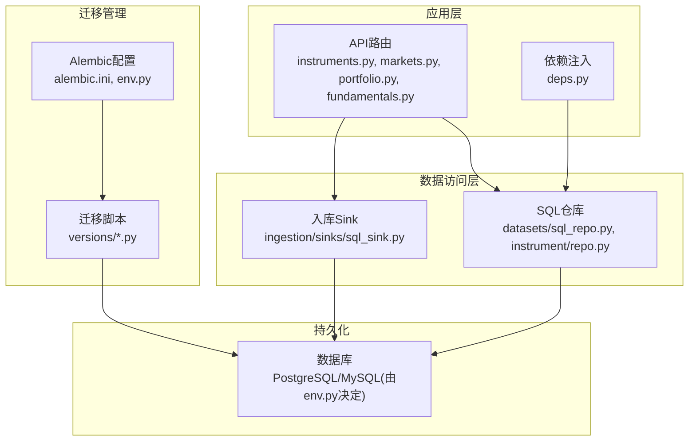
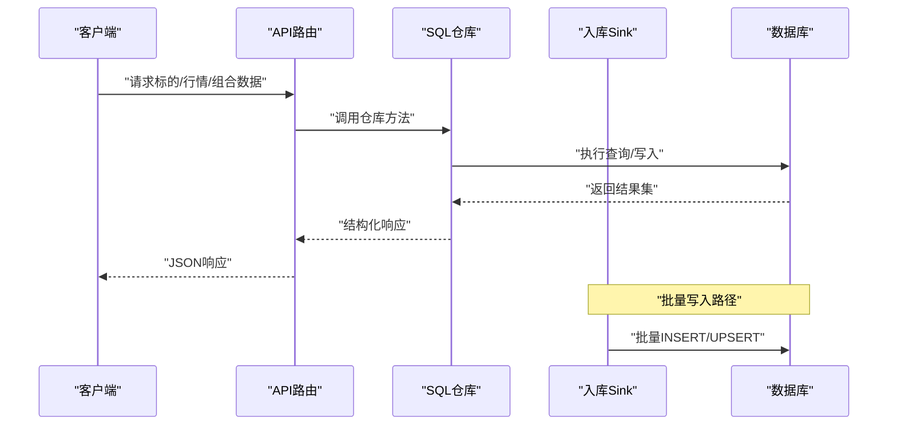
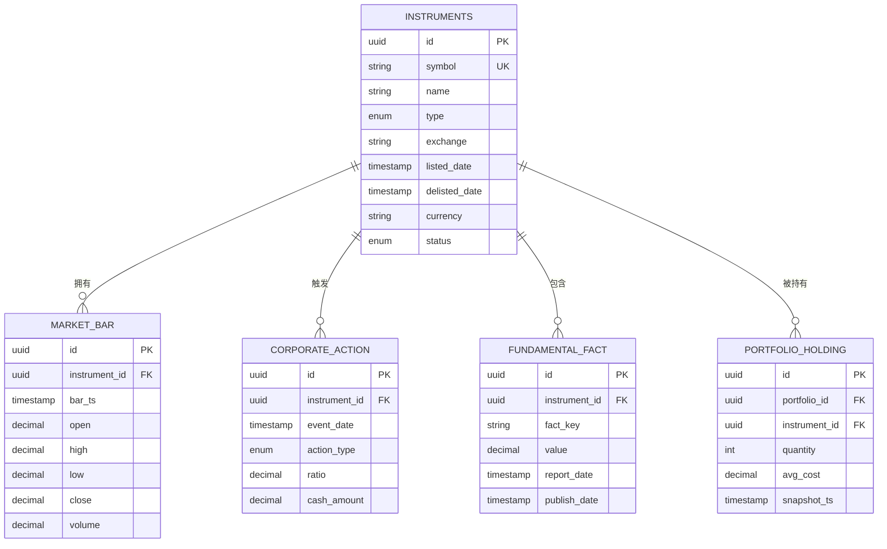
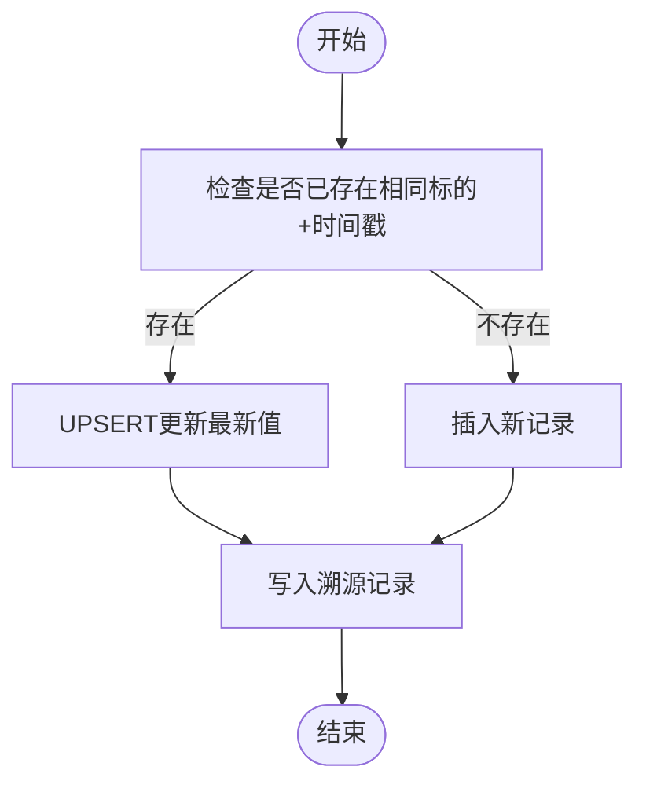
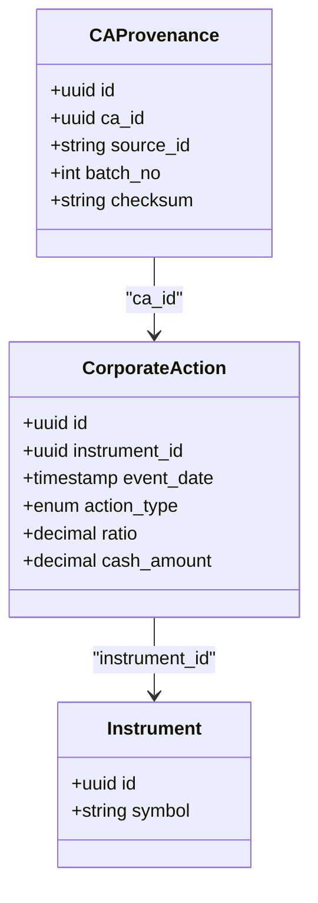
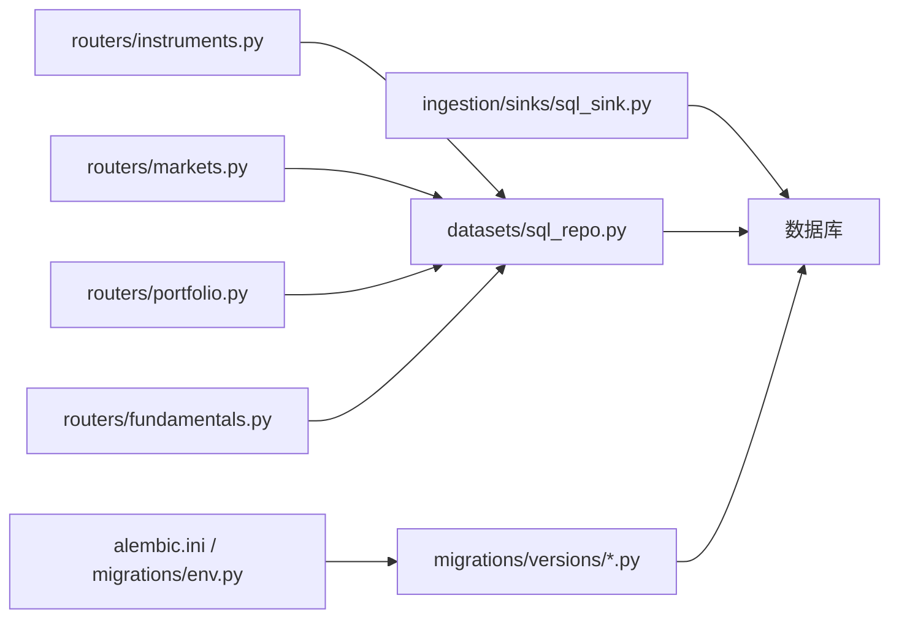

# 数据存储层

<cite>
**本文引用的文件**   
- [sql/migrations/20260715_0001_instruments.py](file://sql/migrations/20260715_0001_instruments.py)
- [sql/migrations/20260715_0003_market_bar.py](file://sql/migrations/20260715_0003_market_bar.py)
- [sql/migrations/20260715_0004_corporate_action.py](file://sql/migrations/20260715_0004_corporate_action.py)
- [sql/migrations/20260715_0005_fundamental_fact.py](file://sql/migrations/20260715_0005_fundamental_fact.py)
- [sql/migrations/20260715_0006_fund_fx_portfolio.py](file://sql/migrations/20260715_0006_fund_fx_portfolio.py)
- [sql/migrations/20260715_0007_market_bar_provenance.py](file://sql/migrations/20260715_0007_market_bar_provenance.py)
- [sql/migrations/20260715_0008_ca_nav_provenance.py](file://sql/migrations/20260715_0008_ca_nav_provenance.py)
- [alembic.ini](file://alembic.ini)
- [sql/migrations/env.py](file://sql/migrations/env.py)
- [apps/api/routers/instruments.py](file://apps/api/routers/instruments.py)
- [apps/api/routers/markets.py](file://apps/api/routers/markets.py)
- [apps/api/routers/portfolio.py](file://apps/api/routers/portfolio.py)
- [apps/api/routers/fundamentals.py](file://apps/api/routers/fundamentals.py)
- [apps/api/routers/data_status.py](file://apps/api/routers/data_status.py)
- [apps/api/deps.py](file://apps/api/deps.py)
- [packages/datasets/sql_repo.py](file://packages/datasets/sql_repo.py)
- [packages/instrument/repo.py](file://packages/instrument/repo.py)
- [packages/ingestion/sinks/sql_sink.py](file://packages/ingestion/sinks/sql_sink.py)
- [scripts/ingest_real_data.py](file://scripts/ingest_real_data.py)
</cite>

## 目录
1. [简介](#简介)
2. [项目结构](#项目结构)
3. [核心组件](#核心组件)
4. [架构总览](#架构总览)
5. [详细组件分析](#详细组件分析)
6. [依赖关系分析](#依赖关系分析)
7. [性能与索引优化](#性能与索引优化)
8. [数据备份、恢复与迁移](#数据备份恢复与迁移)
9. [分区与归档策略](#分区与归档策略)
10. [数据访问模式与缓存设计](#数据访问模式与缓存设计)
11. [一致性与事务处理](#一致性与事务处理)
12. [容量规划与扩容方案](#容量规划与扩容方案)
13. [故障排查指南](#故障排查指南)
14. [结论](#结论)

## 简介
本章节面向量化交易MCP系统的数据存储层，聚焦数据库表结构设计（标的资产、市场数据、投资组合等）、实体关系与约束、索引与查询优化、备份恢复与迁移机制、分区与归档策略、数据访问模式与缓存层设计、一致性保证与事务处理，以及存储容量规划与扩容方案。文档以Alembic迁移脚本为核心依据，结合API路由与仓库实现，给出端到端的数据流与运维建议。

## 项目结构
数据存储相关代码主要分布在以下位置：
- 数据库迁移定义：sql/migrations/versions/*
- Alembic配置与环境：alembic.ini、sql/migrations/env.py
- API路由层：apps/api/routers/*
- 仓库与数据访问：packages/*/repo.py、packages/datasets/sql_repo.py
- 数据入库管道：packages/ingestion/sinks/sql_sink.py、scripts/ingest_real_data.py

图表来源
- [alembic.ini](file://alembic.ini)
- [sql/migrations/env.py](file://sql/migrations/env.py)
- [apps/api/routers/instruments.py](file://apps/api/routers/instruments.py)
- [apps/api/routers/markets.py](file://apps/api/routers/markets.py)
- [apps/api/routers/portfolio.py](file://apps/api/routers/portfolio.py)
- [apps/api/routers/fundamentals.py](file://apps/api/routers/fundamentals.py)
- [packages/datasets/sql_repo.py](file://packages/datasets/sql_repo.py)
- [packages/instrument/repo.py](file://packages/instrument/repo.py)
- [packages/ingestion/sinks/sql_sink.py](file://packages/ingestion/sinks/sql_sink.py)

章节来源
- [alembic.ini](file://alembic.ini)
- [sql/migrations/env.py](file://sql/migrations/env.py)
- [apps/api/routers/instruments.py](file://apps/api/routers/instruments.py)
- [apps/api/routers/markets.py](file://apps/api/routers/markets.py)
- [apps/api/routers/portfolio.py](file://apps/api/routers/portfolio.py)
- [apps/api/routers/fundamentals.py](file://apps/api/routers/fundamentals.py)
- [packages/datasets/sql_repo.py](file://packages/datasets/sql_repo.py)
- [packages/instrument/repo.py](file://packages/instrument/repo.py)
- [packages/ingestion/sinks/sql_sink.py](file://packages/ingestion/sinks/sql_sink.py)

## 核心组件
- 标的资产模型：用于描述股票、基金、外汇等金融工具的基本信息、分类、状态与生命周期。
- 市场数据模型：包含K线/Bar序列、时间戳、价格与成交量等字段，支持多市场与多币种。
- 公司行为模型：记录拆股、分红、除权除息等事件，影响历史价格与持仓成本重算。
- 基本面事实模型：财务指标、估值因子等低频数据，按报告期与发布期组织。
- 组合与外汇模型：投资组合定义、持仓快照、净值曲线与汇率基准。
- 数据来源溯源：为市场数据与公司行为提供可追溯的源ID、批次号与校验哈希。

章节来源
- [sql/migrations/20260715_0001_instruments.py](file://sql/migrations/20260715_0001_instruments.py)
- [sql/migrations/20260715_0003_market_bar.py](file://sql/migrations/20260715_0003_market_bar.py)
- [sql/migrations/20260715_0004_corporate_action.py](file://sql/migrations/20260715_0004_corporate_action.py)
- [sql/migrations/20260715_0005_fundamental_fact.py](file://sql/migrations/20260715_0005_fundamental_fact.py)
- [sql/migrations/20260715_0006_fund_fx_portfolio.py](file://sql/migrations/20260715_0006_fund_fx_portfolio.py)
- [sql/migrations/20260715_0007_market_bar_provenance.py](file://sql/migrations/20260715_0007_market_bar_provenance.py)
- [sql/migrations/20260715_0008_ca_nav_provenance.py](file://sql/migrations/20260715_0008_ca_nav_provenance.py)

## 架构总览
从API到数据库的整体数据流如下：
- 外部数据通过Ingestion管道写入SQL Sink，落库至市场数据与公司行为表。
- API路由暴露查询接口，调用仓库层进行读写。
- Alembic负责版本化迁移，确保数据库结构与代码同步演进。

图表来源
- [apps/api/routers/instruments.py](file://apps/api/routers/instruments.py)
- [apps/api/routers/markets.py](file://apps/api/routers/markets.py)
- [apps/api/routers/portfolio.py](file://apps/api/routers/portfolio.py)
- [apps/api/routers/fundamentals.py](file://apps/api/routers/fundamentals.py)
- [packages/datasets/sql_repo.py](file://packages/datasets/sql_repo.py)
- [packages/ingestion/sinks/sql_sink.py](file://packages/ingestion/sinks/sql_sink.py)

## 详细组件分析

### 标的资产（Instruments）
- 职责：维护金融工具的元数据与生命周期，支撑跨市场统一标识与筛选。
- 关键属性：唯一标识、名称、类型、交易所、上市/退市日期、货币、状态等。
- 关系：与市场数据、公司行为、基本面事实通过标的ID关联；与组合持仓通过标的ID引用。
- 约束：唯一性约束保障同一标的在同一市场的唯一记录；外键约束确保引用完整性。

图表来源
- [sql/migrations/20260715_0001_instruments.py](file://sql/migrations/20260715_0001_instruments.py)
- [sql/migrations/20260715_0003_market_bar.py](file://sql/migrations/20260715_0003_market_bar.py)
- [sql/migrations/20260715_0004_corporate_action.py](file://sql/migrations/20260715_0004_corporate_action.py)
- [sql/migrations/20260715_0005_fundamental_fact.py](file://sql/migrations/20260715_0005_fundamental_fact.py)
- [sql/migrations/20260715_0006_fund_fx_portfolio.py](file://sql/migrations/20260715_0006_fund_fx_portfolio.py)

章节来源
- [sql/migrations/20260715_0001_instruments.py](file://sql/migrations/20260715_0001_instruments.py)
- [sql/migrations/20260715_0003_market_bar.py](file://sql/migrations/20260715_0003_market_bar.py)
- [sql/migrations/20260715_0004_corporate_action.py](file://sql/migrations/20260715_0004_corporate_action.py)
- [sql/migrations/20260715_0005_fundamental_fact.py](file://sql/migrations/20260715_0005_fundamental_fact.py)
- [sql/migrations/20260715_0006_fund_fx_portfolio.py](file://sql/migrations/20260715_0006_fund_fx_portfolio.py)

### 市场数据（Market Bar）
- 职责：存储高频或日频K线数据，作为回测与实盘信号的基础。
- 关键属性：时间戳、开高低收、成交量、复权标志等。
- 关系：通过instrument_id与标的资产关联；provenance表记录数据来源与批次。
- 约束：主键+时间戳唯一性；外键约束保证标的存在；可选唯一约束避免重复写入。

图表来源
- [sql/migrations/20260715_0003_market_bar.py](file://sql/migrations/20260715_0003_market_bar.py)
- [sql/migrations/20260715_0007_market_bar_provenance.py](file://sql/migrations/20260715_0007_market_bar_provenance.py)
- [packages/ingestion/sinks/sql_sink.py](file://packages/ingestion/sinks/sql_sink.py)

章节来源
- [sql/migrations/20260715_0003_market_bar.py](file://sql/migrations/20260715_0003_market_bar.py)
- [sql/migrations/20260715_0007_market_bar_provenance.py](file://sql/migrations/20260715_0007_market_bar_provenance.py)
- [packages/ingestion/sinks/sql_sink.py](file://packages/ingestion/sinks/sql_sink.py)

### 公司行为（Corporate Action）
- 职责：记录拆股、分红、配股等事件，驱动价格复权与持仓成本重算。
- 关键属性：事件日期、类型、比率、现金金额等。
- 关系：通过instrument_id与标的资产关联；provenance表记录来源与批次。
- 约束：事件日期与标的唯一性；外键约束保证标的存在。

图表来源
- [sql/migrations/20260715_0004_corporate_action.py](file://sql/migrations/20260715_0004_corporate_action.py)
- [sql/migrations/20260715_0008_ca_nav_provenance.py](file://sql/migrations/20260715_0008_ca_nav_provenance.py)

章节来源
- [sql/migrations/20260715_0004_corporate_action.py](file://sql/migrations/20260715_0004_corporate_action.py)
- [sql/migrations/20260715_0008_ca_nav_provenance.py](file://sql/migrations/20260715_0008_ca_nav_provenance.py)

### 基本面事实（Fundamental Fact）
- 职责：存储财报与估值因子，按报告日期与发布日期组织，便于回溯研究。
- 关键属性：指标键、数值、报告日期、发布日期等。
- 关系：通过instrument_id与标的资产关联。
- 约束：指标键与标的+报告日期唯一性；外键约束保证标的存在。

章节来源
- [sql/migrations/20260715_0005_fundamental_fact.py](file://sql/migrations/20260715_0005_fundamental_fact.py)

### 组合与外汇（Portfolio & FX）
- 职责：定义投资组合、持仓快照、净值曲线与汇率基准，支撑绩效评估与风险度量。
- 关键属性：组合ID、标的ID、数量、平均成本、快照时间、汇率等。
- 关系：组合与持仓一对多；持仓与标的多对一；外汇表提供汇率转换。
- 约束：组合+标的+快照时间唯一性；外键约束保证组合与标的存在。

章节来源
- [sql/migrations/20260715_0006_fund_fx_portfolio.py](file://sql/migrations/20260715_0006_fund_fx_portfolio.py)

### 数据来源溯源（Provenance）
- 职责：为市场数据与公司行为提供可追溯的来源ID、批次号与校验哈希，便于问题定位与数据治理。
- 关键属性：关联主表ID、source_id、batch_no、checksum等。
- 关系：分别对应市场数据与公司行为主表。
- 约束：主表ID唯一性；checksum用于完整性校验。

章节来源
- [sql/migrations/20260715_0007_market_bar_provenance.py](file://sql/migrations/20260715_0007_market_bar_provenance.py)
- [sql/migrations/20260715_0008_ca_nav_provenance.py](file://sql/migrations/20260715_0008_ca_nav_provenance.py)

## 依赖关系分析
- API路由依赖仓库层进行数据访问；仓库层直接操作数据库。
- Ingestion Sink在批处理场景下直接写入数据库，绕过API以提升吞吐。
- Alembic环境与配置驱动迁移执行，确保数据库结构与代码一致。

图表来源
- [apps/api/routers/instruments.py](file://apps/api/routers/instruments.py)
- [apps/api/routers/markets.py](file://apps/api/routers/markets.py)
- [apps/api/routers/portfolio.py](file://apps/api/routers/portfolio.py)
- [apps/api/routers/fundamentals.py](file://apps/api/routers/fundamentals.py)
- [packages/datasets/sql_repo.py](file://packages/datasets/sql_repo.py)
- [packages/ingestion/sinks/sql_sink.py](file://packages/ingestion/sinks/sql_sink.py)
- [alembic.ini](file://alembic.ini)
- [sql/migrations/env.py](file://sql/migrations/env.py)

章节来源
- [apps/api/routers/instruments.py](file://apps/api/routers/instruments.py)
- [apps/api/routers/markets.py](file://apps/api/routers/markets.py)
- [apps/api/routers/portfolio.py](file://apps/api/routers/portfolio.py)
- [apps/api/routers/fundamentals.py](file://apps/api/routers/fundamentals.py)
- [packages/datasets/sql_repo.py](file://packages/datasets/sql_repo.py)
- [packages/ingestion/sinks/sql_sink.py](file://packages/ingestion/sinks/sql_sink.py)
- [alembic.ini](file://alembic.ini)
- [sql/migrations/env.py](file://sql/migrations/env.py)

## 性能与索引优化
- 主键与唯一索引
  - 标的资产：symbol+exchange联合唯一索引，避免重复注册。
  - 市场数据：instrument_id+bar_ts联合唯一索引，防止重复写入并加速范围查询。
  - 公司行为：instrument_id+event_date联合唯一索引，确保事件不重复。
  - 基本面事实：instrument_id+fact_key+report_date联合唯一索引，保证指标唯一。
  - 组合持仓：portfolio_id+instrument_id+snapshot_ts联合唯一索引，避免重复快照。
- 查询优化
  - 时间范围查询：优先使用instrument_id+时间戳复合索引，减少全表扫描。
  - 聚合计算：对close、volume等常用列建立覆盖索引，提升窗口函数性能。
  - 过滤条件：对status、type等低基数字段建立单列索引，提高筛选效率。
- 写入优化
  - 批量写入：使用UPSERT或ON CONFLICT策略，降低冲突重试开销。
  - 分片写入：按instrument_id或时间分区写入，分散热点。
- 监控与调优
  - 慢查询日志：开启并定期分析，识别缺失索引与低效SQL。
  - 统计信息：定期ANALYZE/VACUUM，保持优化器选择准确。

章节来源
- [sql/migrations/20260715_0001_instruments.py](file://sql/migrations/20260715_0001_instruments.py)
- [sql/migrations/20260715_0003_market_bar.py](file://sql/migrations/20260715_0003_market_bar.py)
- [sql/migrations/20260715_0004_corporate_action.py](file://sql/migrations/20260715_0004_corporate_action.py)
- [sql/migrations/20260715_0005_fundamental_fact.py](file://sql/migrations/20260715_0005_fundamental_fact.py)
- [sql/migrations/20260715_0006_fund_fx_portfolio.py](file://sql/migrations/20260715_0006_fund_fx_portfolio.py)
- [packages/ingestion/sinks/sql_sink.py](file://packages/ingestion/sinks/sql_sink.py)

## 数据备份、恢复与迁移
- 备份策略
  - 逻辑备份：使用pg_dump或mysqldump导出DDL与数据，保留迁移脚本与数据一致性。
  - 物理备份：基于文件系统快照或云厂商快照，缩短RTO。
  - 增量备份：启用WAL或binlog，实现近实时增量备份。
- 恢复流程
  - 先恢复DDL与基础数据，再回放增量日志，验证完整性与一致性。
  - 校验checksum与溯源记录，确保数据未被篡改。
- 迁移机制
  - Alembic管理版本化迁移，按顺序执行up/down脚本。
  - 生产环境采用灰度发布与回滚策略，确保零停机升级。
  - 迁移前进行预演与备份，失败时自动回滚。

章节来源
- [alembic.ini](file://alembic.ini)
- [sql/migrations/env.py](file://sql/migrations/env.py)
- [sql/migrations/versions/20260715_0001_instruments.py](file://sql/migrations/20260715_0001_instruments.py)
- [sql/migrations/versions/20260715_0003_market_bar.py](file://sql/migrations/20260715_0003_market_bar.py)
- [sql/migrations/versions/20260715_0004_corporate_action.py](file://sql/migrations/20260715_0004_corporate_action.py)
- [sql/migrations/versions/20260715_0005_fundamental_fact.py](file://sql/migrations/20260715_0005_fundamental_fact.py)
- [sql/migrations/versions/20260715_0006_fund_fx_portfolio.py](file://sql/migrations/20260715_0006_fund_fx_portfolio.py)
- [sql/migrations/versions/20260715_0007_market_bar_provenance.py](file://sql/migrations/20260715_0007_market_bar_provenance.py)
- [sql/migrations/versions/20260715_0008_ca_nav_provenance.py](file://sql/migrations/20260715_0008_ca_nav_provenance.py)

## 分区与归档策略
- 分区策略
  - 时间分区：按天或周对market_bar与fundamental_fact进行分区，提升范围查询性能。
  - 标的分区：对高频标的单独分区，避免热点倾斜。
- 归档策略
  - 冷数据归档：将超过一定时间的历史数据迁移至低成本存储，保留索引以便按需加载。
  - 压缩与去重：对归档数据进行压缩，去除冗余字段，降低存储成本。
- 清理策略
  - 定时任务清理过期临时表与中间结果，释放空间。
  - 监控磁盘使用率，设置阈值告警。

[本节为概念性内容，未直接分析具体文件]

## 数据访问模式与缓存设计
- 访问模式
  - 读多写少：市场数据与基本面事实以读取为主，适合缓存热点标的与近期数据。
  - 批量写入：Ingestion管道批量写入，减少连接与事务开销。
- 缓存设计
  - 本地缓存：进程内LRU缓存最近N条K线与标的元数据，TTL控制失效。
  - 分布式缓存：Redis缓存热门标的的当日行情与组合快照，降低数据库压力。
  - 缓存一致性：写入后主动失效或更新缓存，避免脏读。
- 查询优化
  - 分页与游标：大数据量查询使用分页与游标，避免一次性加载。
  - 预聚合：对常用指标（如MA、MACD）进行预计算与缓存。

章节来源
- [apps/api/routers/markets.py](file://apps/api/routers/markets.py)
- [apps/api/routers/fundamentals.py](file://apps/api/routers/fundamentals.py)
- [packages/datasets/sql_repo.py](file://packages/datasets/sql_repo.py)
- [packages/ingestion/sinks/sql_sink.py](file://packages/ingestion/sinks/sql_sink.py)

## 一致性与事务处理
- 一致性保证
  - 强一致：写入市场数据与公司行为时使用事务，确保主表与溯源表原子提交。
  - 最终一致：缓存与数据库之间允许短暂不一致，通过失效策略收敛。
- 事务处理
  - 短事务：每个写入操作尽量短小，减少锁竞争。
  - 幂等写入：使用唯一约束与UPSERT，避免重复写入导致的不一致。
- 错误处理
  - 重试与退避：网络异常时指数退避重试，避免雪崩。
  - 死锁检测：捕获死锁异常，自动重试或降级。

章节来源
- [packages/ingestion/sinks/sql_sink.py](file://packages/ingestion/sinks/sql_sink.py)
- [packages/datasets/sql_repo.py](file://packages/datasets/sql_repo.py)

## 容量规划与扩容方案
- 容量规划
  - 估算每日新增行数：根据标的数量、频率与保留周期估算。
  - 存储增长：考虑索引与归档压缩比，预留30%冗余。
- 扩容方案
  - 垂直扩容：提升CPU、内存与IOPS，满足单机瓶颈。
  - 水平扩容：读写分离与分库分表，按标的或时间分片。
  - 冷热分层：热数据SSD，冷数据HDD或对象存储。
- 监控与告警
  - 监控QPS、延迟、连接数、磁盘使用率。
  - 设置阈值告警，自动扩缩容。

[本节为概念性内容，未直接分析具体文件]

## 故障排查指南
- 常见问题
  - 迁移失败：检查alembic版本与依赖，确认数据库连接与权限。
  - 写入冲突：查看唯一约束与UPSERT逻辑，确认幂等性。
  - 查询缓慢：分析执行计划，补充缺失索引或调整SQL。
- 诊断工具
  - 慢查询日志：定位耗时SQL，优化索引与查询。
  - 监控指标：关注延迟、错误率与资源使用。
- 回滚策略
  - 迁移回滚：执行down脚本，确保数据一致性。
  - 数据修复：基于溯源记录与备份进行修复。

章节来源
- [alembic.ini](file://alembic.ini)
- [sql/migrations/env.py](file://sql/migrations/env.py)
- [packages/ingestion/sinks/sql_sink.py](file://packages/ingestion/sinks/sql_sink.py)
- [packages/datasets/sql_repo.py](file://packages/datasets/sql_repo.py)

## 结论
本数据存储层以Alembic迁移为核心，构建了标的资产、市场数据、公司行为、基本面事实与组合外汇等核心实体，并通过溯源表保障数据可追溯性。通过合理的索引设计与分区归档策略，系统在性能与成本之间取得平衡。结合缓存与事务处理，提升了数据一致性与可用性。未来可进一步引入读写分离与分库分表，以应对规模增长。