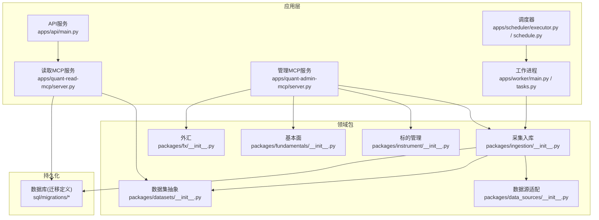
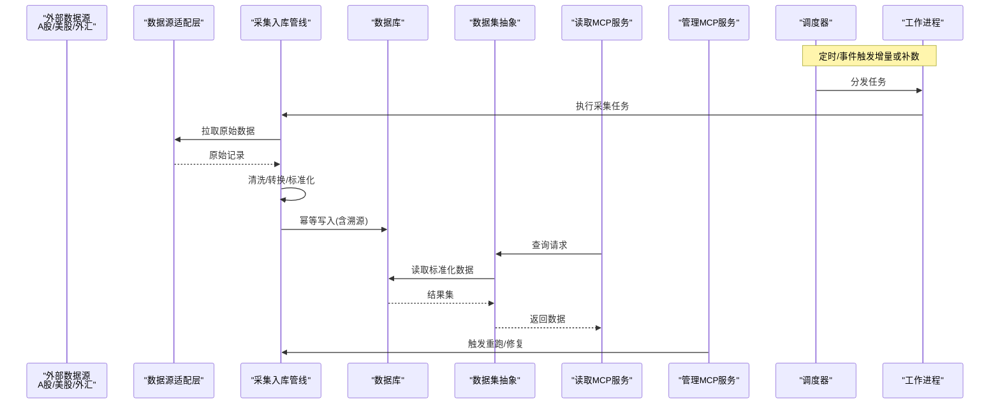
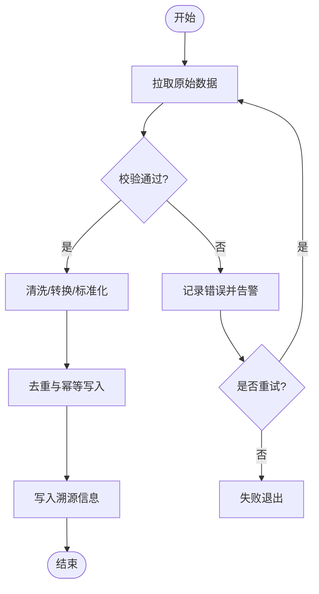
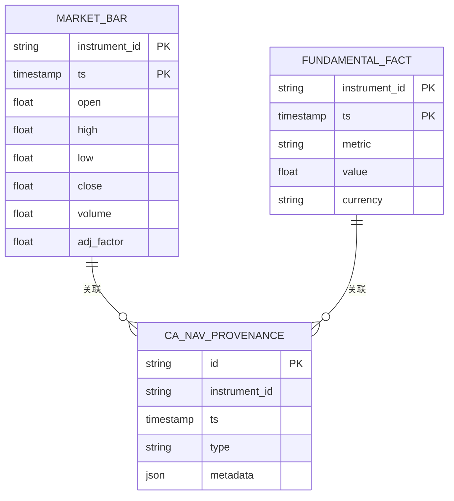
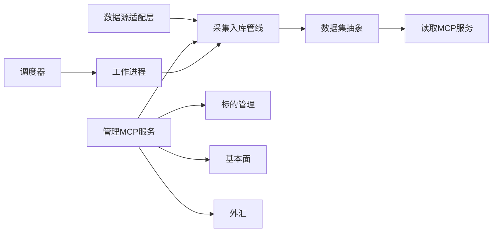

# 数据流架构

<cite>
**本文引用的文件**   
- [apps/api/main.py](file://apps/api/main.py)
- [apps/quant-read-mcp/server.py](file://apps/quant-read-mcp/server.py)
- [apps/quant-admin-mcp/server.py](file://apps/quant-admin-mcp/server.py)
- [apps/scheduler/executor.py](file://apps/scheduler/executor.py)
- [apps/scheduler/schedule.py](file://apps/scheduler/schedule.py)
- [apps/worker/main.py](file://apps/worker/main.py)
- [apps/worker/tasks.py](file://apps/worker/tasks.py)
- [packages/data_sources/__init__.py](file://packages/data_sources/__init__.py)
- [packages/ingestion/__init__.py](file://packages/ingestion/__init__.py)
- [packages/datasets/__init__.py](file://packages/datasets/__init__.py)
- [packages/instrument/__init__.py](file://packages/instrument/__init__.py)
- [packages/fundamentals/__init__.py](file://packages/fundamentals/__init__.py)
- [packages/fx/__init__.py](file://packages/fx/__init__.py)
- [scripts/ingest_real_data.py](file://scripts/ingest_real_data.py)
- [sql/migrations/20260715_0003_market_bar.py](file://sql/migrations/20260715_0003_market_bar.py)
- [sql/migrations/20260715_0005_fundamental_fact.py](file://sql/migrations/20260715_0005_fundamental_fact.py)
- [sql/migrations/20260715_0008_ca_nav_provenance.py](file://sql/migrations/20260715_0008_ca_nav_provenance.py)
</cite>

## 目录
1. [简介](#简介)
2. [项目结构](#项目结构)
3. [核心组件](#核心组件)
4. [架构总览](#架构总览)
5. [详细组件分析](#详细组件分析)
6. [依赖关系分析](#依赖关系分析)
7. [性能与缓存](#性能与缓存)
8. [故障排查指南](#故障排查指南)
9. [结论](#结论)
10. [附录](#附录)

## 简介
本文件面向量化交易MCP系统的数据流架构，覆盖从数据采集、清洗转换、存储到分发的完整链路。重点说明多市场（A股、美股、外汇）的统一接入模式，增量更新与实时处理机制，数据一致性保证与错误处理策略，以及缓存与性能优化方案。文档通过数据流图与时序图展示关键路径，帮助读者快速理解并落地实践。

## 项目结构
系统采用“服务化+包模块化”的组织方式：
- 应用层：API服务、MCP读写服务、调度器、工作进程
- 领域包：数据源适配、采集入库、数据集抽象、标的管理、基本面、外汇等
- 脚本与迁移：批量采集脚本、数据库迁移定义

图表来源
- [apps/api/main.py](file://apps/api/main.py)
- [apps/quant-read-mcp/server.py](file://apps/quant-read-mcp/server.py)
- [apps/quant-admin-mcp/server.py](file://apps/quant-admin-mcp/server.py)
- [apps/scheduler/executor.py](file://apps/scheduler/executor.py)
- [apps/scheduler/schedule.py](file://apps/scheduler/schedule.py)
- [apps/worker/main.py](file://apps/worker/main.py)
- [apps/worker/tasks.py](file://apps/worker/tasks.py)
- [packages/data_sources/__init__.py](file://packages/data_sources/__init__.py)
- [packages/ingestion/__init__.py](file://packages/ingestion/__init__.py)
- [packages/datasets/__init__.py](file://packages/datasets/__init__.py)
- [packages/instrument/__init__.py](file://packages/instrument/__init__.py)
- [packages/fundamentals/__init__.py](file://packages/fundamentals/__init__.py)
- [packages/fx/__init__.py](file://packages/fx/__init__.py)
- [sql/migrations/20260715_0003_market_bar.py](file://sql/migrations/20260715_0003_market_bar.py)
- [sql/migrations/20260715_0005_fundamental_fact.py](file://sql/migrations/20260715_0005_fundamental_fact.py)
- [sql/migrations/20260715_0008_ca_nav_provenance.py](file://sql/migrations/20260715_0008_ca_nav_provenance.py)

章节来源
- [apps/api/main.py](file://apps/api/main.py)
- [apps/quant-read-mcp/server.py](file://apps/quant-read-mcp/server.py)
- [apps/quant-admin-mcp/server.py](file://apps/quant-admin-mcp/server.py)
- [apps/scheduler/executor.py](file://apps/scheduler/executor.py)
- [apps/scheduler/schedule.py](file://apps/scheduler/schedule.py)
- [apps/worker/main.py](file://apps/worker/main.py)
- [apps/worker/tasks.py](file://apps/worker/tasks.py)
- [packages/data_sources/__init__.py](file://packages/data_sources/__init__.py)
- [packages/ingestion/__init__.py](file://packages/ingestion/__init__.py)
- [packages/datasets/__init__.py](file://packages/datasets/__init__.py)
- [packages/instrument/__init__.py](file://packages/instrument/__init__.py)
- [packages/fundamentals/__init__.py](file://packages/fundamentals/__init__.py)
- [packages/fx/__init__.py](file://packages/fx/__init__.py)
- [sql/migrations/20260715_0003_market_bar.py](file://sql/migrations/20260715_0003_0003_market_bar.py)
- [sql/migrations/20260715_0005_fundamental_fact.py](file://sql/migrations/20260715_0005_fundamental_fact.py)
- [sql/migrations/20260715_0008_ca_nav_provenance.py](file://sql/migrations/20260715_0008_ca_nav_provenance.py)

## 核心组件
- 统一数据源适配层：封装不同市场（A股、美股、外汇）的协议差异，提供一致的拉取接口与元数据描述。
- 采集与入库管线：负责拉取原始数据、清洗校验、标准化建模、幂等写入与溯源记录。
- 数据集抽象：对外暴露统一的查询视图，屏蔽底层存储细节，支持批/流式读取。
- 调度与工作进程：基于定时任务与任务队列驱动增量更新与补数。
- MCP读写服务：为上层工具与模型提供标准化的读/写能力。

章节来源
- [packages/data_sources/__init__.py](file://packages/data_sources/__init__.py)
- [packages/ingestion/__init__.py](file://packages/ingestion/__init__.py)
- [packages/datasets/__init__.py](file://packages/datasets/__init__.py)
- [apps/scheduler/executor.py](file://apps/scheduler/executor.py)
- [apps/worker/tasks.py](file://apps/worker/tasks.py)
- [apps/quant-read-mcp/server.py](file://apps/quant-read-mcp/server.py)
- [apps/quant-admin-mcp/server.py](file://apps/quant-admin-mcp/server.py)

## 架构总览
下图展示了端到端数据流：外部数据源经适配层进入采集管线，完成清洗、转换、标准化后落库；读取侧通过数据集抽象对外提供服务；调度与工作进程保障增量与实时能力。

图表来源
- [apps/scheduler/executor.py](file://apps/scheduler/executor.py)
- [apps/worker/tasks.py](file://apps/worker/tasks.py)
- [packages/data_sources/__init__.py](file://packages/data_sources/__init__.py)
- [packages/ingestion/__init__.py](file://packages/ingestion/__init__.py)
- [packages/datasets/__init__.py](file://packages/datasets/__init__.py)
- [apps/quant-read-mcp/server.py](file://apps/quant-read-mcp/server.py)
- [apps/quant-admin-mcp/server.py](file://apps/quant-admin-mcp/server.py)

## 详细组件分析

### 统一接入模式（A股/美股/外汇）
- 目标：以统一接口屏蔽各市场协议、时区、交易日历、货币与单位差异。
- 要点：
  - 统一标识：跨市场标的ID规范化，避免同物异名。
  - 统一时间：统一UTC存储，读取时按市场时区呈现。
  - 统一字段：价格、成交量、复权因子、币种等字段标准化。
  - 统一元数据：交易所、交易时段、节假日、涨跌停规则等。
- 实现位置：数据源适配层与标的管理包。

章节来源
- [packages/data_sources/__init__.py](file://packages/data_sources/__init__.py)
- [packages/instrument/__init__.py](file://packages/instrument/__init__.py)

### 数据采集与入库（清洗/转换/标准化）
- 流程：
  - 拉取：按市场与标的范围拉取原始数据。
  - 校验：完整性、时序性、异常值检测。
  - 转换：复权、单位换算、币种折算、时间对齐。
  - 标准化：映射到标准表结构与主键约束。
  - 幂等写入：基于唯一键去重，确保重复执行不产生脏数据。
  - 溯源：记录数据来源、版本、批次号、时间戳。
- 关键路径：
  - 历史回测：全量/区间补数。
  - 增量更新：盘后T+0/T+1更新。
  - 实时推送：盘中高频快照与逐笔聚合。

图表来源
- [packages/ingestion/__init__.py](file://packages/ingestion/__init__.py)
- [packages/data_sources/__init__.py](file://packages/data_sources/__init__.py)

章节来源
- [packages/ingestion/__init__.py](file://packages/ingestion/__init__.py)
- [packages/data_sources/__init__.py](file://packages/data_sources/__init__.py)

### 增量更新与实时处理
- 增量更新：
  - 基于时间窗口与唯一键的幂等合并，避免重复与遗漏。
  - 断点续传：记录上次成功处理的游标/偏移量。
- 实时处理：
  - 短轮询或长连接接收行情，缓冲后批量写入。
  - 低延迟读取：优先命中内存缓存，再回源DB。

章节来源
- [apps/scheduler/executor.py](file://apps/scheduler/executor.py)
- [apps/worker/tasks.py](file://apps/worker/tasks.py)
- [scripts/ingest_real_data.py](file://scripts/ingest_real_data.py)

### 存储与一致性
- 存储模型：
  - 行情K线：包含时间、开高低收、成交量、复权因子等。
  - 基本面事实：指标、口径、披露日期、币种等。
  - 公司行为与净值：拆分、分红、除权除息、基金净值等。
- 一致性保证：
  - 主键约束与唯一索引，防止重复。
  - 事务边界内写入与溯源记录，保证原子性。
  - 幂等写入与可重放任务，确保最终一致。

图表来源
- [sql/migrations/20260715_0003_market_bar.py](file://sql/migrations/20260715_0003_market_bar.py)
- [sql/migrations/20260715_0005_fundamental_fact.py](file://sql/migrations/20260715_0005_fundamental_fact.py)
- [sql/migrations/20260715_0008_ca_nav_provenance.py](file://sql/migrations/20260715_0008_ca_nav_provenance.py)

章节来源
- [sql/migrations/20260715_0003_market_bar.py](file://sql/migrations/20260715_0003_market_bar.py)
- [sql/migrations/20260715_0005_fundamental_fact.py](file://sql/migrations/20260715_0005_fundamental_fact.py)
- [sql/migrations/20260715_0008_ca_nav_provenance.py](file://sql/migrations/20260715_0008_ca_nav_provenance.py)

### 读取与分发（MCP服务）
- 读取MCP：面向研究与实盘的只读接口，提供统一查询语义。
- 管理MCP：面向运维与数据治理的写入/控制接口，支持触发采集、重跑、修复。
- 分发策略：
  - 批式：按日/周导出或订阅。
  - 流式：WebSocket/长轮询推送增量。

章节来源
- [apps/quant-read-mcp/server.py](file://apps/quant-read-mcp/server.py)
- [apps/quant-admin-mcp/server.py](file://apps/quant-admin-mcp/server.py)

### 调度与工作进程
- 调度器：维护任务计划、依赖与重试策略。
- 工作进程：消费任务、调用采集管线、上报状态与指标。

章节来源
- [apps/scheduler/executor.py](file://apps/scheduler/executor.py)
- [apps/scheduler/schedule.py](file://apps/scheduler/schedule.py)
- [apps/worker/main.py](file://apps/worker/main.py)
- [apps/worker/tasks.py](file://apps/worker/tasks.py)

## 依赖关系分析
- 组件耦合：
  - 采集管线依赖数据源适配层与数据集抽象。
  - 读取服务依赖数据集抽象与数据库。
  - 管理MCP依赖采集管线与标的/基本面/外汇包。
- 外部依赖：
  - 外部数据源（交易所/数据商）。
  - 数据库（迁移定义体现表结构）。

图表来源
- [packages/data_sources/__init__.py](file://packages/data_sources/__init__.py)
- [packages/ingestion/__init__.py](file://packages/ingestion/__init__.py)
- [packages/datasets/__init__.py](file://packages/datasets/__init__.py)
- [packages/instrument/__init__.py](file://packages/instrument/__init__.py)
- [packages/fundamentals/__init__.py](file://packages/fundamentals/__init__.py)
- [packages/fx/__init__.py](file://packages/fx/__init__.py)
- [apps/quant-read-mcp/server.py](file://apps/quant-read-mcp/server.py)
- [apps/quant-admin-mcp/server.py](file://apps/quant-admin-mcp/server.py)
- [apps/scheduler/executor.py](file://apps/scheduler/executor.py)
- [apps/worker/tasks.py](file://apps/worker/tasks.py)

章节来源
- [packages/data_sources/__init__.py](file://packages/data_sources/__init__.py)
- [packages/ingestion/__init__.py](file://packages/ingestion/__init__.py)
- [packages/datasets/__init__.py](file://packages/datasets/__init__.py)
- [packages/instrument/__init__.py](file://packages/instrument/__init__.py)
- [packages/fundamentals/__init__.py](file://packages/fundamentals/__init__.py)
- [packages/fx/__init__.py](file://packages/fx/__init__.py)
- [apps/quant-read-mcp/server.py](file://apps/quant-read-mcp/server.py)
- [apps/quant-admin-mcp/server.py](file://apps/quant-admin-mcp/server.py)
- [apps/scheduler/executor.py](file://apps/scheduler/executor.py)
- [apps/worker/tasks.py](file://apps/worker/tasks.py)

## 性能与缓存
- 缓存策略：
  - 热点标的最近N根K线与最新基本面指标入内存缓存，设置过期与失效策略。
  - 读取MCP对常用查询结果进行短期缓存，降低DB压力。
- 批处理优化：
  - 批量写入与批量查询，减少往返次数。
  - 分区与索引优化：按标的+时间分区，建立复合索引。
- 并发与背压：
  - 拉取端限流与退避，避免被上游限流。
  - 写入端使用事务与批量提交，控制内存峰值。
- 监控与度量：
  - 采集耗时、成功率、延迟分布、积压长度等指标上报。

[本节为通用指导，无需代码来源]

## 故障排查指南
- 常见问题定位：
  - 数据缺失：检查调度日志、任务重试、上游可用性、时间窗口配置。
  - 数据不一致：核对幂等键、去重逻辑、复权与币种换算。
  - 实时延迟：观察缓存命中率、写入吞吐、上游推送频率。
- 恢复手段：
  - 使用管理MCP触发指定标的/时间窗口的重跑。
  - 利用溯源信息定位问题批次与来源版本。
  - 针对异常数据执行修正任务，保持最终一致。

章节来源
- [apps/quant-admin-mcp/server.py](file://apps/quant-admin-mcp/server.py)
- [apps/scheduler/executor.py](file://apps/scheduler/executor.py)
- [apps/worker/tasks.py](file://apps/worker/tasks.py)

## 结论
本架构通过统一接入、幂等入库、标准化建模与分层读取，实现了跨市场数据的稳定采集与高效分发。结合调度与工作进程，系统具备增量更新与实时处理能力；通过溯源与幂等设计，保障了数据一致性与可恢复性。配合缓存与批处理优化，可在高吞吐场景下保持稳定性能。

## 附录
- 关键脚本：
  - 批量采集与实时数据导入脚本用于初始化与补数。
- 迁移文件：
  - 定义了行情、基本面、公司行为与净值等核心表结构，支撑数据模型演进。

章节来源
- [scripts/ingest_real_data.py](file://scripts/ingest_real_data.py)
- [sql/migrations/20260715_0003_market_bar.py](file://sql/migrations/20260715_0003_market_bar.py)
- [sql/migrations/20260715_0005_fundamental_fact.py](file://sql/migrations/20260715_0005_fundamental_fact.py)
- [sql/migrations/20260715_0008_ca_nav_provenance.py](file://sql/migrations/20260715_0008_ca_nav_provenance.py)