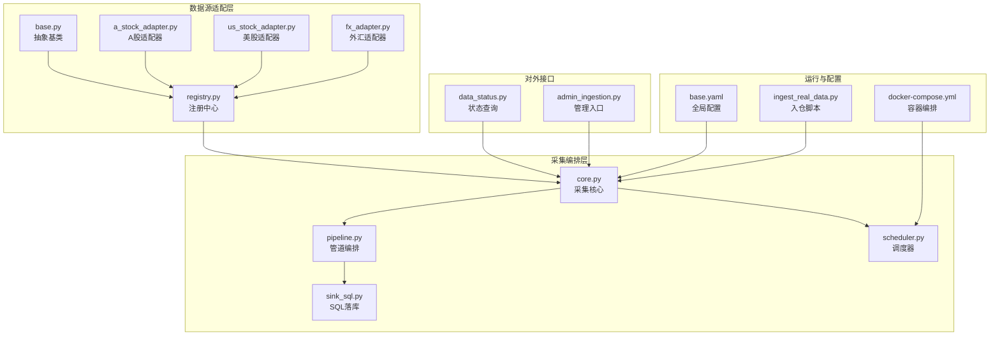
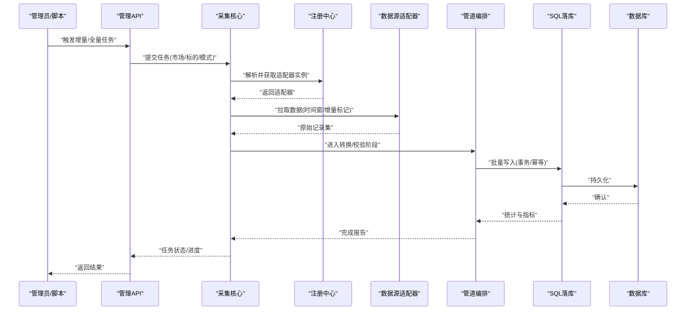
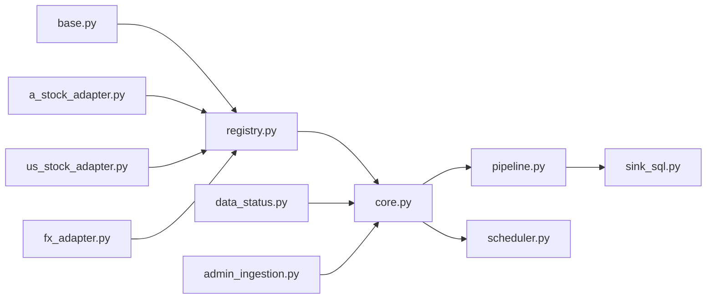
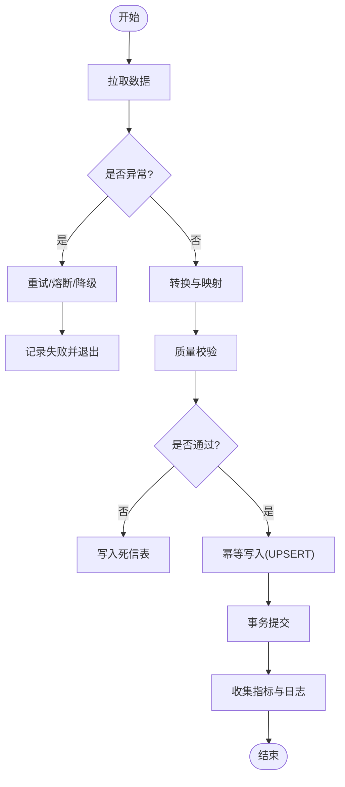

# 数据采集层

<cite>
**本文引用的文件**   
- [packages/data_sources/__init__.py](file://packages/data_sources/__init__.py)
- [packages/data_sources/base.py](file://packages/data_sources/base.py)
- [packages/data_sources/registry.py](file://packages/data_sources/registry.py)
- [packages/data_sources/a_stock_adapter.py](file://packages/data_sources/a_stock_adapter.py)
- [packages/data_sources/us_stock_adapter.py](file://packages/data_sources/us_stock_adapter.py)
- [packages/data_sources/fx_adapter.py](file://packages/data_sources/fx_adapter.py)
- [packages/ingestion/core.py](file://packages/ingestion/core.py)
- [packages/ingestion/pipeline.py](file://packages/ingestion/pipeline.py)
- [packages/ingestion/sink_sql.py](file://packages/ingestion/sink_sql.py)
- [packages/ingestion/scheduler.py](file://packages/ingestion/scheduler.py)
- [apps/api/routers/data_status.py](file://apps/api/routers/data_status.py)
- [apps/api/routers/admin_ingestion.py](file://apps/api/routers/admin_ingestion.py)
- [scripts/ingest_real_data.py](file://scripts/ingest_real_data.py)
- [tests/unit/test_live_adapters.py](file://tests/unit/test_live_adapters.py)
- [tests/unit/test_ingestion.py](file://tests/unit/test_ingestion.py)
- [tests/unit/test_ingestion_sql_sink.py](file://tests/unit/test_ingestion_sql_sink.py)
- [configs/base.yaml](file://configs/base.yaml)
- [deploy/docker-compose.yml](file://deploy/docker-compose.yml)
</cite>

## 目录
1. [简介](#简介)
2. [项目结构](#项目结构)
3. [核心组件](#核心组件)
4. [架构总览](#架构总览)
5. [详细组件分析](#详细组件分析)
6. [依赖关系分析](#依赖关系分析)
7. [性能与并发控制](#性能与并发控制)
8. [故障转移与高可用](#故障转移与高可用)
9. [数据质量与异常处理](#数据质量与异常处理)
10. [扩展新数据源适配器指南](#扩展新数据源适配器指南)
11. [运维与排障](#运维与排障)
12. [结论](#结论)

## 简介
本章节面向量化交易MCP系统的数据采集层，目标是构建一个跨市场、可扩展、可观测、高可用的多源数据采集体系。文档覆盖以下要点：
- 多源数据接入架构：A股、美股、外汇等市场的统一抽象与适配器设计
- 统一采集接口与协议抽象层：标准化拉取、增量更新、全量同步
- 认证、连接池与故障转移机制
- 数据质量检查与异常处理流程
- 扩展新数据源适配器的步骤与示例路径
- 性能优化与并发控制策略

## 项目结构
数据采集层主要分布在 packages/data_sources 与 packages/ingestion 两个子包中，并通过 API 路由暴露管理接口，脚本提供一键入仓入口，配置与部署文件支撑运行环境。

图表来源
- [packages/data_sources/base.py](file://packages/data_sources/base.py)
- [packages/data_sources/registry.py](file://packages/data_sources/registry.py)
- [packages/data_sources/a_stock_adapter.py](file://packages/data_sources/a_stock_adapter.py)
- [packages/data_sources/us_stock_adapter.py](file://packages/data_sources/us_stock_adapter.py)
- [packages/data_sources/fx_adapter.py](file://packages/data_sources/fx_adapter.py)
- [packages/ingestion/core.py](file://packages/ingestion/core.py)
- [packages/ingestion/pipeline.py](file://packages/ingestion/pipeline.py)
- [packages/ingestion/sink_sql.py](file://packages/ingestion/sink_sql.py)
- [packages/ingestion/scheduler.py](file://packages/ingestion/scheduler.py)
- [apps/api/routers/data_status.py](file://apps/api/routers/data_status.py)
- [apps/api/routers/admin_ingestion.py](file://apps/api/routers/admin_ingestion.py)
- [configs/base.yaml](file://configs/base.yaml)
- [deploy/docker-compose.yml](file://deploy/docker-compose.yml)
- [scripts/ingest_real_data.py](file://scripts/ingest_real_data.py)

章节来源
- [packages/data_sources/base.py](file://packages/data_sources/base.py)
- [packages/data_sources/registry.py](file://packages/data_sources/registry.py)
- [packages/ingestion/core.py](file://packages/ingestion/core.py)
- [packages/ingestion/pipeline.py](file://packages/ingestion/pipeline.py)
- [packages/ingestion/sink_sql.py](file://packages/ingestion/sink_sql.py)
- [packages/ingestion/scheduler.py](file://packages/ingestion/scheduler.py)
- [apps/api/routers/data_status.py](file://apps/api/routers/data_status.py)
- [apps/api/routers/admin_ingestion.py](file://apps/api/routers/admin_ingestion.py)
- [configs/base.yaml](file://configs/base.yaml)
- [deploy/docker-compose.yml](file://deploy/docker-compose.yml)
- [scripts/ingest_real_data.py](file://scripts/ingest_real_data.py)

## 核心组件
- 抽象基类与协议定义：定义统一的拉取接口、时间窗口、元数据、去重键、变更类型等协议，屏蔽不同市场差异。
- 适配器实现：针对A股、美股、外汇分别实现具体拉取逻辑、字段映射、时区与交易日历处理。
- 注册中心：集中管理所有已注册的适配器，支持按市场/品种族选择具体实现。
- 采集核心：负责调度、批大小、重试、断点续采、增量/全量切换、结果分发到下游。
- 管道编排：将“拉取-转换-校验-落库”串联为可插拔的流水线。
- SQL落库：基于事务与幂等写入，保证一致性；支持批量插入与冲突解决。
- 调度器：定时触发增量/全量任务，支持按市场/标的粒度执行。
- 管理API：提供健康检查、进度查询、手动触发全量/增量等能力。
- 配置与部署：通过配置文件注入各数据源的认证、限流、超时、重试策略；容器编排保障服务可用性。

章节来源
- [packages/data_sources/base.py](file://packages/data_sources/base.py)
- [packages/data_sources/registry.py](file://packages/data_sources/registry.py)
- [packages/data_sources/a_stock_adapter.py](file://packages/data_sources/a_stock_adapter.py)
- [packages/data_sources/us_stock_adapter.py](file://packages/data_sources/us_stock_adapter.py)
- [packages/data_sources/fx_adapter.py](file://packages/data_sources/fx_adapter.py)
- [packages/ingestion/core.py](file://packages/ingestion/core.py)
- [packages/ingestion/pipeline.py](file://packages/ingestion/pipeline.py)
- [packages/ingestion/sink_sql.py](file://packages/ingestion/sink_sql.py)
- [packages/ingestion/scheduler.py](file://packages/ingestion/scheduler.py)
- [apps/api/routers/data_status.py](file://apps/api/routers/data_status.py)
- [apps/api/routers/admin_ingestion.py](file://apps/api/routers/admin_ingestion.py)
- [configs/base.yaml](file://configs/base.yaml)
- [deploy/docker-compose.yml](file://deploy/docker-compose.yml)

## 架构总览
下图展示从外部数据源到内部存储的端到端流程，包括适配器、注册中心、采集核心、管道、落库与调度。

图表来源
- [packages/ingestion/core.py](file://packages/ingestion/core.py)
- [packages/data_sources/registry.py](file://packages/data_sources/registry.py)
- [packages/data_sources/a_stock_adapter.py](file://packages/data_sources/a_stock_adapter.py)
- [packages/data_sources/us_stock_adapter.py](file://packages/data_sources/us_stock_adapter.py)
- [packages/data_sources/fx_adapter.py](file://packages/data_sources/fx_adapter.py)
- [packages/ingestion/pipeline.py](file://packages/ingestion/pipeline.py)
- [packages/ingestion/sink_sql.py](file://packages/ingestion/sink_sql.py)
- [apps/api/routers/admin_ingestion.py](file://apps/api/routers/admin_ingestion.py)

## 详细组件分析

### 抽象基类与协议抽象层
- 职责
  - 定义统一拉取接口：支持按时间范围、增量标记（如 last_sync_ts）、分页游标等参数拉取。
  - 规范输出数据结构：包含标准字段、变更类型（新增/更新/删除）、去重键、来源标识、审计信息。
  - 约定错误模型与重试语义：网络异常、限流、鉴权失败等分类与退避策略。
- 关键设计
  - 市场无关的时间与时区处理：统一转换为UTC或系统基准时区。
  - 增量语义：以服务端时间戳或自增ID作为增量边界，避免重复与遗漏。
  - 元数据与溯源：记录数据来源、批次号、拉取耗时、行数等。

章节来源
- [packages/data_sources/base.py](file://packages/data_sources/base.py)

### 注册中心
- 职责
  - 维护适配器名称到实现的映射，支持按市场/品种族动态选择。
  - 提供生命周期管理：初始化、销毁、健康检查。
- 关键设计
  - 插件式加载：通过装饰器或显式注册方式添加新适配器。
  - 容错：未找到适配器时返回明确错误码，便于上层降级。

章节来源
- [packages/data_sources/registry.py](file://packages/data_sources/registry.py)

### A股适配器
- 职责
  - 对接A股数据源，处理交易日历、停牌、涨跌停、复权等场景。
  - 字段映射至统一模型，生成去重键与变更类型。
- 关键设计
  - 增量拉取：基于交易日与时间戳双维度切分。
  - 特殊事件：对除权除息、停牌恢复进行标注，供后续处理。

章节来源
- [packages/data_sources/a_stock_adapter.py](file://packages/data_sources/a_stock_adapter.py)

### 美股适配器
- 职责
  - 对接美股数据源，处理盘前盘后、夏令时、退市等场景。
  - 字段映射与币种/交易所元数据补充。
- 关键设计
  - 时区与夏令时：统一归一化时间轴。
  - 增量策略：以服务器端序列号或更新时间为准。

章节来源
- [packages/data_sources/us_stock_adapter.py](file://packages/data_sources/us_stock_adapter.py)

### 外汇适配器
- 职责
  - 对接外汇数据源，处理T+0连续交易、跨日滚动、报价频率差异。
  - 汇率换算与基准货币对齐。
- 关键设计
  - 高频切片：按秒/分钟级聚合，控制内存占用。
  - 去重键：按货币对+时间戳+价格精度组合。

章节来源
- [packages/data_sources/fx_adapter.py](file://packages/data_sources/fx_adapter.py)

### 采集核心
- 职责
  - 解析任务参数（市场、标的、模式、时间窗），选择适配器，组织并发拉取。
  - 协调增量/全量策略，维护断点与进度。
  - 汇总指标与日志，上报健康状态。
- 关键设计
  - 任务队列：支持批量与优先级。
  - 重试与熔断：对上游不稳定进行保护。
  - 幂等写入：结合去重键与唯一约束避免重复。

章节来源
- [packages/ingestion/core.py](file://packages/ingestion/core.py)

### 管道编排
- 职责
  - 将“拉取→转换→校验→落库”串成可插拔流水线。
  - 支持中间态缓存与回滚。
- 关键设计
  - 阶段钩子：每个阶段可独立开关与替换。
  - 背压控制：根据下游吞吐调整上游拉取速率。

章节来源
- [packages/ingestion/pipeline.py](file://packages/ingestion/pipeline.py)

### SQL落库
- 职责
  - 批量写入、事务控制、冲突解决（UPSERT）。
  - 写入统计与审计记录。
- 关键设计
  - 连接池：复用连接，限制最大并发。
  - 分批提交：控制单批大小，降低锁竞争。

章节来源
- [packages/ingestion/sink_sql.py](file://packages/ingestion/sink_sql.py)

### 调度器
- 职责
  - 定时触发增量/全量任务，支持按市场/标的维度。
  - 任务去重与防抖，避免重复执行。
- 关键设计
  - 分布式友好：基于数据库或消息队列的任务锁。
  - 监控：任务成功率、延迟、积压长度。

章节来源
- [packages/ingestion/scheduler.py](file://packages/ingestion/scheduler.py)

### 管理API
- 职责
  - 提供健康检查、任务状态查询、手动触发增量/全量。
  - 暴露数据源连通性测试与最近一次同步时间。
- 关键设计
  - 权限控制：仅管理员可触发写操作。
  - 响应体：包含任务ID、状态、进度百分比、错误摘要。

章节来源
- [apps/api/routers/data_status.py](file://apps/api/routers/data_status.py)
- [apps/api/routers/admin_ingestion.py](file://apps/api/routers/admin_ingestion.py)

### 入仓脚本
- 职责
  - 提供命令行入口，快速执行全量/增量任务。
  - 读取配置文件，打印关键指标。
- 关键设计
  - 参数化：支持市场、标的列表、时间窗、模式等。
  - 退出码：用于CI/CD集成。

章节来源
- [scripts/ingest_real_data.py](file://scripts/ingest_real_data.py)

## 依赖关系分析
- 组件耦合
  - 适配器与注册中心松耦合，通过名称/族名查找。
  - 采集核心依赖注册中心与管道，不直接感知具体数据源细节。
  - 管道与落库解耦，可通过不同Sink实现替换。
- 外部依赖
  - 数据库连接池、HTTP客户端、时序/消息队列（可选）。
- 潜在循环依赖
  - 通过注册中心与接口抽象避免循环引用。

图表来源
- [packages/data_sources/base.py](file://packages/data_sources/base.py)
- [packages/data_sources/registry.py](file://packages/data_sources/registry.py)
- [packages/data_sources/a_stock_adapter.py](file://packages/data_sources/a_stock_adapter.py)
- [packages/data_sources/us_stock_adapter.py](file://packages/data_sources/us_stock_adapter.py)
- [packages/data_sources/fx_adapter.py](file://packages/data_sources/fx_adapter.py)
- [packages/ingestion/core.py](file://packages/ingestion/core.py)
- [packages/ingestion/pipeline.py](file://packages/ingestion/pipeline.py)
- [packages/ingestion/sink_sql.py](file://packages/ingestion/sink_sql.py)
- [packages/ingestion/scheduler.py](file://packages/ingestion/scheduler.py)
- [apps/api/routers/data_status.py](file://apps/api/routers/data_status.py)
- [apps/api/routers/admin_ingestion.py](file://apps/api/routers/admin_ingestion.py)

章节来源
- [packages/data_sources/registry.py](file://packages/data_sources/registry.py)
- [packages/ingestion/core.py](file://packages/ingestion/core.py)
- [packages/ingestion/pipeline.py](file://packages/ingestion/pipeline.py)
- [packages/ingestion/sink_sql.py](file://packages/ingestion/sink_sql.py)
- [packages/ingestion/scheduler.py](file://packages/ingestion/scheduler.py)
- [apps/api/routers/data_status.py](file://apps/api/routers/data_status.py)
- [apps/api/routers/admin_ingestion.py](file://apps/api/routers/admin_ingestion.py)

## 性能与并发控制
- 并发拉取
  - 按标的并行拉取，限制最大并发度，避免打爆上游。
  - 使用令牌桶或滑动窗口限流，结合指数退避重试。
- 批处理与内存
  - 拉取与写入均采用分批策略，控制批次大小与内存峰值。
  - 管道阶段间采用有界队列缓冲，防止背压崩溃。
- 连接池
  - 数据库连接池与HTTP客户端连接池分离，分别调优。
  - 空闲连接回收与超时关闭，避免资源泄漏。
- 索引与写入优化
  - 目标表建立合适索引，减少UPSERT成本。
  - 合并小批次，降低锁竞争与事务开销。
- 监控与度量
  - 暴露拉取耗时、成功率、延迟、堆积长度等指标。
  - 慢查询与异常堆栈采样，辅助定位瓶颈。

章节来源
- [packages/ingestion/core.py](file://packages/ingestion/core.py)
- [packages/ingestion/pipeline.py](file://packages/ingestion/pipeline.py)
- [packages/ingestion/sink_sql.py](file://packages/ingestion/sink_sql.py)
- [configs/base.yaml](file://configs/base.yaml)

## 故障转移与高可用
- 数据源侧
  - 多副本/多区域端点配置，自动切换失败节点。
  - 限流与熔断：超过阈值快速失败，避免雪崩。
- 采集侧
  - 任务级重试与整体熔断，失败任务进入死信队列以便人工干预。
  - 断点续采：记录上次成功时间戳/游标，重启后继续。
- 存储侧
  - 幂等写入：基于去重键与唯一约束，确保重复提交安全。
  - 事务回滚：单批失败不影响其他批次。
- 部署侧
  - 容器健康检查与自愈，配合负载均衡提升可用性。

章节来源
- [packages/ingestion/core.py](file://packages/ingestion/core.py)
- [packages/ingestion/sink_sql.py](file://packages/ingestion/sink_sql.py)
- [deploy/docker-compose.yml](file://deploy/docker-compose.yml)

## 数据质量与异常处理
- 质量检查
  - 必填字段校验、数值范围、时间顺序、去重键唯一性。
  - 跨源一致性比对（同标的多源对比）与告警。
- 异常分类
  - 网络/鉴权/限流/业务错误，分别对应不同重试与降级策略。
- 处理流程
  - 拉取阶段：捕获异常，记录上下文，按策略重试或跳过。
  - 转换阶段：脏数据隔离到死信表，保留原始记录。
  - 落库阶段：事务内校验，失败回滚并上报。
- 可观测性
  - 指标与日志关联任务ID，便于追踪问题链路。

章节来源
- [packages/ingestion/pipeline.py](file://packages/ingestion/pipeline.py)
- [packages/ingestion/sink_sql.py](file://packages/ingestion/sink_sql.py)
- [tests/unit/test_ingestion.py](file://tests/unit/test_ingestion.py)
- [tests/unit/test_ingestion_sql_sink.py](file://tests/unit/test_ingestion_sql_sink.py)

## 扩展新数据源适配器指南
- 步骤
  1. 新建适配器文件，继承抽象基类，实现拉取接口与字段映射。
  2. 在注册中心注册适配器名称与实现类。
  3. 在配置文件中添加该数据源的认证、限流、超时等参数。
  4. 编写单元测试，覆盖正常、异常、增量边界与去重键场景。
  5. 通过管理API或脚本验证端到端流程。
- 关键点
  - 严格遵循统一协议：时间、币种、去重键、变更类型。
  - 增量语义清晰：以服务端时间戳或序列号为准。
  - 幂等写入：确保重复拉取不会产生重复数据。
  - 可观测：记录来源、批次、耗时、行数等元数据。
- 参考路径
  - 适配器基类与协议定义：[packages/data_sources/base.py](file://packages/data_sources/base.py)
  - 注册中心：[packages/data_sources/registry.py](file://packages/data_sources/registry.py)
  - 已有适配器示例：
    - [packages/data_sources/a_stock_adapter.py](file://packages/data_sources/a_stock_adapter.py)
    - [packages/data_sources/us_stock_adapter.py](file://packages/data_sources/us_stock_adapter.py)
    - [packages/data_sources/fx_adapter.py](file://packages/data_sources/fx_adapter.py)
  - 采集核心与管道：
    - [packages/ingestion/core.py](file://packages/ingestion/core.py)
    - [packages/ingestion/pipeline.py](file://packages/ingestion/pipeline.py)
  - 测试用例参考：
    - [tests/unit/test_live_adapters.py](file://tests/unit/test_live_adapters.py)
    - [tests/unit/test_ingestion.py](file://tests/unit/test_ingestion.py)
    - [tests/unit/test_ingestion_sql_sink.py](file://tests/unit/test_ingestion_sql_sink.py)
  - 配置与部署：
    - [configs/base.yaml](file://configs/base.yaml)
    - [deploy/docker-compose.yml](file://deploy/docker-compose.yml)

章节来源
- [packages/data_sources/base.py](file://packages/data_sources/base.py)
- [packages/data_sources/registry.py](file://packages/data_sources/registry.py)
- [packages/data_sources/a_stock_adapter.py](file://packages/data_sources/a_stock_adapter.py)
- [packages/data_sources/us_stock_adapter.py](file://packages/data_sources/us_stock_adapter.py)
- [packages/data_sources/fx_adapter.py](file://packages/data_sources/fx_adapter.py)
- [packages/ingestion/core.py](file://packages/ingestion/core.py)
- [packages/ingestion/pipeline.py](file://packages/ingestion/pipeline.py)
- [tests/unit/test_live_adapters.py](file://tests/unit/test_live_adapters.py)
- [tests/unit/test_ingestion.py](file://tests/unit/test_ingestion.py)
- [tests/unit/test_ingestion_sql_sink.py](file://tests/unit/test_ingestion_sql_sink.py)
- [configs/base.yaml](file://configs/base.yaml)
- [deploy/docker-compose.yml](file://deploy/docker-compose.yml)

## 运维与排障
- 常见问题
  - 认证失败：检查密钥有效期、IP白名单、签名算法。
  - 限流/超时：调整批次大小、并发度、重试间隔与上限。
  - 数据缺失：核对交易日历、时区设置、增量边界。
  - 重复数据：检查去重键与唯一约束是否正确。
- 诊断手段
  - 查看任务状态与进度：通过管理API查询。
  - 检查指标与日志：关注拉取耗时、失败率、堆积长度。
  - 回放死信记录：定位脏数据与转换规则问题。
- 自动化
  - 健康检查探针：定期探测数据源连通性与最近同步时间。
  - 告警策略：失败率、延迟、堆积阈值触发告警。

章节来源
- [apps/api/routers/data_status.py](file://apps/api/routers/data_status.py)
- [apps/api/routers/admin_ingestion.py](file://apps/api/routers/admin_ingestion.py)
- [scripts/ingest_real_data.py](file://scripts/ingest_real_data.py)

## 结论
本数据采集层通过抽象基类与注册中心实现了跨市场数据源的统一接入，借助采集核心与管道编排完成了增量/全量策略、幂等写入与可观测性。通过合理的并发控制、连接池与故障转移机制，系统在稳定性与性能之间取得平衡。扩展新数据源只需遵循统一协议并在注册中心登记，即可快速融入现有体系。