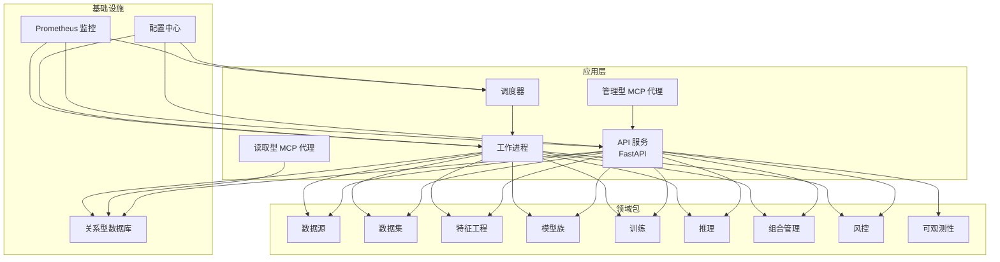
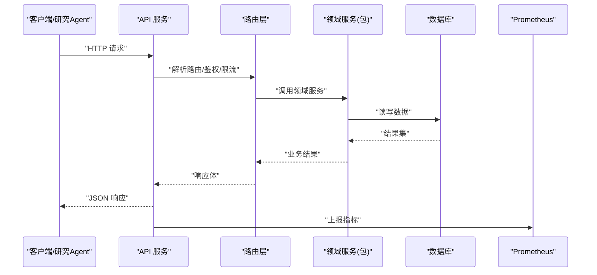
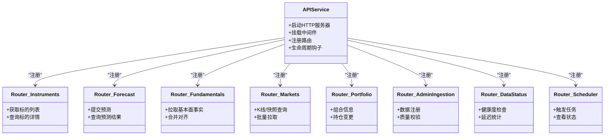
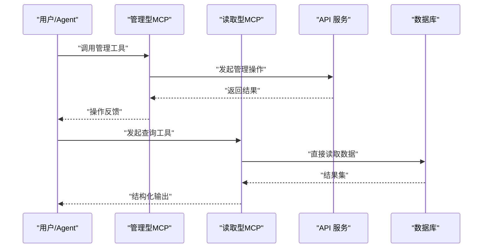
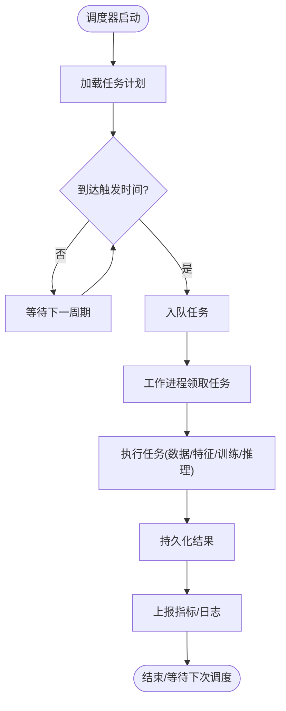
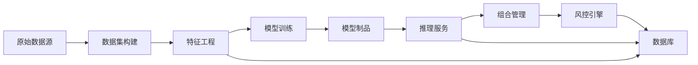
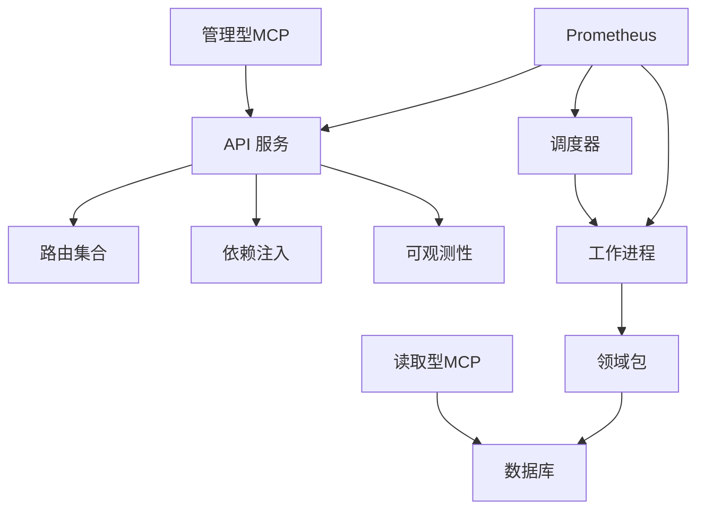

# 整体架构概览

<cite>
**本文引用的文件**   
- [README.md](file://README.md)
- [pyproject.toml](file://pyproject.toml)
- [apps/api/main.py](file://apps/api/main.py)
- [apps/api/deps.py](file://apps/api/deps.py)
- [apps/api/routers/instruments.py](file://apps/api/routers/instruments.py)
- [apps/api/routers/forecast.py](file://apps/api/routers/forecast.py)
- [apps/api/routers/fundamentals.py](file://apps/api/routers/fundamentals.py)
- [apps/api/routers/markets.py](file://apps/api/routers/markets.py)
- [apps/api/routers/portfolio.py](file://apps/api/routers/portfolio.py)
- [apps/api/routers/admin_ingestion.py](file://apps/api/routers/admin_ingestion.py)
- [apps/api/routers/data_status.py](file://apps/api/routers/data_status.py)
- [apps/api/routers/scheduler.py](file://apps/api/routers/scheduler.py)
- [apps/quant-admin-mcp/server.py](file://apps/quant-admin-mcp/server.py)
- [apps/quant-admin-mcp/tools.py](file://apps/quant-admin-mcp/tools.py)
- [apps/quant-read-mcp/server.py](file://apps/quant-read-mcp/server.py)
- [apps/quant-read-mcp/db_backends.py](file://apps/quant-read-mcp/db_backends.py)
- [apps/quant-read-mcp/tools.py](file://apps/quant-read-mcp/tools.py)
- [apps/scheduler/executor.py](file://apps/scheduler/executor.py)
- [apps/scheduler/schedule.py](file://apps/scheduler/schedule.py)
- [apps/worker/main.py](file://apps/worker/main.py)
- [apps/worker/tasks.py](file://apps/worker/tasks.py)
- [configs/base.yaml](file://configs/base.yaml)
- [configs/dev.yaml](file://configs/dev.yaml)
- [deploy/docker-compose.yml](file://deploy/docker-compose.yml)
- [deploy/prometheus.yml](file://deploy/prometheus.yml)
- [sql/migrations/env.py](file://sql/migrations/env.py)
- [packages/common/](file://packages/common/)
- [packages/data_sources/](file://packages/data_sources/)
- [packages/datasets/](file://packages/datasets/)
- [packages/features/](file://packages/features/)
- [packages/models/](file://packages/models/)
- [packages/training/](file://packages/training/)
- [packages/inference/](file://packages/inference/)
- [packages/broker/](file://packages/broker/)
- [packages/portfolio/](file://packages/portfolio/)
- [packages/risk/](file://packages/risk/)
- [packages/observability/](file://packages/observability/)
</cite>

## 目录
1. [简介](#简介)
2. [项目结构](#项目结构)
3. [核心组件](#核心组件)
4. [架构总览](#架构总览)
5. [详细组件分析](#详细组件分析)
6. [依赖分析](#依赖分析)
7. [性能考虑](#性能考虑)
8. [故障排查指南](#故障排查指南)
9. [结论](#结论)
10. [附录](#附录)

## 简介
本文件为量化交易MCP系统的整体架构概览，面向宏观设计与技术选型，重点阐述多代理协作架构、微服务拆分策略、服务间通信机制、系统边界与外部依赖、可扩展性与性能考量，并提供高层架构图与数据流向图。文档旨在帮助读者快速理解系统全貌，并为后续深入分析与扩展提供指引。

## 项目结构
仓库采用“应用层 + 领域包”的分层组织方式：
- apps：运行期可部署的微服务与应用（API、MCP代理、调度器、工作进程）
- packages：按领域划分的可复用库（数据源、数据集、特征、模型、训练、推理、组合、风控、可观测性等）
- configs：配置中心（基础与开发环境）
- deploy：容器编排与监控配置
- sql：数据库迁移脚本
- tests：单元与集成测试
- scripts：研究、回测、实盘演练等工具脚本

图表来源
- [apps/api/main.py:1-200](file://apps/api/main.py#L1-L200)
- [apps/quant-admin-mcp/server.py:1-200](file://apps/quant-admin-mcp/server.py#L1-L200)
- [apps/quant-read-mcp/server.py:1-200](file://apps/quant-read-mcp/server.py#L1-L200)
- [apps/scheduler/executor.py:1-200](file://apps/scheduler/executor.py#L1-L200)
- [apps/worker/main.py:1-200](file://apps/worker/main.py#L1-L200)
- [deploy/docker-compose.yml:1-200](file://deploy/docker-compose.yml#L1-L200)
- [deploy/prometheus.yml:1-200](file://deploy/prometheus.yml#L1-200)

章节来源
- [README.md:1-200](file://README.md#L1-L200)
- [pyproject.toml:1-200](file://pyproject.toml#L1-L200)
- [deploy/docker-compose.yml:1-200](file://deploy/docker-compose.yml#L1-L200)

## 核心组件
- API 网关与服务路由：基于 FastAPI 的 HTTP 接口，暴露行情、基本面、预测、组合、市场、调度与数据状态等能力；通过依赖注入装配仓储与业务逻辑。
- MCP 代理：
  - 管理型代理：面向运维与数据治理任务（如数据注册、质量检查、审计事件）。
  - 读取型代理：面向研究与查询场景，直连数据库后端并封装只读工具。
- 调度器与工作进程：定时触发数据入库、特征计算、模型训练与推理任务；工作进程执行具体任务并落库。
- 领域包：数据源适配、数据集构建、特征工程、模型族与训练、推理、组合与风控、可观测性指标采集。
- 配置与部署：YAML 配置分层与环境切换；Docker Compose 编排服务；Prometheus 抓取指标。

章节来源
- [apps/api/main.py:1-200](file://apps/api/main.py#L1-L200)
- [apps/api/deps.py:1-200](file://apps/api/deps.py#L1-L200)
- [apps/api/routers/instruments.py:1-200](file://apps/api/routers/instruments.py#L1-L200)
- [apps/api/routers/forecast.py:1-200](file://apps/api/routers/forecast.py#L1-L200)
- [apps/api/routers/fundamentals.py:1-200](file://apps/api/routers/fundamentals.py#L1-L200)
- [apps/api/routers/markets.py:1-200](file://apps/api/routers/markets.py#L1-L200)
- [apps/api/routers/portfolio.py:1-200](file://apps/api/routers/portfolio.py#L1-L200)
- [apps/api/routers/admin_ingestion.py:1-200](file://apps/api/routers/admin_ingestion.py#L1-L200)
- [apps/api/routers/data_status.py:1-200](file://apps/api/routers/data_status.py#L1-L200)
- [apps/api/routers/scheduler.py:1-200](file://apps/api/routers/scheduler.py#L1-L200)
- [apps/quant-admin-mcp/server.py:1-200](file://apps/quant-admin-mcp/server.py#L1-L200)
- [apps/quant-admin-mcp/tools.py:1-200](file://apps/quant-admin-mcp/tools.py#L1-L200)
- [apps/quant-read-mcp/server.py:1-200](file://apps/quant-read-mcp/server.py#L1-L200)
- [apps/quant-read-mcp/db_backends.py:1-200](file://apps/quant-read-mcp/db_backends.py#L1-L200)
- [apps/quant-read-mcp/tools.py:1-200](file://apps/quant-read-mcp/tools.py#L1-L200)
- [apps/scheduler/executor.py:1-200](file://apps/scheduler/executor.py#L1-L200)
- [apps/scheduler/schedule.py:1-200](file://apps/scheduler/schedule.py#L1-L200)
- [apps/worker/main.py:1-200](file://apps/worker/main.py#L1-L200)
- [apps/worker/tasks.py:1-200](file://apps/worker/tasks.py#L1-L200)
- [configs/base.yaml:1-200](file://configs/base.yaml#L1-L200)
- [configs/dev.yaml:1-200](file://configs/dev.yaml#L1-L200)
- [deploy/prometheus.yml:1-200](file://deploy/prometheus.yml#L1-200)

## 架构总览
系统采用“API 服务 + MCP 代理 + 调度/工作进程 + 领域包”的多代理协作模式。API 作为统一入口对外暴露 REST 能力；MCP 代理以工具集形式嵌入大模型工作流，实现“对话即操作”的研究与运维体验；调度器驱动批处理流水线，工作进程负责高吞吐的数据与计算任务。所有持久化访问通过统一的数据库抽象，便于替换存储后端。

图表来源
- [apps/api/main.py:1-200](file://apps/api/main.py#L1-L200)
- [apps/api/routers/instruments.py:1-200](file://apps/api/routers/instruments.py#L1-L200)
- [apps/api/routers/forecast.py:1-200](file://apps/api/routers/forecast.py#L1-L200)
- [apps/api/routers/fundamentals.py:1-200](file://apps/api/routers/fundamentals.py#L1-L200)
- [apps/api/routers/markets.py:1-200](file://apps/api/routers/markets.py#L1-L200)
- [apps/api/routers/portfolio.py:1-200](file://apps/api/routers/portfolio.py#L1-L200)
- [apps/api/routers/admin_ingestion.py:1-200](file://apps/api/routers/admin_ingestion.py#L1-L200)
- [apps/api/routers/data_status.py:1-200](file://apps/api/routers/data_status.py#L1-L200)
- [apps/api/routers/scheduler.py:1-200](file://apps/api/routers/scheduler.py#L1-L200)
- [deploy/prometheus.yml:1-200](file://deploy/prometheus.yml#L1-200)

## 详细组件分析

### API 服务与路由层
- 职责：统一对外暴露 REST API，承载鉴权、限流、日志、指标上报等横切关注点；将请求分发至各业务路由。
- 关键路由：
  - 标的与资产：instruments
  - 预测与信号：forecast
  - 基本面数据：fundamentals
  - 市场数据：markets
  - 组合与持仓：portfolio
  - 数据入库与治理：admin_ingestion
  - 数据健康度：data_status
  - 调度控制：scheduler
- 依赖注入：通过 deps 模块集中装配仓储、配置与第三方客户端，保证可测试性与解耦。

图表来源
- [apps/api/main.py:1-200](file://apps/api/main.py#L1-L200)
- [apps/api/routers/instruments.py:1-200](file://apps/api/routers/instruments.py#L1-L200)
- [apps/api/routers/forecast.py:1-200](file://apps/api/routers/forecast.py#L1-L200)
- [apps/api/routers/fundamentals.py:1-200](file://apps/api/routers/fundamentals.py#L1-L200)
- [apps/api/routers/markets.py:1-200](file://apps/api/routers/markets.py#L1-L200)
- [apps/api/routers/portfolio.py:1-200](file://apps/api/routers/portfolio.py#L1-L200)
- [apps/api/routers/admin_ingestion.py:1-200](file://apps/api/routers/admin_ingestion.py#L1-L200)
- [apps/api/routers/data_status.py:1-200](file://apps/api/routers/data_status.py#L1-L200)
- [apps/api/routers/scheduler.py:1-200](file://apps/api/routers/scheduler.py#L1-L200)

章节来源
- [apps/api/main.py:1-200](file://apps/api/main.py#L1-L200)
- [apps/api/deps.py:1-200](file://apps/api/deps.py#L1-L200)
- [apps/api/routers/instruments.py:1-200](file://apps/api/routers/instruments.py#L1-L200)
- [apps/api/routers/forecast.py:1-200](file://apps/api/routers/forecast.py#L1-L200)
- [apps/api/routers/fundamentals.py:1-200](file://apps/api/routers/fundamentals.py#L1-L200)
- [apps/api/routers/markets.py:1-200](file://apps/api/routers/markets.py#L1-L200)
- [apps/api/routers/portfolio.py:1-200](file://apps/api/routers/portfolio.py#L1-L200)
- [apps/api/routers/admin_ingestion.py:1-200](file://apps/api/routers/admin_ingestion.py#L1-L200)
- [apps/api/routers/data_status.py:1-200](file://apps/api/routers/data_status.py#L1-L200)
- [apps/api/routers/scheduler.py:1-200](file://apps/api/routers/scheduler.py#L1-L200)

### MCP 代理（管理与读取）
- 管理型代理：提供数据注册、质量校验、审计事件等工具，适合在 Agent 工作流中自动完成数据治理与合规检查。
- 读取型代理：封装只读数据库访问，支持多种后端，便于研究侧以自然语言驱动查询与分析。

图表来源
- [apps/quant-admin-mcp/server.py:1-200](file://apps/quant-admin-mcp/server.py#L1-L200)
- [apps/quant-admin-mcp/tools.py:1-200](file://apps/quant-admin-mcp/tools.py#L1-L200)
- [apps/quant-read-mcp/server.py:1-200](file://apps/quant-read-mcp/server.py#L1-L200)
- [apps/quant-read-mcp/db_backends.py:1-200](file://apps/quant-read-mcp/db_backends.py#L1-L200)
- [apps/quant-read-mcp/tools.py:1-200](file://apps/quant-read-mcp/tools.py#L1-L200)

章节来源
- [apps/quant-admin-mcp/server.py:1-200](file://apps/quant-admin-mcp/server.py#L1-L200)
- [apps/quant-admin-mcp/tools.py:1-200](file://apps/quant-admin-mcp/tools.py#L1-L200)
- [apps/quant-read-mcp/server.py:1-200](file://apps/quant-read-mcp/server.py#L1-L200)
- [apps/quant-read-mcp/db_backends.py:1-200](file://apps/quant-read-mcp/db_backends.py#L1-L200)
- [apps/quant-read-mcp/tools.py:1-200](file://apps/quant-read-mcp/tools.py#L1-L200)

### 调度器与工作进程
- 调度器：维护任务定义与触发策略，向工作队列投递任务。
- 工作进程：消费任务，执行数据入库、特征计算、模型训练与推理，并将结果写入数据库或对象存储。

图表来源
- [apps/scheduler/executor.py:1-200](file://apps/scheduler/executor.py#L1-L200)
- [apps/scheduler/schedule.py:1-200](file://apps/scheduler/schedule.py#L1-L200)
- [apps/worker/main.py:1-200](file://apps/worker/main.py#L1-L200)
- [apps/worker/tasks.py:1-200](file://apps/worker/tasks.py#L1-L200)

章节来源
- [apps/scheduler/executor.py:1-200](file://apps/scheduler/executor.py#L1-L200)
- [apps/scheduler/schedule.py:1-200](file://apps/scheduler/schedule.py#L1-L200)
- [apps/worker/main.py:1-200](file://apps/worker/main.py#L1-L200)
- [apps/worker/tasks.py:1-200](file://apps/worker/tasks.py#L1-L200)

### 领域包与数据流
- 数据源与数据集：对接多源数据，进行清洗、对齐与版本化管理。
- 特征工程：从原始数据派生因子与标签，形成可复用的特征库。
- 模型与训练：模型族注册、训练流水线、评估与归档。
- 推理：在线/离线推理，产出预测与信号。
- 组合与风控：头寸管理、风险度量与限额控制。
- 可观测性：指标、日志与追踪，支撑线上稳定性。

图表来源
- [packages/data_sources/](file://packages/data_sources/)
- [packages/datasets/](file://packages/datasets/)
- [packages/features/](file://packages/features/)
- [packages/models/](file://packages/models/)
- [packages/training/](file://packages/training/)
- [packages/inference/](file://packages/inference/)
- [packages/portfolio/](file://packages/portfolio/)
- [packages/risk/](file://packages/risk/)
- [packages/observability/](file://packages/observability/)

章节来源
- [packages/data_sources/](file://packages/data_sources/)
- [packages/datasets/](file://packages/datasets/)
- [packages/features/](file://packages/features/)
- [packages/models/](file://packages/models/)
- [packages/training/](file://packages/training/)
- [packages/inference/](file://packages/inference/)
- [packages/portfolio/](file://packages/portfolio/)
- [packages/risk/](file://packages/risk/)
- [packages/observability/](file://packages/observability/)

## 依赖分析
- 外部依赖
  - 数据库：使用 Alembic 管理迁移，SQL 迁移脚本位于 sql/migrations。
  - 监控：Prometheus 抓取 API、调度与工作进程指标。
  - 配置：YAML 分层配置，区分基础与开发环境。
- 内部依赖
  - API 服务依赖各路由与依赖注入装配。
  - MCP 代理依赖数据库后端与工具集。
  - 调度器与工作进程依赖领域包与数据库。

图表来源
- [apps/api/main.py:1-200](file://apps/api/main.py#L1-L200)
- [apps/api/deps.py:1-200](file://apps/api/deps.py#L1-L200)
- [apps/quant-admin-mcp/server.py:1-200](file://apps/quant-admin-mcp/server.py#L1-L200)
- [apps/quant-read-mcp/server.py:1-200](file://apps/quant-read-mcp/server.py#L1-L200)
- [apps/scheduler/executor.py:1-200](file://apps/scheduler/executor.py#L1-L200)
- [apps/worker/main.py:1-200](file://apps/worker/main.py#L1-L200)
- [deploy/prometheus.yml:1-200](file://deploy/prometheus.yml#L1-200)
- [sql/migrations/env.py:1-200](file://sql/migrations/env.py#L1-200)

章节来源
- [pyproject.toml:1-200](file://pyproject.toml#L1-L200)
- [sql/migrations/env.py:1-200](file://sql/migrations/env.py#L1-L200)
- [deploy/prometheus.yml:1-200](file://deploy/prometheus.yml#L1-200)

## 性能考虑
- 水平扩展：API 服务与工作进程无状态设计，可通过副本数扩容提升吞吐。
- I/O 优化：数据库连接池、批量写入与分页查询，减少往返开销。
- 缓存策略：热点数据（如标的字典、日历规则）引入内存缓存，降低重复计算与查询压力。
- 异步与并发：I/O 密集型路径采用异步框架与线程/进程池，避免阻塞。
- 资源隔离：不同任务类型（数据入库、特征计算、训练、推理）分进程/容器隔离，防止相互干扰。
- 监控告警：Prometheus 指标与阈值告警，定位瓶颈与异常。

[本节为通用指导，不直接分析具体文件]

## 故障排查指南
- 常见问题
  - 数据库连接失败：检查连接参数、网络连通性与权限。
  - 任务堆积：检查工作进程数量、任务耗时与下游依赖可用性。
  - 指标缺失：确认 Prometheus 抓取目标与端口可达。
  - 配置不一致：核对 base.yaml 与 dev.yaml 的差异，确保环境变量覆盖正确。
- 诊断手段
  - 查看服务日志与错误堆栈。
  - 通过 data_status 路由检查数据健康度与延迟。
  - 使用 Prometheus 面板观察 QPS、延迟与错误率。
  - 使用 Alembic 迁移状态确认数据库版本一致性。

章节来源
- [apps/api/routers/data_status.py:1-200](file://apps/api/routers/data_status.py#L1-L200)
- [deploy/prometheus.yml:1-200](file://deploy/prometheus.yml#L1-200)
- [sql/migrations/env.py:1-200](file://sql/migrations/env.py#L1-L200)
- [configs/base.yaml:1-200](file://configs/base.yaml#L1-L200)
- [configs/dev.yaml:1-200](file://configs/dev.yaml#L1-L200)

## 结论
本系统以多代理协作为核心，结合微服务拆分与领域包沉淀，实现了“研究-生产一体化”的量化平台。API 提供统一入口，MCP 代理增强交互与自动化能力，调度与工作进程保障批处理稳定高效。通过清晰的系统边界、外部依赖与集成点，以及完善的可观测性与配置管理，系统在可扩展性与性能方面具备良好基础。

[本节为总结性内容，不直接分析具体文件]

## 附录
- 技术栈选择与兼容性
  - Python 生态：基于 pyproject.toml 声明依赖，便于环境一致性与可重现构建。
  - Web 框架：FastAPI 提供高性能异步 API 与自动文档。
  - 数据库迁移：Alembic 管理版本演进。
  - 监控：Prometheus 标准指标采集。
  - 容器编排：Docker Compose 简化本地与测试环境部署。
- 版本兼容建议
  - 保持 Python 主版本与依赖矩阵稳定，升级前进行回归测试。
  - 数据库迁移需向后兼容，避免破坏现有数据。
  - 监控与配置更新需与部署脚本同步验证。

章节来源
- [pyproject.toml:1-200](file://pyproject.toml#L1-L200)
- [deploy/docker-compose.yml:1-200](file://deploy/docker-compose.yml#L1-L200)