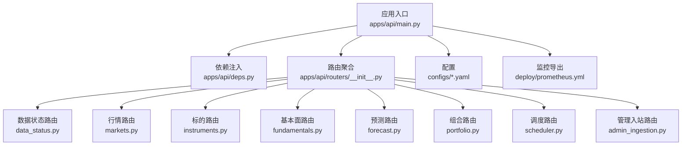
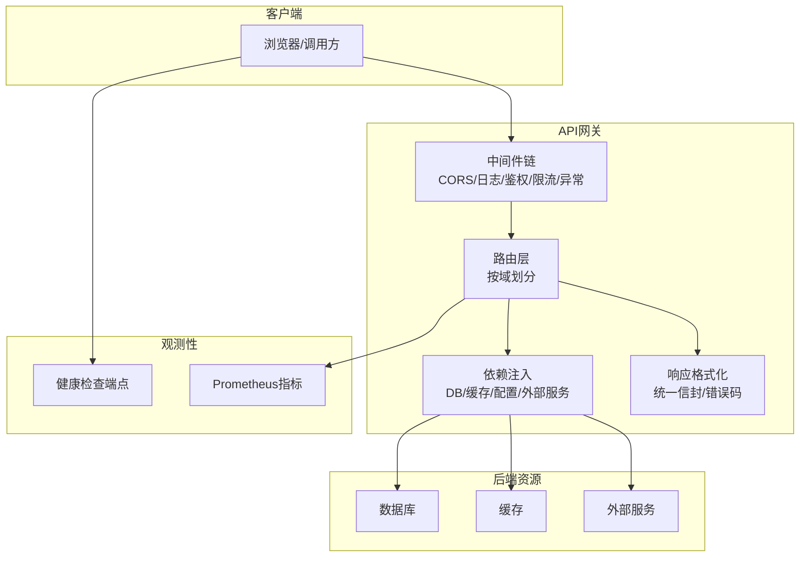
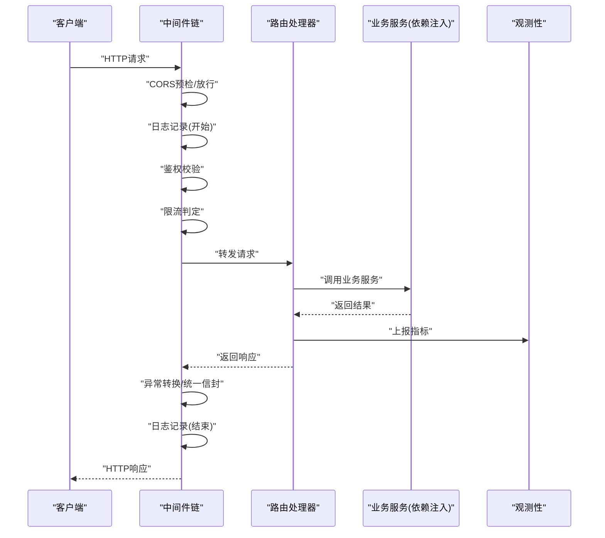
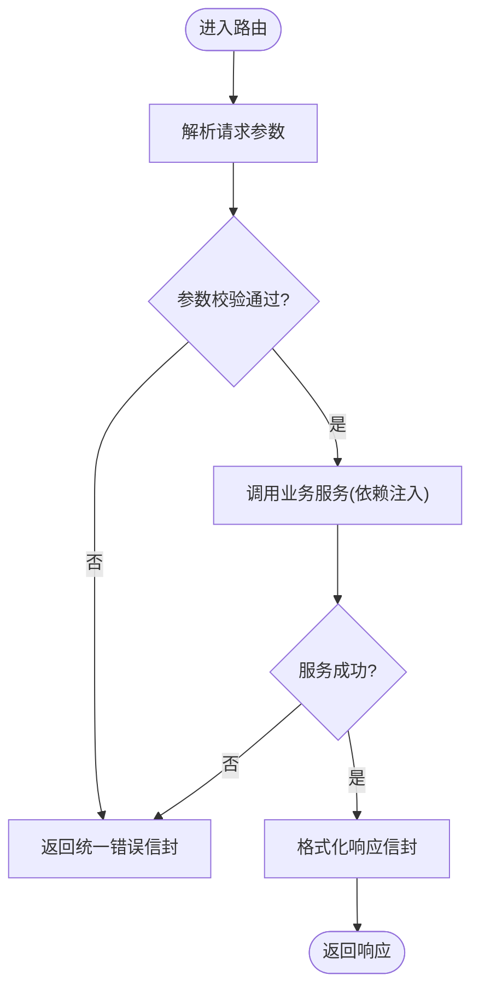
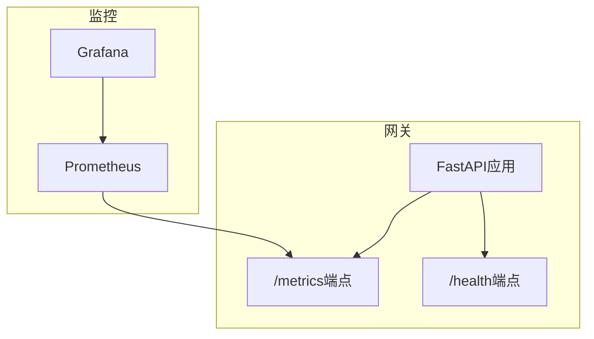
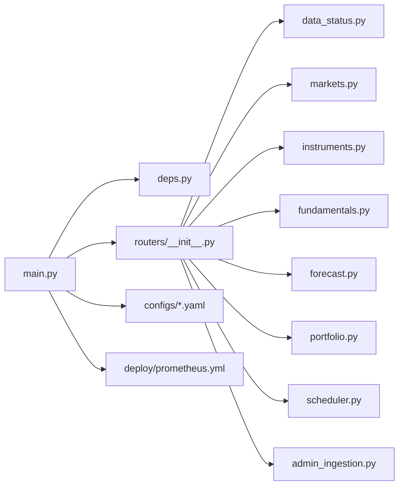

# API网关服务

<cite>
**本文引用的文件**   
- [apps/api/main.py](file://apps/api/main.py)
- [apps/api/deps.py](file://apps/api/deps.py)
- [apps/api/routers/__init__.py](file://apps/api/routers/__init__.py)
- [apps/api/routers/admin_ingestion.py](file://apps/api/routers/admin_ingestion.py)
- [apps/api/routers/data_status.py](file://apps/api/routers/data_status.py)
- [apps/api/routers/forecast.py](file://apps/api/routers/forecast.py)
- [apps/api/routers/fundamentals.py](file://apps/api/routers/fundamentals.py)
- [apps/api/routers/instruments.py](file://apps/api/routers/instruments.py)
- [apps/api/routers/markets.py](file://apps/api/routers/markets.py)
- [apps/api/routers/portfolio.py](file://apps/api/routers/portfolio.py)
- [apps/api/routers/scheduler.py](file://apps/api/routers/scheduler.py)
- [configs/base.yaml](file://configs/base.yaml)
- [configs/dev.yaml](file://configs/dev.yaml)
- [deploy/prometheus.yml](file://deploy/prometheus.yml)
- [tests/unit/test_api_health.py](file://tests/unit/test_api_health.py)
- [tests/unit/test_response_envelope.py](file://tests/unit/test_response_envelope.py)
</cite>

## 目录
1. [简介](#简介)
2. [项目结构](#项目结构)
3. [核心组件](#核心组件)
4. [架构总览](#架构总览)
5. [详细组件分析](#详细组件分析)
6. [依赖关系分析](#依赖关系分析)
7. [性能考虑](#性能考虑)
8. [故障排查指南](#故障排查指南)
9. [结论](#结论)
10. [附录](#附录)

## 简介
本设计文档面向API网关服务，聚焦FastAPI应用的启动流程、中间件配置与依赖注入机制；阐述路由注册模式、请求处理流程与响应格式化策略；说明认证授权、日志记录与错误处理中间件的实现思路；并给出API版本管理、限流控制、CORS配置方案。同时提供自定义中间件开发指南与扩展点说明，以及性能优化技巧与监控指标收集方法。

## 项目结构
API网关位于 apps/api 目录下，采用“应用入口 + 依赖注入 + 模块化路由”的组织方式：
- 应用入口负责创建FastAPI实例、加载配置、注册中间件与路由、挂载健康检查端点等。
- 依赖注入模块集中定义数据库连接、外部服务客户端、配置对象等共享资源。
- 路由按业务域拆分到独立文件，统一在入口或包级初始化中聚合注册。

图示来源
- [apps/api/main.py](file://apps/api/main.py)
- [apps/api/routers/__init__.py](file://apps/api/routers/__init__.py)
- [apps/api/routers/data_status.py](file://apps/api/routers/data_status.py)
- [apps/api/routers/markets.py](file://apps/api/routers/markets.py)
- [apps/api/routers/instruments.py](file://apps/api/routers/instruments.py)
- [apps/api/routers/fundamentals.py](file://apps/api/routers/fundamentals.py)
- [apps/api/routers/forecast.py](file://apps/api/routers/forecast.py)
- [apps/api/routers/portfolio.py](file://apps/api/routers/portfolio.py)
- [apps/api/routers/scheduler.py](file://apps/api/routers/scheduler.py)
- [apps/api/routers/admin_ingestion.py](file://apps/api/routers/admin_ingestion.py)
- [configs/base.yaml](file://configs/base.yaml)
- [deploy/prometheus.yml](file://deploy/prometheus.yml)

章节来源
- [apps/api/main.py](file://apps/api/main.py)
- [apps/api/routers/__init__.py](file://apps/api/routers/__init__.py)

## 核心组件
- 应用入口（main.py）
  - 负责构建FastAPI实例、读取配置、注册全局中间件、挂载子路由、暴露健康检查端点、启动事件与关闭事件钩子。
- 依赖注入（deps.py）
  - 集中声明可复用依赖项（如数据库会话、缓存客户端、配置对象、外部服务客户端），通过FastAPI的Depends机制在各路由中按需获取。
- 路由聚合（routers/__init__.py）
  - 将各业务域路由聚合为单一APIRouter，便于在主应用中一次性挂载，支持前缀与标签分组。
- 业务路由（各router文件）
  - 每个路由文件对应一个业务域，使用装饰器声明HTTP方法与路径，并通过依赖注入获取所需资源。

章节来源
- [apps/api/main.py](file://apps/api/main.py)
- [apps/api/deps.py](file://apps/api/deps.py)
- [apps/api/routers/__init__.py](file://apps/api/routers/__init__.py)

## 架构总览
下图展示API网关的整体架构与关键交互：客户端请求经中间件链处理后进入路由层，路由调用业务逻辑并通过依赖注入访问底层资源；响应经统一格式化处理返回；健康检查与监控指标由专用端点与采集器提供。

图示来源
- [apps/api/main.py](file://apps/api/main.py)
- [apps/api/routers/__init__.py](file://apps/api/routers/__init__.py)
- [deploy/prometheus.yml](file://deploy/prometheus.yml)

## 详细组件分析

### FastAPI应用启动流程
- 应用实例化
  - 创建FastAPI实例，设置应用元信息（名称、版本、描述等）。
- 配置加载
  - 从配置文件（base.yaml、dev.yaml）读取环境变量与运行时参数，注入到依赖项。
- 中间件注册
  - 注册CORS、日志、鉴权、限流、异常处理等中间件，形成统一的请求处理流水线。
- 路由挂载
  - 将聚合后的APIRouter挂载至主应用，支持路径前缀与标签分组。
- 生命周期钩子
  - 启动时建立连接池、预热缓存；关闭时释放资源、持久化状态。
- 健康检查
  - 暴露健康检查端点，用于负载均衡与健康探针。

章节来源
- [apps/api/main.py](file://apps/api/main.py)
- [configs/base.yaml](file://configs/base.yaml)
- [configs/dev.yaml](file://configs/dev.yaml)
- [tests/unit/test_api_health.py](file://tests/unit/test_api_health.py)

### 中间件配置与顺序
- CORS中间件
  - 允许跨域来源、方法与头，针对生产环境进行白名单收紧。
- 日志中间件
  - 记录请求ID、方法、路径、耗时、状态码与关键上下文，便于追踪与排障。
- 认证授权中间件
  - 校验令牌签名、解析用户身份与权限，注入当前用户上下文。
- 限流中间件
  - 基于IP或用户维度限制QPS/窗口计数，超限返回标准错误响应。
- 异常处理中间件
  - 捕获未处理异常，转换为统一错误信封，避免泄露内部细节。

图示来源
- [apps/api/main.py](file://apps/api/main.py)
- [apps/api/routers/__init__.py](file://apps/api/routers/__init__.py)

章节来源
- [apps/api/main.py](file://apps/api/main.py)

### 依赖注入机制
- 依赖项类型
  - 配置对象：从YAML与环境变量合并得到。
  - 数据库会话：连接池与会话工厂，确保线程安全与事务边界。
  - 缓存客户端：Redis或内存缓存封装。
  - 外部服务客户端：HTTP客户端、消息队列客户端等。
- 使用方式
  - 在路由函数中使用Depends声明依赖，FastAPI自动解析并提供实例。
  - 支持依赖的依赖（嵌套依赖），便于组合复杂资源。
- 生命周期管理
  - 通过生成器依赖或事件钩子管理资源的创建与销毁。

章节来源
- [apps/api/deps.py](file://apps/api/deps.py)

### 路由注册模式与请求处理流程
- 路由组织
  - 按业务域拆分为多个router文件，统一在聚合文件中注册，支持前缀与标签。
- 请求处理
  - 路由接收请求参数（路径、查询、表单、JSON），进行基础校验后调用服务层。
  - 服务层通过依赖注入访问数据库、缓存与外部服务。
- 响应格式化
  - 统一响应信封，包含状态码、数据体、错误信息与追踪ID。
  - 错误响应标准化，屏蔽内部堆栈与敏感信息。

图示来源
- [apps/api/routers/__init__.py](file://apps/api/routers/__init__.py)
- [tests/unit/test_response_envelope.py](file://tests/unit/test_response_envelope.py)

章节来源
- [apps/api/routers/__init__.py](file://apps/api/routers/__init__.py)
- [tests/unit/test_response_envelope.py](file://tests/unit/test_response_envelope.py)

### 认证授权中间件
- 令牌校验
  - 校验JWT签名、过期时间与签发者，解析用户标识与角色。
- 权限控制
  - 基于角色的访问控制（RBAC）或基于资源的访问控制（ABAC），在中间件或依赖中实施。
- 上下文注入
  - 将当前用户与权限信息注入请求上下文，供后续路由与服务使用。

章节来源
- [apps/api/main.py](file://apps/api/main.py)

### 日志记录中间件
- 结构化日志
  - 输出JSON格式日志，包含请求ID、方法、路径、耗时、状态码、用户ID等。
- 采样与级别
  - 根据环境调整日志级别，对高频接口启用采样以降低开销。
- 链路追踪
  - 透传TraceID，便于跨服务关联日志。

章节来源
- [apps/api/main.py](file://apps/api/main.py)

### 错误处理中间件
- 统一异常捕获
  - 捕获未处理异常，转换为标准错误信封，避免泄露内部细节。
- 业务异常映射
  - 将领域异常映射为HTTP状态码与友好提示。
- 调试开关
  - 开发环境可开启详细错误信息，生产环境默认关闭。

章节来源
- [apps/api/main.py](file://apps/api/main.py)
- [tests/unit/test_response_envelope.py](file://tests/unit/test_response_envelope.py)

### API版本管理策略
- URL前缀版本
  - 使用 /api/v1、/api/v2 等前缀区分版本，兼容旧版客户端。
- 内容协商
  - 通过Accept头或Query参数选择响应格式或字段集。
- 弃用策略
  - 对即将废弃的端点添加弃用标记，提供迁移指引。

章节来源
- [apps/api/routers/__init__.py](file://apps/api/routers/__init__.py)

### 限流控制
- 策略维度
  - 基于IP、用户ID或API键进行限流。
- 算法与存储
  - 滑动窗口或固定窗口计数，使用内存或分布式存储（如Redis）。
- 响应行为
  - 超限返回标准错误信封，附带重试建议与恢复时间。

章节来源
- [apps/api/main.py](file://apps/api/main.py)

### CORS配置
- 白名单来源
  - 仅允许受信任的前端域名与内部服务。
- 方法与头
  - 明确允许的HTTP方法与请求头，最小权限原则。
- 凭证与预检
  - 按需允许携带Cookie与预检请求。

章节来源
- [apps/api/main.py](file://apps/api/main.py)

### 自定义中间件开发指南与扩展点
- 开发步骤
  - 实现ASGI中间件类或函数，遵循请求-响应模型。
  - 在应用入口注册中间件，注意执行顺序。
- 常见扩展点
  - 请求拦截与改写、响应裁剪与加密、审计与合规、灰度与A/B测试。
- 最佳实践
  - 保持幂等与无副作用；合理设置超时与重试；避免阻塞I/O。

章节来源
- [apps/api/main.py](file://apps/api/main.py)

### 监控指标收集
- Prometheus集成
  - 暴露/metrics端点，采集请求数、延迟分布、错误率、业务KPI。
- 健康检查
  - 暴露/health端点，返回服务可用性与依赖健康状态。
- 告警规则
  - 基于指标阈值配置告警，及时发现问题。

图示来源
- [deploy/prometheus.yml](file://deploy/prometheus.yml)
- [tests/unit/test_api_health.py](file://tests/unit/test_api_health.py)

章节来源
- [deploy/prometheus.yml](file://deploy/prometheus.yml)
- [tests/unit/test_api_health.py](file://tests/unit/test_api_health.py)

## 依赖关系分析
- 组件耦合
  - main.py聚合中间件与路由，低耦合于具体业务逻辑。
  - deps.py作为依赖中心，降低路由与服务的直接耦合。
- 外部依赖
  - 配置文件（base.yaml、dev.yaml）决定运行期行为。
  - 监控采集依赖Prometheus配置。
- 潜在循环依赖
  - 路由不应反向导入main或deps中的全局实例，应通过Depends获取。

图示来源
- [apps/api/main.py](file://apps/api/main.py)
- [apps/api/deps.py](file://apps/api/deps.py)
- [apps/api/routers/__init__.py](file://apps/api/routers/__init__.py)
- [configs/base.yaml](file://configs/base.yaml)
- [configs/dev.yaml](file://configs/dev.yaml)
- [deploy/prometheus.yml](file://deploy/prometheus.yml)

章节来源
- [apps/api/main.py](file://apps/api/main.py)
- [apps/api/deps.py](file://apps/api/deps.py)
- [apps/api/routers/__init__.py](file://apps/api/routers/__init__.py)
- [configs/base.yaml](file://configs/base.yaml)
- [configs/dev.yaml](file://configs/dev.yaml)
- [deploy/prometheus.yml](file://deploy/prometheus.yml)

## 性能考虑
- 异步优先
  - 使用异步IO与异步依赖，避免阻塞事件循环。
- 连接池与复用
  - 数据库与HTTP客户端使用连接池，减少握手开销。
- 缓存策略
  - 热点数据缓存，合理设置TTL与失效策略。
- 序列化优化
  - 使用高效序列化库，减少CPU与内存占用。
- 限流与背压
  - 在高负载下保护系统稳定性，避免雪崩。
- 日志采样
  - 生产环境对高频接口启用采样，降低I/O压力。

[本节为通用指导，不直接分析具体文件]

## 故障排查指南
- 健康检查
  - 通过/health端点确认服务与依赖可用性。
- 日志定位
  - 结合请求ID与TraceID快速定位问题链路。
- 错误信封
  - 统一错误响应便于前端与自动化处理。
- 指标诊断
  - 查看/metrics端点的延迟、错误率与业务指标，识别瓶颈。

章节来源
- [tests/unit/test_api_health.py](file://tests/unit/test_api_health.py)
- [tests/unit/test_response_envelope.py](file://tests/unit/test_response_envelope.py)

## 结论
本设计文档围绕API网关的启动流程、中间件体系、依赖注入、路由与响应格式化、认证授权、日志与错误处理、版本管理、限流与CORS、自定义中间件扩展、性能优化与监控等方面进行了系统化阐述。通过模块化路由与集中式依赖注入，提升了可维护性与可扩展性；通过统一中间件链与标准化响应，增强了可观测性与一致性。建议在迭代中持续完善限流策略、指标覆盖与错误语义，以支撑高可用与高性能的生产环境。

## 附录
- 配置项参考
  - base.yaml与dev.yaml用于区分环境与覆盖配置。
- 监控采集
  - prometheus.yml定义抓取目标与间隔。

章节来源
- [configs/base.yaml](file://configs/base.yaml)
- [configs/dev.yaml](file://configs/dev.yaml)
- [deploy/prometheus.yml](file://deploy/prometheus.yml)