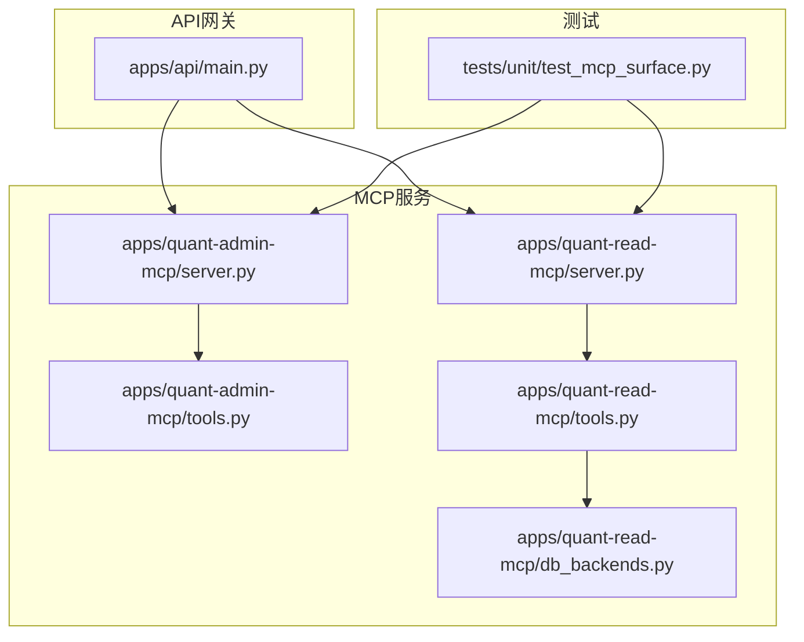
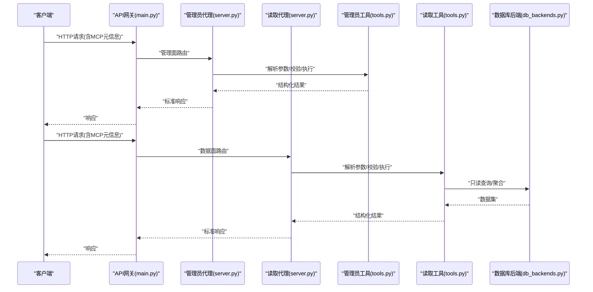
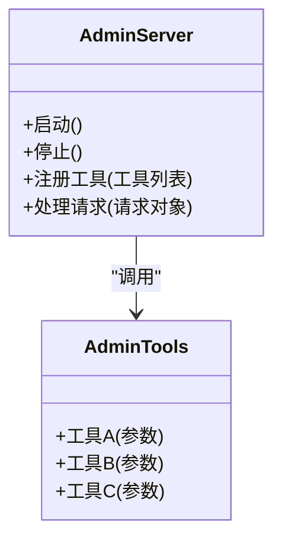
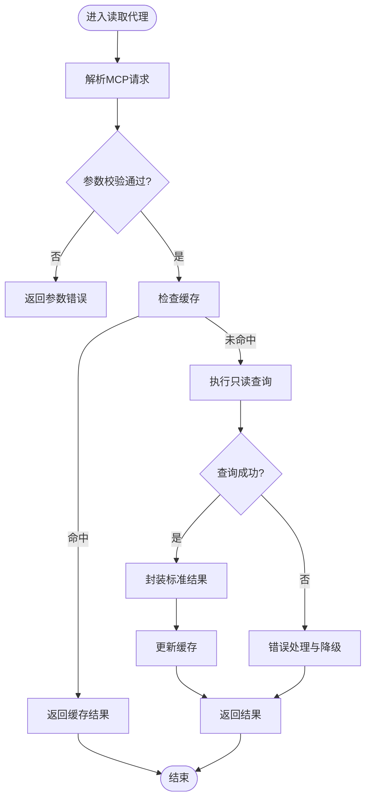
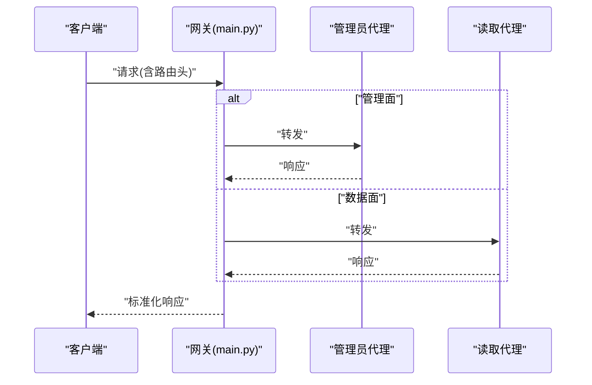
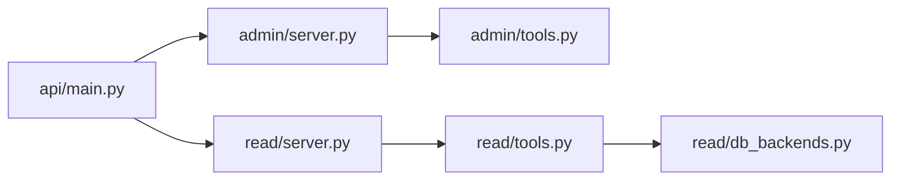

# MCP代理服务器

<cite>
**本文引用的文件**   
- [apps/api/main.py](file://apps/api/main.py)
- [apps/quant-admin-mcp/server.py](file://apps/quant-admin-mcp/server.py)
- [apps/quant-admin-mcp/tools.py](file://apps/quant-admin-mcp/tools.py)
- [apps/quant-read-mcp/server.py](file://apps/quant-read-mcp/server.py)
- [apps/quant-read-mcp/tools.py](file://apps/quant-read-mcp/tools.py)
- [apps/quant-read-mcp/db_backends.py](file://apps/quant-read-mcp/db_backends.py)
- [tests/unit/test_mcp_surface.py](file://tests/unit/test_mcp_surface.py)
</cite>

## 目录
1. [简介](#简介)
2. [项目结构](#项目结构)
3. [核心组件](#核心组件)
4. [架构总览](#架构总览)
5. [详细组件分析](#详细组件分析)
6. [依赖关系分析](#依赖关系分析)
7. [性能与可观测性](#性能与可观测性)
8. [故障排查指南](#故障排查指南)
9. [结论](#结论)
10. [附录：自定义工具开发指南](#附录自定义工具开发指南)

## 简介
本文件面向MCP（Model Context Protocol）代理服务器的架构设计与实现说明，聚焦以下目标：
- MCP协议在系统中的落地方式与入口
- 管理员代理与读取代理的职责分离、生命周期管理与通信模式
- 工具注册机制、调用框架、参数校验与结果封装
- 代理间消息传递、上下文共享与状态同步策略
- 负载均衡、故障转移与性能监控方案
- 自定义工具开发与插件化扩展建议

## 项目结构
仓库采用应用分层与按功能域组织的方式。与MCP代理相关的代码主要位于 apps 目录下：
- API网关层：提供HTTP路由与依赖注入，作为外部请求的入口
- 管理员MCP服务：负责管理面能力（如配置、调度、数据质量等）
- 读取MCP服务：负责数据面能力（如行情、因子、组合查询等），并对接数据库后端
- 测试：针对MCP表面的集成/单元测试，覆盖关键路径

图表来源
- [apps/api/main.py](file://apps/api/main.py)
- [apps/quant-admin-mcp/server.py](file://apps/quant-admin-mcp/server.py)
- [apps/quant-admin-mcp/tools.py](file://apps/quant-admin-mcp/tools.py)
- [apps/quant-read-mcp/server.py](file://apps/quant-read-mcp/server.py)
- [apps/quant-read-mcp/tools.py](file://apps/quant-read-mcp/tools.py)
- [apps/quant-read-mcp/db_backends.py](file://apps/quant-read-mcp/db_backends.py)
- [tests/unit/test_mcp_surface.py](file://tests/unit/test_mcp_surface.py)

章节来源
- [apps/api/main.py](file://apps/api/main.py)
- [apps/quant-admin-mcp/server.py](file://apps/quant-admin-mcp/server.py)
- [apps/quant-read-mcp/server.py](file://apps/quant-read-mcp/server.py)
- [tests/unit/test_mcp_surface.py](file://tests/unit/test_mcp_surface.py)

## 核心组件
- API网关（main.py）
  - 职责：统一暴露HTTP接口，将请求路由到对应的MCP服务；集中处理依赖注入、鉴权、限流等横切关注点
  - 关键点：路由注册、中间件编排、错误收敛与响应标准化
- 管理员MCP服务（admin server + tools）
  - 职责：提供管理面工具（如系统配置、任务调度、审计日志、数据质量检查等）
  - 关键点：工具注册表、权限控制、事务与一致性保障
- 读取MCP服务（read server + tools + db_backends）
  - 职责：提供数据面工具（如市场数据、基本面、组合持仓、指标计算等）
  - 关键点：只读访问、缓存策略、连接池、分页与过滤、结果序列化
- 测试（test_mcp_surface.py）
  - 职责：验证MCP表面行为（工具发现、调用、错误码、返回结构）
  - 关键点：端到端场景、边界条件、并发与超时

章节来源
- [apps/api/main.py](file://apps/api/main.py)
- [apps/quant-admin-mcp/server.py](file://apps/quant-admin-mcp/server.py)
- [apps/quant-admin-mcp/tools.py](file://apps/quant-admin-mcp/tools.py)
- [apps/quant-read-mcp/server.py](file://apps/quant-read-mcp/server.py)
- [apps/quant-read-mcp/tools.py](file://apps/quant-read-mcp/tools.py)
- [apps/quant-read-mcp/db_backends.py](file://apps/quant-read-mcp/db_backends.py)
- [tests/unit/test_mcp_surface.py](file://tests/unit/test_mcp_surface.py)

## 架构总览
整体采用“网关+双代理”的架构：API网关作为唯一入口，根据请求类型或路径前缀分发至管理员代理或读取代理。两个代理各自维护独立的工具集与上下文，避免读写耦合，提升稳定性与可扩展性。

图表来源
- [apps/api/main.py](file://apps/api/main.py)
- [apps/quant-admin-mcp/server.py](file://apps/quant-admin-mcp/server.py)
- [apps/quant-admin-mcp/tools.py](file://apps/quant-admin-mcp/tools.py)
- [apps/quant-read-mcp/server.py](file://apps/quant-read-mcp/server.py)
- [apps/quant-read-mcp/tools.py](file://apps/quant-read-mcp/tools.py)
- [apps/quant-read-mcp/db_backends.py](file://apps/quant-read-mcp/db_backends.py)

## 详细组件分析

### 管理员代理（Admin MCP Server）
- 职责边界
  - 提供系统级操作：配置变更、任务调度、审计事件、数据质量门禁等
  - 严格权限控制与审计记录
- 生命周期管理
  - 启动阶段：加载配置、初始化工具注册表、建立必要连接（如消息总线、存储）
  - 运行阶段：接收请求、路由到具体工具、记录指标与审计日志
  - 关闭阶段：优雅停机、释放资源、持久化状态
- 工具注册机制
  - 通过统一的注册表进行声明式注册，支持版本化与元数据描述
  - 支持动态重载（热更新）与灰度发布
- 错误处理
  - 统一异常映射为MCP标准错误码与诊断信息
  - 幂等性与重试策略（对非写操作）

图表来源
- [apps/quant-admin-mcp/server.py](file://apps/quant-admin-mcp/server.py)
- [apps/quant-admin-mcp/tools.py](file://apps/quant-admin-mcp/tools.py)

章节来源
- [apps/quant-admin-mcp/server.py](file://apps/quant-admin-mcp/server.py)
- [apps/quant-admin-mcp/tools.py](file://apps/quant-admin-mcp/tools.py)

### 读取代理（Read MCP Server）
- 职责边界
  - 提供只读数据访问：市场数据、基本面、组合、风险指标等
  - 强调高吞吐、低延迟与强一致性的读路径
- 生命周期管理
  - 启动阶段：初始化数据库连接池、缓存、度量收集器
  - 运行阶段：处理查询、命中缓存、回源数据库、输出标准化结果
  - 关闭阶段：关闭连接池、刷新缓冲、上报指标
- 工具注册机制
  - 与管理员代理一致的注册表模型，但限定为只读工具
  - 支持按租户/环境隔离的工具可见性
- 参数验证与结果封装
  - 输入参数强类型校验与默认值填充
  - 输出使用统一信封格式（包含数据、分页、时间戳、追踪ID等）

图表来源
- [apps/quant-read-mcp/server.py](file://apps/quant-read-mcp/server.py)
- [apps/quant-read-mcp/tools.py](file://apps/quant-read-mcp/tools.py)
- [apps/quant-read-mcp/db_backends.py](file://apps/quant-read-mcp/db_backends.py)

章节来源
- [apps/quant-read-mcp/server.py](file://apps/quant-read-mcp/server.py)
- [apps/quant-read-mcp/tools.py](file://apps/quant-read-mcp/tools.py)
- [apps/quant-read-mcp/db_backends.py](file://apps/quant-read-mcp/db_backends.py)

### API网关与路由分发
- 路由策略
  - 基于路径前缀或头部标识区分管理面与数据面
  - 支持多实例健康检查与权重路由
- 依赖注入
  - 为每个代理注入配置、日志、度量、追踪等公共能力
- 错误收敛
  - 统一捕获异常，转换为MCP标准错误响应
  - 提供调试开关与敏感信息脱敏

图表来源
- [apps/api/main.py](file://apps/api/main.py)
- [apps/quant-admin-mcp/server.py](file://apps/quant-admin-mcp/server.py)
- [apps/quant-read-mcp/server.py](file://apps/quant-read-mcp/server.py)

章节来源
- [apps/api/main.py](file://apps/api/main.py)

### 测试与验收
- 测试范围
  - 工具发现与清单
  - 典型调用路径与错误分支
  - 并发与超时行为
- 断言要点
  - 返回信封结构完整
  - 错误码符合约定
  - 指标与审计事件产生

章节来源
- [tests/unit/test_mcp_surface.py](file://tests/unit/test_mcp_surface.py)

## 依赖关系分析
- 模块内聚与耦合
  - 管理员与读取代理解耦，仅通过网关进行交互，降低跨域耦合
  - 读取代理对数据库后端的依赖集中在db_backends中，便于替换与测试
- 外部依赖
  - 数据库连接池、缓存、消息总线、度量与追踪库
- 潜在循环依赖
  - 当前设计避免循环引用，工具层不反向依赖server层

图表来源
- [apps/api/main.py](file://apps/api/main.py)
- [apps/quant-admin-mcp/server.py](file://apps/quant-admin-mcp/server.py)
- [apps/quant-admin-mcp/tools.py](file://apps/quant-admin-mcp/tools.py)
- [apps/quant-read-mcp/server.py](file://apps/quant-read-mcp/server.py)
- [apps/quant-read-mcp/tools.py](file://apps/quant-read-mcp/tools.py)
- [apps/quant-read-mcp/db_backends.py](file://apps/quant-read-mcp/db_backends.py)

章节来源
- [apps/api/main.py](file://apps/api/main.py)
- [apps/quant-admin-mcp/server.py](file://apps/quant-admin-mcp/server.py)
- [apps/quant-read-mcp/server.py](file://apps/quant-read-mcp/server.py)
- [apps/quant-read-mcp/db_backends.py](file://apps/quant-read-mcp/db_backends.py)

## 性能与可观测性
- 负载均衡
  - 网关侧基于健康检查与权重进行流量分发
  - 读取代理无状态化部署，水平扩展
- 故障转移
  - 自动剔除不健康实例，失败快速重试与熔断
  - 只读路径具备降级策略（返回最近可用快照）
- 性能监控
  - 关键指标：QPS、P95/P99延迟、错误率、缓存命中率、数据库慢查询
  - 分布式追踪：贯穿网关、代理、工具与数据库
- 容量规划
  - 基于CPU/内存/IO瓶颈识别进行扩缩容
  - 热点数据缓存与预取策略

[本节为通用指导，不涉及具体文件]

## 故障排查指南
- 常见问题定位
  - 参数校验失败：检查工具定义与入参契约
  - 数据库连接异常：检查连接池配置与健康检查
  - 超时与重试风暴：调整超时阈值与退避策略
- 诊断手段
  - 启用调试日志与采样追踪
  - 查看指标面板与告警
  - 复现最小用例并对比预期信封结构

章节来源
- [tests/unit/test_mcp_surface.py](file://tests/unit/test_mcp_surface.py)

## 结论
本架构通过“网关+双代理”的模式清晰划分了管理面与数据面的职责，结合统一的工具注册与结果封装机制，实现了良好的可扩展性与可观测性。管理员代理与读取代理的解耦提升了系统的稳定性与弹性，配合负载均衡、故障转移与监控体系，能够满足生产环境的SLA要求。

[本节为总结性内容，不涉及具体文件]

## 附录：自定义工具开发指南
- 开发步骤
  - 在对应代理的tools模块中新增工具函数
  - 在server模块中完成工具注册与元数据声明
  - 编写单测与集成用例，覆盖正常与异常路径
- 参数校验
  - 使用强类型定义与约束规则，确保输入合法
  - 提供清晰的错误信息与修复建议
- 结果封装
  - 遵循统一信封格式，包含数据体、分页、时间戳、追踪ID等
  - 对敏感字段进行脱敏处理
- 插件化扩展
  - 通过配置驱动的工具发现机制，支持按需加载
  - 版本兼容策略：向后兼容的增量升级

章节来源
- [apps/quant-admin-mcp/tools.py](file://apps/quant-admin-mcp/tools.py)
- [apps/quant-read-mcp/tools.py](file://apps/quant-read-mcp/tools.py)
- [apps/quant-admin-mcp/server.py](file://apps/quant-admin-mcp/server.py)
- [apps/quant-read-mcp/server.py](file://apps/quant-read-mcp/server.py)