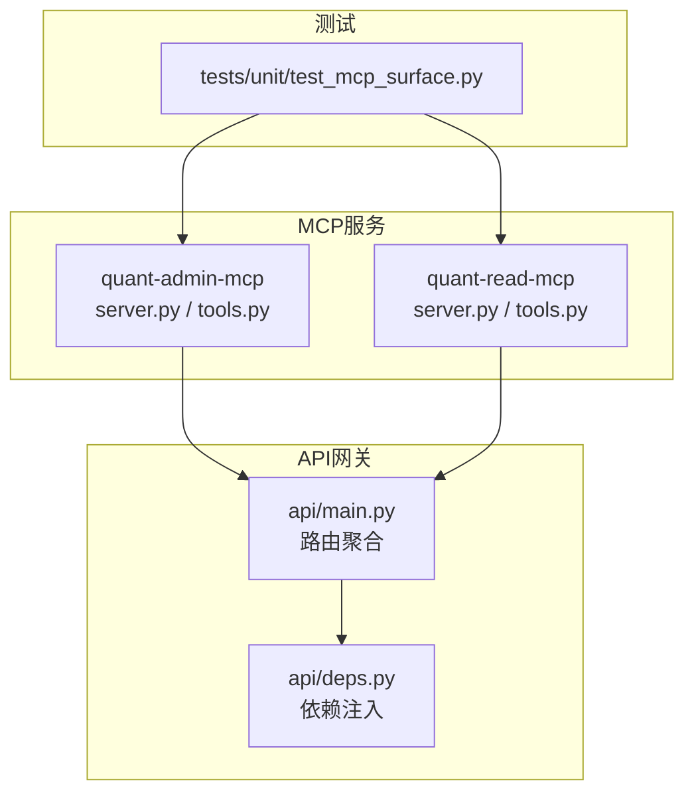
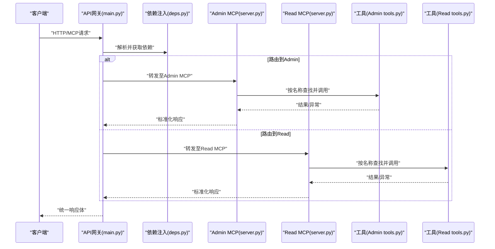
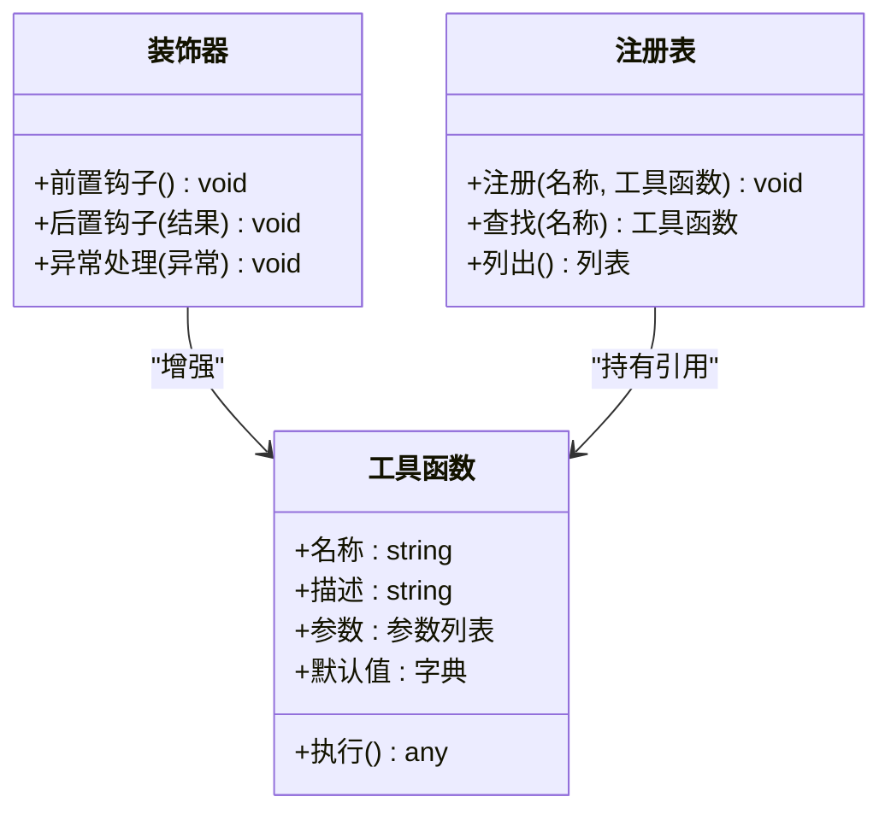
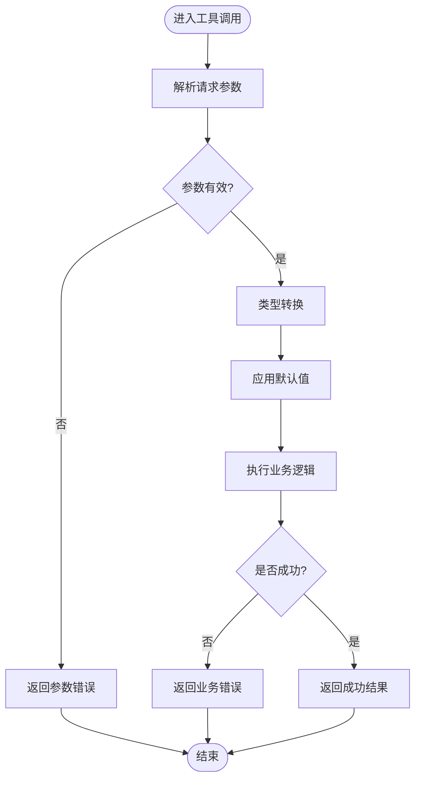
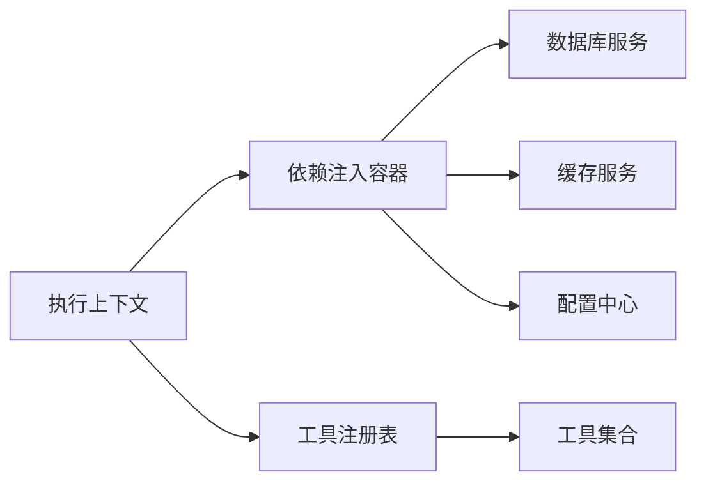
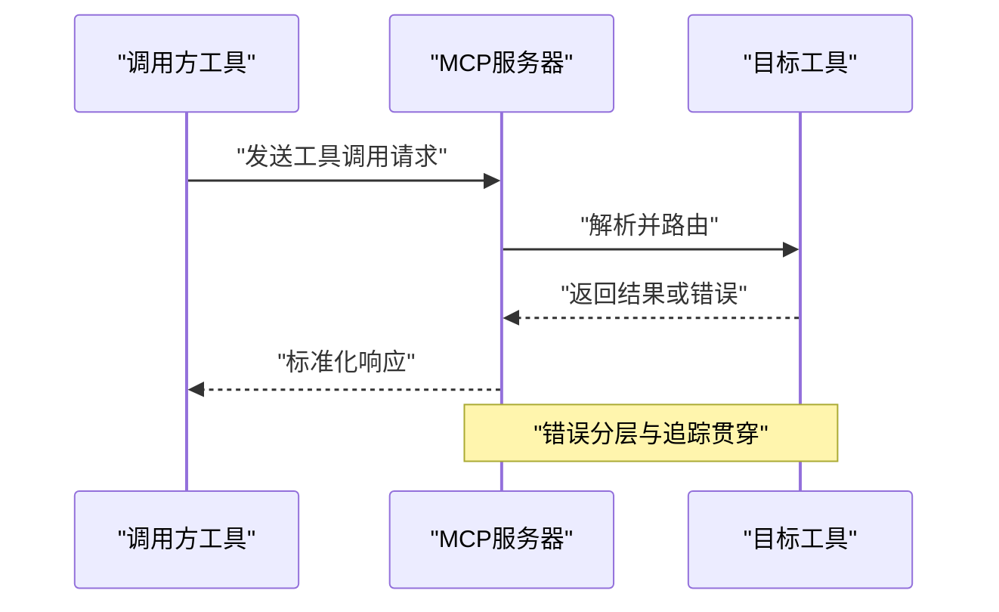
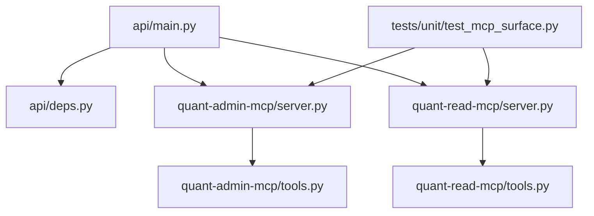

# MCP工具框架

<cite>
**本文引用的文件**   
- [apps/quant-admin-mcp/server.py](file://apps/quant-admin-mcp/server.py)
- [apps/quant-admin-mcp/tools.py](file://apps/quant-admin-mcp/tools.py)
- [apps/quant-read-mcp/server.py](file://apps/quant-read-mcp/server.py)
- [apps/quant-read-mcp/tools.py](file://apps/quant-read-mcp/tools.py)
- [apps/api/main.py](file://apps/api/main.py)
- [apps/api/deps.py](file://apps/api/deps.py)
- [tests/unit/test_mcp_surface.py](file://tests/unit/test_mcp_surface.py)
</cite>

## 目录
1. [简介](#简介)
2. [项目结构](#项目结构)
3. [核心组件](#核心组件)
4. [架构总览](#架构总览)
5. [详细组件分析](#详细组件分析)
6. [依赖分析](#依赖分析)
7. [性能考虑](#性能考虑)
8. [故障排查指南](#故障排查指南)
9. [结论](#结论)
10. [附录](#附录)

## 简介
本文件为MCP（Model Context Protocol）工具框架的架构文档，面向开发者与集成者，系统性说明：
- 工具定义规范、装饰器模式与元数据管理机制
- 参数校验、类型转换与默认值处理策略
- 执行上下文、依赖注入与服务发现机制
- 工具间通信协议、消息格式与错误传播策略
- 开发模板、测试框架与调试工具使用指南
- 版本管理、向后兼容性与灰度发布策略

该框架以“轻量注册 + 显式声明”的方式组织工具，通过统一的服务器入口暴露能力，并通过API网关或外部客户端进行调用。

## 项目结构
仓库中与MCP工具相关的代码主要位于 apps 目录下，包含两个独立的MCP服务实现（admin与read），以及一个API网关入口用于统一接入。测试用例覆盖MCP表面能力。

图示来源
- [apps/quant-admin-mcp/server.py](file://apps/quant-admin-mcp/server.py)
- [apps/quant-admin-mcp/tools.py](file://apps/quant-admin-mcp/tools.py)
- [apps/quant-read-mcp/server.py](file://apps/quant-read-mcp/server.py)
- [apps/quant-read-mcp/tools.py](file://apps/quant-read-mcp/tools.py)
- [apps/api/main.py](file://apps/api/main.py)
- [apps/api/deps.py](file://apps/api/deps.py)
- [tests/unit/test_mcp_surface.py](file://tests/unit/test_mcp_surface.py)

章节来源
- [apps/quant-admin-mcp/server.py](file://apps/quant-admin-mcp/server.py)
- [apps/quant-admin-mcp/tools.py](file://apps/quant-admin-mcp/tools.py)
- [apps/quant-read-mcp/server.py](file://apps/quant-read-mcp/server.py)
- [apps/quant-read-mcp/tools.py](file://apps/quant-read-mcp/tools.py)
- [apps/api/main.py](file://apps/api/main.py)
- [apps/api/deps.py](file://apps/api/deps.py)
- [tests/unit/test_mcp_surface.py](file://tests/unit/test_mcp_surface.py)

## 核心组件
- MCP服务器实例：每个MCP服务提供独立的服务进程，负责工具注册、生命周期管理与请求分发。
- 工具模块：集中定义工具函数及其元数据（名称、描述、参数签名、默认值等）。
- API网关：聚合多个MCP服务的能力，对外暴露统一接口，并承载鉴权、限流、可观测性等横切关注点。
- 依赖注入容器：在API层提供共享服务（如数据库连接、配置中心、日志与指标采集）的获取与装配。
- 测试套件：针对MCP表面能力的单元测试，验证工具注册、参数校验、错误返回等契约。

章节来源
- [apps/quant-admin-mcp/server.py](file://apps/quant-admin-mcp/server.py)
- [apps/quant-admin-mcp/tools.py](file://apps/quant-admin-mcp/tools.py)
- [apps/quant-read-mcp/server.py](file://apps/quant-read-mcp/server.py)
- [apps/quant-read-mcp/tools.py](file://apps/quant-read-mcp/tools.py)
- [apps/api/main.py](file://apps/api/main.py)
- [apps/api/deps.py](file://apps/api/deps.py)
- [tests/unit/test_mcp_surface.py](file://tests/unit/test_mcp_surface.py)

## 架构总览
下图展示了从客户端到MCP工具的端到端调用路径，包括API网关、依赖注入、MCP服务器与工具执行的交互。

图示来源
- [apps/api/main.py](file://apps/api/main.py)
- [apps/api/deps.py](file://apps/api/deps.py)
- [apps/quant-admin-mcp/server.py](file://apps/quant-admin-mcp/server.py)
- [apps/quant-read-mcp/server.py](file://apps/quant-read-mcp/server.py)
- [apps/quant-admin-mcp/tools.py](file://apps/quant-admin-mcp/tools.py)
- [apps/quant-read-mcp/tools.py](file://apps/quant-read-mcp/tools.py)

## 详细组件分析

### 工具定义规范与装饰器模式
- 工具命名与元数据
  - 每个工具需提供稳定且唯一的名称、人类可读的描述、参数列表及可选默认值。
  - 建议将元数据集中在工具模块中，便于扫描与注册。
- 装饰器模式
  - 通过装饰器对工具函数进行增强，例如自动记录日志、度量指标、权限校验、重试与超时控制。
  - 装饰器应保证不改变函数签名语义，仅扩展横切行为。
- 元数据管理
  - 工具注册表维护“名称→工具函数+元数据”的映射，支持动态发现与热更新。
  - 元数据需包含版本信息、兼容性标签与弃用提示，以便客户端适配。

章节来源
- [apps/quant-admin-mcp/tools.py](file://apps/quant-admin-mcp/tools.py)
- [apps/quant-read-mcp/tools.py](file://apps/quant-read-mcp/tools.py)

#### 类图：工具与装饰器关系

图示来源
- [apps/quant-admin-mcp/tools.py](file://apps/quant-admin-mcp/tools.py)
- [apps/quant-read-mcp/tools.py](file://apps/quant-read-mcp/tools.py)

### 参数验证、类型转换与默认值处理
- 参数校验
  - 在服务入口处对输入进行强校验，拒绝非法参数并返回明确错误码与消息。
  - 支持范围检查、枚举校验、必填项校验与自定义规则。
- 类型转换
  - 将外部传入的字符串/JSON转换为内部类型（如日期、数值、枚举），失败时给出具体字段级错误。
- 默认值处理
  - 未提供的参数采用安全默认值；若默认值存在业务约束，需在元数据中标注。
- 错误传播
  - 参数错误优先于业务错误，确保快速失败与清晰定位。

图示来源
- [apps/quant-admin-mcp/server.py](file://apps/quant-admin-mcp/server.py)
- [apps/quant-read-mcp/server.py](file://apps/quant-read-mcp/server.py)
- [apps/quant-admin-mcp/tools.py](file://apps/quant-admin-mcp/tools.py)
- [apps/quant-read-mcp/tools.py](file://apps/quant-read-mcp/tools.py)

### 执行上下文、依赖注入与服务发现
- 执行上下文
  - 每次工具调用携带上下文对象，包含请求ID、用户身份、租户标识、追踪ID、时间戳等。
  - 上下文贯穿整个调用链，用于审计、追踪与多租户隔离。
- 依赖注入
  - 通过依赖注入容器提供共享服务（数据库、缓存、消息队列、配置中心、日志与指标）。
  - 工具函数通过上下文或装饰器透明获取依赖，避免硬编码耦合。
- 服务发现
  - 工具注册表作为本地服务发现，支持按名称检索与版本过滤。
  - 跨进程场景可通过API网关的路由表进行服务发现与负载均衡。

图示来源
- [apps/api/deps.py](file://apps/api/deps.py)
- [apps/quant-admin-mcp/server.py](file://apps/quant-admin-mcp/server.py)
- [apps/quant-read-mcp/server.py](file://apps/quant-read-mcp/server.py)

### 工具间通信协议、消息格式与错误传播策略
- 通信协议
  - 建议使用结构化消息（如JSON-RPC或自定义信封）进行工具间通信，明确方法名、参数与回调。
- 消息格式
  - 统一响应体包含状态码、数据载荷、错误详情与追踪信息。
  - 错误对象包含错误码、错误消息、堆栈摘要与上下文快照。
- 错误传播
  - 参数错误、业务错误与系统错误分层处理，向上层传递最小必要信息，保留完整日志。
  - 支持幂等键与重试策略，避免重复副作用。

图示来源
- [apps/quant-admin-mcp/server.py](file://apps/quant-admin-mcp/server.py)
- [apps/quant-read-mcp/server.py](file://apps/quant-read-mcp/server.py)

### 工具开发模板、测试框架与调试工具
- 开发模板
  - 新建工具时遵循“工具函数 + 装饰器 + 元数据声明 + 注册表注册”的标准流程。
  - 在工具模块中集中定义参数校验与默认值，保持单一职责。
- 测试框架
  - 使用单元测试模拟外部依赖，断言参数校验、类型转换、默认值与错误路径。
  - 针对MCP表面能力编写集成测试，覆盖路由、上下文与响应格式。
- 调试工具
  - 启用详细日志与追踪ID，结合指标采集定位瓶颈。
  - 提供沙箱环境进行灰度验证与回归测试。

章节来源
- [tests/unit/test_mcp_surface.py](file://tests/unit/test_mcp_surface.py)
- [apps/quant-admin-mcp/tools.py](file://apps/quant-admin-mcp/tools.py)
- [apps/quant-read-mcp/tools.py](file://apps/quant-read-mcp/tools.py)

### 版本管理、向后兼容性与灰度发布策略
- 版本管理
  - 工具元数据包含版本号与兼容性标签，支持多版本并存。
  - 变更遵循语义化版本，重大变更引入新工具名或版本后缀。
- 向后兼容
  - 新增可选参数并提供默认值；废弃字段标记弃用期与迁移指引。
  - 参数校验策略逐步收紧，避免破坏性变更。
- 灰度发布
  - 通过API网关按租户或流量比例路由到新工具版本。
  - 结合指标与错误率阈值进行自动回滚。

章节来源
- [apps/api/main.py](file://apps/api/main.py)
- [apps/quant-admin-mcp/server.py](file://apps/quant-admin-mcp/server.py)
- [apps/quant-read-mcp/server.py](file://apps/quant-read-mcp/server.py)

## 依赖分析
MCP服务与API网关之间的依赖关系如下：

图示来源
- [apps/api/main.py](file://apps/api/main.py)
- [apps/api/deps.py](file://apps/api/deps.py)
- [apps/quant-admin-mcp/server.py](file://apps/quant-admin-mcp/server.py)
- [apps/quant-read-mcp/server.py](file://apps/quant-read-mcp/server.py)
- [apps/quant-admin-mcp/tools.py](file://apps/quant-admin-mcp/tools.py)
- [apps/quant-read-mcp/tools.py](file://apps/quant-read-mcp/tools.py)
- [tests/unit/test_mcp_surface.py](file://tests/unit/test_mcp_surface.py)

章节来源
- [apps/api/main.py](file://apps/api/main.py)
- [apps/api/deps.py](file://apps/api/deps.py)
- [apps/quant-admin-mcp/server.py](file://apps/quant-admin-mcp/server.py)
- [apps/quant-read-mcp/server.py](file://apps/quant-read-mcp/server.py)
- [apps/quant-admin-mcp/tools.py](file://apps/quant-admin-mcp/tools.py)
- [apps/quant-read-mcp/tools.py](file://apps/quant-read-mcp/tools.py)
- [tests/unit/test_mcp_surface.py](file://tests/unit/test_mcp_surface.py)

## 性能考虑
- 减少序列化开销：尽量复用数据结构，避免深层嵌套。
- 连接池与缓存：数据库与外部服务访问使用连接池与缓存命中。
- 异步与并发：I/O密集型操作采用异步模型，合理设置超时与重试。
- 监控与告警：关键路径埋点，建立延迟与错误率基线。

[本节为通用指导，无需特定文件来源]

## 故障排查指南
- 常见问题
  - 参数校验失败：检查请求体结构与类型，确认必填项与默认值。
  - 依赖不可用：确认依赖注入容器初始化与外部服务连通性。
  - 路由错误：核对API网关路由表与MCP服务健康状态。
- 诊断步骤
  - 查看追踪ID与日志链路，定位失败节点。
  - 复现实例：使用测试套件与沙箱环境重现问题。
  - 灰度回滚：根据指标阈值触发回滚策略。

章节来源
- [tests/unit/test_mcp_surface.py](file://tests/unit/test_mcp_surface.py)
- [apps/api/main.py](file://apps/api/main.py)
- [apps/api/deps.py](file://apps/api/deps.py)

## 结论
本框架通过清晰的工具定义规范、装饰器增强与元数据管理，实现了高内聚、低耦合的工具生态。配合统一的API网关与依赖注入，提供了可扩展、可观测、可治理的工具运行环境。建议在后续迭代中持续完善版本管理与灰度发布能力，提升系统的稳定性与演进效率。

[本节为总结性内容，无需特定文件来源]

## 附录
- 术语
  - MCP：Model Context Protocol，模型上下文协议
  - 工具：可被调用的业务功能单元
  - 装饰器：在不修改原函数签名的前提下增强其行为的包装器
  - 依赖注入：运行时提供依赖对象的机制
- 参考
  - 测试用例：MCP表面能力验证
  - 服务入口：各MCP服务的server.py
  - 工具实现：各MCP服务的tools.py

[本节为补充信息，无需特定文件来源]