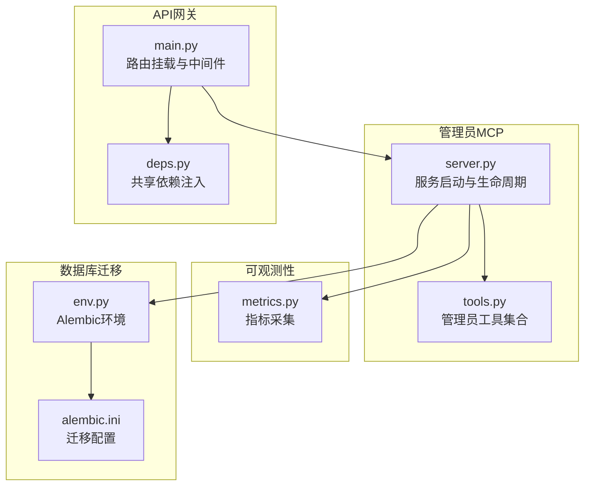
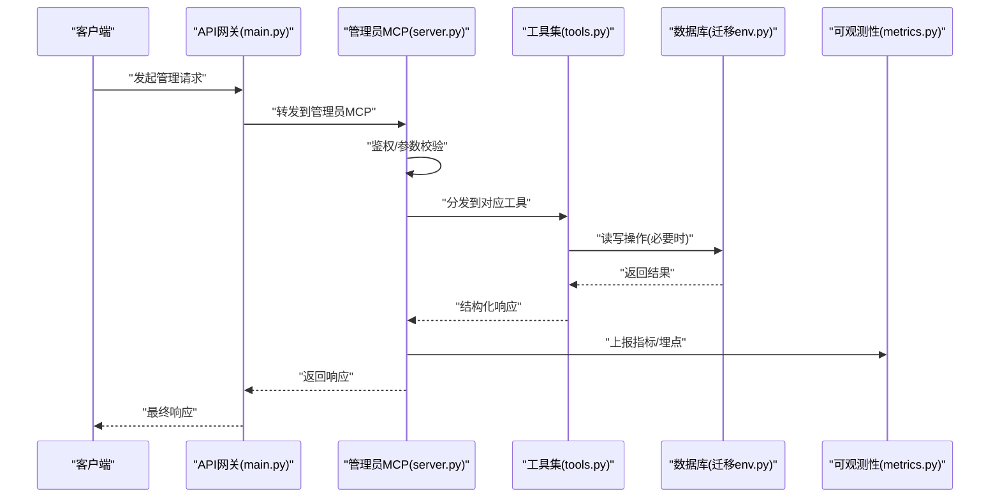
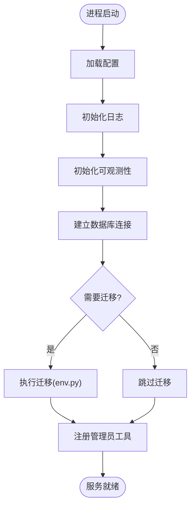
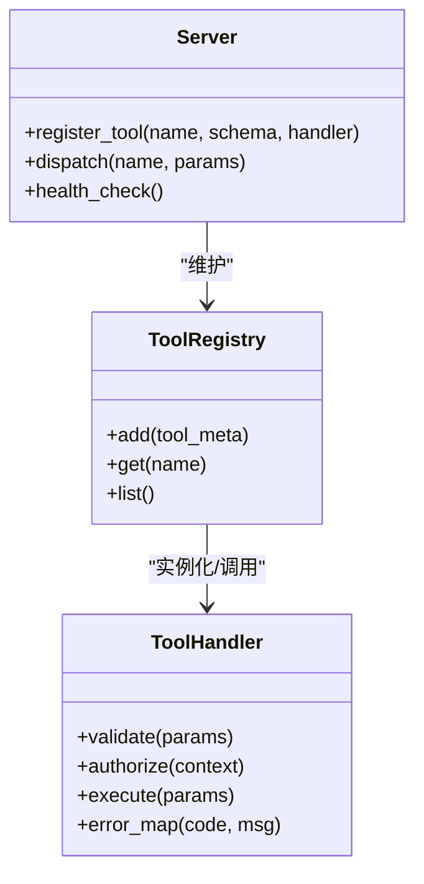
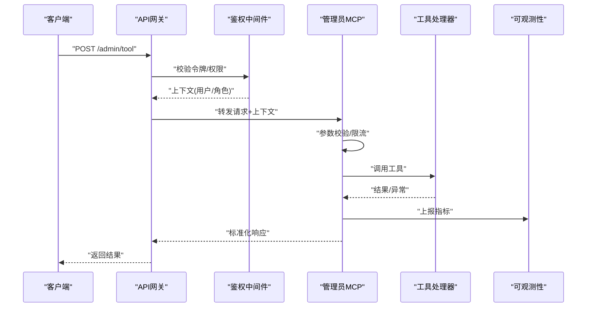
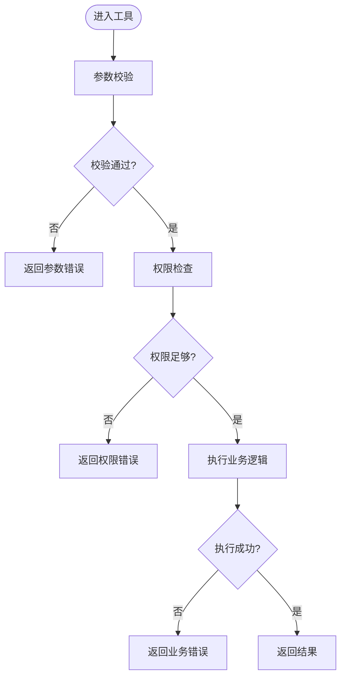
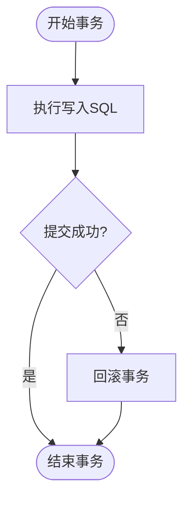
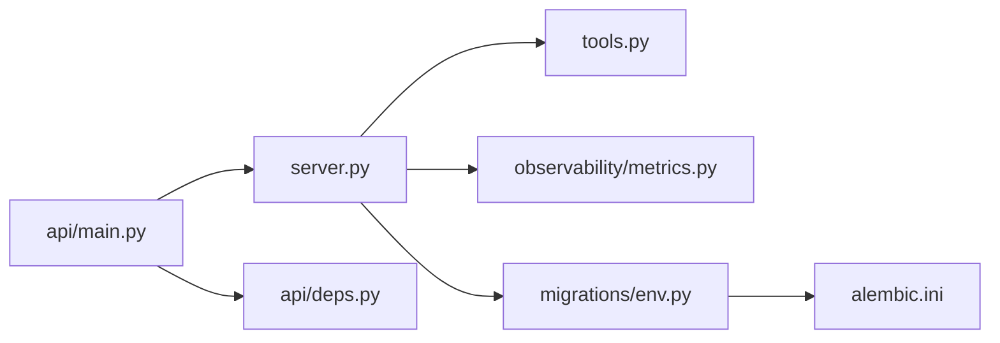

# 管理员MCP代理

<cite>
**本文引用的文件**   
- [apps/quant-admin-mcp/server.py](file://apps/quant-admin-mcp/server.py)
- [apps/quant-admin-mcp/tools.py](file://apps/quant-admin-mcp/tools.py)
- [apps/api/main.py](file://apps/api/main.py)
- [apps/api/deps.py](file://apps/api/deps.py)
- [packages/observability/metrics.py](file://packages/observability/metrics.py)
- [sql/migrations/env.py](file://sql/migrations/env.py)
- [alembic.ini](file://alembic.ini)
</cite>

## 目录
1. [简介](#简介)
2. [项目结构](#项目结构)
3. [核心组件](#核心组件)
4. [架构总览](#架构总览)
5. [详细组件分析](#详细组件分析)
6. [依赖关系分析](#依赖关系分析)
7. [性能考虑](#性能考虑)
8. [故障排查指南](#故障排查指南)
9. [结论](#结论)
10. [附录](#附录)

## 简介
本文件面向“管理员MCP代理”的技术实现与使用，聚焦以下目标：
- 明确管理员代理的核心职责：系统管理、配置管理与监控。
- 描述服务器初始化流程、工具注册机制与请求处理管道。
- 解释管理员工具的实现模式：参数校验、权限控制与错误处理。
- 记录与数据库的交互方式、事务管理与数据一致性保证。
- 提供自定义管理工具的扩展指南与最佳实践。
- 给出性能优化策略与故障恢复机制建议。

## 项目结构
管理员MCP代理位于 apps/quant-admin-mcp 目录下，包含服务启动入口与工具定义；API 层在 apps/api 下，负责对外暴露接口并注入共享依赖；可观测性与迁移脚本分别位于 packages/observability 与 sql/migrations。

图表来源
- [apps/quant-admin-mcp/server.py](file://apps/quant-admin-mcp/server.py)
- [apps/quant-admin-mcp/tools.py](file://apps/quant-admin-mcp/tools.py)
- [apps/api/main.py](file://apps/api/main.py)
- [apps/api/deps.py](file://apps/api/deps.py)
- [packages/observability/metrics.py](file://packages/observability/metrics.py)
- [sql/migrations/env.py](file://sql/migrations/env.py)
- [alembic.ini](file://alembic.ini)

章节来源
- [apps/quant-admin-mcp/server.py](file://apps/quant-admin-mcp/server.py)
- [apps/quant-admin-mcp/tools.py](file://apps/quant-admin-mcp/tools.py)
- [apps/api/main.py](file://apps/api/main.py)
- [apps/api/deps.py](file://apps/api/deps.py)
- [packages/observability/metrics.py](file://packages/observability/metrics.py)
- [sql/migrations/env.py](file://sql/migrations/env.py)
- [alembic.ini](file://alembic.ini)

## 核心组件
- 服务器（server.py）
  - 负责进程启动、生命周期钩子、日志与可观测性接入、工具注册表构建、健康检查与优雅关闭。
- 工具集（tools.py）
  - 集中定义管理员可用工具：系统管理、配置管理、监控查询等；统一参数校验、权限判定与错误封装。
- API网关（main.py, deps.py）
  - 挂载管理员MCP服务到HTTP/内部通道；通过依赖注入提供数据库连接、配置对象、认证上下文等。
- 可观测性（metrics.py）
  - 暴露关键指标（如工具调用次数、耗时、错误率），供监控系统抓取。
- 迁移与环境（env.py, alembic.ini）
  - 提供数据库版本演进能力，确保结构变更的可追溯与回滚。

章节来源
- [apps/quant-admin-mcp/server.py](file://apps/quant-admin-mcp/server.py)
- [apps/quant-admin-mcp/tools.py](file://apps/quant-admin-mcp/tools.py)
- [apps/api/main.py](file://apps/api/main.py)
- [apps/api/deps.py](file://apps/api/deps.py)
- [packages/observability/metrics.py](file://packages/observability/metrics.py)
- [sql/migrations/env.py](file://sql/migrations/env.py)
- [alembic.ini](file://alembic.ini)

## 架构总览
管理员MCP代理作为独立服务被API网关集成，对外暴露管理面能力。其核心流程包括：
- 启动阶段：加载配置、初始化日志与指标、建立数据库连接、执行必要迁移、注册工具。
- 运行阶段：接收请求 -> 鉴权与参数校验 -> 路由至具体工具 -> 执行业务逻辑 -> 返回结果与指标上报。
- 关闭阶段：优雅停止任务、释放资源、持久化状态（如有）。

图表来源
- [apps/api/main.py](file://apps/api/main.py)
- [apps/quant-admin-mcp/server.py](file://apps/quant-admin-mcp/server.py)
- [apps/quant-admin-mcp/tools.py](file://apps/quant-admin-mcp/tools.py)
- [sql/migrations/env.py](file://sql/migrations/env.py)
- [packages/observability/metrics.py](file://packages/observability/metrics.py)

## 详细组件分析

### 服务器初始化流程（server.py）
- 配置加载：从配置文件或环境变量读取运行时参数（端口、日志级别、数据库URL等）。
- 日志与可观测性：初始化日志器、设置采样率、注册指标收集器。
- 数据库连接：创建连接池、测试连通性、按需执行迁移。
- 工具注册：扫描工具模块，将工具元数据与实现绑定到调度器。
- 生命周期钩子：注册启动后与关闭前回调，用于资源清理与状态保存。

图表来源
- [apps/quant-admin-mcp/server.py](file://apps/quant-admin-mcp/server.py)
- [sql/migrations/env.py](file://sql/migrations/env.py)

章节来源
- [apps/quant-admin-mcp/server.py](file://apps/quant-admin-mcp/server.py)
- [sql/migrations/env.py](file://sql/migrations/env.py)

### 工具注册机制（server.py + tools.py）
- 工具发现：通过约定式命名或显式声明的方式发现工具函数/类。
- 元数据绑定：为每个工具附加名称、描述、参数Schema、权限标签与超时限制。
- 调度器注册：将工具映射到内部路由表，支持按名称动态调用。
- 版本兼容：工具升级时保持向后兼容，废弃字段需保留默认值。

图表来源
- [apps/quant-admin-mcp/server.py](file://apps/quant-admin-mcp/server.py)
- [apps/quant-admin-mcp/tools.py](file://apps/quant-admin-mcp/tools.py)

章节来源
- [apps/quant-admin-mcp/server.py](file://apps/quant-admin-mcp/server.py)
- [apps/quant-admin-mcp/tools.py](file://apps/quant-admin-mcp/tools.py)

### 请求处理管道（API网关 -> 管理员MCP）
- 鉴权：基于令牌或证书验证调用者身份，解析角色与权限范围。
- 参数校验：依据工具Schema对输入进行强类型校验与约束检查。
- 限流与熔断：对管理面接口实施速率限制与熔断保护。
- 追踪与埋点：为每次调用生成唯一ID，关联日志与指标。
- 响应封装：统一成功/失败格式，附带trace_id与错误码。

图表来源
- [apps/api/main.py](file://apps/api/main.py)
- [apps/api/deps.py](file://apps/api/deps.py)
- [apps/quant-admin-mcp/server.py](file://apps/quant-admin-mcp/server.py)
- [packages/observability/metrics.py](file://packages/observability/metrics.py)

章节来源
- [apps/api/main.py](file://apps/api/main.py)
- [apps/api/deps.py](file://apps/api/deps.py)
- [apps/quant-admin-mcp/server.py](file://apps/quant-admin-mcp/server.py)
- [packages/observability/metrics.py](file://packages/observability/metrics.py)

### 管理员工具实现模式（tools.py）
- 参数校验：采用声明式Schema（类型、必填、枚举、范围）进行前置校验，失败即返回明确错误码。
- 权限控制：工具级权限标签与全局策略结合，拒绝越权访问。
- 错误处理：统一错误模型，区分业务错误与系统错误，便于前端展示与告警。
- 幂等设计：对写操作引入幂等键，避免重复提交导致的数据不一致。
- 超时与重试：为外部依赖调用设置超时与退避重试，防止雪崩。

图表来源
- [apps/quant-admin-mcp/tools.py](file://apps/quant-admin-mcp/tools.py)

章节来源
- [apps/quant-admin-mcp/tools.py](file://apps/quant-admin-mcp/tools.py)

### 数据库交互与一致性（env.py, alembic.ini）
- 连接与池化：通过连接池管理连接复用，减少握手开销。
- 迁移驱动：使用Alembic进行DDL变更管理，确保多实例部署的一致性。
- 事务边界：写操作包裹在事务中，失败自动回滚；读操作可走只读副本。
- 一致性保障：关键路径采用乐观锁或版本号字段，避免并发覆盖。

图表来源
- [sql/migrations/env.py](file://sql/migrations/env.py)
- [alembic.ini](file://alembic.ini)

章节来源
- [sql/migrations/env.py](file://sql/migrations/env.py)
- [alembic.ini](file://alembic.ini)

### 自定义管理工具扩展指南
- 新增步骤
  - 在工具文件中新增函数或类，遵循统一的参数Schema与返回值规范。
  - 在注册表中声明工具元数据（名称、描述、权限标签、超时）。
  - 编写单元测试覆盖正常路径与异常分支。
- 最佳实践
  - 参数校验尽量前置，尽早失败。
  - 敏感操作必须二次确认与审计日志。
  - 对外部依赖调用增加超时与熔断。
  - 所有错误信息具备人类可读性与机器可解析性。
- 兼容性
  - 不破坏已有Schema字段；新增字段提供默认值。
  - 废弃字段保留一段时间并提供迁移脚本。

章节来源
- [apps/quant-admin-mcp/tools.py](file://apps/quant-admin-mcp/tools.py)
- [apps/quant-admin-mcp/server.py](file://apps/quant-admin-mcp/server.py)

## 依赖关系分析
- 内聚与耦合
  - server.py 与 tools.py 高内聚，通过注册表解耦具体实现。
  - API网关与管理员MCP通过标准接口通信，降低耦合度。
- 外部依赖
  - 数据库：通过连接池与迁移脚本管理。
  - 可观测性：指标与日志输出到统一平台。
- 潜在循环依赖
  - 工具不应反向依赖服务器，仅通过注册表暴露能力。

图表来源
- [apps/quant-admin-mcp/server.py](file://apps/quant-admin-mcp/server.py)
- [apps/quant-admin-mcp/tools.py](file://apps/quant-admin-mcp/tools.py)
- [apps/api/main.py](file://apps/api/main.py)
- [apps/api/deps.py](file://apps/api/deps.py)
- [packages/observability/metrics.py](file://packages/observability/metrics.py)
- [sql/migrations/env.py](file://sql/migrations/env.py)
- [alembic.ini](file://alembic.ini)

章节来源
- [apps/quant-admin-mcp/server.py](file://apps/quant-admin-mcp/server.py)
- [apps/quant-admin-mcp/tools.py](file://apps/quant-admin-mcp/tools.py)
- [apps/api/main.py](file://apps/api/main.py)
- [apps/api/deps.py](file://apps/api/deps.py)
- [packages/observability/metrics.py](file://packages/observability/metrics.py)
- [sql/migrations/env.py](file://sql/migrations/env.py)
- [alembic.ini](file://alembic.ini)

## 性能考虑
- 连接池与并发
  - 合理设置连接池大小与最大队列长度，避免连接耗尽。
  - 对CPU密集型工具启用线程池或进程池隔离。
- 缓存与去重
  - 对只读查询引入本地或分布式缓存，缩短P99延迟。
  - 对批量导入与计算任务引入去重键，避免重复工作。
- 异步与背压
  - 长耗时任务改为异步执行，返回任务ID供轮询。
  - 对上游流量实施背压，防止过载。
- 资源隔离
  - 管理面与业务面资源隔离，避免相互影响。
- 监控与调优
  - 基于指标定位热点工具与慢查询，持续优化。

[本节为通用指导，无需特定文件引用]

## 故障排查指南
- 常见问题
  - 启动失败：检查配置项、数据库连通性与迁移状态。
  - 权限错误：核对令牌范围与工具权限标签。
  - 参数校验失败：根据错误码定位缺失或非法字段。
  - 超时与重试：查看外部依赖健康状态与重试策略。
- 诊断手段
  - 开启调试日志与Trace ID，关联上下游日志。
  - 查看指标面板：错误率、延迟分布、吞吐。
  - 审查迁移历史，确认当前版本一致。
- 恢复策略
  - 快速回滚：对最近一次变更执行回滚迁移。
  - 降级开关：临时禁用高风险工具，保障核心功能。
  - 数据修复：提供只读修复脚本与人工复核流程。

章节来源
- [packages/observability/metrics.py](file://packages/observability/metrics.py)
- [sql/migrations/env.py](file://sql/migrations/env.py)
- [alembic.ini](file://alembic.ini)

## 结论
管理员MCP代理以清晰的初始化流程、严格的工具注册机制与健壮的请求处理管道为核心，结合完善的参数校验、权限控制与错误处理，提供了稳定可靠的管理面能力。通过迁移与事务保障数据一致性，配合可观测性与性能优化策略，可在生产环境中安全高效地运行。

[本节为总结性内容，无需特定文件引用]

## 附录
- 术语
  - MCP：管理控制平面（Management Control Plane）
  - 工具：管理员可用的原子能力单元
  - 迁移：数据库结构变更的版本化管理
- 参考
  - 迁移配置：见迁移环境与Alembic配置
  - 指标定义：见可观测性模块

[本节为补充说明，无需特定文件引用]