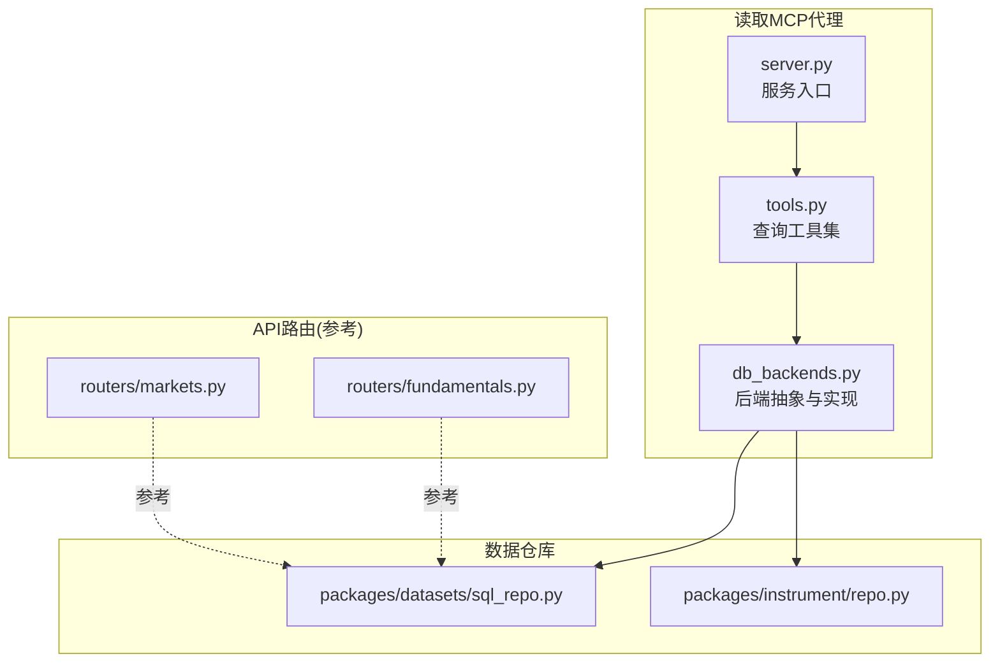
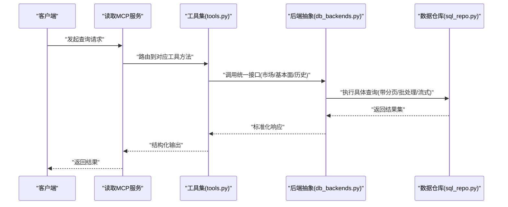
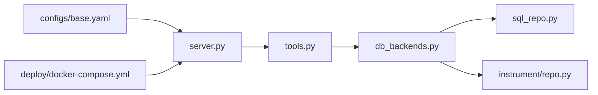

# 读取MCP代理

<cite>
**本文引用的文件**   
- [apps/quant-read-mcp/server.py](file://apps/quant-read-mcp/server.py)
- [apps/quant-read-mcp/tools.py](file://apps/quant-read-mcp/tools.py)
- [apps/quant-read-mcp/db_backends.py](file://apps/quant-read-mcp/db_backends.py)
- [apps/api/routers/markets.py](file://apps/api/routers/markets.py)
- [apps/api/routers/fundamentals.py](file://apps/api/routers/fundamentals.py)
- [packages/datasets/sql_repo.py](file://packages/datasets/sql_repo.py)
- [packages/instrument/repo.py](file://packages/instrument/repo.py)
- [configs/base.yaml](file://configs/base.yaml)
- [deploy/docker-compose.yml](file://deploy/docker-compose.yml)
</cite>

## 目录
1. [简介](#简介)
2. [项目结构](#项目结构)
3. [核心组件](#核心组件)
4. [架构总览](#架构总览)
5. [详细组件分析](#详细组件分析)
6. [依赖关系分析](#依赖关系分析)
7. [性能与优化](#性能与优化)
8. [故障排查指南](#故障排查指南)
9. [结论](#结论)
10. [附录](#附录)

## 简介
本技术文档面向“读取MCP代理”，聚焦其数据访问职责与后端抽象层设计，覆盖市场数据查询、基本面数据获取与历史数据分析能力。文档同时阐述统一数据库后端接口、查询优化策略（缓存、连接池）、批量处理、流式查询与分页机制，并提供自定义数据源集成指南、适配器开发规范以及慢查询监控方案。

## 项目结构
读取MCP代理位于 apps/quant-read-mcp 目录下，包含服务入口、工具定义与数据库后端抽象：
- server.py：MCP服务注册与生命周期管理
- tools.py：对外暴露的数据查询工具集合
- db_backends.py：多后端统一接口与具体实现选择

图表来源
- [apps/quant-read-mcp/server.py](file://apps/quant-read-mcp/server.py)
- [apps/quant-read-mcp/tools.py](file://apps/quant-read-mcp/tools.py)
- [apps/quant-read-mcp/db_backends.py](file://apps/quant-read-mcp/db_backends.py)
- [apps/api/routers/markets.py](file://apps/api/routers/markets.py)
- [apps/api/routers/fundamentals.py](file://apps/api/routers/fundamentals.py)
- [packages/datasets/sql_repo.py](file://packages/datasets/sql_repo.py)
- [packages/instrument/repo.py](file://packages/instrument/repo.py)

章节来源
- [apps/quant-read-mcp/server.py](file://apps/quant-read-mcp/server.py)
- [apps/quant-read-mcp/tools.py](file://apps/quant-read-mcp/tools.py)
- [apps/quant-read-mcp/db_backends.py](file://apps/quant-read-mcp/db_backends.py)

## 核心组件
- 服务入口(server.py)
  - 负责初始化并启动MCP服务，注册工具与中间件，提供统一的进程内或进程间通信面。
- 工具集(tools.py)
  - 封装面向用户的查询方法，包括市场数据、基本面数据与历史分析等；内部调用后端抽象层进行数据访问。
- 数据库后端抽象(db_backends.py)
  - 定义统一的数据访问接口，支持多种存储后端（如SQL、列存、时序库等）的切换与扩展；维护连接池、事务边界与错误映射。

章节来源
- [apps/quant-read-mcp/server.py](file://apps/quant-read-mcp/server.py)
- [apps/quant-read-mcp/tools.py](file://apps/quant-read-mcp/tools.py)
- [apps/quant-read-mcp/db_backends.py](file://apps/quant-read-mcp/db_backbacks.py)

## 架构总览
读取MCP代理通过工具层将业务语义转化为对后端抽象层的调用，后端再委托给具体的数据仓库实现（如SQL仓库）。该分层确保上层稳定、下层可替换。

图表来源
- [apps/quant-read-mcp/server.py](file://apps/quant-read-mcp/server.py)
- [apps/quant-read-mcp/tools.py](file://apps/quant-read-mcp/tools.py)
- [apps/quant-read-mcp/db_backends.py](file://apps/quant-read-mcp/db_backends.py)
- [packages/datasets/sql_repo.py](file://packages/datasets/sql_repo.py)

## 详细组件分析

### 工具集(tools.py)
- 职责
  - 提供市场数据查询、基本面数据获取、历史数据分析等工具方法。
  - 参数校验、上下文注入（如租户/权限）、结果格式化与错误包装。
- 关键流程
  - 输入解析与校验
  - 调用后端抽象层
  - 结果转换与分页封装
  - 异常捕获与统一错误码
- 典型工具
  - 市场数据：按标的、时间范围、频率、字段筛选
  - 基本面：公司财务指标、公告事件、估值因子
  - 历史分析：滚动窗口、聚合统计、对齐与去重

章节来源
- [apps/quant-read-mcp/tools.py](file://apps/quant-read-mcp/tools.py)

### 数据库后端抽象(db_backends.py)
- 设计目标
  - 统一接口：为不同存储后端提供一致的查询、写入、事务与元数据访问。
  - 可插拔：通过配置或运行时策略选择具体后端实现。
  - 健壮性：连接池、重试、超时、熔断与错误映射。
- 主要抽象
  - 连接管理：创建/回收连接、健康检查、最大空闲与最小活跃数
  - 查询执行：同步/异步、流式游标、批量提交
  - 事务控制：隔离级别、保存点、回滚策略
  - 元数据：表结构、索引、分区信息
- 后端选择
  - 基于配置文件或环境变量动态加载具体后端类
  - 默认后端与降级策略（主从切换、只读副本）

章节来源
- [apps/quant-read-mcp/db_backends.py](file://apps/quant-read-mcp/db_backends.py)

### 数据仓库(sql_repo.py)
- 职责
  - 将统一接口映射到SQL方言，构建高效查询计划，处理分页与批处理。
- 关键特性
  - 分页：基于偏移或键集分页，避免深分页性能问题
  - 批处理：批量插入/更新，减少往返开销
  - 流式查询：大结果集逐条消费，降低内存峰值
  - 预编译与参数化：防注入与执行计划复用
- 与后端抽象的关系
  - 作为具体后端实现之一，遵循统一接口契约

章节来源
- [packages/datasets/sql_repo.py](file://packages/datasets/sql_repo.py)

### 标的仓库(repo.py)
- 职责
  - 提供标的维度数据访问（代码、名称、交易所、状态等），供市场与基本面查询前置过滤。
- 关键特性
  - 缓存热点标的映射
  - 变更监听与失效策略
  - 与后端抽象解耦，便于替换存储

章节来源
- [packages/instrument/repo.py](file://packages/instrument/repo.py)

### API路由(参考)
- markets.py / fundamentals.py
  - 展示与读取MCP代理类似的数据访问模式，可作为对照理解工具层与后端抽象的协作方式。

章节来源
- [apps/api/routers/markets.py](file://apps/api/routers/markets.py)
- [apps/api/routers/fundamentals.py](file://apps/api/routers/fundamentals.py)

## 依赖关系分析
读取MCP代理依赖配置与部署环境，以选择后端与连接参数。

图表来源
- [configs/base.yaml](file://configs/base.yaml)
- [apps/quant-read-mcp/server.py](file://apps/quant-read-mcp/server.py)
- [apps/quant-read-mcp/tools.py](file://apps/quant-read-mcp/tools.py)
- [apps/quant-read-mcp/db_backends.py](file://apps/quant-read-mcp/db_backends.py)
- [packages/datasets/sql_repo.py](file://packages/datasets/sql_repo.py)
- [packages/instrument/repo.py](file://packages/instrument/repo.py)
- [deploy/docker-compose.yml](file://deploy/docker-compose.yml)

章节来源
- [configs/base.yaml](file://configs/base.yaml)
- [deploy/docker-compose.yml](file://deploy/docker-compose.yml)

## 性能与优化

### 查询优化策略
- 索引与谓词下推
  - 在时间戳、标的ID、频率等高频过滤字段建立合适索引
  - 利用后端能力进行谓词下推，减少数据传输量
- 分页与键集分页
  - 优先使用基于主键或时间戳的键集分页，避免深度偏移带来的扫描放大
- 批处理
  - 批量写入与批量读取，合并小事务，提升吞吐
- 流式查询
  - 对大结果集采用游标/迭代器模式，按需消费，降低内存占用

### 缓存机制
- 多级缓存
  - 本地内存缓存：热点标的映射、字典查找
  - 分布式缓存：共享热数据，跨实例一致性
- 失效策略
  - TTL过期、事件驱动失效、版本号校验
- 缓存穿透防护
  - 布隆过滤器或空值缓存

### 连接池管理
- 参数建议
  - 最大连接数、最小空闲数、最大等待队列长度
  - 连接健康检查与自动重建
- 资源释放
  - 严格的生命周期管理，避免泄漏
- 多租户隔离
  - 按租户或任务域划分连接池，防止相互影响

### 批量数据处理
- 分片与并行
  - 按时间或标的分片，并行处理，注意幂等与顺序约束
- 背压与限流
  - 根据下游容量调整批次大小与并发度
- 失败重试与补偿
  - 指数退避、死信队列、人工介入

### 流式查询与分页机制
- 流式
  - 服务端推送/客户端拉取两种模式，结合心跳保活
- 分页
  - 偏移分页用于浅页，键集分页用于深页与实时场景

### 自定义数据源集成指南
- 步骤
  - 实现后端抽象接口（连接、查询、事务、元数据）
  - 注册后端工厂，支持配置选择
  - 编写单元测试与基准测试
- 适配规范
  - 统一错误码与异常类型
  - 统一结果模型（行/列/记录流）
  - 统一日志与追踪上下文透传

### 数据适配器开发规范
- 输入校验与规范化
- 输出序列化与版本兼容
- 可观测性埋点（耗时、命中率、错误率）
- 可配置开关（功能门控、灰度发布）

### 查询性能监控与慢查询分析
- 指标采集
  - QPS、P95/P99延迟、错误率、连接池利用率、缓存命中率
- 慢查询定位
  - 开启慢查询阈值，记录SQL与执行计划
  - 关联TraceID进行端到端追踪
- 告警与治理
  - 阈值告警、自动降级、热点保护

[本节为通用指导，不直接分析具体文件]

## 故障排查指南
- 常见问题
  - 连接池耗尽：检查最大连接数与泄漏，确认长事务与未关闭游标
  - 慢查询：查看慢查询日志与执行计划，补充索引或改写SQL
  - 缓存不一致：核对失效策略与TTL，增加版本号校验
  - 分页越界：校验分页参数，改用键集分页
- 诊断手段
  - 启用调试日志与Trace
  - 导出关键指标至监控系统
  - 复现用例与回放流量

章节来源
- [apps/quant-read-mcp/db_backends.py](file://apps/quant-read-mcp/db_backends.py)
- [packages/datasets/sql_repo.py](file://packages/datasets/sql_repo.py)

## 结论
读取MCP代理通过清晰的分层与统一的后端抽象，实现了市场数据、基本面数据与历史数据的稳定访问。配合缓存、连接池、批处理与流式查询等优化手段，可在高并发与大数据量场景下保持良好性能与可扩展性。遵循适配器与自定义数据源的规范，可快速接入新的存储后端，满足多样化业务需求。

## 附录

### 配置项参考
- 后端选择与连接参数
  - 后端类型、主机/端口、数据库名、用户名/密码
  - 连接池大小、超时、重试次数
- 缓存与监控
  - 缓存TTL、命中率阈值
  - 慢查询阈值、指标上报地址

章节来源
- [configs/base.yaml](file://configs/base.yaml)

### 部署参考
- 容器编排与服务发现
  - 服务端口、环境变量注入、健康检查探针
  - 外部依赖（数据库、缓存、消息队列）网络连通性

章节来源
- [deploy/docker-compose.yml](file://deploy/docker-compose.yml)