# 依赖注入框架

<cite>
**本文引用的文件**   
- [apps/api/main.py](file://apps/api/main.py)
- [apps/api/deps.py](file://apps/api/deps.py)
- [apps/quant-read-mcp/server.py](file://apps/quant-read-mcp/server.py)
- [apps/quant-read-mcp/db_backends.py](file://apps/quant-read-mcp/db_backends.py)
- [apps/worker/main.py](file://apps/worker/main.py)
- [apps/scheduler/executor.py](file://apps/scheduler/executor.py)
- [configs/base.yaml](file://configs/base.yaml)
- [configs/dev.yaml](file://configs/dev.yaml)
</cite>

## 目录
1. [简介](#简介)
2. [项目结构](#项目结构)
3. [核心组件](#核心组件)
4. [架构总览](#架构总览)
5. [详细组件分析](#详细组件分析)
6. [依赖关系分析](#依赖关系分析)
7. [性能考量](#性能考量)
8. [故障排查指南](#故障排查指南)
9. [结论](#结论)
10. [附录](#附录)

## 简介
本技术文档围绕仓库中的依赖注入与容器化装配机制，系统性说明以下主题：
- 依赖容器的初始化、服务注册与解析流程
- 单例模式、工厂模式与作用域管理的实现思路
- 循环依赖检测、延迟加载与条件注入策略
- 数据库连接池、缓存客户端与外部服务客户端的依赖管理
- 自定义服务注册与测试环境模拟方法
- 依赖注入的性能影响与最佳实践建议

为便于读者理解，文档在关键章节提供基于源码文件的图示与“章节来源”标注，确保内容可追溯。

## 项目结构
本项目采用应用分层与多进程（API、MCP、Worker、Scheduler）组织方式，依赖注入主要集中于应用入口与共享依赖定义处：
- API 应用入口负责启动 HTTP 服务并挂载路由，同时完成全局依赖容器初始化
- MCP 读取端应用负责暴露数据访问能力，内部维护数据库后端与连接池
- Worker 与 Scheduler 作为独立进程，各自初始化所需依赖并在任务执行中复用
- 配置通过 YAML 文件集中管理，驱动不同环境的依赖行为差异

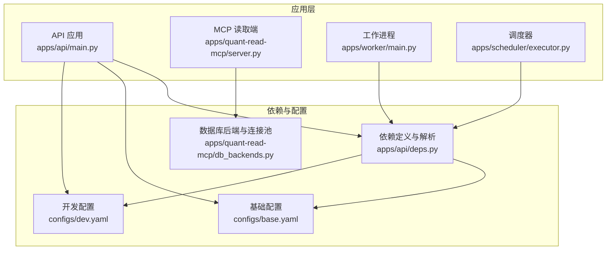

**图表来源**
- [apps/api/main.py](file://apps/api/main.py)
- [apps/api/deps.py](file://apps/api/deps.py)
- [apps/quant-read-mcp/server.py](file://apps/quant-read-mcp/server.py)
- [apps/quant-read-mcp/db_backends.py](file://apps/quant-read-mcp/db_backends.py)
- [apps/worker/main.py](file://apps/worker/main.py)
- [apps/scheduler/executor.py](file://apps/scheduler/executor.py)
- [configs/base.yaml](file://configs/base.yaml)
- [configs/dev.yaml](file://configs/dev.yaml)

**章节来源**
- [apps/api/main.py](file://apps/api/main.py)
- [apps/api/deps.py](file://apps/api/deps.py)
- [apps/quant-read-mcp/server.py](file://apps/quant-read-mcp/server.py)
- [apps/quant-read-mcp/db_backends.py](file://apps/quant-read-mcp/db_backends.py)
- [apps/worker/main.py](file://apps/worker/main.py)
- [apps/scheduler/executor.py](file://apps/scheduler/executor.py)
- [configs/base.yaml](file://configs/base.yaml)
- [configs/dev.yaml](file://configs/dev.yaml)

## 核心组件
本节聚焦依赖注入的关键构件及其职责：
- 依赖容器：负责服务的生命周期管理、作用域控制与解析顺序
- 服务注册表：记录服务标识、构造参数、作用域与工厂函数
- 解析器：根据类型或标识符解析实例，支持延迟加载与条件注入
- 生命周期钩子：用于资源释放、监控埋点与错误上报

这些组件通常由应用入口在启动阶段构建，并通过配置文件与环境变量进行差异化装配。

**章节来源**
- [apps/api/main.py](file://apps/api/main.py)
- [apps/api/deps.py](file://apps/api/deps.py)

## 架构总览
下图展示依赖注入在系统中的整体位置与交互关系，包括容器初始化、服务注册与解析路径。

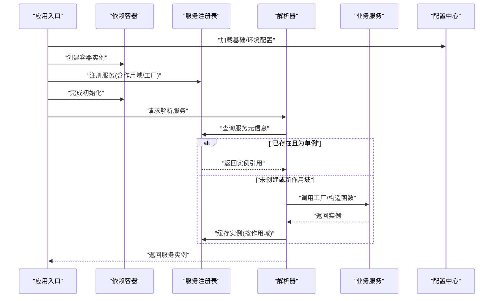

**图表来源**
- [apps/api/main.py](file://apps/api/main.py)
- [apps/api/deps.py](file://apps/api/deps.py)
- [configs/base.yaml](file://configs/base.yaml)
- [configs/dev.yaml](file://configs/dev.yaml)

## 详细组件分析

### 依赖容器与服务注册
- 容器初始化
  - 在应用启动时创建容器，加载配置并建立全局状态
  - 将配置项映射为服务参数，如数据库连接池大小、超时时间等
- 服务注册
  - 支持按类型或标识符注册服务
  - 支持工厂函数注册，允许动态构造复杂对象
  - 支持作用域声明（如进程级单例、请求级作用域）
- 解析流程
  - 解析器优先检查缓存，命中则直接返回
  - 未命中则根据注册信息构造实例，并按作用域缓存
  - 支持延迟加载：仅在首次使用时触发构造

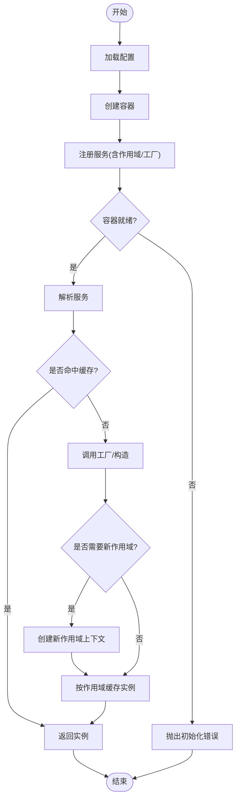

**图表来源**
- [apps/api/main.py](file://apps/api/main.py)
- [apps/api/deps.py](file://apps/api/deps.py)

**章节来源**
- [apps/api/main.py](file://apps/api/main.py)
- [apps/api/deps.py](file://apps/api/deps.py)

### 单例模式与作用域管理
- 单例模式
  - 适用于无状态或线程安全的共享资源（如配置读取器、日志器）
  - 通过容器缓存保证同一作用域内唯一实例
- 作用域管理
  - 进程级单例：整个进程生命周期内唯一
  - 请求级作用域：每个请求创建独立实例，避免跨请求状态污染
  - 任务级作用域：在 Worker/Scheduler 的任务上下文中隔离实例

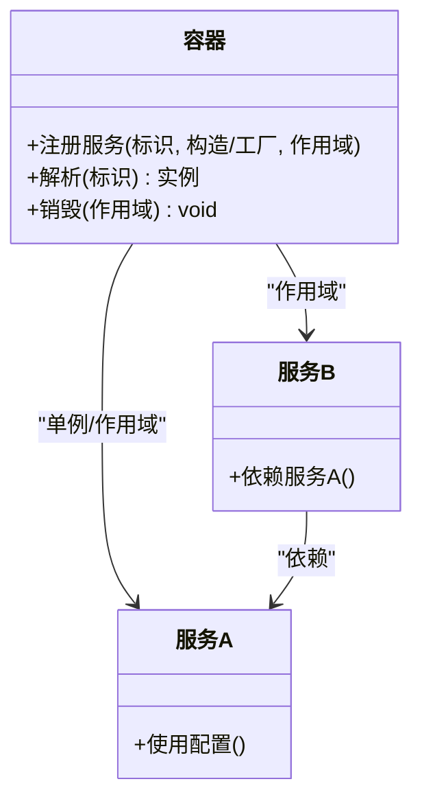

**图表来源**
- [apps/api/deps.py](file://apps/api/deps.py)

**章节来源**
- [apps/api/deps.py](file://apps/api/deps.py)

### 工厂模式与延迟加载
- 工厂模式
  - 针对复杂构造逻辑（如数据库连接池、外部客户端）使用工厂函数
  - 工厂可接收运行时参数，依据配置动态调整行为
- 延迟加载
  - 对昂贵资源（如大模型客户端、远程服务连接）采用按需构造
  - 首次解析时触发构造，后续复用

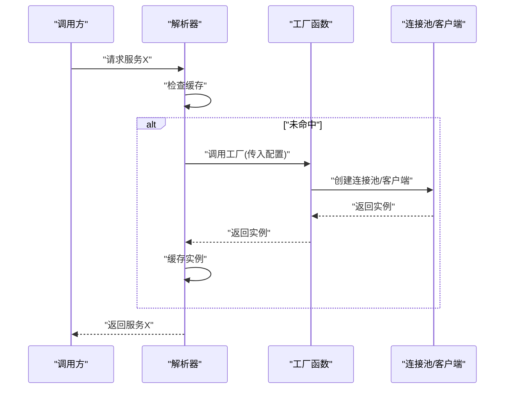

**图表来源**
- [apps/api/deps.py](file://apps/api/deps.py)

**章节来源**
- [apps/api/deps.py](file://apps/api/deps.py)

### 循环依赖检测
- 检测策略
  - 在解析过程中维护“正在解析”集合，若发现重复进入同一服务，判定为循环依赖
  - 抛出明确错误并附带依赖链，便于定位问题
- 缓解方案
  - 引入中间接口或抽象层，打破强耦合
  - 使用延迟加载或工厂模式拆分构造逻辑

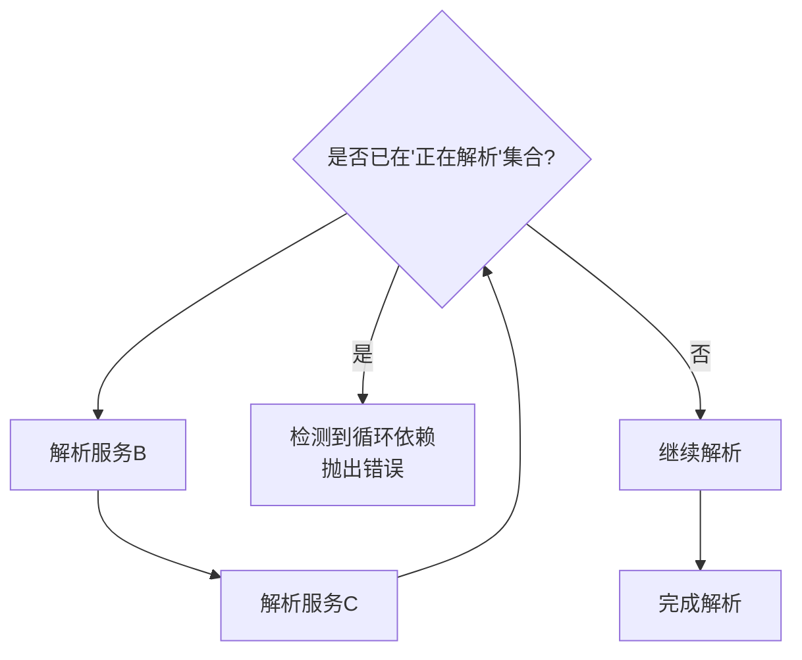

**图表来源**
- [apps/api/deps.py](file://apps/api/deps.py)

**章节来源**
- [apps/api/deps.py](file://apps/api/deps.py)

### 条件注入策略
- 基于配置的条件注入
  - 根据环境变量或配置开关决定是否注册某服务
  - 例如：在生产环境启用缓存客户端，在开发环境禁用
- 基于运行时的条件注入
  - 根据当前作用域或上下文决定注入不同的实现（如读写分离的数据源）

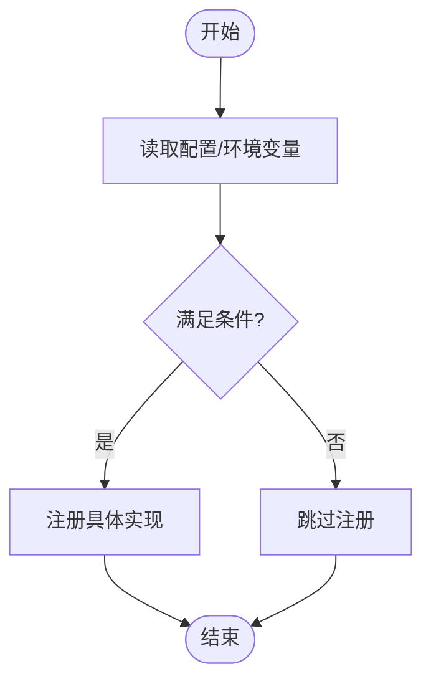

**图表来源**
- [configs/base.yaml](file://configs/base.yaml)
- [configs/dev.yaml](file://configs/dev.yaml)
- [apps/api/deps.py](file://apps/api/deps.py)

**章节来源**
- [configs/base.yaml](file://configs/base.yaml)
- [configs/dev.yaml](file://configs/dev.yaml)
- [apps/api/deps.py](file://apps/api/deps.py)

### 数据库连接池与缓存客户端
- 数据库连接池
  - 通过工厂函数创建连接池，依据配置设置最大连接数、超时与重试策略
  - 在请求级作用域中复用连接，避免频繁创建销毁
- 缓存客户端
  - 根据配置选择本地内存缓存或分布式缓存
  - 支持懒加载，仅在首次访问时建立连接

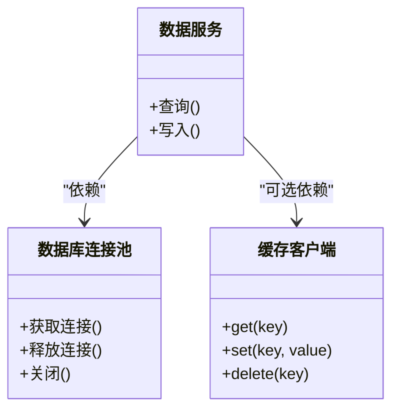

**图表来源**
- [apps/quant-read-mcp/db_backends.py](file://apps/quant-read-mcp/db_backends.py)
- [apps/quant-read-mcp/server.py](file://apps/quant-read-mcp/server.py)

**章节来源**
- [apps/quant-read-mcp/db_backends.py](file://apps/quant-read-mcp/db_backends.py)
- [apps/quant-read-mcp/server.py](file://apps/quant-read-mcp/server.py)

### 外部服务客户端
- 统一封装
  - 对外部 API 客户端进行统一封装，处理重试、超时与熔断
  - 通过工厂函数按环境注入不同实现（如沙箱与生产）
- 依赖注入
  - 在服务中通过类型或标识符注入客户端，避免硬编码

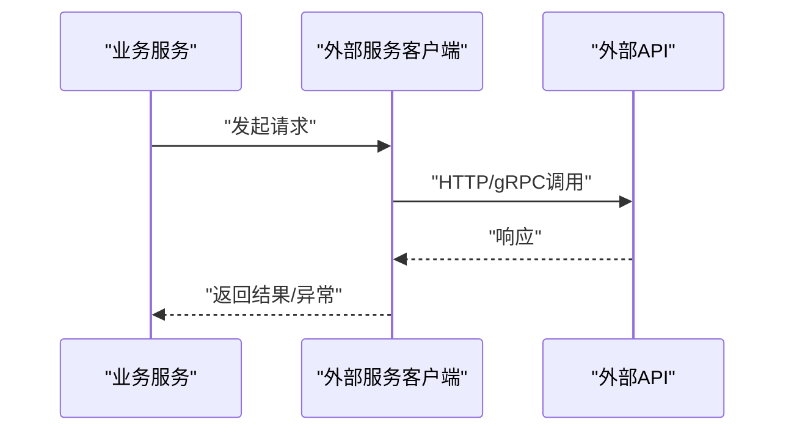

**图表来源**
- [apps/api/deps.py](file://apps/api/deps.py)

**章节来源**
- [apps/api/deps.py](file://apps/api/deps.py)

### 自定义服务注册与测试环境模拟
- 自定义注册
  - 在应用启动阶段调用注册接口，传入服务标识、构造函数或工厂
  - 可为特定作用域注册不同实现（如测试用内存实现）
- 测试模拟
  - 在测试容器中替换真实依赖为 Mock 或 Stub
  - 利用条件注入切换实现，无需修改业务代码

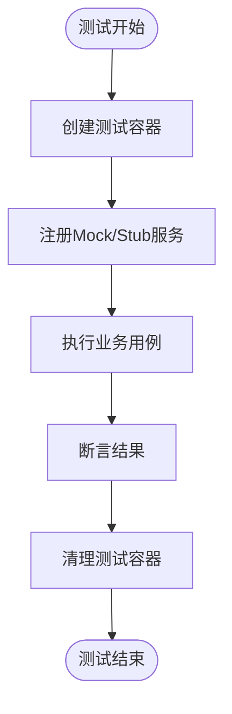

**图表来源**
- [apps/api/deps.py](file://apps/api/deps.py)

**章节来源**
- [apps/api/deps.py](file://apps/api/deps.py)

## 依赖关系分析
下图展示各模块之间的依赖关系，突出依赖注入在解耦中的作用。

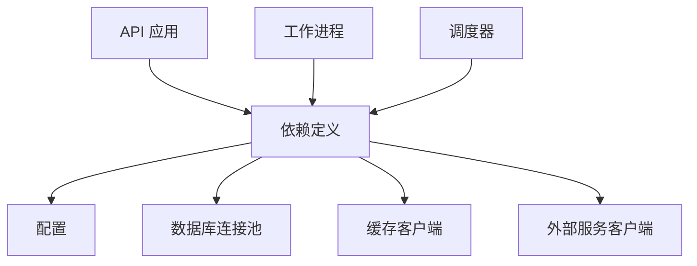

**图表来源**
- [apps/api/main.py](file://apps/api/main.py)
- [apps/api/deps.py](file://apps/api/deps.py)
- [apps/worker/main.py](file://apps/worker/main.py)
- [apps/scheduler/executor.py](file://apps/scheduler/executor.py)
- [configs/base.yaml](file://configs/base.yaml)
- [configs/dev.yaml](file://configs/dev.yaml)

**章节来源**
- [apps/api/main.py](file://apps/api/main.py)
- [apps/api/deps.py](file://apps/api/deps.py)
- [apps/worker/main.py](file://apps/worker/main.py)
- [apps/scheduler/executor.py](file://apps/scheduler/executor.py)
- [configs/base.yaml](file://configs/base.yaml)
- [configs/dev.yaml](file://configs/dev.yaml)

## 性能考量
- 单例与缓存
  - 合理设计单例范围，避免过大作用域导致内存占用过高
  - 对昂贵对象启用延迟加载，减少冷启动开销
- 作用域粒度
  - 请求级作用域适合有状态服务，但需注意上下文传递与清理成本
  - 任务级作用域有助于隔离资源，避免跨任务污染
- 工厂与构造
  - 工厂函数应轻量，避免阻塞操作；耗时逻辑移至后台或异步
- 循环依赖
  - 尽早检测并修复循环依赖，避免解析阶段性能退化
- 配置加载
  - 配置项应在启动时一次性加载并缓存，避免重复 I/O

[本节为通用指导，不直接分析具体文件]

## 故障排查指南
- 常见错误
  - 循环依赖：检查依赖链，引入抽象层或延迟加载
  - 作用域泄漏：确认作用域边界与清理逻辑
  - 配置缺失：核对环境变量与配置文件键名
- 诊断步骤
  - 启用详细日志，记录服务解析过程
  - 使用最小化配置复现问题
  - 在测试环境中替换外部依赖为 Mock，隔离问题范围

**章节来源**
- [apps/api/deps.py](file://apps/api/deps.py)

## 结论
本依赖注入框架通过容器化装配、作用域管理与工厂模式，实现了高内聚低耦合的服务组织方式。结合循环依赖检测、延迟加载与条件注入策略，系统在可维护性、可扩展性与性能之间取得良好平衡。建议在项目中遵循本文的最佳实践，持续优化依赖结构与资源配置。

[本节为总结性内容，不直接分析具体文件]

## 附录
- 术语表
  - 依赖容器：负责服务生命周期与作用域管理的核心组件
  - 作用域：服务实例的生命周期范围（进程级、请求级、任务级）
  - 工厂模式：通过工厂函数动态构造复杂对象的模式
  - 延迟加载：按需创建对象以减少启动时间与资源占用
- 参考文件
  - 应用入口与依赖定义：[apps/api/main.py](file://apps/api/main.py)、[apps/api/deps.py](file://apps/api/deps.py)
  - 数据库后端与连接池：[apps/quant-read-mcp/db_backends.py](file://apps/quant-read-mcp/db_backends.py)
  - 配置示例：[configs/base.yaml](file://configs/base.yaml)、[configs/dev.yaml](file://configs/dev.yaml)