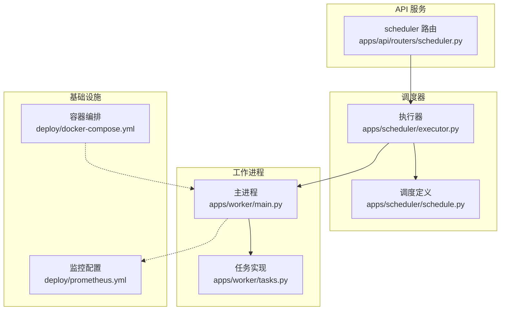
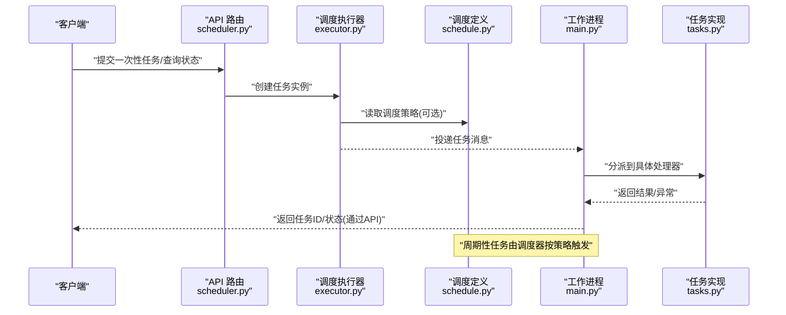
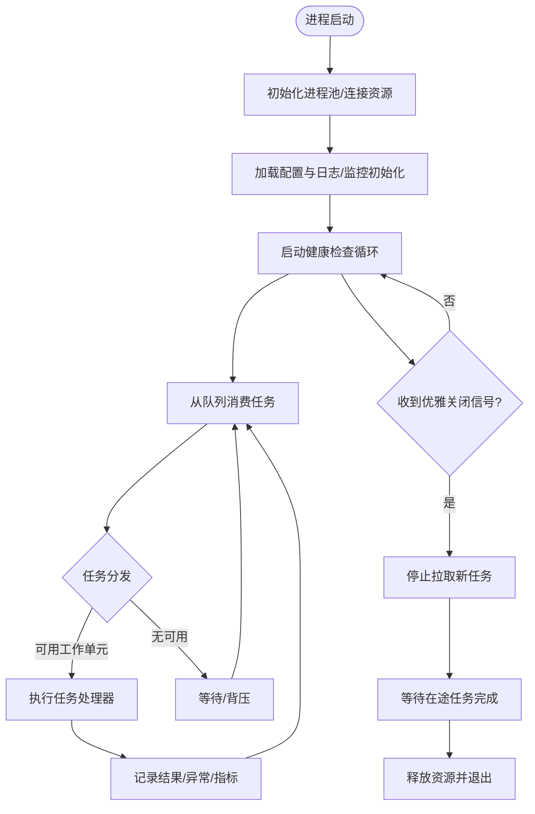
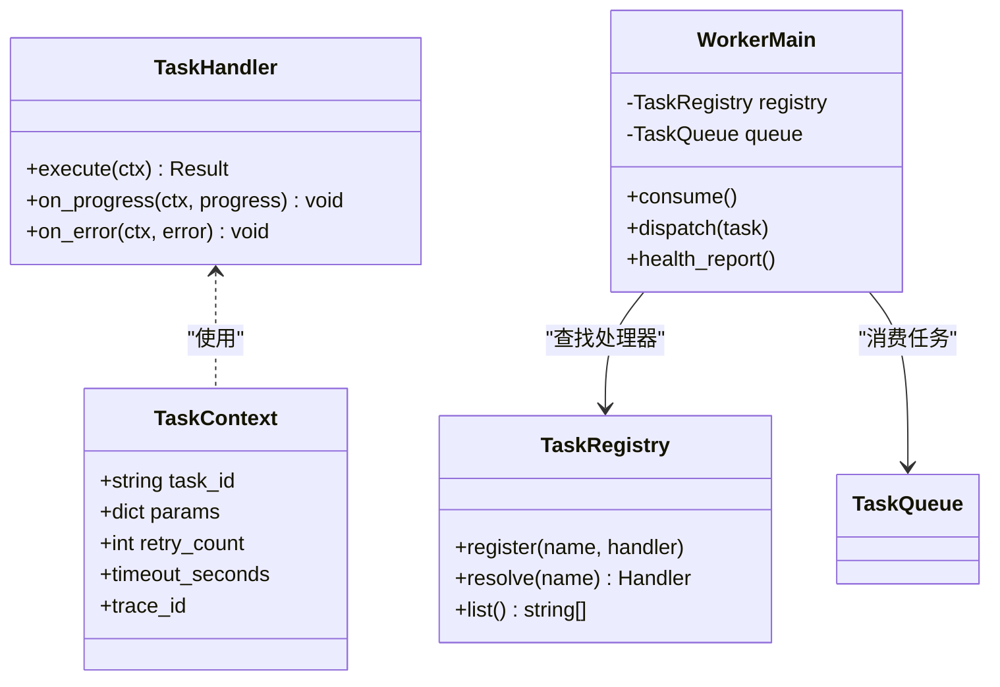
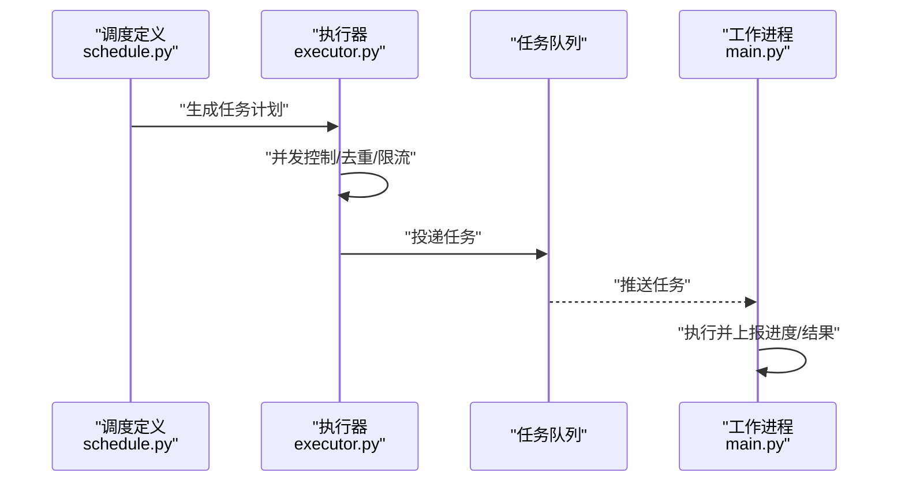
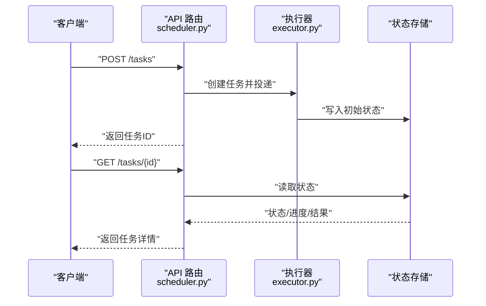
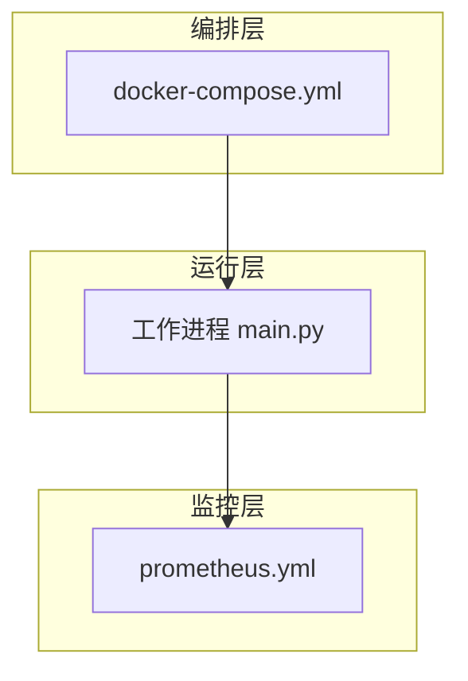
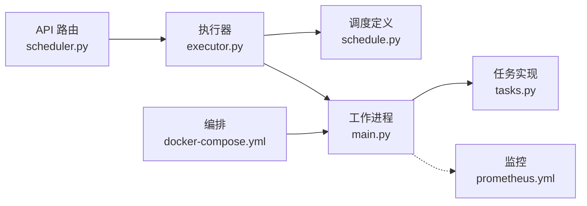

# 工作进程管理

<cite>
**本文引用的文件**   
- [apps/worker/main.py](file://apps/worker/main.py)
- [apps/worker/tasks.py](file://apps/worker/tasks.py)
- [apps/scheduler/executor.py](file://apps/scheduler/executor.py)
- [apps/scheduler/schedule.py](file://apps/scheduler/schedule.py)
- [apps/api/routers/scheduler.py](file://apps/api/routers/scheduler.py)
- [deploy/docker-compose.yml](file://deploy/docker-compose.yml)
- [deploy/prometheus.yml](file://deploy/prometheus.yml)
- [tests/unit/test_worker_tasks.py](file://tests/unit/test_worker_tasks.py)
</cite>

## 目录
1. [简介](#简介)
2. [项目结构](#项目结构)
3. [核心组件](#核心组件)
4. [架构总览](#架构总览)
5. [详细组件分析](#详细组件分析)
6. [依赖关系分析](#依赖关系分析)
7. [性能考虑](#性能考虑)
8. [故障排查指南](#故障排查指南)
9. [结论](#结论)
10. [附录](#附录)

## 简介
本设计文档围绕“工作进程管理系统”展开，聚焦以下目标：
- 进程池初始化与生命周期管理
- 任务队列管理与调度策略
- 进程间通信机制（API 触发、调度器驱动）
- 异步任务执行框架与并发控制
- 资源隔离策略（容器化部署）
- 任务状态跟踪、进度报告与异常处理
- 进程健康检查、自动重启与优雅关闭
- 自定义任务处理器开发与调试指南
- 内存管理、CPU 使用优化与监控指标收集

## 项目结构
系统由 API 服务、调度器与工作进程三部分组成。API 提供外部入口；调度器负责定时或事件驱动的触发；工作进程负责实际任务的执行与结果回写。

图表来源
- [apps/api/routers/scheduler.py](file://apps/api/routers/scheduler.py)
- [apps/scheduler/executor.py](file://apps/scheduler/executor.py)
- [apps/scheduler/schedule.py](file://apps/scheduler/schedule.py)
- [apps/worker/main.py](file://apps/worker/main.py)
- [apps/worker/tasks.py](file://apps/worker/tasks.py)
- [deploy/docker-compose.yml](file://deploy/docker-compose.yml)
- [deploy/prometheus.yml](file://deploy/prometheus.yml)

章节来源
- [apps/api/routers/scheduler.py](file://apps/api/routers/scheduler.py)
- [apps/scheduler/executor.py](file://apps/scheduler/executor.py)
- [apps/scheduler/schedule.py](file://apps/scheduler/schedule.py)
- [apps/worker/main.py](file://apps/worker/main.py)
- [apps/worker/tasks.py](file://apps/worker/tasks.py)
- [deploy/docker-compose.yml](file://deploy/docker-compose.yml)
- [deploy/prometheus.yml](file://deploy/prometheus.yml)

## 核心组件
- 工作进程主循环：负责进程池初始化、任务消费、心跳与健康上报、优雅关闭。
- 任务定义与注册：集中声明任务类型、参数校验、执行逻辑与回调。
- 调度执行器：将调度计划转换为可执行的任务实例，并投递到工作进程。
- API 路由：暴露外部接口以触发一次性任务或查询任务状态。
- 部署与监控：通过容器编排保障进程隔离与自愈，通过 Prometheus 采集关键指标。

章节来源
- [apps/worker/main.py](file://apps/worker/main.py)
- [apps/worker/tasks.py](file://apps/worker/tasks.py)
- [apps/scheduler/executor.py](file://apps/scheduler/executor.py)
- [apps/scheduler/schedule.py](file://apps/scheduler/schedule.py)
- [apps/api/routers/scheduler.py](file://apps/api/routers/scheduler.py)
- [deploy/docker-compose.yml](file://deploy/docker-compose.yml)
- [deploy/prometheus.yml](file://deploy/prometheus.yml)

## 架构总览
下图展示了从 API 触发到工作进程执行的端到端流程，以及调度器周期性触发的路径。

图表来源
- [apps/api/routers/scheduler.py](file://apps/api/routers/scheduler.py)
- [apps/scheduler/executor.py](file://apps/scheduler/executor.py)
- [apps/scheduler/schedule.py](file://apps/scheduler/schedule.py)
- [apps/worker/main.py](file://apps/worker/main.py)
- [apps/worker/tasks.py](file://apps/worker/tasks.py)

## 详细组件分析

### 工作进程主循环（进程池与生命周期）
- 进程池初始化：启动时根据配置创建工作子进程/协程池，预加载共享资源（如连接池、模型），减少冷启动开销。
- 任务消费：阻塞式或事件驱动地从任务队列拉取任务，分配给空闲工作单元执行。
- 健康检查：定期上报心跳与资源指标（内存、CPU、队列长度），供外部监控系统采集。
- 优雅关闭：接收终止信号后停止拉取新任务，等待在途任务完成，再释放资源退出。

图表来源
- [apps/worker/main.py](file://apps/worker/main.py)

章节来源
- [apps/worker/main.py](file://apps/worker/main.py)

### 任务定义与处理器（任务队列与执行）
- 任务注册：统一的任务注册表，支持动态发现与版本兼容。
- 参数校验：在进入执行前进行强类型校验与边界检查，避免无效任务进入执行链路。
- 执行上下文：为每个任务提供独立上下文（如请求ID、追踪ID、超时、重试次数）。
- 进度与结果：通过回调或状态存储更新任务进度与最终结果，便于外部查询。

图表来源
- [apps/worker/tasks.py](file://apps/worker/tasks.py)
- [apps/worker/main.py](file://apps/worker/main.py)

章节来源
- [apps/worker/tasks.py](file://apps/worker/tasks.py)
- [apps/worker/main.py](file://apps/worker/main.py)

### 调度执行器与调度定义（并发控制与触发）
- 执行器职责：解析调度计划，生成任务实例，控制并发度与限流，确保幂等投递。
- 调度定义：声明式地描述任务触发条件（时间窗口、依赖、速率限制）。
- 并发控制：基于令牌桶或固定大小队列限制并发，防止过载。
- 失败重试：对瞬时错误进行指数退避重试，持久化中间状态以便恢复。

图表来源
- [apps/scheduler/executor.py](file://apps/scheduler/executor.py)
- [apps/scheduler/schedule.py](file://apps/scheduler/schedule.py)
- [apps/worker/main.py](file://apps/worker/main.py)

章节来源
- [apps/scheduler/executor.py](file://apps/scheduler/executor.py)
- [apps/scheduler/schedule.py](file://apps/scheduler/schedule.py)
- [apps/worker/main.py](file://apps/worker/main.py)

### API 路由（外部触发与状态查询）
- 一次性任务提交：接收外部请求，构造任务并交由执行器入队。
- 任务状态查询：根据任务ID查询当前状态、进度与结果。
- 鉴权与限流：对外部访问进行鉴权与速率限制，保护内部系统。

图表来源
- [apps/api/routers/scheduler.py](file://apps/api/routers/scheduler.py)
- [apps/scheduler/executor.py](file://apps/scheduler/executor.py)

章节来源
- [apps/api/routers/scheduler.py](file://apps/api/routers/scheduler.py)
- [apps/scheduler/executor.py](file://apps/scheduler/executor.py)

### 部署与监控（健康检查、自动重启与指标）
- 容器编排：通过编排文件定义工作进程的副本数、资源限制与重启策略，实现高可用与弹性伸缩。
- 健康探针：暴露健康检查端点，结合编排平台实现自动重启。
- 监控指标：暴露标准指标端点，Prometheus 定期抓取，用于告警与容量规划。

图表来源
- [deploy/docker-compose.yml](file://deploy/docker-compose.yml)
- [deploy/prometheus.yml](file://deploy/prometheus.yml)
- [apps/worker/main.py](file://apps/worker/main.py)

章节来源
- [deploy/docker-compose.yml](file://deploy/docker-compose.yml)
- [deploy/prometheus.yml](file://deploy/prometheus.yml)
- [apps/worker/main.py](file://apps/worker/main.py)

## 依赖关系分析
- 模块耦合：
  - API 路由依赖执行器，不直接依赖工作进程，降低耦合。
  - 执行器依赖调度定义与工作进程（或队列），承担并发控制与重试。
  - 工作进程依赖任务注册表与任务处理器，保持执行侧的扩展性。
- 外部依赖：
  - 容器编排与监控系统作为横向支撑，不影响核心业务逻辑。

图表来源
- [apps/api/routers/scheduler.py](file://apps/api/routers/scheduler.py)
- [apps/scheduler/executor.py](file://apps/scheduler/executor.py)
- [apps/scheduler/schedule.py](file://apps/scheduler/schedule.py)
- [apps/worker/main.py](file://apps/worker/main.py)
- [apps/worker/tasks.py](file://apps/worker/tasks.py)
- [deploy/prometheus.yml](file://deploy/prometheus.yml)
- [deploy/docker-compose.yml](file://deploy/docker-compose.yml)

章节来源
- [apps/api/routers/scheduler.py](file://apps/api/routers/scheduler.py)
- [apps/scheduler/executor.py](file://apps/scheduler/executor.py)
- [apps/scheduler/schedule.py](file://apps/scheduler/schedule.py)
- [apps/worker/main.py](file://apps/worker/main.py)
- [apps/worker/tasks.py](file://apps/worker/tasks.py)
- [deploy/prometheus.yml](file://deploy/prometheus.yml)
- [deploy/docker-compose.yml](file://deploy/docker-compose.yml)

## 性能考虑
- 并发控制：
  - 使用令牌桶或固定大小队列限制并发，避免资源争用与雪崩。
  - 针对 CPU 密集型任务，采用多进程并行；I/O 密集型任务采用协程或线程池。
- 资源隔离：
  - 通过容器限制 CPU 与内存上限，防止单任务影响整体稳定性。
- 内存管理：
  - 预加载共享资源，避免重复初始化；及时释放大对象引用，避免内存泄漏。
- 监控指标：
  - 采集任务吞吐、延迟分布、队列长度、错误率、资源使用率等指标，用于容量规划与告警。

[本节为通用指导，无需特定文件来源]

## 故障排查指南
- 常见问题定位：
  - 任务未执行：检查执行器是否成功投递、队列是否积压、工作进程是否健康。
  - 任务失败：查看任务上下文中的错误信息与重试次数，确认是否为瞬时错误。
  - 进度不更新：确认任务处理器是否正确上报进度，状态存储是否可达。
- 诊断手段：
  - 通过 API 查询任务状态与进度，结合监控面板观察资源与错误趋势。
  - 使用单元测试验证任务处理器逻辑与边界条件。

章节来源
- [tests/unit/test_worker_tasks.py](file://tests/unit/test_worker_tasks.py)

## 结论
本设计文档对工作进程管理系统的进程池、任务队列、进程间通信、异步执行、并发控制、资源隔离、状态跟踪、健康检查、自动重启与优雅关闭、监控指标等方面进行了系统化说明。通过清晰的模块划分与可视化图示，帮助读者快速理解系统架构与关键流程，并为后续扩展与维护提供依据。

## 附录
- 自定义任务处理器开发指南：
  - 在任务注册表中注册新的处理器名称与实现。
  - 实现统一的执行接口，并在执行过程中上报进度与异常。
  - 编写单元测试覆盖正常路径与异常路径，确保健壮性。
- 调试建议：
  - 开启详细日志与追踪ID，便于跨进程链路追踪。
  - 使用本地容器编排模拟生产环境，复现问题并验证修复。

[本节为通用指导，无需特定文件来源]