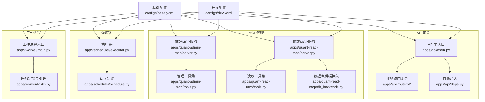
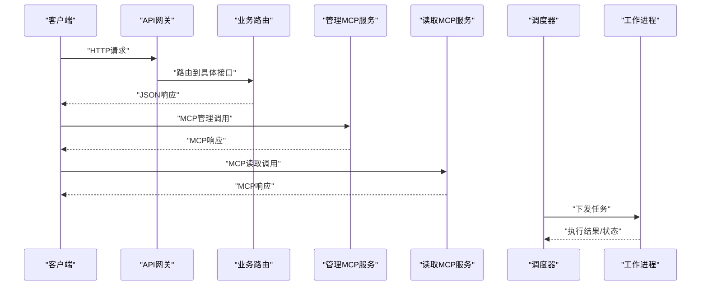
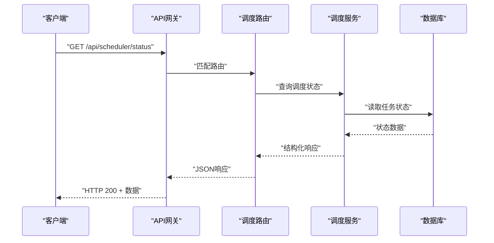
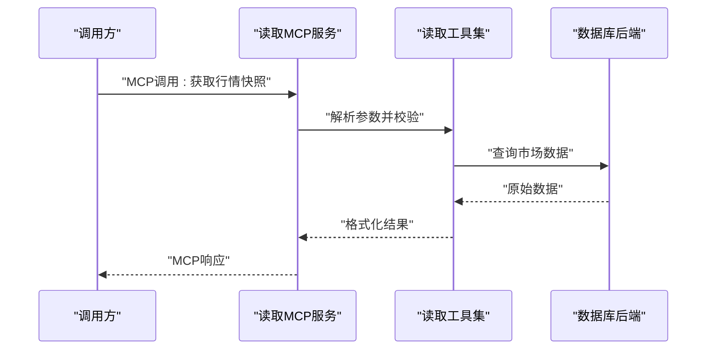
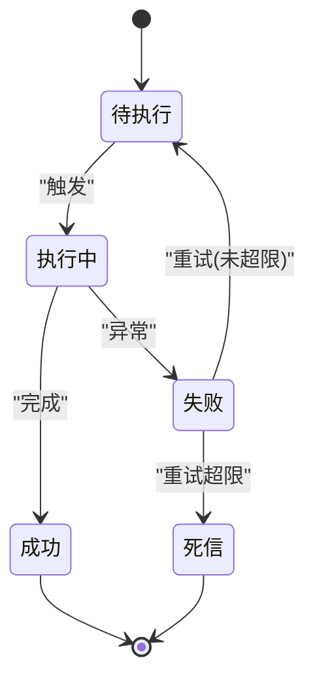
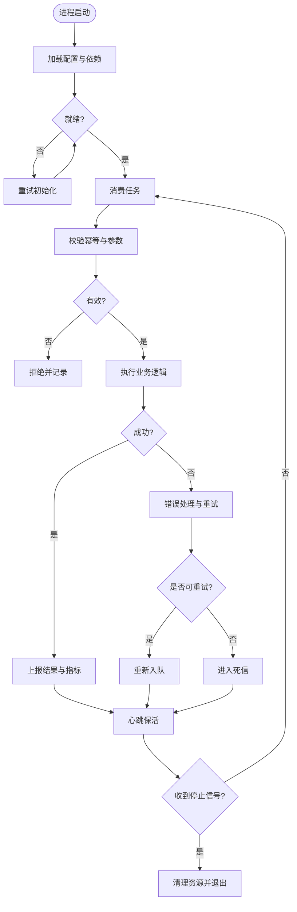
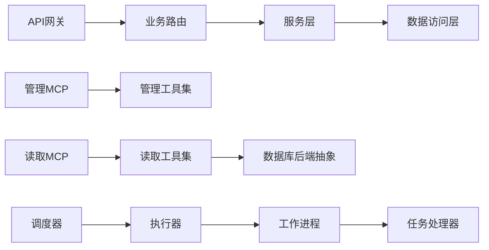

# 核心组件设计

<cite>
**本文引用的文件**   
- [apps/api/main.py](file://apps/api/main.py)
- [apps/api/routers/scheduler.py](file://apps/api/routers/scheduler.py)
- [apps/api/routers/instruments.py](file://apps/api/routers/instruments.py)
- [apps/api/routers/forecast.py](file://apps/api/routers/forecast.py)
- [apps/api/routers/fundamentals.py](file://apps/api/routers/fundamentals.py)
- [apps/api/routers/data_status.py](file://apps/api/routers/data_status.py)
- [apps/api/routers/admin_ingestion.py](file://apps/api/routers/admin_ingestion.py)
- [apps/api/routers/portfolio.py](file://apps/api/routers/portfolio.py)
- [apps/api/routers/markets.py](file://apps/api/routers/markets.py)
- [apps/api/deps.py](file://apps/api/deps.py)
- [apps/quant-admin-mcp/server.py](file://apps/quant-admin-mcp/server.py)
- [apps/quant-admin-mcp/tools.py](file://apps/quant-admin-mcp/tools.py)
- [apps/quant-read-mcp/server.py](file://apps/quant-read-mcp/server.py)
- [apps/quant-read-mcp/db_backends.py](file://apps/quant-read-mcp/db_backends.py)
- [apps/quant-read-mcp/tools.py](file://apps/quant-read-mcp/tools.py)
- [apps/scheduler/executor.py](file://apps/scheduler/executor.py)
- [apps/scheduler/schedule.py](file://apps/scheduler/schedule.py)
- [apps/worker/main.py](file://apps/worker/main.py)
- [apps/worker/tasks.py](file://apps/worker/tasks.py)
- [configs/base.yaml](file://configs/base.yaml)
- [configs/dev.yaml](file://configs/dev.yaml)
</cite>

## 目录
1. [简介](#简介)
2. [项目结构](#项目结构)
3. [核心组件](#核心组件)
4. [架构总览](#架构总览)
5. [详细组件分析](#详细组件分析)
6. [依赖关系分析](#依赖关系分析)
7. [性能考虑](#性能考虑)
8. [故障排查指南](#故障排查指南)
9. [结论](#结论)
10. [附录](#附录)

## 简介
本设计文档面向量化交易MCP系统，聚焦API网关、MCP代理服务器、调度器与工作进程等关键组件的职责、实现要点、生命周期与状态管理、配置项与扩展点、以及交互序列图与状态转换图。文档同时给出容错处理与故障恢复策略建议，帮助读者快速理解并扩展系统。

## 项目结构
系统采用多应用模块化组织：
- API网关与应用路由位于 apps/api
- MCP代理服务器（管理与读取）位于 apps/quant-admin-mcp 与 apps/quant-read-mcp
- 任务调度器位于 apps/scheduler
- 工作进程位于 apps/worker
- 配置集中于 configs
- 可观测性与部署相关在 deploy 与 scripts

图表来源
- [apps/api/main.py](file://apps/api/main.py)
- [apps/api/routers/scheduler.py](file://apps/api/routers/scheduler.py)
- [apps/api/routers/instruments.py](file://apps/api/routers/instruments.py)
- [apps/api/routers/forecast.py](file://apps/api/routers/forecast.py)
- [apps/api/routers/fundamentals.py](file://apps/api/routers/fundamentals.py)
- [apps/api/routers/data_status.py](file://apps/api/routers/data_status.py)
- [apps/api/routers/admin_ingestion.py](file://apps/api/routers/admin_ingestion.py)
- [apps/api/routers/portfolio.py](file://apps/api/routers/portfolio.py)
- [apps/api/routers/markets.py](file://apps/api/routers/markets.py)
- [apps/api/deps.py](file://apps/api/deps.py)
- [apps/quant-admin-mcp/server.py](file://apps/quant-admin-mcp/server.py)
- [apps/quant-admin-mcp/tools.py](file://apps/quant-admin-mcp/tools.py)
- [apps/quant-read-mcp/server.py](file://apps/quant-read-mcp/server.py)
- [apps/quant-read-mcp/db_backends.py](file://apps/quant-read-mcp/db_backends.py)
- [apps/quant-read-mcp/tools.py](file://apps/quant-read-mcp/tools.py)
- [apps/scheduler/executor.py](file://apps/scheduler/executor.py)
- [apps/scheduler/schedule.py](file://apps/scheduler/schedule.py)
- [apps/worker/main.py](file://apps/worker/main.py)
- [apps/worker/tasks.py](file://apps/worker/tasks.py)
- [configs/base.yaml](file://configs/base.yaml)
- [configs/dev.yaml](file://configs/dev.yaml)

章节来源
- [apps/api/main.py](file://apps/api/main.py)
- [apps/api/deps.py](file://apps/api/deps.py)
- [apps/quant-admin-mcp/server.py](file://apps/quant-admin-mcp/server.py)
- [apps/quant-read-mcp/server.py](file://apps/quant-read-mcp/server.py)
- [apps/scheduler/executor.py](file://apps/scheduler/executor.py)
- [apps/scheduler/schedule.py](file://apps/scheduler/schedule.py)
- [apps/worker/main.py](file://apps/worker/main.py)
- [configs/base.yaml](file://configs/base.yaml)
- [configs/dev.yaml](file://configs/dev.yaml)

## 核心组件
本节概述各核心组件职责与边界：
- API网关：统一对外暴露REST接口，负责请求路由、鉴权、限流、参数校验、响应封装与错误归一化。
- MCP代理服务器：提供MCP协议的服务端能力，分为管理面（admin）与数据面（read），通过工具集暴露领域能力。
- 调度器：负责任务编排、触发与执行控制，支持周期/事件驱动的任务计划。
- 工作进程：消费任务队列或接收调度指令，执行业务逻辑，保证幂等与重试。

章节来源
- [apps/api/main.py](file://apps/api/main.py)
- [apps/api/routers/scheduler.py](file://apps/api/routers/scheduler.py)
- [apps/quant-admin-mcp/server.py](file://apps/quant-admin-mcp/server.py)
- [apps/quant-read-mcp/server.py](file://apps/quant-read-mcp/server.py)
- [apps/scheduler/executor.py](file://apps/scheduler/executor.py)
- [apps/scheduler/schedule.py](file://apps/scheduler/schedule.py)
- [apps/worker/main.py](file://apps/worker/main.py)

## 架构总览
整体采用“网关+服务”的解耦模式：
- 外部客户端通过API网关访问业务功能；
- MCP代理作为专用通道，供内部或第三方以MCP协议调用；
- 调度器按策略触发任务，工作进程异步执行；
- 配置中心化管理，支持环境差异。

图表来源
- [apps/api/main.py](file://apps/api/main.py)
- [apps/api/routers/scheduler.py](file://apps/api/routers/scheduler.py)
- [apps/quant-admin-mcp/server.py](file://apps/quant-admin-mcp/server.py)
- [apps/quant-read-mcp/server.py](file://apps/quant-read-mcp/server.py)
- [apps/scheduler/executor.py](file://apps/scheduler/executor.py)
- [apps/worker/main.py](file://apps/worker/main.py)

## 详细组件分析

### API网关
- 职责
  - 启动Web服务、挂载路由、中间件（如日志、认证、限流）。
  - 统一错误码与异常映射，返回标准化响应体。
  - 健康检查与就绪探针，便于容器编排。
- 关键实现要点
  - 路由注册：将业务模块路由集中挂载，保持入口清晰。
  - 依赖注入：通过共享依赖上下文获取数据库连接、缓存、消息队列等。
  - 配置加载：从配置文件与环境变量合并初始化。
- 生命周期
  - 启动阶段：加载配置、初始化依赖、注册路由与健康检查。
  - 运行阶段：处理请求、转发至路由、记录指标与审计。
  - 关闭阶段：优雅停止，等待请求完成，释放资源。
- 配置选项
  - 监听端口、主机、最大并发、超时时间、日志级别、CORS设置等。
- 扩展点
  - 自定义中间件、全局异常处理器、路由前缀、版本化策略。
- 容错与恢复
  - 请求级超时、熔断降级、重试策略、限流保护。
  - 健康检查失败时自动摘除实例。

章节来源
- [apps/api/main.py](file://apps/api/main.py)
- [apps/api/deps.py](file://apps/api/deps.py)
- [apps/api/routers/scheduler.py](file://apps/api/routers/scheduler.py)
- [apps/api/routers/instruments.py](file://apps/api/routers/instruments.py)
- [apps/api/routers/forecast.py](file://apps/api/routers/forecast.py)
- [apps/api/routers/fundamentals.py](file://apps/api/routers/fundamentals.py)
- [apps/api/routers/data_status.py](file://apps/api/routers/data_status.py)
- [apps/api/routers/admin_ingestion.py](file://apps/api/routers/admin_ingestion.py)
- [apps/api/routers/portfolio.py](file://apps/api/routers/portfolio.py)
- [apps/api/routers/markets.py](file://apps/api/routers/markets.py)

#### API路由序列图（示例：调度查询）

图表来源
- [apps/api/routers/scheduler.py](file://apps/api/routers/scheduler.py)

### MCP代理服务器（管理面与数据面）
- 职责
  - 管理面：提供系统管理、配置变更、任务启停、审计查看等能力。
  - 数据面：提供只读的数据查询、报表导出、元数据检索等能力。
- 关键实现要点
  - 工具集注册：将领域能力封装为MCP工具，供调用方发现与使用。
  - 权限与审计：对敏感操作进行鉴权与审计记录。
  - 数据后端抽象：通过db_backends统一不同存储后端的访问。
- 生命周期
  - 启动：加载配置、建立连接、注册工具与服务端能力。
  - 运行：处理MCP请求、执行工具、返回结果。
  - 关闭：清理连接、持久化状态、输出统计。
- 配置选项
  - 服务地址、端口、认证方式、后端连接参数、工具白名单等。
- 扩展点
  - 新增工具函数、自定义鉴权策略、替换数据后端实现。
- 容错与恢复
  - 连接池与重连、超时控制、错误分类与上报、幂等性保障。

章节来源
- [apps/quant-admin-mcp/server.py](file://apps/quant-admin-mcp/server.py)
- [apps/quant-admin-mcp/tools.py](file://apps/quant-admin-mcp/tools.py)
- [apps/quant-read-mcp/server.py](file://apps/quant-read-mcp/server.py)
- [apps/quant-read-mcp/tools.py](file://apps/quant-read-mcp/tools.py)
- [apps/quant-read-mcp/db_backends.py](file://apps/quant-read-mcp/db_backends.py)

#### MCP工具调用序列图（读取数据面）

图表来源
- [apps/quant-read-mcp/server.py](file://apps/quant-read-mcp/server.py)
- [apps/quant-read-mcp/tools.py](file://apps/quant-read-mcp/tools.py)
- [apps/quant-read-mcp/db_backends.py](file://apps/quant-read-mcp/db_backends.py)

### 调度器
- 职责
  - 维护任务计划、触发规则与执行上下文。
  - 协调工作进程执行任务，收集执行结果与状态。
- 关键实现要点
  - 调度定义：声明式任务描述（周期、条件、依赖）。
  - 执行器：负责拉取待执行任务、分发到工作进程、监控进度。
  - 状态机：任务状态包括待执行、执行中、成功、失败、重试等。
- 生命周期
  - 启动：加载调度定义、初始化执行器、注册钩子。
  - 运行：周期性扫描、触发任务、更新状态、告警。
  - 关闭：停止新触发、等待进行中任务结束、持久化状态。
- 配置选项
  - 扫描间隔、最大并发、重试次数、超时、任务队列参数。
- 扩展点
  - 自定义触发器、执行策略、结果处理器、告警渠道。
- 容错与恢复
  - 任务去重、幂等执行、失败重试与退避、死信队列、断点续跑。

章节来源
- [apps/scheduler/executor.py](file://apps/scheduler/executor.py)
- [apps/scheduler/schedule.py](file://apps/scheduler/schedule.py)

#### 调度器状态转换图

图表来源
- [apps/scheduler/executor.py](file://apps/scheduler/executor.py)
- [apps/scheduler/schedule.py](file://apps/scheduler/schedule.py)

### 工作进程
- 职责
  - 接收调度器下发的任务，执行业务逻辑，返回结果与状态。
  - 保证任务幂等、可重试、可观测。
- 关键实现要点
  - 任务定义：明确输入输出、依赖资源、超时与重试策略。
  - 执行引擎：支持并行度控制、资源隔离、上下文传递。
  - 结果上报：写入持久化存储、推送指标与审计事件。
- 生命周期
  - 启动：加载配置、连接依赖、注册任务处理器。
  - 运行：消费任务、执行、上报、心跳保活。
  - 关闭：优雅退出、保存状态、释放资源。
- 配置选项
  - 并发数、队列地址、超时、重试策略、日志与指标开关。
- 扩展点
  - 新增任务类型、自定义处理器、结果转换器、告警策略。
- 容错与恢复
  - 任务幂等键、失败重试与退避、死信处理、补偿任务。

章节来源
- [apps/worker/main.py](file://apps/worker/main.py)
- [apps/worker/tasks.py](file://apps/worker/tasks.py)

#### 工作进程任务处理流程

图表来源
- [apps/worker/main.py](file://apps/worker/main.py)
- [apps/worker/tasks.py](file://apps/worker/tasks.py)

## 依赖关系分析
- 组件耦合
  - API网关依赖路由与依赖注入层，低耦合于业务实现。
  - MCP代理通过工具集与数据后端抽象，降低存储与协议耦合。
  - 调度器与工作进程通过任务模型与队列通信，松耦合。
- 直接依赖
  - API路由依赖服务层与数据访问层。
  - MCP读取服务依赖数据库后端抽象。
  - 调度器依赖执行器与调度定义。
  - 工作进程依赖任务处理器与外部依赖（数据库、消息队列）。
- 间接依赖
  - 配置中心影响所有组件的运行时行为。
  - 可观测性（日志、指标、追踪）贯穿全链路。

图表来源
- [apps/api/main.py](file://apps/api/main.py)
- [apps/api/routers/scheduler.py](file://apps/api/routers/scheduler.py)
- [apps/quant-admin-mcp/server.py](file://apps/quant-admin-mcp/server.py)
- [apps/quant-admin-mcp/tools.py](file://apps/quant-admin-mcp/tools.py)
- [apps/quant-read-mcp/server.py](file://apps/quant-read-mcp/server.py)
- [apps/quant-read-mcp/tools.py](file://apps/quant-read-mcp/tools.py)
- [apps/quant-read-mcp/db_backends.py](file://apps/quant-read-mcp/db_backends.py)
- [apps/scheduler/executor.py](file://apps/scheduler/executor.py)
- [apps/scheduler/schedule.py](file://apps/scheduler/schedule.py)
- [apps/worker/main.py](file://apps/worker/main.py)
- [apps/worker/tasks.py](file://apps/worker/tasks.py)

章节来源
- [apps/api/main.py](file://apps/api/main.py)
- [apps/quant-read-mcp/db_backends.py](file://apps/quant-read-mcp/db_backends.py)
- [apps/scheduler/executor.py](file://apps/scheduler/executor.py)
- [apps/worker/main.py](file://apps/worker/main.py)

## 性能考虑
- API网关
  - 启用连接复用、合理设置超时与并发上限、避免阻塞I/O。
  - 使用缓存减少重复查询，分页与过滤优化大数据量返回。
- MCP代理
  - 工具函数尽量无副作用或幂等，批量接口优于多次单条调用。
  - 数据库后端使用连接池与索引优化，避免N+1查询。
- 调度器
  - 控制扫描频率与批大小，避免抖动；任务拆分与并行度调优。
  - 失败重试采用指数退避，避免雪崩。
- 工作进程
  - 限制并发度，防止资源争用；长耗时任务拆分为子任务。
  - 结果落库采用批量写入与异步提交，提升吞吐。

[本节为通用指导，不直接分析具体文件]

## 故障排查指南
- 常见问题定位
  - API网关：检查健康检查与日志，确认路由匹配与依赖可用性。
  - MCP代理：验证工具注册与权限，查看后端连接与错误堆栈。
  - 调度器：核对任务状态与重试计数，检查队列与消费者状态。
  - 工作进程：观察心跳与指标，定位失败任务与死信。
- 诊断手段
  - 开启详细日志与追踪ID，关联跨组件调用链。
  - 使用指标面板监控延迟、错误率与队列积压。
  - 回放失败任务，结合审计事件定位根因。
- 恢复策略
  - 重启失败实例、扩容工作进程、清理死信并重试。
  - 回滚配置变更，恢复稳定版本。

章节来源
- [apps/api/routers/data_status.py](file://apps/api/routers/data_status.py)
- [apps/quant-admin-mcp/tools.py](file://apps/quant-admin-mcp/tools.py)
- [apps/quant-read-mcp/tools.py](file://apps/quant-read-mcp/tools.py)
- [apps/scheduler/executor.py](file://apps/scheduler/executor.py)
- [apps/worker/tasks.py](file://apps/worker/tasks.py)

## 结论
本设计文档梳理了量化交易MCP系统的核心组件及其协作关系，明确了职责边界、生命周期、配置与扩展点，并通过序列图与状态图展示了关键流程。建议在实施中强化可观测性与容错机制，持续优化性能与稳定性。

[本节为总结性内容，不直接分析具体文件]

## 附录
- 配置参考
  - 基础配置：包含默认值与通用选项。
  - 开发配置：覆盖开发环境的差异化设置。
- 部署建议
  - 使用容器编排管理多实例，配合健康检查与滚动升级。
  - 分离读写负载，确保高可用与弹性伸缩。

章节来源
- [configs/base.yaml](file://configs/base.yaml)
- [configs/dev.yaml](file://configs/dev.yaml)