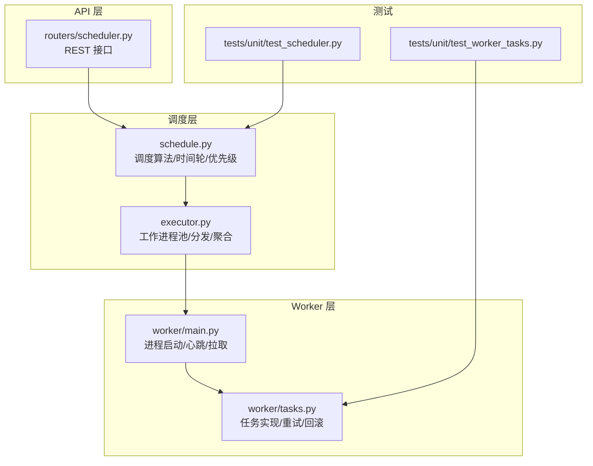
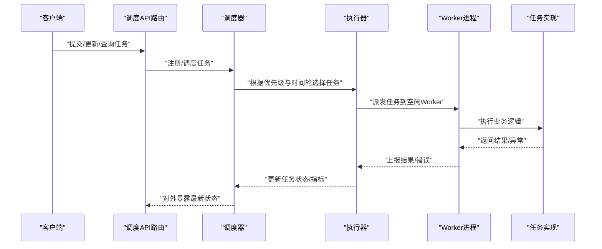
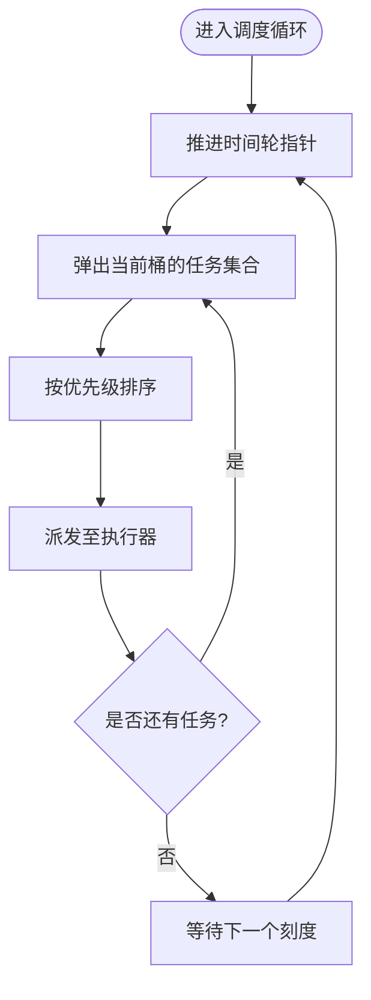
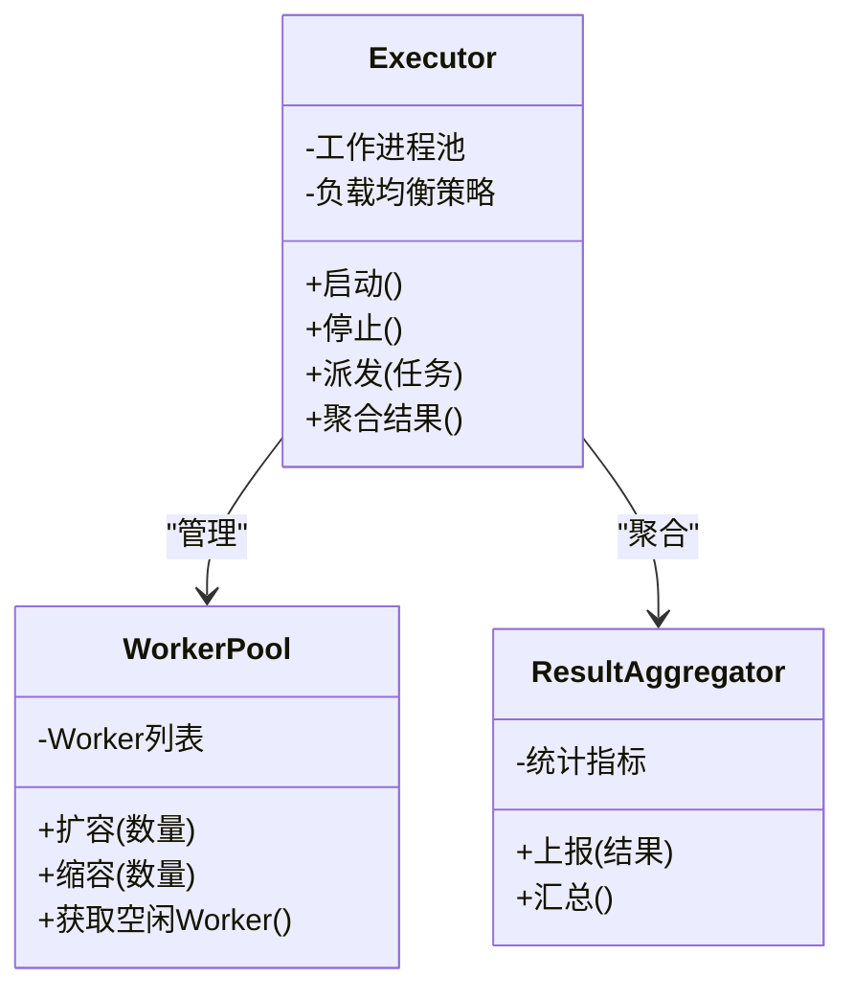
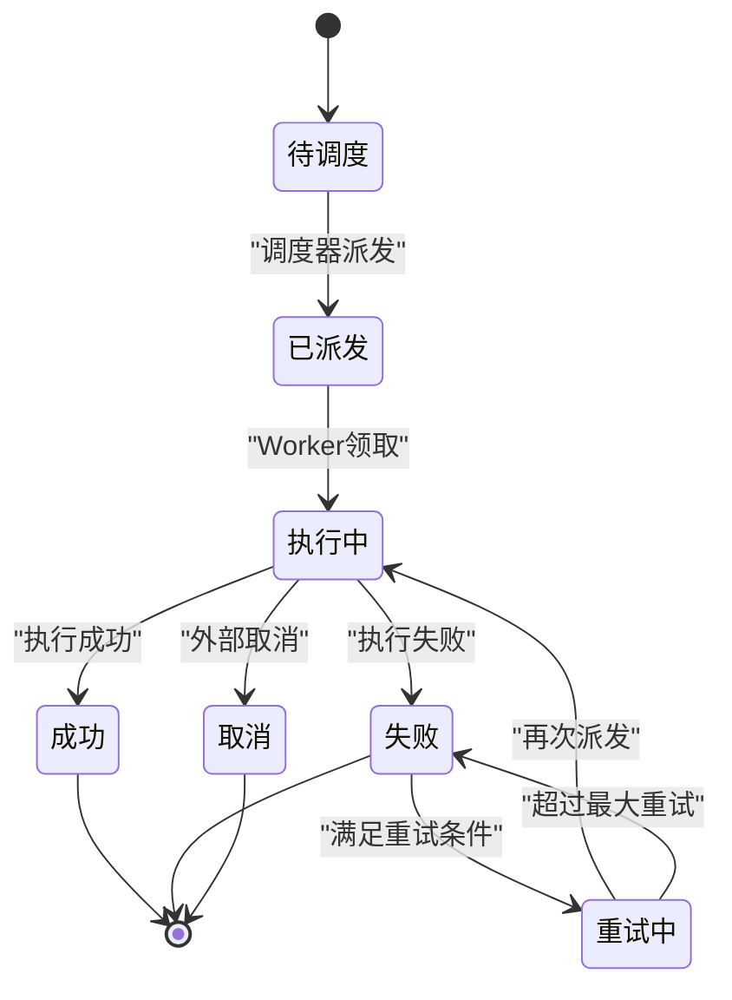
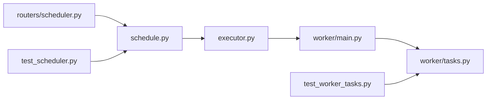

# 调度器系统

<cite>
**本文引用的文件**   
- [apps/scheduler/executor.py](file://apps/scheduler/executor.py)
- [apps/scheduler/schedule.py](file://apps/scheduler/schedule.py)
- [apps/api/routers/scheduler.py](file://apps/api/routers/scheduler.py)
- [apps/worker/main.py](file://apps/worker/main.py)
- [apps/worker/tasks.py](file://apps/worker/tasks.py)
- [tests/unit/test_scheduler.py](file://tests/unit/test_scheduler.py)
- [tests/unit/test_worker_tasks.py](file://tests/unit/test_worker_tasks.py)
</cite>

## 目录
1. [简介](#简介)
2. [项目结构](#项目结构)
3. [核心组件](#核心组件)
4. [架构总览](#架构总览)
5. [详细组件分析](#详细组件分析)
6. [依赖关系分析](#依赖关系分析)
7. [性能考虑](#性能考虑)
8. [故障排查指南](#故障排查指南)
9. [结论](#结论)
10. [附录](#附录)

## 简介
本技术文档围绕调度器系统展开，重点说明任务调度算法、时间轮设计与任务优先级管理；详述执行器的工作进程池管理、任务分发与结果聚合机制；解释任务状态机、重试策略与失败处理逻辑；并给出定时任务配置、动态调度与资源限制控制的方法。同时提供自定义任务类型开发与扩展点说明，以及调度器的性能调优、监控告警与故障恢复策略。

## 项目结构
调度器相关代码主要分布在以下模块：
- 调度核心：定义调度算法、时间轮、任务模型与生命周期
- 执行器：管理工作进程池、任务分发与结果聚合
- API 路由：暴露调度任务的注册、查询与控制接口
- Worker 进程：拉取任务、执行任务、上报结果与错误
- 测试：覆盖调度与任务执行的单测用例

图表来源
- [apps/scheduler/schedule.py](file://apps/scheduler/schedule.py)
- [apps/scheduler/executor.py](file://apps/scheduler/executor.py)
- [apps/api/routers/scheduler.py](file://apps/api/routers/scheduler.py)
- [apps/worker/main.py](file://apps/worker/main.py)
- [apps/worker/tasks.py](file://apps/worker/tasks.py)
- [tests/unit/test_scheduler.py](file://tests/unit/test_scheduler.py)
- [tests/unit/test_worker_tasks.py](file://tests/unit/test_worker_tasks.py)

章节来源
- [apps/scheduler/schedule.py](file://apps/scheduler/schedule.py)
- [apps/scheduler/executor.py](file://apps/scheduler/executor.py)
- [apps/api/routers/scheduler.py](file://apps/api/routers/scheduler.py)
- [apps/worker/main.py](file://apps/worker/main.py)
- [apps/worker/tasks.py](file://apps/worker/tasks.py)
- [tests/unit/test_scheduler.py](file://tests/unit/test_scheduler.py)
- [tests/unit/test_worker_tasks.py](file://tests/unit/test_worker_tasks.py)

## 核心组件
- 调度器（schedule）
  - 负责将任务按触发条件插入时间轮或延迟队列，维护任务优先级与到期顺序
  - 支持一次性任务与周期性任务，提供动态增删改查能力
- 执行器（executor）
  - 维护工作进程池，负责任务的分配、派发与结果收集
  - 提供背压与限流控制，避免过载
- Worker（worker）
  - 独立进程，从调度器拉取任务，执行具体业务逻辑
  - 负责重试、幂等、错误上报与指标采集
- API 路由（scheduler router）
  - 提供外部系统对调度器的管理能力，如注册任务、查看状态、暂停/恢复

章节来源
- [apps/scheduler/schedule.py](file://apps/scheduler/schedule.py)
- [apps/scheduler/executor.py](file://apps/scheduler/executor.py)
- [apps/worker/main.py](file://apps/worker/main.py)
- [apps/worker/tasks.py](file://apps/worker/tasks.py)
- [apps/api/routers/scheduler.py](file://apps/api/routers/scheduler.py)

## 架构总览
调度器采用“调度中心 + 多 Worker”的分布式模式。调度中心集中管理任务元数据与时间轮，Worker 作为无状态执行节点按需拉取任务并上报结果。API 层提供统一的管理入口。

图表来源
- [apps/api/routers/scheduler.py](file://apps/api/routers/scheduler.py)
- [apps/scheduler/schedule.py](file://apps/scheduler/schedule.py)
- [apps/scheduler/executor.py](file://apps/scheduler/executor.py)
- [apps/worker/main.py](file://apps/worker/main.py)
- [apps/worker/tasks.py](file://apps/worker/tasks.py)

## 详细组件分析

### 调度算法与时间轮设计
- 时间轮
  - 采用多层时间轮结构，以不同粒度桶组织即将到期的任务，降低查找与插入复杂度
  - 支持周期性与一次性任务，通过下一轮映射与重插保证长期任务稳定推进
- 任务优先级
  - 在相同时间槽内，依据优先级进行排序，确保高优任务优先执行
  - 支持运行时调整优先级，影响后续调度顺序
- 动态调度
  - 提供在线添加、删除、修改任务的能力，不影响正在运行的任务
  - 支持暂停/恢复某类任务，便于灰度与应急管控

图表来源
- [apps/scheduler/schedule.py](file://apps/scheduler/schedule.py)

章节来源
- [apps/scheduler/schedule.py](file://apps/scheduler/schedule.py)

### 执行器与工作进程池管理
- 进程池
  - 基于可配置的 Worker 数量构建进程池，支持动态扩缩容
  - 每个 Worker 维护本地任务队列，减少跨进程通信开销
- 任务分发
  - 采用负载均衡策略，将任务分配到负载较低的 Worker
  - 支持亲和性规则，将特定任务固定到指定 Worker 以提升缓存命中率
- 结果聚合
  - 汇总各 Worker 的执行结果，合并为全局视图
  - 记录成功/失败计数、耗时分布与错误类型统计

图表来源
- [apps/scheduler/executor.py](file://apps/scheduler/executor.py)
- [apps/worker/main.py](file://apps/worker/main.py)

章节来源
- [apps/scheduler/executor.py](file://apps/scheduler/executor.py)
- [apps/worker/main.py](file://apps/worker/main.py)

### 任务状态机、重试策略与失败处理
- 状态机
  - 典型状态包括：待调度、已派发、执行中、成功、失败、重试中、取消
  - 状态转换受调度器与 Worker 共同驱动，保证一致性
- 重试策略
  - 支持指数退避与抖动，避免雪崩效应
  - 可配置最大重试次数与重试窗口，防止无限重试
- 失败处理
  - 区分可重试与不可重试错误，前者进入重试流程，后者直接标记失败
  - 失败任务可转入死信队列，供人工介入与审计

图表来源
- [apps/scheduler/schedule.py](file://apps/scheduler/schedule.py)
- [apps/worker/tasks.py](file://apps/worker/tasks.py)

章节来源
- [apps/scheduler/schedule.py](file://apps/scheduler/schedule.py)
- [apps/worker/tasks.py](file://apps/worker/tasks.py)

### 定时任务配置、动态调度与资源限制
- 定时任务配置
  - 支持 cron 表达式与固定间隔两种模式
  - 可通过 API 动态创建、修改与删除任务
- 动态调度
  - 运行时调整任务频率与优先级
  - 支持批量启停与灰度发布
- 资源限制
  - 针对 CPU、内存、IO 等资源设置上限，防止单个任务占用过多资源
  - 结合 Worker 级别配额，保障整体稳定性

章节来源
- [apps/api/routers/scheduler.py](file://apps/api/routers/scheduler.py)
- [apps/scheduler/schedule.py](file://apps/scheduler/schedule.py)
- [apps/scheduler/executor.py](file://apps/scheduler/executor.py)

### 自定义任务类型开发与扩展点
- 任务接口
  - 定义统一的执行接口，包含参数校验、执行逻辑与返回值规范
- 扩展点
  - 钩子函数：执行前/后钩子，用于埋点、日志与清理
  - 拦截器：用于权限校验、限流与熔断
- 注册机制
  - 通过命名空间注册任务类型，支持热加载与版本兼容

章节来源
- [apps/worker/tasks.py](file://apps/worker/tasks.py)
- [apps/worker/main.py](file://apps/worker/main.py)

## 依赖关系分析
调度器与执行器、Worker 之间通过明确的接口契约交互，API 路由仅面向外部管理面。测试用例覆盖关键路径，确保行为正确性。

图表来源
- [apps/api/routers/scheduler.py](file://apps/api/routers/scheduler.py)
- [apps/scheduler/schedule.py](file://apps/scheduler/schedule.py)
- [apps/scheduler/executor.py](file://apps/scheduler/executor.py)
- [apps/worker/main.py](file://apps/worker/main.py)
- [apps/worker/tasks.py](file://apps/worker/tasks.py)
- [tests/unit/test_scheduler.py](file://tests/unit/test_scheduler.py)
- [tests/unit/test_worker_tasks.py](file://tests/unit/test_worker_tasks.py)

章节来源
- [apps/api/routers/scheduler.py](file://apps/api/routers/scheduler.py)
- [apps/scheduler/schedule.py](file://apps/scheduler/schedule.py)
- [apps/scheduler/executor.py](file://apps/scheduler/executor.py)
- [apps/worker/main.py](file://apps/worker/main.py)
- [apps/worker/tasks.py](file://apps/worker/tasks.py)
- [tests/unit/test_scheduler.py](file://tests/unit/test_scheduler.py)
- [tests/unit/test_worker_tasks.py](file://tests/unit/test_worker_tasks.py)

## 性能考虑
- 时间轮优化
  - 合理设置轮粒度与层级深度，平衡内存占用与查找效率
  - 使用环形缓冲与惰性清理，减少 GC 压力
- 并发与背压
  - 根据 Worker 处理能力动态调整派发速率，避免堆积
  - 引入令牌桶或漏桶限流，保护下游依赖
- 结果聚合
  - 采用增量聚合与批处理上报，降低网络与序列化开销
- 资源隔离
  - 为不同类型任务划分资源池，避免相互干扰
- 监控与观测
  - 暴露关键指标：任务吞吐、延迟分位、错误率、重试次数、Worker 利用率
  - 结合链路追踪定位慢任务与瓶颈

[本节为通用指导，不直接分析具体文件]

## 故障排查指南
- 常见问题
  - 任务积压：检查 Worker 容量与派发速率，确认是否存在长尾任务
  - 频繁重试：分析错误类型，调整重试策略与超时配置
  - 资源争用：观察 CPU/内存/IO 指标，必要时拆分任务或增加资源配额
- 诊断步骤
  - 查看任务状态与最近错误信息
  - 核对时间轮与优先级是否正确生效
  - 检查 Worker 健康状态与心跳
- 恢复策略
  - 自动：重启失败 Worker、降级非关键任务、启用熔断
  - 手动：清理死信队列、修正任务配置、扩容 Worker

章节来源
- [apps/worker/tasks.py](file://apps/worker/tasks.py)
- [apps/scheduler/schedule.py](file://apps/scheduler/schedule.py)
- [apps/scheduler/executor.py](file://apps/scheduler/executor.py)

## 结论
调度器系统通过时间轮与优先级管理实现高效的任务调度，配合执行器与 Worker 的分布式执行模型，具备良好的可扩展性与稳定性。通过完善的状态机、重试策略与失败处理机制，系统在复杂场景下仍能保持可靠运行。建议在生产环境持续优化时间轮参数、限流与监控告警，并结合业务特征定制任务类型与资源配额。

[本节为总结性内容，不直接分析具体文件]

## 附录
- 术语表
  - 时间轮：以桶为单位组织任务的调度数据结构
  - 背压：当消费者处理能力不足时，限制生产者速率的策略
  - 死信队列：存放无法处理的失败任务，供后续人工干预
- 参考测试
  - 调度器单测：验证时间轮与优先级行为
  - Worker 任务单测：验证重试与错误上报路径

章节来源
- [tests/unit/test_scheduler.py](file://tests/unit/test_scheduler.py)
- [tests/unit/test_worker_tasks.py](file://tests/unit/test_worker_tasks.py)