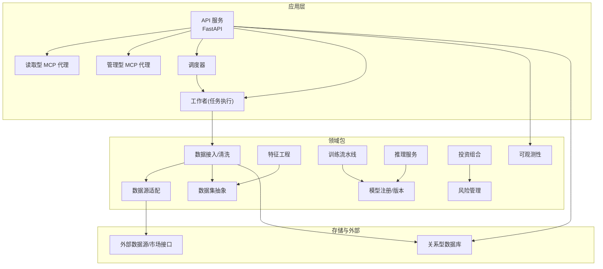
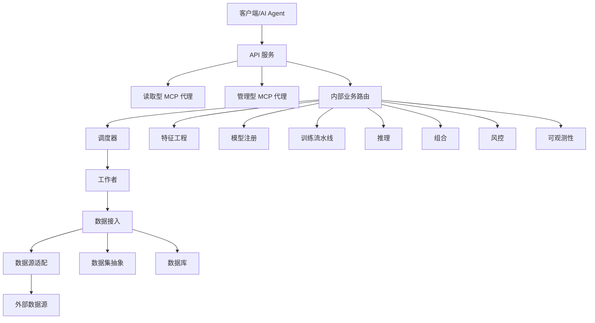
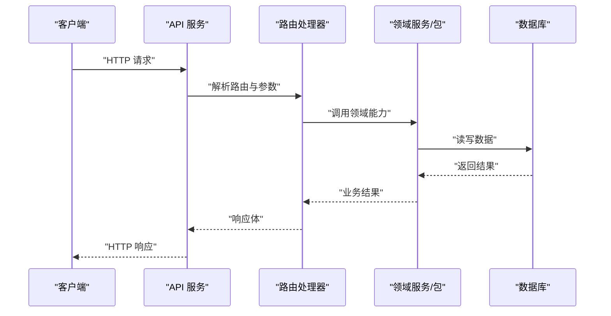
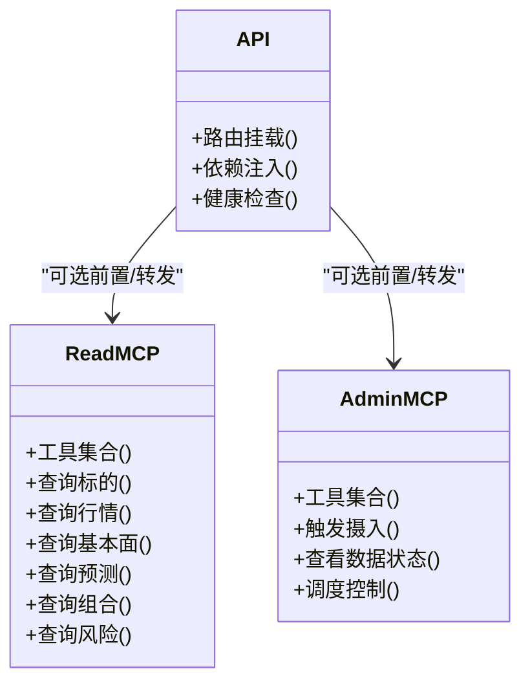
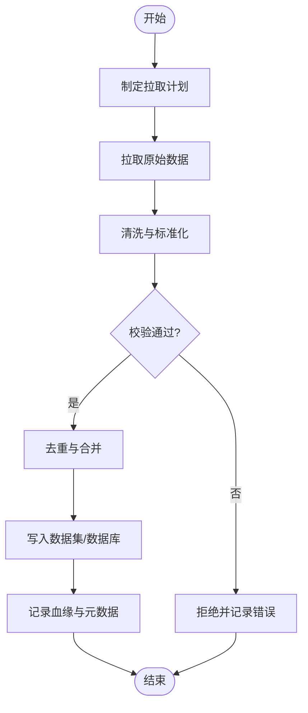
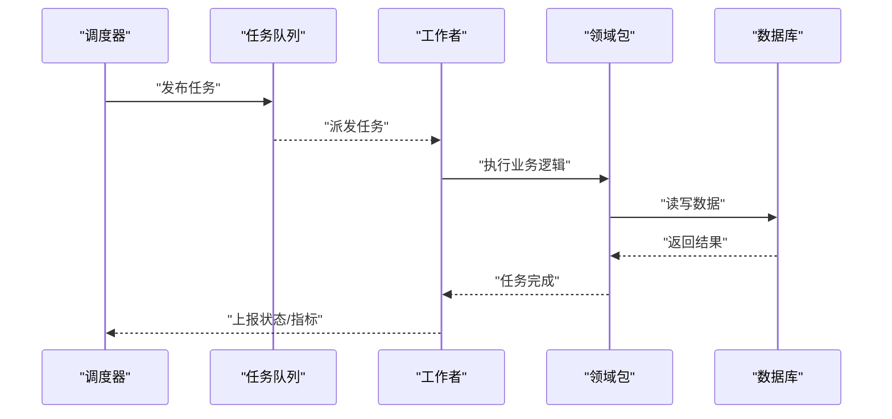
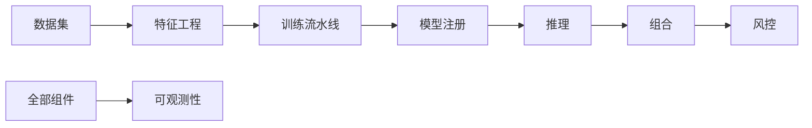
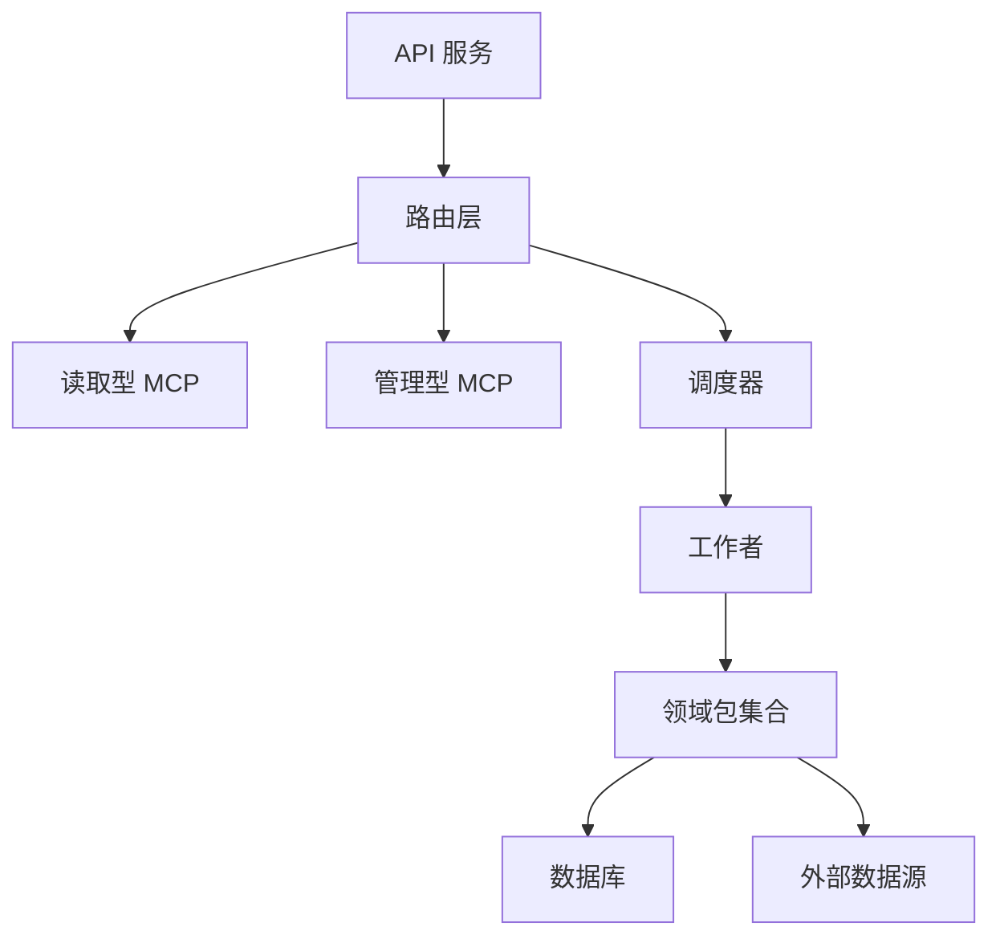
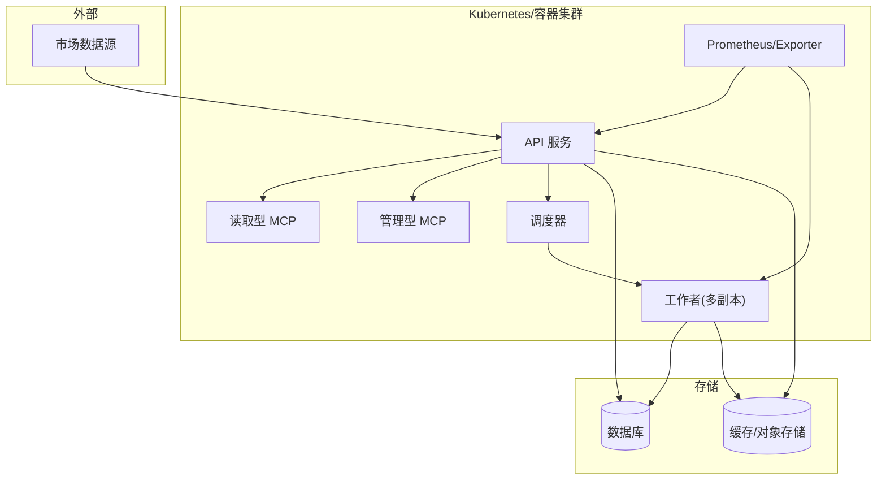

# 系统架构设计

<cite>
**本文引用的文件**   
- [apps/api/main.py](file://apps/api/main.py)
- [apps/api/deps.py](file://apps/api/deps.py)
- [apps/api/routers/instruments.py](file://apps/api/routers/instruments.py)
- [apps/api/routers/markets.py](file://apps/api/routers/markets.py)
- [apps/api/routers/fundamentals.py](file://apps/api/routers/fundamentals.py)
- [apps/api/routers/forecast.py](file://apps/api/routers/forecast.py)
- [apps/api/routers/portfolio.py](file://apps/api/routers/portfolio.py)
- [apps/api/routers/data_status.py](file://apps/api/routers/data_status.py)
- [apps/api/routers/admin_ingestion.py](file://apps/api/routers/admin_ingestion.py)
- [apps/api/routers/scheduler.py](file://apps/api/routers/scheduler.py)
- [apps/quant-read-mcp/server.py](file://apps/quant-read-mcp/server.py)
- [apps/quant-read-mcp/tools.py](file://apps/quant-read-mcp/tools.py)
- [apps/quant-admin-mcp/server.py](file://apps/quant-admin-mcp/server.py)
- [apps/quant-admin-mcp/tools.py](file://apps/quant-admin-mcp/tools.py)
- [apps/scheduler/executor.py](file://apps/scheduler/executor.py)
- [apps/scheduler/schedule.py](file://apps/scheduler/schedule.py)
- [apps/worker/main.py](file://apps/worker/main.py)
- [apps/worker/tasks.py](file://apps/worker/tasks.py)
- [packages/data_sources/__init__.py](file://packages/data_sources/__init__.py)
- [packages/datasets/__init__.py](file://packages/datasets/__init__.py)
- [packages/ingestion/__init__.py](file://packages/ingestion/__init__.py)
- [packages/features/__init__.py](file://packages/features/__init__.py)
- [packages/models/__init__.py](file://packages/models/__init__.py)
- [packages/training/__init__.py](file://packages/training/__init__.py)
- [packages/inference/__init__.py](file://packages/inference/__init__.py)
- [packages/portfolio/__init__.py](file://packages/portfolio/__init__.py)
- [packages/risk/__init__.py](file://packages/risk/__init__.py)
- [packages/observability/__init__.py](file://packages/observability/__init__.py)
- [deploy/docker-compose.yml](file://deploy/docker-compose.yml)
- [deploy/prometheus.yml](file://deploy/prometheus.yml)
- [configs/base.yaml](file://configs/base.yaml)
- [configs/dev.yaml](file://configs/dev.yaml)
- [sql/migrations/env.py](file://sql/migrations/env.py)
</cite>

## 目录
1. [引言](#引言)
2. [项目结构](#项目结构)
3. [核心组件](#核心组件)
4. [架构总览](#架构总览)
5. [详细组件分析](#详细组件分析)
6. [依赖关系分析](#依赖关系分析)
7. [性能与可扩展性](#性能与可扩展性)
8. [安全、监控与灾难恢复](#安全监控与灾难恢复)
9. [部署拓扑与基础设施](#部署拓扑与基础设施)
10. [故障排查指南](#故障排查指南)
11. [结论](#结论)
12. [附录：技术栈与兼容性](#附录技术栈与兼容性)

## 引言
本架构文档面向量化交易MCP系统的整体设计与实现，覆盖API网关、MCP代理层、数据处理管道、调度器与工作者等关键组件的交互关系与数据流。文档同时阐述微服务化设计决策、技术权衡与约束条件，给出系统上下文图与组件分解图，并补充安全性、可观测性与灾难恢复等横切关注点，以及部署拓扑与基础设施需求。

## 项目结构
仓库采用“应用+包”的分层组织方式：
- apps：运行期应用（API服务、MCP代理、调度器、工作者）
- packages：领域能力与通用库（数据源、数据集、特征、模型、训练、推理、组合、风险、可观测性等）
- configs：配置（基础与开发环境）
- deploy：容器编排与监控采集
- sql：数据库迁移脚本
- tests：单元与集成测试

图表来源
- [apps/api/main.py:1-200](file://apps/api/main.py#L1-L200)
- [apps/quant-read-mcp/server.py:1-200](file://apps/quant-read-mcp/server.py#L1-L200)
- [apps/quant-admin-mcp/server.py:1-200](file://apps/quant-admin-mcp/server.py#L1-L200)
- [apps/scheduler/executor.py:1-200](file://apps/scheduler/executor.py#L1-L200)
- [apps/worker/main.py:1-200](file://apps/worker/main.py#L1-L200)
- [packages/data_sources/__init__.py:1-200](file://packages/data_sources/__init__.py#L1-L200)
- [packages/datasets/__init__.py:1-200](file://packages/datasets/__init__.py#L1-L200)
- [packages/ingestion/__init__.py:1-200](file://packages/ingestion/__init__.py#L1-L200)
- [packages/features/__init__.py:1-200](file://packages/features/__init__.py#L1-L200)
- [packages/models/__init__.py:1-200](file://packages/models/__init__.py#L1-L200)
- [packages/training/__init__.py:1-200](file://packages/training/__init__.py#L1-L200)
- [packages/inference/__init__.py:1-200](file://packages/inference/__init__.py#L1-L200)
- [packages/portfolio/__init__.py:1-200](file://packages/portfolio/__init__.py#L1-L200)
- [packages/risk/__init__.py:1-200](file://packages/risk/__init__.py#L1-L200)
- [packages/observability/__init__.py:1-200](file://packages/observability/__init__.py#L1-L200)

章节来源
- [apps/api/main.py:1-200](file://apps/api/main.py#L1-L200)
- [deploy/docker-compose.yml:1-200](file://deploy/docker-compose.yml#L1-L200)

## 核心组件
- API网关（FastAPI服务）
  - 职责：统一对外暴露REST接口；路由到业务模块；鉴权与限流（由中间件或网关前置承担）；请求校验与响应封装；可观测性埋点。
  - 入口与依赖注入：通过主程序初始化应用、挂载路由与依赖解析器。
  - 参考路径：[apps/api/main.py](file://apps/api/main.py)、[apps/api/deps.py](file://apps/api/deps.py)

- MCP代理层（读取与管理两类）
  - 读取型MCP：提供只读工具集，用于查询行情、基本面、组合与风控指标等。
  - 管理型MCP：提供写入/控制类工具，如触发数据摄入、调整策略参数、查看任务状态等。
  - 参考路径：[apps/quant-read-mcp/server.py](file://apps/quant-read-mcp/server.py)、[apps/quant-read-mcp/tools.py](file://apps/quant-read-mcp/tools.py)、[apps/quant-admin-mcp/server.py](file://apps/quant-admin-mcp/server.py)、[apps/quant-admin-mcp/tools.py](file://apps/quant-admin-mcp/tools.py)

- 数据处理管道
  - 数据源适配：对接多市场/多厂商数据，统一协议与时间对齐。
  - 数据集抽象：以表/分区为单位的数据访问抽象，屏蔽底层差异。
  - 数据接入：拉取、清洗、去重、校验、落库与血缘记录。
  - 参考路径：[packages/data_sources/__init__.py](file://packages/data_sources/__init__.py)、[packages/datasets/__init__.py](file://packages/datasets/__init__.py)、[packages/ingestion/__init__.py](file://packages/ingestion/__init__.py)

- 调度器与工作者
  - 调度器：定义周期/事件驱动的任务计划，负责分发与重试。
  - 工作者：消费任务队列，执行具体计算（数据摄入、特征生成、模型训练、推理）。
  - 参考路径：[apps/scheduler/executor.py](file://apps/scheduler/executor.py)、[apps/scheduler/schedule.py](file://apps/scheduler/schedule.py)、[apps/worker/main.py](file://apps/worker/main.py)、[apps/worker/tasks.py](file://apps/worker/tasks.py)

- 领域能力包
  - 特征工程、模型注册、训练流水线、推理、组合与风险管理、可观测性。
  - 参考路径：[packages/features/__init__.py](file://packages/features/__init__.py)、[packages/models/__init__.py](file://packages/models/__init__.py)、[packages/training/__init__.py](file://packages/training/__init__.py)、[packages/inference/__init__.py](file://packages/inference/__init__.py)、[packages/portfolio/__init__.py](file://packages/portfolio/__init__.py)、[packages/risk/__init__.py](file://packages/risk/__init__.py)、[packages/observability/__init__.py](file://packages/observability/__init__.py)

章节来源
- [apps/api/main.py:1-200](file://apps/api/main.py#L1-L200)
- [apps/api/deps.py:1-200](file://apps/api/deps.py#L1-L200)
- [apps/quant-read-mcp/server.py:1-200](file://apps/quant-read-mcp/server.py#L1-L200)
- [apps/quant-admin-mcp/server.py:1-200](file://apps/quant-admin-mcp/server.py#L1-L200)
- [apps/scheduler/executor.py:1-200](file://apps/scheduler/executor.py#L1-L200)
- [apps/worker/main.py:1-200](file://apps/worker/main.py#L1-L200)
- [packages/data_sources/__init__.py:1-200](file://packages/data_sources/__init__.py#L1-L200)
- [packages/datasets/__init__.py:1-200](file://packages/datasets/__init__.py#L1-L200)
- [packages/ingestion/__init__.py:1-200](file://packages/ingestion/__init__.py#L1-L200)
- [packages/features/__init__.py:1-200](file://packages/features/__init__.py#L1-L200)
- [packages/models/__init__.py:1-200](file://packages/models/__init__.py#L1-L200)
- [packages/training/__init__.py:1-200](file://packages/training/__init__.py#L1-L200)
- [packages/inference/__init__.py:1-200](file://packages/inference/__init__.py#L1-L200)
- [packages/portfolio/__init__.py:1-200](file://packages/portfolio/__init__.py#L1-L200)
- [packages/risk/__init__.py:1-200](file://packages/risk/__init__.py#L1-L200)
- [packages/observability/__init__.py:1-200](file://packages/observability/__init__.py#L1-L200)

## 架构总览
系统采用“API网关 + MCP代理 + 领域包 + 调度/工作者 + 存储/外部数据”的微服务式分层架构。API作为统一入口，将请求路由至MCP工具或内部业务逻辑；MCP代理对上层AI/自动化流程暴露结构化能力；调度器按策略驱动批处理与在线任务；工作者执行具体计算；所有持久化与外部数据访问通过标准化包进行解耦。

图表来源
- [apps/api/main.py:1-200](file://apps/api/main.py#L1-L200)
- [apps/quant-read-mcp/server.py:1-200](file://apps/quant-read-mcp/server.py#L1-L200)
- [apps/quant-admin-mcp/server.py:1-200](file://apps/quant-admin-mcp/server.py#L1-L200)
- [apps/scheduler/executor.py:1-200](file://apps/scheduler/executor.py#L1-L200)
- [apps/worker/main.py:1-200](file://apps/worker/main.py#L1-L200)
- [packages/data_sources/__init__.py:1-200](file://packages/data_sources/__init__.py#L1-L200)
- [packages/datasets/__init__.py:1-200](file://packages/datasets/__init__.py#L1-L200)
- [packages/ingestion/__init__.py:1-200](file://packages/ingestion/__init__.py#L1-L200)
- [packages/features/__init__.py:1-200](file://packages/features/__init__.py#L1-L200)
- [packages/models/__init__.py:1-200](file://packages/models/__init__.py#L1-L200)
- [packages/training/__init__.py:1-200](file://packages/training/__init__.py#L1-L200)
- [packages/inference/__init__.py:1-200](file://packages/inference/__init__.py#L1-L200)
- [packages/portfolio/__init__.py:1-200](file://packages/portfolio/__init__.py#L1-L200)
- [packages/risk/__init__.py:1-200](file://packages/risk/__init__.py#L1-L200)
- [packages/observability/__init__.py:1-200](file://packages/observability/__init__.py#L1-L200)

## 详细组件分析

### API网关与路由
- 入口与挂载：应用启动时创建服务实例，挂载各功能路由与健康检查端点。
- 依赖注入：集中声明数据库连接、缓存、外部服务等共享资源，供路由与工具复用。
- 路由划分：
  - 标的与行情：[instruments.py](file://apps/api/routers/instruments.py)、[markets.py](file://apps/api/routers/markets.py)
  - 基本面与预测：[fundamentals.py](file://apps/api/routers/fundamentals.py)、[forecast.py](file://apps/api/routers/forecast.py)
  - 组合与数据状态：[portfolio.py](file://apps/api/routers/portfolio.py)、[data_status.py](file://apps/api/routers/data_status.py)
  - 管理与调度：[admin_ingestion.py](file://apps/api/routers/admin_ingestion.py)、[scheduler.py](file://apps/api/routers/scheduler.py)

图表来源
- [apps/api/main.py:1-200](file://apps/api/main.py#L1-L200)
- [apps/api/routers/instruments.py:1-200](file://apps/api/routers/instruments.py#L1-L200)
- [apps/api/routers/markets.py:1-200](file://apps/api/routers/markets.py#L1-L200)
- [apps/api/routers/fundamentals.py:1-200](file://apps/api/routers/fundamentals.py#L1-L200)
- [apps/api/routers/forecast.py:1-200](file://apps/api/routers/forecast.py#L1-L200)
- [apps/api/routers/portfolio.py:1-200](file://apps/api/routers/portfolio.py#L1-L200)
- [apps/api/routers/data_status.py:1-200](file://apps/api/routers/data_status.py#L1-L200)
- [apps/api/routers/admin_ingestion.py:1-200](file://apps/api/routers/admin_ingestion.py#L1-L200)
- [apps/api/routers/scheduler.py:1-200](file://apps/api/routers/scheduler.py#L1-L200)
- [apps/api/deps.py:1-200](file://apps/api/deps.py#L1-L200)

章节来源
- [apps/api/main.py:1-200](file://apps/api/main.py#L1-L200)
- [apps/api/deps.py:1-200](file://apps/api/deps.py#L1-L200)
- [apps/api/routers/instruments.py:1-200](file://apps/api/routers/instruments.py#L1-L200)
- [apps/api/routers/markets.py:1-200](file://apps/api/routers/markets.py#L1-L200)
- [apps/api/routers/fundamentals.py:1-200](file://apps/api/routers/fundamentals.py#L1-L200)
- [apps/api/routers/forecast.py:1-200](file://apps/api/routers/forecast.py#L1-L200)
- [apps/api/routers/portfolio.py:1-200](file://apps/api/routers/portfolio.py#L1-L200)
- [apps/api/routers/data_status.py:1-200](file://apps/api/routers/data_status.py#L1-L200)
- [apps/api/routers/admin_ingestion.py:1-200](file://apps/api/routers/admin_ingestion.py#L1-L200)
- [apps/api/routers/scheduler.py:1-200](file://apps/api/routers/scheduler.py#L1-L200)

### MCP代理层（读取与管理）
- 读取型MCP：暴露查询工具，如获取标的列表、行情快照、基本面事实、预测结果、组合持仓与风险指标等。
- 管理型MCP：暴露控制工具，如触发数据摄入、查看数据质量与进度、重启/暂停任务等。
- 与API的关系：API可作为MCP的前置网关，统一鉴权、限流与审计；MCP也可独立运行，供AI Agent直接调用。

图表来源
- [apps/quant-read-mcp/server.py:1-200](file://apps/quant-read-mcp/server.py#L1-L200)
- [apps/quant-read-mcp/tools.py:1-200](file://apps/quant-read-mcp/tools.py#L1-L200)
- [apps/quant-admin-mcp/server.py:1-200](file://apps/quant-admin-mcp/server.py#L1-L200)
- [apps/quant-admin-mcp/tools.py:1-200](file://apps/quant-admin-mcp/tools.py#L1-L200)
- [apps/api/main.py:1-200](file://apps/api/main.py#L1-L200)

章节来源
- [apps/quant-read-mcp/server.py:1-200](file://apps/quant-read-mcp/server.py#L1-L200)
- [apps/quant-read-mcp/tools.py:1-200](file://apps/quant-read-mcp/tools.py#L1-L200)
- [apps/quant-admin-mcp/server.py:1-200](file://apps/quant-admin-mcp/server.py#L1-L200)
- [apps/quant-admin-mcp/tools.py:1-200](file://apps/quant-admin-mcp/tools.py#L1-L200)

### 数据处理管道
- 数据源适配：统一不同市场的协议、字段与时区，提供一致的读取接口。
- 数据集抽象：以表/分区为粒度，提供统一的增删改查与元数据访问。
- 数据接入：拉取→清洗→校验→去重→落库→血缘记录，支持增量与全量模式。
- 典型流程：

图表来源
- [packages/data_sources/__init__.py:1-200](file://packages/data_sources/__init__.py#L1-L200)
- [packages/datasets/__init__.py:1-200](file://packages/datasets/__init__.py#L1-L200)
- [packages/ingestion/__init__.py:1-200](file://packages/ingestion/__init__.py#L1-L200)

章节来源
- [packages/data_sources/__init__.py:1-200](file://packages/data_sources/__init__.py#L1-L200)
- [packages/datasets/__init__.py:1-200](file://packages/datasets/__init__.py#L1-L200)
- [packages/ingestion/__init__.py:1-200](file://packages/ingestion/__init__.py#L1-L200)

### 调度器与工作者
- 调度器：维护任务定义与执行计划，支持周期/事件触发；负责任务分发、幂等与重试。
- 工作者：从任务队列消费任务，执行数据摄入、特征生成、模型训练与推理等。
- 典型序列：

图表来源
- [apps/scheduler/executor.py:1-200](file://apps/scheduler/executor.py#L1-L200)
- [apps/scheduler/schedule.py:1-200](file://apps/scheduler/schedule.py#L1-L200)
- [apps/worker/main.py:1-200](file://apps/worker/main.py#L1-L200)
- [apps/worker/tasks.py:1-200](file://apps/worker/tasks.py#L1-L200)

章节来源
- [apps/scheduler/executor.py:1-200](file://apps/scheduler/executor.py#L1-L200)
- [apps/scheduler/schedule.py:1-200](file://apps/scheduler/schedule.py#L1-L200)
- [apps/worker/main.py:1-200](file://apps/worker/main.py#L1-L200)
- [apps/worker/tasks.py:1-200](file://apps/worker/tasks.py#L1-L200)

### 领域能力包（特征/模型/训练/推理/组合/风控/可观测性）
- 特征工程：基于数据集构建因子与标签，输出稳定特征集。
- 模型注册：模型版本、元数据与评估指标管理。
- 训练流水线：数据准备→训练→评估→归档。
- 推理：批量/在线预测，结合组合与风控进行决策。
- 组合与风控：头寸、风险敞口、压力测试与限额控制。
- 可观测性：指标、日志与追踪的统一采集与上报。

图表来源
- [packages/features/__init__.py:1-200](file://packages/features/__init__.py#L1-L200)
- [packages/models/__init__.py:1-200](file://packages/models/__init__.py#L1-L200)
- [packages/training/__init__.py:1-200](file://packages/training/__init__.py#L1-L200)
- [packages/inference/__init__.py:1-200](file://packages/inference/__init__.py#L1-L200)
- [packages/portfolio/__init__.py:1-200](file://packages/portfolio/__init__.py#L1-L200)
- [packages/risk/__init__.py:1-200](file://packages/risk/__init__.py#L1-L200)
- [packages/observability/__init__.py:1-200](file://packages/observability/__init__.py#L1-L200)

章节来源
- [packages/features/__init__.py:1-200](file://packages/features/__init__.py#L1-L200)
- [packages/models/__init__.py:1-200](file://packages/models/__init__.py#L1-L200)
- [packages/training/__init__.py:1-200](file://packages/training/__init__.py#L1-L200)
- [packages/inference/__init__.py:1-200](file://packages/inference/__init__.py#L1-L200)
- [packages/portfolio/__init__.py:1-200](file://packages/portfolio/__init__.py#L1-L200)
- [packages/risk/__init__.py:1-200](file://packages/risk/__init__.py#L1-L200)
- [packages/observability/__init__.py:1-200](file://packages/observability/__init__.py#L1-L200)

## 依赖关系分析
- 组件耦合
  - API与路由：低耦合，通过依赖注入共享资源。
  - MCP与API：松耦合，可通过API转发或直接暴露。
  - 调度器与工作者：通过任务队列解耦，具备水平扩展能力。
  - 领域包：以包边界隔离，避免跨层强依赖。
- 外部依赖
  - 数据库：通过迁移脚本管理schema演进。
  - 外部数据源：通过数据源适配层屏蔽差异。
- 潜在循环依赖
  - 严格遵循“应用→包”单向依赖，禁止包间反向引用。

图表来源
- [apps/api/main.py:1-200](file://apps/api/main.py#L1-L200)
- [apps/quant-read-mcp/server.py:1-200](file://apps/quant-read-mcp/server.py#L1-L200)
- [apps/quant-admin-mcp/server.py:1-200](file://apps/quant-admin-mcp/server.py#L1-L200)
- [apps/scheduler/executor.py:1-200](file://apps/scheduler/executor.py#L1-L200)
- [apps/worker/main.py:1-200](file://apps/worker/main.py#L1-L200)
- [packages/data_sources/__init__.py:1-200](file://packages/data_sources/__init__.py#L1-L200)
- [packages/datasets/__init__.py:1-200](file://packages/datasets/__init__.py#L1-L200)
- [packages/ingestion/__init__.py:1-200](file://packages/ingestion/__init__.py#L1-L200)
- [packages/features/__init__.py:1-200](file://packages/features/__init__.py#L1-L200)
- [packages/models/__init__.py:1-200](file://packages/models/__init__.py#L1-L200)
- [packages/training/__init__.py:1-200](file://packages/training/__init__.py#L1-L200)
- [packages/inference/__init__.py:1-200](file://packages/inference/__init__.py#L1-L200)
- [packages/portfolio/__init__.py:1-200](file://packages/portfolio/__init__.py#L1-L200)
- [packages/risk/__init__.py:1-200](file://packages/risk/__init__.py#L1-L200)
- [packages/observability/__init__.py:1-200](file://packages/observability/__init__.py#L1-L200)

章节来源
- [apps/api/main.py:1-200](file://apps/api/main.py#L1-L200)
- [apps/quant-read-mcp/server.py:1-200](file://apps/quant-read-mcp/server.py#L1-L200)
- [apps/quant-admin-mcp/server.py:1-200](file://apps/quant-admin-mcp/server.py#L1-L200)
- [apps/scheduler/executor.py:1-200](file://apps/scheduler/executor.py#L1-L200)
- [apps/worker/main.py:1-200](file://apps/worker/main.py#L1-L200)
- [packages/data_sources/__init__.py:1-200](file://packages/data_sources/__init__.py#L1-L200)
- [packages/datasets/__init__.py:1-200](file://packages/datasets/__init__.py#L1-L200)
- [packages/ingestion/__init__.py:1-200](file://packages/ingestion/__init__.py#L1-L200)
- [packages/features/__init__.py:1-200](file://packages/features/__init__.py#L1-L200)
- [packages/models/__init__.py:1-200](file://packages/models/__init__.py#L1-L200)
- [packages/training/__init__.py:1-200](file://packages/training/__init__.py#L1-L200)
- [packages/inference/__init__.py:1-200](file://packages/inference/__init__.py#L1-L200)
- [packages/portfolio/__init__.py:1-200](file://packages/portfolio/__init__.py#L1-L200)
- [packages/risk/__init__.py:1-200](file://packages/risk/__init__.py#L1-L200)
- [packages/observability/__init__.py:1-200](file://packages/observability/__init__.py#L1-L200)

## 性能与可扩展性
- 水平扩展
  - API无状态化，配合负载均衡横向扩容。
  - 工作者按任务类型分池，按需扩缩容。
  - 调度器可集群化部署，使用分布式锁与任务队列保证一致性。
- 数据管道优化
  - 增量拉取与分区写入，减少重复IO。
  - 特征与模型产物缓存，降低冷启动开销。
- 资源隔离
  - 训练与推理分离，避免争抢CPU/GPU。
  - 读写分离与冷热数据分层，提升查询吞吐。

## 安全、监控与灾难恢复
- 安全
  - 统一鉴权与授权（建议前置API网关或侧车代理）。
  - 最小权限原则访问数据库与外部数据源。
  - 敏感配置外置（环境变量/密钥管理服务），避免硬编码。
- 监控与告警
  - 指标采集：Prometheus抓取各服务暴露的指标。
  - 日志与追踪：结构化日志与链路追踪贯穿API→MCP→包→存储。
  - 参考配置：[deploy/prometheus.yml](file://deploy/prometheus.yml)
- 灾难恢复
  - 数据库备份与回滚策略，结合迁移脚本确保可逆演进。
  - 任务幂等与重试机制，失败自动补偿。
  - 多副本部署与快速故障转移。

章节来源
- [deploy/prometheus.yml:1-200](file://deploy/prometheus.yml#L1-L200)
- [sql/migrations/env.py:1-200](file://sql/migrations/env.py#L1-L200)

## 部署拓扑与基础设施
- 容器编排
  - 使用docker-compose编排API、MCP、调度器、工作者、数据库与监控组件。
  - 参考配置：[deploy/docker-compose.yml](file://deploy/docker-compose.yml)
- 配置管理
  - 基础配置与环境覆盖：[configs/base.yaml](file://configs/base.yaml)、[configs/dev.yaml](file://configs/dev.yaml)
- 数据库迁移
  - 迁移环境与脚本入口：[sql/migrations/env.py](file://sql/migrations/env.py)

图表来源
- [deploy/docker-compose.yml:1-200](file://deploy/docker-compose.yml#L1-L200)
- [deploy/prometheus.yml:1-200](file://deploy/prometheus.yml#L1-L200)
- [configs/base.yaml:1-200](file://configs/base.yaml#L1-L200)
- [configs/dev.yaml:1-200](file://configs/dev.yaml#L1-L200)
- [sql/migrations/env.py:1-200](file://sql/migrations/env.py#L1-L200)

章节来源
- [deploy/docker-compose.yml:1-200](file://deploy/docker-compose.yml#L1-L200)
- [deploy/prometheus.yml:1-200](file://deploy/prometheus.yml#L1-L200)
- [configs/base.yaml:1-200](file://configs/base.yaml#L1-L200)
- [configs/dev.yaml:1-200](file://configs/dev.yaml#L1-L200)
- [sql/migrations/env.py:1-200](file://sql/migrations/env.py#L1-L200)

## 故障排查指南
- API层
  - 健康检查端点是否可用；路由是否正确挂载；依赖注入的资源是否就绪。
  - 参考路径：[apps/api/main.py](file://apps/api/main.py)、[apps/api/deps.py](file://apps/api/deps.py)
- MCP代理
  - 工具清单是否加载；权限与参数校验是否通过；上游依赖是否可达。
  - 参考路径：[apps/quant-read-mcp/server.py](file://apps/quant-read-mcp/server.py)、[apps/quant-admin-mcp/server.py](file://apps/quant-admin-mcp/server.py)
- 调度与工作者
  - 任务是否入队/出队；重试与死信队列状态；任务幂等键是否冲突。
  - 参考路径：[apps/scheduler/executor.py](file://apps/scheduler/executor.py)、[apps/worker/main.py](file://apps/worker/main.py)、[apps/worker/tasks.py](file://apps/worker/tasks.py)
- 数据管道
  - 数据源连通性、认证与配额；清洗规则与校验失败原因；入库延迟与堆积。
  - 参考路径：[packages/data_sources/__init__.py](file://packages/data_sources/__init__.py)、[packages/ingestion/__init__.py](file://packages/ingestion/__init__.py)
- 可观测性
  - 指标缺失或异常；日志采样率与级别；链路追踪断点定位。
  - 参考路径：[packages/observability/__init__.py](file://packages/observability/__init__.py)、[deploy/prometheus.yml](file://deploy/prometheus.yml)

章节来源
- [apps/api/main.py:1-200](file://apps/api/main.py#L1-L200)
- [apps/api/deps.py:1-200](file://apps/api/deps.py#L1-L200)
- [apps/quant-read-mcp/server.py:1-200](file://apps/quant-read-mcp/server.py#L1-L200)
- [apps/quant-admin-mcp/server.py:1-200](file://apps/quant-admin-mcp/server.py#L1-L200)
- [apps/scheduler/executor.py:1-200](file://apps/scheduler/executor.py#L1-L200)
- [apps/worker/main.py:1-200](file://apps/worker/main.py#L1-L200)
- [apps/worker/tasks.py:1-200](file://apps/worker/tasks.py#L1-L200)
- [packages/data_sources/__init__.py:1-200](file://packages/data_sources/__init__.py#L1-L200)
- [packages/ingestion/__init__.py:1-200](file://packages/ingestion/__init__.py#L1-L200)
- [packages/observability/__init__.py:1-200](file://packages/observability/__init__.py#L1-L200)
- [deploy/prometheus.yml:1-200](file://deploy/prometheus.yml#L1-L200)

## 结论
本架构以API网关为核心入口，结合MCP代理暴露结构化能力，通过调度器与工作者实现异步批处理与在线推理，领域包以清晰边界承载量化研究到生产的关键环节。该设计在可扩展性、可观测性与可运维性方面具备良好平衡，适合在多市场、多数据源的复杂环境中持续演进。

## 附录：技术栈与兼容性
- 运行时与框架
  - Python生态、FastAPI（API服务）、容器化部署（Docker Compose/Kubernetes）
- 数据存储与迁移
  - 关系型数据库（迁移脚本位于sql/migrations）
- 监控与可观测性
  - Prometheus抓取指标，结构化日志与链路追踪
- 配置与环境
  - 基础与开发配置分离，便于多环境管理

章节来源
- [deploy/docker-compose.yml:1-200](file://deploy/docker-compose.yml#L1-L200)
- [deploy/prometheus.yml:1-200](file://deploy/prometheus.yml#L1-L200)
- [configs/base.yaml:1-200](file://configs/base.yaml#L1-L200)
- [configs/dev.yaml:1-200](file://configs/dev.yaml#L1-L200)
- [sql/migrations/env.py:1-200](file://sql/migrations/env.py#L1-L200)