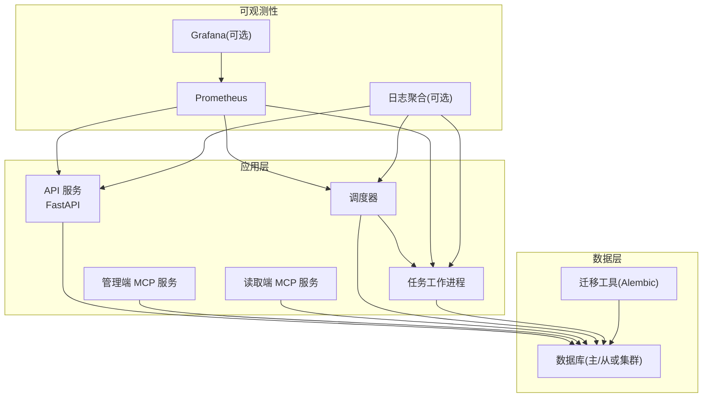
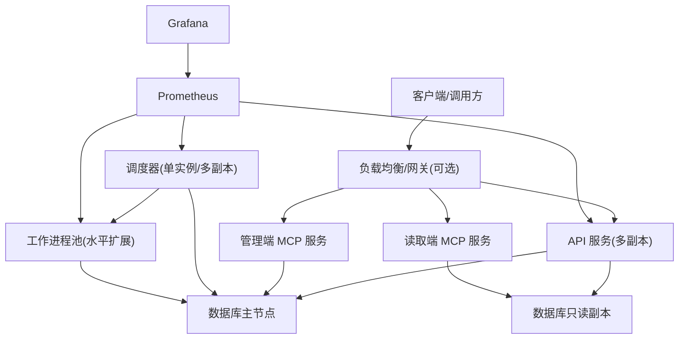
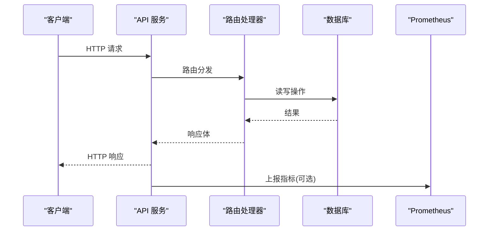
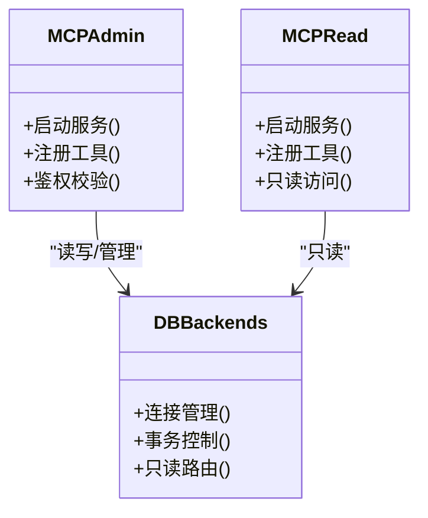
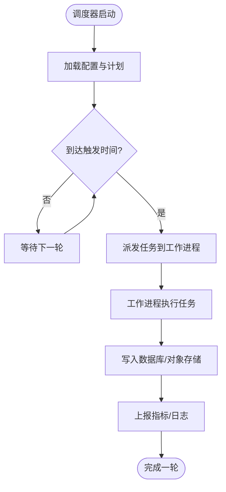
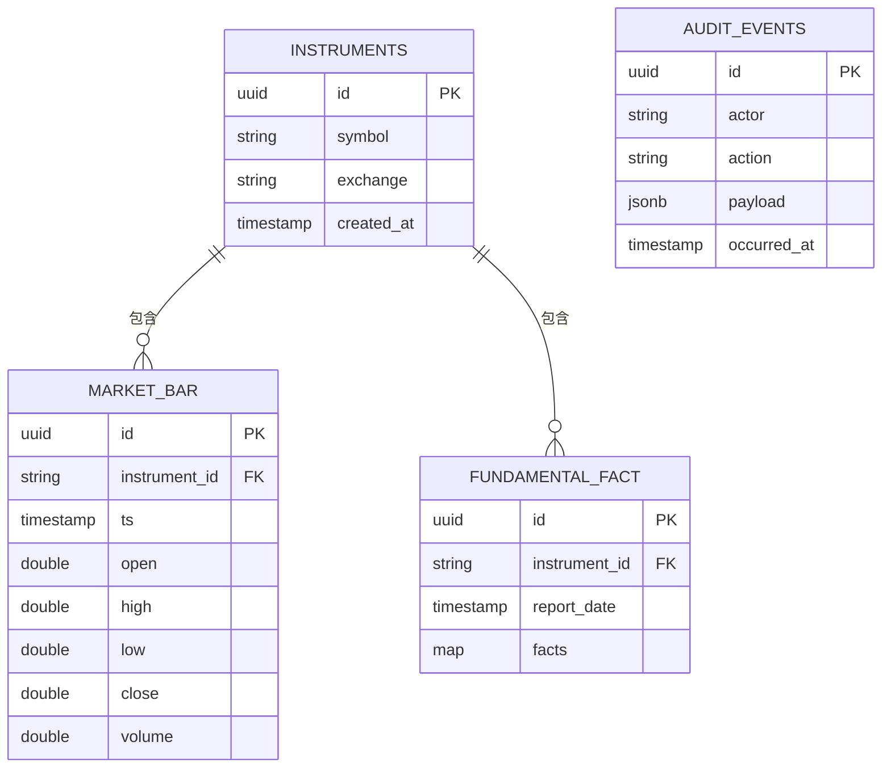
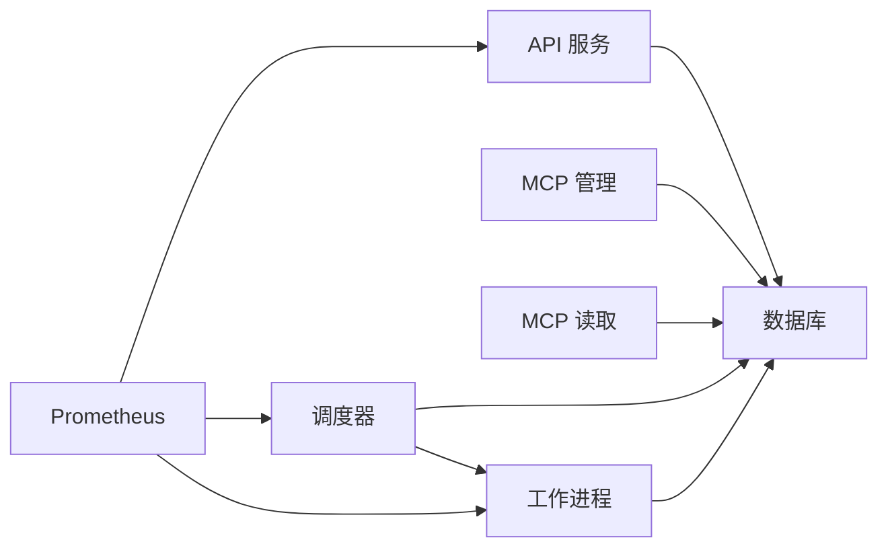
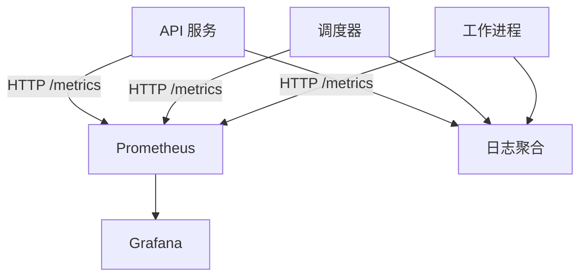
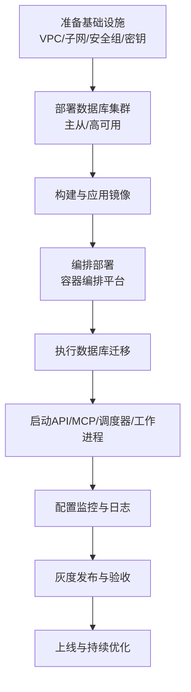

# 部署架构

<cite>
**本文引用的文件**   
- [README.md](file://README.md)
- [pyproject.toml](file://pyproject.toml)
- [deploy/README.md](file://deploy/README.md)
- [deploy/docker-compose.yml](file://deploy/docker-compose.yml)
- [deploy/prometheus.yml](file://deploy/prometheus.yml)
- [configs/base.yaml](file://configs/base.yaml)
- [configs/dev.yaml](file://configs/dev.yaml)
- [apps/api/main.py](file://apps/api/main.py)
- [apps/api/deps.py](file://apps/api/deps.py)
- [apps/api/routers/__init__.py](file://apps/api/routers/__init__.py)
- [apps/api/routers/admin_ingestion.py](file://apps/api/routers/admin_ingestion.py)
- [apps/api/routers/data_status.py](file://apps/api/routers/data_status.py)
- [apps/api/routers/forecast.py](file://apps/api/routers/forecast.py)
- [apps/api/routers/fundamentals.py](file://apps/api/routers/fundamentals.py)
- [apps/api/routers/instruments.py](file://apps/api/routers/instruments.py)
- [apps/api/routers/markets.py](file://apps/api/routers/markets.py)
- [apps/api/routers/portfolio.py](file://apps/api/routers/portfolio.py)
- [apps/api/routers/scheduler.py](file://apps/api/routers/scheduler.py)
- [apps/quant-admin-mcp/server.py](file://apps/quant-admin-mcp/server.py)
- [apps/quant-read-mcp/server.py](file://apps/quant-read-mcp/server.py)
- [apps/quant-read-mcp/db_backends.py](file://apps/quant-read-mcp/db_backends.py)
- [apps/scheduler/executor.py](file://apps/scheduler/executor.py)
- [apps/scheduler/schedule.py](file://apps/scheduler/schedule.py)
- [apps/worker/main.py](file://apps/worker/main.py)
- [apps/worker/tasks.py](file://apps/worker/tasks.py)
- [sql/migrations/env.py](file://sql/migrations/env.py)
- [alembic.ini](file://alembic.ini)
</cite>

## 目录
1. [简介](#简介)
2. [项目结构](#项目结构)
3. [核心组件](#核心组件)
4. [架构总览](#架构总览)
5. [详细组件分析](#详细组件分析)
6. [依赖关系分析](#依赖关系分析)
7. [性能与容量规划](#性能与容量规划)
8. [监控与日志](#监控与日志)
9. [数据库高可用与备份恢复](#数据库高可用与备份恢复)
10. [安全加固与访问控制](#安全加固与访问控制)
11. [部署流程与环境配置清单](#部署流程与环境配置清单)
12. [故障排查指南](#故障排查指南)
13. [结论](#结论)

## 简介
本文件面向生产环境，为量化交易MCP系统提供端到端的部署架构说明。内容涵盖：
- 生产拓扑与基础设施需求
- Docker容器化与编排策略
- 数据库集群与高可用设计
- 监控告警与日志聚合方案
- 部署流程图与环境配置清单
- 容量规划与性能调优
- 备份恢复与灾难恢复
- 安全加固与访问控制

## 项目结构
仓库采用多应用、多包的分层组织方式：
- apps：运行期服务（API、MCP服务器、调度器、工作进程）
- packages：领域能力包（数据源、特征、模型、风控等）
- configs：运行时配置（基础与开发）
- deploy：容器编排与监控配置
- sql/migrations：数据库迁移脚本
- scripts：数据导入与评测脚本
- tests：单元与集成测试

图表来源
- [deploy/docker-compose.yml](file://deploy/docker-compose.yml)
- [apps/api/main.py](file://apps/api/main.py)
- [apps/scheduler/executor.py](file://apps/scheduler/executor.py)
- [apps/worker/main.py](file://apps/worker/main.py)
- [deploy/prometheus.yml](file://deploy/prometheus.yml)

章节来源
- [README.md](file://README.md)
- [pyproject.toml](file://pyproject.toml)
- [deploy/README.md](file://deploy/README.md)

## 核心组件
- API 服务：对外暴露REST接口，承载行情、基本面、组合、预测、调度管理等业务路由。
- MCP 服务：提供模型上下文协议（MCP）接入点，分为管理与读取两类。
- 调度器与工作进程：基于定时任务驱动的数据采集、计算与推理流水线。
- 数据库与迁移：持久化存储与版本化管理。
- 可观测性：指标采集与可视化，支持扩展日志聚合。

章节来源
- [apps/api/main.py](file://apps/api/main.py)
- [apps/api/routers/__init__.py](file://apps/api/routers/__init__.py)
- [apps/quant-admin-mcp/server.py](file://apps/quant-admin-mcp/server.py)
- [apps/quant-read-mcp/server.py](file://apps/quant-read-mcp/server.py)
- [apps/scheduler/executor.py](file://apps/scheduler/executor.py)
- [apps/worker/main.py](file://apps/worker/main.py)
- [sql/migrations/env.py](file://sql/migrations/env.py)
- [alembic.ini](file://alembic.ini)

## 架构总览
生产环境建议将各组件容器化并编排至同一命名空间，通过环境变量注入配置，使用外部数据库集群与对象存储（可选）。

图表来源
- [deploy/docker-compose.yml](file://deploy/docker-compose.yml)
- [deploy/prometheus.yml](file://deploy/prometheus.yml)
- [apps/api/main.py](file://apps/api/main.py)
- [apps/scheduler/executor.py](file://apps/scheduler/executor.py)
- [apps/worker/main.py](file://apps/worker/main.py)

## 详细组件分析

### API 服务
- 职责：统一入口，注册路由、中间件、健康检查、指标暴露。
- 关键路径：
  - 应用初始化与生命周期钩子
  - 路由注册与依赖注入
  - 对外暴露的REST接口集合

图表来源
- [apps/api/main.py](file://apps/api/main.py)
- [apps/api/routers/__init__.py](file://apps/api/routers/__init__.py)
- [apps/api/deps.py](file://apps/api/deps.py)
- [deploy/prometheus.yml](file://deploy/prometheus.yml)

章节来源
- [apps/api/main.py](file://apps/api/main.py)
- [apps/api/deps.py](file://apps/api/deps.py)
- [apps/api/routers/__init__.py](file://apps/api/routers/__init__.py)
- [apps/api/routers/admin_ingestion.py](file://apps/api/routers/admin_ingestion.py)
- [apps/api/routers/data_status.py](file://apps/api/routers/data_status.py)
- [apps/api/routers/forecast.py](file://apps/api/routers/forecast.py)
- [apps/api/routers/fundamentals.py](file://apps/api/routers/fundamentals.py)
- [apps/api/routers/instruments.py](file://apps/api/routers/instruments.py)
- [apps/api/routers/markets.py](file://apps/api/routers/markets.py)
- [apps/api/routers/portfolio.py](file://apps/api/routers/portfolio.py)
- [apps/api/routers/scheduler.py](file://apps/api/routers/scheduler.py)

### MCP 服务（管理与读取）
- 管理端：用于运维与配置管理，具备更高权限。
- 读取端：面向查询与分析，通常连接只读副本。

图表来源
- [apps/quant-admin-mcp/server.py](file://apps/quant-admin-mcp/server.py)
- [apps/quant-read-mcp/server.py](file://apps/quant-read-mcp/server.py)
- [apps/quant-read-mcp/db_backends.py](file://apps/quant-read-mcp/db_backends.py)

章节来源
- [apps/quant-admin-mcp/server.py](file://apps/quant-admin-mcp/server.py)
- [apps/quant-read-mcp/server.py](file://apps/quant-read-mcp/server.py)
- [apps/quant-read-mcp/db_backends.py](file://apps/quant-read-mcp/db_backends.py)

### 调度器与工作进程
- 调度器：负责周期任务的触发与编排。
- 工作进程：执行具体任务（数据采集、清洗、入库、计算等），可水平扩展。

图表来源
- [apps/scheduler/executor.py](file://apps/scheduler/executor.py)
- [apps/scheduler/schedule.py](file://apps/scheduler/schedule.py)
- [apps/worker/main.py](file://apps/worker/main.py)
- [apps/worker/tasks.py](file://apps/worker/tasks.py)

章节来源
- [apps/scheduler/executor.py](file://apps/scheduler/executor.py)
- [apps/scheduler/schedule.py](file://apps/scheduler/schedule.py)
- [apps/worker/main.py](file://apps/worker/main.py)
- [apps/worker/tasks.py](file://apps/worker/tasks.py)

### 数据库与迁移
- 迁移工具：Alembic，配合迁移脚本进行版本化管理。
- 连接参数：由配置文件与容器环境变量注入。

图表来源
- [sql/migrations/versions/20260715_0001_instruments.py](file://sql/migrations/versions/20260715_0001_instruments.py)
- [sql/migrations/versions/20260715_0003_market_bar.py](file://sql/migrations/versions/20260715_0003_market_bar.py)
- [sql/migrations/versions/20260715_0005_fundamental_fact.py](file://sql/migrations/versions/20260715_0005_fundamental_fact.py)
- [sql/migrations/versions/20260715_0002_audit_events.py](file://sql/migrations/versions/20260715_0002_audit_events.py)
- [sql/migrations/env.py](file://sql/migrations/env.py)
- [alembic.ini](file://alembic.ini)

章节来源
- [sql/migrations/env.py](file://sql/migrations/env.py)
- [alembic.ini](file://alembic.ini)

## 依赖关系分析
- 应用间依赖：API/MCP/调度器均依赖数据库；调度器与工作进程之间通过消息队列或直接任务派发（依据实现）。
- 可观测性依赖：Prometheus抓取各组件暴露的指标端点。
- 配置依赖：所有组件通过配置文件与环境变量获取连接串、开关与阈值。

图表来源
- [deploy/docker-compose.yml](file://deploy/docker-compose.yml)
- [deploy/prometheus.yml](file://deploy/prometheus.yml)
- [apps/api/main.py](file://apps/api/main.py)
- [apps/scheduler/executor.py](file://apps/scheduler/executor.py)
- [apps/worker/main.py](file://apps/worker/main.py)

章节来源
- [deploy/docker-compose.yml](file://deploy/docker-compose.yml)
- [deploy/prometheus.yml](file://deploy/prometheus.yml)

## 性能与容量规划
- 水平扩展
  - API/MCP：无状态，按QPS与CPU利用率扩缩容。
  - 工作进程：按任务吞吐与延迟目标扩缩容。
- 资源基线（参考值，需压测校准）
  - API：每副本 2-4 vCPU、4-8 GiB内存，连接池大小根据并发调整。
  - 工作进程：按任务类型分配，I/O密集型加大内存与磁盘IO配额。
  - 调度器：轻量，1-2 vCPU即可。
- 数据库
  - 主库承担写与复杂查询，副本承担读放大场景。
  - 连接池上限=（应用副本数×每副本最大连接数）×安全系数。
- 缓存与批处理
  - 热点查询引入缓存层（如Redis，按需引入）。
  - 批量写入与异步落盘降低峰值压力。

[本节为通用指导，不直接分析具体文件]

## 监控与日志
- 指标采集
  - Prometheus抓取API、调度器与工作进程的指标端点。
  - Grafana可视化展示（可选）。
- 日志聚合
  - 建议集中收集容器标准输出，结合ELK/Loki等方案检索与告警。
- 告警规则
  - 服务可用性、错误率、延迟分位、队列堆积、数据库连接耗尽等。

图表来源
- [deploy/prometheus.yml](file://deploy/prometheus.yml)
- [apps/api/main.py](file://apps/api/main.py)
- [apps/scheduler/executor.py](file://apps/scheduler/executor.py)
- [apps/worker/main.py](file://apps/worker/main.py)

章节来源
- [deploy/prometheus.yml](file://deploy/prometheus.yml)

## 数据库高可用与备份恢复
- 高可用设计
  - 主从复制：主库写、副本读；自动故障切换（由托管DB或中间件保障）。
  - 连接路由：读写分离，MCP读取端仅连副本。
- 备份策略
  - 全量+增量定期备份，保留窗口满足合规要求。
  - 异地多活或跨AZ快照，确保RPO/RTO达标。
- 恢复演练
  - 定期在隔离环境验证恢复流程，记录RTO/RPO达成情况。

[本节为通用指导，不直接分析具体文件]

## 安全加固与访问控制
- 网络与安全组
  - 最小开放端口，限制来源IP段。
  - 内网通信走私有网络，禁止公网直连数据库。
- 身份认证与授权
  - API/MCP启用鉴权中间件，RBAC细粒度控制。
  - 密钥与凭据通过密钥管理服务注入。
- 数据安全
  - 传输加密（TLS），静态加密（磁盘/卷）。
  - 敏感字段脱敏与审计日志留存。
- 镜像与供应链安全
  - 基础镜像最小化，定期扫描漏洞，签名校验。

[本节为通用指导，不直接分析具体文件]

## 部署流程与环境配置清单

### 部署流程图

图表来源
- [deploy/docker-compose.yml](file://deploy/docker-compose.yml)
- [deploy/README.md](file://deploy/README.md)
- [alembic.ini](file://alembic.ini)
- [sql/migrations/env.py](file://sql/migrations/env.py)

### 环境配置清单（示例键名）
- 通用
  - APP_ENV：运行环境（dev/prod）
  - LOG_LEVEL：日志级别
  - METRICS_ENABLED：是否开启指标暴露
- API 服务
  - API_HOST/API_PORT：监听地址与端口
  - API_CORS_ORIGINS：允许的跨域来源
  - API_AUTH_MODE：鉴权模式
- MCP 服务
  - MCP_ADMIN_*：管理端连接与鉴权参数
  - MCP_READ_*：读取端连接与只读标志
- 调度器与工作进程
  - SCHEDULER_CRON：任务计划表达式
  - WORKER_CONCURRENCY：并发度
  - TASK_TIMEOUT：任务超时
- 数据库
  - DB_URL：连接字符串
  - DB_POOL_SIZE：连接池大小
  - DB_MAX_OVERFLOW：溢出连接数
  - DB_ECHO：SQL日志开关（调试用）
- 可观测性
  - PROMETHEUS_ENDPOINT：指标抓取端点
  - LOG_BACKEND：日志后端（stdout/file/remote）

章节来源
- [configs/base.yaml](file://configs/base.yaml)
- [configs/dev.yaml](file://configs/dev.yaml)
- [deploy/docker-compose.yml](file://deploy/docker-compose.yml)
- [alembic.ini](file://alembic.ini)

## 故障排查指南
- 常见问题定位
  - 服务不可用：检查健康检查端点、容器状态、依赖服务连通性。
  - 数据库连接失败：核对连接串、白名单、连接池上限与慢查询。
  - 任务堆积：检查工作进程CPU/IO瓶颈、任务超时与重试策略。
  - 指标缺失：确认Prometheus抓取配置与端点可达。
- 快速命令（概念性）
  - 查看容器日志、重启服务、扩容副本、回滚版本、重放迁移。
- 日志与指标
  - 结合Grafana面板与日志检索工具交叉定位问题根因。

[本节为通用指导，不直接分析具体文件]

## 结论
通过将API、MCP、调度与工作进程容器化并编排，配合数据库高可用与完善的监控日志体系，可在生产环境获得稳定、可扩展且可观测的量化交易MCP系统。建议在上线前完成容量压测、灾备演练与安全加固，形成标准化发布与回滚流程。