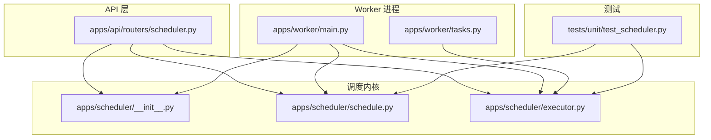
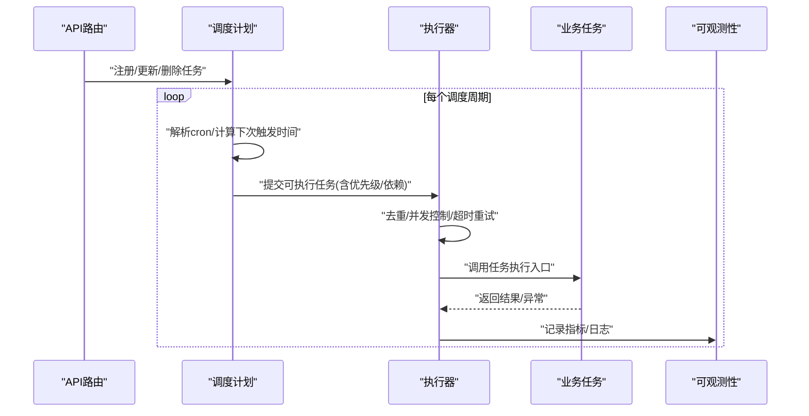
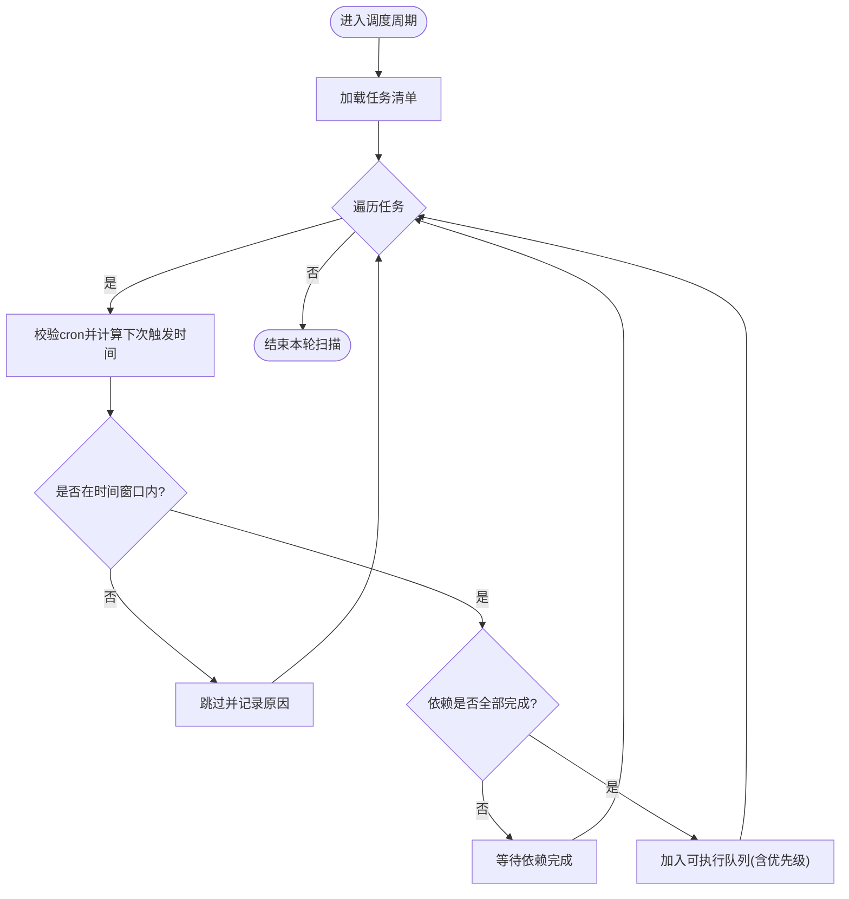
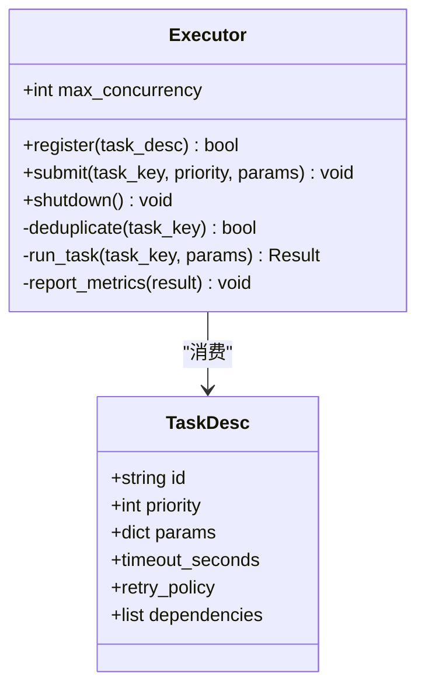
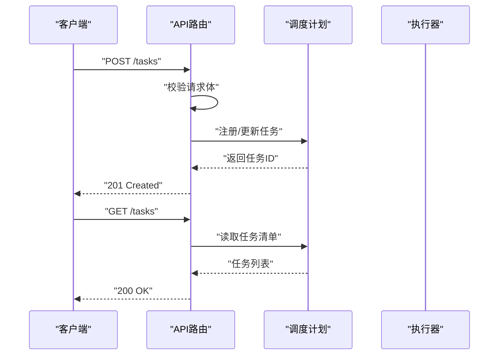
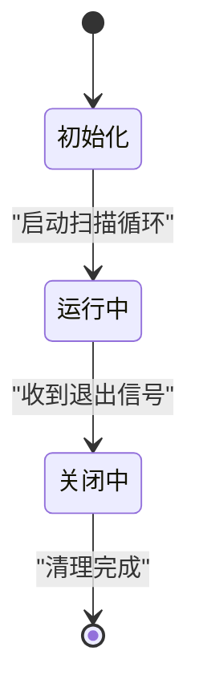
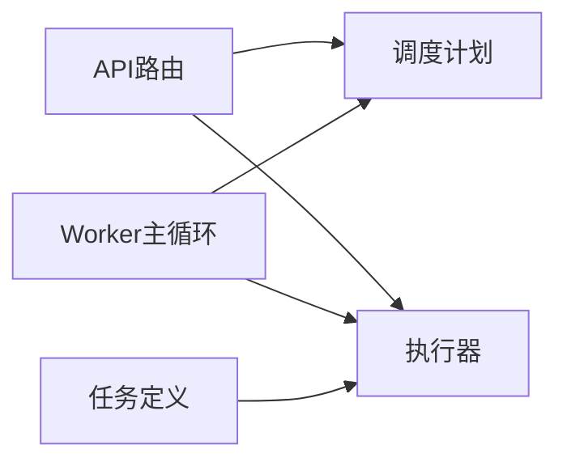

# 任务调度策略

<cite>
**本文引用的文件**   
- [apps/scheduler/__init__.py](file://apps/scheduler/__init__.py)
- [apps/scheduler/executor.py](file://apps/scheduler/executor.py)
- [apps/scheduler/schedule.py](file://apps/scheduler/schedule.py)
- [apps/api/routers/scheduler.py](file://apps/api/routers/scheduler.py)
- [apps/worker/main.py](file://apps/worker/main.py)
- [apps/worker/tasks.py](file://apps/worker/tasks.py)
- [tests/unit/test_scheduler.py](file://tests/unit/test_scheduler.py)
</cite>

## 目录
1. [简介](#简介)
2. [项目结构](#项目结构)
3. [核心组件](#核心组件)
4. [架构总览](#架构总览)
5. [详细组件分析](#详细组件分析)
6. [依赖关系分析](#依赖关系分析)
7. [性能考量](#性能考量)
8. [故障排查指南](#故障排查指南)
9. [结论](#结论)
10. [附录](#附录)

## 简介
本技术文档聚焦于“任务调度策略”模块，围绕定时任务管理、任务优先级与调度算法、cron表达式支持、任务依赖关系管理与执行时间窗口控制、任务去重与重复任务处理、动态任务注册、系统时钟同步与时区/夏令时处理等主题进行深入解析。同时提供常见问题（任务堆积、延迟执行、资源竞争）的排障建议与优化方向。

## 项目结构
调度相关代码主要分布在以下位置：
- 调度内核与执行器：apps/scheduler
- API 路由层（对外暴露调度能力）：apps/api/routers/scheduler.py
- Worker 进程与任务定义：apps/worker
- 单元测试：tests/unit/test_scheduler.py

图表来源
- [apps/scheduler/__init__.py](file://apps/scheduler/__init__.py)
- [apps/scheduler/schedule.py](file://apps/scheduler/schedule.py)
- [apps/scheduler/executor.py](file://apps/scheduler/executor.py)
- [apps/api/routers/scheduler.py](file://apps/api/routers/scheduler.py)
- [apps/worker/main.py](file://apps/worker/main.py)
- [apps/worker/tasks.py](file://apps/worker/tasks.py)
- [tests/unit/test_scheduler.py](file://tests/unit/test_scheduler.py)

章节来源
- [apps/scheduler/__init__.py](file://apps/scheduler/__init__.py)
- [apps/scheduler/schedule.py](file://apps/scheduler/schedule.py)
- [apps/scheduler/executor.py](file://apps/scheduler/executor.py)
- [apps/api/routers/scheduler.py](file://apps/api/routers/scheduler.py)
- [apps/worker/main.py](file://apps/worker/main.py)
- [apps/worker/tasks.py](file://apps/worker/tasks.py)
- [tests/unit/test_scheduler.py](file://tests/unit/test_scheduler.py)

## 核心组件
- 调度计划与表达式解析：负责解析 cron 表达式、计算下一次触发时间、维护任务清单与优先级。
- 执行器：负责任务实例化、去重、并发控制、超时与重试、结果回写与可观测性上报。
- API 路由：提供动态注册、查询、启停任务的接口。
- Worker 主循环：启动调度器与执行器，协调系统时钟、时区与夏令时。
- 任务定义：业务任务以统一接口注册到调度器。

章节来源
- [apps/scheduler/schedule.py](file://apps/scheduler/schedule.py)
- [apps/scheduler/executor.py](file://apps/scheduler/executor.py)
- [apps/api/routers/scheduler.py](file://apps/api/routers/scheduler.py)
- [apps/worker/main.py](file://apps/worker/main.py)
- [apps/worker/tasks.py](file://apps/worker/tasks.py)

## 架构总览
整体采用“计划-执行分离”的架构：调度器按周期扫描待执行任务，将可执行项提交给执行器；执行器在受控并发下运行任务，并保证幂等与去重。

图表来源
- [apps/api/routers/scheduler.py](file://apps/api/routers/scheduler.py)
- [apps/scheduler/schedule.py](file://apps/scheduler/schedule.py)
- [apps/scheduler/executor.py](file://apps/scheduler/executor.py)
- [apps/worker/tasks.py](file://apps/worker/tasks.py)

## 详细组件分析

### 调度计划与表达式解析（schedule.py）
- 功能要点
  - 支持 cron 表达式解析与校验，生成下一次触发时间点。
  - 维护任务元数据：名称、表达式、优先级、依赖集合、时间窗口、是否启用等。
  - 提供任务列表查询、按时间排序、过滤未满足依赖的任务。
- 关键流程
  - 初始化：加载配置、构建任务索引。
  - 扫描：周期性遍历任务，判断当前时间是否在时间窗口内且依赖已满足。
  - 输出：产出“可执行队列”，包含任务标识、优先级与预计开始时间。
- 复杂度与性能
  - 单次扫描为 O(N)，N 为任务数；可通过索引与缓存减少重复计算。
- 错误处理
  - 对非法 cron 表达式进行快速失败与告警。
  - 对缺失依赖或窗口不满足的任务跳过并记录原因。

图表来源
- [apps/scheduler/schedule.py](file://apps/scheduler/schedule.py)

章节来源
- [apps/scheduler/schedule.py](file://apps/scheduler/schedule.py)

### 执行器（executor.py）
- 功能要点
  - 接收来自调度计划的“可执行任务”。
  - 实现任务去重（基于任务ID/键），避免重复提交。
  - 并发控制：限制最大并行度，防止资源竞争。
  - 超时与重试：对长时间运行的任务设置超时，失败时按策略重试。
  - 结果与状态回写：成功/失败/重试次数/耗时等指标上报。
- 关键数据结构
  - 任务描述：唯一标识、参数、优先级、超时、重试策略、依赖快照。
  - 执行上下文：线程/进程池、锁、计数器、指标收集器。
- 复杂度与性能
  - 入队与去重为 O(1)~O(log N)（取决于容器类型）。
  - 并发上限由配置决定，避免 CPU/IO 争用。
- 错误处理
  - 捕获异常并分类：可重试/不可重试。
  - 对死锁/阻塞场景通过超时保护。

图表来源
- [apps/scheduler/executor.py](file://apps/scheduler/executor.py)

章节来源
- [apps/scheduler/executor.py](file://apps/scheduler/executor.py)

### API 路由（scheduler.py）
- 功能要点
  - 提供 REST 接口用于动态注册、更新、删除任务。
  - 提供任务状态查询、立即触发、批量启停等能力。
  - 输入校验：cron 表达式、时间窗口、依赖合法性检查。
- 典型交互
  - POST /tasks：注册新任务。
  - PUT /tasks/{id}：更新任务属性（如优先级、表达式、窗口）。
  - DELETE /tasks/{id}：注销任务。
  - GET /tasks：列出任务及状态。
  - POST /tasks/{id}/trigger：手动触发一次。

图表来源
- [apps/api/routers/scheduler.py](file://apps/api/routers/scheduler.py)
- [apps/scheduler/schedule.py](file://apps/scheduler/schedule.py)

章节来源
- [apps/api/routers/scheduler.py](file://apps/api/routers/scheduler.py)

### Worker 主循环（main.py）
- 功能要点
  - 启动调度器与执行器，绑定系统时钟源。
  - 处理信号量（优雅关闭）、健康检查端点。
  - 初始化时区与夏令时策略，确保时间一致性。
- 生命周期
  - 启动：加载配置、初始化调度器/执行器、启动后台扫描循环。
  - 运行：持续监听并处理事件。
  - 关闭：停止扫描、等待执行器清空队列、释放资源。

图表来源
- [apps/worker/main.py](file://apps/worker/main.py)

章节来源
- [apps/worker/main.py](file://apps/worker/main.py)

### 任务定义（tasks.py）
- 功能要点
  - 定义业务任务入口，统一参数与返回值契约。
  - 提供任务分组与标签，便于监控与限流。
  - 可选：任务内部实现幂等逻辑，配合执行器的去重机制。
- 使用方式
  - 在应用启动阶段向调度器注册任务。
  - 通过 API 动态调整任务属性（如表达式、优先级、窗口）。

章节来源
- [apps/worker/tasks.py](file://apps/worker/tasks.py)

### 单元测试（test_scheduler.py）
- 覆盖范围
  - cron 表达式解析正确性。
  - 任务去重与重复提交抑制。
  - 依赖满足后入队行为。
  - 时间窗口过滤与边界条件。
  - 执行器并发与超时路径。
- 设计思路
  - 使用内存时钟与模拟依赖状态，隔离外部依赖。
  - 断言入队顺序、去重计数、指标上报。

章节来源
- [tests/unit/test_scheduler.py](file://tests/unit/test_scheduler.py)

## 依赖关系分析
- 组件耦合
  - API 路由依赖调度计划与执行器，但不直接操作任务执行细节。
  - 执行器依赖任务描述与可观测性接口，屏蔽底层并发细节。
  - Worker 主循环作为编排者，协调各组件生命周期。
- 外部依赖
  - 系统时钟与本地时区库。
  - 可选：消息队列/持久化存储（用于跨进程/跨节点去重与状态共享）。

图表来源
- [apps/api/routers/scheduler.py](file://apps/api/routers/scheduler.py)
- [apps/scheduler/schedule.py](file://apps/scheduler/schedule.py)
- [apps/scheduler/executor.py](file://apps/scheduler/executor.py)
- [apps/worker/main.py](file://apps/worker/main.py)
- [apps/worker/tasks.py](file://apps/worker/tasks.py)

章节来源
- [apps/api/routers/scheduler.py](file://apps/api/routers/scheduler.py)
- [apps/scheduler/schedule.py](file://apps/scheduler/schedule.py)
- [apps/scheduler/executor.py](file://apps/scheduler/executor.py)
- [apps/worker/main.py](file://apps/worker/main.py)
- [apps/worker/tasks.py](file://apps/worker/tasks.py)

## 性能考量
- 调度扫描频率
  - 根据任务数量与表达式密度调整扫描间隔，避免频繁全表扫描。
- 去重与索引
  - 使用哈希表或有序容器维护任务键与优先级，降低入队成本。
- 并发与背压
  - 合理设置最大并发度，结合任务 IO/CPU 特性选择线程/进程池。
  - 当队列积压时，优先执行高优先级任务，必要时丢弃低优先级任务。
- 超时与重试
  - 为长尾任务设置合理超时，避免资源被长期占用。
  - 重试策略需考虑幂等性与退避曲线，避免雪崩。
- 可观测性
  - 记录任务排队时长、执行时长、失败率、重试次数等指标，辅助容量规划。

[本节为通用指导，无需特定文件引用]

## 故障排查指南
- 任务堆积
  - 现象：队列长度持续增长，任务延迟增大。
  - 排查：检查执行器并发上限、任务超时配置、下游依赖响应时间。
  - 解决：提升并发度、缩短超时、拆分大任务、引入批处理。
- 延迟执行
  - 现象：任务未按预期时间触发。
  - 排查：确认 cron 表达式、时间窗口、系统时钟同步、时区/夏令时设置。
  - 解决：校准系统时间、修正表达式、调整窗口边界。
- 资源竞争
  - 现象：CPU/IO 争用导致抖动或超时。
  - 排查：观察执行器并发与资源使用率，定位热点任务。
  - 解决：限流、分片、异步化、增加资源配额。
- 重复执行
  - 现象：同一任务多次触发。
  - 排查：检查去重键是否稳定、任务幂等性、分布式环境下状态共享。
  - 解决：强化去重键设计、引入分布式锁或幂等表。

章节来源
- [apps/scheduler/executor.py](file://apps/scheduler/executor.py)
- [apps/scheduler/schedule.py](file://apps/scheduler/schedule.py)
- [tests/unit/test_scheduler.py](file://tests/unit/test_scheduler.py)

## 结论
本调度策略模块通过“计划-执行分离”的架构，结合 cron 表达式解析、时间窗口控制、依赖管理与执行器级去重/并发/超时/重试机制，提供了稳定可靠的定时任务处理能力。配合 API 的动态管理能力与完善的可观测性，可满足复杂生产环境下的多样化调度需求。

[本节为总结性内容，无需特定文件引用]

## 附录

### 配置与示例（路径指引）
- 定义 cron 表达式与时间窗口
  - 参考：[apps/scheduler/schedule.py](file://apps/scheduler/schedule.py)
- 注册与更新任务（API）
  - 参考：[apps/api/routers/scheduler.py](file://apps/api/routers/scheduler.py)
- 任务执行与去重/重试
  - 参考：[apps/scheduler/executor.py](file://apps/scheduler/executor.py)
- 任务入口与幂等实现
  - 参考：[apps/worker/tasks.py](file://apps/worker/tasks.py)
- 单元测试用例（验证行为）
  - 参考：[tests/unit/test_scheduler.py](file://tests/unit/test_scheduler.py)

[本节为路径指引，无需额外引用]