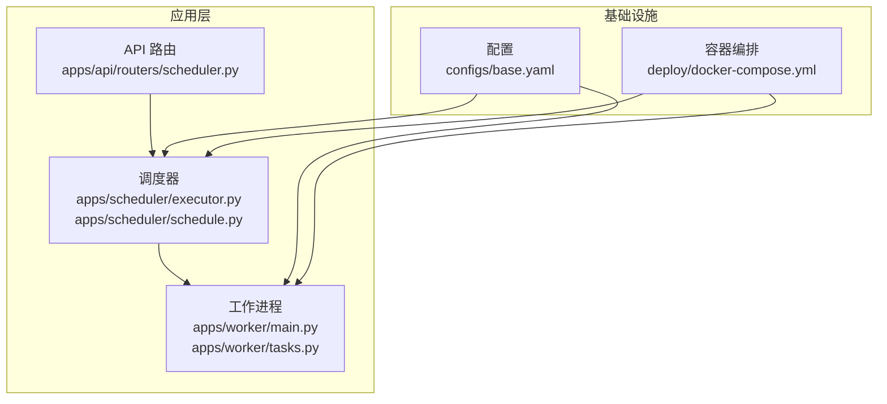
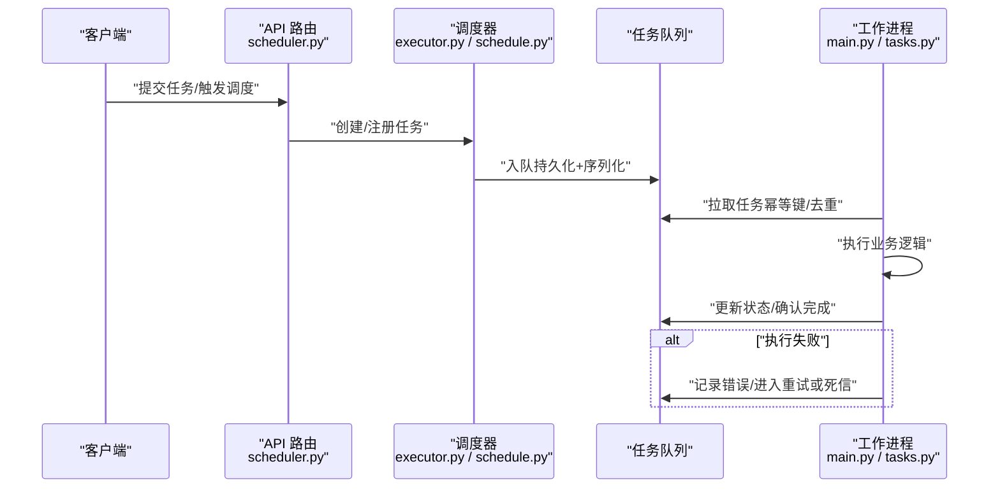
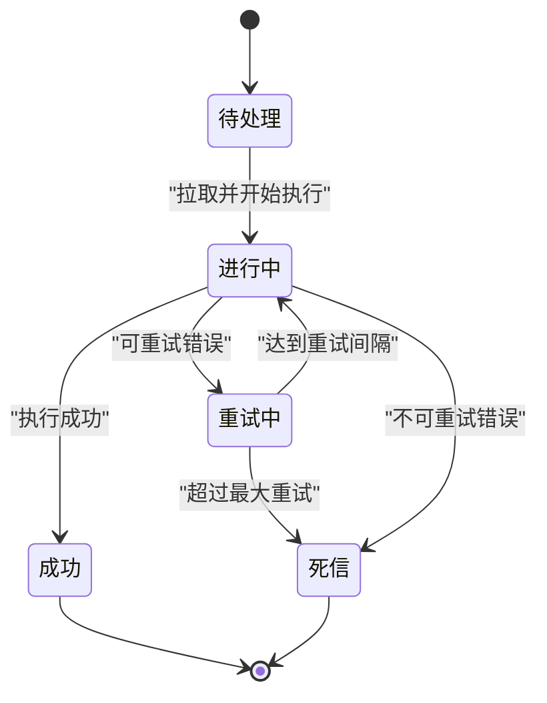
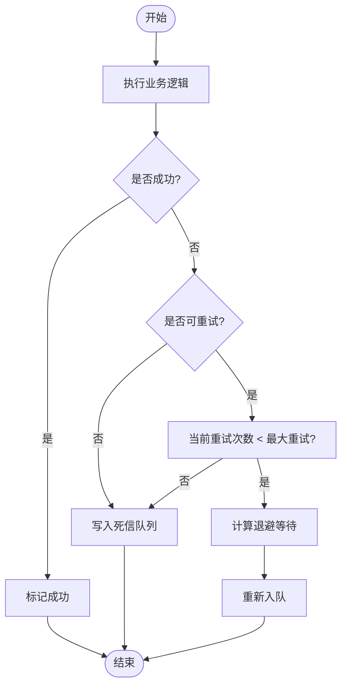
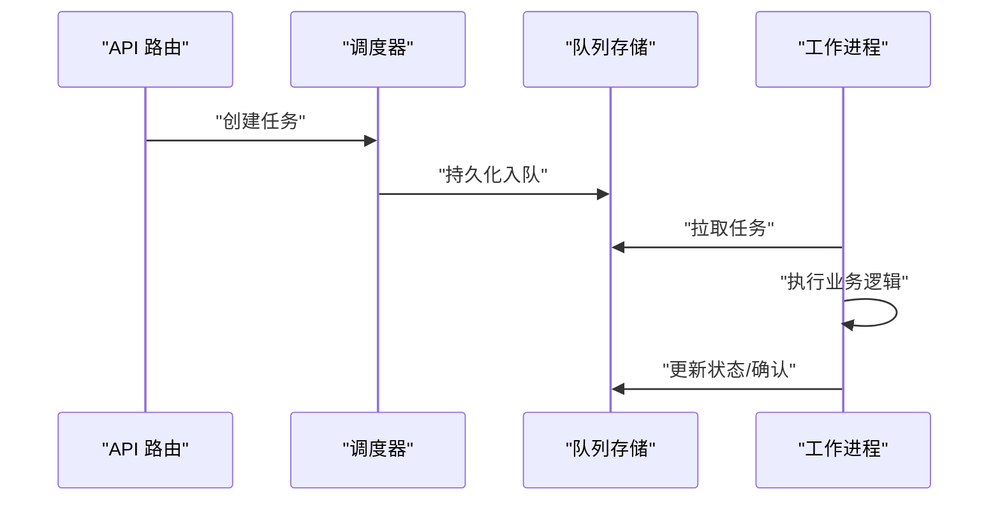
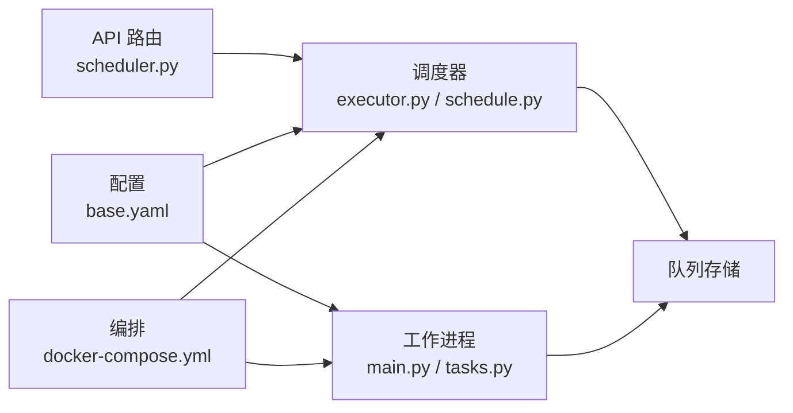

# 任务队列

<cite>
**本文引用的文件**   
- [apps/worker/main.py](file://apps/worker/main.py)
- [apps/worker/tasks.py](file://apps/worker/tasks.py)
- [apps/scheduler/executor.py](file://apps/scheduler/executor.py)
- [apps/scheduler/schedule.py](file://apps/scheduler/schedule.py)
- [apps/api/routers/scheduler.py](file://apps/api/routers/scheduler.py)
- [configs/base.yaml](file://configs/base.yaml)
- [deploy/docker-compose.yml](file://deploy/docker-compose.yml)
- [tests/unit/test_worker_tasks.py](file://tests/unit/test_worker_tasks.py)
- [tests/unit/test_scheduler.py](file://tests/unit/test_scheduler.py)
</cite>

## 目录
1. [简介](#简介)
2. [项目结构](#项目结构)
3. [核心组件](#核心组件)
4. [架构总览](#架构总览)
5. [详细组件分析](#详细组件分析)
6. [依赖关系分析](#依赖关系分析)
7. [性能与扩展性](#性能与扩展性)
8. [故障排查指南](#故障排查指南)
9. [结论](#结论)
10. [附录：入队/出队/消费流程示例路径](#附录入队出队消费流程示例路径)

## 简介
本技术文档围绕仓库中的“任务队列系统”进行系统化说明，覆盖数据结构设计、消息持久化与序列化、任务状态管理、重试与死信处理、分区与分片策略、高可用架构、入队/出队/消费流程、批量与流式处理、积压与丢失/重复消费治理，以及监控指标与告警。文档以代码级事实为依据，结合可视化图示帮助读者快速理解并落地实践。

## 项目结构
与任务队列相关的核心实现分布在以下模块：
- 调度器（Scheduler）：负责定时触发与任务编排
- 工作进程（Worker）：负责拉取并执行任务
- API 路由（API Router）：提供外部触发或查询能力
- 配置（Config）：集中管理队列参数
- 部署（Deploy）：容器编排与可观测性集成

图表来源
- [apps/api/routers/scheduler.py](file://apps/api/routers/scheduler.py)
- [apps/scheduler/executor.py](file://apps/scheduler/executor.py)
- [apps/scheduler/schedule.py](file://apps/scheduler/schedule.py)
- [apps/worker/main.py](file://apps/worker/main.py)
- [apps/worker/tasks.py](file://apps/worker/tasks.py)
- [configs/base.yaml](file://configs/base.yaml)
- [deploy/docker-compose.yml](file://deploy/docker-compose.yml)

章节来源
- [apps/api/routers/scheduler.py](file://apps/api/routers/scheduler.py)
- [apps/scheduler/executor.py](file://apps/scheduler/executor.py)
- [apps/scheduler/schedule.py](file://apps/scheduler/schedule.py)
- [apps/worker/main.py](file://apps/worker/main.py)
- [apps/worker/tasks.py](file://apps/worker/tasks.py)
- [configs/base.yaml](file://configs/base.yaml)
- [deploy/docker-compose.yml](file://deploy/docker-compose.yml)

## 核心组件
- 调度器（Scheduler）
  - 职责：按时间或事件驱动生成任务、将任务投递到队列、维护调度元数据
  - 关键文件：[apps/scheduler/executor.py](file://apps/scheduler/executor.py)、[apps/scheduler/schedule.py](file://apps/scheduler/schedule.py)
- 工作进程（Worker）
  - 职责：从队列拉取任务、执行具体业务逻辑、更新任务状态、处理失败与重试
  - 关键文件：[apps/worker/main.py](file://apps/worker/main.py)、[apps/worker/tasks.py](file://apps/worker/tasks.py)
- API 路由（API）
  - 职责：对外暴露任务提交、查询、重放等接口
  - 关键文件：[apps/api/routers/scheduler.py](file://apps/api/routers/scheduler.py)
- 配置（Config）
  - 职责：集中定义队列容量、并发度、超时、重试策略等
  - 关键文件：[configs/base.yaml](file://configs/base.yaml)
- 部署（Deploy）
  - 职责：多实例编排、健康检查、日志与指标采集
  - 关键文件：[deploy/docker-compose.yml](file://deploy/docker-compose.yml)

章节来源
- [apps/scheduler/executor.py](file://apps/scheduler/executor.py)
- [apps/scheduler/schedule.py](file://apps/scheduler/schedule.py)
- [apps/worker/main.py](file://apps/worker/main.py)
- [apps/worker/tasks.py](file://apps/worker/tasks.py)
- [apps/api/routers/scheduler.py](file://apps/api/routers/scheduler.py)
- [configs/base.yaml](file://configs/base.yaml)
- [deploy/docker-compose.yml](file://deploy/docker-compose.yml)

## 架构总览
整体采用“生产者-消费者”模型：调度器作为生产者，工作进程作为消费者；API 可作为外部触发入口。通过配置与容器编排实现水平扩展与高可用。

图表来源
- [apps/api/routers/scheduler.py](file://apps/api/routers/scheduler.py)
- [apps/scheduler/executor.py](file://apps/scheduler/executor.py)
- [apps/scheduler/schedule.py](file://apps/scheduler/schedule.py)
- [apps/worker/main.py](file://apps/worker/main.py)
- [apps/worker/tasks.py](file://apps/worker/tasks.py)

## 详细组件分析

### 任务数据结构与序列化
- 任务对象字段建议包含：唯一标识、类型、优先级、负载数据、重试次数、最大重试、超时、状态、时间戳、幂等键、分区键等
- 序列化格式：优先使用稳定且跨语言兼容的格式（如 JSON），必要时对二进制负载进行编码
- 幂等键：用于避免重复消费导致的数据不一致
- 分区键：用于控制任务落盘位置，便于分区与热点隔离

章节来源
- [apps/worker/tasks.py](file://apps/worker/tasks.py)
- [apps/scheduler/executor.py](file://apps/scheduler/executor.py)
- [configs/base.yaml](file://configs/base.yaml)

### 任务状态管理与生命周期
- 典型状态：待处理、进行中、成功、失败、重试中、死信
- 状态转换需保证原子性与幂等，避免重复确认造成状态回退
- 失败分支：根据错误类型决定重试或转入死信

图表来源
- [apps/worker/main.py](file://apps/worker/main.py)
- [apps/worker/tasks.py](file://apps/worker/tasks.py)

章节来源
- [apps/worker/main.py](file://apps/worker/main.py)
- [apps/worker/tasks.py](file://apps/worker/tasks.py)

### 重试机制与死信队列
- 重试策略：固定间隔、指数退避、抖动随机化
- 重试上限：基于任务类型或全局策略限制
- 死信队列：用于隔离异常任务，支持人工介入与回放
- 幂等保障：在重试与重复消费场景下确保业务一致性

图表来源
- [apps/worker/main.py](file://apps/worker/main.py)
- [apps/worker/tasks.py](file://apps/worker/tasks.py)

章节来源
- [apps/worker/main.py](file://apps/worker/main.py)
- [apps/worker/tasks.py](file://apps/worker/tasks.py)

### 队列分区与分片策略
- 分区键选择：依据业务维度（如标的、日期、租户）划分，降低热点
- 分片策略：按哈希或范围分片，保证同一幂等键的任务始终落在同一分区
- 负载均衡：消费者组内轮询或最少连接分配，避免单点过载

章节来源
- [configs/base.yaml](file://configs/base.yaml)
- [apps/scheduler/executor.py](file://apps/scheduler/executor.py)
- [apps/worker/main.py](file://apps/worker/main.py)

### 高可用与容错
- 多副本与主备：队列后端与消费者均支持多实例部署
- 故障转移：消费者心跳与健康检查，自动剔除异常节点
- 数据持久化：任务持久化存储，重启后可恢复
- 幂等与去重：通过幂等键与去重表避免重复处理

章节来源
- [deploy/docker-compose.yml](file://deploy/docker-compose.yml)
- [configs/base.yaml](file://configs/base.yaml)
- [apps/worker/main.py](file://apps/worker/main.py)

### 入队、出队与消费处理流程（代码级）
- 入队：由调度器或 API 触发，构造任务对象并持久化入队
- 出队：工作进程按策略拉取任务，获取锁或偏移量
- 消费：执行业务逻辑，更新状态，处理异常与重试

图表来源
- [apps/api/routers/scheduler.py](file://apps/api/routers/scheduler.py)
- [apps/scheduler/executor.py](file://apps/scheduler/executor.py)
- [apps/worker/main.py](file://apps/worker/main.py)

章节来源
- [apps/api/routers/scheduler.py](file://apps/api/routers/scheduler.py)
- [apps/scheduler/executor.py](file://apps/scheduler/executor.py)
- [apps/worker/main.py](file://apps/worker/main.py)

### 批量操作与流式处理
- 批量拉取：提高吞吐，减少网络往返
- 批量确认：提升确认效率，注意失败回滚与部分确认策略
- 流式处理：对长任务或大数据集采用分片与流水线处理

章节来源
- [apps/worker/main.py](file://apps/worker/main.py)
- [apps/worker/tasks.py](file://apps/worker/tasks.py)

### 监控指标与告警
- 关键指标：入队速率、出队速率、堆积量、平均延迟、P99/P999 延迟、失败率、重试率、死信数、消费者健康状态
- 采集方式：在关键路径埋点，统一上报至监控系统
- 告警规则：阈值与趋势结合，区分严重级别

章节来源
- [deploy/docker-compose.yml](file://deploy/docker-compose.yml)
- [configs/base.yaml](file://configs/base.yaml)

## 依赖关系分析
- 组件耦合
  - API 路由依赖调度器接口
  - 调度器依赖队列存储与配置
  - 工作进程依赖队列存储与任务处理器
- 外部依赖
  - 配置中心（YAML）
  - 容器编排（Docker Compose）
  - 监控与日志（由编排与配置注入）

图表来源
- [apps/api/routers/scheduler.py](file://apps/api/routers/scheduler.py)
- [apps/scheduler/executor.py](file://apps/scheduler/executor.py)
- [apps/scheduler/schedule.py](file://apps/scheduler/schedule.py)
- [apps/worker/main.py](file://apps/worker/main.py)
- [apps/worker/tasks.py](file://apps/worker/tasks.py)
- [configs/base.yaml](file://configs/base.yaml)
- [deploy/docker-compose.yml](file://deploy/docker-compose.yml)

章节来源
- [apps/api/routers/scheduler.py](file://apps/api/routers/scheduler.py)
- [apps/scheduler/executor.py](file://apps/scheduler/executor.py)
- [apps/scheduler/schedule.py](file://apps/scheduler/schedule.py)
- [apps/worker/main.py](file://apps/worker/main.py)
- [apps/worker/tasks.py](file://apps/worker/tasks.py)
- [configs/base.yaml](file://configs/base.yaml)
- [deploy/docker-compose.yml](file://deploy/docker-compose.yml)

## 性能与扩展性
- 吞吐优化
  - 调整消费者并发度与批量大小
  - 合理设置超时与重试间隔，避免雪崩
- 延迟优化
  - 热点分区拆分与再平衡
  - 预取与背压控制
- 扩展性
  - 水平扩展消费者实例
  - 分区扩容与迁移策略
- 资源隔离
  - 不同任务类型使用独立队列或标签分组

章节来源
- [configs/base.yaml](file://configs/base.yaml)
- [deploy/docker-compose.yml](file://deploy/docker-compose.yml)
- [apps/worker/main.py](file://apps/worker/main.py)

## 故障排查指南
- 常见现象
  - 队列积压：检查消费者健康、重试风暴、下游依赖瓶颈
  - 消息丢失：确认持久化与确认语义、幂等键与去重
  - 重复消费：校验幂等键与事务边界
- 定位步骤
  - 查看任务状态分布与失败原因
  - 核对重试次数与死信数量
  - 检查消费者日志与指标
- 恢复措施
  - 暂停非关键任务，优先消化积压
  - 修复下游依赖后重放死信任务
  - 调整重试与批大小参数

章节来源
- [apps/worker/main.py](file://apps/worker/main.py)
- [apps/worker/tasks.py](file://apps/worker/tasks.py)
- [tests/unit/test_worker_tasks.py](file://tests/unit/test_worker_tasks.py)
- [tests/unit/test_scheduler.py](file://tests/unit/test_scheduler.py)

## 结论
该任务队列系统通过清晰的调度-消费分离、完善的状态机与重试/死信机制、合理的分区与分片策略，以及容器化的高可用部署，实现了可扩展、可观测、可恢复的任务处理能力。建议在上线前完善监控指标与告警规则，并在压测中验证批量与流式处理的性能表现。

## 附录：入队/出队/消费流程示例路径
- 入队示例（API 触发）
  - [apps/api/routers/scheduler.py](file://apps/api/routers/scheduler.py)
- 调度与入队（调度器）
  - [apps/scheduler/executor.py](file://apps/scheduler/executor.py)
  - [apps/scheduler/schedule.py](file://apps/scheduler/schedule.py)
- 出队与消费（工作进程）
  - [apps/worker/main.py](file://apps/worker/main.py)
  - [apps/worker/tasks.py](file://apps/worker/tasks.py)
- 单元测试参考
  - [tests/unit/test_worker_tasks.py](file://tests/unit/test_worker_tasks.py)
  - [tests/unit/test_scheduler.py](file://tests/unit/test_scheduler.py)