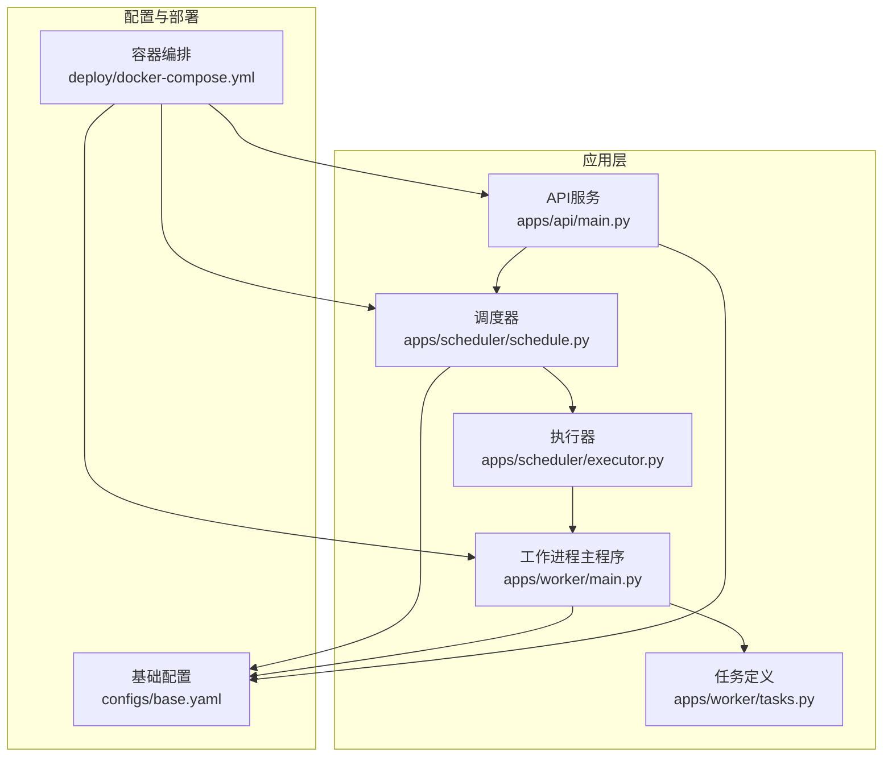
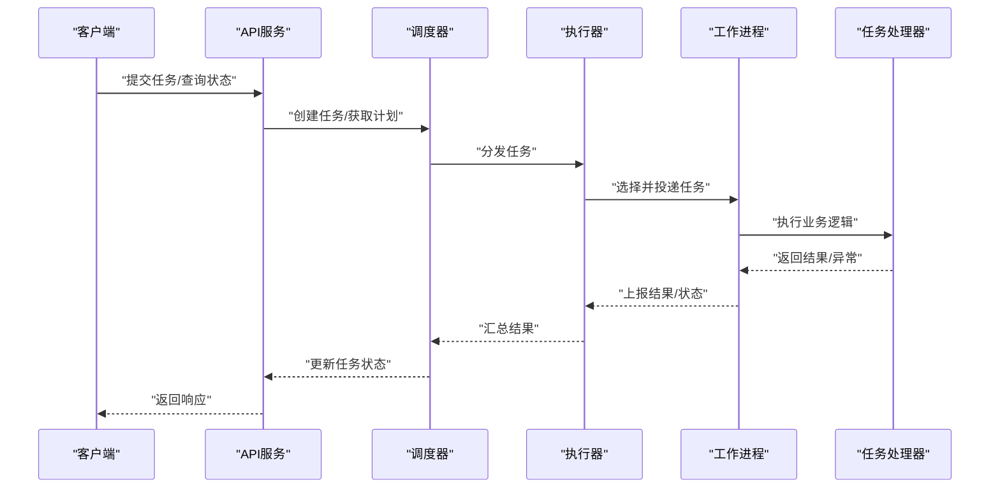
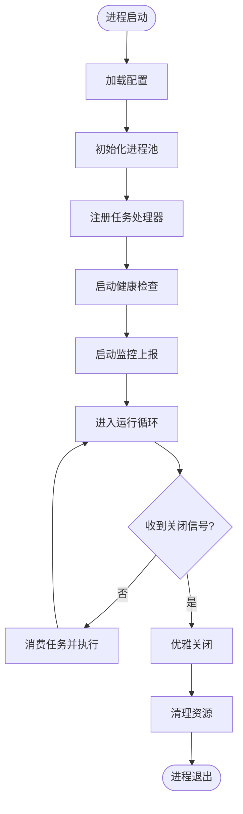
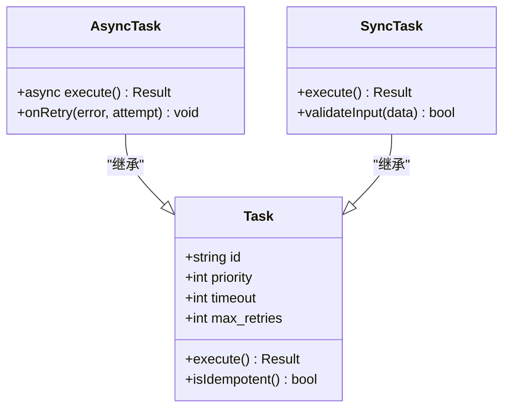
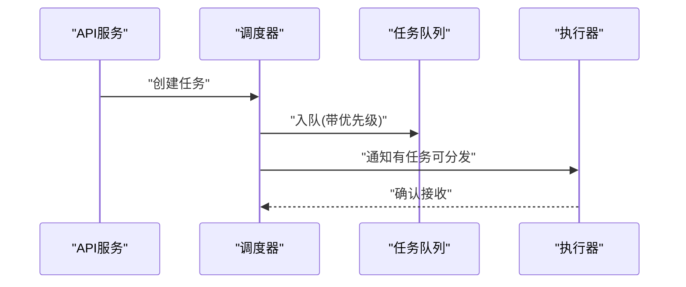
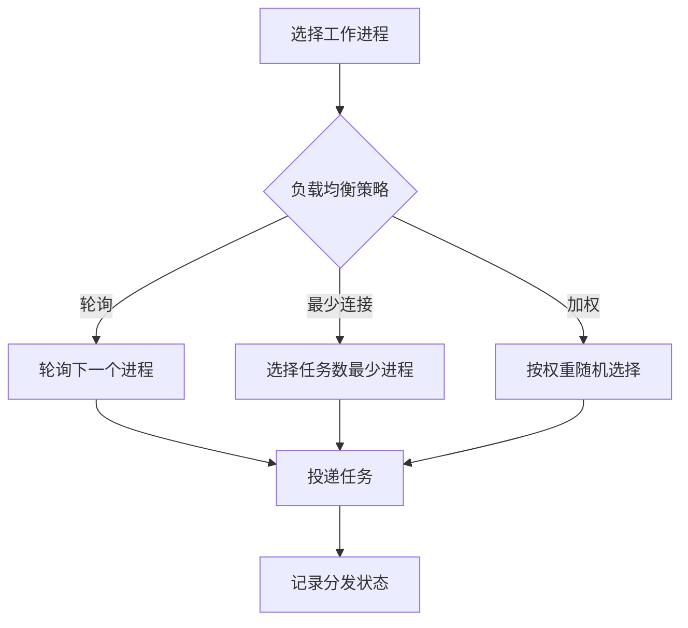
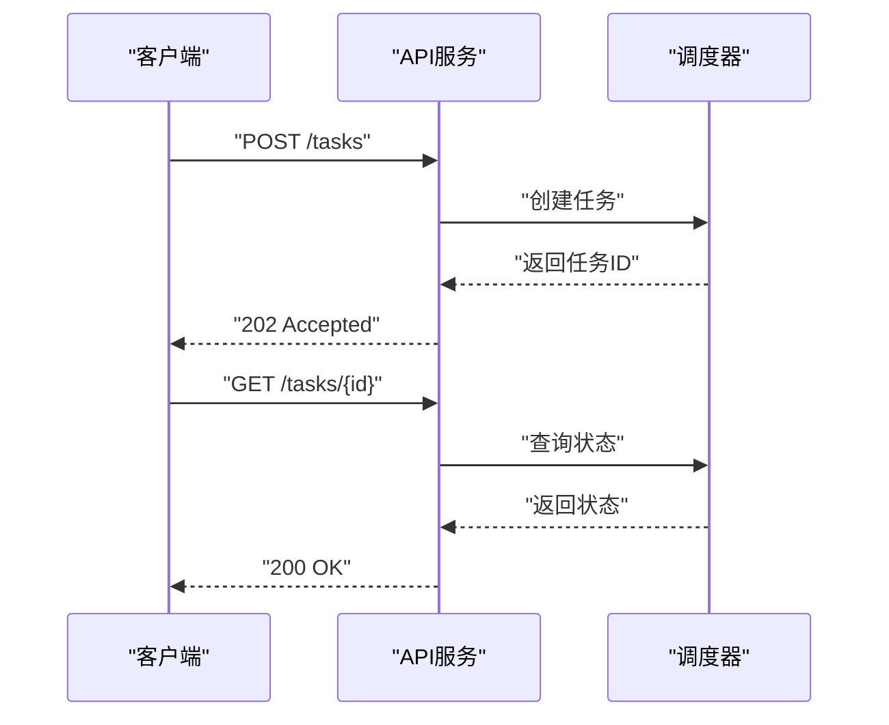
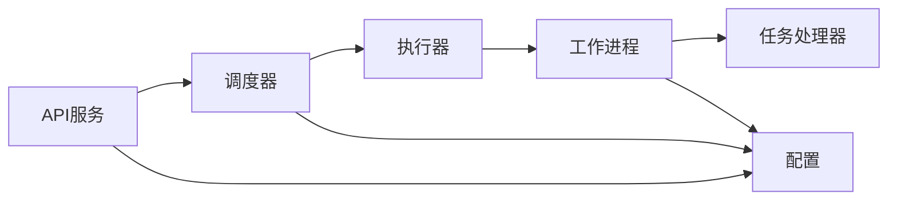

# 工作进程管理

<cite>
**本文引用的文件**   
- [apps/worker/main.py](file://apps/worker/main.py)
- [apps/worker/tasks.py](file://apps/worker/tasks.py)
- [apps/scheduler/executor.py](file://apps/scheduler/executor.py)
- [apps/scheduler/schedule.py](file://apps/scheduler/schedule.py)
- [apps/api/main.py](file://apps/api/main.py)
- [configs/base.yaml](file://configs/base.yaml)
- [deploy/docker-compose.yml](file://deploy/docker-compose.yml)
</cite>

## 目录
1. [简介](#简介)
2. [项目结构](#项目结构)
3. [核心组件](#核心组件)
4. [架构总览](#架构总览)
5. [详细组件分析](#详细组件分析)
6. [依赖关系分析](#依赖关系分析)
7. [性能考量](#性能考量)
8. [故障排查指南](#故障排查指南)
9. [结论](#结论)
10. [附录](#附录)

## 简介
本技术文档围绕“工作进程管理系统”展开，聚焦以下目标：
- 工作进程池的创建、销毁与生命周期管理
- 进程间通信、任务分发与负载均衡算法
- 进程监控、健康检查与自动重启机制
- 异步任务处理与工作进程使用示例
- 资源限制、内存管理与CPU亲和性设置
- 多进程环境下的数据共享、锁机制与并发安全
- 进程崩溃恢复与优雅关闭流程

为便于理解，文档在给出高层概览的同时，提供基于仓库实际代码的结构化分析与图示。

## 项目结构
仓库中与“工作进程管理”直接相关的模块主要位于 apps 子目录下：
- apps/worker：工作进程入口与任务定义
- apps/scheduler：调度器与执行器（负责任务编排与分发）
- apps/api：API服务（对外暴露接口，可能用于触发任务或查询状态）
- configs：配置中心（包含基础配置）
- deploy：部署编排（容器编排与运行参数）

图表来源
- [apps/api/main.py](file://apps/api/main.py)
- [apps/scheduler/schedule.py](file://apps/scheduler/schedule.py)
- [apps/scheduler/executor.py](file://apps/scheduler/executor.py)
- [apps/worker/main.py](file://apps/worker/main.py)
- [apps/worker/tasks.py](file://apps/worker/tasks.py)
- [configs/base.yaml](file://configs/base.yaml)
- [deploy/docker-compose.yml](file://deploy/docker-compose.yml)

章节来源
- [apps/worker/main.py](file://apps/worker/main.py)
- [apps/worker/tasks.py](file://apps/worker/tasks.py)
- [apps/scheduler/executor.py](file://apps/scheduler/executor.py)
- [apps/scheduler/schedule.py](file://apps/scheduler/schedule.py)
- [apps/api/main.py](file://apps/api/main.py)
- [configs/base.yaml](file://configs/base.yaml)
- [deploy/docker-compose.yml](file://deploy/docker-compose.yml)

## 核心组件
- 工作进程主程序（Worker Main）
  - 职责：启动工作进程、加载配置、注册任务处理器、维护进程池、处理信号以实现优雅关闭、进行健康检查与心跳上报。
  - 关键能力：进程池生命周期管理、任务消费、资源限制、CPU亲和性、监控指标采集。
- 任务定义（Tasks）
  - 职责：定义可被调度的任务类型与处理逻辑；支持同步与异步任务；实现幂等性与重试策略。
- 调度器（Scheduler）
  - 职责：根据时间规则或事件触发任务；将任务投递到执行器；维护任务队列与优先级。
- 执行器（Executor）
  - 职责：从队列中拉取任务并分发给工作进程；实现负载均衡策略（如轮询、最少连接、加权分配）；跟踪任务状态与结果回传。
- API服务（API）
  - 职责：对外暴露任务提交、状态查询、健康检查等接口；与调度器交互。
- 配置（Config）
  - 职责：集中管理进程数量、队列大小、超时、重试、资源限制、CPU亲和性等参数。
- 部署（Docker Compose）
  - 职责：编排各服务实例、环境变量注入、健康检查探针、重启策略。

章节来源
- [apps/worker/main.py](file://apps/worker/main.py)
- [apps/worker/tasks.py](file://apps/worker/tasks.py)
- [apps/scheduler/executor.py](file://apps/scheduler/executor.py)
- [apps/scheduler/schedule.py](file://apps/scheduler/schedule.py)
- [apps/api/main.py](file://apps/api/main.py)
- [configs/base.yaml](file://configs/base.yaml)
- [deploy/docker-compose.yml](file://deploy/docker-compose.yml)

## 架构总览
整体采用“调度器-执行器-工作进程”的分层架构：
- API接收外部请求，交由调度器编排任务
- 调度器按策略生成任务并投递至执行器
- 执行器负责负载均衡与任务分发，将任务路由到合适的工作进程
- 工作进程执行具体任务，并将结果回传给执行器与调度器
- 配置统一管理运行时参数，部署编排保证高可用与自愈

图表来源
- [apps/api/main.py](file://apps/api/main.py)
- [apps/scheduler/schedule.py](file://apps/scheduler/schedule.py)
- [apps/scheduler/executor.py](file://apps/scheduler/executor.py)
- [apps/worker/main.py](file://apps/worker/main.py)
- [apps/worker/tasks.py](file://apps/worker/tasks.py)

## 详细组件分析

### 工作进程主程序（Worker Main）
- 进程池创建与销毁
  - 启动时根据配置初始化进程池，动态调整池大小以应对负载变化
  - 优雅关闭：捕获系统信号，停止接受新任务，等待已提交任务完成后再退出
- 生命周期管理
  - 初始化阶段：加载配置、建立日志、注册任务处理器、启动监控与健康检查
  - 运行阶段：持续消费任务、执行、上报指标
  - 关闭阶段：清理资源、持久化状态、发送退出信号
- 进程监控与健康检查
  - 定期上报心跳与指标（CPU、内存、任务吞吐、错误率）
  - 健康端点用于外部探针检测存活与就绪状态
- 资源限制与CPU亲和性
  - 通过配置限制单进程最大内存、文件描述符、线程数
  - CPU亲和性绑定到指定核以提升缓存命中率与降低上下文切换

图表来源
- [apps/worker/main.py](file://apps/worker/main.py)

章节来源
- [apps/worker/main.py](file://apps/worker/main.py)

### 任务定义（Tasks）
- 任务类型与处理逻辑
  - 定义任务元数据（ID、优先级、超时、重试次数）
  - 实现业务处理函数，支持同步与异步模式
- 幂等性与重试
  - 对重复任务具备幂等性保障
  - 失败重试策略：指数退避、最大重试次数、死信队列
- 异步任务处理
  - 使用事件循环或协程处理IO密集型任务
  - 任务拆分与合并，提升吞吐

图表来源
- [apps/worker/tasks.py](file://apps/worker/tasks.py)

章节来源
- [apps/worker/tasks.py](file://apps/worker/tasks.py)

### 调度器（Scheduler）
- 任务编排
  - 基于时间规则或事件驱动生成任务
  - 维护任务队列与优先级，支持批量调度
- 与执行器协作
  - 将任务投递给执行器，并跟踪任务生命周期
  - 处理任务取消与超时

图表来源
- [apps/scheduler/schedule.py](file://apps/scheduler/schedule.py)
- [apps/scheduler/executor.py](file://apps/scheduler/executor.py)

章节来源
- [apps/scheduler/schedule.py](file://apps/scheduler/schedule.py)
- [apps/scheduler/executor.py](file://apps/scheduler/executor.py)

### 执行器（Executor）
- 负载均衡算法
  - 轮询（Round Robin）：均匀分配任务到空闲工作进程
  - 最少连接（Least Connections）：优先选择当前任务数最少的进程
  - 加权分配（Weighted）：根据进程能力或历史表现分配权重
- 任务分发与状态跟踪
  - 维护工作进程健康状态与容量上限
  - 记录任务分发路径与耗时，便于观测与优化

图表来源
- [apps/scheduler/executor.py](file://apps/scheduler/executor.py)

章节来源
- [apps/scheduler/executor.py](file://apps/scheduler/executor.py)

### API服务（API）
- 对外接口
  - 任务提交：接收任务参数并调用调度器
  - 状态查询：根据任务ID查询执行进度与结果
  - 健康检查：返回服务存活与就绪状态
- 与调度器集成
  - 通过内部RPC或消息通道与调度器交互
  - 限流与鉴权保护

图表来源
- [apps/api/main.py](file://apps/api/main.py)
- [apps/scheduler/schedule.py](file://apps/scheduler/schedule.py)

章节来源
- [apps/api/main.py](file://apps/api/main.py)
- [apps/scheduler/schedule.py](file://apps/scheduler/schedule.py)

### 配置（Config）
- 关键配置项
  - 进程池大小、队列长度、超时与重试策略
  - 资源限制：内存上限、文件描述符、线程数
  - CPU亲和性：绑定核列表
  - 监控与健康检查：心跳间隔、健康端点路径
- 配置加载与热更新
  - 启动时加载基础配置，支持运行时热更新部分参数

章节来源
- [configs/base.yaml](file://configs/base.yaml)

### 部署（Docker Compose）
- 服务编排
  - 定义API、调度器、工作进程等服务及其依赖
  - 环境变量注入与卷挂载
- 健康检查与重启策略
  - 使用健康探针检测服务状态
  - 配置自动重启策略以保证高可用

章节来源
- [deploy/docker-compose.yml](file://deploy/docker-compose.yml)

## 依赖关系分析
- 组件耦合
  - API与调度器松耦合，通过接口契约交互
  - 调度器与执行器紧密协作，共同维护任务生命周期
  - 执行器与工作进程通过负载均衡策略解耦
- 外部依赖
  - 配置中心提供运行时参数
  - 部署编排提供进程隔离与自愈能力

图表来源
- [apps/api/main.py](file://apps/api/main.py)
- [apps/scheduler/schedule.py](file://apps/scheduler/schedule.py)
- [apps/scheduler/executor.py](file://apps/scheduler/executor.py)
- [apps/worker/main.py](file://apps/worker/main.py)
- [apps/worker/tasks.py](file://apps/worker/tasks.py)
- [configs/base.yaml](file://configs/base.yaml)

章节来源
- [apps/api/main.py](file://apps/api/main.py)
- [apps/scheduler/schedule.py](file://apps/scheduler/schedule.py)
- [apps/scheduler/executor.py](file://apps/scheduler/executor.py)
- [apps/worker/main.py](file://apps/worker/main.py)
- [apps/worker/tasks.py](file://apps/worker/tasks.py)
- [configs/base.yaml](file://configs/base.yaml)

## 性能考量
- 进程池大小与队列长度
  - 根据CPU核数与任务特性（CPU密集/IO密集）调整池大小
  - 队列长度需平衡吞吐与内存占用
- 负载均衡策略选择
  - 低延迟场景优先轮询或最少连接
  - 异构节点使用加权分配
- 资源限制与CPU亲和性
  - 合理设置内存上限避免OOM
  - 绑定CPU核减少上下文切换，提升缓存命中
- 监控与告警
  - 采集关键指标（吞吐、延迟、错误率、资源使用）
  - 设置阈值告警，及时扩容或降级

[本节为通用指导，不直接分析具体文件]

## 故障排查指南
- 常见症状
  - 任务堆积：检查队列长度与执行器分发速率
  - 进程频繁重启：查看健康检查与重启策略配置
  - 任务超时：检查任务超时配置与执行器重试策略
- 定位步骤
  - 查看工作进程日志与指标
  - 检查调度器与执行器的分发路径
  - 验证配置项是否生效
- 恢复措施
  - 临时扩容工作进程
  - 调整负载均衡策略
  - 重启异常进程或服务

章节来源
- [apps/worker/main.py](file://apps/worker/main.py)
- [apps/scheduler/executor.py](file://apps/scheduler/executor.py)
- [deploy/docker-compose.yml](file://deploy/docker-compose.yml)

## 结论
本工作进程管理系统通过清晰的层次划分与模块化设计，实现了高可用、可扩展的任务处理能力。调度器与执行器协同完成负载均衡与任务分发，工作进程专注于业务逻辑执行。配合完善的监控、健康检查与自动重启机制，系统在复杂生产环境中具备良好的稳定性与弹性。

[本节为总结性内容，不直接分析具体文件]

## 附录
- 示例：创建工作进程与处理异步任务
  - 参考路径：[apps/worker/main.py](file://apps/worker/main.py)、[apps/worker/tasks.py](file://apps/worker/tasks.py)
- 示例：任务分发与负载均衡
  - 参考路径：[apps/scheduler/executor.py](file://apps/scheduler/executor.py)
- 示例：健康检查与优雅关闭
  - 参考路径：[apps/worker/main.py](file://apps/worker/main.py)、[deploy/docker-compose.yml](file://deploy/docker-compose.yml)