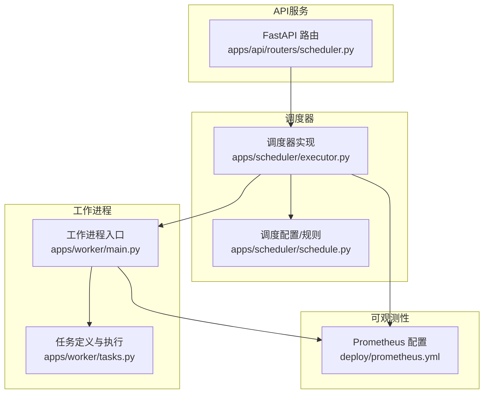
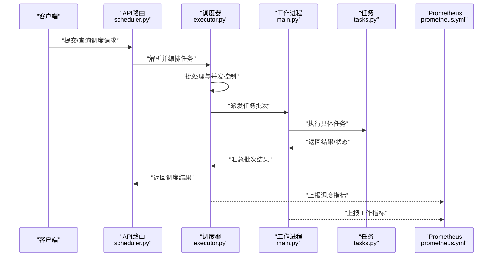
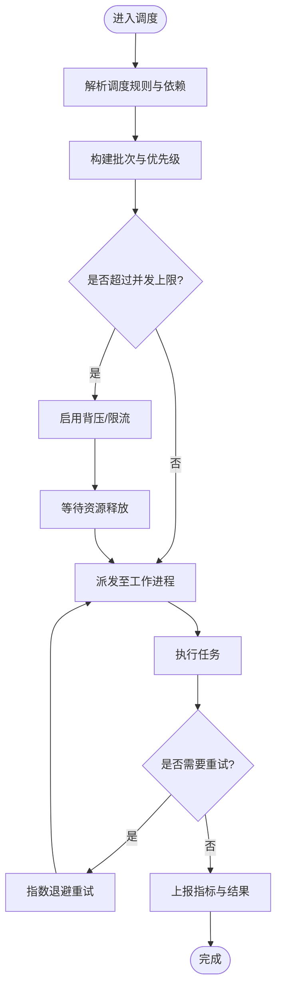
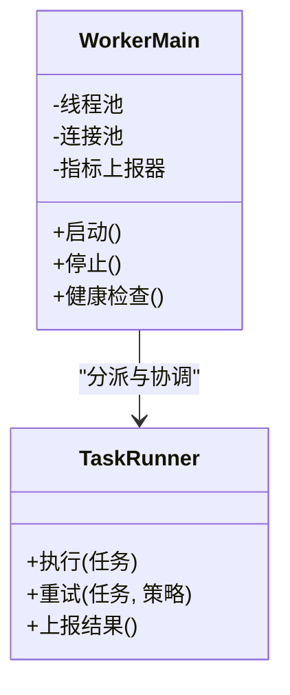
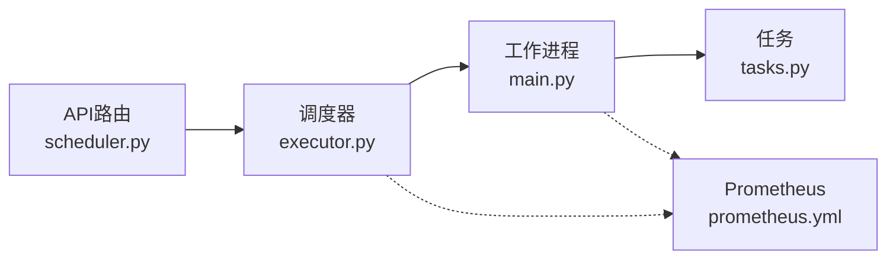

# 性能优化指南

<cite>
**本文引用的文件**   
- [apps/scheduler/executor.py](file://apps/scheduler/executor.py)
- [apps/scheduler/schedule.py](file://apps/scheduler/schedule.py)
- [apps/worker/main.py](file://apps/worker/main.py)
- [apps/worker/tasks.py](file://apps/worker/tasks.py)
- [apps/api/routers/scheduler.py](file://apps/api/routers/scheduler.py)
- [deploy/prometheus.yml](file://deploy/prometheus.yml)
- [configs/base.yaml](file://configs/base.yaml)
- [tests/unit/test_scheduler.py](file://tests/unit/test_scheduler.py)
- [tests/unit/test_worker_tasks.py](file://tests/unit/test_worker_tasks.py)
</cite>

## 目录
1. [简介](#简介)
2. [项目结构](#项目结构)
3. [核心组件](#核心组件)
4. [架构总览](#架构总览)
5. [详细组件分析](#详细组件分析)
6. [依赖关系分析](#依赖关系分析)
7. [性能考量](#性能考量)
8. [故障排查指南](#故障排查指南)
9. [结论](#结论)
10. [附录](#附录)

## 简介
本指南聚焦于调度器与工作进程的性能优化，围绕任务执行效率、内存使用与CPU利用率提升展开。文档涵盖批处理优化、并行度配置、资源隔离机制、监控指标、瓶颈分析与调优方法，并提供测试与压测实践建议。同时给出缓存策略、连接池配置与I/O优化的要点，以及高并发场景下的资源竞争解决方案、容量规划、弹性伸缩与成本优化最佳实践。

## 项目结构
本项目采用多应用分层组织：API服务、调度器、工作进程、可观测性配置与单元测试等。调度与工作流相关的关键路径位于 apps/scheduler 与 apps/worker 两个子应用中，API层提供调度控制面，prometheus.yml 用于采集关键指标。

图表来源
- [apps/api/routers/scheduler.py](file://apps/api/routers/scheduler.py)
- [apps/scheduler/executor.py](file://apps/scheduler/executor.py)
- [apps/scheduler/schedule.py](file://apps/scheduler/schedule.py)
- [apps/worker/main.py](file://apps/worker/main.py)
- [apps/worker/tasks.py](file://apps/worker/tasks.py)
- [deploy/prometheus.yml](file://deploy/prometheus.yml)

章节来源
- [apps/scheduler/executor.py](file://apps/scheduler/executor.py)
- [apps/scheduler/schedule.py](file://apps/scheduler/schedule.py)
- [apps/worker/main.py](file://apps/worker/main.py)
- [apps/worker/tasks.py](file://apps/worker/tasks.py)
- [apps/api/routers/scheduler.py](file://apps/api/routers/scheduler.py)
- [deploy/prometheus.yml](file://deploy/prometheus.yml)

## 核心组件
- 调度器（Executor）：负责任务生命周期管理、调度策略、批处理与并发控制、资源分配与隔离、错误重试与回退。
- 调度配置（Schedule）：定义任务触发条件、时间窗口、依赖关系与优先级。
- 工作进程（Worker Main）：进程级启动、线程/协程池管理、任务分发、健康检查与优雅关停。
- 任务（Tasks）：具体业务逻辑单元，包含数据读取、计算、写入与结果上报。
- API 路由（Scheduler Router）：对外暴露的调度控制接口，如创建/暂停/恢复/批量提交任务。
- 可观测性（Prometheus）：采集调度与工作进程的运行时指标，支撑容量与弹性决策。

章节来源
- [apps/scheduler/executor.py](file://apps/scheduler/executor.py)
- [apps/scheduler/schedule.py](file://apps/scheduler/schedule.py)
- [apps/worker/main.py](file://apps/worker/main.py)
- [apps/worker/tasks.py](file://apps/worker/tasks.py)
- [apps/api/routers/scheduler.py](file://apps/api/routers/scheduler.py)
- [deploy/prometheus.yml](file://deploy/prometheus.yml)

## 架构总览
下图展示从API到调度器再到工作进程的任务执行序列，以及指标采集点。

图表来源
- [apps/api/routers/scheduler.py](file://apps/api/routers/scheduler.py)
- [apps/scheduler/executor.py](file://apps/scheduler/executor.py)
- [apps/worker/main.py](file://apps/worker/main.py)
- [apps/worker/tasks.py](file://apps/worker/tasks.py)
- [deploy/prometheus.yml](file://deploy/prometheus.yml)

## 详细组件分析

### 调度器（Executor）
职责与优化要点
- 任务编排：根据调度规则生成任务图，识别依赖与并行边界。
- 批处理：将小任务聚合为批次，减少调度开销与上下文切换。
- 并发控制：限制最大并发度，避免过载；支持按资源类型隔离。
- 失败重试与回退：对瞬时错误进行指数退避重试，对不可恢复错误快速失败。
- 指标上报：记录任务耗时、队列长度、吞吐、错误率等。

优化建议
- 动态批大小：基于延迟目标与系统负载自适应调整批次大小。
- 背压机制：当下游或存储层拥塞时降低入队速率。
- 资源隔离：按任务类别划分独立线程/进程池，避免相互影响。
- 预取与流水线：在等待I/O时预取下一批数据，提高CPU利用率。

图表来源
- [apps/scheduler/executor.py](file://apps/scheduler/executor.py)
- [apps/scheduler/schedule.py](file://apps/scheduler/schedule.py)

章节来源
- [apps/scheduler/executor.py](file://apps/scheduler/executor.py)
- [apps/scheduler/schedule.py](file://apps/scheduler/schedule.py)

### 工作进程（Worker Main）
职责与优化要点
- 进程启动：初始化线程/协程池、连接池、日志与指标收集。
- 任务分发：从调度器接收批次，按资源约束分派给执行器。
- 健康检查：周期性自检与心跳上报，支持优雅关停。
- 资源管理：限制内存与CPU配额，防止单进程占用过多资源。

优化建议
- 池大小调优：依据CPU核数与I/O密集程度设置合适的池大小。
- 优雅关停：确保正在执行的任务完成后再退出，避免中断导致的数据不一致。
- 本地缓存：对热点数据进行短生命周期缓存，降低外部依赖压力。

图表来源
- [apps/worker/main.py](file://apps/worker/main.py)
- [apps/worker/tasks.py](file://apps/worker/tasks.py)

章节来源
- [apps/worker/main.py](file://apps/worker/main.py)
- [apps/worker/tasks.py](file://apps/worker/tasks.py)

### 任务（Tasks）
职责与优化要点
- 数据访问：通过连接池高效读写数据库或对象存储。
- 计算逻辑：尽量向量化与批处理，减少Python循环开销。
- 结果持久化：批量写入与事务合并，降低I/O次数。
- 指标埋点：记录输入输出规模、耗时与错误信息。

优化建议
- I/O优化：使用异步I/O与连接复用，避免阻塞调用。
- 内存优化：流式处理大对象，及时释放引用，避免峰值内存过高。
- 缓存策略：对只读且稳定的数据进行多级缓存（进程内+分布式）。

章节来源
- [apps/worker/tasks.py](file://apps/worker/tasks.py)

### API 路由（Scheduler Router）
职责与优化要点
- 提供REST接口：创建、暂停、恢复、批量提交与查询调度状态。
- 参数校验与幂等：防止重复提交与非法参数导致的异常。
- 限流与鉴权：保护后端资源，避免恶意请求。

优化建议
- 响应体压缩：对大响应启用压缩，降低网络带宽占用。
- 分页与增量查询：避免一次性拉取大量数据。

章节来源
- [apps/api/routers/scheduler.py](file://apps/api/routers/scheduler.py)

### 可观测性（Prometheus）
职责与优化要点
- 指标采集：调度与工作的关键指标（吞吐、延迟、错误率、资源使用）。
- 告警规则：基于阈值与趋势变化触发告警。
- 可视化面板：便于容量规划与问题定位。

优化建议
- 采样频率：在高QPS场景下适当降采样，平衡精度与成本。
- 标签设计：合理选择维度，避免标签爆炸。

章节来源
- [deploy/prometheus.yml](file://deploy/prometheus.yml)

## 依赖关系分析
调度器与工作进程之间的耦合主要体现在任务派发与结果回传。API路由作为控制面，不直接参与执行路径。Prometheus作为外部依赖，用于采集指标。

图表来源
- [apps/api/routers/scheduler.py](file://apps/api/routers/scheduler.py)
- [apps/scheduler/executor.py](file://apps/scheduler/executor.py)
- [apps/worker/main.py](file://apps/worker/main.py)
- [apps/worker/tasks.py](file://apps/worker/tasks.py)
- [deploy/prometheus.yml](file://deploy/prometheus.yml)

章节来源
- [apps/api/routers/scheduler.py](file://apps/api/routers/scheduler.py)
- [apps/scheduler/executor.py](file://apps/scheduler/executor.py)
- [apps/worker/main.py](file://apps/worker/main.py)
- [apps/worker/tasks.py](file://apps/worker/tasks.py)
- [deploy/prometheus.yml](file://deploy/prometheus.yml)

## 性能考量
- 任务执行效率
  - 批处理：将多个小任务合并，减少调度与序列化开销。
  - 并行度：根据CPU核数与I/O特性设置合适并发度，避免过度并行导致抖动。
  - 流水线：将读取、计算、写入阶段解耦，形成流水线提升吞吐。
- 内存使用调优
  - 流式处理：避免一次性加载大数据集。
  - 对象重用：复用临时对象，减少GC压力。
  - 缓存淘汰：LRU/TTL结合，控制缓存大小。
- CPU利用率提升
  - 向量化计算：优先使用数值库的向量化操作。
  - 避免GIL瓶颈：对CPU密集型任务使用多进程或C扩展。
- 批处理优化
  - 动态批大小：根据延迟目标与系统负载自适应调整。
  - 批内排序与去重：减少重复计算与写入。
- 并行度配置
  - 线程池：适合I/O密集型。
  - 进程池：适合CPU密集型。
  - 混合模式：按任务类型选择不同执行器。
- 资源隔离机制
  - 按租户/任务类别划分独立池，避免相互干扰。
  - 使用cgroups或容器限制CPU与内存。
- 性能监控指标
  - 调度：任务排队时长、批大小分布、重试率。
  - 工作：CPU/内存使用、I/O吞吐、错误率。
  - 端到端：P95/P99延迟、吞吐、成功率。
- 瓶颈分析与调优方法
  - 火焰图与热点分析：定位CPU热点。
  - 内存剖析：识别泄漏与峰值。
  - 链路追踪：定位慢步骤。
- 缓存策略
  - 多级缓存：进程内+分布式缓存。
  - 一致性：写穿透/写回策略与失效机制。
- 连接池配置
  - 池大小：根据并发与后端能力设定。
  - 超时与重试：避免长尾与雪崩。
- I/O优化技术
  - 异步I/O与连接复用。
  - 批量写入与事务合并。
- 高并发资源竞争
  - 锁粒度细化：减少锁竞争。
  - 无锁数据结构：在安全范围内提升并发。
  - 背压与限流：保护后端。
- 容量规划
  - 基于历史峰值与增长趋势预估资源。
  - 压测验证：模拟真实流量与突发。
- 弹性伸缩
  - 水平扩展：按队列长度与延迟自动扩缩容。
  - 垂直扩展：按需提升单机资源。
- 成本优化
  - 资源利用率最大化：避免闲置与过度预留。
  - 冷热分离：热数据高性能存储，冷数据低成本存储。

[本节为通用指导，无需特定文件来源]

## 故障排查指南
- 常见问题
  - 任务堆积：检查队列长度与消费者数量，确认是否存在背压。
  - 高延迟：分析P95/P99延迟，定位慢步骤与热点。
  - 内存溢出：检查大对象与缓存策略，确认是否有泄漏。
  - CPU抖动：观察并行度与锁竞争，必要时调整池大小。
- 诊断工具
  - Prometheus面板：查看指标趋势与告警。
  - 日志与追踪：关联任务ID，定位问题链路。
  - 压测脚本：复现问题并验证修复效果。
- 参考测试用例
  - 调度器行为与边界条件验证。
  - 工作进程任务执行与错误处理验证。

章节来源
- [tests/unit/test_scheduler.py](file://tests/unit/test_scheduler.py)
- [tests/unit/test_worker_tasks.py](file://tests/unit/test_worker_tasks.py)

## 结论
通过合理的批处理与并行度配置、资源隔离与背压机制，结合完善的监控与压测体系，可以显著提升调度器与工作进程的执行效率与稳定性。持续的性能剖析与容量规划有助于在高并发场景下保持低延迟与高吞吐，同时兼顾成本与弹性。

[本节为总结，无需特定文件来源]

## 附录
- 配置示例与最佳实践
  - 基础配置项：并行度、批大小、超时与重试策略。
  - 环境差异：开发/生产环境的差异化配置。
- 测试与基准
  - 单元测试：覆盖关键路径与边界条件。
  - 基准测试：评估不同批大小与并行度的性能。
  - 压力测试：模拟峰值流量，验证系统韧性。

章节来源
- [configs/base.yaml](file://configs/base.yaml)
- [tests/unit/test_scheduler.py](file://tests/unit/test_scheduler.py)
- [tests/unit/test_worker_tasks.py](file://tests/unit/test_worker_tasks.py)