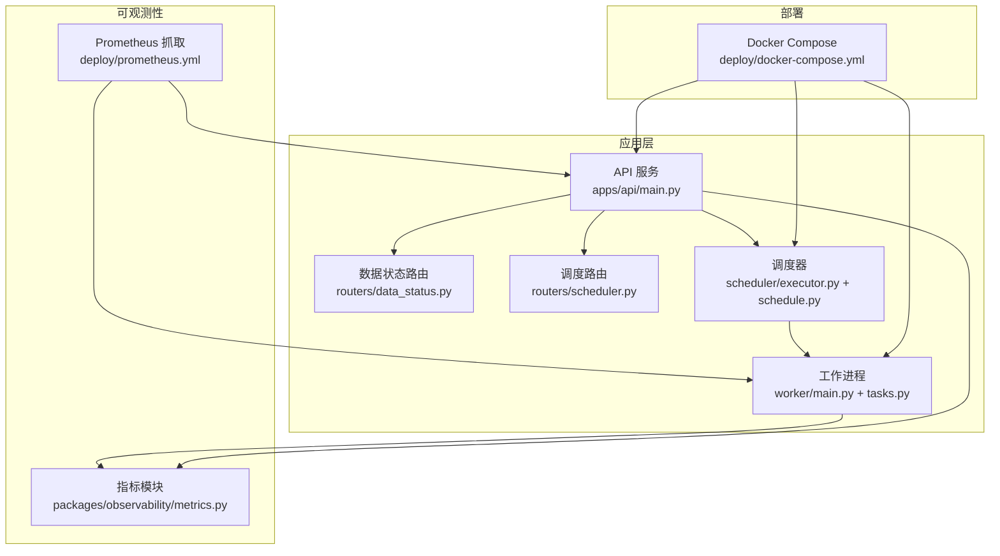
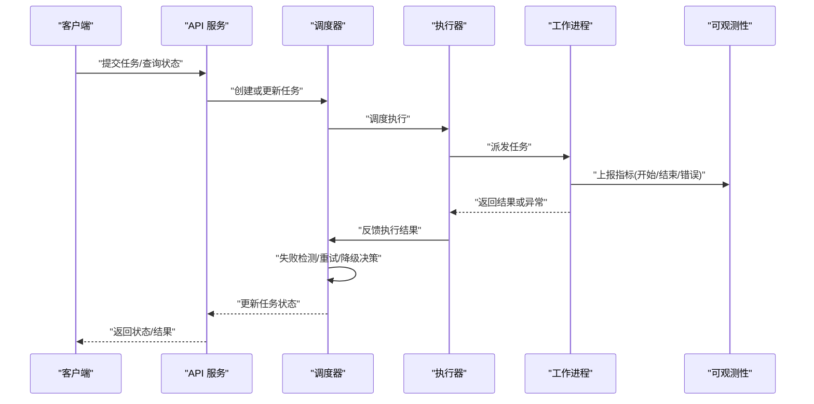
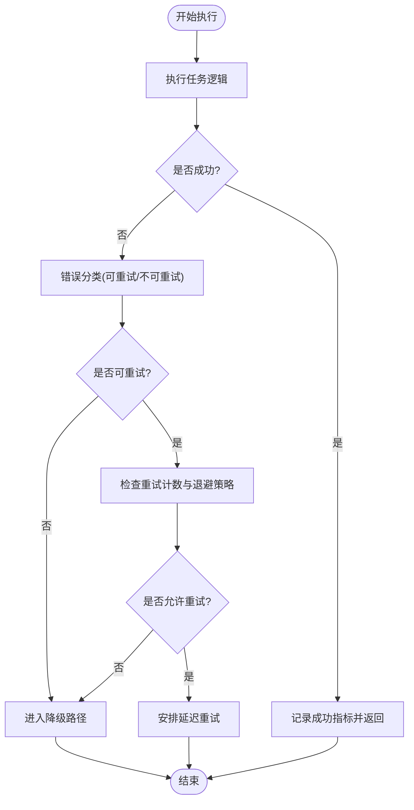
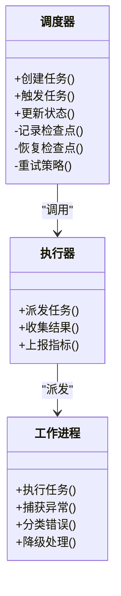
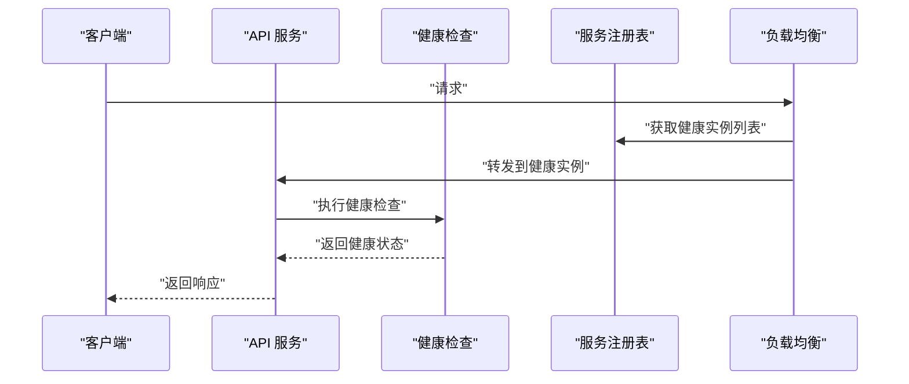
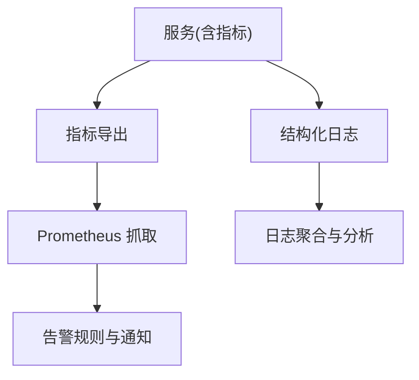
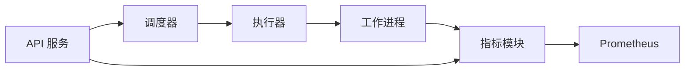

# 故障恢复机制

<cite>
**本文引用的文件**   
- [apps/worker/main.py](file://apps/worker/main.py)
- [apps/worker/tasks.py](file://apps/worker/tasks.py)
- [apps/scheduler/executor.py](file://apps/scheduler/executor.py)
- [apps/scheduler/schedule.py](file://apps/scheduler/schedule.py)
- [apps/api/main.py](file://apps/api/main.py)
- [apps/api/deps.py](file://apps/api/deps.py)
- [apps/api/routers/data_status.py](file://apps/api/routers/data_status.py)
- [apps/api/routers/scheduler.py](file://apps/api/routers/scheduler.py)
- [packages/observability/metrics.py](file://packages/observability/metrics.py)
- [deploy/docker-compose.yml](file://deploy/docker-compose.yml)
- [deploy/prometheus.yml](file://deploy/prometheus.yml)
- [tests/unit/test_scheduler.py](file://tests/unit/test_scheduler.py)
- [tests/unit/test_worker_tasks.py](file://tests/unit/test_worker_tasks.py)
</cite>

## 目录
1. [简介](#简介)
2. [项目结构](#项目结构)
3. [核心组件](#核心组件)
4. [架构总览](#架构总览)
5. [详细组件分析](#详细组件分析)
6. [依赖关系分析](#依赖关系分析)
7. [性能考量](#性能考量)
8. [故障诊断指南](#故障诊断指南)
9. [结论](#结论)
10. [附录](#附录)

## 简介
本技术文档聚焦于系统的“故障恢复机制”，围绕任务失败检测、自动重试与降级处理、检查点与状态恢复、数据一致性保证、服务发现与健康检查、故障转移策略，以及分布式事务、幂等性与最终一致性模型展开。同时提供网络分区、节点失效和数据损坏等典型故障场景的应对方案，并给出监控告警与日志分析的集成建议。

## 项目结构
系统采用多进程/多容器部署：API 服务负责对外暴露接口与健康检查；调度器负责任务编排与执行；工作进程负责具体任务执行；可观测性模块提供指标采集；部署配置包含容器编排与 Prometheus 抓取配置。

图表来源
- [apps/api/main.py](file://apps/api/main.py)
- [apps/api/routers/data_status.py](file://apps/api/routers/data_status.py)
- [apps/api/routers/scheduler.py](file://apps/api/routers/scheduler.py)
- [apps/scheduler/executor.py](file://apps/scheduler/executor.py)
- [apps/scheduler/schedule.py](file://apps/scheduler/schedule.py)
- [apps/worker/main.py](file://apps/worker/main.py)
- [apps/worker/tasks.py](file://apps/worker/tasks.py)
- [packages/observability/metrics.py](file://packages/observability/metrics.py)
- [deploy/prometheus.yml](file://deploy/prometheus.yml)
- [deploy/docker-compose.yml](file://deploy/docker-compose.yml)

章节来源
- [apps/api/main.py](file://apps/api/main.py)
- [apps/api/routers/data_status.py](file://apps/api/routers/data_status.py)
- [apps/api/routers/scheduler.py](file://apps/api/routers/scheduler.py)
- [apps/scheduler/executor.py](file://apps/scheduler/executor.py)
- [apps/scheduler/schedule.py](file://apps/scheduler/schedule.py)
- [apps/worker/main.py](file://apps/worker/main.py)
- [apps/worker/tasks.py](file://apps/worker/tasks.py)
- [packages/observability/metrics.py](file://packages/observability/metrics.py)
- [deploy/docker-compose.yml](file://deploy/docker-compose.yml)
- [deploy/prometheus.yml](file://deploy/prometheus.yml)

## 核心组件
- 任务执行与工作进程：负责拉取任务、执行、记录结果与异常、上报指标。
- 调度器：负责任务编排、触发、重试策略与降级路径选择。
- API 服务：暴露健康检查、数据状态查询、调度控制接口。
- 可观测性：统一指标采集与外部监控系统对接。
- 部署与运行：通过容器编排实现服务发现、重启与滚动升级。

章节来源
- [apps/worker/tasks.py](file://apps/worker/tasks.py)
- [apps/worker/main.py](file://apps/worker/main.py)
- [apps/scheduler/executor.py](file://apps/scheduler/executor.py)
- [apps/scheduler/schedule.py](file://apps/scheduler/schedule.py)
- [apps/api/routers/data_status.py](file://apps/api/routers/data_status.py)
- [apps/api/routers/scheduler.py](file://apps/api/routers/scheduler.py)
- [packages/observability/metrics.py](file://packages/observability/metrics.py)

## 架构总览
下图展示从 API 请求到任务执行、失败检测、重试与降级的整体流程，以及与监控系统的交互。

图表来源
- [apps/api/main.py](file://apps/api/main.py)
- [apps/api/routers/scheduler.py](file://apps/api/routers/scheduler.py)
- [apps/scheduler/executor.py](file://apps/scheduler/executor.py)
- [apps/worker/main.py](file://apps/worker/main.py)
- [apps/worker/tasks.py](file://apps/worker/tasks.py)
- [packages/observability/metrics.py](file://packages/observability/metrics.py)

## 详细组件分析

### 任务执行与工作进程（失败检测、重试、降级）
- 失败检测：工作进程在执行任务时捕获异常，区分可重试与不可重试错误，记录错误分类与上下文信息，并上报指标。
- 自动重试：调度器根据任务类型与错误分类决定重试次数、退避策略与最大等待时间；支持指数退避与抖动以避免雪崩。
- 降级处理：当重试达到上限或关键依赖不可用时，切换至降级路径（如使用缓存数据、默认值或只读副本），确保服务可用。

图表来源
- [apps/worker/tasks.py](file://apps/worker/tasks.py)
- [apps/scheduler/executor.py](file://apps/scheduler/executor.py)
- [packages/observability/metrics.py](file://packages/observability/metrics.py)

章节来源
- [apps/worker/tasks.py](file://apps/worker/tasks.py)
- [apps/scheduler/executor.py](file://apps/scheduler/executor.py)
- [packages/observability/metrics.py](file://packages/observability/metrics.py)

### 调度器（编排、检查点、状态恢复）
- 任务编排：基于时间或事件触发任务，维护任务生命周期状态（待执行、执行中、成功、失败、已降级）。
- 检查点机制：在任务的关键阶段写入检查点（例如批次边界、中间结果摘要），以便失败后从最近检查点恢复。
- 状态恢复：调度器在启动或节点恢复时扫描未完成的检查点，重建任务上下文并继续执行，避免重复计算。
- 幂等性设计：任务输入带有唯一标识（如任务 ID、批次号），确保重试不会导致重复副作用；输出侧通过去重键或幂等写保障。

图表来源
- [apps/scheduler/executor.py](file://apps/scheduler/executor.py)
- [apps/scheduler/schedule.py](file://apps/scheduler/schedule.py)
- [apps/worker/main.py](file://apps/worker/main.py)
- [apps/worker/tasks.py](file://apps/worker/tasks.py)

章节来源
- [apps/scheduler/executor.py](file://apps/scheduler/executor.py)
- [apps/scheduler/schedule.py](file://apps/scheduler/schedule.py)
- [apps/worker/main.py](file://apps/worker/main.py)
- [apps/worker/tasks.py](file://apps/worker/tasks.py)

### API 服务（健康检查、服务发现、故障转移）
- 健康检查：提供 /health 与 /data-status 等端点，返回服务就绪、依赖可用性、队列积压等指标。
- 服务发现：通过容器编排与服务注册表（由编排平台管理）实现动态发现与负载均衡。
- 故障转移：当某实例不健康时，流量被路由到其他健康实例；调度器将任务重新分配给可用工作进程。

图表来源
- [apps/api/main.py](file://apps/api/main.py)
- [apps/api/routers/data_status.py](file://apps/api/routers/data_status.py)
- [deploy/docker-compose.yml](file://deploy/docker-compose.yml)

章节来源
- [apps/api/main.py](file://apps/api/main.py)
- [apps/api/routers/data_status.py](file://apps/api/routers/data_status.py)
- [deploy/docker-compose.yml](file://deploy/docker-compose.yml)

### 可观测性与监控告警
- 指标采集：统一上报任务成功率、失败率、重试次数、执行时长、队列长度等。
- 外部监控：Prometheus 抓取各服务暴露的指标端点，结合告警规则进行阈值告警。
- 日志分析：结构化日志包含任务 ID、错误分类、堆栈摘要与上下文，便于快速定位问题。

图表来源
- [packages/observability/metrics.py](file://packages/observability/metrics.py)
- [deploy/prometheus.yml](file://deploy/prometheus.yml)

章节来源
- [packages/observability/metrics.py](file://packages/observability/metrics.py)
- [deploy/prometheus.yml](file://deploy/prometheus.yml)

## 依赖关系分析
- 组件耦合：调度器与工作进程通过任务队列或 RPC 通信；API 服务与调度器解耦，通过状态查询与命令式接口协作。
- 外部依赖：数据库、消息队列、对象存储等作为持久化与缓冲层；Prometheus 作为外部监控依赖。
- 潜在循环依赖：应避免调度器与工作进程之间的直接双向依赖，通过事件或状态机解耦。

图表来源
- [apps/api/main.py](file://apps/api/main.py)
- [apps/scheduler/executor.py](file://apps/scheduler/executor.py)
- [apps/worker/main.py](file://apps/worker/main.py)
- [packages/observability/metrics.py](file://packages/observability/metrics.py)
- [deploy/prometheus.yml](file://deploy/prometheus.yml)

章节来源
- [apps/api/main.py](file://apps/api/main.py)
- [apps/scheduler/executor.py](file://apps/scheduler/executor.py)
- [apps/worker/main.py](file://apps/worker/main.py)
- [packages/observability/metrics.py](file://packages/observability/metrics.py)
- [deploy/prometheus.yml](file://deploy/prometheus.yml)

## 性能考量
- 重试退避：采用指数退避与随机抖动，降低重试风暴风险。
- 批量处理：任务按批次执行，减少频繁 I/O 与锁竞争。
- 检查点粒度：平衡恢复成本与丢失范围，避免过细导致开销过大。
- 资源隔离：为不同优先级任务设置独立队列与资源池，防止相互影响。
- 背压与限流：在高负载下限制新任务入队速率，保护下游依赖。

[本节为通用指导，不涉及具体文件分析]

## 故障诊断指南
- 常见故障场景
  - 网络分区：任务超时与重试增多，关注连接错误与超时指标；必要时启用只读模式与降级路径。
  - 节点失效：工作进程下线导致任务未完成，调度器应检测到并重新派发；检查点用于恢复进度。
  - 数据损坏：校验和失败或反序列化异常，触发回滚与清理脏数据，切换到备份源。
- 诊断步骤
  - 查看任务状态与错误分类，定位失败原因。
  - 分析指标趋势（失败率、重试次数、执行时长）判断系统性问题。
  - 检索结构化日志，提取任务 ID 与上下文，复现问题。
  - 验证检查点完整性与一致性，确认恢复起点。
- 工具与集成
  - 使用 Prometheus 告警规则对关键指标设置阈值。
  - 结合日志聚合平台进行关联分析与根因定位。
  - 编写单元测试覆盖异常分支与恢复流程，提升回归质量。

章节来源
- [tests/unit/test_scheduler.py](file://tests/unit/test_scheduler.py)
- [tests/unit/test_worker_tasks.py](file://tests/unit/test_worker_tasks.py)

## 结论
本系统通过明确的任务失败检测、可配置的重试与降级策略、完善的检查点与状态恢复机制，以及健全的可观测性体系，实现了高可用的故障恢复能力。配合服务发现与健康检查，系统在节点失效与网络分区等场景下仍能保持服务可用与数据一致。未来可进一步引入分布式事务与补偿机制，强化端到端的幂等性与最终一致性保障。

[本节为总结性内容，不涉及具体文件分析]

## 附录
- 分布式事务与最终一致性
  - 采用本地事务+消息出队幂等写入，结合补偿任务与对账机制达成最终一致。
  - 幂等键设计：以任务 ID 与批次号作为幂等键，避免重复副作用。
- 故障转移策略
  - 健康检查失败即剔除实例；调度器将任务迁移至健康节点；工作进程具备无状态与有状态两种模式，后者需配合检查点恢复。
- 代码示例路径（不含具体代码）
  - 异常处理与错误分类：参考 [apps/worker/tasks.py](file://apps/worker/tasks.py)
  - 重试与降级决策：参考 [apps/scheduler/executor.py](file://apps/scheduler/executor.py)
  - 健康检查与数据状态：参考 [apps/api/routers/data_status.py](file://apps/api/routers/data_status.py)
  - 指标上报与监控：参考 [packages/observability/metrics.py](file://packages/observability/metrics.py)