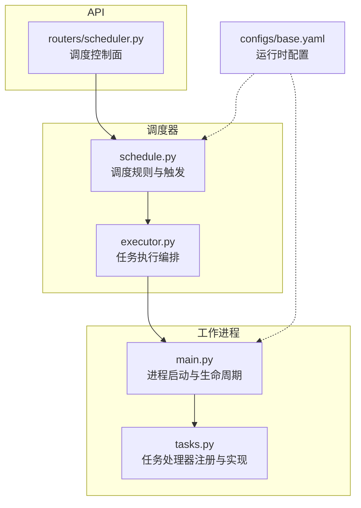
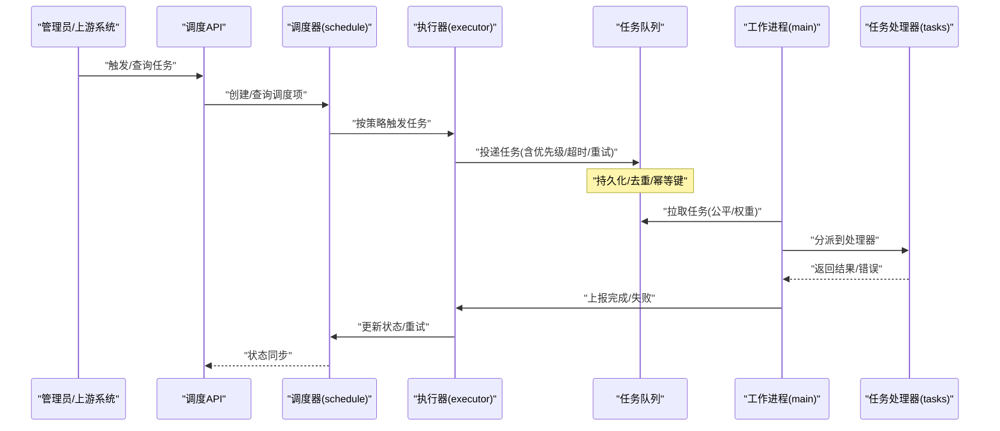
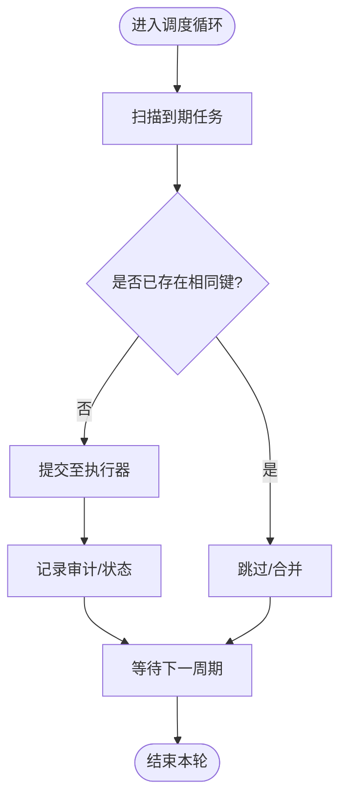
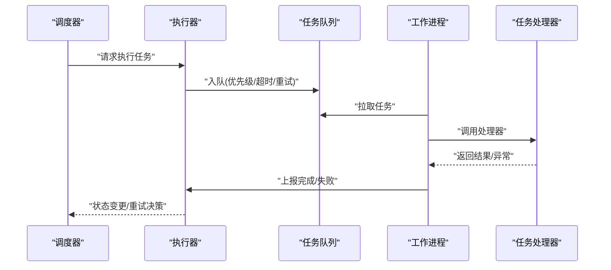
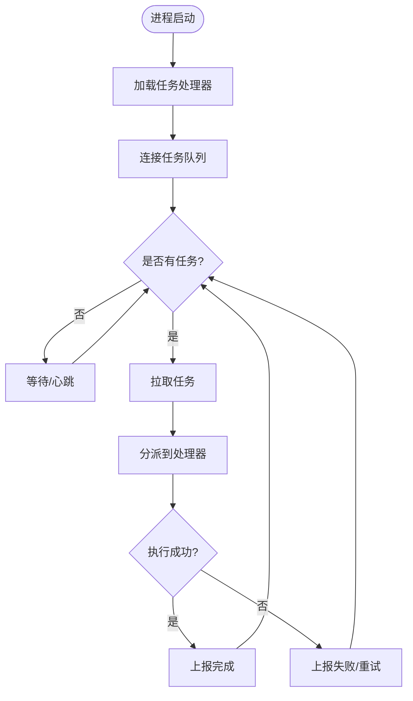
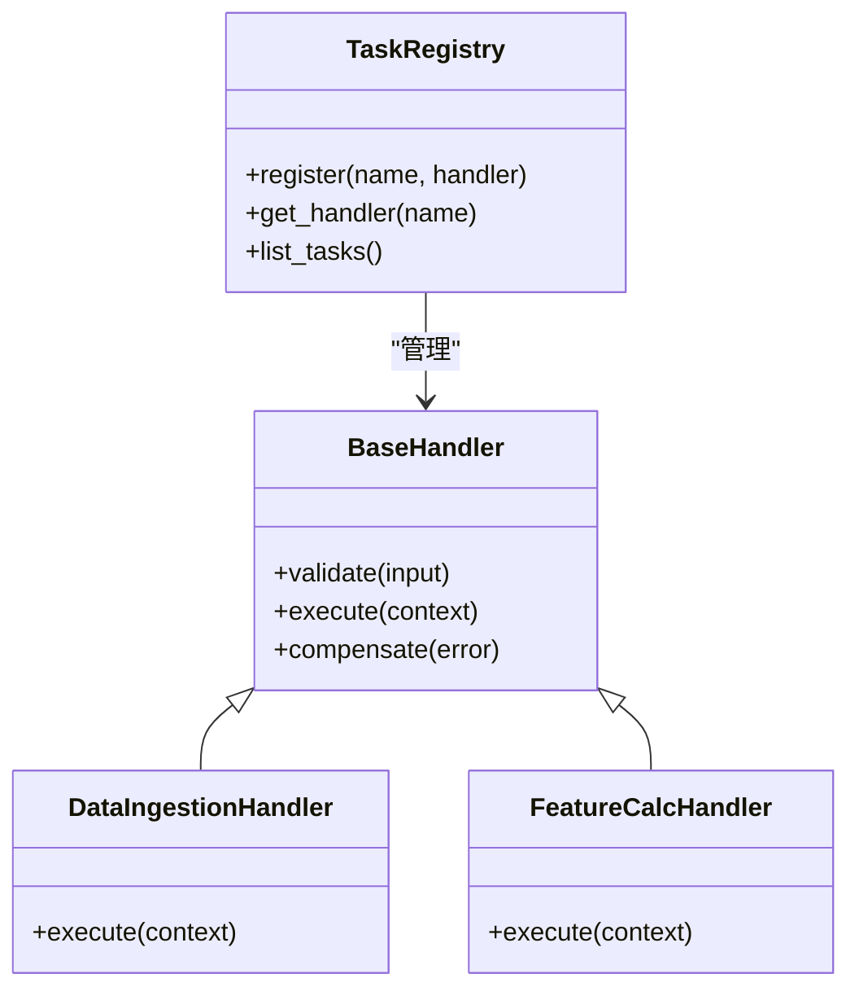
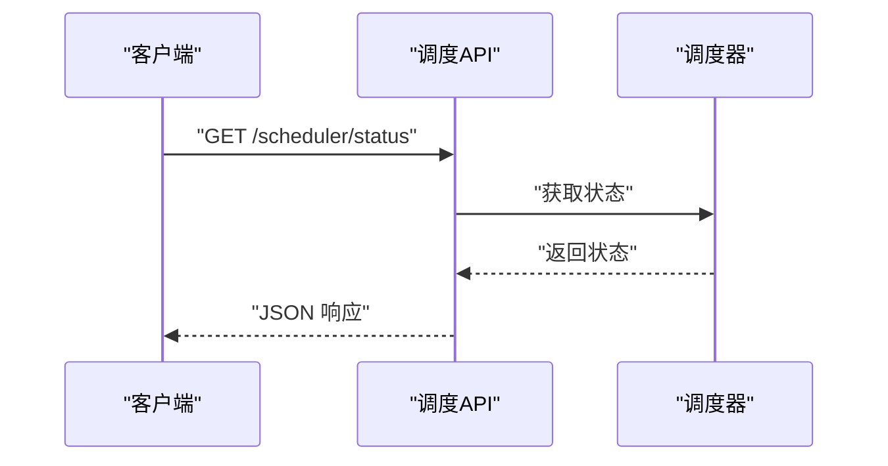
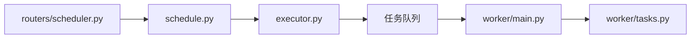

# 调度器与工作进程

<cite>
**本文引用的文件**   
- [apps/scheduler/executor.py](file://apps/scheduler/executor.py)
- [apps/scheduler/schedule.py](file://apps/scheduler/schedule.py)
- [apps/worker/main.py](file://apps/worker/main.py)
- [apps/worker/tasks.py](file://apps/worker/tasks.py)
- [apps/api/routers/scheduler.py](file://apps/api/routers/scheduler.py)
- [configs/base.yaml](file://configs/base.yaml)
- [tests/unit/test_scheduler.py](file://tests/unit/test_scheduler.py)
- [tests/unit/test_worker_tasks.py](file://tests/unit/test_worker_tasks.py)
</cite>

## 目录
1. [简介](#简介)
2. [项目结构](#项目结构)
3. [核心组件](#核心组件)
4. [架构总览](#架构总览)
5. [详细组件分析](#详细组件分析)
6. [依赖关系分析](#依赖关系分析)
7. [性能考虑](#性能考虑)
8. [故障排查指南](#故障排查指南)
9. [结论](#结论)
10. [附录](#附录)

## 简介
本技术文档围绕“调度器与工作进程”子系统，系统性阐述任务调度策略、异步处理机制与故障恢复实现细节。重点覆盖：
- 定时任务管理、任务队列与工作进程池的工作原理
- 任务优先级、负载均衡与容错机制
- 与数据处理管道和交易执行系统的集成关系
- 常见问题定位与性能调优建议

## 项目结构
调度与工作进程相关代码主要分布在以下模块：
- 调度器应用：负责定义调度规则、触发任务、维护任务状态
- 工作进程应用：负责消费任务、执行业务逻辑、上报结果与错误
- API 路由：提供对调度器的外部控制面（如查看状态、触发任务）
- 配置：集中管理调度与工作进程的运行时参数
- 测试：覆盖调度与工作进程的关键路径

图表来源
- [apps/scheduler/schedule.py](file://apps/scheduler/schedule.py)
- [apps/scheduler/executor.py](file://apps/scheduler/executor.py)
- [apps/worker/main.py](file://apps/worker/main.py)
- [apps/worker/tasks.py](file://apps/worker/tasks.py)
- [apps/api/routers/scheduler.py](file://apps/api/routers/scheduler.py)
- [configs/base.yaml](file://configs/base.yaml)

章节来源
- [apps/scheduler/schedule.py](file://apps/scheduler/schedule.py)
- [apps/scheduler/executor.py](file://apps/scheduler/executor.py)
- [apps/worker/main.py](file://apps/worker/main.py)
- [apps/worker/tasks.py](file://apps/worker/tasks.py)
- [apps/api/routers/scheduler.py](file://apps/api/routers/scheduler.py)
- [configs/base.yaml](file://configs/base.yaml)

## 核心组件
- 调度器（schedule.py）
  - 职责：定义并维护定时任务计划；根据时间或事件驱动触发任务；协调任务入队与重试策略。
  - 关键能力：周期/一次性任务、延迟任务、失败重试与退避、任务去重与幂等性约束。
- 执行器（executor.py）
  - 职责：将调度器触发的任务提交到工作进程；管理任务生命周期（创建、派发、完成、失败）。
  - 关键能力：任务分发、并发度控制、超时与取消、结果回传。
- 工作进程主程序（main.py）
  - 职责：启动工作进程池；监听任务队列；加载任务处理器；健康检查与优雅关闭。
  - 关键能力：进程池大小、最大内存/耗时限制、信号处理、指标上报。
- 任务处理器（tasks.py）
  - 职责：注册具体业务任务（数据拉取、特征计算、模型推理、报告生成等）；实现幂等与补偿逻辑。
  - 关键能力：输入校验、资源隔离、中间状态持久化、错误分类与可恢复性。
- API 控制面（routers/scheduler.py）
  - 职责：暴露查询调度状态、手动触发任务、查看任务历史等接口。
  - 关键能力：鉴权、限流、审计日志。
- 配置（base.yaml）
  - 职责：集中管理调度间隔、队列容量、重试次数、超时、并发度等。
  - 关键能力：环境切换、热更新支持、默认值与校验。

章节来源
- [apps/scheduler/schedule.py](file://apps/scheduler/schedule.py)
- [apps/scheduler/executor.py](file://apps/scheduler/executor.py)
- [apps/worker/main.py](file://apps/worker/main.py)
- [apps/worker/tasks.py](file://apps/worker/tasks.py)
- [apps/api/routers/scheduler.py](file://apps/api/routers/scheduler.py)
- [configs/base.yaml](file://configs/base.yaml)

## 架构总览
整体采用“调度器 + 工作进程池”的解耦架构：调度器专注“何时做什么”，工作进程专注“如何做”。两者通过任务队列交互，具备横向扩展与故障隔离能力。

图表来源
- [apps/api/routers/scheduler.py](file://apps/api/routers/scheduler.py)
- [apps/scheduler/schedule.py](file://apps/scheduler/schedule.py)
- [apps/scheduler/executor.py](file://apps/scheduler/executor.py)
- [apps/worker/main.py](file://apps/worker/main.py)
- [apps/worker/tasks.py](file://apps/worker/tasks.py)

## 详细组件分析

### 调度器（schedule.py）
- 设计要点
  - 任务类型：周期性、一次性、延迟任务；支持表达式或相对时间。
  - 触发策略：基于时钟轮询或事件驱动；支持节流与防抖。
  - 幂等与去重：以任务键为唯一标识，避免重复执行。
  - 失败重试：指数退避、最大重试次数、死信队列。
- 关键流程
  - 初始化：加载配置、注册任务模板、构建调度表。
  - 运行循环：扫描到期任务 -> 提交执行器 -> 记录审计日志。
  - 状态同步：与执行器/工作进程保持最终一致。

图表来源
- [apps/scheduler/schedule.py](file://apps/scheduler/schedule.py)

章节来源
- [apps/scheduler/schedule.py](file://apps/scheduler/schedule.py)

### 执行器（executor.py）
- 设计要点
  - 任务派发：将任务写入队列，携带优先级、超时、重试策略。
  - 并发控制：限制同时运行的任务数，防止过载。
  - 结果回传：成功/失败回调，驱动调度器状态机。
- 关键流程
  - 接收调度指令 -> 构造任务元数据 -> 入队 -> 等待回执 -> 更新状态。

图表来源
- [apps/scheduler/executor.py](file://apps/scheduler/executor.py)
- [apps/worker/main.py](file://apps/worker/main.py)
- [apps/worker/tasks.py](file://apps/worker/tasks.py)

章节来源
- [apps/scheduler/executor.py](file://apps/scheduler/executor.py)

### 工作进程（main.py）
- 设计要点
  - 进程池：固定数量或动态扩缩容；每个进程独立资源。
  - 任务拉取：支持公平队列或权重队列；背压与限流。
  - 生命周期：优雅关闭、信号处理、健康探针。
- 关键流程
  - 启动 -> 加载任务处理器 -> 连接队列 -> 循环拉取执行 -> 上报结果。

图表来源
- [apps/worker/main.py](file://apps/worker/main.py)

章节来源
- [apps/worker/main.py](file://apps/worker/main.py)

### 任务处理器（tasks.py）
- 设计要点
  - 注册机制：声明式注册任务名与处理器函数。
  - 输入校验：严格校验入参，快速失败。
  - 幂等与补偿：基于任务键去重；失败时支持补偿或人工介入。
  - 资源隔离：限制CPU/内存/IO使用，避免相互影响。
- 典型任务
  - 数据采集与清洗、特征工程、模型推理、报表生成、交易信号下发等。

图表来源
- [apps/worker/tasks.py](file://apps/worker/tasks.py)

章节来源
- [apps/worker/tasks.py](file://apps/worker/tasks.py)

### API 控制面（routers/scheduler.py）
- 设计要点
  - 接口：查询调度状态、手动触发任务、查看任务历史。
  - 安全：鉴权、审计、限流。
  - 一致性：读取调度器最新状态，必要时触发刷新。
- 典型流程
  - 接收请求 -> 校验权限 -> 调用调度器 -> 返回响应。

图表来源
- [apps/api/routers/scheduler.py](file://apps/api/routers/scheduler.py)

章节来源
- [apps/api/routers/scheduler.py](file://apps/api/routers/scheduler.py)

### 配置（base.yaml）
- 关键选项（示例字段，具体以实际配置为准）
  - 调度器：调度间隔、任务去重键、重试次数、退避策略、超时。
  - 队列：容量上限、消费者并发、公平/权重模式。
  - 工作进程：进程池大小、单任务最大内存/CPU、优雅关闭超时。
  - 监控：指标导出、日志级别、健康检查端口。
- 最佳实践
  - 区分开发/生产配置；敏感信息走环境变量；配置变更需灰度发布。

章节来源
- [configs/base.yaml](file://configs/base.yaml)

## 依赖关系分析
- 内部依赖
  - API 路由依赖调度器；调度器依赖执行器；执行器依赖任务队列；工作进程依赖任务处理器。
- 外部依赖
  - 任务队列（消息中间件）、数据库（持久化状态/审计）、监控系统（指标/日志）。
- 耦合与内聚
  - 调度与工作进程松耦合，通过队列契约通信；任务处理器高内聚于业务域。

图表来源
- [apps/api/routers/scheduler.py](file://apps/api/routers/scheduler.py)
- [apps/scheduler/schedule.py](file://apps/scheduler/schedule.py)
- [apps/scheduler/executor.py](file://apps/scheduler/executor.py)
- [apps/worker/main.py](file://apps/worker/main.py)
- [apps/worker/tasks.py](file://apps/worker/tasks.py)

章节来源
- [apps/api/routers/scheduler.py](file://apps/api/routers/scheduler.py)
- [apps/scheduler/schedule.py](file://apps/scheduler/schedule.py)
- [apps/scheduler/executor.py](file://apps/scheduler/executor.py)
- [apps/worker/main.py](file://apps/worker/main.py)
- [apps/worker/tasks.py](file://apps/worker/tasks.py)

## 性能考虑
- 任务优先级与负载均衡
  - 使用优先级队列保障高优任务优先执行；多消费者场景下采用公平分配或按任务标签路由。
- 并发与背压
  - 合理设置工作进程池大小与每进程并发度；队列满时进行背压（丢弃低优任务或阻塞生产者）。
- 超时与取消
  - 为任务设置合理超时；长尾任务及时取消，释放资源。
- 幂等与去重
  - 以任务键去重，避免重复执行导致的数据不一致。
- 资源隔离
  - 对 CPU/内存密集型任务进行隔离，避免相互干扰。
- 监控与观测
  - 采集任务吞吐、延迟、失败率、队列深度等指标，结合告警快速定位瓶颈。

[本节为通用指导，不直接分析具体文件]

## 故障排查指南
- 常见问题
  - 任务堆积：检查队列容量、消费者数量、任务耗时与超时设置。
  - 任务重复执行：确认任务键与去重策略是否正确生效。
  - 任务失败重试风暴：调整退避策略与最大重试次数。
  - 工作进程崩溃：关注健康探针与优雅关闭，确保状态可恢复。
- 定位方法
  - 查看调度器状态与审计日志；核对任务历史与错误堆栈；对比配置差异。
- 恢复策略
  - 清理死信队列；对可恢复错误自动重试；对不可恢复错误转人工处理。

章节来源
- [tests/unit/test_scheduler.py](file://tests/unit/test_scheduler.py)
- [tests/unit/test_worker_tasks.py](file://tests/unit/test_worker_tasks.py)

## 结论
调度器与工作进程系统通过清晰的职责划分与松耦合通信，实现了高可用、可扩展的任务处理能力。配合合理的优先级、负载均衡与容错策略，可有效支撑数据处理管道与交易执行系统的稳定运行。建议在上线前完善监控告警与演练故障恢复流程，持续优化性能与稳定性。

[本节为总结性内容，不直接分析具体文件]

## 附录
- 与数据处理管道的集成
  - 数据拉取、清洗、入库任务由工作进程执行；调度器按日/小时粒度触发。
- 与交易执行系统的集成
  - 信号生成与下单任务在交易时段内高优执行；失败时走补偿与人工复核流程。
- 配置示例路径
  - 参考配置文件以了解各参数的作用域与默认值。

章节来源
- [configs/base.yaml](file://configs/base.yaml)