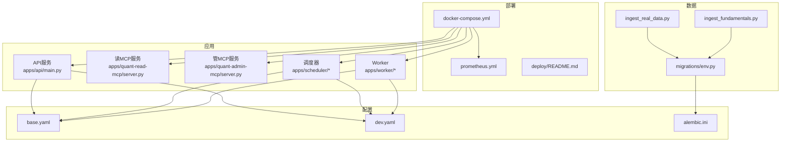
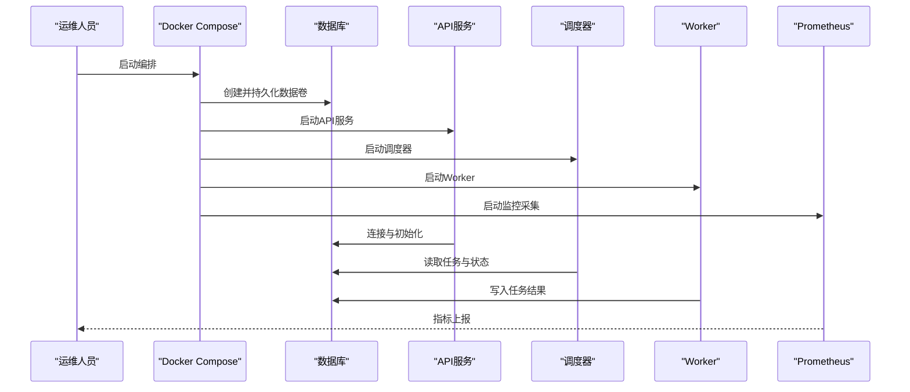
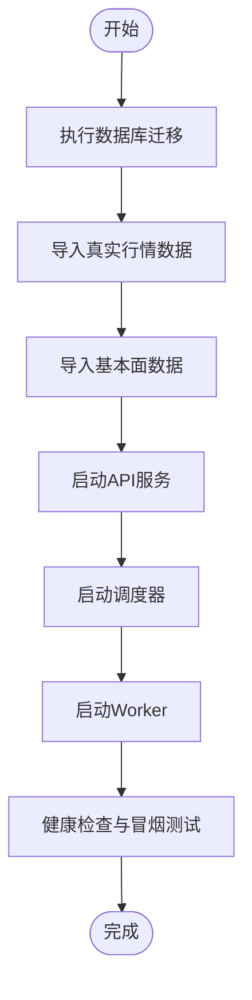
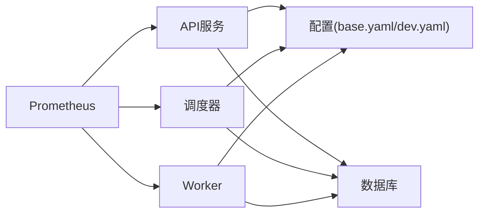

# 部署与运维

<cite>
**本文引用的文件**   
- [README.md](file://README.md)
- [pyproject.toml](file://pyproject.toml)
- [alembic.ini](file://alembic.ini)
- [deploy/README.md](file://deploy/README.md)
- [deploy/docker-compose.yml](file://deploy/docker-compose.yml)
- [deploy/prometheus.yml](file://deploy/prometheus.yml)
- [configs/base.yaml](file://configs/base.yaml)
- [configs/dev.yaml](file://configs/dev.yaml)
- [apps/api/main.py](file://apps/api/main.py)
- [apps/api/deps.py](file://apps/api/deps.py)
- [apps/api/routers/scheduler.py](file://apps/api/routers/scheduler.py)
- [apps/quant-read-mcp/server.py](file://apps/quant-read-mcp/server.py)
- [apps/quant-admin-mcp/server.py](file://apps/quant-admin-mcp/server.py)
- [apps/scheduler/executor.py](file://apps/scheduler/executor.py)
- [apps/scheduler/schedule.py](file://apps/scheduler/schedule.py)
- [apps/worker/main.py](file://apps/worker/main.py)
- [apps/worker/tasks.py](file://apps/worker/tasks.py)
- [sql/migrations/env.py](file://sql/migrations/env.py)
- [scripts/ingest_real_data.py](file://scripts/ingest_real_data.py)
- [scripts/ingest_fundamentals.py](file://scripts/ingest_fundamentals.py)
</cite>

## 目录
1. [简介](#简介)
2. [项目结构](#项目结构)
3. [核心组件](#核心组件)
4. [架构总览](#架构总览)
5. [详细组件分析](#详细组件分析)
6. [依赖关系分析](#依赖关系分析)
7. [性能考虑](#性能考虑)
8. [故障排查指南](#故障排查指南)
9. [结论](#结论)
10. [附录](#附录)

## 简介
本文件面向生产环境，提供量化交易MCP系统的容器化部署、服务编排、数据库初始化、数据导入、系统启动流程、运维脚本使用、自动化部署方案、扩展与备份策略、灾难恢复机制以及常见问题与最佳实践。文档以仓库现有配置与代码为依据，确保可落地执行。

## 项目结构
- 应用层
  - API服务：REST接口与调度入口
  - MCP服务：读写与管理面（read/admin）
  - 调度器：定时任务编排与执行
  - Worker：异步任务执行
- 配置层
  - base.yaml：基础配置
  - dev.yaml：开发环境覆盖
- 部署层
  - docker-compose.yml：服务编排
  - prometheus.yml：监控采集
  - deploy/README.md：部署说明
- 数据层
  - SQL迁移：Alembic版本管理
  - 数据导入脚本：真实行情与基本面数据
- 工程配置
  - pyproject.toml：包与依赖定义
  - alembic.ini：迁移工具配置

图表来源
- [deploy/docker-compose.yml](file://deploy/docker-compose.yml)
- [deploy/prometheus.yml](file://deploy/prometheus.yml)
- [deploy/README.md](file://deploy/README.md)
- [configs/base.yaml](file://configs/base.yaml)
- [configs/dev.yaml](file://configs/dev.yaml)
- [apps/api/main.py](file://apps/api/main.py)
- [apps/quant-read-mcp/server.py](file://apps/quant-read-mcp/server.py)
- [apps/quant-admin-mcp/server.py](file://apps/quant-admin-mcp/server.py)
- [apps/scheduler/executor.py](file://apps/scheduler/executor.py)
- [apps/scheduler/schedule.py](file://apps/scheduler/schedule.py)
- [apps/worker/main.py](file://apps/worker/main.py)
- [apps/worker/tasks.py](file://apps/worker/tasks.py)
- [sql/migrations/env.py](file://sql/migrations/env.py)
- [scripts/ingest_real_data.py](file://scripts/ingest_real_data.py)
- [scripts/ingest_fundamentals.py](file://scripts/ingest_fundamentals.py)

章节来源
- [deploy/docker-compose.yml](file://deploy/docker-compose.yml)
- [deploy/prometheus.yml](file://deploy/prometheus.yml)
- [deploy/README.md](file://deploy/README.md)
- [configs/base.yaml](file://configs/base.yaml)
- [configs/dev.yaml](file://configs/dev.yaml)
- [pyproject.toml](file://pyproject.toml)
- [alembic.ini](file://alembic.ini)

## 核心组件
- API服务
  - 负责对外暴露REST接口，集成调度能力，作为系统入口之一
  - 关键路径：[apps/api/main.py](file://apps/api/main.py)、[apps/api/deps.py](file://apps/api/deps.py)、[apps/api/routers/scheduler.py](file://apps/api/routers/scheduler.py)
- MCP服务
  - 读MCP：面向查询与分析的模型上下文协议服务
  - 管MCP：面向管理与配置的模型上下文协议服务
  - 关键路径：[apps/quant-read-mcp/server.py](file://apps/quant-read-mcp/server.py)、[apps/quant-admin-mcp/server.py](file://apps/quant-admin-mcp/server.py)
- 调度器
  - 基于时间或事件触发任务，协调执行
  - 关键路径：[apps/scheduler/schedule.py](file://apps/scheduler/schedule.py)、[apps/scheduler/executor.py](file://apps/scheduler/executor.py)
- Worker
  - 异步任务执行单元，消费队列并处理耗时任务
  - 关键路径：[apps/worker/main.py](file://apps/worker/main.py)、[apps/worker/tasks.py](file://apps/worker/tasks.py)
- 配置与工程
  - 配置：[configs/base.yaml](file://configs/base.yaml)、[configs/dev.yaml](file://configs/dev.yaml)
  - 工程：[pyproject.toml](file://pyproject.toml)、[alembic.ini](file://alembic.ini)

章节来源
- [apps/api/main.py](file://apps/api/main.py)
- [apps/api/deps.py](file://apps/api/deps.py)
- [apps/api/routers/scheduler.py](file://apps/api/routers/scheduler.py)
- [apps/quant-read-mcp/server.py](file://apps/quant-read-mcp/server.py)
- [apps/quant-admin-mcp/server.py](file://apps/quant-admin-mcp/server.py)
- [apps/scheduler/schedule.py](file://apps/scheduler/schedule.py)
- [apps/scheduler/executor.py](file://apps/scheduler/executor.py)
- [apps/worker/main.py](file://apps/worker/main.py)
- [apps/worker/tasks.py](file://apps/worker/tasks.py)
- [configs/base.yaml](file://configs/base.yaml)
- [configs/dev.yaml](file://configs/dev.yaml)
- [pyproject.toml](file://pyproject.toml)
- [alembic.ini](file://alembic.ini)

## 架构总览
系统采用多进程/多容器微服务架构，通过Docker Compose编排，包含API、MCP、调度器、Worker与监控组件。配置集中管理，数据库变更通过Alembic迁移，数据导入由独立脚本完成。

图表来源
- [deploy/docker-compose.yml](file://deploy/docker-compose.yml)
- [deploy/prometheus.yml](file://deploy/prometheus.yml)
- [apps/api/main.py](file://apps/api/main.py)
- [apps/scheduler/executor.py](file://apps/scheduler/executor.py)
- [apps/worker/main.py](file://apps/worker/main.py)

## 详细组件分析

### Docker容器化部署与服务编排
- 编排文件
  - 服务定义、网络、卷挂载、环境变量、健康检查与依赖顺序在编排文件中声明
  - 参考路径：[deploy/docker-compose.yml](file://deploy/docker-compose.yml)
- 监控采集
  - Prometheus配置文件用于拉取各服务指标
  - 参考路径：[deploy/prometheus.yml](file://deploy/prometheus.yml)
- 部署说明
  - 部署步骤、前置条件与环境变量约定见部署说明
  - 参考路径：[deploy/README.md](file://deploy/README.md)

建议操作
- 首次部署前准备数据卷与外部依赖（如数据库）
- 根据环境选择配置覆盖（base.yaml + dev.yaml）
- 启动编排后验证服务健康与端口可达性

章节来源
- [deploy/docker-compose.yml](file://deploy/docker-compose.yml)
- [deploy/prometheus.yml](file://deploy/prometheus.yml)
- [deploy/README.md](file://deploy/README.md)

### 生产环境配置与参数调优
- 配置分层
  - base.yaml：基础默认值
  - dev.yaml：开发覆盖；生产可通过同名键覆盖
- 关键配置项类别
  - 数据库连接、日志级别、并发度、超时、限流、缓存、监控开关等
- 加载顺序
  - 应用启动时按优先级合并配置，生产环境需显式覆盖敏感与性能相关项

建议
- 将敏感信息放入环境变量或密钥管理系统
- 为不同环境维护独立的覆盖文件或使用配置中心
- 对高吞吐场景调整连接池、线程/进程数与GC参数

章节来源
- [configs/base.yaml](file://configs/base.yaml)
- [configs/dev.yaml](file://configs/dev.yaml)

### 数据库初始化与迁移
- Alembic配置
  - 迁移工具配置位于[alembic.ini](file://alembic.ini)
  - 迁移环境入口位于[sql/migrations/env.py](file://sql/migrations/env.py)
- 迁移流程
  - 生成迁移脚本 -> 校验 -> 应用到目标库 -> 回滚策略
- 注意事项
  - 生产环境迁移需在低峰期执行，并具备回滚预案
  - 大表变更建议分批进行

章节来源
- [alembic.ini](file://alembic.ini)
- [sql/migrations/env.py](file://sql/migrations/env.py)

### 数据导入与系统启动流程
- 数据导入脚本
  - 真实行情数据导入：[scripts/ingest_real_data.py](file://scripts/ingest_real_data.py)
  - 基本面数据导入：[scripts/ingest_fundamentals.py](file://scripts/ingest_fundamentals.py)
- 启动顺序建议
  - 先完成数据库迁移，再导入历史数据，最后启动API、调度器与Worker
- 幂等性与断点续导
  - 导入脚本应具备去重与进度记录，支持中断后继续

图表来源
- [scripts/ingest_real_data.py](file://scripts/ingest_real_data.py)
- [scripts/ingest_fundamentals.py](file://scripts/ingest_fundamentals.py)
- [apps/api/main.py](file://apps/api/main.py)
- [apps/scheduler/executor.py](file://apps/scheduler/executor.py)
- [apps/worker/main.py](file://apps/worker/main.py)

章节来源
- [scripts/ingest_real_data.py](file://scripts/ingest_real_data.py)
- [scripts/ingest_fundamentals.py](file://scripts/ingest_fundamentals.py)
- [apps/api/main.py](file://apps/api/main.py)
- [apps/scheduler/executor.py](file://apps/scheduler/executor.py)
- [apps/worker/main.py](file://apps/worker/main.py)

### 运维脚本使用方法
- 数据导入
  - 真实行情：运行[scripts/ingest_real_data.py](file://scripts/ingest_real_data.py)，按需指定日期范围与源
  - 基本面：运行[scripts/ingest_fundamentals.py](file://scripts/ingest_fundamentals.py)，按需指定标的与周期
- 迁移与回滚
  - 使用Alembic命令进行升级/降级，详见[alembic.ini](file://alembic.ini)与[sql/migrations/env.py](file://sql/migrations/env.py)
- 监控与告警
  - 通过Prometheus抓取指标，结合告警规则进行异常检测

章节来源
- [scripts/ingest_real_data.py](file://scripts/ingest_real_data.py)
- [scripts/ingest_fundamentals.py](file://scripts/ingest_fundamentals.py)
- [alembic.ini](file://alembic.ini)
- [sql/migrations/env.py](file://sql/migrations/env.py)
- [deploy/prometheus.yml](file://deploy/prometheus.yml)

### 自动化部署方案
- CI/CD流水线建议
  - 构建镜像 -> 推送镜像仓库 -> 更新编排文件 -> 滚动重启
- 蓝绿/金丝雀发布
  - 通过双套环境切换流量，降低风险
- 配置与密钥管理
  - 使用配置中心或KMS注入敏感信息，避免硬编码

章节来源
- [deploy/docker-compose.yml](file://deploy/docker-compose.yml)
- [deploy/README.md](file://deploy/README.md)

### 系统扩展与弹性伸缩
- 水平扩展
  - 无状态服务（API、MCP、Worker）可按QPS与CPU利用率扩缩容
- 垂直扩展
  - 针对CPU/内存密集型任务提升单实例资源
- 队列与分片
  - 按标的/市场分片处理，降低热点与锁竞争

章节来源
- [apps/api/main.py](file://apps/api/main.py)
- [apps/worker/main.py](file://apps/worker/main.py)
- [apps/scheduler/executor.py](file://apps/scheduler/executor.py)

### 备份策略与灾难恢复
- 备份对象
  - 数据库快照、对象存储中的中间产物与日志归档
- 备份频率
  - 全量每日一次，增量每小时一次（依据RPO/RTO要求）
- 恢复演练
  - 定期在隔离环境演练恢复流程，验证一致性

章节来源
- [deploy/docker-compose.yml](file://deploy/docker-compose.yml)

### 故障恢复流程
- 常见故障定位
  - 服务不可用：检查编排健康检查与日志
  - 数据库连接失败：核对连接串、权限与白名单
  - 任务堆积：检查Worker数量与任务耗时
- 恢复步骤
  - 重启失败服务 -> 清理阻塞任务 -> 重新导入缺失数据 -> 验证端到端链路

章节来源
- [deploy/docker-compose.yml](file://deploy/docker-compose.yml)
- [apps/worker/tasks.py](file://apps/worker/tasks.py)

## 依赖关系分析
- 组件耦合
  - API依赖配置与数据库；调度器依赖配置与数据库；Worker依赖配置与数据库
- 外部依赖
  - 数据库、对象存储、消息队列（若使用）、监控系统
- 潜在环依赖
  - 通过解耦服务边界与引入异步任务避免循环调用

图表来源
- [apps/api/main.py](file://apps/api/main.py)
- [apps/scheduler/executor.py](file://apps/scheduler/executor.py)
- [apps/worker/main.py](file://apps/worker/main.py)
- [configs/base.yaml](file://configs/base.yaml)
- [configs/dev.yaml](file://configs/dev.yaml)
- [deploy/prometheus.yml](file://deploy/prometheus.yml)

章节来源
- [apps/api/main.py](file://apps/api/main.py)
- [apps/scheduler/executor.py](file://apps/scheduler/executor.py)
- [apps/worker/main.py](file://apps/worker/main.py)
- [configs/base.yaml](file://configs/base.yaml)
- [configs/dev.yaml](file://configs/dev.yaml)
- [deploy/prometheus.yml](file://deploy/prometheus.yml)

## 性能考虑
- 连接池与并发
  - 合理设置数据库连接池大小与线程/进程数，避免过度竞争
- I/O优化
  - 批量写入、分页查询、索引优化
- 缓存与预计算
  - 热点数据缓存，减少重复计算
- 监控与观测
  - 启用指标与日志采样，建立SLO与容量基线

章节来源
- [configs/base.yaml](file://configs/base.yaml)
- [configs/dev.yaml](file://configs/dev.yaml)
- [deploy/prometheus.yml](file://deploy/prometheus.yml)

## 故障排查指南
- 快速定位
  - 查看服务日志与指标，确认错误堆栈与瓶颈点
- 常见问题
  - 端口冲突：检查编排映射与主机占用
  - 配置错误：核对环境变量与覆盖文件
  - 迁移失败：回滚到上一版本并修复脚本
- 恢复建议
  - 优先恢复业务可用性，再逐步修复数据一致性问题

章节来源
- [deploy/docker-compose.yml](file://deploy/docker-compose.yml)
- [alembic.ini](file://alembic.ini)
- [sql/migrations/env.py](file://sql/migrations/env.py)

## 结论
通过容器化编排、集中配置与标准化迁移/导入流程，系统可在生产环境稳定运行。配合完善的监控、备份与灾备策略，可实现高可用与快速恢复。建议在灰度发布与容量规划上持续优化，保障业务连续性。

## 附录
- 参考文件
  - 工程与依赖：[pyproject.toml](file://pyproject.toml)
  - 部署说明：[deploy/README.md](file://deploy/README.md)
  - 主入口与依赖解析：[apps/api/main.py](file://apps/api/main.py)、[apps/api/deps.py](file://apps/api/deps.py)
  - 调度与任务：[apps/scheduler/schedule.py](file://apps/scheduler/schedule.py)、[apps/scheduler/executor.py](file://apps/scheduler/executor.py)、[apps/worker/main.py](file://apps/worker/main.py)、[apps/worker/tasks.py](file://apps/worker/tasks.py)
  - MCP服务：[apps/quant-read-mcp/server.py](file://apps/quant-read-mcp/server.py)、[apps/quant-admin-mcp/server.py](file://apps/quant-admin-mcp/server.py)
  - 配置：[configs/base.yaml](file://configs/base.yaml)、[configs/dev.yaml](file://configs/dev.yaml)
  - 迁移：[alembic.ini](file://alembic.ini)、[sql/migrations/env.py](file://sql/migrations/env.py)
  - 数据导入：[scripts/ingest_real_data.py](file://scripts/ingest_real_data.py)、[scripts/ingest_fundamentals.py](file://scripts/ingest_fundamentals.py)
  - 监控：[deploy/prometheus.yml](file://deploy/prometheus.yml)