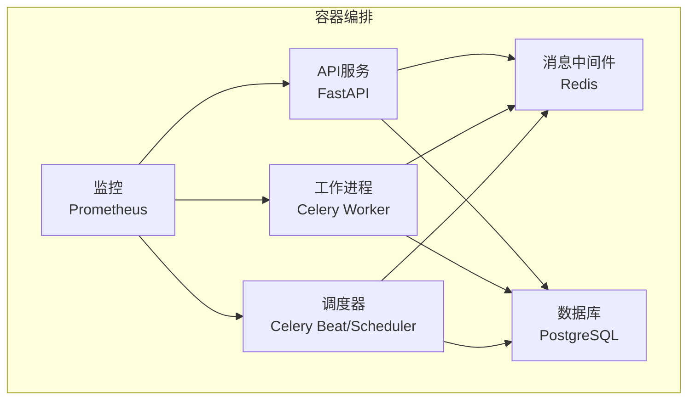
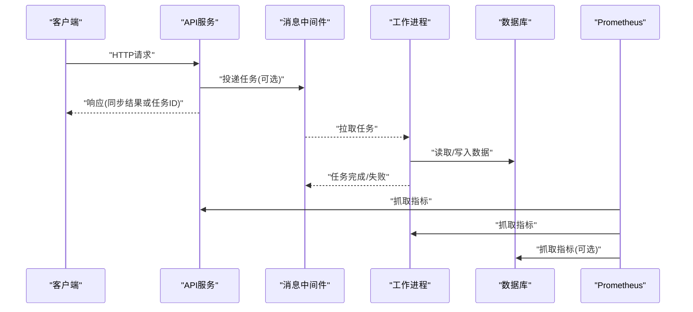
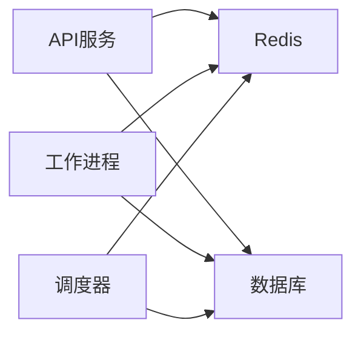

# Docker容器化部署

<cite>
**本文引用的文件**   
- [deploy/docker-compose.yml](file://deploy/docker-compose.yml)
- [deploy/prometheus.yml](file://deploy/prometheus.yml)
- [apps/api/main.py](file://apps/api/main.py)
- [apps/worker/main.py](file://apps/worker/main.py)
- [apps/scheduler/schedule.py](file://apps/scheduler/schedule.py)
- [configs/base.yaml](file://configs/base.yaml)
- [configs/dev.yaml](file://configs/dev.yaml)
- [alembic.ini](file://alembic.ini)
- [sql/migrations/env.py](file://sql/migrations/env.py)
</cite>

## 目录
1. [简介](#简介)
2. [项目结构](#项目结构)
3. [核心组件](#核心组件)
4. [架构总览](#架构总览)
5. [详细组件分析](#详细组件分析)
6. [依赖关系分析](#依赖关系分析)
7. [性能与资源](#性能与资源)
8. [故障排查指南](#故障排查指南)
9. [结论](#结论)
10. [附录](#附录)

## 简介
本文件面向开发者与运维人员，提供基于仓库的Docker容器化部署文档。重点说明docker-compose编排中API服务、工作进程、调度器、数据库等组件的配置与依赖关系；解释镜像构建过程、环境变量配置、网络通信设置；给出单机与多节点集群部署示例；涵盖数据持久化、卷挂载与存储策略；记录健康检查、重启策略与资源限制；并提供本地开发环境搭建指南与生产环境部署手册。

## 项目结构
与容器化相关的核心目录与文件：
- deploy/docker-compose.yml：服务编排定义（服务、网络、卷、环境变量、依赖、健康检查、资源限制等）
- deploy/prometheus.yml：监控采集配置（Prometheus抓取目标）
- apps/api/main.py：API服务入口（FastAPI应用启动、路由注册、生命周期钩子）
- apps/worker/main.py：工作进程入口（任务队列消费者）
- apps/scheduler/schedule.py：定时任务调度器（周期性任务触发）
- configs/base.yaml、configs/dev.yaml：基础与开发环境配置
- alembic.ini、sql/migrations/env.py：数据库迁移工具与迁移执行环境

图表来源
- [deploy/docker-compose.yml](file://deploy/docker-compose.yml)
- [apps/api/main.py](file://apps/api/main.py)
- [apps/worker/main.py](file://apps/worker/main.py)
- [apps/scheduler/schedule.py](file://apps/scheduler/schedule.py)
- [deploy/prometheus.yml](file://deploy/prometheus.yml)

章节来源
- [deploy/docker-compose.yml](file://deploy/docker-compose.yml)
- [deploy/prometheus.yml](file://deploy/prometheus.yml)
- [apps/api/main.py](file://apps/api/main.py)
- [apps/worker/main.py](file://apps/worker/main.py)
- [apps/scheduler/schedule.py](file://apps/scheduler/schedule.py)

## 核心组件
- API服务：对外暴露REST接口，负责请求路由、鉴权、业务编排与结果返回。通常通过HTTP端口提供服务，并连接Redis与数据库。
- 工作进程：异步处理耗时任务（如数据入库、特征计算、回测等），从消息队列消费任务并写入数据库。
- 调度器：按周期或事件驱动触发任务，将任务投递到消息队列供工作进程消费。
- 数据库：持久化存储市场数据、因子、组合、审计日志等结构化数据。
- 消息中间件：作为任务队列后端，解耦API与服务端异步任务。
- 监控：Prometheus抓取各服务的指标端点，用于告警与可视化。

章节来源
- [apps/api/main.py](file://apps/api/main.py)
- [apps/worker/main.py](file://apps/worker/main.py)
- [apps/scheduler/schedule.py](file://apps/scheduler/schedule.py)
- [deploy/prometheus.yml](file://deploy/prometheus.yml)

## 架构总览
下图展示了容器间的数据流与控制流：API接收外部请求，同步或异步处理；异步任务经消息中间件分发至工作进程；调度器定期触发任务；所有读写落库至数据库；Prometheus采集指标。

图表来源
- [deploy/docker-compose.yml](file://deploy/docker-compose.yml)
- [apps/api/main.py](file://apps/api/main.py)
- [apps/worker/main.py](file://apps/worker/main.py)
- [apps/scheduler/schedule.py](file://apps/scheduler/schedule.py)
- [deploy/prometheus.yml](file://deploy/prometheus.yml)

## 详细组件分析

### 服务编排与依赖关系（docker-compose）
- 服务清单
  - api：API服务容器，暴露HTTP端口，依赖消息中间件与数据库。
  - worker：工作进程容器，订阅消息队列，依赖消息中间件与数据库。
  - scheduler：调度器容器，按周期触发任务，依赖消息中间件与数据库。
  - db：数据库容器，持久化数据，使用卷挂载保证数据不丢失。
  - redis：消息中间件容器，作为任务队列后端。
  - prometheus：监控容器，抓取各服务指标。
- 网络
  - 默认compose网络，服务间通过服务名解析访问。
- 卷
  - 为数据库与关键数据目录创建命名卷，避免容器重建导致数据丢失。
- 环境变量
  - 通过.env或compose中的environment注入数据库连接、Redis连接、日志级别、监控开关等。
- 健康检查
  - 对API、数据库、Redis等关键服务配置健康检查，确保依赖就绪后再启动上游服务。
- 重启策略
  - 推荐all或unless-stopped，保障服务异常后自动恢复。
- 资源限制
  - 为每个服务设置CPU与内存上限，防止单服务占用过多资源影响整体稳定性。

章节来源
- [deploy/docker-compose.yml](file://deploy/docker-compose.yml)

### 镜像构建过程
- 构建上下文
  - 以项目根目录为构建上下文，复制源码、配置文件与依赖安装脚本。
- 依赖管理
  - 使用Python包管理器安装运行时依赖，优先缓存依赖层提升构建速度。
- 多阶段构建（可选）
  - 第一阶段安装依赖，第二阶段仅包含运行所需文件，减小镜像体积。
- 非root用户运行
  - 在镜像中创建非root用户，降低安全风险。
- 健康检查命令
  - 在镜像中集成轻量级健康检查命令，配合compose healthcheck使用。

章节来源
- [deploy/docker-compose.yml](file://deploy/docker-compose.yml)

### 环境变量配置
- 通用变量
  - 数据库连接URL、用户名、密码、主机、端口、数据库名。
  - Redis连接URL、主机、端口、密码。
  - 日志级别、时区、语言、监控开关、指标导出路径。
- 服务特定变量
  - API服务：监听地址、端口、CORS白名单、限流参数。
  - 工作进程：并发数、重试次数、超时时间、任务路由规则。
  - 调度器：调度表达式、任务映射、时钟源。
- 配置加载顺序
  - 建议先加载base.yaml，再根据环境覆盖dev.yaml或prod.yaml。

章节来源
- [configs/base.yaml](file://configs/base.yaml)
- [configs/dev.yaml](file://configs/dev.yaml)
- [deploy/docker-compose.yml](file://deploy/docker-compose.yml)

### 网络通信设置
- 服务发现
  - 通过Compose默认网络的服务名进行DNS解析，例如db、redis。
- 端口映射
  - API对外暴露HTTP端口，Prometheus对外暴露监控面板端口。
- 跨主机通信（集群）
  - 使用Overlay网络或外部负载均衡器，统一入口转发到各节点API实例。
- 安全加固
  - 限制对外暴露端口，内部服务仅通过内部网络访问。

章节来源
- [deploy/docker-compose.yml](file://deploy/docker-compose.yml)

### 数据持久化、卷挂载与存储策略
- 数据库卷
  - 为数据库数据目录创建命名卷，确保容器重建后数据不丢失。
- 备份策略
  - 定期快照或逻辑备份，保留N份历史备份，支持异地容灾。
- 临时数据
  - 对于可重建的中间结果，可使用tmpfs或无状态卷，减少磁盘压力。
- 权限与安全
  - 控制卷目录权限，避免容器内进程越权访问宿主机文件系统。

章节来源
- [deploy/docker-compose.yml](file://deploy/docker-compose.yml)

### 健康检查、重启策略与资源限制
- 健康检查
  - API：HTTP探针检查/health或/liveness端点。
  - 数据库：内置健康检查命令验证连接与可用性。
  - Redis：ping命令验证连通性。
- 重启策略
  - 推荐all或unless-stopped，结合健康检查避免频繁重启循环。
- 资源限制
  - 为API、Worker、Scheduler分别设置CPU与内存上限，避免争抢。
- 优雅停机
  - 捕获SIGTERM信号，完成正在处理的请求或任务后退出。

章节来源
- [deploy/docker-compose.yml](file://deploy/docker-compose.yml)

### 监控与可观测性
- Prometheus抓取
  - 在各服务暴露指标端点，Prometheus定期抓取并持久化时序数据。
- 告警规则
  - 针对错误率、延迟、队列积压、数据库连接池等指标配置告警。
- 日志聚合
  - 建议将容器日志输出到stdout/stderr，由宿主机或日志系统收集。

章节来源
- [deploy/prometheus.yml](file://deploy/prometheus.yml)

### 数据库迁移
- 迁移工具
  - 使用Alembic进行版本化管理，迁移脚本位于sql/migrations。
- 迁移执行时机
  - 建议在服务启动前或首次启动时执行迁移，确保Schema一致。
- 回滚策略
  - 记录每次迁移的版本号，支持向上/向下回滚。

章节来源
- [alembic.ini](file://alembic.ini)
- [sql/migrations/env.py](file://sql/migrations/env.py)

## 依赖关系分析
- 服务间依赖
  - API依赖Redis与数据库；Worker依赖Redis与数据库；Scheduler依赖Redis与数据库。
- 外部依赖
  - 第三方数据源、对象存储、邮件服务等可通过环境变量接入。
- 耦合度与内聚性
  - 通过消息队列解耦API与异步任务，提高可扩展性与容错能力。

图表来源
- [deploy/docker-compose.yml](file://deploy/docker-compose.yml)
- [apps/api/main.py](file://apps/api/main.py)
- [apps/worker/main.py](file://apps/worker/main.py)
- [apps/scheduler/schedule.py](file://apps/scheduler/schedule.py)

章节来源
- [deploy/docker-compose.yml](file://deploy/docker-compose.yml)

## 性能与资源
- 水平扩展
  - 增加API与Worker副本数量，结合负载均衡实现高可用。
- 队列容量与背压
  - 合理设置队列长度与消费者并发，避免内存溢出。
- 数据库优化
  - 调整连接池大小、索引与查询计划，避免慢查询。
- 监控与调优
  - 基于Prometheus指标定位瓶颈，持续优化资源配置。

[本节为通用指导，无需具体文件引用]

## 故障排查指南
- 常见问题
  - 服务无法启动：检查环境变量、端口冲突、健康检查失败。
  - 任务堆积：检查Worker数量、任务耗时、队列深度。
  - 数据库连接失败：检查连接字符串、网络可达性、权限。
  - 监控缺失：确认指标端点暴露与Prometheus抓取配置。
- 诊断步骤
  - 查看容器日志与系统日志。
  - 进入容器执行健康检查命令。
  - 检查Compose服务状态与依赖关系。
  - 核对环境变量与配置文件一致性。

章节来源
- [deploy/docker-compose.yml](file://deploy/docker-compose.yml)
- [deploy/prometheus.yml](file://deploy/prometheus.yml)

## 结论
通过合理的容器编排、环境变量管理、健康检查与资源限制，可实现稳定可靠的量化系统部署。结合监控与日志体系，能够快速定位问题并进行容量规划与性能调优。

[本节为总结，无需具体文件引用]

## 附录

### 本地开发环境搭建指南
- 前置条件
  - 安装Docker与Docker Compose。
- 快速启动
  - 复制示例环境变量文件并修改必要参数。
  - 执行编排启动命令，等待服务健康检查通过。
- 初始化数据
  - 执行数据库迁移脚本，导入初始数据。
- 常用操作
  - 查看服务日志、进入容器调试、停止与清理资源。

章节来源
- [deploy/docker-compose.yml](file://deploy/docker-compose.yml)
- [configs/dev.yaml](file://configs/dev.yaml)
- [alembic.ini](file://alembic.ini)
- [sql/migrations/env.py](file://sql/migrations/env.py)

### 生产环境部署手册
- 环境准备
  - 选择云厂商或自建Kubernetes平台，准备高可用数据库与Redis。
- 安全加固
  - 最小权限原则、密钥管理、网络隔离、镜像扫描。
- 高可用与弹性
  - 多副本部署、自动扩缩容、灰度发布与回滚策略。
- 备份与容灾
  - 定期全量与增量备份，演练灾难恢复流程。
- 监控与告警
  - 完善指标、日志、链路追踪，建立告警与值班机制。

章节来源
- [deploy/docker-compose.yml](file://deploy/docker-compose.yml)
- [deploy/prometheus.yml](file://deploy/prometheus.yml)