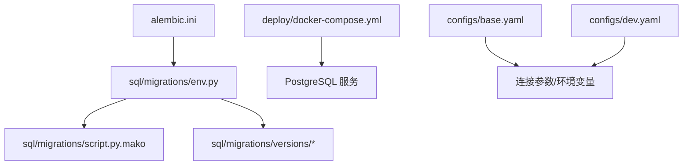
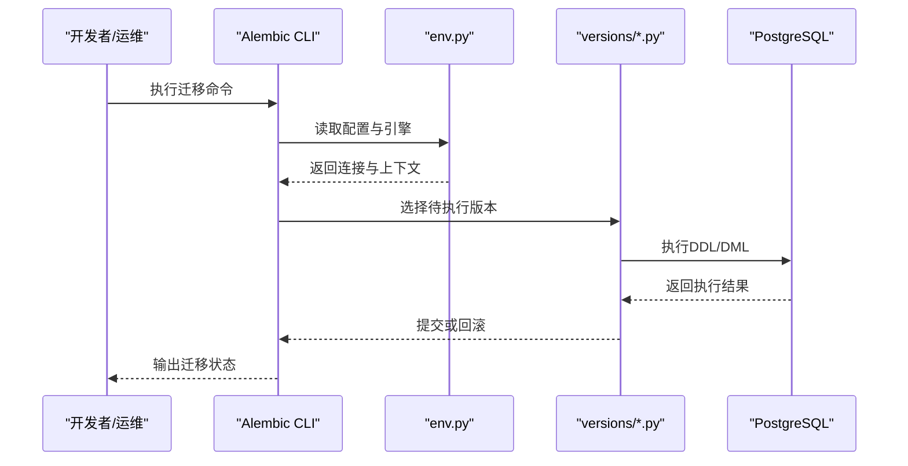
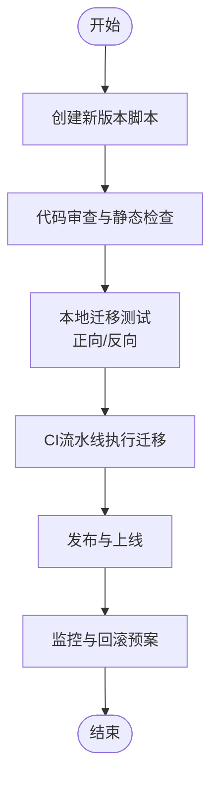
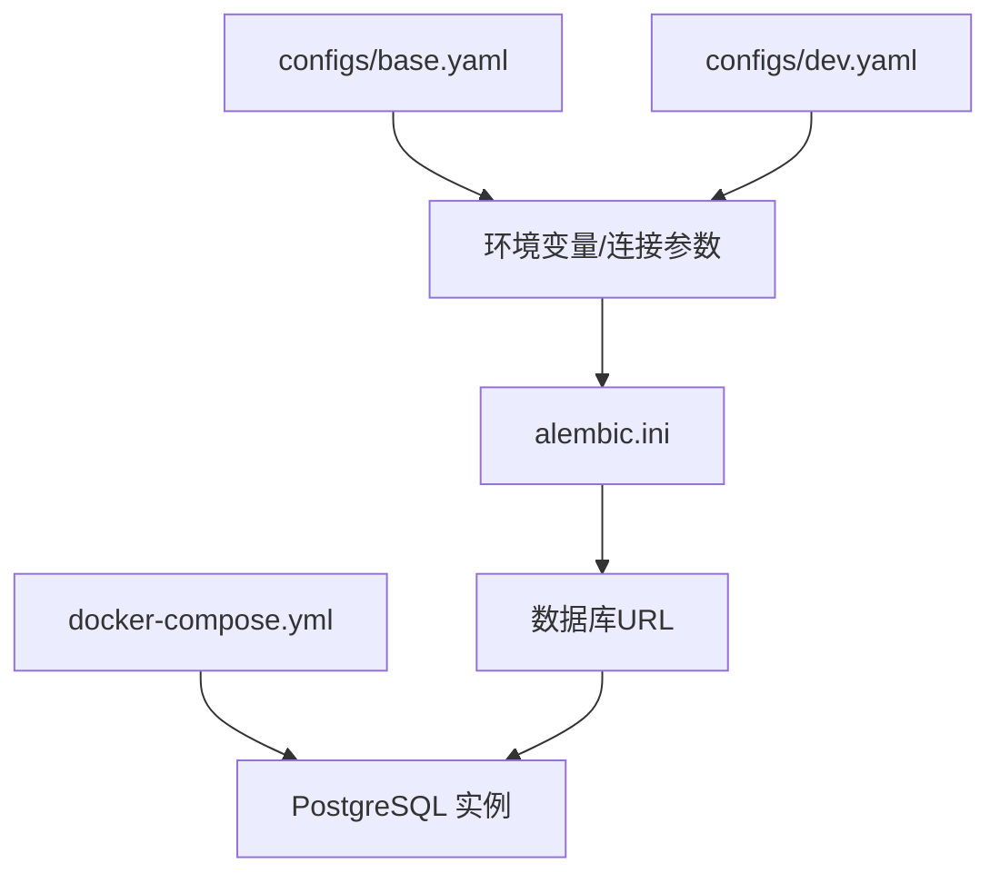
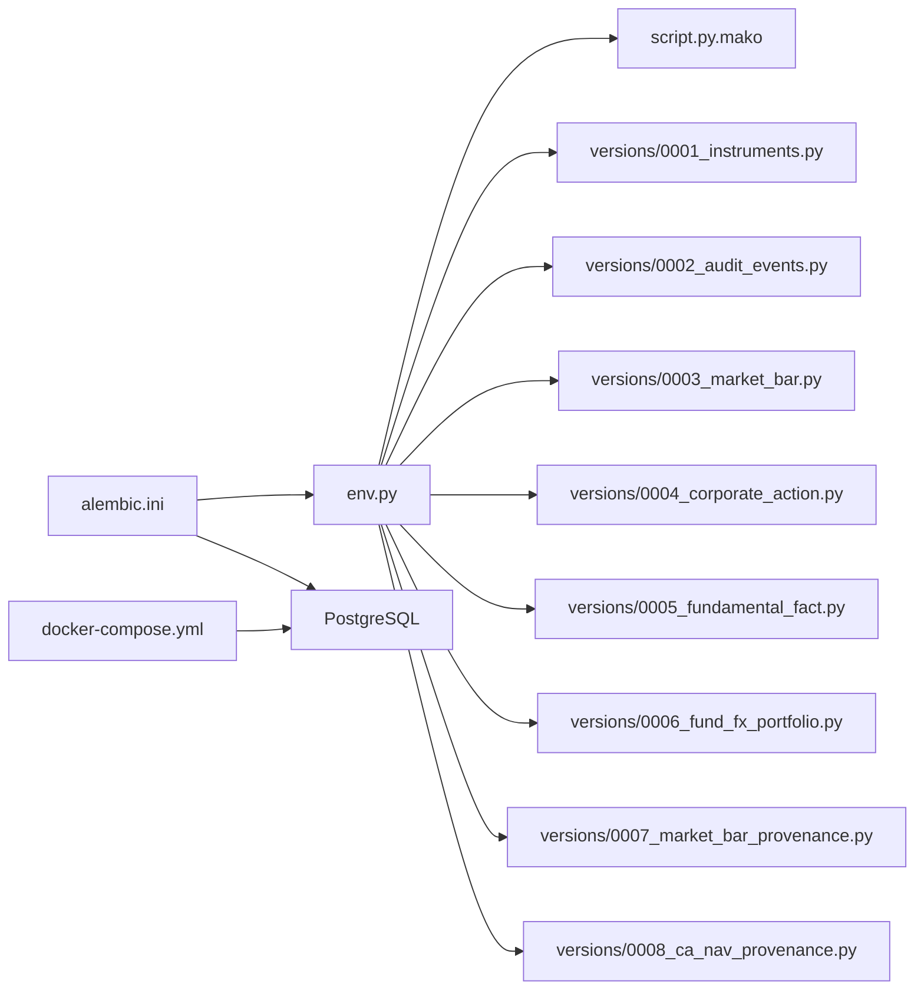

# 数据库运维操作

<cite>
**本文引用的文件**   
- [alembic.ini](file://alembic.ini)
- [sql/migrations/env.py](file://sql/migrations/env.py)
- [sql/migrations/script.py.mako](file://sql/migrations/script.py.mako)
- [sql/migrations/versions/20260715_0001_instruments.py](file://sql/migrations/versions/20260715_0001_instruments.py)
- [sql/migrations/versions/20260715_0002_audit_events.py](file://sql/migrations/versions/20260715_0002_audit_events.py)
- [sql/migrations/versions/20260715_0003_market_bar.py](file://sql/migrations/versions/20260715_0003_market_bar.py)
- [sql/migrations/versions/20260715_0004_corporate_action.py](file://sql/migrations/versions/20260715_0004_corporate_action.py)
- [sql/migrations/versions/20260715_0005_fundamental_fact.py](file://sql/migrations/versions/20260715_0005_fundamental_fact.py)
- [sql/migrations/versions/20260715_0006_fund_fx_portfolio.py](file://sql/migrations/versions/20260715_0006_fund_fx_portfolio.py)
- [sql/migrations/versions/20260715_0007_market_bar_provenance.py](file://sql/migrations/versions/20260715_0007_market_bar_provenance.py)
- [sql/migrations/versions/20260715_0008_ca_nav_provenance.py](file://sql/migrations/versions/20260715_0008_ca_nav_provenance.py)
- [deploy/docker-compose.yml](file://deploy/docker-compose.yml)
- [configs/base.yaml](file://configs/base.yaml)
- [configs/dev.yaml](file://configs/dev.yaml)
</cite>

## 目录
1. [简介](#简介)
2. [项目结构](#项目结构)
3. [核心组件](#核心组件)
4. [架构总览](#架构总览)
5. [详细组件分析](#详细组件分析)
6. [依赖关系分析](#依赖关系分析)
7. [性能考虑](#性能考虑)
8. [故障排查指南](#故障排查指南)
9. [结论](#结论)
10. [附录](#附录)

## 简介
本手册面向DBA与运维人员，围绕Alembic迁移工具、PostgreSQL数据库初始化、备份恢复、性能调优、数据生命周期管理以及高可用与灾难恢复等主题，提供可操作的实践指南。文档基于仓库中的迁移配置、环境脚本与部署清单进行说明，确保内容与实际代码一致，便于落地执行。

## 项目结构
与数据库运维直接相关的目录与文件：
- Alembic迁移配置与版本脚本位于 sql/migrations 目录
- 应用运行环境与容器编排定义位于 deploy/docker-compose.yml
- 基础与开发环境配置位于 configs/base.yaml 与 configs/dev.yaml

图表来源
- [alembic.ini](file://alembic.ini)
- [sql/migrations/env.py](file://sql/migrations/env.py)
- [sql/migrations/script.py.mako](file://sql/migrations/script.py.mako)
- [sql/migrations/versions/20260715_0001_instruments.py](file://sql/migrations/versions/20260715_0001_instruments.py)
- [deploy/docker-compose.yml](file://deploy/docker-compose.yml)
- [configs/base.yaml](file://configs/base.yaml)
- [configs/dev.yaml](file://configs/dev.yaml)

章节来源
- [alembic.ini](file://alembic.ini)
- [sql/migrations/env.py](file://sql/migrations/env.py)
- [sql/migrations/script.py.mako](file://sql/migrations/script.py.mako)
- [deploy/docker-compose.yml](file://deploy/docker-compose.yml)
- [configs/base.yaml](file://configs/base.yaml)
- [configs/dev.yaml](file://configs/dev.yaml)

## 核心组件
- Alembic 配置文件 alembic.ini：定义迁移脚本目录、目标数据库URL、日志级别等关键参数。
- 迁移环境脚本 env.py：负责加载配置、建立引擎、处理事务上下文、生成迁移头信息等。
- 迁移模板 script.py.mako：用于自动生成新迁移脚本的骨架。
- 迁移版本脚本 versions/*：每个文件对应一次数据库变更（建表、索引、约束、数据修正等）。
- 部署编排 docker-compose.yml：启动PostgreSQL服务及关联组件，为迁移与业务提供运行时环境。
- 环境配置 base.yaml / dev.yaml：集中管理数据库连接参数、调试开关等。

章节来源
- [alembic.ini](file://alembic.ini)
- [sql/migrations/env.py](file://sql/migrations/env.py)
- [sql/migrations/script.py.mako](file://sql/migrations/script.py.mako)
- [sql/migrations/versions/20260715_0001_instruments.py](file://sql/migrations/versions/20260715_0001_instruments.py)
- [sql/migrations/versions/20260715_0002_audit_events.py](file://sql/migrations/versions/20260715_0002_audit_events.py)
- [sql/migrations/versions/20260715_0003_market_bar.py](file://sql/migrations/versions/20260715_0003_market_bar.py)
- [sql/migrations/versions/20260715_0004_corporate_action.py](file://sql/migrations/versions/20260715_0004_corporate_action.py)
- [sql/migrations/versions/20260715_0005_fundamental_fact.py](file://sql/migrations/versions/20260715_0005_fundamental_fact.py)
- [sql/migrations/versions/20260715_0006_fund_fx_portfolio.py](file://sql/migrations/versions/20260715_0006_fund_fx_portfolio.py)
- [sql/migrations/versions/20260715_0007_market_bar_provenance.py](file://sql/migrations/versions/20260715_0007_market_bar_provenance.py)
- [sql/migrations/versions/20260715_0008_ca_nav_provenance.py](file://sql/migrations/versions/20260715_0008_ca_nav_provenance.py)
- [deploy/docker-compose.yml](file://deploy/docker-compose.yml)
- [configs/base.yaml](file://configs/base.yaml)
- [configs/dev.yaml](file://configs/dev.yaml)

## 架构总览
下图展示了从配置到迁移执行的端到端流程，包括Alembic如何读取配置、加载env.py、定位并执行具体版本脚本，以及PostgreSQL作为目标数据库的角色。

图表来源
- [alembic.ini](file://alembic.ini)
- [sql/migrations/env.py](file://sql/migrations/env.py)
- [sql/migrations/versions/20260715_0001_instruments.py](file://sql/migrations/versions/20260715_0001_instruments.py)
- [deploy/docker-compose.yml](file://deploy/docker-compose.yml)

## 详细组件分析

### Alembic 迁移配置与环境
- alembic.ini
  - 作用：指定迁移脚本目录、目标数据库URL、日志级别、批量模式等。
  - 关键点：数据库URL需指向PostgreSQL；迁移目录指向 sql/migrations；可根据环境切换不同配置。
- env.py
  - 作用：加载配置、创建SQLAlchemy引擎、设置元数据、构建迁移上下文、处理事务与并发策略。
  - 关键点：根据目标数据库类型调整执行策略（如PostgreSQL的并发与锁行为）；支持在迁移中执行批处理语句。
- script.py.mako
  - 作用：生成新迁移脚本的模板，包含上下文的导入与函数签名。
  - 关键点：保持模板简洁，避免引入额外依赖；迁移逻辑集中在 versions 下的具体脚本中。

章节来源
- [alembic.ini](file://alembic.ini)
- [sql/migrations/env.py](file://sql/migrations/env.py)
- [sql/migrations/script.py.mako](file://sql/migrations/script.py.mako)

### 迁移版本脚本与版本控制
- 版本命名规范
  - 采用时间戳+序号+描述的方式，例如 20260715_0001_instruments.py，保证顺序可读且可追溯。
- 版本脚本职责
  - 每个文件实现向上与向下迁移逻辑，确保可逆性；对大表变更使用批处理与分步策略。
- 版本管理流程
  - 新增变更时，先编写迁移脚本，再本地验证，最后合并至主干并在CI中执行自动化校验。

图表来源
- [sql/migrations/versions/20260715_0001_instruments.py](file://sql/migrations/versions/20260715_0001_instruments.py)
- [sql/migrations/versions/20260715_0002_audit_events.py](file://sql/migrations/versions/20260715_0002_audit_events.py)
- [sql/migrations/versions/20260715_0003_market_bar.py](file://sql/migrations/versions/20260715_0003_market_bar.py)
- [sql/migrations/versions/20260715_0004_corporate_action.py](file://sql/migrations/versions/20260715_0004_corporate_action.py)
- [sql/migrations/versions/20260715_0005_fundamental_fact.py](file://sql/migrations/versions/20260715_0005_fundamental_fact.py)
- [sql/migrations/versions/20260715_0006_fund_fx_portfolio.py](file://sql/migrations/versions/20260715_0006_fund_fx_portfolio.py)
- [sql/migrations/versions/20260715_0007_market_bar_provenance.py](file://sql/migrations/versions/20260715_0007_market_bar_provenance.py)
- [sql/migrations/versions/20260715_0008_ca_nav_provenance.py](file://sql/migrations/versions/20260715_0008_ca_nav_provenance.py)

章节来源
- [sql/migrations/versions/20260715_0001_instruments.py](file://sql/migrations/versions/20260715_0001_instruments.py)
- [sql/migrations/versions/20260715_0002_audit_events.py](file://sql/migrations/versions/20260715_0002_audit_events.py)
- [sql/migrations/versions/20260715_0003_market_bar.py](file://sql/migrations/versions/20260715_0003_market_bar.py)
- [sql/migrations/versions/20260715_0004_corporate_action.py](file://sql/migrations/versions/20260715_0004_corporate_action.py)
- [sql/migrations/versions/20260715_0005_fundamental_fact.py](file://sql/migrations/versions/20260715_0005_fundamental_fact.py)
- [sql/migrations/versions/20260715_0006_fund_fx_portfolio.py](file://sql/migrations/versions/20260715_0006_fund_fx_portfolio.py)
- [sql/migrations/versions/20260715_0007_market_bar_provenance.py](file://sql/migrations/versions/20260715_0007_market_bar_provenance.py)
- [sql/migrations/versions/20260715_0008_ca_nav_provenance.py](file://sql/migrations/versions/20260715_0008_ca_nav_provenance.py)

### 数据库初始化与连接配置
- 通过 docker-compose.yml 启动PostgreSQL服务，暴露端口与持久化卷，确保数据不随容器销毁丢失。
- 使用 alembic.ini 中的数据库URL指向该服务，完成首次迁移以初始化库结构与基线版本。
- 环境配置 base.yaml 与 dev.yaml 可用于区分不同环境的连接参数与调试选项。

图表来源
- [deploy/docker-compose.yml](file://deploy/docker-compose.yml)
- [alembic.ini](file://alembic.ini)
- [configs/base.yaml](file://configs/base.yaml)
- [configs/dev.yaml](file://configs/dev.yaml)

章节来源
- [deploy/docker-compose.yml](file://deploy/docker-compose.yml)
- [alembic.ini](file://alembic.ini)
- [configs/base.yaml](file://configs/base.yaml)
- [configs/dev.yaml](file://configs/dev.yaml)

### 备份与恢复
- 备份策略
  - 定期全量备份与增量备份结合，保留多份历史快照，落盘至对象存储或独立存储卷。
  - 备份前建议短暂降低写入负载，确保一致性。
- 恢复流程
  - 先在隔离环境验证恢复过程，再进行生产切换。
  - 记录恢复时间点与版本，确保与迁移版本对齐。
- 注意事项
  - 备份中包含系统表与用户数据，注意权限与敏感信息脱敏。
  - 恢复后需校验关键表行数与索引状态，必要时重建统计信息。

[本节为通用实践说明，未直接分析具体文件]

### 性能调优策略（PostgreSQL）
- 连接池
  - 合理设置最大连接数与应用侧连接池大小，避免连接耗尽与频繁创建开销。
  - 使用连接复用与短事务，减少长事务持有锁的时间。
- 索引优化
  - 针对高频查询条件与排序字段建立合适索引，避免过度索引导致写放大。
  - 定期分析索引使用情况，删除无用索引。
- 查询性能分析
  - 启用慢查询日志与EXPLAIN ANALYZE，识别热点SQL。
  - 关注锁等待与死锁，优化事务边界与更新粒度。
- 维护任务
  - 定期VACUUM与ANALYZE，保持统计信息与空间回收。
  - 监控磁盘IO、CPU与内存使用，评估是否需要扩容或重构表结构。

[本节为通用实践说明，未直接分析具体文件]

### 数据清理、归档与生命周期管理
- 清理策略
  - 按时间窗口与业务重要性分层清理，优先清理临时与中间表数据。
  - 使用分批删除与索引保护，避免一次性锁表。
- 归档方案
  - 将冷数据迁移至低成本存储，保留必要索引与分区键以便检索。
  - 归档后更新元数据与访问路径，确保上层应用透明。
- 生命周期管理
  - 制定数据保留策略与合规要求，自动化执行清理与归档任务。
  - 监控归档进度与空间释放效果，及时告警异常。

[本节为通用实践说明，未直接分析具体文件]

### 高可用与灾难恢复
- 高可用配置
  - 主从复制与自动故障转移，确保RPO/RTO满足业务需求。
  - 读写分离与只读副本提升吞吐能力。
- 灾难恢复流程
  - 明确RTO/RPO目标，演练恢复流程与回切步骤。
  - 准备回滚脚本与回退策略，确保快速止损。
- 监控与告警
  - 监控复制延迟、主从健康与资源水位，设置阈值告警。
  - 定期演练故障注入，验证恢复有效性。

[本节为通用实践说明，未直接分析具体文件]

### 日常维护操作指南
- 迁移相关
  - 查看当前版本与差异，确认待执行迁移列表。
  - 执行迁移前进行预检与回滚演练，确保可逆。
- 数据库健康检查
  - 检查连接数、锁等待、慢查询与磁盘空间。
  - 核对索引命中率与统计信息新鲜度。
- 容量规划
  - 监控增长趋势，提前扩容或拆分表。
  - 评估冷热数据比例，优化存储成本。

[本节为通用实践说明，未直接分析具体文件]

### 故障排查方法
- 常见问题
  - 迁移失败：检查数据库URL、权限与网络连通性。
  - 锁冲突：缩短事务、拆分更新、避免长时间持有锁。
  - 性能退化：分析慢查询、重建统计信息、优化索引。
- 排查步骤
  - 收集错误日志与堆栈，定位问题范围。
  - 复现最小场景，逐步缩小根因。
  - 实施修复并回归验证，记录复盘报告。

[本节为通用实践说明，未直接分析具体文件]

## 依赖关系分析
Alembic迁移体系的核心依赖关系如下：
- alembic.ini 驱动迁移CLI，指向迁移目录与数据库URL
- env.py 负责加载配置、创建引擎与上下文
- versions/* 是具体的迁移实现，依赖env.py提供的上下文
- docker-compose.yml 提供PostgreSQL运行时环境
- base.yaml / dev.yaml 提供环境级配置项

图表来源
- [alembic.ini](file://alembic.ini)
- [sql/migrations/env.py](file://sql/migrations/env.py)
- [sql/migrations/script.py.mako](file://sql/migrations/script.py.mako)
- [sql/migrations/versions/20260715_0001_instruments.py](file://sql/migrations/versions/20260715_0001_instruments.py)
- [sql/migrations/versions/20260715_0002_audit_events.py](file://sql/migrations/versions/20260715_0002_audit_events.py)
- [sql/migrations/versions/20260715_0003_market_bar.py](file://sql/migrations/versions/20260715_0003_market_bar.py)
- [sql/migrations/versions/20260715_0004_corporate_action.py](file://sql/migrations/versions/20260715_0004_corporate_action.py)
- [sql/migrations/versions/20260715_0005_fundamental_fact.py](file://sql/migrations/versions/20260715_0005_fundamental_fact.py)
- [sql/migrations/versions/20260715_0006_fund_fx_portfolio.py](file://sql/migrations/versions/20260715_0006_fund_fx_portfolio.py)
- [sql/migrations/versions/20260715_0007_market_bar_provenance.py](file://sql/migrations/versions/20260715_0007_market_bar_provenance.py)
- [sql/migrations/versions/20260715_0008_ca_nav_provenance.py](file://sql/migrations/versions/20260715_0008_ca_nav_provenance.py)
- [deploy/docker-compose.yml](file://deploy/docker-compose.yml)

章节来源
- [alembic.ini](file://alembic.ini)
- [sql/migrations/env.py](file://sql/migrations/env.py)
- [sql/migrations/script.py.mako](file://sql/migrations/script.py.mako)
- [deploy/docker-compose.yml](file://deploy/docker-compose.yml)

## 性能考虑
- 连接池与事务
  - 控制最大连接数与空闲超时，避免连接泄漏。
  - 尽量使用短事务与批量操作，减少锁竞争。
- 索引与查询
  - 依据查询模式设计复合索引，避免选择性低的列单独建索引。
  - 定期分析慢查询，优化JOIN与过滤条件。
- 维护与监控
  - 定时VACUUM/ANALYZE，保持统计信息准确。
  - 监控磁盘IO、CPU、内存与锁等待，设定告警阈值。

[本节为通用实践说明，未直接分析具体文件]

## 故障排查指南
- 迁移失败
  - 检查数据库URL与权限，确认目标库存在且可写。
  - 查看迁移日志，定位具体失败的DDL/DML语句。
- 锁与死锁
  - 使用系统视图查看锁等待链，定位阻塞源。
  - 拆分长事务，避免跨会话持有锁。
- 性能问题
  - 启用慢查询日志，收集EXPLAIN ANALYZE结果。
  - 检查索引命中与扫描方式，必要时重建索引或改写SQL。

[本节为通用实践说明，未直接分析具体文件]

## 结论
本手册基于仓库中的Alembic迁移配置与部署清单，提供了从迁移管理、初始化、备份恢复到性能调优与高可用的完整运维指南。建议团队在日常工作中严格执行版本控制与回滚预案，持续监控与优化数据库性能，确保系统稳定与高效运行。

[本节为总结性内容，未直接分析具体文件]

## 附录
- 常用命令参考
  - 查看当前版本与差异
  - 执行迁移与回滚
  - 生成新迁移脚本
- 环境切换
  - 通过配置文件切换不同环境的数据库URL与调试选项
- 演练计划
  - 定期演练备份恢复与故障切换，验证RTO/RTO指标

[本节为补充说明，未直接分析具体文件]