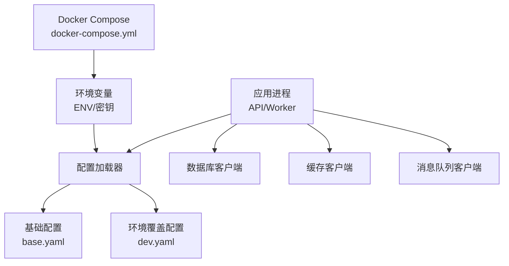
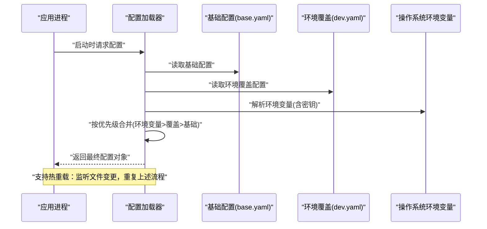
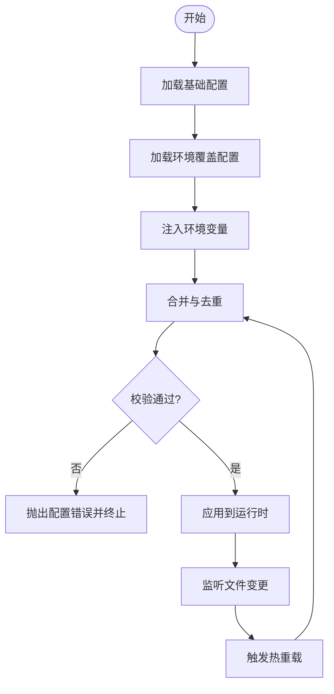
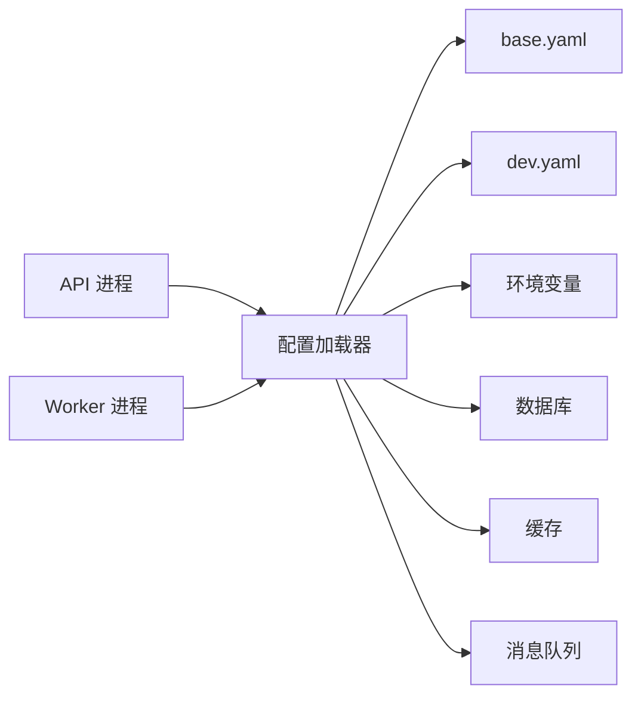

# 环境配置管理

<cite>
**本文引用的文件**
- [configs/base.yaml](file://configs/base.yaml)
- [configs/dev.yaml](file://configs/dev.yaml)
- [apps/api/main.py](file://apps/api/main.py)
- [apps/worker/main.py](file://apps/worker/main.py)
- [deploy/docker-compose.yml](file://deploy/docker-compose.yml)
</cite>

## 目录
1. [简介](#简介)
2. [项目结构](#项目结构)
3. [核心组件](#核心组件)
4. [架构总览](#架构总览)
5. [详细组件分析](#详细组件分析)
6. [依赖关系分析](#依赖关系分析)
7. [性能考虑](#性能考虑)
8. [故障排查指南](#故障排查指南)
9. [结论](#结论)
10. [附录](#附录)

## 简介
本文件面向多环境配置管理，聚焦于基础配置 base.yaml 与开发环境 dev.yaml 的层次结构与继承关系，解释数据库连接、缓存、消息队列等关键配置项的作用与默认值策略，并给出不同环境（开发、测试、预发布、生产）的差异与最佳实践。同时说明配置热重载机制与验证规则，提供敏感信息安全管理方案（密钥管理与环境变量注入），以及配置调试与问题排查指南。

## 项目结构
仓库采用“配置集中 + 应用按需加载”的组织方式：
- configs/base.yaml：全局基础配置，定义通用默认值与公共字段。
- configs/dev.yaml：开发环境覆盖配置，基于基础配置进行增量覆盖。
- apps/api/main.py 与 apps/worker/main.py：应用启动入口，负责加载配置、初始化服务与中间件。
- deploy/docker-compose.yml：容器编排与环境变量注入示例，便于在不同环境中切换配置。

图表来源
- [apps/api/main.py](file://apps/api/main.py)
- [apps/worker/main.py](file://apps/worker/main.py)
- [configs/base.yaml](file://configs/base.yaml)
- [configs/dev.yaml](file://configs/dev.yaml)
- [deploy/docker-compose.yml](file://deploy/docker-compose.yml)

章节来源
- [configs/base.yaml](file://configs/base.yaml)
- [configs/dev.yaml](file://configs/dev.yaml)
- [apps/api/main.py](file://apps/api/main.py)
- [apps/worker/main.py](file://apps/worker/main.py)
- [deploy/docker-compose.yml](file://deploy/docker-compose.yml)

## 核心组件
- 基础配置层（base.yaml）
  - 作用：定义所有环境的公共默认值与公共键空间，确保各环境具备一致的配置结构。
  - 典型领域：数据库连接、缓存、消息队列、日志、可观测性、调度与任务参数等。
- 环境覆盖层（dev.yaml）
  - 作用：在基础配置之上，针对特定环境覆盖或新增字段，实现差异化行为。
  - 覆盖策略：同名键覆盖；嵌套字典按层级合并；新增键保留。
- 配置加载器（应用内）
  - 职责：读取 base.yaml 与当前环境配置，执行合并与校验，暴露统一配置对象给业务模块。
  - 热重载：监听配置文件变更事件，触发重新加载与校验，避免重启服务。
- 环境变量注入
  - 用途：注入敏感信息与运行时差异（如数据库密码、外部服务地址）。
  - 优先级：环境变量 > 环境覆盖配置 > 基础配置。

章节来源
- [configs/base.yaml](file://configs/base.yaml)
- [configs/dev.yaml](file://configs/dev.yaml)
- [apps/api/main.py](file://apps/api/main.py)
- [apps/worker/main.py](file://apps/worker/main.py)

## 架构总览
下图展示配置从磁盘到运行时的加载流程，以及环境变量与覆盖配置的合并顺序。

图表来源
- [apps/api/main.py](file://apps/api/main.py)
- [apps/worker/main.py](file://apps/worker/main.py)
- [configs/base.yaml](file://configs/base.yaml)
- [configs/dev.yaml](file://configs/dev.yaml)

## 详细组件分析

### 基础配置（base.yaml）
- 设计原则
  - 提供完整键空间与合理默认值，保证任何环境均可直接运行。
  - 将易变项（如主机、端口、凭据）下沉至环境变量或覆盖配置。
- 常见领域与默认值策略
  - 数据库连接：默认使用本地回环地址与标准端口，驱动类型与池大小提供安全默认值。
  - 缓存：默认启用本地内存缓存，设置合理的过期时间与最大条目数。
  - 消息队列：默认使用轻量级本地代理，开启自动重试与幂等处理开关。
  - 日志与可观测性：默认输出控制台日志，采样率与指标导出关闭或保守默认。
  - 调度与任务：默认并发度较低，适合开发与单机部署。
- 建议
  - 对敏感字段仅保留占位符，强制通过环境变量注入。
  - 为每个键添加注释说明用途、取值范围与默认值。

章节来源
- [configs/base.yaml](file://configs/base.yaml)

### 开发环境覆盖（dev.yaml）
- 覆盖策略
  - 仅声明需要变更的键，其余沿用 base.yaml。
  - 针对开发体验优化：降低并发、开启详细日志、禁用严格校验等。
- 常见差异点
  - 数据库：指向本地或开发实例，关闭只读副本。
  - 缓存：增大本地缓存容量，缩短过期时间以便快速验证。
  - 消息队列：使用本地代理，减少重试次数以加快失败反馈。
  - 可观测性：开启详细追踪与指标，但限制采样率以避免噪声。
- 建议
  - 保持 dev.yaml 最小化，避免复制基础配置。
  - 使用 .env 或 docker-compose 的环境变量注入敏感信息。

章节来源
- [configs/dev.yaml](file://configs/dev.yaml)

### 配置加载与合并流程
- 加载顺序
  - 先加载 base.yaml，再加载 dev.yaml，最后注入环境变量。
- 合并规则
  - 同层键覆盖；嵌套字典递归合并；数组追加或替换由具体实现决定。
- 校验与约束
  - 必填字段检查（如数据库 URL、缓存地址）。
  - 类型与范围校验（端口、超时、并发度）。
  - 互斥与依赖校验（如某功能开关需配套参数）。
- 热重载
  - 监听配置文件与 .env 变更，触发重新加载与校验。
  - 对已建立的连接（如数据库、缓存、MQ）进行优雅重建或滚动更新。

图表来源
- [apps/api/main.py](file://apps/api/main.py)
- [apps/worker/main.py](file://apps/worker/main.py)

章节来源
- [apps/api/main.py](file://apps/api/main.py)
- [apps/worker/main.py](file://apps/worker/main.py)

### 不同环境差异与最佳实践
- 开发（dev）
  - 目标：快速迭代与本地联调。
  - 要点：低并发、详细日志、本地依赖、宽松校验。
- 测试（test）
  - 目标：自动化与回归稳定。
  - 要点：隔离数据源、固定种子数据、关闭非必要外部依赖、严格校验。
- 预发布（staging）
  - 目标：接近生产的仿真环境。
  - 要点：与生产一致的配置结构，仅替换凭据与资源规模。
- 生产（prod）
  - 目标：高可用与安全合规。
  - 要点：高并发与弹性、强校验、限流与熔断、审计与告警、最小权限。

章节来源
- [configs/base.yaml](file://configs/base.yaml)
- [configs/dev.yaml](file://configs/dev.yaml)

### 敏感信息安全管理
- 环境变量注入
  - 通过 docker-compose.yml 或系统环境变量注入密钥与敏感参数。
  - 环境变量优先级高于配置文件，避免将敏感信息写入版本库。
- 密钥管理
  - 建议使用专用密钥管理服务（KMS）或平台托管的 Secret。
  - 应用启动时拉取密钥并注入到配置对象中。
- 安全建议
  - 禁止在配置文件中明文存储敏感信息。
  - 对日志中的敏感信息进行脱敏。
  - 定期轮换密钥并记录审计日志。

章节来源
- [deploy/docker-compose.yml](file://deploy/docker-compose.yml)
- [configs/base.yaml](file://configs/base.yaml)
- [configs/dev.yaml](file://configs/dev.yaml)

### 配置热重载机制
- 触发条件
  - 配置文件或 .env 文件变更。
- 处理流程
  - 重新加载与合并配置。
  - 执行校验，失败则回滚到上一份有效配置。
  - 对受影响的客户端连接进行优雅重建。
- 注意事项
  - 热重载期间避免中断正在处理的请求。
  - 对状态型组件（如连接池）实施平滑过渡。

章节来源
- [apps/api/main.py](file://apps/api/main.py)
- [apps/worker/main.py](file://apps/worker/main.py)

### 配置验证规则
- 必填项
  - 数据库连接字符串、缓存地址、消息队列端点等。
- 类型与范围
  - 端口号、超时时间、并发度、缓存条目上限等。
- 依赖与互斥
  - 某些功能开关需配套参数；互斥选项不可同时启用。
- 格式校验
  - URL 格式、布尔值、枚举值、正则表达式匹配等。

章节来源
- [configs/base.yaml](file://configs/base.yaml)
- [configs/dev.yaml](file://configs/dev.yaml)

## 依赖关系分析
- 组件耦合
  - 应用进程依赖配置加载器；配置加载器依赖基础与环境覆盖配置；环境变量作为最高优先级输入。
- 外部依赖
  - 数据库、缓存、消息队列等外部服务的连接参数由配置驱动。
- 潜在风险
  - 循环依赖应避免；配置键命名需保持一致，防止运行时找不到键。
  - 热重载时需确保连接重建的幂等性与一致性。

图表来源
- [apps/api/main.py](file://apps/api/main.py)
- [apps/worker/main.py](file://apps/worker/main.py)
- [configs/base.yaml](file://configs/base.yaml)
- [configs/dev.yaml](file://configs/dev.yaml)

章节来源
- [apps/api/main.py](file://apps/api/main.py)
- [apps/worker/main.py](file://apps/worker/main.py)
- [configs/base.yaml](file://configs/base.yaml)
- [configs/dev.yaml](file://configs/dev.yaml)

## 性能考虑
- 连接池与并发
  - 根据负载调整数据库与缓存的连接池大小与并发度。
- 缓存策略
  - 合理设置过期时间与淘汰策略，避免热点键导致抖动。
- 消息队列
  - 控制消费者并发与重试间隔，避免雪崩。
- 日志与可观测性
  - 在生产环境降低日志级别与采样率，减少 I/O 开销。

[本节为通用指导，不直接分析具体文件]

## 故障排查指南
- 常见问题
  - 配置缺失或类型错误：检查必填项与类型范围。
  - 连接失败：核对数据库、缓存、MQ 的地址与凭据。
  - 热重载未生效：确认文件监听是否启用与权限是否正确。
  - 环境变量未注入：检查 docker-compose 或系统环境变量加载顺序。
- 定位步骤
  - 查看应用启动日志中的配置加载与校验结果。
  - 对比 base.yaml 与 dev.yaml 的差异，确认覆盖是否符合预期。
  - 临时关闭热重载，重启服务以排除动态加载干扰。
- 恢复策略
  - 回滚到上一份有效配置。
  - 使用最小化 dev.yaml 逐步引入变更，定位问题。

章节来源
- [configs/base.yaml](file://configs/base.yaml)
- [configs/dev.yaml](file://configs/dev.yaml)
- [apps/api/main.py](file://apps/api/main.py)
- [apps/worker/main.py](file://apps/worker/main.py)
- [deploy/docker-compose.yml](file://deploy/docker-compose.yml)

## 结论
通过基础配置与环境覆盖的分层设计，配合环境变量注入与热重载机制，本项目在多环境下实现了灵活、安全且可维护的配置管理。遵循本文的最佳实践与验证规则，可有效降低配置错误带来的风险，提升开发与运维效率。

[本节为总结，不直接分析具体文件]

## 附录
- 术语
  - 基础配置：全局默认配置集合。
  - 环境覆盖：针对特定环境的增量配置。
  - 热重载：在不重启服务的情况下动态更新配置。
- 参考
  - Docker Compose 环境变量注入示例见部署文件。

[本节为补充说明，不直接分析具体文件]