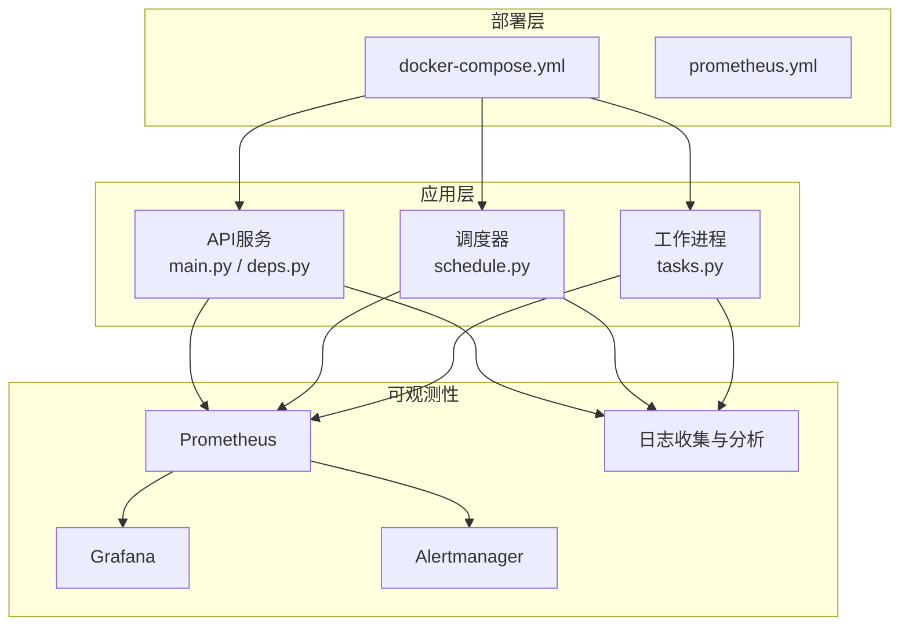
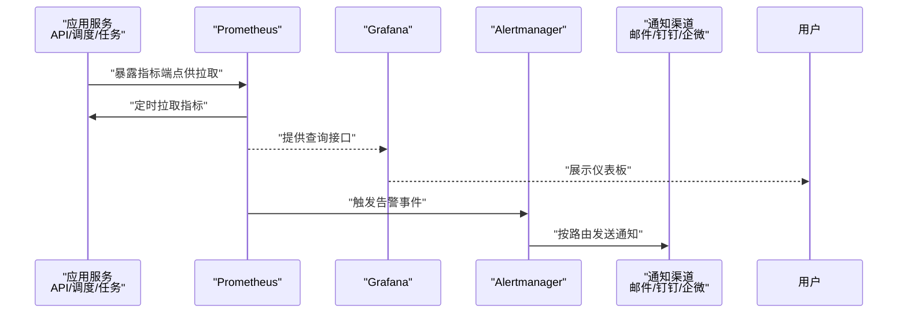
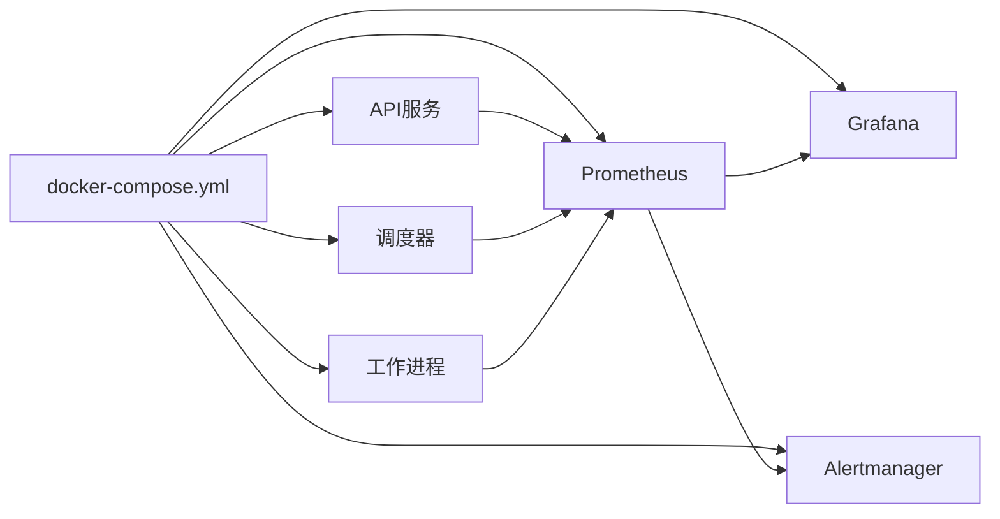

# 监控告警系统

<cite>
**本文引用的文件**   
- [docker-compose.yml](file://deploy/docker-compose.yml)
- [prometheus.yml](file://deploy/prometheus.yml)
- [main.py](file://apps/api/main.py)
- [deps.py](file://apps/api/deps.py)
- [schedule.py](file://apps/scheduler/schedule.py)
- [tasks.py](file://apps/worker/tasks.py)
- [test_observability_metrics.py](file://tests/unit/test_observability_metrics.py)
- [base.yaml](file://configs/base.yaml)
- [dev.yaml](file://configs/dev.yaml)
</cite>

## 目录
1. [简介](#简介)
2. [项目结构](#项目结构)
3. [核心组件](#核心组件)
4. [架构总览](#架构总览)
5. [详细组件分析](#详细组件分析)
6. [依赖关系分析](#依赖关系分析)
7. [性能考虑](#性能考虑)
8. [故障排查指南](#故障排查指南)
9. [结论](#结论)
10. [附录](#附录)

## 简介
本文件面向运维与研发人员，系统化阐述本仓库的监控与告警体系：包括Prometheus采集配置、数据收集策略（业务指标、系统指标、应用性能指标）、Grafana可视化方案、告警规则与通知渠道（邮件、钉钉、企业微信等）集成思路、关键性能指标(KPI)定义与阈值建议、日志收集与分析集成方案，以及监控面板使用与故障诊断流程。文档同时结合仓库中已有的可观测性测试与部署配置，给出落地实践建议。

## 项目结构
与监控告警相关的代码与配置主要分布在以下位置：
- 部署编排与采集配置：deploy/docker-compose.yml、deploy/prometheus.yml
- API服务入口与依赖注入：apps/api/main.py、apps/api/deps.py
- 调度与任务执行：apps/scheduler/schedule.py、apps/worker/tasks.py
- 可观测性相关测试：tests/unit/test_observability_metrics.py
- 环境配置：configs/base.yaml、configs/dev.yaml

图表来源
- [docker-compose.yml](file://deploy/docker-compose.yml)
- [prometheus.yml](file://deploy/prometheus.yml)
- [main.py](file://apps/api/main.py)
- [schedule.py](file://apps/scheduler/schedule.py)
- [tasks.py](file://apps/worker/tasks.py)

章节来源
- [docker-compose.yml](file://deploy/docker-compose.yml)
- [prometheus.yml](file://deploy/prometheus.yml)
- [main.py](file://apps/api/main.py)
- [deps.py](file://apps/api/deps.py)
- [schedule.py](file://apps/scheduler/schedule.py)
- [tasks.py](file://apps/worker/tasks.py)
- [test_observability_metrics.py](file://tests/unit/test_observability_metrics.py)
- [base.yaml](file://configs/base.yaml)
- [dev.yaml](file://configs/dev.yaml)

## 核心组件
- Prometheus 采集器：负责拉取各服务的指标端点，统一存储时序数据。
- Grafana 可视化：连接Prometheus，提供仪表板与查询界面。
- Alertmanager 告警路由：接收Prometheus告警，按策略分发到邮件、钉钉、企业微信等渠道。
- 应用侧埋点：在API、调度、任务执行路径暴露标准指标（HTTP、任务耗时、错误率等）。
- 日志系统：结构化日志输出，配合集中式日志平台进行检索与关联分析。

章节来源
- [docker-compose.yml](file://deploy/docker-compose.yml)
- [prometheus.yml](file://deploy/prometheus.yml)
- [test_observability_metrics.py](file://tests/unit/test_observability_metrics.py)

## 架构总览
下图展示从应用侧暴露指标到Prometheus采集、Grafana展示、Alertmanager告警分发的整体链路。

图表来源
- [docker-compose.yml](file://deploy/docker-compose.yml)
- [prometheus.yml](file://deploy/prometheus.yml)
- [main.py](file://apps/api/main.py)
- [schedule.py](file://apps/scheduler/schedule.py)
- [tasks.py](file://apps/worker/tasks.py)

## 详细组件分析

### Prometheus 采集配置与数据收集策略
- 目标发现与拉取间隔：通过部署配置声明Prometheus实例及其抓取目标；建议为API、调度、任务进程分别暴露独立端点，合理设置拉取间隔以平衡实时性与开销。
- 指标分类与命名规范：
  - 系统指标：CPU、内存、磁盘、网络等（由Exporter或容器运行时暴露）。
  - 应用性能指标：HTTP请求计数、延迟分布、错误率、并发数、队列长度、任务完成量等。
  - 业务指标：订单量、成交金额、策略信号数量、回测进度、数据入库条数等。
- 标签设计：为指标添加稳定且高基数的标签（如服务名、版本、实例ID），避免高基数导致存储膨胀。
- 保留策略与降采样：根据数据价值与成本设定长期保留期，对低频指标采用降采样或归档。

章节来源
- [prometheus.yml](file://deploy/prometheus.yml)
- [docker-compose.yml](file://deploy/docker-compose.yml)

### 应用侧指标埋点与导出
- API服务：
  - 建议在中间件层自动记录HTTP请求计数、响应时延、状态码分布、异常计数。
  - 在关键路由处增加业务计数器（如特定接口调用次数）。
- 调度与任务：
  - 记录任务启动/结束时间、成功/失败计数、重试次数、执行时长分布。
  - 对长周期任务暴露进度指标，便于观察与告警。
- 指标类型选择：
  - Counter用于累计计数（如请求总数、错误数）。
  - Gauge用于瞬时值（如当前活跃连接、队列长度）。
  - Histogram/Summary用于延迟与时序分布统计。
- 测试验证：
  - 通过单元测试覆盖指标导出逻辑，确保指标存在、格式正确、无泄漏。

章节来源
- [main.py](file://apps/api/main.py)
- [deps.py](file://apps/api/deps.py)
- [schedule.py](file://apps/scheduler/schedule.py)
- [tasks.py](file://apps/worker/tasks.py)
- [test_observability_metrics.py](file://tests/unit/test_observability_metrics.py)

### Grafana 仪表板与可视化方案
- 数据源：将Grafana连接到Prometheus，使用PromQL进行查询。
- 推荐仪表板：
  - 系统概览：CPU、内存、磁盘、网络。
  - API健康：QPS、P95/P99延迟、错误率、连接池。
  - 任务运行：任务吞吐、成功率、平均耗时、失败TopN。
  - 业务看板：核心业务指标趋势、同比环比、异常波动。
- 交互与联动：
  - 使用变量过滤（如服务、环境、实例）。
  - 跨面板跳转与下钻，定位问题根因。

[本节为通用实践说明，不直接分析具体文件]

### 告警规则与通知渠道
- 告警规则：
  - 基于PromQL定义规则，覆盖可用性（如服务不可用）、性能（延迟超阈）、容量（磁盘/内存接近上限）、业务异常（错误率突增、任务失败堆积）。
  - 设置合理的评估间隔与持续条件，避免抖动误报。
- 告警路由：
  - 在Alertmanager中按严重级别、服务域、团队维度进行路由。
  - 支持静默与抑制，减少告警风暴。
- 通知渠道：
  - 邮件：用于正式工单与审计留痕。
  - 即时通讯：钉钉、企业微信机器人，用于快速触达与协作。
  - 电话/短信：针对P0级紧急告警。
- 告警生命周期管理：
  - 分级（P0-P3）、升级策略、值班表、复盘闭环。

章节来源
- [docker-compose.yml](file://deploy/docker-compose.yml)
- [prometheus.yml](file://deploy/prometheus.yml)

### 关键性能指标(KPI)定义与阈值建议
- 可用性：
  - 服务可用率≥99.9%，连续失败超过阈值立即告警。
- 性能：
  - P95/P99延迟阈值按SLA设定，超出则预警。
  - 错误率（5xx占比）低于阈值，突增即告警。
- 资源：
  - CPU使用率、内存占用、磁盘空间、网络带宽达到阈值前预警。
- 业务：
  - 核心交易/数据处理链路吞吐下降、积压增长、失败率上升。
- 阈值策略：
  - 动态阈值（基于历史基线）+ 静态阈值（硬性红线）组合。
  - 不同环境（开发/预发/生产）差异化阈值。

[本节为通用实践说明，不直接分析具体文件]

### 日志收集与分析集成
- 日志规范：
  - 结构化JSON输出，包含trace_id、service、level、msg、key-value字段。
  - 统一时间戳与时区，避免漂移。
- 采集与存储：
  - 容器stdout/stderr统一收集，转发至集中式日志平台（如ELK/Loki）。
  - 与指标关联：通过trace_id或request_id实现指标与日志联动。
- 分析与告警：
  - 关键字/模式匹配告警（如异常堆栈、拒绝访问）。
  - 日志聚合统计（错误TopN、慢请求明细）。

[本节为通用实践说明，不直接分析具体文件]

### 监控面板使用指南与故障诊断流程
- 面板使用：
  - 选择环境与实例，查看核心KPI趋势。
  - 利用下钻能力进入具体服务/任务详情。
- 诊断流程：
  - 确认影响范围（是否全局/局部）。
  - 检查系统资源与依赖（DB、缓存、外部API）。
  - 查看错误率与延迟变化，定位最近变更。
  - 关联日志与Trace，复现并修复问题。
  - 复盘与优化：补充指标、完善告警、更新预案。

[本节为通用实践说明，不直接分析具体文件]

## 依赖关系分析
- 部署编排与组件：
  - docker-compose.yml负责拉起API、调度、任务、Prometheus、Grafana、Alertmanager等服务。
  - prometheus.yml定义抓取目标与基础采集参数。
- 应用与可观测性：
  - API、调度、任务进程需暴露指标端点，供Prometheus拉取。
  - 单元测试验证指标导出逻辑的正确性与稳定性。

图表来源
- [docker-compose.yml](file://deploy/docker-compose.yml)
- [prometheus.yml](file://deploy/prometheus.yml)
- [main.py](file://apps/api/main.py)
- [schedule.py](file://apps/scheduler/schedule.py)
- [tasks.py](file://apps/worker/tasks.py)

章节来源
- [docker-compose.yml](file://deploy/docker-compose.yml)
- [prometheus.yml](file://deploy/prometheus.yml)
- [test_observability_metrics.py](file://tests/unit/test_observability_metrics.py)

## 性能考虑
- 指标粒度与基数控制：避免高基数标签导致存储与查询压力过大。
- 拉取频率调优：根据业务敏感度调整scrape_interval，降低不必要开销。
- 直方图桶配置：合理设置Histogram桶边界，兼顾精度与体积。
- 数据保留与归档：冷热分层，历史数据归档降低成本。
- 批量与异步：任务处理尽量批量化与异步化，减少阻塞与抖动。

[本节为通用实践说明，不直接分析具体文件]

## 故障排查指南
- 常见问题定位：
  - 指标缺失：检查服务是否暴露端点、Prometheus抓取是否成功、防火墙与端口映射。
  - 告警风暴：检查规则评估间隔、持续条件、抑制与静默策略。
  - 延迟升高：关注GC、锁竞争、外部依赖超时、资源瓶颈。
  - 任务失败：查看任务日志、重试策略、幂等性与补偿机制。
- 排障步骤：
  - 从Grafana定位异常时间点与受影响范围。
  - 在PromQL中回放查询，对比前后差异。
  - 关联日志与Trace，定位根因。
  - 临时止血（降级/熔断/扩容），再深入修复。
- 回归与验证：
  - 发布后观察KPI与告警，确认恢复。
  - 更新面板与规则，沉淀经验。

[本节为通用实践说明，不直接分析具体文件]

## 结论
通过统一的指标采集、可视化与告警体系，结合结构化日志与标准化诊断流程，可有效提升系统的可观测性与稳定性。建议持续完善指标覆盖、优化告警质量、强化演练与复盘，形成“监测—告警—处置—改进”的闭环。

[本节为总结性内容，不直接分析具体文件]

## 附录
- 配置与环境：
  - base.yaml与dev.yaml可用于区分不同环境的监控参数（如拉取间隔、保留策略、通知渠道开关）。
- 参考测试：
  - 可观测性单元测试可作为指标埋点的验收依据，确保指标导出稳定可靠。

章节来源
- [base.yaml](file://configs/base.yaml)
- [dev.yaml](file://configs/dev.yaml)
- [test_observability_metrics.py](file://tests/unit/test_observability_metrics.py)