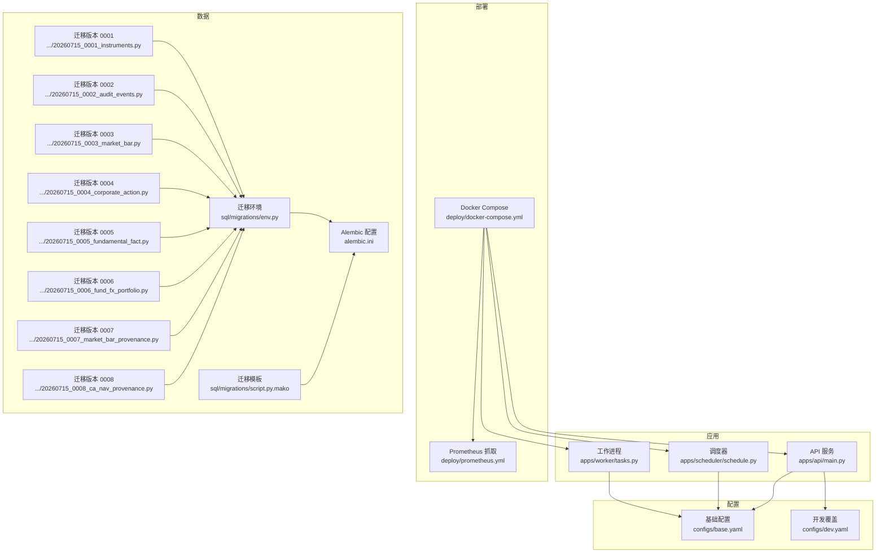
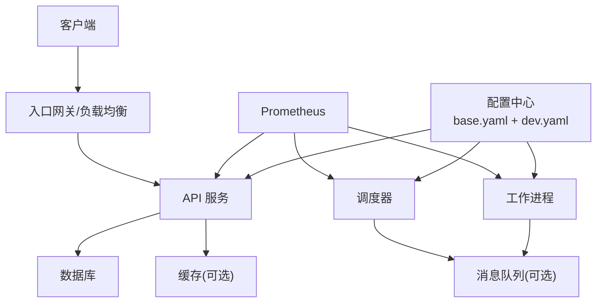
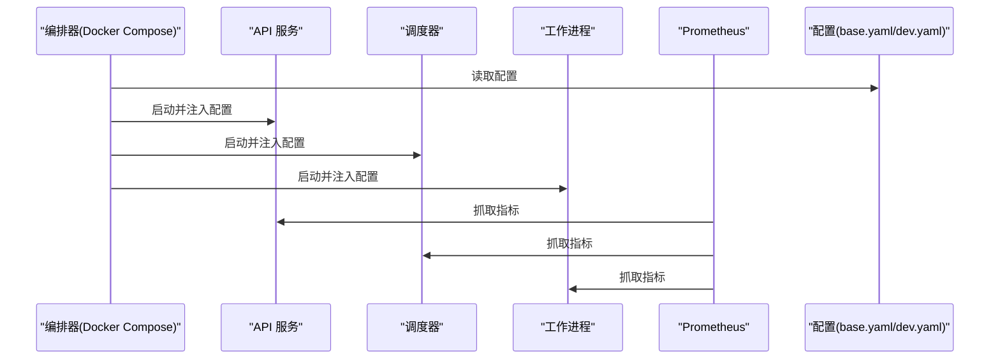
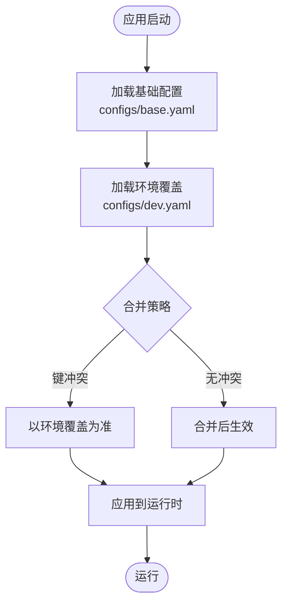
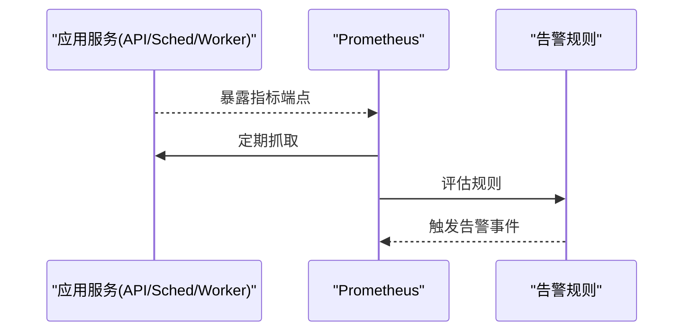
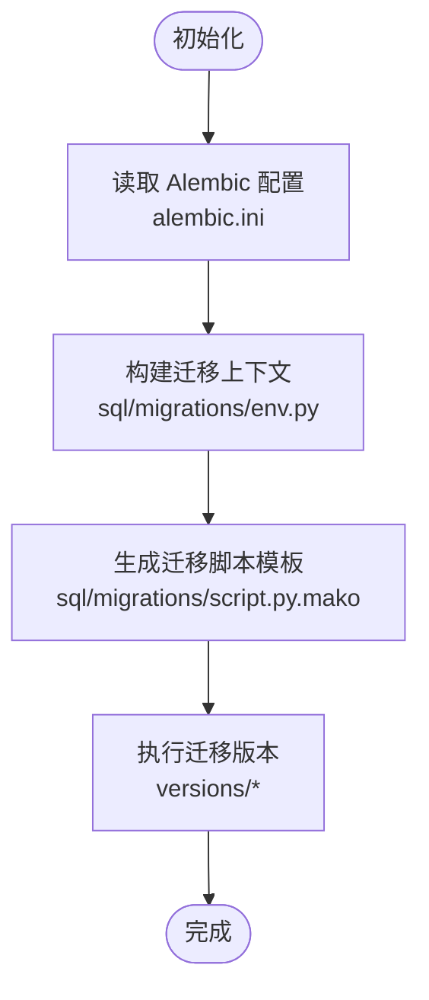
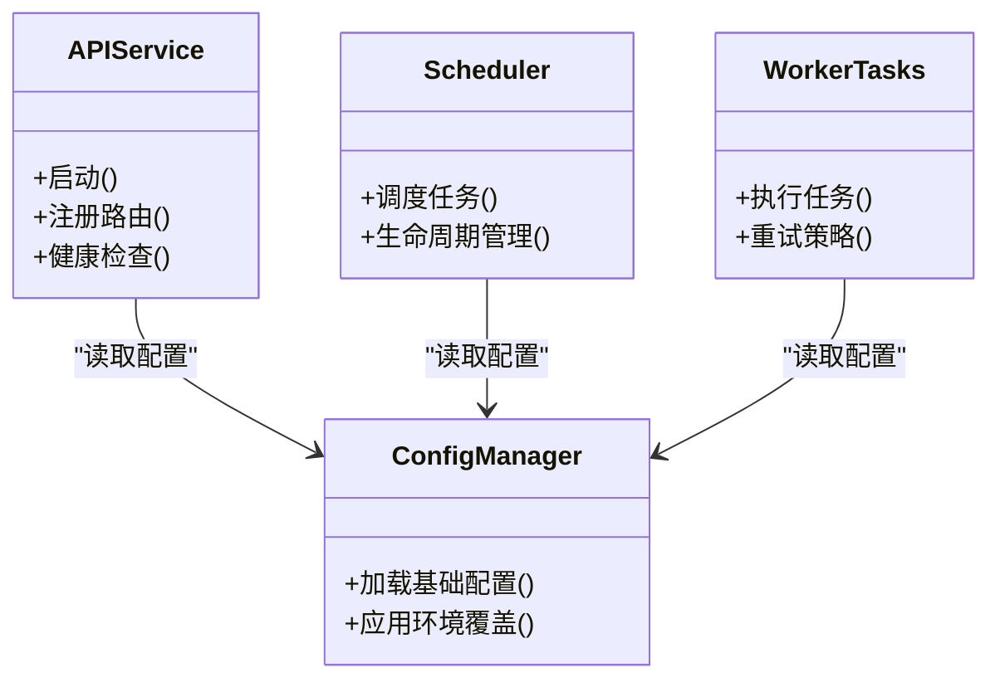
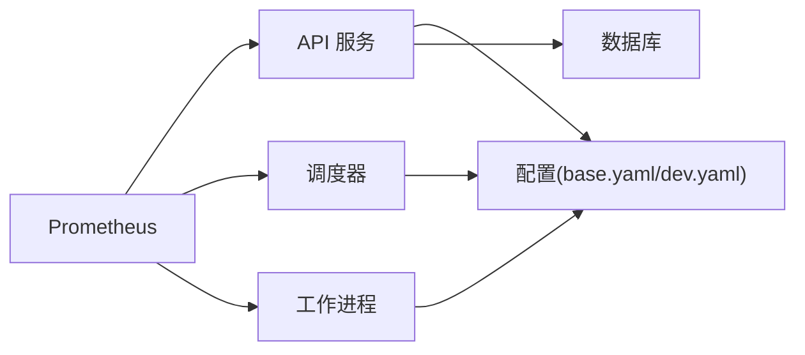

# 部署指南

<cite>
**本文引用的文件**   
- [docker-compose.yml](file://deploy/docker-compose.yml)
- [prometheus.yml](file://deploy/prometheus.yml)
- [base.yaml](file://configs/base.yaml)
- [dev.yaml](file://configs/dev.yaml)
- [alembic.ini](file://alembic.ini)
- [env.py](file://sql/migrations/env.py)
- [script.py.mako](file://sql/migrations/script.py.mako)
- [20260715_0001_instruments.py](file://sql/migrations/versions/20260715_0001_instruments.py)
- [20260715_0002_audit_events.py](file://sql/migrations/versions/20260715_0002_audit_events.py)
- [20260715_0003_market_bar.py](file://sql/migrations/versions/20260715_0003_market_bar.py)
- [20260715_0004_corporate_action.py](file://sql/migrations/versions/20260715_0004_corporate_action.py)
- [20260715_0005_fundamental_fact.py](file://sql/migrations/versions/20260715_0005_fundamental_fact.py)
- [20260715_0006_fund_fx_portfolio.py](file://sql/migrations/versions/20260715_0006_fund_fx_portfolio.py)
- [20260715_0007_market_bar_provenance.py](file://sql/migrations/versions/20260715_0007_market_bar_provenance.py)
- [20260715_0008_ca_nav_provenance.py](file://sql/migrations/versions/20260715_0008_ca_nav_provenance.py)
- [main.py](file://apps/api/main.py)
- [deps.py](file://apps/api/deps.py)
- [schedule.py](file://apps/scheduler/schedule.py)
- [tasks.py](file://apps/worker/tasks.py)
- [pyproject.toml](file://pyproject.toml)
</cite>

## 目录
1. [简介](#简介)
2. [项目结构](#项目结构)
3. [核心组件](#核心组件)
4. [架构总览](#架构总览)
5. [详细组件分析](#详细组件分析)
6. [依赖关系分析](#依赖关系分析)
7. [性能考虑](#性能考虑)
8. [故障排查指南](#故障排查指南)
9. [结论](#结论)
10. [附录](#附录)

## 简介
本指南面向运维与平台工程团队，提供从容器化编排、多环境配置管理、监控告警、数据库迁移与备份恢复、负载均衡与高可用、日志采集与分析、CI/CD流水线与安全加固的完整部署与运维手册。文档严格基于仓库现有文件进行说明，并在需要处给出可视化图示以帮助理解系统结构与数据流。

## 项目结构
仓库采用应用分层与可观测性分离的组织方式：
- 应用服务：API 服务、调度器、工作进程等
- 配置中心：基础配置与环境覆盖
- 部署编排：Docker Compose 与 Prometheus 抓取配置
- 数据层：Alembic 迁移脚本与元数据
- 可观测性：Prometheus 抓取配置（后续章节详述）

**图表来源** 
- [docker-compose.yml](file://deploy/docker-compose.yml)
- [prometheus.yml](file://deploy/prometheus.yml)
- [base.yaml](file://configs/base.yaml)
- [dev.yaml](file://configs/dev.yaml)
- [alembic.ini](file://alembic.ini)
- [env.py](file://sql/migrations/env.py)
- [script.py.mako](file://sql/migrations/script.py.mako)
- [20260715_0001_instruments.py](file://sql/migrations/versions/20260715_0001_instruments.py)
- [20260715_0002_audit_events.py](file://sql/migrations/versions/20260715_0002_audit_events.py)
- [20260715_0003_market_bar.py](file://sql/migrations/versions/20260715_0003_market_bar.py)
- [20260715_0004_corporate_action.py](file://sql/migrations/versions/20260715_0004_corporate_action.py)
- [20260715_0005_fundamental_fact.py](file://sql/migrations/versions/20260715_0005_fundamental_fact.py)
- [20260715_0006_fund_fx_portfolio.py](file://sql/migrations/versions/20260715_0006_fund_fx_portfolio.py)
- [20260715_0007_market_bar_provenance.py](file://sql/migrations/versions/20260715_0007_market_bar_provenance.py)
- [20260715_0008_ca_nav_provenance.py](file://sql/migrations/versions/20260715_0008_ca_nav_provenance.py)

**章节来源**
- [docker-compose.yml](file://deploy/docker-compose.yml)
- [prometheus.yml](file://deploy/prometheus.yml)
- [base.yaml](file://configs/base.yaml)
- [dev.yaml](file://configs/dev.yaml)
- [alembic.ini](file://alembic.ini)
- [env.py](file://sql/migrations/env.py)
- [script.py.mako](file://sql/migrations/script.py.mako)
- [20260715_0001_instruments.py](file://sql/migrations/versions/20260715_0001_instruments.py)
- [20260715_0002_audit_events.py](file://sql/migrations/versions/20260715_0002_audit_events.py)
- [20260715_0003_market_bar.py](file://sql/migrations/versions/20260715_0003_market_bar.py)
- [20260715_0004_corporate_action.py](file://sql/migrations/versions/20260715_0004_corporate_action.py)
- [20260715_0005_fundamental_fact.py](file://sql/migrations/versions/20260715_0005_fundamental_fact.py)
- [20260715_0006_fund_fx_portfolio.py](file://sql/migrations/versions/20260715_0006_fund_fx_portfolio.py)
- [20260715_0007_market_bar_provenance.py](file://sql/migrations/versions/20260715_0007_market_bar_provenance.py)
- [20260715_0008_ca_nav_provenance.py](file://sql/migrations/versions/20260715_0008_ca_nav_provenance.py)

## 核心组件
- API 服务：提供业务接口，依赖配置与数据库资源
- 调度器：负责定时任务编排
- 工作进程：执行异步任务
- 配置体系：基础配置与环境覆盖
- 数据迁移：Alembic 驱动的数据库版本管理
- 可观测性：Prometheus 抓取配置

**章节来源**
- [main.py](file://apps/api/main.py)
- [deps.py](file://apps/api/deps.py)
- [schedule.py](file://apps/scheduler/schedule.py)
- [tasks.py](file://apps/worker/tasks.py)
- [base.yaml](file://configs/base.yaml)
- [dev.yaml](file://configs/dev.yaml)
- [alembic.ini](file://alembic.ini)
- [env.py](file://sql/migrations/env.py)
- [script.py.mako](file://sql/migrations/script.py.mako)

## 架构总览
下图展示容器编排与关键组件交互关系，包括 API、调度器、工作进程、Prometheus 抓取以及配置加载路径。

[此图为概念性架构图，不直接映射具体源码文件]

## 详细组件分析

### 容器编排与运行模型
- 使用 Docker Compose 定义服务拓扑与启动顺序
- 各服务通过环境变量或挂载配置文件接入统一配置源
- 建议为每个服务设置健康检查与重启策略，确保自愈能力

**图表来源** 
- [docker-compose.yml](file://deploy/docker-compose.yml)
- [base.yaml](file://configs/base.yaml)
- [dev.yaml](file://configs/dev.yaml)
- [prometheus.yml](file://deploy/prometheus.yml)

**章节来源**
- [docker-compose.yml](file://deploy/docker-compose.yml)

### 多环境配置管理策略
- 基础配置位于 base.yaml，包含通用参数
- 环境覆盖文件 dev.yaml 用于覆盖开发环境差异
- 建议在编排层按环境选择不同覆盖文件，避免硬编码

**图表来源** 
- [base.yaml](file://configs/base.yaml)
- [dev.yaml](file://configs/dev.yaml)

**章节来源**
- [base.yaml](file://configs/base.yaml)
- [dev.yaml](file://configs/dev.yaml)

### 监控与告警（Prometheus）
- 使用 deploy/prometheus.yml 定义抓取目标与间隔
- 建议为 API、调度器、工作进程分别暴露指标端点
- 在 CI/CD 中集成规则校验，确保告警规则语法正确

**图表来源** 
- [prometheus.yml](file://deploy/prometheus.yml)

**章节来源**
- [prometheus.yml](file://deploy/prometheus.yml)

### 数据库初始化与迁移（Alembic）
- 使用 alembic.ini 作为迁移工具配置入口
- env.py 与 script.py.mako 控制迁移生成与执行上下文
- versions 目录下包含多个迁移版本，按时间戳命名便于排序与回滚

**图表来源** 
- [alembic.ini](file://alembic.ini)
- [env.py](file://sql/migrations/env.py)
- [script.py.mako](file://sql/migrations/script.py.mako)
- [20260715_0001_instruments.py](file://sql/migrations/versions/20260715_0001_instruments.py)
- [20260715_0002_audit_events.py](file://sql/migrations/versions/20260715_0002_audit_events.py)
- [20260715_0003_market_bar.py](file://sql/migrations/versions/20260715_0003_market_bar.py)
- [20260715_0004_corporate_action.py](file://sql/migrations/versions/20260715_0004_corporate_action.py)
- [20260715_0005_fundamental_fact.py](file://sql/migrations/versions/20260715_0005_fundamental_fact.py)
- [20260715_0006_fund_fx_portfolio.py](file://sql/migrations/versions/20260715_0006_fund_fx_portfolio.py)
- [20260715_0007_market_bar_provenance.py](file://sql/migrations/versions/20260715_0007_market_bar_provenance.py)
- [20260715_0008_ca_nav_provenance.py](file://sql/migrations/versions/20260715_0008_ca_nav_provenance.py)

**章节来源**
- [alembic.ini](file://alembic.ini)
- [env.py](file://sql/migrations/env.py)
- [script.py.mako](file://sql/migrations/script.py.mako)
- [20260715_0001_instruments.py](file://sql/migrations/versions/20260715_0001_instruments.py)
- [20260715_0002_audit_events.py](file://sql/migrations/versions/20260715_0002_audit_events.py)
- [20260715_0003_market_bar.py](file://sql/migrations/versions/20260715_0003_market_bar.py)
- [20260715_0004_corporate_action.py](file://sql/migrations/versions/20260715_0004_corporate_action.py)
- [20260715_0005_fundamental_fact.py](file://sql/migrations/versions/20260715_0005_fundamental_fact.py)
- [20260715_0006_fund_fx_portfolio.py](file://sql/migrations/versions/20260715_0006_fund_fx_portfolio.py)
- [20260715_0007_market_bar_provenance.py](file://sql/migrations/versions/20260715_0007_market_bar_provenance.py)
- [20260715_0008_ca_nav_provenance.py](file://sql/migrations/versions/20260715_0008_ca_nav_provenance.py)

### 应用服务与依赖注入
- API 服务入口与依赖解析由 main.py 与 deps.py 组织
- 调度器与任务逻辑分别在 schedule.py 与 tasks.py 中实现
- 建议将外部依赖（数据库、缓存、消息队列）通过依赖注入统一管理，便于测试与替换

**图表来源** 
- [main.py](file://apps/api/main.py)
- [deps.py](file://apps/api/deps.py)
- [schedule.py](file://apps/scheduler/schedule.py)
- [tasks.py](file://apps/worker/tasks.py)
- [base.yaml](file://configs/base.yaml)
- [dev.yaml](file://configs/dev.yaml)

**章节来源**
- [main.py](file://apps/api/main.py)
- [deps.py](file://apps/api/deps.py)
- [schedule.py](file://apps/scheduler/schedule.py)
- [tasks.py](file://apps/worker/tasks.py)

## 依赖关系分析
- 应用服务依赖配置与数据库资源
- 调度器与工作进程可能依赖消息队列与外部数据源
- Prometheus 抓取配置独立于应用，但需确保指标端点可达

**图表来源** 
- [base.yaml](file://configs/base.yaml)
- [dev.yaml](file://configs/dev.yaml)
- [prometheus.yml](file://deploy/prometheus.yml)

**章节来源**
- [base.yaml](file://configs/base.yaml)
- [dev.yaml](file://configs/dev.yaml)
- [prometheus.yml](file://deploy/prometheus.yml)

## 性能考虑
- 合理设置容器资源限制与请求超时，避免级联失败
- 对数据库连接池、缓存命中率、队列吞吐进行持续监控
- 针对热点查询与批量任务进行索引优化与分片处理
- 在 Prometheus 中增加关键业务指标与延迟分布统计

[本节为通用指导，无需特定文件引用]

## 故障排查指南
- 确认容器状态与服务健康检查是否通过
- 检查配置加载顺序与环境覆盖是否正确生效
- 验证 Prometheus 抓取目标可达性与指标格式
- 审查数据库迁移历史与错误日志，定位失败版本
- 使用结构化日志与链路追踪辅助问题定位

**章节来源**
- [docker-compose.yml](file://deploy/docker-compose.yml)
- [prometheus.yml](file://deploy/prometheus.yml)
- [alembic.ini](file://alembic.ini)
- [env.py](file://sql/migrations/env.py)

## 结论
本指南围绕容器编排、配置管理、监控告警、数据库迁移与排障提供了系统化方法。结合仓库现有文件，可在不引入额外复杂性的前提下实现稳定、可观测、可演进的部署与运维体系。

## 附录

### 安全加固与权限管理
- 最小权限原则：为容器与服务账户分配必要权限
- 敏感信息：通过密钥管理服务注入，避免明文存储
- 网络隔离：仅开放必要端口，启用 TLS 加密传输
- 合规性：审计日志留存与访问控制策略符合企业规范

[本节为通用指导，无需特定文件引用]

### CI/CD 流水线与自动化部署
- 在流水线中执行静态检查、单元测试与集成测试
- 构建镜像并推送至镜像仓库，记录镜像标签与提交哈希
- 使用编排文件进行灰度发布与回滚
- 在部署前后执行迁移与冒烟测试，确保一致性

[本节为通用指导，无需特定文件引用]

### 备份恢复与灾难恢复
- 制定数据库定期备份策略与保留周期
- 演练恢复流程，确保 RTO/RPO 满足业务要求
- 跨可用区复制关键数据，提升容灾能力

[本节为通用指导，无需特定文件引用]

### 日志收集与分析
- 统一日志格式与级别，集中采集到日志平台
- 建立关键错误与异常模式告警
- 定期复盘日志，优化可观测性指标

[本节为通用指导，无需特定文件引用]