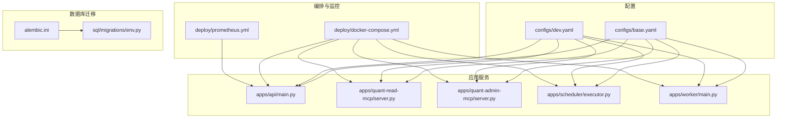
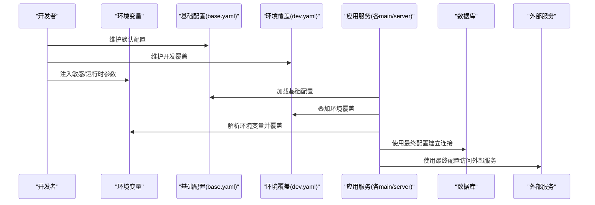
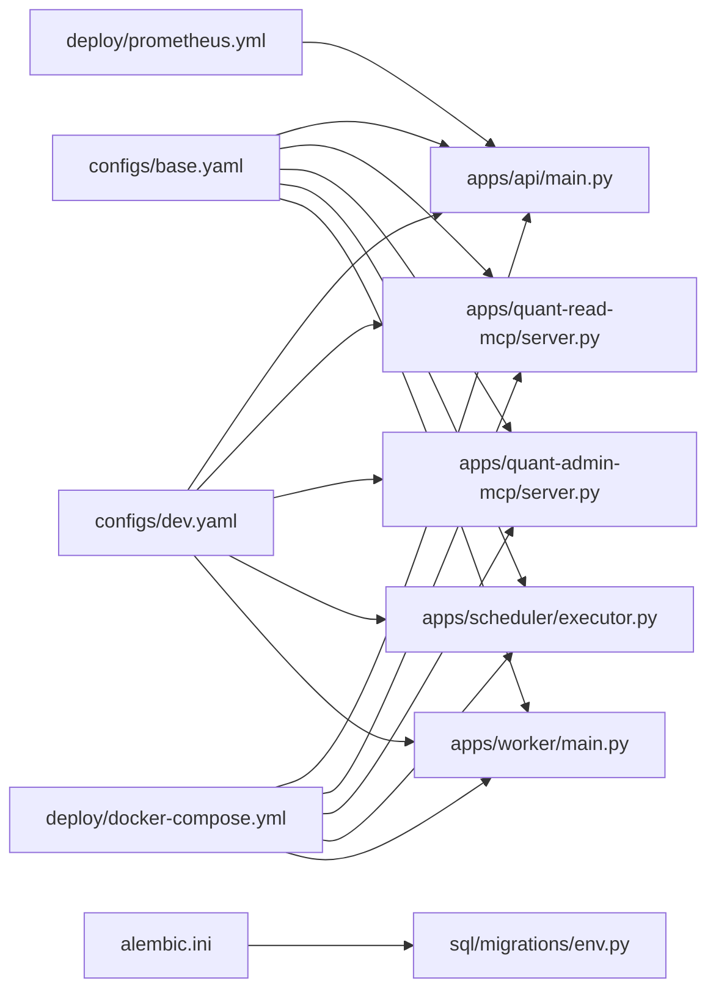

# 配置管理

<cite>
**本文引用的文件**   
- [configs/base.yaml](file://configs/base.yaml)
- [configs/dev.yaml](file://configs/dev.yaml)
- [deploy/docker-compose.yml](file://deploy/docker-compose.yml)
- [deploy/prometheus.yml](file://deploy/prometheus.yml)
- [apps/api/main.py](file://apps/api/main.py)
- [apps/quant-read-mcp/server.py](file://apps/quant-read-mcp/server.py)
- [apps/quant-admin-mcp/server.py](file://apps/quant-admin-mcp/server.py)
- [apps/scheduler/executor.py](file://apps/scheduler/executor.py)
- [apps/worker/main.py](file://apps/worker/main.py)
- [pyproject.toml](file://pyproject.toml)
- [alembic.ini](file://alembic.ini)
- [sql/migrations/env.py](file://sql/migrations/env.py)
</cite>

## 目录
1. [简介](#简介)
2. [项目结构](#项目结构)
3. [核心组件](#核心组件)
4. [架构总览](#架构总览)
5. [详细组件分析](#详细组件分析)
6. [依赖关系分析](#依赖关系分析)
7. [性能考虑](#性能考虑)
8. [故障排查指南](#故障排查指南)
9. [结论](#结论)
10. [附录](#附录)

## 简介
本文件面向量化交易MCP系统的配置管理，聚焦以下目标：
- 环境变量与配置文件（YAML）的组织方式与加载顺序
- 基础配置模板与环境覆盖机制（开发、生产等）
- Docker容器编排与服务发现相关配置
- 数据库连接与迁移配置
- 配置热重载与安全敏感信息处理
- 常见问题定位与调试技巧

## 项目结构
配置相关文件主要分布在如下位置：
- configs：应用级YAML配置（基础模板与环境覆盖）
- deploy：Docker Compose编排与监控采集配置
- alembic.ini、sql/migrations/env.py：数据库迁移配置
- pyproject.toml：项目元数据与可选的脚本入口
- apps/*：各服务启动与依赖注入点，通常在此处读取配置并初始化子系统

图示来源
- [configs/base.yaml](file://configs/base.yaml)
- [configs/dev.yaml](file://configs/dev.yaml)
- [deploy/docker-compose.yml](file://deploy/docker-compose.yml)
- [deploy/prometheus.yml](file://deploy/prometheus.yml)
- [apps/api/main.py](file://apps/api/main.py)
- [apps/quant-read-mcp/server.py](file://apps/quant-read-mcp/server.py)
- [apps/quant-admin-mcp/server.py](file://apps/quant-admin-mcp/server.py)
- [apps/scheduler/executor.py](file://apps/scheduler/executor.py)
- [apps/worker/main.py](file://apps/worker/main.py)
- [alembic.ini](file://alembic.ini)
- [sql/migrations/env.py](file://sql/migrations/env.py)

章节来源
- [configs/base.yaml](file://configs/base.yaml)
- [configs/dev.yaml](file://configs/dev.yaml)
- [deploy/docker-compose.yml](file://deploy/docker-compose.yml)
- [deploy/prometheus.yml](file://deploy/prometheus.yml)
- [apps/api/main.py](file://apps/api/main.py)
- [apps/quant-read-mcp/server.py](file://apps/quant-read-mcp/server.py)
- [apps/quant-admin-mcp/server.py](file://apps/quant-admin-mcp/server.py)
- [apps/scheduler/executor.py](file://apps/scheduler/executor.py)
- [apps/worker/main.py](file://apps/worker/main.py)
- [alembic.ini](file://alembic.ini)
- [sql/migrations/env.py](file://sql/migrations/env.py)

## 核心组件
- 基础配置模板（base.yaml）
  - 提供默认值与公共配置项，作为所有环境的基线。
  - 典型包含：日志级别、时区、通用开关、外部服务地址占位符等。
- 环境覆盖（dev.yaml）
  - 针对开发环境覆盖基础配置中的关键项，如调试开关、本地数据库连接、端口等。
- 环境变量
  - 通过环境变量注入敏感或运行时差异化的配置（例如数据库URL、密钥、外部API凭据）。
  - 建议以“环境变量优先”的方式合并到最终配置对象中。
- 容器编排（docker-compose.yml）
  - 为每个服务定义镜像、端口映射、环境变量、网络与依赖关系。
  - 将敏感信息从代码库剥离，交由编排系统注入。
- 数据库迁移（alembic.ini + env.py）
  - 指定迁移脚本路径、版本化策略与运行时的数据库连接来源。
  - 支持在CI/CD或部署阶段执行迁移。

章节来源
- [configs/base.yaml](file://configs/base.yaml)
- [configs/dev.yaml](file://configs/dev.yaml)
- [deploy/docker-compose.yml](file://deploy/docker-compose.yml)
- [alembic.ini](file://alembic.ini)
- [sql/migrations/env.py](file://sql/migrations/env.py)

## 架构总览
下图展示了配置在不同层级的装配过程：基础配置与环境覆盖合并后，由应用服务在启动时读取；敏感信息通过环境变量注入；编排层负责对外暴露端口与内部通信。

图示来源
- [configs/base.yaml](file://configs/base.yaml)
- [configs/dev.yaml](file://configs/dev.yaml)
- [apps/api/main.py](file://apps/api/main.py)
- [apps/quant-read-mcp/server.py](file://apps/quant-read-mcp/server.py)
- [apps/quant-admin-mcp/server.py](file://apps/quant-admin-mcp/server.py)
- [apps/scheduler/executor.py](file://apps/scheduler/executor.py)
- [apps/worker/main.py](file://apps/worker/main.py)

## 详细组件分析

### 基础配置模板与环境覆盖
- 设计原则
  - 单一事实源：base.yaml定义所有可用键及其默认值。
  - 最小覆盖：dev.yaml仅覆盖开发差异项，避免重复。
  - 分层合并：基础 -> 环境覆盖 -> 环境变量，后者优先级最高。
- 建议键域
  - 通用：日志、时区、特性开关、重试与超时。
  - 数据库：驱动、主机、端口、库名、池大小、SSL选项。
  - 外部服务：行情/因子/模型注册表等地址与认证。
  - 可观测性：指标导出端点、追踪采样率。
- 示例说明（不展示具体值）
  - 参考路径：[configs/base.yaml](file://configs/base.yaml)、[configs/dev.yaml](file://configs/dev.yaml)

章节来源
- [configs/base.yaml](file://configs/base.yaml)
- [configs/dev.yaml](file://configs/dev.yaml)

### 环境变量与多环境管理
- 命名规范
  - 采用大写+下划线，按模块前缀区分，如 APP_DB_URL、APP_LOG_LEVEL。
- 加载顺序
  - 先加载YAML，再按环境变量覆盖同名键。
- 多环境策略
  - 开发：启用调试、宽松校验、本地资源。
  - 测试：隔离数据源、禁用外部调用。
  - 预发/生产：严格校验、开启限流与审计、关闭调试。
- 安全敏感信息
  - 一律通过环境变量注入，禁止写入仓库。
  - 在容器编排层集中管理，结合密钥管理服务。

章节来源
- [deploy/docker-compose.yml](file://deploy/docker-compose.yml)

### Docker容器编排与服务发现
- 编排要点
  - 每个服务独立镜像与进程，通过compose定义网络与端口。
  - 使用环境变量注入差异化配置与敏感信息。
  - 健康检查与重启策略保障可用性。
- 服务发现
  - 同Compose网络内通过服务名进行DNS解析。
  - 跨集群场景可引入Consul/K8s Service等方案。
- 监控集成
  - Prometheus抓取各服务暴露的指标端点。

章节来源
- [deploy/docker-compose.yml](file://deploy/docker-compose.yml)
- [deploy/prometheus.yml](file://deploy/prometheus.yml)

### 数据库连接与迁移配置
- 连接配置
  - 推荐通过环境变量提供完整连接字符串，避免分散字段拼接错误。
  - 连接池大小、超时与SSL在生产环境需显式配置。
- 迁移配置
  - alembic.ini指定脚本目录与版本化策略。
  - env.py根据运行环境选择正确的数据库URL与引擎参数。
- 最佳实践
  - 迁移与业务解耦，仅在部署阶段执行。
  - 对大表变更采用分批策略与回滚预案。

章节来源
- [alembic.ini](file://alembic.ini)
- [sql/migrations/env.py](file://sql/migrations/env.py)

### 应用服务配置接入点
- API服务
  - 启动入口读取配置并初始化路由、中间件与依赖。
- MCP服务（读/管）
  - 分别暴露工具能力，读取相同的基础配置与环境覆盖。
- 调度器与工作进程
  - 基于配置决定任务并发度、队列与重试策略。

章节来源
- [apps/api/main.py](file://apps/api/main.py)
- [apps/quant-read-mcp/server.py](file://apps/quant-read-mcp/server.py)
- [apps/quant-admin-mcp/server.py](file://apps/quant-admin-mcp/server.py)
- [apps/scheduler/executor.py](file://apps/scheduler/executor.py)
- [apps/worker/main.py](file://apps/worker/main.py)

### 配置热重载
- 适用场景
  - 非敏感开关（如日志级别、功能开关）可在运行时动态生效。
- 实现建议
  - 监听文件系统变化或配置中心事件，触发局部刷新。
  - 对全局状态加锁更新，避免竞态条件。
  - 对数据库连接等不可热更的资源，采用优雅重启。
- 风险控制
  - 变更前做配置校验与灰度发布。
  - 记录变更审计与回滚策略。

章节来源
- [apps/api/main.py](file://apps/api/main.py)
- [apps/quant-read-mcp/server.py](file://apps/quant-read-mcp/server.py)
- [apps/quant-admin-mcp/server.py](file://apps/quant-admin-mcp/server.py)
- [apps/scheduler/executor.py](file://apps/scheduler/executor.py)
- [apps/worker/main.py](file://apps/worker/main.py)

### 安全敏感信息处理
- 原则
  - 零信任：不在代码与仓库中硬编码任何密钥。
  - 最小权限：按需授予最小必要权限。
- 落地
  - 使用环境变量注入，容器编排统一管理。
  - 结合密钥管理服务（如KMS/Secrets Manager）自动轮换。
  - 对日志与告警进行脱敏，避免泄露。

章节来源
- [deploy/docker-compose.yml](file://deploy/docker-compose.yml)

## 依赖关系分析
- 配置依赖
  - 应用服务依赖YAML与变量；迁移脚本依赖alembic配置。
- 运行时依赖
  - 数据库、外部服务地址与凭据均来自最终配置。
- 编排依赖
  - 服务间通过Compose网络通信，Prometheus拉取指标。

图示来源
- [configs/base.yaml](file://configs/base.yaml)
- [configs/dev.yaml](file://configs/dev.yaml)
- [deploy/docker-compose.yml](file://deploy/docker-compose.yml)
- [deploy/prometheus.yml](file://deploy/prometheus.yml)
- [apps/api/main.py](file://apps/api/main.py)
- [apps/quant-read-mcp/server.py](file://apps/quant-read-mcp/server.py)
- [apps/quant-admin-mcp/server.py](file://apps/quant-admin-mcp/server.py)
- [apps/scheduler/executor.py](file://apps/scheduler/executor.py)
- [apps/worker/main.py](file://apps/worker/main.py)
- [alembic.ini](file://alembic.ini)
- [sql/migrations/env.py](file://sql/migrations/env.py)

## 性能考虑
- 连接池与超时
  - 根据QPS与延迟目标调整连接池大小与读写超时。
- 配置加载开销
  - 启动时一次性加载并缓存，避免频繁I/O。
- 热重载成本
  - 对热点配置项增量更新，避免全量重建昂贵对象。
- 监控与度量
  - 暴露配置相关指标（如连接池利用率、重试次数），纳入统一监控。

## 故障排查指南
- 常见症状与定位
  - 启动失败：检查环境变量是否缺失、YAML语法是否正确、端口冲突。
  - 数据库无法连接：核对连接串、网络可达性与凭据。
  - 指标未上报：确认Prometheus抓取目标与端口暴露。
- 快速验证清单
  - 打印最终配置快照（脱敏）。
  - 逐项注释覆盖项，逐步缩小范围。
  - 在最小环境中复现问题。
- 日志与追踪
  - 提高日志级别至调试模式，关注配置加载与连接建立阶段。
  - 为关键操作添加追踪ID，便于链路定位。

章节来源
- [deploy/docker-compose.yml](file://deploy/docker-compose.yml)
- [deploy/prometheus.yml](file://deploy/prometheus.yml)
- [apps/api/main.py](file://apps/api/main.py)
- [apps/quant-read-mcp/server.py](file://apps/quant-read-mcp/server.py)
- [apps/quant-admin-mcp/server.py](file://apps/quant-admin-mcp/server.py)
- [apps/scheduler/executor.py](file://apps/scheduler/executor.py)
- [apps/worker/main.py](file://apps/worker/main.py)

## 结论
通过“基础模板 + 环境覆盖 + 环境变量注入”的分层配置模型，配合容器编排与迁移工具，可实现安全、可移植且易维护的配置管理。建议在团队内统一命名规范与加载顺序，完善监控与回滚策略，确保配置变更可控、可观测、可恢复。

## 附录
- 术语
  - 基础配置模板：所有环境的默认配置集合。
  - 环境覆盖：针对特定环境的差异化配置。
  - 环境变量：运行时注入的外部参数。
  - 服务发现：服务间通过名称解析相互定位。
- 参考路径
  - 配置模板与覆盖：[configs/base.yaml](file://configs/base.yaml)、[configs/dev.yaml](file://configs/dev.yaml)
  - 编排与监控：[deploy/docker-compose.yml](file://deploy/docker-compose.yml)、[deploy/prometheus.yml](file://deploy/prometheus.yml)
  - 迁移配置：[alembic.ini](file://alembic.ini)、[sql/migrations/env.py](file://sql/migrations/env.py)
  - 服务接入点：[apps/api/main.py](file://apps/api/main.py)、[apps/quant-read-mcp/server.py](file://apps/quant-read-mcp/server.py)、[apps/quant-admin-mcp/server.py](file://apps/quant-admin-mcp/server.py)、[apps/scheduler/executor.py](file://apps/scheduler/executor.py)、[apps/worker/main.py](file://apps/worker/main.py)