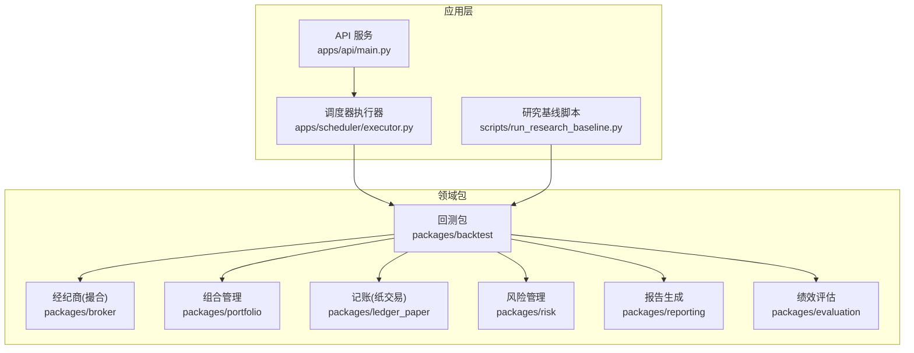
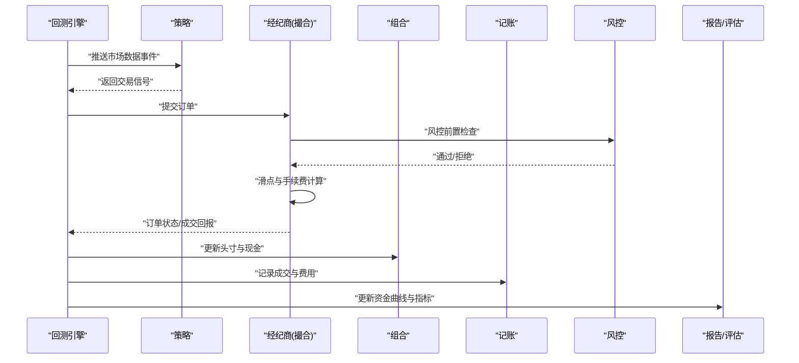
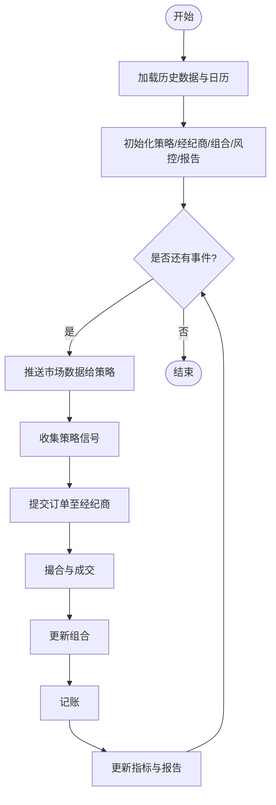
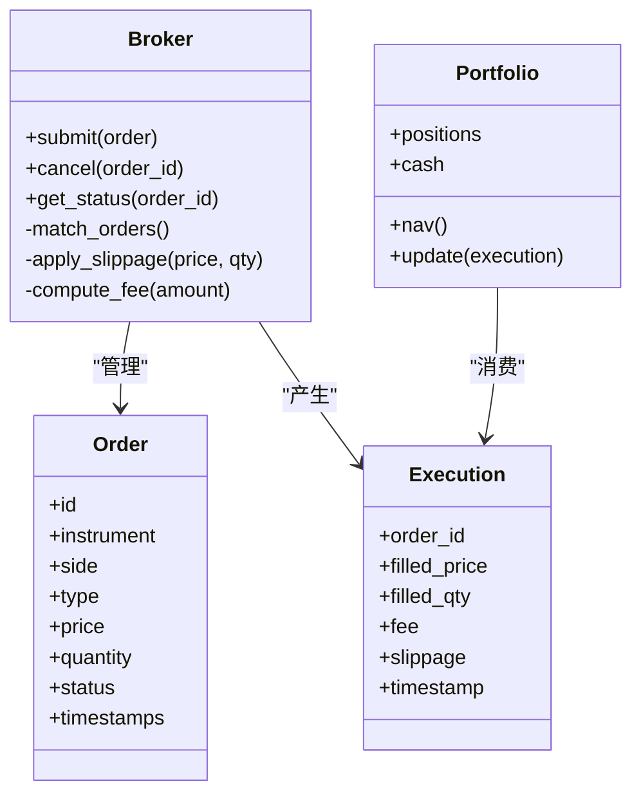
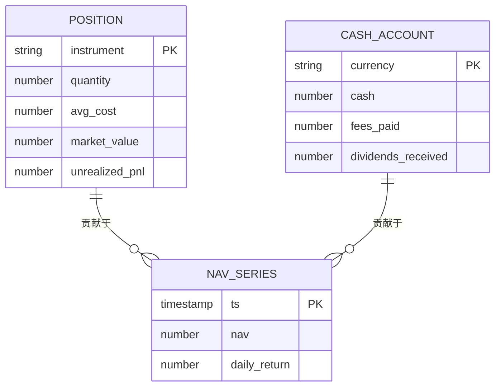
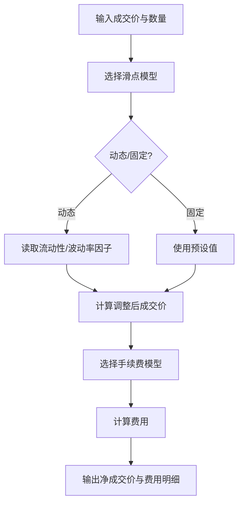
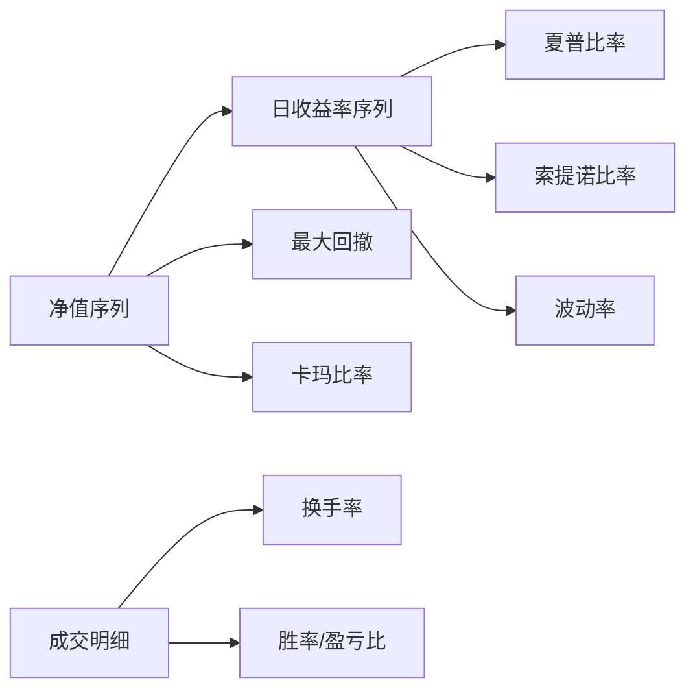
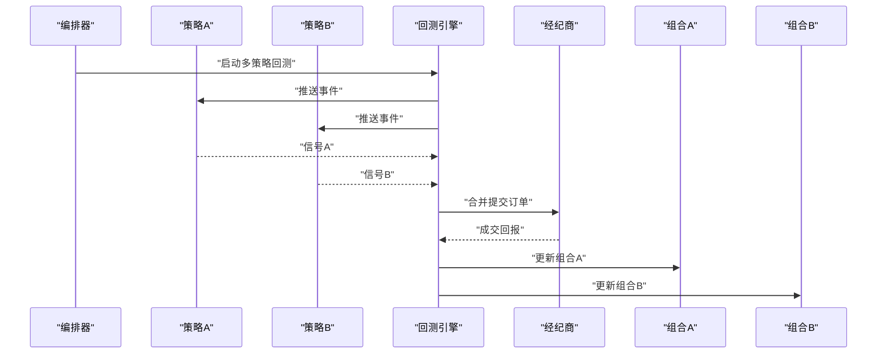
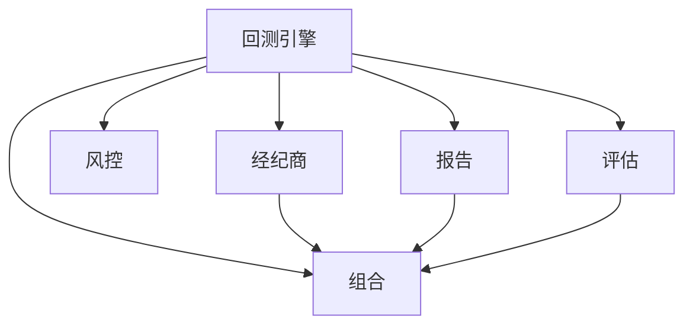

# 回测引擎

<cite>
**本文引用的文件**   
- [packages/backtest/__init__.py](file://packages/backtest/__init__.py)
- [packages/broker/__init__.py](file://packages/broker/__init__.py)
- [packages/portfolio/__init__.py](file://packages/portfolio/__init__.py)
- [packages/ledger_paper/__init__.py](file://packages/ledger_paper/__init__.py)
- [packages/risk/__init__.py](file://packages/risk/__init__.py)
- [packages/reporting/__init__.py](file://packages/reporting/__init__.py)
- [packages/evaluation/__init__.py](file://packages/evaluation/__init__.py)
- [apps/api/main.py](file://apps/api/main.py)
- [apps/scheduler/executor.py](file://apps/scheduler/executor.py)
- [scripts/run_research_baseline.py](file://scripts/run_research_baseline.py)
</cite>

## 目录
1. [简介](#简介)
2. [项目结构](#项目结构)
3. [核心组件](#核心组件)
4. [架构总览](#架构总览)
5. [详细组件分析](#详细组件分析)
6. [依赖关系分析](#依赖关系分析)
7. [性能考虑](#性能考虑)
8. [故障排查指南](#故障排查指南)
9. [结论](#结论)
10. [附录](#附录)

## 简介
本技术文档面向回测执行引擎，系统性阐述事件驱动的回测循环、订单匹配机制与持仓管理，覆盖滑点模型、手续费计算、资金曲线分析与绩效评估指标。同时说明与策略框架的集成方式、多策略并行回测支持，以及常见问题与性能优化建议。文档以仓库中实际模块为锚点，提供可追溯的源码路径与图示，帮助读者快速理解并扩展系统能力。

## 项目结构
本项目采用分层与领域模块化组织：
- 应用层：API 服务、调度器与脚本入口
- 领域包：回测、经纪商（模拟撮合）、组合、记账、风险、报告、评估等
- 工具与配置：通用工具、数据源、日历规则等

图表来源
- [apps/api/main.py](file://apps/api/main.py)
- [apps/scheduler/executor.py](file://apps/scheduler/executor.py)
- [scripts/run_research_baseline.py](file://scripts/run_research_baseline.py)
- [packages/backtest/__init__.py](file://packages/backtest/__init__.py)
- [packages/broker/__init__.py](file://packages/broker/__init__.py)
- [packages/portfolio/__init__.py](file://packages/portfolio/__init__.py)
- [packages/ledger_paper/__init__.py](file://packages/ledger_paper/__init__.py)
- [packages/risk/__init__.py](file://packages/risk/__init__.py)
- [packages/reporting/__init__.py](file://packages/reporting/__init__.py)
- [packages/evaluation/__init__.py](file://packages/evaluation/__init__.py)

章节来源
- [apps/api/main.py](file://apps/api/main.py)
- [apps/scheduler/executor.py](file://apps/scheduler/executor.py)
- [scripts/run_research_baseline.py](file://scripts/run_research_baseline.py)
- [packages/backtest/__init__.py](file://packages/backtest/__init__.py)
- [packages/broker/__init__.py](file://packages/broker/__init__.py)
- [packages/portfolio/__init__.py](file://packages/portfolio/__init__.py)
- [packages/ledger_paper/__init__.py](file://packages/ledger_paper/__init__.py)
- [packages/risk/__init__.py](file://packages/risk/__init__.py)
- [packages/reporting/__init__.py](file://packages/reporting/__init__.py)
- [packages/evaluation/__init__.py](file://packages/evaluation/__init__.py)

## 核心组件
- 回测执行引擎：负责事件驱动的时间步进、信号到订单的转换、订单路由与撮合、成交回报处理、组合更新与记录。
- 经纪商（撮合）：实现订单簿、滑点模型、手续费模型、部分成交与撤单逻辑。
- 组合管理：维护头寸、现金、费用与净值，暴露查询接口供报告与风控使用。
- 记账（纸交易）：持久化成交、费用、持仓变动，支撑审计与复现。
- 风险管理：在下单前或成交后进行风控检查与拦截，输出风险指标。
- 报告与评估：生成资金曲线、收益分布、回撤、夏普比率、最大回撤、换手率等指标。

章节来源
- [packages/backtest/__init__.py](file://packages/backtest/__init__.py)
- [packages/broker/__init__.py](file://packages/broker/__init__.py)
- [packages/portfolio/__init__.py](file://packages/portfolio/__init__.py)
- [packages/ledger_paper/__init__.py](file://packages/ledger_paper/__init__.py)
- [packages/risk/__init__.py](file://packages/risk/__init__.py)
- [packages/reporting/__init__.py](file://packages/reporting/__init__.py)
- [packages/evaluation/__init__.py](file://packages/evaluation/__init__.py)

## 架构总览
回测采用事件驱动架构，典型事件包括：Bar/Tick 到达、策略信号、订单创建、订单确认、成交回报、分红拆股等。引擎按时间推进消费事件，依次调用策略、经纪商、组合、风控与报告模块。

图表来源
- [packages/backtest/__init__.py](file://packages/backtest/__init__.py)
- [packages/broker/__init__.py](file://packages/broker/__init__.py)
- [packages/portfolio/__init__.py](file://packages/portfolio/__init__.py)
- [packages/ledger_paper/__init__.py](file://packages/ledger_paper/__init__.py)
- [packages/risk/__init__.py](file://packages/risk/__init__.py)
- [packages/reporting/__init__.py](file://packages/reporting/__init__.py)
- [packages/evaluation/__init__.py](file://packages/evaluation/__init__.py)

## 详细组件分析

### 事件驱动的回测循环
- 时间推进：基于日历与数据源对齐，逐 Bar/Tick 推进。
- 事件分发：将市场数据事件分发给策略；收集策略信号后批量提交至经纪商。
- 订单生命周期：创建→风控校验→撮合→成交→回报→组合更新→记账→报告。
- 并发与隔离：多策略并行时，每个策略拥有独立上下文与账户视图，避免共享状态污染。

[此图为概念流程示意，不直接映射具体源码文件]

### 订单匹配机制
- 订单簿：按价格优先、时间优先原则进行匹配，支持限价/市价/止损等类型。
- 滑点模型：根据流动性、波动率或固定比例对成交价进行调整，影响成交均价与冲击成本。
- 手续费模型：按成交额百分比、固定费用或阶梯费率计算，支持买卖双向与差异化费率。
- 部分成交与撤单：未完全成交的订单保留状态，支持条件撤单与过期失效。

图表来源
- [packages/broker/__init__.py](file://packages/broker/__init__.py)
- [packages/portfolio/__init__.py](file://packages/portfolio/__init__.py)

章节来源
- [packages/broker/__init__.py](file://packages/broker/__init__.py)
- [packages/portfolio/__init__.py](file://packages/portfolio/__init__.py)

### 持仓管理与资金曲线
- 头寸维护：按标的维度累计数量、成本、市值与盈亏。
- 现金与费用：成交扣费、分红派息、利息等影响可用现金与净值。
- 资金曲线：按时间点记录净值、日收益、累计收益、波动率等，用于后续评估。

图表来源
- [packages/portfolio/__init__.py](file://packages/portfolio/__init__.py)
- [packages/ledger_paper/__init__.py](file://packages/ledger_paper/__init__.py)
- [packages/reporting/__init__.py](file://packages/reporting/__init__.py)

章节来源
- [packages/portfolio/__init__.py](file://packages/portfolio/__init__.py)
- [packages/ledger_paper/__init__.py](file://packages/ledger_paper/__init__.py)
- [packages/reporting/__init__.py](file://packages/reporting/__init__.py)

### 滑点模型与手续费计算
- 滑点模型：支持固定点数、百分比、基于成交量冲击的动态模型；可在不同品种/时段切换参数。
- 手续费模型：支持按成交额比例、固定费用、最低收费与最高封顶的组合；区分买入/卖出与不同账户类型。
- 成本归因：将滑点与手续费分解到单笔成交与策略层面，便于归因分析。

[此图为概念算法示意，不直接映射具体源码文件]

### 绩效评估指标与风险度量
- 收益类：年化收益、累计收益、日/周/月收益序列。
- 风险类：波动率、下行波动率、VaR、CVaR、最大回撤、Calmar 比率。
- 风险调整收益：夏普比率、索提诺比率、信息比率、卡玛比率。
- 交易质量：胜率、盈亏比、平均持仓期、换手率、冲击成本占比。

[此图为概念指标关系示意，不直接映射具体源码文件]

### 与策略框架的集成与多策略并行
- 集成点：策略通过统一接口接收事件并返回信号；引擎负责批处理与并发控制。
- 并行策略：每个策略实例持有独立组合与账本，避免交叉污染；共享只读数据源与日历。
- 资源隔离：进程级或线程级隔离，结合任务队列分配 CPU/GPU 资源。

图表来源
- [packages/backtest/__init__.py](file://packages/backtest/__init__.py)
- [packages/broker/__init__.py](file://packages/broker/__init__.py)
- [packages/portfolio/__init__.py](file://packages/portfolio/__init__.py)

章节来源
- [packages/backtest/__init__.py](file://packages/backtest/__init__.py)
- [packages/broker/__init__.py](file://packages/broker/__init__.py)
- [packages/portfolio/__init__.py](file://packages/portfolio/__init__.py)

### 回测配置示例与结果分析方法
- 配置项建议：
  - 数据范围与频率：起止时间、K线周期、复权方式
  - 初始资金与币种：起始现金、基准货币
  - 交易成本：滑点模型、手续费模型、最小交易单位
  - 风控阈值：仓位上限、杠杆限制、止损止盈
  - 报告与评估：输出格式、指标清单、可视化选项
- 结果分析要点：
  - 资金曲线与回撤：观察趋势、峰值回撤与恢复时间
  - 收益分布与尾部风险：偏度、峰度、极端损失场景
  - 交易质量：换手率、冲击成本、滑点占比
  - 归因分析：按策略/品种/时间段拆解贡献

[本节为方法论指导，不直接引用具体源码文件]

## 依赖关系分析
- 耦合关系：回测引擎依赖经纪商、组合、风控、报告与评估模块；策略仅与引擎交互，降低耦合。
- 外部依赖：数据源、日历规则、数据库（记账持久化）。
- 潜在循环依赖：应避免回测与经纪商互相导入，通过接口解耦。

图表来源
- [packages/backtest/__init__.py](file://packages/backtest/__init__.py)
- [packages/broker/__init__.py](file://packages/broker/__init__.py)
- [packages/portfolio/__init__.py](file://packages/portfolio/__init__.py)
- [packages/risk/__init__.py](file://packages/risk/__init__.py)
- [packages/reporting/__init__.py](file://packages/reporting/__init__.py)
- [packages/evaluation/__init__.py](file://packages/evaluation/__init__.py)

章节来源
- [packages/backtest/__init__.py](file://packages/backtest/__init__.py)
- [packages/broker/__init__.py](file://packages/broker/__init__.py)
- [packages/portfolio/__init__.py](file://packages/portfolio/__init__.py)
- [packages/risk/__init__.py](file://packages/risk/__init__.py)
- [packages/reporting/__init__.py](file://packages/reporting/__init__.py)
- [packages/evaluation/__init__.py](file://packages/evaluation/__init__.py)

## 性能考虑
- 向量化与批处理：批量提交订单、批量更新组合与指标，减少锁竞争与对象创建开销。
- 内存与缓存：复用数据帧、缓存中间结果、按需加载历史数据。
- 并发与并行：多策略并行、I/O 与计算分离、异步事件循环。
- 存储与序列化：高效写入流水日志、压缩归档、增量快照。
- 监控与采样：关键路径埋点、降采样统计、异常告警。

[本节为通用优化建议，不直接引用具体源码文件]

## 故障排查指南
- 常见错误定位：
  - 订单无法成交：检查价格边界、涨跌停、流动性不足与滑点设置
  - 资金不足：核对初始资金、保证金要求与费用预估
  - 数据缺失：校验日历对齐、停牌与除权除息处理
  - 并发冲突：确认策略间无共享可变状态
- 调试手段：
  - 启用详细日志与事件追踪
  - 导出订单与成交流水进行离线复盘
  - 对比不同成本假设下的敏感性

章节来源
- [packages/broker/__init__.py](file://packages/broker/__init__.py)
- [packages/portfolio/__init__.py](file://packages/portfolio/__init__.py)
- [packages/ledger_paper/__init__.py](file://packages/ledger_paper/__init__.py)

## 结论
本回测引擎以事件驱动为核心，围绕订单匹配、持仓管理与绩效评估形成闭环。通过可插拔的滑点与手续费模型、完善的风控与报告体系，以及对多策略并发的良好支持，能够满足从研究到生产的多样化需求。建议在真实部署前进行充分的成本敏感性与压力测试，确保策略稳健性。

## 附录
- 运行入口参考：
  - API 服务入口：[apps/api/main.py](file://apps/api/main.py)
  - 调度器执行器：[apps/scheduler/executor.py](file://apps/scheduler/executor.py)
  - 研究基线脚本：[scripts/run_research_baseline.py](file://scripts/run_research_baseline.py)

章节来源
- [apps/api/main.py](file://apps/api/main.py)
- [apps/scheduler/executor.py](file://apps/scheduler/executor.py)
- [scripts/run_research_baseline.py](file://scripts/run_research_baseline.py)