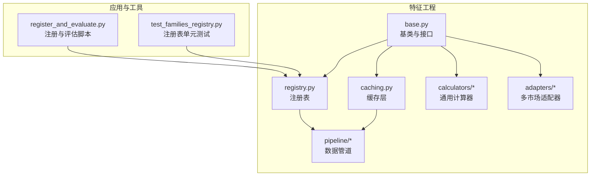
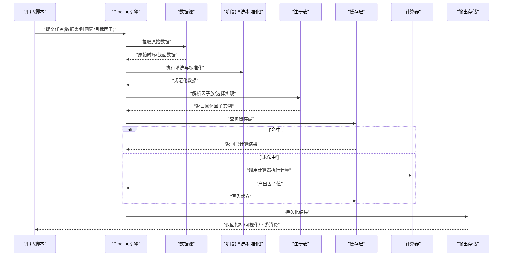
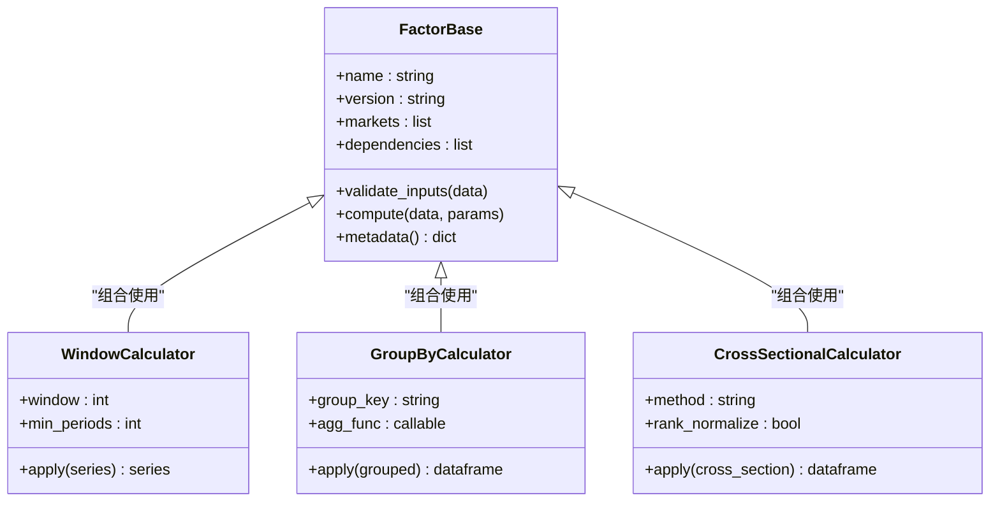
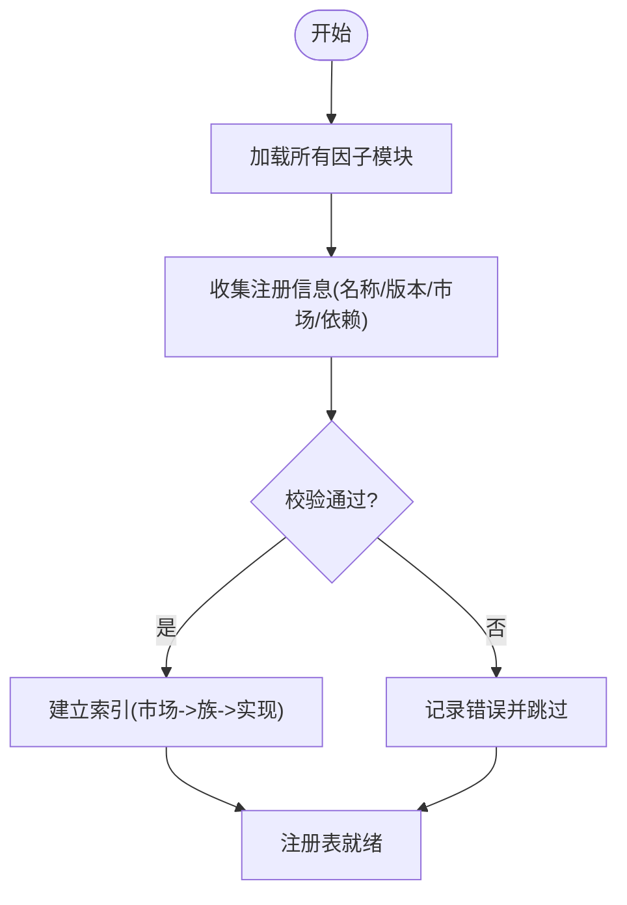
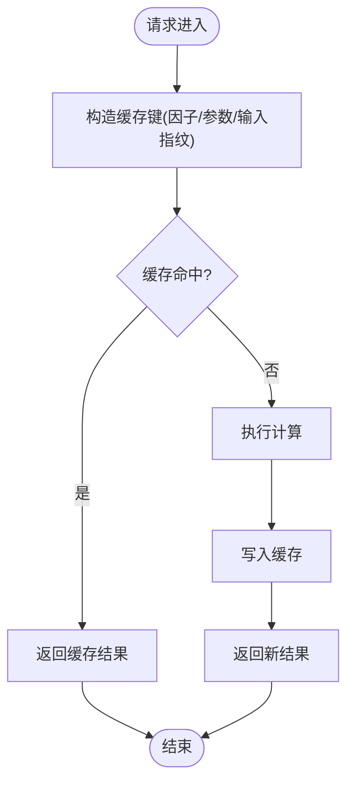
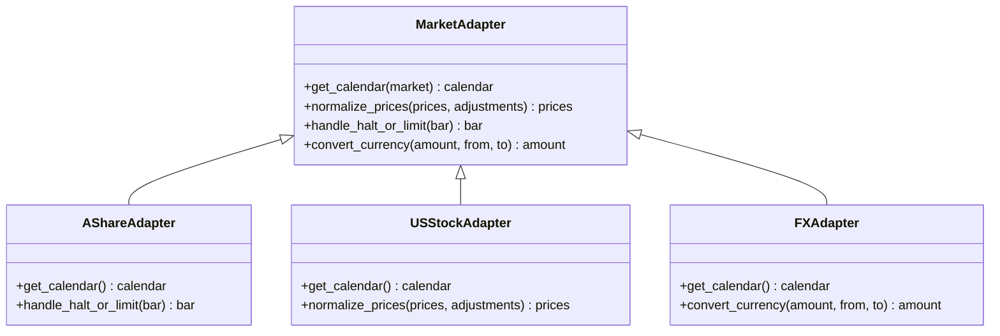
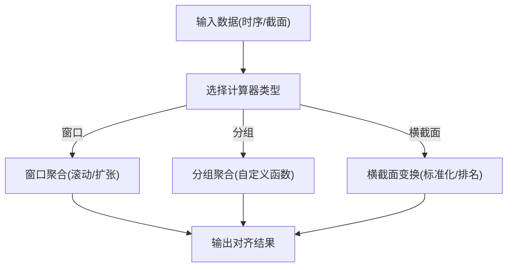
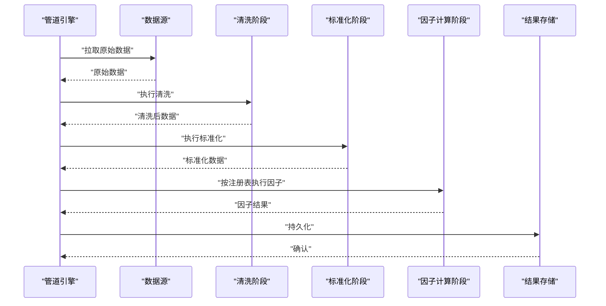
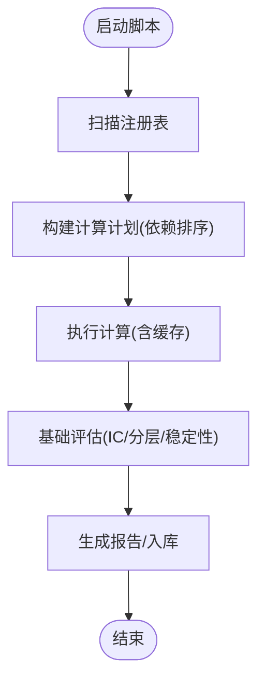
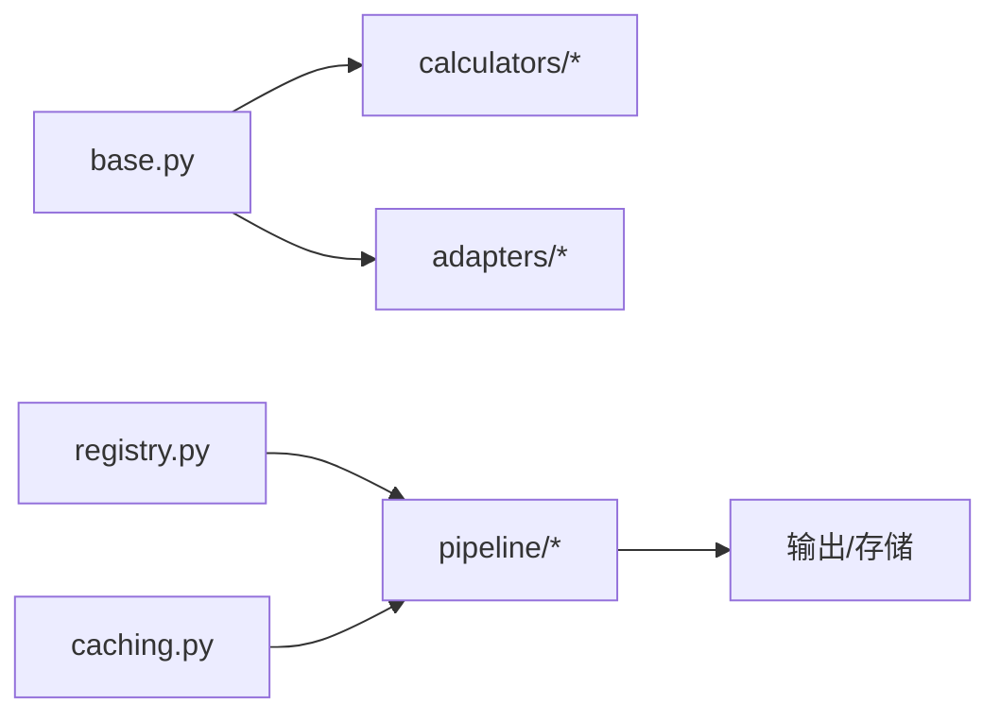

# 因子库管理

<cite>
**本文引用的文件**   
- [packages/features/__init__.py](file://packages/features/__init__.py)
- [packages/features/base.py](file://packages/features/base.py)
- [packages/features/registry.py](file://packages/features/registry.py)
- [packages/features/caching.py](file://packages/features/caching.py)
- [packages/features/adapters/market_adapter.py](file://packages/features/adapters/market_adapter.py)
- [packages/features/adapters/a_share.py](file://packages/features/adapters/a_share.py)
- [packages/features/adapters/us_stock.py](file://packages/features/adapters/us_stock.py)
- [packages/features/adapters/fx.py](file://packages/features/adapters/fx.py)
- [packages/features/calculators/window_calculator.py](file://packages/features/calculators/window_calculator.py)
- [packages/features/calculators/groupby_calculator.py](file://packages/features/calculators/groupby_calculator.py)
- [packages/features/calculators/cross_sectional_calculator.py](file://packages/features/calculators/cross_sectional_calculator.py)
- [packages/features/pipeline/data_source.py](file://packages/features/pipeline/data_source.py)
- [packages/features/pipeline/stage.py](file://packages/features/pipeline/stage.py)
- [packages/features/pipeline/engine.py](file://packages/features/pipeline/engine.py)
- [scripts/register_and_evaluate.py](file://scripts/register_and_evaluate.py)
- [tests/unit/test_families_registry.py](file://tests/unit/test_families_registry.py)
</cite>

## 目录
1. [简介](#简介)
2. [项目结构](#项目结构)
3. [核心组件](#核心组件)
4. [架构总览](#架构总览)
5. [详细组件分析](#详细组件分析)
6. [依赖关系分析](#依赖关系分析)
7. [性能考虑](#性能考虑)
8. [故障排查指南](#故障排查指南)
9. [结论](#结论)
10. [附录](#附录)

## 简介
本技术文档面向“因子库管理系统”，聚焦于技术指标计算、因子定义与管理、多市场适配器设计（A股、美股、外汇）、注册机制、缓存策略与性能优化，以及与数据处理管道的集成。文档同时提供因子开发示例与最佳实践，并总结常见问题与调试技巧，帮助研究者和工程师高效构建、评估与维护跨市场的量化因子体系。

## 项目结构
仓库采用按功能域划分的包组织方式，因子相关能力集中在 packages/features 下，配套的计算器、适配器、管道与脚本位于相应子目录中；测试与示例脚本分别位于 tests 与 scripts。

图表来源
- [packages/features/base.py](file://packages/features/base.py)
- [packages/features/registry.py](file://packages/features/registry.py)
- [packages/features/caching.py](file://packages/features/caching.py)
- [packages/features/adapters/market_adapter.py](file://packages/features/adapters/market_adapter.py)
- [packages/features/calculators/window_calculator.py](file://packages/features/calculators/window_calculator.py)
- [packages/features/pipeline/engine.py](file://packages/features/pipeline/engine.py)
- [scripts/register_and_evaluate.py](file://scripts/register_and_evaluate.py)
- [tests/unit/test_families_registry.py](file://tests/unit/test_families_registry.py)

章节来源
- [packages/features/__init__.py](file://packages/features/__init__.py)
- [packages/features/base.py](file://packages/features/base.py)
- [packages/features/registry.py](file://packages/features/registry.py)
- [packages/features/caching.py](file://packages/features/caching.py)
- [packages/features/adapters/market_adapter.py](file://packages/features/adapters/market_adapter.py)
- [packages/features/calculators/window_calculator.py](file://packages/features/calculators/window_calculator.py)
- [packages/features/pipeline/engine.py](file://packages/features/pipeline/engine.py)
- [scripts/register_and_evaluate.py](file://scripts/register_and_evaluate.py)
- [tests/unit/test_families_registry.py](file://tests/unit/test_families_registry.py)

## 核心组件
- 基类与接口：定义因子抽象、输入输出规范、生命周期钩子与元信息描述，确保不同市场与计算器的统一接入。
- 注册表：集中管理因子族与具体实现，支持按市场路由、版本兼容与动态发现。
- 缓存层：提供基于键的缓存读写、失效与统计，降低重复计算成本。
- 多市场适配器：封装各市场特有的日历、交易时段、复权、涨跌停、停牌等差异，向上暴露一致的数据视图。
- 通用计算器：窗口聚合、分组聚合、横截面标准化等常用算子，供因子组合复用。
- 数据管道：将数据源、清洗、标准化与因子计算串联为可编排的阶段序列，支持并行与断点续算。

章节来源
- [packages/features/base.py](file://packages/features/base.py)
- [packages/features/registry.py](file://packages/features/registry.py)
- [packages/features/caching.py](file://packages/features/caching.py)
- [packages/features/adapters/market_adapter.py](file://packages/features/adapters/market_adapter.py)
- [packages/features/calculators/window_calculator.py](file://packages/features/calculators/window_calculator.py)
- [packages/features/pipeline/engine.py](file://packages/features/pipeline/engine.py)

## 架构总览
下图展示了从数据源到因子产出的端到端流程，以及注册表与缓存的参与位置。

图表来源
- [packages/features/pipeline/engine.py](file://packages/features/pipeline/engine.py)
- [packages/features/pipeline/data_source.py](file://packages/features/pipeline/data_source.py)
- [packages/features/pipeline/stage.py](file://packages/features/pipeline/stage.py)
- [packages/features/registry.py](file://packages/features/registry.py)
- [packages/features/caching.py](file://packages/features/caching.py)
- [packages/features/calculators/window_calculator.py](file://packages/features/calculators/window_calculator.py)

## 详细组件分析

### 基类与接口（因子抽象）
- 职责：定义因子输入约束、输出格式、依赖声明、参数校验、元数据（名称、版本、适用市场）。
- 关键点：
  - 输入类型：时间序列或截面数据，带统一索引与字段约定。
  - 输出类型：对齐时间轴的同长度序列，缺失值处理策略可配置。
  - 生命周期：初始化、预热、计算、清理钩子，便于资源管理与状态重置。
  - 元数据：用于注册表路由、文档生成与审计追踪。

图表来源
- [packages/features/base.py](file://packages/features/base.py)
- [packages/features/calculators/window_calculator.py](file://packages/features/calculators/window_calculator.py)
- [packages/features/calculators/groupby_calculator.py](file://packages/features/calculators/groupby_calculator.py)
- [packages/features/calculators/cross_sectional_calculator.py](file://packages/features/calculators/cross_sectional_calculator.py)

章节来源
- [packages/features/base.py](file://packages/features/base.py)

### 注册表（因子族与路由）
- 职责：维护因子族与实现的映射，支持按市场、版本、标签进行路由；提供注册、发现、校验与批量导出能力。
- 关键点：
  - 注册装饰器/函数：在导入时自动完成注册。
  - 路由规则：优先匹配市场，其次版本，最后默认实现。
  - 校验：对依赖、参数、输入输出形状进行预检查，减少运行时错误。
  - 扩展性：新增因子无需修改核心逻辑，仅通过注册即可被管道发现。

图表来源
- [packages/features/registry.py](file://packages/features/registry.py)
- [tests/unit/test_families_registry.py](file://tests/unit/test_families_registry.py)

章节来源
- [packages/features/registry.py](file://packages/features/registry.py)
- [tests/unit/test_families_registry.py](file://tests/unit/test_families_registry.py)

### 缓存层（键空间与失效）
- 职责：以“因子名+参数+输入指纹”为键，缓存中间与最终结果；提供命中率统计与过期策略。
- 关键点：
  - 键构造：包含因子版本、参数哈希、数据时间范围与唯一标识，避免污染。
  - 一致性：同一键只写一次，读路径幂等。
  - 失效：支持按因子族、时间范围或全量清理。
  - 监控：暴露命中/未命中计数与耗时分布。

图表来源
- [packages/features/caching.py](file://packages/features/caching.py)

章节来源
- [packages/features/caching.py](file://packages/features/caching.py)

### 多市场适配器（A股、美股、外汇）
- 设计模式：面向接口编程，统一 MarketAdapter 抽象，各市场实现差异化处理（日历、交易时段、复权、涨跌停、停牌、货币单位等），向上提供一致的数据视图。
- A股适配要点：
  - 非交易日与节假日差异、涨跌停限制、停牌处理、复权价格口径。
- 美股适配要点：
  - 夏令时切换、盘前盘后时段、拆股与分红处理。
- 外汇适配要点：
  - 连续合约拼接、交叉汇率换算、报价方向与点差。

图表来源
- [packages/features/adapters/market_adapter.py](file://packages/features/adapters/market_adapter.py)
- [packages/features/adapters/a_share.py](file://packages/features/adapters/a_share.py)
- [packages/features/adapters/us_stock.py](file://packages/features/adapters/us_stock.py)
- [packages/features/adapters/fx.py](file://packages/features/adapters/fx.py)

章节来源
- [packages/features/adapters/market_adapter.py](file://packages/features/adapters/market_adapter.py)
- [packages/features/adapters/a_share.py](file://packages/features/adapters/a_share.py)
- [packages/features/adapters/us_stock.py](file://packages/features/adapters/us_stock.py)
- [packages/features/adapters/fx.py](file://packages/features/adapters/fx.py)

### 通用计算器（窗口、分组、横截面）
- 窗口计算器：滚动/扩张窗口聚合，支持最小周期、缺失填充与边界行为。
- 分组计算器：按标的/行业/风格分组聚合，支持自定义聚合函数。
- 横截面计算器：排名、去极值、标准化、中性化等横截面变换。

图表来源
- [packages/features/calculators/window_calculator.py](file://packages/features/calculators/window_calculator.py)
- [packages/features/calculators/groupby_calculator.py](file://packages/features/calculators/groupby_calculator.py)
- [packages/features/calculators/cross_sectional_calculator.py](file://packages/features/calculators/cross_sectional_calculator.py)

章节来源
- [packages/features/calculators/window_calculator.py](file://packages/features/calculators/window_calculator.py)
- [packages/features/calculators/groupby_calculator.py](file://packages/features/calculators/groupby_calculator.py)
- [packages/features/calculators/cross_sectional_calculator.py](file://packages/features/calculators/cross_sectional_calculator.py)

### 数据管道（获取、清洗、标准化、计算）
- 数据源：对接数据库/外部API，提供统一读取接口与分页/增量拉取。
- 阶段：清洗（去重、异常值处理）、标准化（复权、币种转换、时间对齐）、计算（调用注册表中的因子）。
- 引擎：编排阶段顺序、并行度控制、断点续算与回滚。

图表来源
- [packages/features/pipeline/engine.py](file://packages/features/pipeline/engine.py)
- [packages/features/pipeline/data_source.py](file://packages/features/pipeline/data_source.py)
- [packages/features/pipeline/stage.py](file://packages/features/pipeline/stage.py)

章节来源
- [packages/features/pipeline/engine.py](file://packages/features/pipeline/engine.py)
- [packages/features/pipeline/data_source.py](file://packages/features/pipeline/data_source.py)
- [packages/features/pipeline/stage.py](file://packages/features/pipeline/stage.py)

### 注册与评估脚本
- 作用：一键完成因子注册、依赖校验、批量计算与基础评估（如IC、分层收益等），便于研究与生产衔接。
- 流程：扫描注册表 -> 构建任务图 -> 调度执行 -> 汇总指标 -> 输出报告。

图表来源
- [scripts/register_and_evaluate.py](file://scripts/register_and_evaluate.py)

章节来源
- [scripts/register_and_evaluate.py](file://scripts/register_and_evaluate.py)

## 依赖关系分析
- 组件耦合：
  - 基类与计算器低耦合，通过组合方式被因子使用。
  - 注册表与管道松耦合，通过契约式接口交互。
  - 缓存层透明插入，不影响业务逻辑。
- 外部依赖：
  - 数据源与存储后端通过接口隔离，便于替换。
  - 多市场适配器屏蔽市场差异，提升可移植性。

图表来源
- [packages/features/base.py](file://packages/features/base.py)
- [packages/features/registry.py](file://packages/features/registry.py)
- [packages/features/caching.py](file://packages/features/caching.py)
- [packages/features/pipeline/engine.py](file://packages/features/pipeline/engine.py)

章节来源
- [packages/features/base.py](file://packages/features/base.py)
- [packages/features/registry.py](file://packages/features/registry.py)
- [packages/features/caching.py](file://packages/features/caching.py)
- [packages/features/pipeline/engine.py](file://packages/features/pipeline/engine.py)

## 性能考虑
- 计算侧：
  - 向量化优先：尽量使用底层数值库的向量化操作，避免逐行循环。
  - 窗口计算优化：合理设置 min_periods，避免不必要的广播与复制。
  - 分组聚合：利用内置分组聚合函数，减少 Python 层开销。
- 缓存侧：
  - 键粒度：在“因子+参数+输入指纹”维度上平衡命中率与内存占用。
  - 过期策略：按因子族或时间范围清理，避免无限增长。
- 管道侧：
  - 并行度：根据CPU核数与IO瓶颈调整并发，避免争用。
  - 断点续算：记录阶段完成位点，失败后可快速恢复。
- 数据侧：
  - 列裁剪：仅拉取必要字段，减少网络与I/O压力。
  - 增量更新：按时间窗增量计算，避免全量重算。

[本节为通用指导，不直接分析具体文件]

## 故障排查指南
- 注册表问题：
  - 现象：因子未被发现或路由错误。
  - 排查：检查注册装饰器是否生效、命名冲突、版本优先级与市场匹配规则。
- 缓存污染：
  - 现象：结果不一致或历史结果被覆盖。
  - 排查：核对键构造是否包含因子版本与输入指纹；必要时清理对应键空间。
- 市场差异导致异常：
  - 现象：涨跌停/停牌/复权处理不一致。
  - 排查：确认适配器是否正确注入，日历与复权口径是否符合市场预期。
- 管道阶段失败：
  - 现象：某阶段中断或结果缺失。
  - 排查：查看阶段日志与断点位点，验证输入形状与依赖是否满足。

章节来源
- [packages/features/registry.py](file://packages/features/registry.py)
- [packages/features/caching.py](file://packages/features/caching.py)
- [packages/features/adapters/market_adapter.py](file://packages/features/adapters/market_adapter.py)
- [packages/features/pipeline/engine.py](file://packages/features/pipeline/engine.py)

## 结论
本系统通过统一的因子抽象、灵活的注册表、透明的缓存层与可扩展的多市场适配器，构建了高内聚、低耦合的因子工程基础设施。配合数据管道与通用计算器，可实现跨市场、可编排、可观测的因子研发与生产流水线。建议在实践中遵循“先接口、后实现”的设计原则，重视键设计与缓存治理，持续完善市场适配与质量门禁，以提升因子体系的稳定性与可维护性。

[本节为总结性内容，不直接分析具体文件]

## 附录

### 因子开发示例与最佳实践
- 步骤概览：
  - 定义因子：继承基类，声明依赖与元数据，实现 compute 方法。
  - 注册因子：使用注册表提供的注册方式，指定市场与版本。
  - 编写测试：覆盖边界条件、缺失值、极端行情与跨市场场景。
  - 集成管道：在 pipeline 中声明阶段与依赖，启用缓存与断点续算。
  - 运行评估：使用脚本批量计算与评估，输出报告并入库。
- 最佳实践：
  - 明确输入输出形状与缺失值策略，保证时间对齐。
  - 谨慎处理复权与币种转换，保持口径一致。
  - 合理拆分计算阶段，提高可复用性与可测试性。
  - 为关键因子添加审计与溯源信息，便于回溯与合规。

[本节为概念性指导，不直接分析具体文件]