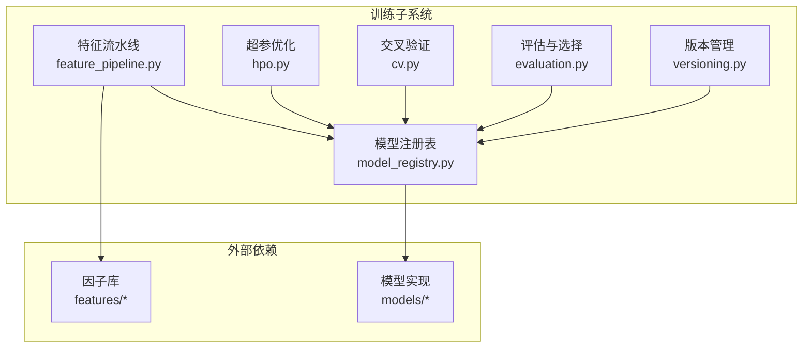
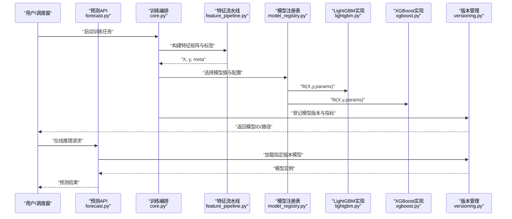
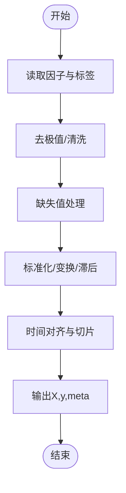
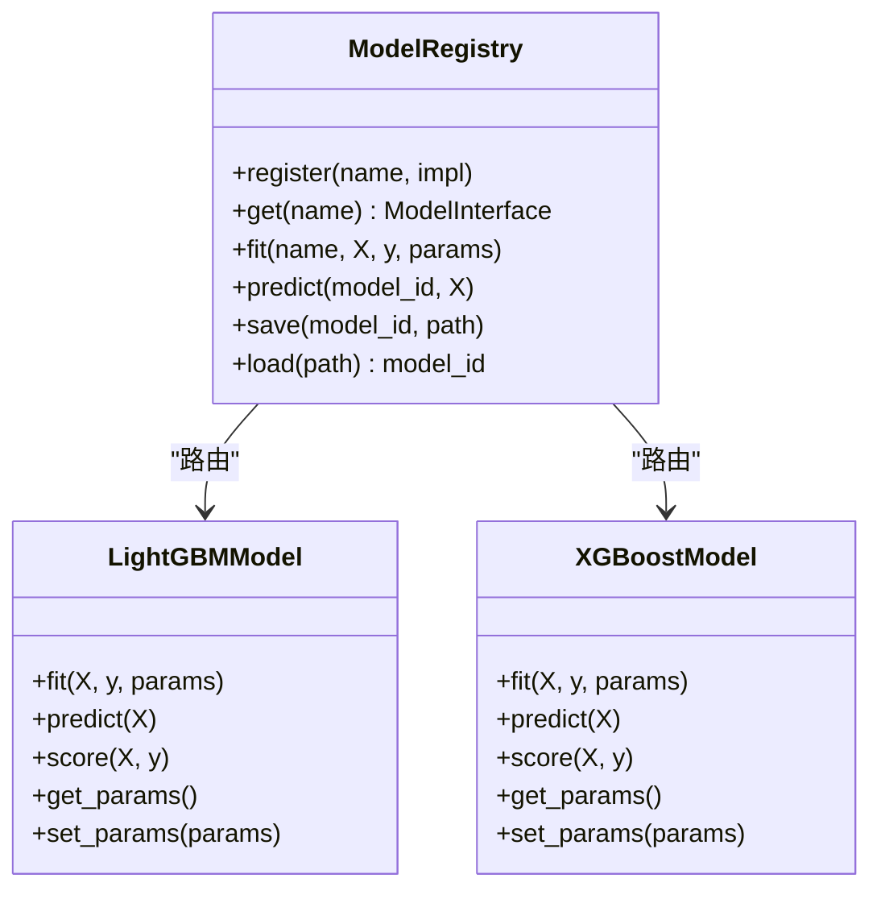
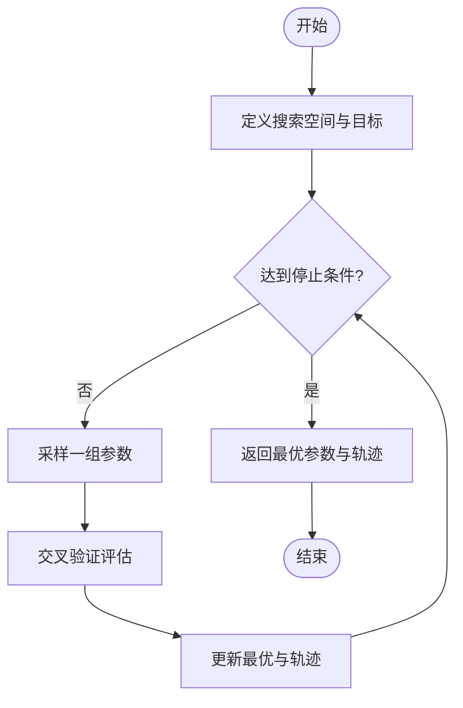
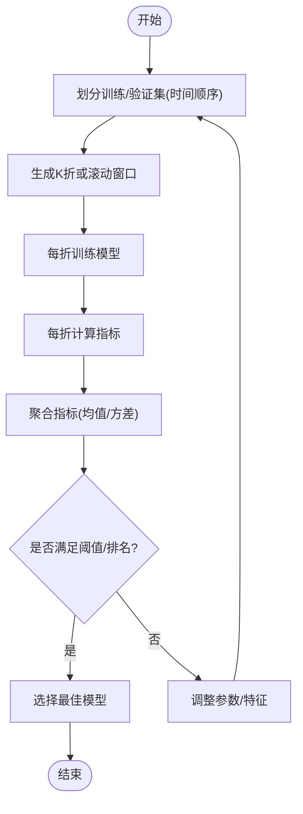
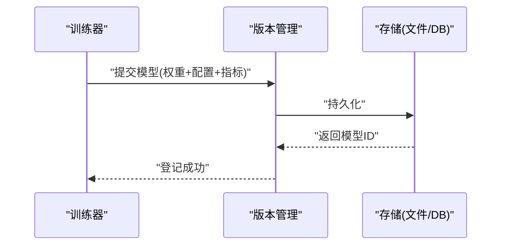
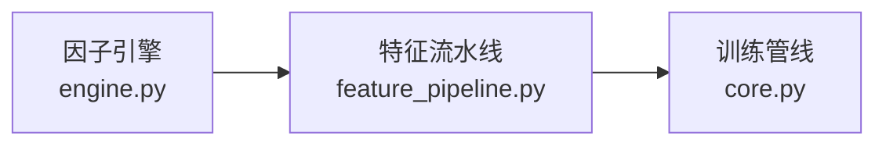
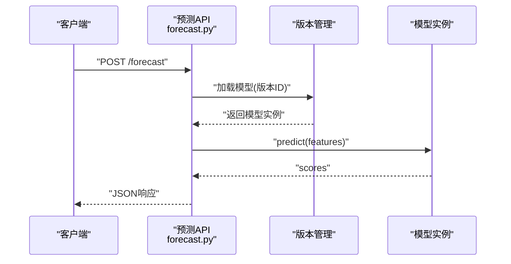
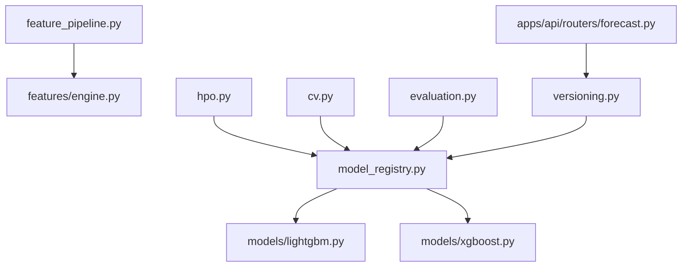

# 模型训练

<cite>
**本文引用的文件**   
- [packages/training/__init__.py](file://packages/training/__init__.py)
- [packages/training/core.py](file://packages/training/core.py)
- [packages/training/feature_pipeline.py](file://packages/training/feature_pipeline.py)
- [packages/training/model_registry.py](file://packages/training/model_registry.py)
- [packages/training/hpo.py](file://packages/training/hpo.py)
- [packages/training/cv.py](file://packages/training/cv.py)
- [packages/training/evaluation.py](file://packages/training/evaluation.py)
- [packages/training/versioning.py](file://packages/training/versioning.py)
- [packages/features/__init__.py](file://packages/features/__init__.py)
- [packages/features/engine.py](file://packages/features/engine.py)
- [packages/models/__init__.py](file://packages/models/__init__.py)
- [packages/models/lightgbm.py](file://packages/models/lightgbm.py)
- [packages/models/xgboost.py](file://packages/models/xgboost.py)
- [scripts/tune_lightgbm.py](file://scripts/tune_lightgbm.py)
- [scripts/register_and_evaluate.py](file://scripts/register_and_evaluate.py)
- [apps/api/routers/forecast.py](file://apps/api/routers/forecast.py)
- [deploy/docker-compose.yml](file://deploy/docker-compose.yml)
</cite>

## 目录
1. [简介](#简介)
2. [项目结构](#项目结构)
3. [核心组件](#核心组件)
4. [架构总览](#架构总览)
5. [详细组件分析](#详细组件分析)
6. [依赖关系分析](#依赖关系分析)
7. [性能考虑](#性能考虑)
8. [故障排查指南](#故障排查指南)
9. [结论](#结论)
10. [附录](#附录)

## 简介
本技术文档面向“模型训练系统”，聚焦于机器学习模型训练框架的设计与实现，覆盖特征工程流水线、模型选择算法、超参数优化（HPO）、交叉验证、模型评估与选择策略，以及模型版本管理与部署流程。同时提供LightGBM、XGBoost等主流算法的配置与使用示例，并解释与因子库的集成关系，支持自动化特征选择和模型迭代。

## 项目结构
训练子系统位于 packages/training，围绕“数据到模型”的端到端流水线组织：
- 特征工程：从因子库抽取、转换、对齐与打包为训练矩阵
- 模型注册：统一抽象不同算法族（LightGBM、XGBoost等）
- 超参优化：基于搜索空间与目标指标进行自动调参
- 交叉验证：时间序列友好的滚动窗口或分层CV
- 评估与选择：多指标评估、稳健性检验与最佳模型选择
- 版本管理：模型元数据、权重与配置持久化与可追溯
- 脚本与API：一键训练、注册、评估与在线推理入口

图表来源
- [packages/training/feature_pipeline.py](file://packages/training/feature_pipeline.py)
- [packages/training/model_registry.py](file://packages/training/model_registry.py)
- [packages/training/hpo.py](file://packages/training/hpo.py)
- [packages/training/cv.py](file://packages/training/cv.py)
- [packages/training/evaluation.py](file://packages/training/evaluation.py)
- [packages/training/versioning.py](file://packages/training/versioning.py)
- [packages/features/engine.py](file://packages/features/engine.py)
- [packages/models/lightgbm.py](file://packages/models/lightgbm.py)
- [packages/models/xgboost.py](file://packages/models/xgboost.py)

章节来源
- [packages/training/__init__.py](file://packages/training/__init__.py)
- [packages/training/core.py](file://packages/training/core.py)

## 核心组件
- 特征流水线：封装因子读取、缺失值处理、标准化/归一化、时间对齐、样本权重与标签构造，输出稳定的训练矩阵与元信息。
- 模型注册表：以统一接口暴露 fit/predict/score/save/load，内部路由至具体算法实现（LightGBM、XGBoost）。
- 超参优化：定义搜索空间、采样策略与早停/收敛条件，结合交叉验证返回最优配置与轨迹。
- 交叉验证：支持时间序列滚动窗口、分层分组与重复折叠，保证评估无泄漏。
- 评估与选择：计算多指标（如AUC、KS、RMSE、MAE、夏普比率映射等），按业务目标选择最佳模型。
- 版本管理：记录模型指纹、配置、数据集哈希、指标与元数据，支持回滚与发布。

章节来源
- [packages/training/feature_pipeline.py](file://packages/training/feature_pipeline.py)
- [packages/training/model_registry.py](file://packages/training/model_registry.py)
- [packages/training/hpo.py](file://packages/training/hpo.py)
- [packages/training/cv.py](file://packages/training/cv.py)
- [packages/training/evaluation.py](file://packages/training/evaluation.py)
- [packages/training/versioning.py](file://packages/training/versioning.py)

## 架构总览
下图展示从因子到模型的全链路交互，包括训练、评估、选择、版本化与部署入口。

图表来源
- [apps/api/routers/forecast.py](file://apps/api/routers/forecast.py)
- [packages/training/core.py](file://packages/training/core.py)
- [packages/training/feature_pipeline.py](file://packages/training/feature_pipeline.py)
- [packages/training/model_registry.py](file://packages/training/model_registry.py)
- [packages/training/versioning.py](file://packages/training/versioning.py)
- [packages/models/lightgbm.py](file://packages/models/lightgbm.py)
- [packages/models/xgboost.py](file://packages/models/xgboost.py)

## 详细组件分析

### 特征工程流水线
- 输入：来自因子库的多源时序数据（行情、基本面、事件等）
- 处理：去极值、缺失插补、标准化、滞后/滚动统计、截面排序、时间对齐
- 输出：训练矩阵X、标签y、样本权重w、特征元信息（名称、类型、缺失率）
- 与因子库集成：通过统一接口拉取因子，支持增量更新与缓存

图表来源
- [packages/training/feature_pipeline.py](file://packages/training/feature_pipeline.py)
- [packages/features/engine.py](file://packages/features/engine.py)

章节来源
- [packages/training/feature_pipeline.py](file://packages/training/feature_pipeline.py)
- [packages/features/__init__.py](file://packages/features/__init__.py)
- [packages/features/engine.py](file://packages/features/engine.py)

### 模型注册表与算法实现
- 统一接口：fit/predict/score/save/load/get_params/set_params
- 算法族：LightGBM、XGBoost；可扩展更多树模型或线性模型
- 配置：学习率、树深、正则、类别编码、损失函数、早停等

图表来源
- [packages/training/model_registry.py](file://packages/training/model_registry.py)
- [packages/models/lightgbm.py](file://packages/models/lightgbm.py)
- [packages/models/xgboost.py](file://packages/models/xgboost.py)

章节来源
- [packages/training/model_registry.py](file://packages/training/model_registry.py)
- [packages/models/__init__.py](file://packages/models/__init__.py)
- [packages/models/lightgbm.py](file://packages/models/lightgbm.py)
- [packages/models/xgboost.py](file://packages/models/xgboost.py)

### 超参数优化（HPO）
- 搜索空间：离散/连续/条件参数
- 采样策略：随机/网格/贝叶斯（可选）
- 终止条件：最大迭代次数、早停、时间预算
- 输出：最优参数、历史轨迹、复现实验ID

图表来源
- [packages/training/hpo.py](file://packages/training/hpo.py)

章节来源
- [packages/training/hpo.py](file://packages/training/hpo.py)

### 交叉验证与评估选择
- 时间序列友好：滚动窗口/扩展窗口，避免未来信息泄露
- 指标：分类（AUC、KS、LogLoss）、回归（RMSE、MAE、R²）、业务指标映射
- 选择策略：主指标优先，次指标做稳健性校验，必要时引入惩罚项

图表来源
- [packages/training/cv.py](file://packages/training/cv.py)
- [packages/training/evaluation.py](file://packages/training/evaluation.py)

章节来源
- [packages/training/cv.py](file://packages/training/cv.py)
- [packages/training/evaluation.py](file://packages/training/evaluation.py)

### 模型版本管理
- 元数据：模型ID、算法族、参数哈希、数据集哈希、指标、创建时间、负责人
- 存储：本地文件系统或对象存储，配合数据库索引
- 生命周期：开发→测试→预发→生产，支持回滚与灰度

图表来源
- [packages/training/versioning.py](file://packages/training/versioning.py)

章节来源
- [packages/training/versioning.py](file://packages/training/versioning.py)

### 与因子库的集成
- 统一拉取：通过因子引擎获取标准化后的因子序列
- 增量更新：仅拉取新增时段，减少IO与计算
- 质量门禁：缺失率、稳定性、相关性检查，异常因子告警

图表来源
- [packages/features/engine.py](file://packages/features/engine.py)
- [packages/training/feature_pipeline.py](file://packages/training/feature_pipeline.py)
- [packages/training/core.py](file://packages/training/core.py)

章节来源
- [packages/features/__init__.py](file://packages/features/__init__.py)
- [packages/features/engine.py](file://packages/features/engine.py)

### 模型训练示例（LightGBM / XGBoost）
- 单模型训练：通过注册表选择算法族，传入参数与数据，完成训练与保存
- 超参搜索：定义搜索空间，调用HPO模块，结合交叉验证得到最优配置
- 一键脚本：tune_lightgbm.py 提供端到端示例（特征→训练→评估→登记）
- 注册与评估：register_and_evaluate.py 演示将模型登记入版本库并产出评估报告

章节来源
- [scripts/tune_lightgbm.py](file://scripts/tune_lightgbm.py)
- [scripts/register_and_evaluate.py](file://scripts/register_and_evaluate.py)
- [packages/training/model_registry.py](file://packages/training/model_registry.py)
- [packages/training/hpo.py](file://packages/training/hpo.py)
- [packages/training/evaluation.py](file://packages/training/evaluation.py)

### 在线推理与部署
- 预测API：接收标的与时段，加载对应版本模型，返回预测
- 容器化：docker-compose 编排服务、依赖与监控
- 灰度与回滚：通过版本ID切换流量，失败快速回滚

图表来源
- [apps/api/routers/forecast.py](file://apps/api/routers/forecast.py)
- [packages/training/versioning.py](file://packages/training/versioning.py)

章节来源
- [apps/api/routers/forecast.py](file://apps/api/routers/forecast.py)
- [deploy/docker-compose.yml](file://deploy/docker-compose.yml)

## 依赖关系分析
- 内聚与耦合
  - training 模块高内聚：特征、模型、HPO、CV、评估、版本管理职责清晰
  - 对外低耦合：通过注册表与版本管理接口与外部系统集成
- 直接依赖
  - feature_pipeline → features.engine
  - model_registry → models.lightgbm / models.xgboost
  - hpo / cv / evaluation → model_registry
  - versioning → 存储后端（文件/DB）
- 潜在循环依赖
  - 通过注册表与接口解耦，避免循环引用
- 外部依赖
  - 因子库、模型库、API服务、容器编排

图表来源
- [packages/training/feature_pipeline.py](file://packages/training/feature_pipeline.py)
- [packages/training/model_registry.py](file://packages/training/model_registry.py)
- [packages/training/hpo.py](file://packages/training/hpo.py)
- [packages/training/cv.py](file://packages/training/cv.py)
- [packages/training/evaluation.py](file://packages/training/evaluation.py)
- [packages/training/versioning.py](file://packages/training/versioning.py)
- [packages/features/engine.py](file://packages/features/engine.py)
- [packages/models/lightgbm.py](file://packages/models/lightgbm.py)
- [packages/models/xgboost.py](file://packages/models/xgboost.py)
- [apps/api/routers/forecast.py](file://apps/api/routers/forecast.py)

章节来源
- [packages/training/core.py](file://packages/training/core.py)

## 性能考虑
- 特征层面
  - 向量化操作与并行计算，减少Python循环
  - 增量计算与缓存命中，降低重复IO
  - 稀疏矩阵与内存映射，控制峰值内存
- 模型层面
  - 合理设置树数/深度/子采样，平衡偏差-方差
  - 使用早停与并行线程，缩短训练时延
  - 对类别特征进行高效编码，避免维度爆炸
- 训练流程
  - 批处理与流水线并行，I/O与计算重叠
  - 资源隔离与限流，避免争用
- 评估与HPO
  - 分层/分组CV减少方差估计误差
  - 自适应搜索与剪枝，减少无效探索

[本节为通用指导，不直接分析具体文件]

## 故障排查指南
- 常见错误
  - 数据泄漏：未来信息进入训练集，需严格时间切分
  - 缺失值异常：因子缺失率过高导致不稳定，需回填或剔除
  - 过拟合：训练/验证差距大，增加正则或减少复杂度
  - 版本冲突：模型ID重复或元数据不一致，需幂等写入与校验
- 定位方法
  - 查看HPO轨迹与CV指标分布，识别异常折
  - 打印特征重要性/SHAP摘要，定位噪声特征
  - 对比不同版本的指标与配置差异，辅助回滚
- 恢复策略
  - 回滚到上一稳定版本
  - 缩小搜索空间或更换基线模型
  - 重新运行特征质量门禁后重试

章节来源
- [packages/training/hpo.py](file://packages/training/hpo.py)
- [packages/training/cv.py](file://packages/training/cv.py)
- [packages/training/evaluation.py](file://packages/training/evaluation.py)
- [packages/training/versioning.py](file://packages/training/versioning.py)

## 结论
本训练系统以“特征—模型—评估—版本”为主线，形成可复用、可追踪、可扩展的端到端流水线。通过统一的模型注册表与严格的交叉验证，确保评估稳健；借助HPO与版本管理，支撑持续迭代与可靠部署。建议在生产环境强化数据质量门禁、指标监控与灰度发布机制，进一步提升稳定性与可观测性。

[本节为总结性内容，不直接分析具体文件]

## 附录
- 术语
  - 因子：用于建模的特征信号，来源于市场、基本面或另类数据
  - 滚动窗口：随时间推进的训练/验证划分方式，避免未来信息泄露
  - 模型指纹：由配置与数据哈希生成的唯一标识，用于版本溯源
- 参考脚本
  - 调参示例：scripts/tune_lightgbm.py
  - 注册评估：scripts/register_and_evaluate.py

[本节为补充说明，不直接分析具体文件]