# 特征工程

<cite>
**本文引用的文件**   
- [packages/features/__init__.py](file://packages/features/__init__.py)
- [packages/features/base.py](file://packages/features/base.py)
- [packages/features/time_series.py](file://packages/features/time_series.py)
- [packages/features/cross_sectional.py](file://packages/features/cross_sectional.py)
- [packages/features/panel.py](file://packages/features/panel.py)
- [packages/features/imputation.py](file://packages/features/imputation.py)
- [packages/features/outliers.py](file://packages/features/outliers.py)
- [packages/features/scaling.py](file://packages/features/scaling.py)
- [packages/features/engine.py](file://packages/features/engine.py)
- [packages/features/importance.py](file://packages/features/importance.py)
- [packages/features/correlation.py](file://packages/features/correlation.py)
- [packages/features/pipeline.py](file://packages/features/pipeline.py)
</cite>

## 目录
1. [简介](#简介)
2. [项目结构](#项目结构)
3. [核心组件](#核心组件)
4. [架构总览](#架构总览)
5. [详细组件分析](#详细组件分析)
6. [依赖关系分析](#依赖关系分析)
7. [性能考虑](#性能考虑)
8. [故障排查指南](#故障排查指南)
9. [结论](#结论)
10. [附录](#附录)

## 简介
本技术文档聚焦于特征工程模块，系统阐述特征提取、转换与选择的实现细节。内容覆盖时间序列特征构造、横截面特征处理与面板数据处理；包含缺失值处理、异常值检测与特征标准化；提供具体示例与最佳实践；解释与数据处理管道的集成方式，支持增量特征计算；并给出特征重要性分析与相关性检测方法，以及常见问题与数据质量问题的解决方案。

## 项目结构
特征工程模块位于 packages/features 下，采用分层与职责分离的设计：
- 基础抽象与注册机制：定义特征算子基类、元数据与注册表，便于扩展新特征。
- 时间序列特征：滚动窗口、滞后项、增长率、波动率等时序构造器。
- 横截面特征：截面排序、分位数、行业中性化、标准化等。
- 面板特征：跨标的与时间的联合聚合（如截面均值/方差的时间序列）。
- 数据清洗与变换：缺失值插补、异常值检测与裁剪、缩放与编码。
- 管道与引擎：组合多个算子形成可复用的特征流水线，支持增量更新。
- 分析与诊断：特征重要性评估、相关性矩阵与冗余剔除建议。

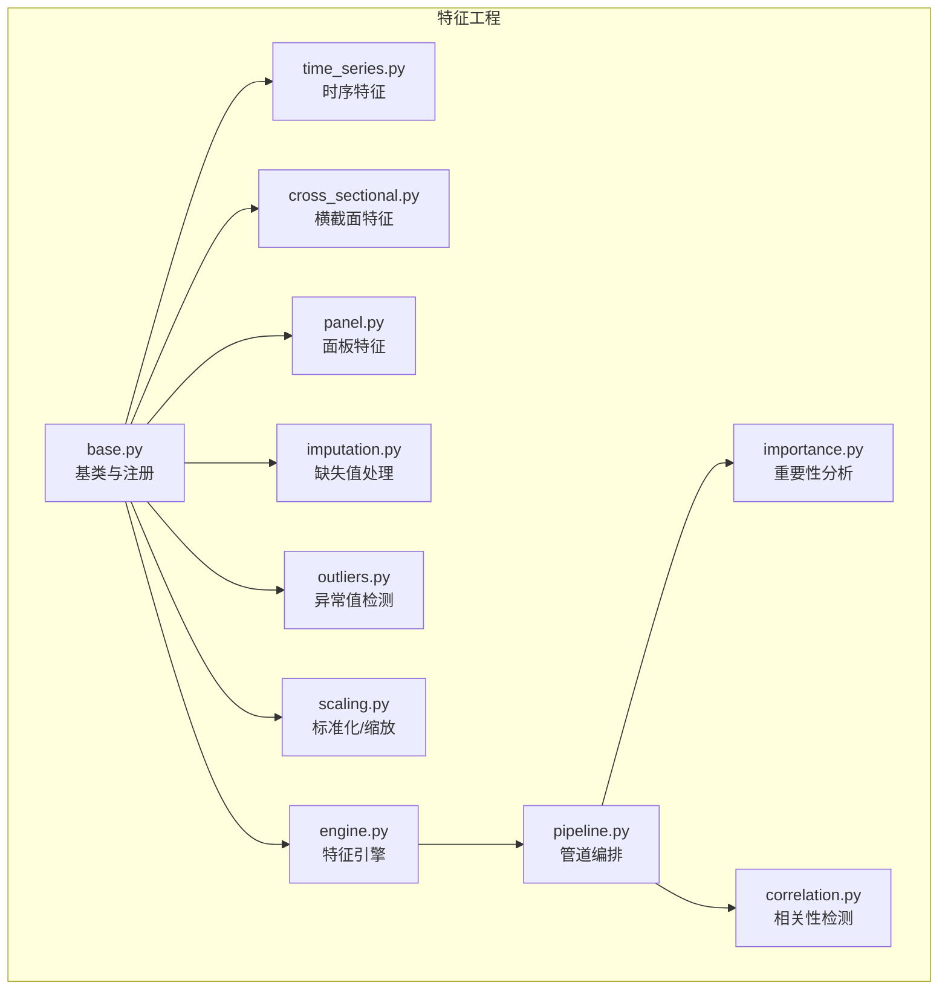

图表来源
- [packages/features/base.py](file://packages/features/base.py)
- [packages/features/time_series.py](file://packages/features/time_series.py)
- [packages/features/cross_sectional.py](file://packages/features/cross_sectional.py)
- [packages/features/panel.py](file://packages/features/panel.py)
- [packages/features/imputation.py](file://packages/features/imputation.py)
- [packages/features/outliers.py](file://packages/features/outliers.py)
- [packages/features/scaling.py](file://packages/features/scaling.py)
- [packages/features/engine.py](file://packages/features/engine.py)
- [packages/features/pipeline.py](file://packages/features/pipeline.py)
- [packages/features/importance.py](file://packages/features/importance.py)
- [packages/features/correlation.py](file://packages/features/correlation.py)

章节来源
- [packages/features/__init__.py](file://packages/features/__init__.py)
- [packages/features/base.py](file://packages/features/base.py)

## 核心组件
- 特征基类与注册表：统一特征算子的接口规范（输入输出约定、元数据描述、是否支持增量），并提供全局注册机制，便于动态加载与组合。
- 时间序列特征：基于滚动窗口与滞后项的通用构造器，支持多指标、多频率对齐与缺失回填策略。
- 横截面特征：按日期进行截面统计与变换，包括排名、分位数、去极值、中性化与标准化。
- 面板特征：在“标的×时间”二维结构上执行跨标的聚合与时间聚合，生成面板级特征。
- 数据清洗与变换：缺失值插补（前向填充、线性插值、模型插补）、异常值检测（IQR、Z-score、稳健统计）与标准化（Z-score、RobustScaler、MinMax）。
- 特征引擎与管道：将多个特征算子串联为有向无环图（DAG），管理依赖、缓存与增量更新。
- 分析与诊断：基于树模型或线性模型的权重/置换重要性，相关系数矩阵与多重共线性诊断。

章节来源
- [packages/features/base.py](file://packages/features/base.py)
- [packages/features/engine.py](file://packages/features/engine.py)
- [packages/features/pipeline.py](file://packages/features/pipeline.py)

## 架构总览
下图展示特征工程的整体架构与数据流：原始数据进入管道后，依次经过清洗、时序/截面/面板特征构造、标准化与选择，最终产出可用于建模的特征集。

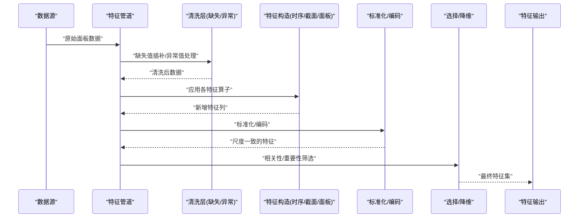

图表来源
- [packages/features/pipeline.py](file://packages/features/pipeline.py)
- [packages/features/imputation.py](file://packages/features/imputation.py)
- [packages/features/outliers.py](file://packages/features/outliers.py)
- [packages/features/time_series.py](file://packages/features/time_series.py)
- [packages/features/cross_sectional.py](file://packages/features/cross_sectional.py)
- [packages/features/panel.py](file://packages/features/panel.py)
- [packages/features/scaling.py](file://packages/features/scaling.py)
- [packages/features/importance.py](file://packages/features/importance.py)
- [packages/features/correlation.py](file://packages/features/correlation.py)

## 详细组件分析

### 时间序列特征构造
- 设计要点
  - 以“标的×时间”为索引，按标的分组后对时间维度进行滑动窗口计算。
  - 支持多种窗口类型（固定长度、指数衰减）与对齐策略（左闭右开、含缺失补齐）。
  - 常用构造：滞后项、差分、累计和/积、滚动均值/方差/偏度/峰度、波动率、趋势斜率。
- 复杂度与内存
  - 滚动窗口通常为 O(N·W)，N 为样本数，W 为窗口大小；可通过增量计算降低重复计算开销。
- 典型用法
  - 对价格序列构造 N 日收益率、ATR、布林带宽度、MACD 信号等。
  - 对成交量构造滚动成交占比、量价背离指标。
- 注意事项
  - 避免未来函数：确保所有窗口仅使用历史数据。
  - 缺失值传播：明确 NaN 的处理策略（丢弃、填充或保留用于下游插补）。

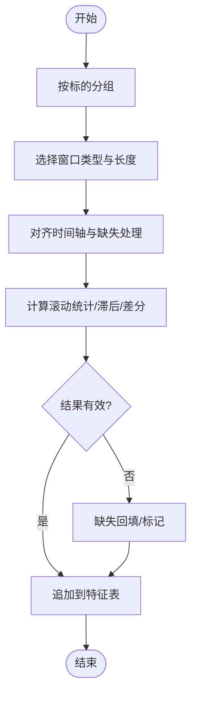

图表来源
- [packages/features/time_series.py](file://packages/features/time_series.py)

章节来源
- [packages/features/time_series.py](file://packages/features/time_series.py)

### 横截面特征处理
- 设计要点
  - 以“日期”为分组键，在同一时点内对全市场或子样本进行统计与变换。
  - 常见操作：截面排名、分位数映射、行业/风格中性化、去极值、标准化。
- 复杂度与内存
  - 截面统计通常为 O(M)，M 为当日标的数量；整体复杂度 O(T·M)。
- 典型用法
  - 市值中性化后的动量因子、波动率相对排名、换手率分位数。
- 注意事项
  - 严格区分截面与时间维度，避免跨期泄露。
  - 对极端值采用稳健统计（中位数、MAD）提升稳定性。

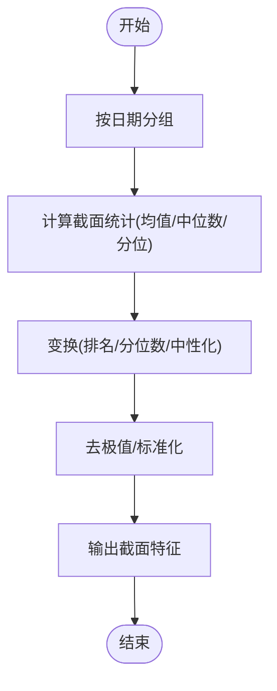

图表来源
- [packages/features/cross_sectional.py](file://packages/features/cross_sectional.py)

章节来源
- [packages/features/cross_sectional.py](file://packages/features/cross_sectional.py)

### 面板数据处理
- 设计要点
  - 同时利用时间与横截面信息，生成“面板级”特征（如截面均值的时间序列、波动率的截面分布）。
  - 支持层级聚合（行业→板块→全市场）与跨组对比（相对强度）。
- 复杂度与内存
  - 多层聚合可能带来 O(T·M·K) 的计算量，K 为层级数量；需结合缓存与增量更新。
- 典型用法
  - 行业动量、板块轮动信号、流动性拥挤度、风险平价权重。
- 注意事项
  - 注意幸存者偏差与上市/退市事件的影响。
  - 面板特征应与目标变量保持相同的时间对齐与前瞻窗口约束。

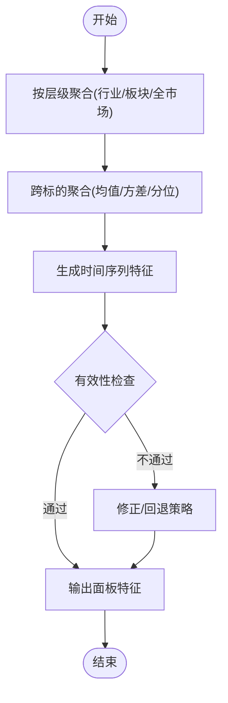

图表来源
- [packages/features/panel.py](file://packages/features/panel.py)

章节来源
- [packages/features/panel.py](file://packages/features/panel.py)

### 缺失值处理
- 策略
  - 前向填充（适用于价格/成交量等惰性序列）、线性插值（适用于连续型指标）、模型插补（基于邻近特征回归）。
  - 缺失模式识别：随机缺失 vs 非随机缺失，必要时引入缺失指示变量。
- 流程
  - 检测缺失比例与模式 → 选择策略 → 应用插补 → 记录缺失日志与审计。
- 注意事项
  - 防止数据泄露：插补参数应在训练集拟合，再应用到验证/测试集。
  - 对长尾缺失可采用“未知”类别或单独标记。

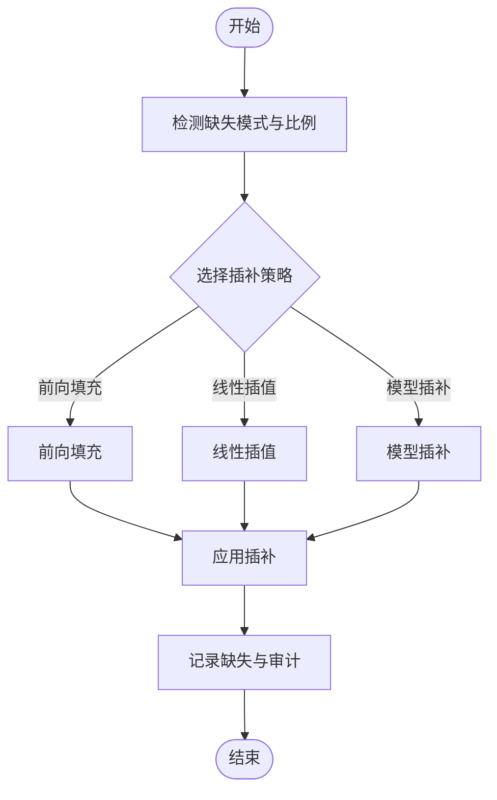

图表来源
- [packages/features/imputation.py](file://packages/features/imputation.py)

章节来源
- [packages/features/imputation.py](file://packages/features/imputation.py)

### 异常值检测与处理
- 方法
  - IQR 法（稳健四分位距）、Z-score（标准差倍数）、稳健统计（MAD、Huber 损失）。
  - 场景化规则：涨跌停、停牌、极端跳空等金融特有异常。
- 处理
  - 裁剪至合理区间、替换为中位数/分位数、标记为异常并保留原值供后续分析。
- 注意事项
  - 避免过度平滑导致信号失真；对高频噪声与真实尾部风险加以区分。

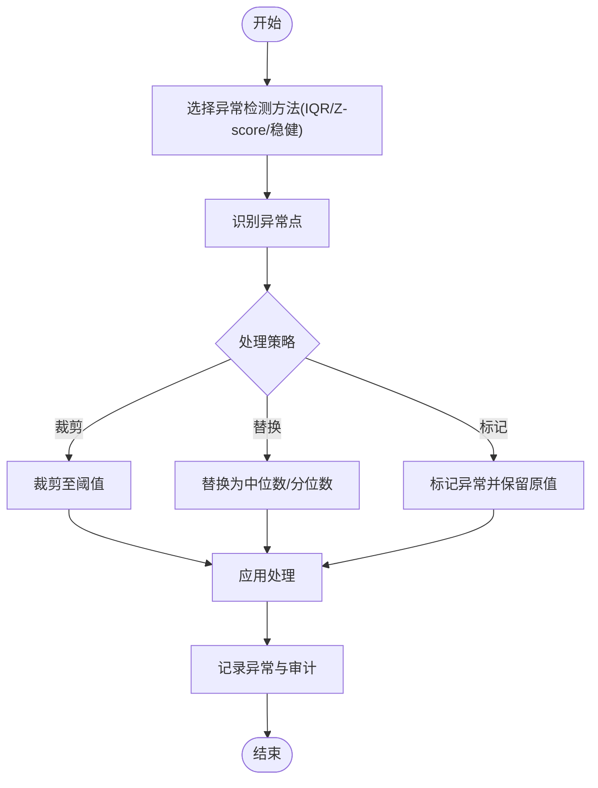

图表来源
- [packages/features/outliers.py](file://packages/features/outliers.py)

章节来源
- [packages/features/outliers.py](file://packages/features/outliers.py)

### 特征标准化与编码
- 方法
  - Z-score 标准化、RobustScaler（基于中位数与 MAD）、MinMax 归一化、分位数映射。
  - 分类特征编码：目标编码、One-Hot、频率编码。
- 适用性
  - 对距离敏感的模型（如 SVM、KNN）需要标准化；树模型对尺度不敏感但标准化有助于正则化与收敛。
- 注意事项
  - 标准化参数必须在训练集上拟合，避免泄露；对非平稳序列建议使用滚动标准化。

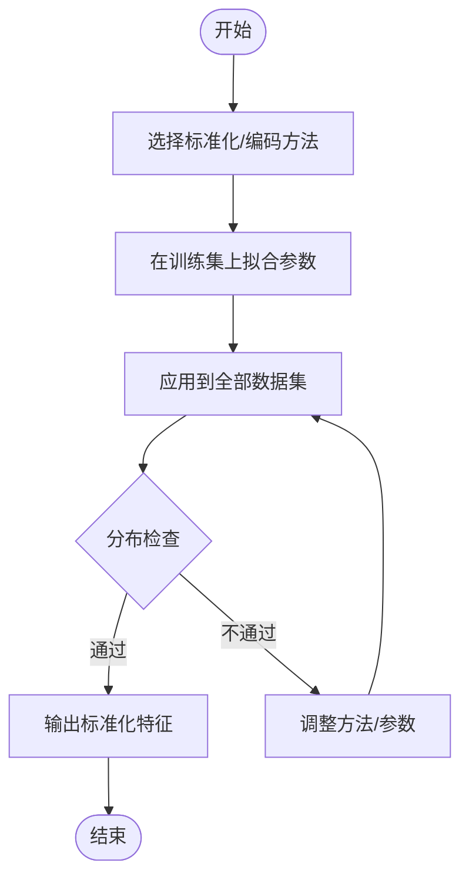

图表来源
- [packages/features/scaling.py](file://packages/features/scaling.py)

章节来源
- [packages/features/scaling.py](file://packages/features/scaling.py)

### 特征选择与重要性分析
- 重要性
  - 基于树模型（如 LightGBM/XGBoost）的特征重要性（分裂增益/次数）、置换重要性（Permutation Importance）。
  - 线性模型系数绝对值（需先标准化）。
- 相关性
  - Pearson/Spearman 相关系数矩阵、VIF（方差膨胀因子）检测多重共线性。
  - 冗余特征剔除：高相关特征保留其一或进行 PCA/稀疏分解。
- 流程
  - 计算重要性 → 设定阈值/Top-K → 过滤低重要特征 → 相关性分析 → 最终选择。
- 注意事项
  - 重要性受数据分布与模型影响，需交叉验证与稳定性检验。
  - 相关性阈值需结合业务背景，避免误删强信号。

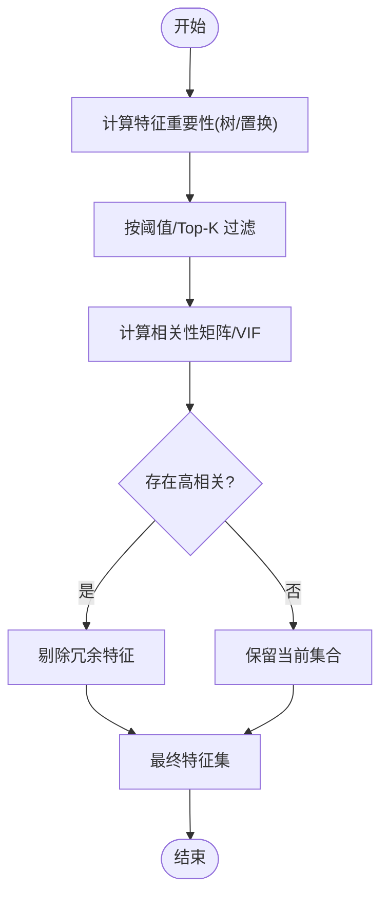

图表来源
- [packages/features/importance.py](file://packages/features/importance.py)
- [packages/features/correlation.py](file://packages/features/correlation.py)

章节来源
- [packages/features/importance.py](file://packages/features/importance.py)
- [packages/features/correlation.py](file://packages/features/correlation.py)

### 管道编排与增量计算
- 管道
  - 将清洗、特征构造、标准化、选择等步骤组织为 DAG，自动解析依赖顺序，支持并行执行。
  - 中间结果缓存与版本控制，便于回溯与 A/B 实验。
- 增量计算
  - 针对时间序列与面板特征，维护状态（如滚动窗口统计量），仅对新数据块进行更新，显著降低计算成本。
  - 支持断点续跑与幂等性保证。
- 监控与审计
  - 记录每个算子的输入输出形状、耗时、缺失比例与异常比例，便于问题定位。

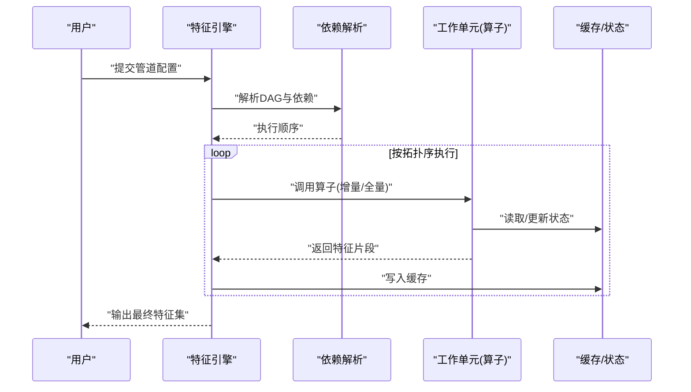

图表来源
- [packages/features/engine.py](file://packages/features/engine.py)
- [packages/features/pipeline.py](file://packages/features/pipeline.py)

章节来源
- [packages/features/engine.py](file://packages/features/engine.py)
- [packages/features/pipeline.py](file://packages/features/pipeline.py)

## 依赖关系分析
- 内部依赖
  - 时间序列、横截面、面板特征均依赖基类提供的统一接口与元数据。
  - 管道与引擎依赖各算子注册的名称与参数契约，确保可组合与可替换。
- 外部依赖
  - 数值计算库（如 NumPy/Pandas）、统计与机器学习库（如 Scikit-learn/LightGBM）。
- 潜在循环依赖
  - 通过基类解耦与注册表机制避免直接耦合；若出现循环，应拆分为独立工具模块。

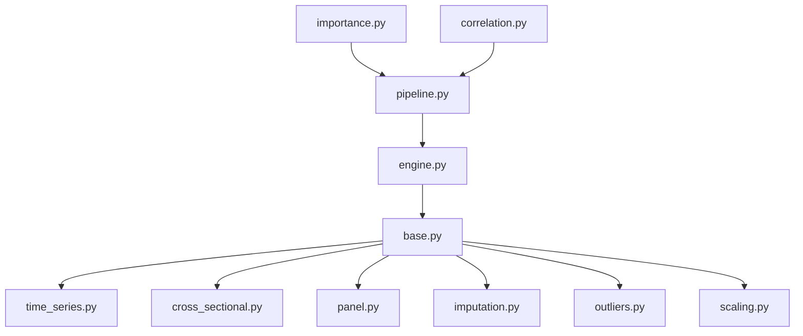

图表来源
- [packages/features/base.py](file://packages/features/base.py)
- [packages/features/engine.py](file://packages/features/engine.py)
- [packages/features/pipeline.py](file://packages/features/pipeline.py)
- [packages/features/time_series.py](file://packages/features/time_series.py)
- [packages/features/cross_sectional.py](file://packages/features/cross_sectional.py)
- [packages/features/panel.py](file://packages/features/panel.py)
- [packages/features/imputation.py](file://packages/features/imputation.py)
- [packages/features/outliers.py](file://packages/features/outliers.py)
- [packages/features/scaling.py](file://packages/features/scaling.py)
- [packages/features/importance.py](file://packages/features/importance.py)
- [packages/features/correlation.py](file://packages/features/correlation.py)

章节来源
- [packages/features/base.py](file://packages/features/base.py)
- [packages/features/engine.py](file://packages/features/engine.py)
- [packages/features/pipeline.py](file://packages/features/pipeline.py)

## 性能考虑
- 计算复杂度
  - 滚动窗口 O(N·W)、截面统计 O(M)、面板聚合 O(T·M·K)；优先使用增量计算与向量化操作。
- 内存管理
  - 分块处理与懒加载；及时释放中间结果；使用合适的数据类型（如 float32）。
- 并行与缓存
  - 算子间无依赖时可并行执行；中间结果持久化缓存，避免重复计算。
- 监控与优化
  - 记录关键路径耗时与内存峰值；对热点算子进行算法优化或近似计算。

[本节为通用指导，无需特定文件引用]

## 故障排查指南
- 常见问题
  - 数据泄露：确认所有变换仅在历史数据上拟合；检查滚动窗口的前瞻性。
  - 缺失值爆炸：核查上游数据质量与对齐逻辑；增加缺失指示变量。
  - 异常值误判：调整阈值或使用更稳健的方法；结合业务规则。
  - 多重共线性：通过 VIF 与相关性矩阵识别并剔除冗余特征。
  - 增量状态不一致：校验状态版本号与幂等性；重放最近批次进行一致性检查。
- 调试建议
  - 启用详细日志与审计记录；对关键算子输出形状与统计摘要进行断言。
  - 使用小样本回归测试覆盖边界条件（全缺失、单标的、极端行情）。

章节来源
- [packages/features/imputation.py](file://packages/features/imputation.py)
- [packages/features/outliers.py](file://packages/features/outliers.py)
- [packages/features/correlation.py](file://packages/features/correlation.py)
- [packages/features/engine.py](file://packages/features/engine.py)
- [packages/features/pipeline.py](file://packages/features/pipeline.py)

## 结论
本模块通过统一的特征算子接口与管道编排，实现了从原始数据到高质量特征集的端到端流程。时间序列、横截面与面板特征的协同构造，配合缺失值处理、异常值检测与标准化，保障了特征的稳健性与可解释性。重要性分析与相关性检测进一步提升了特征选择的质量。增量计算与缓存机制使系统在大规模数据与在线场景中具备可扩展性与高效性。

[本节为总结性内容，无需特定文件引用]

## 附录
- 最佳实践
  - 始终区分训练/验证/测试集，并在训练集上拟合所有变换参数。
  - 对金融数据采用稳健统计与业务规则相结合的方法处理异常。
  - 定期回顾特征重要性，淘汰失效特征，引入新信号。
  - 建立特征血缘与版本管理，确保可复现与可追溯。
- 参考实现路径
  - 时间序列特征构造：参见 [packages/features/time_series.py](file://packages/features/time_series.py)
  - 横截面特征处理：参见 [packages/features/cross_sectional.py](file://packages/features/cross_sectional.py)
  - 面板数据处理：参见 [packages/features/panel.py](file://packages/features/panel.py)
  - 缺失值处理：参见 [packages/features/imputation.py](file://packages/features/imputation.py)
  - 异常值检测：参见 [packages/features/outliers.py](file://packages/features/outliers.py)
  - 标准化与编码：参见 [packages/features/scaling.py](file://packages/features/scaling.py)
  - 特征选择与重要性：参见 [packages/features/importance.py](file://packages/features/importance.py)、[packages/features/correlation.py](file://packages/features/correlation.py)
  - 管道与增量计算：参见 [packages/features/pipeline.py](file://packages/features/pipeline.py)、[packages/features/engine.py](file://packages/features/engine.py)