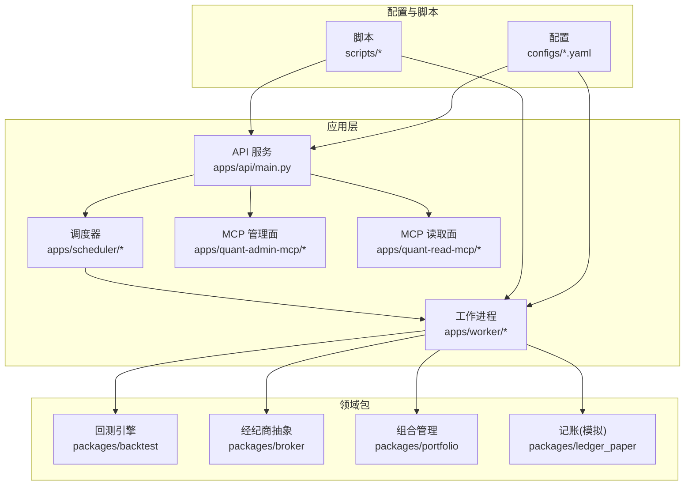
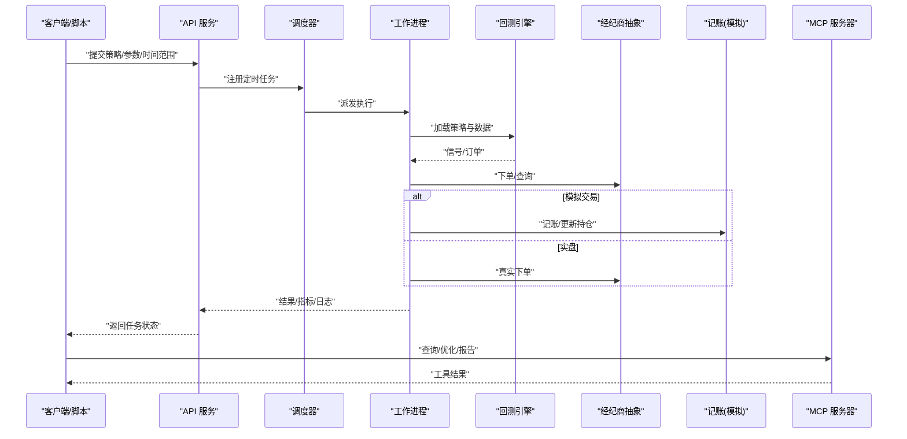
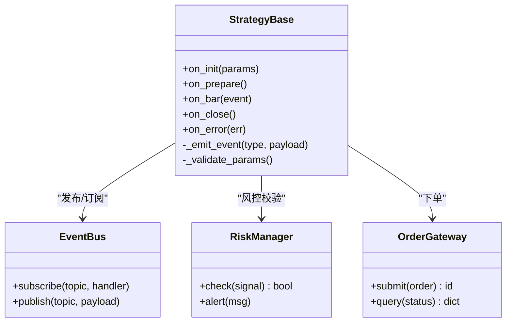
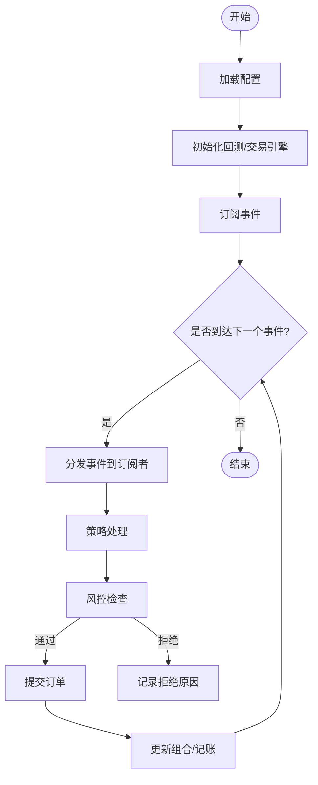
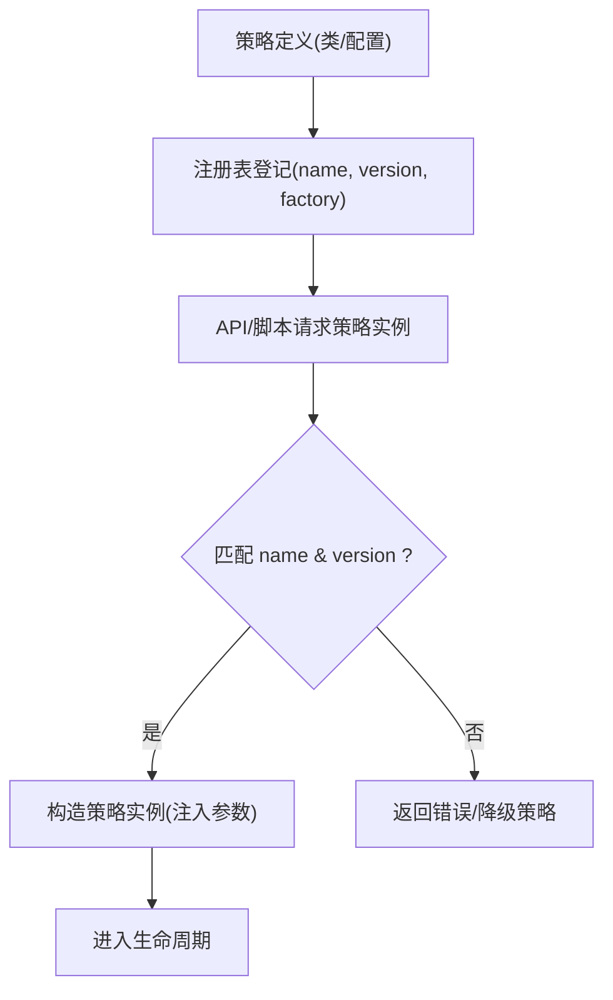
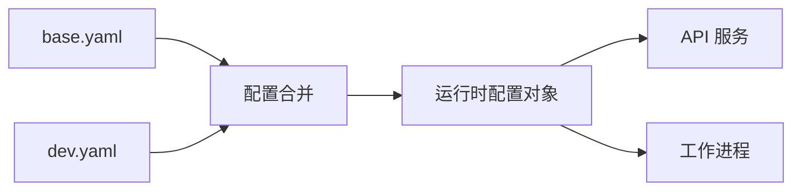
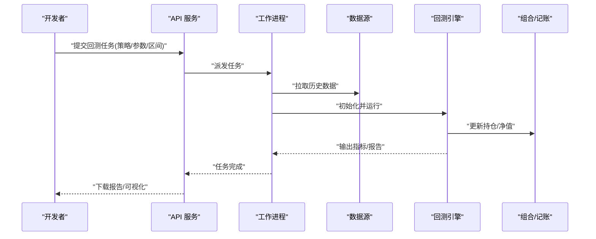
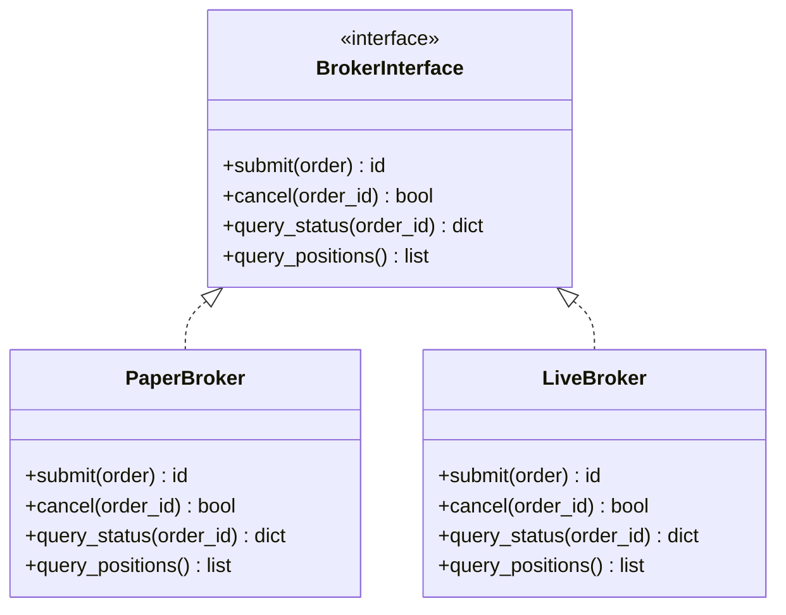
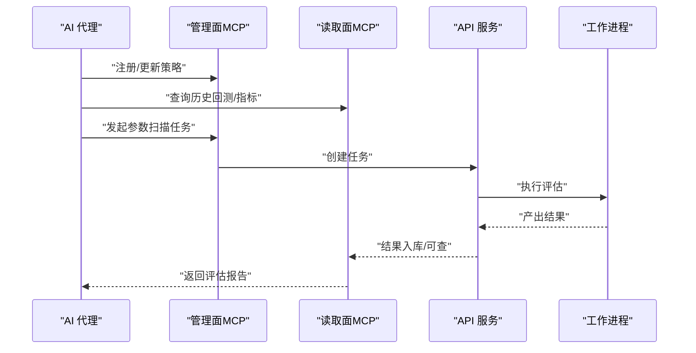
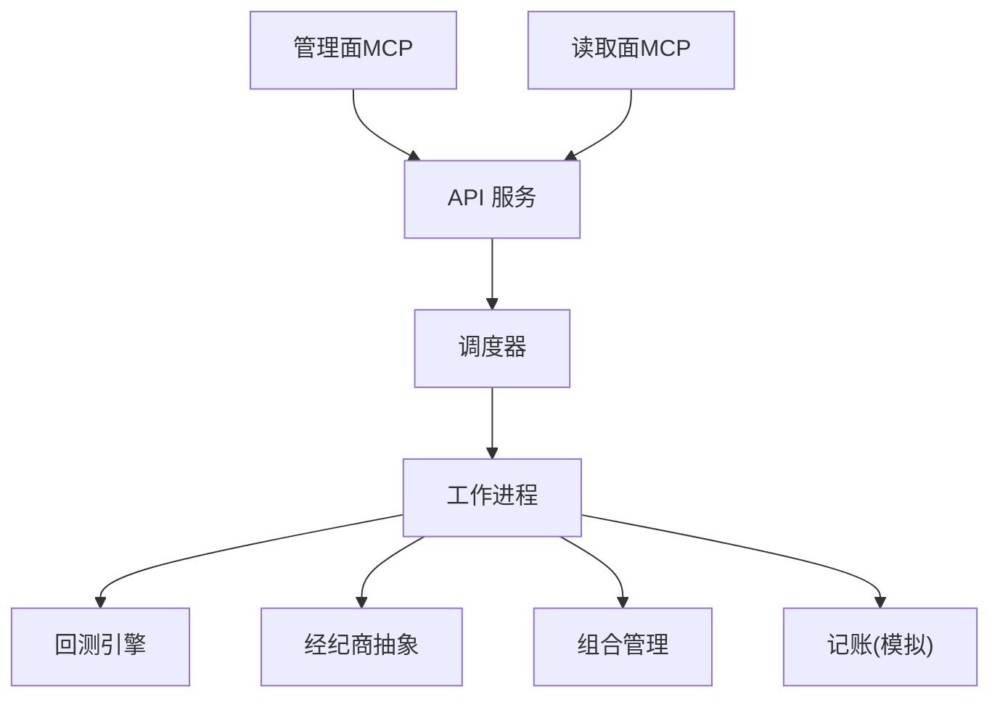

# 策略开发框架

<cite>
**本文引用的文件**   
- [README.md](file://README.md)
- [pyproject.toml](file://pyproject.toml)
- [apps/api/main.py](file://apps/api/main.py)
- [apps/api/deps.py](file://apps/api/deps.py)
- [apps/quant-admin-mcp/server.py](file://apps/quant-admin-mcp/server.py)
- [apps/quant-admin-mcp/tools.py](file://apps/quant-admin-mcp/tools.py)
- [apps/quant-read-mcp/server.py](file://apps/quant-read-mcp/server.py)
- [apps/quant-read-mcp/db_backends.py](file://apps/quant-read-mcp/db_backends.py)
- [apps/quant-read-mcp/tools.py](file://apps/quant-read-mcp/tools.py)
- [apps/scheduler/executor.py](file://apps/scheduler/executor.py)
- [apps/scheduler/schedule.py](file://apps/scheduler/schedule.py)
- [apps/worker/main.py](file://apps/worker/main.py)
- [apps/worker/tasks.py](file://apps/worker/tasks.py)
- [packages/backtest/__init__.py](file://packages/backtest/__init__.py)
- [packages/broker/__init__.py](file://packages/broker/__init__.py)
- [packages/portfolio/__init__.py](file://packages/portfolio/__init__.py)
- [packages/ledger_paper/__init__.py](file://packages/ledger_paper/__init__.py)
- [scripts/run_paper_trading.py](file://scripts/run_paper_trading.py)
- [scripts/register_and_evaluate.py](file://scripts/register_and_evaluate.py)
- [configs/base.yaml](file://configs/base.yaml)
- [configs/dev.yaml](file://configs/dev.yaml)
</cite>

## 目录
1. [简介](#简介)
2. [项目结构](#项目结构)
3. [核心组件](#核心组件)
4. [架构总览](#架构总览)
5. [详细组件分析](#详细组件分析)
6. [依赖关系分析](#依赖关系分析)
7. [性能考虑](#性能考虑)
8. [故障排查指南](#故障排查指南)
9. [结论](#结论)
10. [附录](#附录)

## 简介
本技术文档面向“策略开发框架”，围绕策略基类设计、生命周期管理、事件驱动架构、注册机制、参数配置与版本管理展开，并覆盖回测环境搭建、模拟交易接口与实盘适配。同时给出趋势跟踪、均值回归等经典策略的开发示例思路，解释与MCP代理系统的集成方式以支持AI辅助的策略优化，并提供常见问题定位与调试方法。

## 项目结构
仓库采用多应用+多包的分层组织：
- apps：对外服务与运行入口（API、调度器、工作进程、MCP服务器）
- packages：领域能力包（回测、经纪商、组合、记账、数据源、特征、评估等）
- scripts：常用任务脚本（回测、评估、模拟交易等）
- configs：环境与功能开关配置
- sql/migrations：数据库迁移
- tests：单元与集成测试

图表来源
- [apps/api/main.py](file://apps/api/main.py)
- [apps/scheduler/executor.py](file://apps/scheduler/executor.py)
- [apps/worker/main.py](file://apps/worker/main.py)
- [packages/backtest/__init__.py](file://packages/backtest/__init__.py)
- [packages/broker/__init__.py](file://packages/broker/__init__.py)
- [packages/portfolio/__init__.py](file://packages/portfolio/__init__.py)
- [packages/ledger_paper/__init__.py](file://packages/ledger_paper/__init__.py)
- [configs/base.yaml](file://configs/base.yaml)
- [scripts/run_paper_trading.py](file://scripts/run_paper_trading.py)

章节来源
- [README.md](file://README.md)
- [pyproject.toml](file://pyproject.toml)

## 核心组件
- 策略基类与生命周期
  - 提供统一的初始化、准备、信号生成、下单执行、风控检查、日志与指标上报等钩子；通过事件总线或回调在关键时点触发用户扩展逻辑。
- 事件驱动架构
  - 基于时间片/行情推送驱动的事件循环，将市场数据、组合状态、订单状态、风控结果等作为事件分发到订阅者（策略、风控、记录器等）。
- 注册机制与版本管理
  - 策略工厂/注册表按名称或命名空间加载策略类；配合配置文件与迁移脚本实现策略参数与行为版本的演进。
- 回测与模拟交易
  - 回测引擎对接历史数据与撮合模型；模拟交易使用记账模块与虚拟经纪商接口，保持与实盘一致的调用契约。
- 实盘适配
  - 通过经纪商抽象层隔离不同券商/交易所的协议差异，统一订单、成交、持仓查询与下单语义。
- MCP代理集成
  - 通过MCP服务器暴露工具与方法，供AI代理进行数据读取、策略评估、参数调优与报告生成。

章节来源
- [packages/backtest/__init__.py](file://packages/backtest/__init__.py)
- [packages/broker/__init__.py](file://packages/broker/__init__.py)
- [packages/portfolio/__init__.py](file://packages/portfolio/__init__.py)
- [packages/ledger_paper/__init__.py](file://packages/ledger_paper/__init__.py)
- [apps/quant-admin-mcp/server.py](file://apps/quant-admin-mcp/server.py)
- [apps/quant-read-mcp/server.py](file://apps/quant-read-mcp/server.py)

## 架构总览
系统由API服务编排任务，调度器按周期触发，工作进程执行回测/交易任务，并通过MCP为AI代理提供可观测性与操作能力。

图表来源
- [apps/api/main.py](file://apps/api/main.py)
- [apps/scheduler/executor.py](file://apps/scheduler/executor.py)
- [apps/worker/main.py](file://apps/worker/main.py)
- [packages/backtest/__init__.py](file://packages/backtest/__init__.py)
- [packages/broker/__init__.py](file://packages/broker/__init__.py)
- [packages/ledger_paper/__init__.py](file://packages/ledger_paper/__init__.py)
- [apps/quant-admin-mcp/server.py](file://apps/quant-admin-mcp/server.py)

## 详细组件分析

### 策略基类与生命周期
- 设计要点
  - 初始化：解析参数、加载数据源、构建因子/信号管线、注册事件监听。
  - 准备：预热指标、校验数据完整性、建立风控阈值。
  - 主循环：接收事件（行情/时间推进），计算信号，触发风控，生成订单。
  - 结算：汇总指标、输出报告、持久化中间结果。
- 事件驱动
  - 事件类型包括：Bar/K线、Tick、开盘/收盘、日切、风控告警、订单状态变更等。
  - 订阅者模式：策略、风控、记录器、监控分别订阅相关事件。
- 生命周期钩子
  - on_init/on_prepare/on_bar/on_close/on_error等钩子便于扩展。

图表来源
- [packages/backtest/__init__.py](file://packages/backtest/__init__.py)
- [packages/broker/__init__.py](file://packages/broker/__init__.py)
- [packages/portfolio/__init__.py](file://packages/portfolio/__init__.py)

章节来源
- [packages/backtest/__init__.py](file://packages/backtest/__init__.py)
- [packages/broker/__init__.py](file://packages/broker/__init__.py)
- [packages/portfolio/__init__.py](file://packages/portfolio/__init__.py)

### 事件驱动与调度
- 调度器负责周期性触发任务，工作进程消费任务并驱动回测/交易流程。
- 事件总线解耦策略与基础设施，便于横向扩展（如新增记录器、风控规则）。

图表来源
- [apps/scheduler/executor.py](file://apps/scheduler/executor.py)
- [apps/worker/main.py](file://apps/worker/main.py)
- [packages/backtest/__init__.py](file://packages/backtest/__init__.py)

章节来源
- [apps/scheduler/executor.py](file://apps/scheduler/executor.py)
- [apps/worker/main.py](file://apps/worker/main.py)

### 策略注册机制与版本管理
- 注册机制
  - 通过工厂/注册表按名称加载策略类，支持命名空间与别名。
  - 结合配置文件声明策略ID、参数默认值与依赖。
- 版本管理
  - 策略类或配置引入版本号字段，运行时根据版本选择兼容的实现。
  - 迁移脚本用于数据结构演进，确保历史回测可复现。

图表来源
- [apps/api/main.py](file://apps/api/main.py)
- [scripts/register_and_evaluate.py](file://scripts/register_and_evaluate.py)
- [configs/base.yaml](file://configs/base.yaml)

章节来源
- [scripts/register_and_evaluate.py](file://scripts/register_and_evaluate.py)
- [configs/base.yaml](file://configs/base.yaml)

### 参数配置与环境
- 配置分层
  - base.yaml：全局默认参数（数据源、数据库、日志级别、默认策略参数）。
  - dev.yaml：开发环境覆盖（本地路径、调试开关、Mock数据）。
- 加载顺序
  - 程序启动合并base与env覆盖，运行时可通过API动态刷新部分热更新项。

图表来源
- [configs/base.yaml](file://configs/base.yaml)
- [configs/dev.yaml](file://configs/dev.yaml)
- [apps/api/main.py](file://apps/api/main.py)

章节来源
- [configs/base.yaml](file://configs/base.yaml)
- [configs/dev.yaml](file://configs/dev.yaml)
- [apps/api/main.py](file://apps/api/main.py)

### 回测环境搭建
- 步骤概览
  - 安装依赖与初始化数据库迁移。
  - 导入历史数据（行情/基本面/公司行为）。
  - 编写策略并注册，指定回测区间与初始资金。
  - 运行回测任务，查看指标与报告。
- 关键依赖
  - 回测引擎、数据源、组合与记账模块。

图表来源
- [scripts/register_and_evaluate.py](file://scripts/register_and_evaluate.py)
- [packages/backtest/__init__.py](file://packages/backtest/__init__.py)
- [packages/portfolio/__init__.py](file://packages/portfolio/__init__.py)
- [packages/ledger_paper/__init__.py](file://packages/ledger_paper/__init__.py)

章节来源
- [scripts/register_and_evaluate.py](file://scripts/register_and_evaluate.py)
- [packages/backtest/__init__.py](file://packages/backtest/__init__.py)
- [packages/portfolio/__init__.py](file://packages/portfolio/__init__.py)
- [packages/ledger_paper/__init__.py](file://packages/ledger_paper/__init__.py)

### 模拟交易接口与实盘适配
- 模拟交易
  - 使用记账模块与虚拟经纪商接口，保证与实盘一致的下单/查询语义。
- 实盘适配
  - 通过经纪商抽象层屏蔽差异，统一订单、成交、撤单、查询接口。
- 切换方式
  - 通过配置选择broker后端（paper/live），无需修改策略代码。

图表来源
- [packages/broker/__init__.py](file://packages/broker/__init__.py)
- [packages/ledger_paper/__init__.py](file://packages/ledger_paper/__init__.py)
- [scripts/run_paper_trading.py](file://scripts/run_paper_trading.py)

章节来源
- [packages/broker/__init__.py](file://packages/broker/__init__.py)
- [packages/ledger_paper/__init__.py](file://packages/ledger_paper/__init__.py)
- [scripts/run_paper_trading.py](file://scripts/run_paper_trading.py)

### 与MCP代理系统集成
- 管理面MCP
  - 提供策略注册、任务编排、配置管理等工具。
- 读取面MCP
  - 提供数据查询、报告获取、指标检索等只读工具。
- AI辅助优化
  - 通过MCP工具链让AI代理自动遍历参数空间、评估策略表现、生成优化建议。

图表来源
- [apps/quant-admin-mcp/server.py](file://apps/quant-admin-mcp/server.py)
- [apps/quant-admin-mcp/tools.py](file://apps/quant-admin-mcp/tools.py)
- [apps/quant-read-mcp/server.py](file://apps/quant-read-mcp/server.py)
- [apps/quant-read-mcp/tools.py](file://apps/quant-read-mcp/tools.py)
- [apps/quant-read-mcp/db_backends.py](file://apps/quant-read-mcp/db_backends.py)

章节来源
- [apps/quant-admin-mcp/server.py](file://apps/quant-admin-mcp/server.py)
- [apps/quant-admin-mcp/tools.py](file://apps/quant-admin-mcp/tools.py)
- [apps/quant-read-mcp/server.py](file://apps/quant-read-mcp/server.py)
- [apps/quant-read-mcp/tools.py](file://apps/quant-read-mcp/tools.py)
- [apps/quant-read-mcp/db_backends.py](file://apps/quant-read-mcp/db_backends.py)

### 经典策略开发示例（思路）
- 趋势跟踪
  - 信号：基于移动平均交叉或动量突破。
  - 风控：波动率止损、最大回撤控制。
  - 执行：分批建仓/减仓，滑点与手续费建模。
- 均值回归
  - 信号：价差Z-score、协整残差偏离。
  - 风控：配对风险限额、相关性突变检测。
  - 执行：对冲头寸、滚动再平衡。

说明：以上为通用方法论，具体实现应遵循策略基类生命周期与事件驱动约定，并在注册表中登记策略名与版本。

[本节不直接分析具体文件，故无章节来源]

## 依赖关系分析
- 组件耦合
  - 工作进程依赖回测、经纪商、组合与记账模块；API仅编排任务，避免业务耦合。
- 外部依赖
  - 数据库、消息队列（调度）、MCP服务器、数据源适配器。
- 潜在循环依赖
  - 通过接口抽象与事件总线降低耦合，避免回测与经纪商直接双向依赖。

图表来源
- [apps/api/main.py](file://apps/api/main.py)
- [apps/scheduler/executor.py](file://apps/scheduler/executor.py)
- [apps/worker/main.py](file://apps/worker/main.py)
- [packages/backtest/__init__.py](file://packages/backtest/__init__.py)
- [packages/broker/__init__.py](file://packages/broker/__init__.py)
- [packages/portfolio/__init__.py](file://packages/portfolio/__init__.py)
- [packages/ledger_paper/__init__.py](file://packages/ledger_paper/__init__.py)
- [apps/quant-admin-mcp/server.py](file://apps/quant-admin-mcp/server.py)
- [apps/quant-read-mcp/server.py](file://apps/quant-read-mcp/server.py)

章节来源
- [apps/api/main.py](file://apps/api/main.py)
- [apps/scheduler/executor.py](file://apps/scheduler/executor.py)
- [apps/worker/main.py](file://apps/worker/main.py)
- [packages/backtest/__init__.py](file://packages/backtest/__init__.py)
- [packages/broker/__init__.py](file://packages/broker/__init__.py)
- [packages/portfolio/__init__.py](file://packages/portfolio/__init__.py)
- [packages/ledger_paper/__init__.py](file://packages/ledger_paper/__init__.py)
- [apps/quant-admin-mcp/server.py](file://apps/quant-admin-mcp/server.py)
- [apps/quant-read-mcp/server.py](file://apps/quant-read-mcp/server.py)

## 性能考虑
- 事件批处理：批量处理Bar/Tick以降低事件分发开销。
- 向量化计算：在因子/信号阶段尽量使用数组运算。
- 异步I/O：数据拉取与下单走异步通道，避免阻塞主循环。
- 缓存与增量更新：对热点指标与价格序列做内存缓存。
- 资源隔离：不同策略/任务分进程或线程池隔离，防止相互影响。

[本节提供通用指导，不直接分析具体文件，故无章节来源]

## 故障排查指南
- 常见问题
  - 策略未注册或版本不匹配：检查注册表与配置中的name/version。
  - 数据缺失或对齐异常：确认数据源接入与时间戳对齐。
  - 下单失败：核对经纪商后端配置与权限。
  - 回测结果不稳定：检查随机种子、滑点/手续费设置与数据一致性。
- 定位方法
  - 开启详细日志与指标上报，定位事件流断点。
  - 使用MCP读取面查询历史任务与中间结果。
  - 通过API查看任务状态与错误堆栈。

章节来源
- [apps/api/main.py](file://apps/api/main.py)
- [apps/quant-read-mcp/server.py](file://apps/quant-read-mcp/server.py)
- [apps/quant-read-mcp/tools.py](file://apps/quant-read-mcp/tools.py)

## 结论
本框架以策略基类与事件驱动为核心，结合注册机制与版本管理，提供从回测到模拟再到实盘的完整链路。通过MCP代理系统，可实现AI辅助的参数优化与自动化评估。建议在开发中严格遵循生命周期与事件契约，完善日志与指标，确保可观测性与可复现性。

[本节为总结性内容，不直接分析具体文件，故无章节来源]

## 附录
- 快速上手
  - 参考脚本：回测评估、模拟交易。
  - 配置：base.yaml与dev.yaml按需覆盖。
- 术语
  - 事件：系统内传递的状态变化或数据片段。
  - 经纪商抽象：屏蔽不同券商/交易所差异的统一接口。
  - MCP：Model Context Protocol，用于AI代理与系统交互的工具协议。

[本节为补充信息，不直接分析具体文件，故无章节来源]