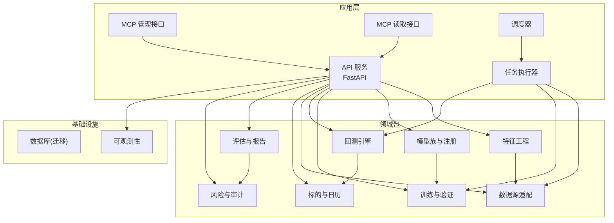
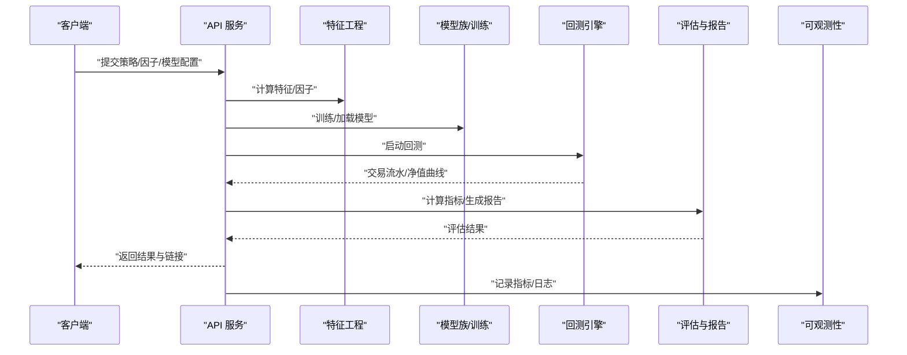
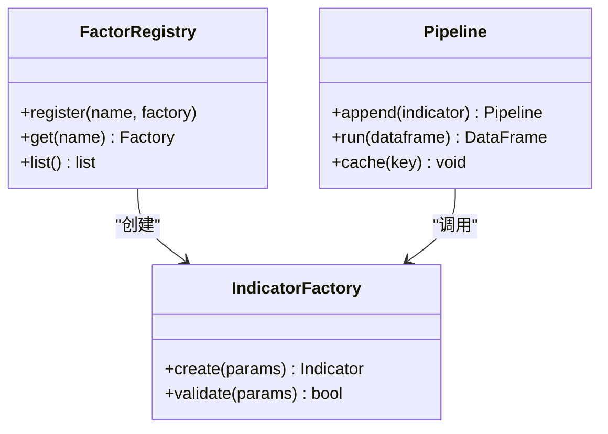
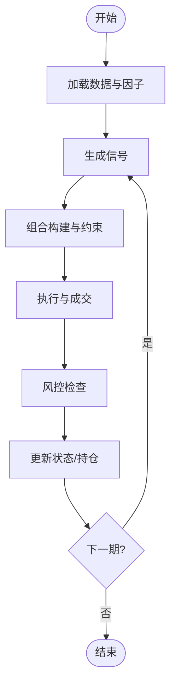
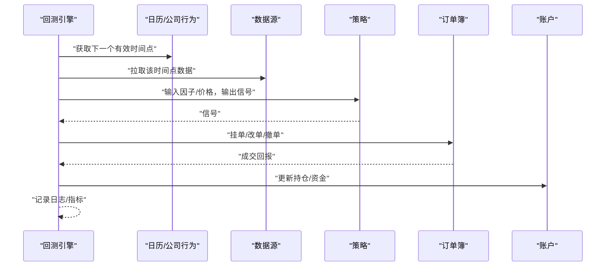
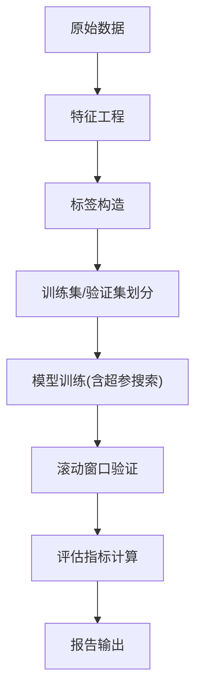
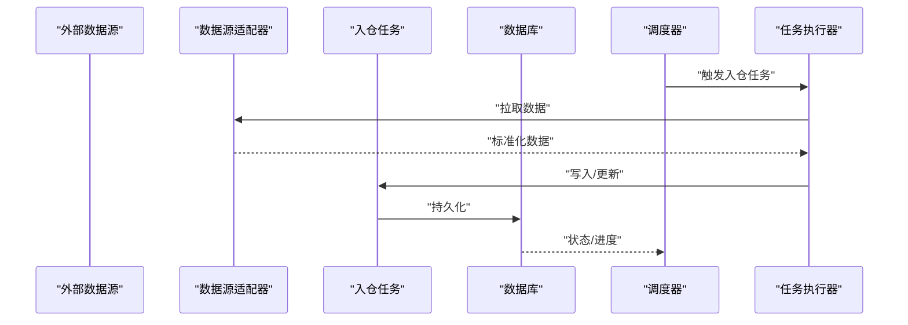
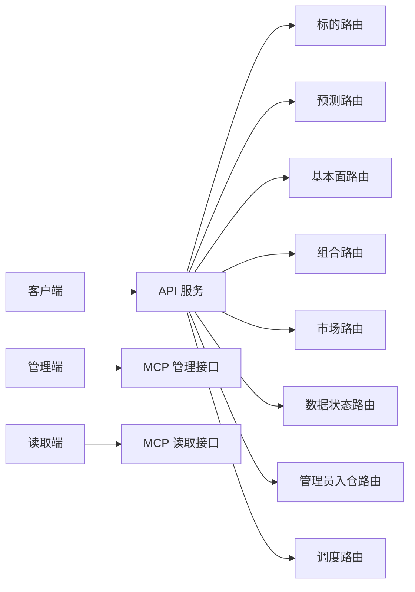
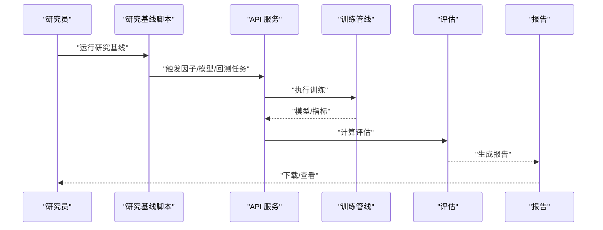
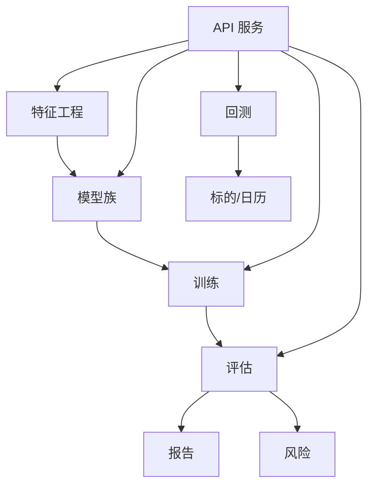

# 量化研究平台

<cite>
**本文引用的文件**   
- [README.md](file://README.md)
- [pyproject.toml](file://pyproject.toml)
- [apps/api/main.py](file://apps/api/main.py)
- [apps/api/deps.py](file://apps/api/deps.py)
- [apps/api/routers/instruments.py](file://apps/api/routers/instruments.py)
- [apps/api/routers/forecast.py](file://apps/api/routers/forecast.py)
- [apps/api/routers/fundamentals.py](file://apps/api/routers/fundamentals.py)
- [apps/api/routers/portfolio.py](file://apps/api/routers/portfolio.py)
- [apps/api/routers/markets.py](file://apps/api/routers/markets.py)
- [apps/api/routers/data_status.py](file://apps/api/routers/data_status.py)
- [apps/api/routers/admin_ingestion.py](file://apps/api/routers/admin_ingestion.py)
- [apps/api/routers/scheduler.py](file://apps/api/routers/scheduler.py)
- [apps/quant-admin-mcp/server.py](file://apps/quant-admin-mcp/server.py)
- [apps/quant-admin-mcp/tools.py](file://apps/quant-admin-mcp/tools.py)
- [apps/quant-read-mcp/server.py](file://apps/quant-read-mcp/server.py)
- [apps/quant-read-mcp/db_backends.py](file://apps/quant-read-mcp/db_backends.py)
- [apps/quant-read-mcp/tools.py](file://apps/quant-read-mcp/tools.py)
- [apps/scheduler/executor.py](file://apps/scheduler/executor.py)
- [apps/scheduler/schedule.py](file://apps/scheduler/schedule.py)
- [apps/worker/main.py](file://apps/worker/main.py)
- [apps/worker/tasks.py](file://apps/worker/tasks.py)
- [packages/backtest/__init__.py](file://packages/backtest/__init__.py)
- [packages/features/__init__.py](file://packages/features/__init__.py)
- [packages/models/__init__.py](file://packages/models/__init__.py)
- [packages/training/__init__.py](file://packages/training/__init__.py)
- [packages/datasets/__init__.py](file://packages/datasets/__init__.py)
- [packages/ingestion/__init__.py](file://packages/ingestion/__init__.py)
- [packages/data_sources/__init__.py](file://packages/data_sources/__init__.py)
- [packages/instrument/__init__.py](file://packages/instrument/__init__.py)
- [packages/instruments/__init__.py](file://packages/instruments/__init__.py)
- [packages/fundamentals/__init__.py](file://packages/fundamentals/__init__.py)
- [packages/fx/__init__.py](file://packages/fx/__init__.py)
- [packages/corporate_actions/__init__.py](file://packages/corporate_actions/__init__.py)
- [packages/calendar_rule/__init__.py](file://packages/calendar_rule/__init__.py)
- [packages/evaluation/__init__.py](file://packages/evaluation/__init__.py)
- [packages/risk/__init__.py](file://packages/risk/__init__.py)
- [packages/reporting/__init__.py](file://packages/reporting/__init__.py)
- [packages/observability/__init__.py](file://packages/observability/__init__.py)
- [packages/audit/__init__.py](file://packages/audit/__init__.py)
- [packages/automation/__init__.py](file://packages/automation/__init__.py)
- [packages/drift/__init__.py](file://packages/drift/__init__.py)
- [packages/labels/__init__.py](file://packages/labels/__init__.py)
- [packages/ledger_paper/__init__.py](file://packages/ledger_paper/__init__.py)
- [packages/broker/__init__.py](file://packages/broker/__init__.py)
- [scripts/run_research_baseline.py](file://scripts/run_research_baseline.py)
- [scripts/register_and_evaluate.py](file://scripts/register_and_evaluate.py)
- [scripts/tune_lightgbm.py](file://scripts/tune_lightgbm.py)
- [scripts/run_paper_trading.py](file://scripts/run_paper_trading.py)
- [sql/migrations/env.py](file://sql/migrations/env.py)
- [deploy/docker-compose.yml](file://deploy/docker-compose.yml)
</cite>

## 目录
1. [简介](#简介)
2. [项目结构](#项目结构)
3. [核心组件](#核心组件)
4. [架构总览](#架构总览)
5. [详细组件分析](#详细组件分析)
6. [依赖关系分析](#依赖关系分析)
7. [性能考虑](#性能考虑)
8. [故障排查指南](#故障排查指南)
9. [结论](#结论)
10. [附录](#附录)

## 简介
本技术文档面向量化研究平台的研发与运维人员，系统性阐述因子库管理、策略开发框架与回测引擎设计，并覆盖机器学习模型训练、特征工程与评估流程。文档同时给出技术指标计算、因子研究与策略开发的完整工作流说明，解释与数据处理管道的集成关系，并提供常见问题定位与性能优化建议。读者无需深入源码即可理解系统能力与最佳实践；需要深入实现细节时，可通过“章节来源”快速定位到具体代码文件。

## 项目结构
仓库采用多包（packages）+ 应用服务（apps）+ 脚本（scripts）的组织方式：
- packages：领域能力与算法实现，如回测、特征、模型、训练、数据集、数据源、事件处理等
- apps：对外暴露的 API、MCP 工具、调度器与任务执行器
- scripts：端到端研究基线、模型注册评估、参数调优、模拟交易等可运行脚本
- sql：数据库迁移定义
- deploy：容器编排与监控配置

图表来源
- [apps/api/main.py:1-200](file://apps/api/main.py#L1-L200)
- [packages/backtest/__init__.py:1-200](file://packages/backtest/__init__.py#L1-L200)
- [packages/features/__init__.py:1-200](file://packages/features/__init__.py#L1-L200)
- [packages/models/__init__.py:1-200](file://packages/models/__init__.py#L1-200)
- [packages/training/__init__.py:1-200](file://packages/training/__init__.py#L1-200)
- [packages/datasets/__init__.py:1-200](file://packages/datasets/__init__.py#L1-200)
- [packages/data_sources/__init__.py:1-200](file://packages/data_sources/__init__.py#L1-200)
- [packages/instrument/__init__.py:1-200](file://packages/instrument/__init__.py#L1-200)
- [packages/instruments/__init__.py:1-200](file://packages/instruments/__init__.py#L1-200)
- [packages/evaluation/__init__.py:1-200](file://packages/evaluation/__init__.py#L1-200)
- [packages/risk/__init__.py:1-200](file://packages/risk/__init__.py#L1-200)
- [packages/observability/__init__.py:1-200](file://packages/observability/__init__.py#L1-200)

章节来源
- [README.md:1-200](file://README.md#L1-L200)
- [pyproject.toml:1-200](file://pyproject.toml#L1-L200)

## 核心组件
- 因子库管理
  - 通过特征工程包提供统一指标与因子计算接口，支持跨市场与多频率数据对齐
  - 因子注册与版本化由模型/训练包协同完成，便于复现与回溯
- 策略开发框架
  - 基于回测引擎封装信号生成、组合构建、成交与风控规则
  - 通过 API 与 MCP 暴露策略注册、回测触发与结果查询能力
- 回测引擎设计
  - 时间步进式执行，内置日历与公司行为校正，保证时序一致性
  - 与数据源解耦，支持离线历史与在线增量
- 机器学习训练与评估
  - 统一的模型族注册、训练管线、交叉验证与滚动窗口（walk-forward）
  - 评估指标与报告输出至报告与风险模块，形成闭环
- 数据处理管道
  - 数据源适配器将外部数据标准化入库，迁移脚本维护 schema 演进
  - 调度器与任务执行器驱动批量入仓、重算与增量更新

章节来源
- [packages/features/__init__.py:1-200](file://packages/features/__init__.py#L1-200)
- [packages/backtest/__init__.py:1-200](file://packages/backtest/__init__.py#L1-200)
- [packages/models/__init__.py:1-200](file://packages/models/__init__.py#L1-200)
- [packages/training/__init__.py:1-200](file://packages/training/__init__.py#L1-200)
- [packages/evaluation/__init__.py:1-200](file://packages/evaluation/__init__.py#L1-200)
- [packages/data_sources/__init__.py:1-200](file://packages/data_sources/__init__.py#L1-200)
- [packages/ingestion/__init__.py:1-200](file://packages/ingestion/__init__.py#L1-200)
- [sql/migrations/env.py:1-200](file://sql/migrations/env.py#L1-200)

## 架构总览
系统以 FastAPI 作为统一入口，聚合各领域包能力；MCP 提供管理与读取两类工具接口；调度器与任务执行器负责批处理与定时任务；数据库通过迁移管理表结构演进；可观测性贯穿全链路。

图表来源
- [apps/api/main.py:1-200](file://apps/api/main.py#L1-L200)
- [packages/features/__init__.py:1-200](file://packages/features/__init__.py#L1-200)
- [packages/models/__init__.py:1-200](file://packages/models/__init__.py#L1-200)
- [packages/training/__init__.py:1-200](file://packages/training/__init__.py#L1-200)
- [packages/backtest/__init__.py:1-200](file://packages/backtest/__init__.py#L1-200)
- [packages/evaluation/__init__.py:1-200](file://packages/evaluation/__init__.py#L1-200)
- [packages/observability/__init__.py:1-200](file://packages/observability/__init__.py#L1-200)

## 详细组件分析

### 因子库管理
- 目标
  - 提供统一的技术指标与因子计算接口，支持多资产类别与多频率数据
  - 因子注册、版本化与依赖解析，确保可复现
- 关键能力
  - 指标工厂：按名称动态实例化指标类，支持参数校验与缓存
  - 因子流水线：顺序/并行组合多个指标，自动处理缺失值与对齐
  - 存储与检索：因子结果持久化，支持按时间窗与标的维度检索
- 最佳实践
  - 使用滑动窗口函数时应显式声明窗口长度与最小样本数
  - 对高频因子进行降采样或分块计算，避免内存峰值
  - 为每个因子标注元数据（作者、适用市场、预期衰减期）

图表来源
- [packages/features/__init__.py:1-200](file://packages/features/__init__.py#L1-200)

章节来源
- [packages/features/__init__.py:1-200](file://packages/features/__init__.py#L1-200)

### 策略开发框架
- 目标
  - 将策略逻辑抽象为信号生成、组合构建、下单与风控四阶段
  - 提供统一接口供 API/MCP 调用，支持回测与模拟交易
- 关键能力
  - 信号模板：趋势/均值回归/截面排序等通用模板
  - 组合约束：权重上限、行业中性、换手率限制
  - 执行模型：滑点、手续费、冲击成本
- 最佳实践
  - 在回测中严格区分信息集与交易时刻，避免未来函数
  - 对极端行情设置止损与仓位熔断
  - 使用滚动窗口评估稳定性，避免过拟合

图表来源
- [packages/backtest/__init__.py:1-200](file://packages/backtest/__init__.py#L1-200)

章节来源
- [packages/backtest/__init__.py:1-200](file://packages/backtest/__init__.py#L1-200)

### 回测引擎设计
- 目标
  - 提供高保真、可扩展的回测内核，支持多资产、多频率与复杂公司行为
- 关键能力
  - 时间步进器：按交易日/分钟级推进，处理停牌、涨跌停、早收市
  - 订单簿与撮合：限价/市价单、部分成交、撤单与延迟
  - 账户与费用：保证金、杠杆、费率、税费
- 最佳实践
  - 使用事件驱动而非轮询，降低 CPU 占用
  - 对大资金场景引入冲击成本与流动性约束
  - 对长周期回测启用分片与断点续跑

图表来源
- [packages/backtest/__init__.py:1-200](file://packages/backtest/__init__.py#L1-200)
- [packages/instrument/__init__.py:1-200](file://packages/instrument/__init__.py#L1-200)
- [packages/instruments/__init__.py:1-200](file://packages/instruments/__init__.py#L1-200)
- [packages/corporate_actions/__init__.py:1-200](file://packages/corporate_actions/__init__.py#L1-200)
- [packages/calendar_rule/__init__.py:1-200](file://packages/calendar_rule/__init__.py#L1-200)

章节来源
- [packages/backtest/__init__.py:1-200](file://packages/backtest/__init__.py#L1-200)
- [packages/instrument/__init__.py:1-200](file://packages/instrument/__init__.py#L1-200)
- [packages/instruments/__init__.py:1-200](file://packages/instruments/__init__.py#L1-200)
- [packages/corporate_actions/__init__.py:1-200](file://packages/corporate_actions/__init__.py#L1-200)
- [packages/calendar_rule/__init__.py:1-200](file://packages/calendar_rule/__init__.py#L1-200)

### 机器学习模型训练、特征工程与评估
- 目标
  - 提供从特征工程、模型训练到评估报告的端到端流水线
- 关键能力
  - 特征工程：标准化、缺失值填充、滞后/滚动统计、截面排名
  - 模型族：线性/树模型/深度学习等，统一注册与超参搜索
  - 训练策略：K 折/滚动窗口（walk-forward），防止前视偏差
  - 评估指标：IC/IR、年化收益、最大回撤、夏普比率、换手率
- 最佳实践
  - 使用分层抽样保持行业/风格分布一致
  - 对强相关特征做去噪与降维
  - 定期重估模型漂移并触发再训练

图表来源
- [packages/features/__init__.py:1-200](file://packages/features/__init__.py#L1-200)
- [packages/models/__init__.py:1-200](file://packages/models/__init__.py#L1-200)
- [packages/training/__init__.py:1-200](file://packages/training/__init__.py#L1-200)
- [packages/evaluation/__init__.py:1-200](file://packages/evaluation/__init__.py#L1-200)

章节来源
- [packages/features/__init__.py:1-200](file://packages/features/__init__.py#L1-200)
- [packages/models/__init__.py:1-200](file://packages/models/__init__.py#L1-200)
- [packages/training/__init__.py:1-200](file://packages/training/__init__.py#L1-200)
- [packages/evaluation/__init__.py:1-200](file://packages/evaluation/__init__.py#L1-200)

### 数据处理管道与集成
- 目标
  - 将多源异构数据标准化入库，支撑因子与策略稳定运行
- 关键能力
  - 数据源适配器：对接交易所/第三方数据，统一字段与时区
  - 入仓任务：批量导入、增量同步、冲突合并与幂等写入
  - 迁移管理：Schema 演进与版本控制
- 最佳实践
  - 入仓过程增加数据质量校验与告警
  - 对大表分区与索引优化查询性能
  - 建立数据血缘与可追溯性

图表来源
- [packages/data_sources/__init__.py:1-200](file://packages/data_sources/__init__.py#L1-200)
- [packages/ingestion/__init__.py:1-200](file://packages/ingestion/__init__.py#L1-200)
- [apps/scheduler/executor.py:1-200](file://apps/scheduler/executor.py#L1-200)
- [apps/scheduler/schedule.py:1-200](file://apps/scheduler/schedule.py#L1-200)
- [apps/worker/main.py:1-200](file://apps/worker/main.py#L1-200)
- [apps/worker/tasks.py:1-200](file://apps/worker/tasks.py#L1-200)
- [sql/migrations/env.py:1-200](file://sql/migrations/env.py#L1-200)

章节来源
- [packages/data_sources/__init__.py:1-200](file://packages/data_sources/__init__.py#L1-200)
- [packages/ingestion/__init__.py:1-200](file://packages/ingestion/__init__.py#L1-200)
- [apps/scheduler/executor.py:1-200](file://apps/scheduler/executor.py#L1-200)
- [apps/scheduler/schedule.py:1-200](file://apps/scheduler/schedule.py#L1-200)
- [apps/worker/main.py:1-200](file://apps/worker/main.py#L1-200)
- [apps/worker/tasks.py:1-200](file://apps/worker/tasks.py#L1-200)
- [sql/migrations/env.py:1-200](file://sql/migrations/env.py#L1-200)

### API 与 MCP 服务
- API 路由
  - 标的、行情、基本面、预测、组合、市场、数据状态、管理员入仓、调度等
- MCP 工具
  - 管理侧：入仓、迁移、任务管理等
  - 读取侧：查询因子、模型、回测结果等
- 依赖注入
  - 统一的服务装配与生命周期管理

图表来源
- [apps/api/main.py:1-200](file://apps/api/main.py#L1-200)
- [apps/api/routers/instruments.py:1-200](file://apps/api/routers/instruments.py#L1-200)
- [apps/api/routers/forecast.py:1-200](file://apps/api/routers/forecast.py#L1-200)
- [apps/api/routers/fundamentals.py:1-200](file://apps/api/routers/fundamentals.py#L1-200)
- [apps/api/routers/portfolio.py:1-200](file://apps/api/routers/portfolio.py#L1-200)
- [apps/api/routers/markets.py:1-200](file://apps/api/routers/markets.py#L1-200)
- [apps/api/routers/data_status.py:1-200](file://apps/api/routers/data_status.py#L1-200)
- [apps/api/routers/admin_ingestion.py:1-200](file://apps/api/routers/admin_ingestion.py#L1-200)
- [apps/api/routers/scheduler.py:1-200](file://apps/api/routers/scheduler.py#L1-200)
- [apps/quant-admin-mcp/server.py:1-200](file://apps/quant-admin-mcp/server.py#L1-200)
- [apps/quant-admin-mcp/tools.py:1-200](file://apps/quant-admin-mcp/tools.py#L1-200)
- [apps/quant-read-mcp/server.py:1-200](file://apps/quant-read-mcp/server.py#L1-200)
- [apps/quant-read-mcp/db_backends.py:1-200](file://apps/quant-read-mcp/db_backends.py#L1-200)
- [apps/quant-read-mcp/tools.py:1-200](file://apps/quant-read-mcp/tools.py#L1-200)
- [apps/api/deps.py:1-200](file://apps/api/deps.py#L1-200)

章节来源
- [apps/api/main.py:1-200](file://apps/api/main.py#L1-200)
- [apps/api/deps.py:1-200](file://apps/api/deps.py#L1-200)
- [apps/api/routers/instruments.py:1-200](file://apps/api/routers/instruments.py#L1-200)
- [apps/api/routers/forecast.py:1-200](file://apps/api/routers/forecast.py#L1-200)
- [apps/api/routers/fundamentals.py:1-200](file://apps/api/routers/fundamentals.py#L1-200)
- [apps/api/routers/portfolio.py:1-200](file://apps/api/routers/portfolio.py#L1-200)
- [apps/api/routers/markets.py:1-200](file://apps/api/routers/markets.py#L1-200)
- [apps/api/routers/data_status.py:1-200](file://apps/api/routers/data_status.py#L1-200)
- [apps/api/routers/admin_ingestion.py:1-200](file://apps/api/routers/admin_ingestion.py#L1-200)
- [apps/api/routers/scheduler.py:1-200](file://apps/api/routers/scheduler.py#L1-200)
- [apps/quant-admin-mcp/server.py:1-200](file://apps/quant-admin-mcp/server.py#L1-200)
- [apps/quant-admin-mcp/tools.py:1-200](file://apps/quant-admin-mcp/tools.py#L1-200)
- [apps/quant-read-mcp/server.py:1-200](file://apps/quant-read-mcp/server.py#L1-200)
- [apps/quant-read-mcp/db_backends.py:1-200](file://apps/quant-read-mcp/db_backends.py#L1-200)
- [apps/quant-read-mcp/tools.py:1-200](file://apps/quant-read-mcp/tools.py#L1-200)

### 端到端研究基线与脚本
- 研究基线：一键运行因子研究、模型训练与回测评估
- 模型注册与评估：将模型登记入库并产出评估报告
- 参数调优：网格/随机/贝叶斯搜索
- 模拟交易：连接纸交易通道，回放策略

图表来源
- [scripts/run_research_baseline.py:1-200](file://scripts/run_research_baseline.py#L1-200)
- [scripts/register_and_evaluate.py:1-200](file://scripts/register_and_evaluate.py#L1-200)
- [scripts/tune_lightgbm.py:1-200](file://scripts/tune_lightgbm.py#L1-200)
- [scripts/run_paper_trading.py:1-200](file://scripts/run_paper_trading.py#L1-200)

章节来源
- [scripts/run_research_baseline.py:1-200](file://scripts/run_research_baseline.py#L1-200)
- [scripts/register_and_evaluate.py:1-200](file://scripts/register_and_evaluate.py#L1-200)
- [scripts/tune_lightgbm.py:1-200](file://scripts/tune_lightgbm.py#L1-200)
- [scripts/run_paper_trading.py:1-200](file://scripts/run_paper_trading.py#L1-200)

## 依赖关系分析
- 包内耦合
  - 特征与模型/训练紧密协作，回测依赖标的与日历
  - 评估与报告/风险模块共同输出决策依据
- 外部依赖
  - 数据库迁移、容器编排与监控
- 潜在循环依赖
  - 通过 API 层解耦领域包，避免直接相互引用

图表来源
- [packages/features/__init__.py:1-200](file://packages/features/__init__.py#L1-200)
- [packages/models/__init__.py:1-200](file://packages/models/__init__.py#L1-200)
- [packages/training/__init__.py:1-200](file://packages/training/__init__.py#L1-200)
- [packages/backtest/__init__.py:1-200](file://packages/backtest/__init__.py#L1-200)
- [packages/instrument/__init__.py:1-200](file://packages/instrument/__init__.py#L1-200)
- [packages/instruments/__init__.py:1-200](file://packages/instruments/__init__.py#L1-200)
- [packages/evaluation/__init__.py:1-200](file://packages/evaluation/__init__.py#L1-200)
- [packages/reporting/__init__.py:1-200](file://packages/reporting/__init__.py#L1-200)
- [packages/risk/__init__.py:1-200](file://packages/risk/__init__.py#L1-200)
- [apps/api/main.py:1-200](file://apps/api/main.py#L1-200)

章节来源
- [packages/features/__init__.py:1-200](file://packages/features/__init__.py#L1-200)
- [packages/models/__init__.py:1-200](file://packages/models/__init__.py#L1-200)
- [packages/training/__init__.py:1-200](file://packages/training/__init__.py#L1-200)
- [packages/backtest/__init__.py:1-200](file://packages/backtest/__init__.py#L1-200)
- [packages/instrument/__init__.py:1-200](file://packages/instrument/__init__.py#L1-200)
- [packages/instruments/__init__.py:1-200](file://packages/instruments/__init__.py#L1-200)
- [packages/evaluation/__init__.py:1-200](file://packages/evaluation/__init__.py#L1-200)
- [packages/reporting/__init__.py:1-200](file://packages/reporting/__init__.py#L1-200)
- [packages/risk/__init__.py:1-200](file://packages/risk/__init__.py#L1-200)
- [apps/api/main.py:1-200](file://apps/api/main.py#L1-200)

## 性能考虑
- 计算与内存
  - 向量化优先，避免逐行循环；对大数据集使用分块/惰性计算
  - 因子结果缓存与增量更新，减少重复计算
- I/O 与存储
  - 列存格式与分区键优化查询；热点表加索引
  - 读写分离与连接池复用
- 并发与扩展
  - 任务队列横向扩展 worker；回测按标的/时间分片并行
  - 模型训练使用分布式/混合精度
- 监控与可观测性
  - 指标埋点、慢查询追踪、错误告警与资源水位监控

[本节为通用指导，不直接分析具体文件]

## 故障排查指南
- 常见问题
  - 数据缺失/不一致：检查数据源适配器与入仓任务日志，确认时间戳与时区
  - 回测异常：核对日历与公司行为校正，确认未使用前向信息
  - 模型不稳定：检查特征分布漂移与标签泄露，调整正则与窗口
  - 任务失败：查看调度器与 worker 日志，重试与隔离问题任务
- 定位方法
  - 通过 API 的数据状态路由与可观测性指标定位瓶颈
  - 使用 MCP 读取接口快速验证中间结果
  - 结合迁移与环境配置，确认数据库与服务版本一致

章节来源
- [apps/api/routers/data_status.py:1-200](file://apps/api/routers/data_status.py#L1-200)
- [apps/quant-read-mcp/tools.py:1-200](file://apps/quant-read-mcp/tools.py#L1-200)
- [apps/quant-read-mcp/db_backends.py:1-200](file://apps/quant-read-mcp/db_backends.py#L1-200)
- [apps/scheduler/executor.py:1-200](file://apps/scheduler/executor.py#L1-200)
- [apps/worker/tasks.py:1-200](file://apps/worker/tasks.py#L1-200)
- [packages/observability/__init__.py:1-200](file://packages/observability/__init__.py#L1-200)

## 结论
本平台以模块化领域包为核心，通过 API/MCP 暴露统一能力，配合调度与任务执行体系，形成从数据入仓、因子研究、模型训练到回测评估的完整闭环。遵循本文的最佳实践与性能建议，可在保障稳健性的前提下持续提升研发效率与策略表现。

## 附录
- 部署参考
  - 容器编排与监控配置位于部署目录，可按需调整资源与副本数
- 示例脚本
  - 研究基线、模型注册评估、参数调优与模拟交易脚本可直接运行，便于快速上手

章节来源
- [deploy/docker-compose.yml:1-200](file://deploy/docker-compose.yml#L1-200)
- [scripts/run_research_baseline.py:1-200](file://scripts/run_research_baseline.py#L1-200)
- [scripts/register_and_evaluate.py:1-200](file://scripts/register_and_evaluate.py#L1-200)
- [scripts/tune_lightgbm.py:1-200](file://scripts/tune_lightgbm.py#L1-200)
- [scripts/run_paper_trading.py:1-200](file://scripts/run_paper_trading.py#L1-200)