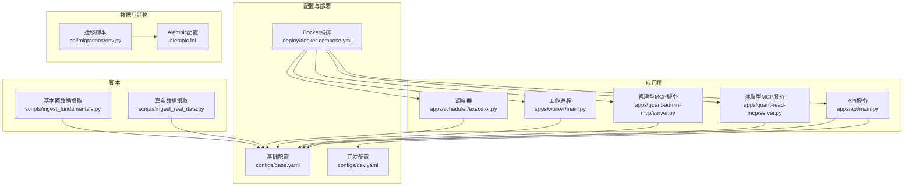
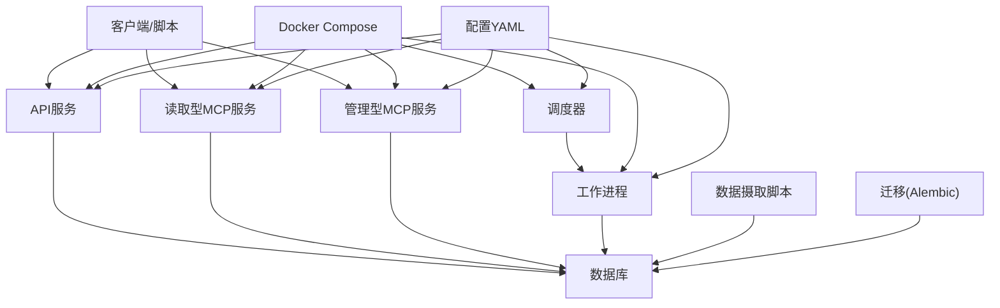
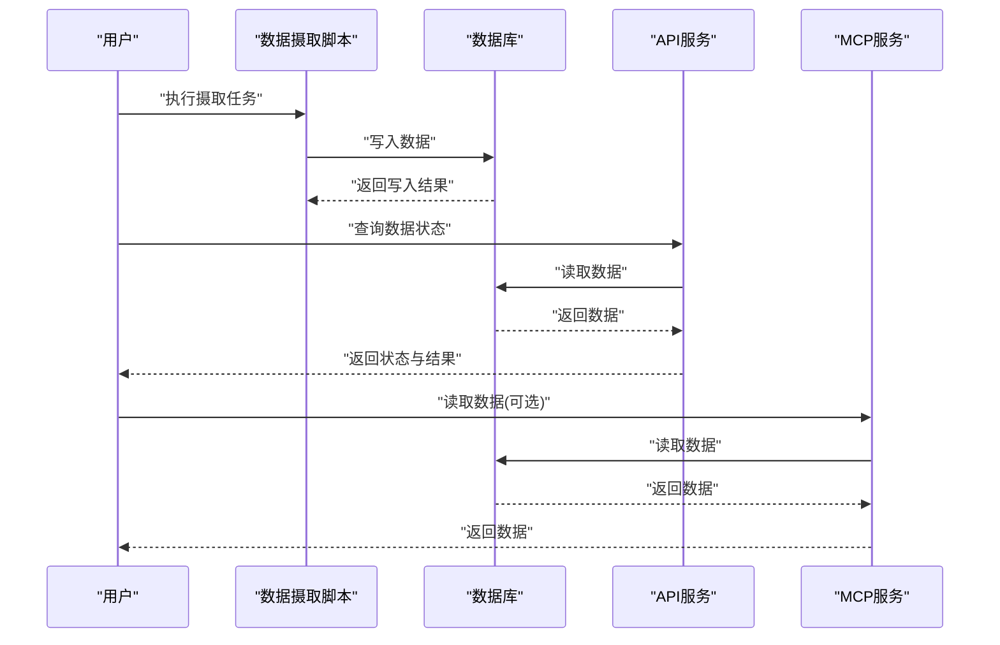
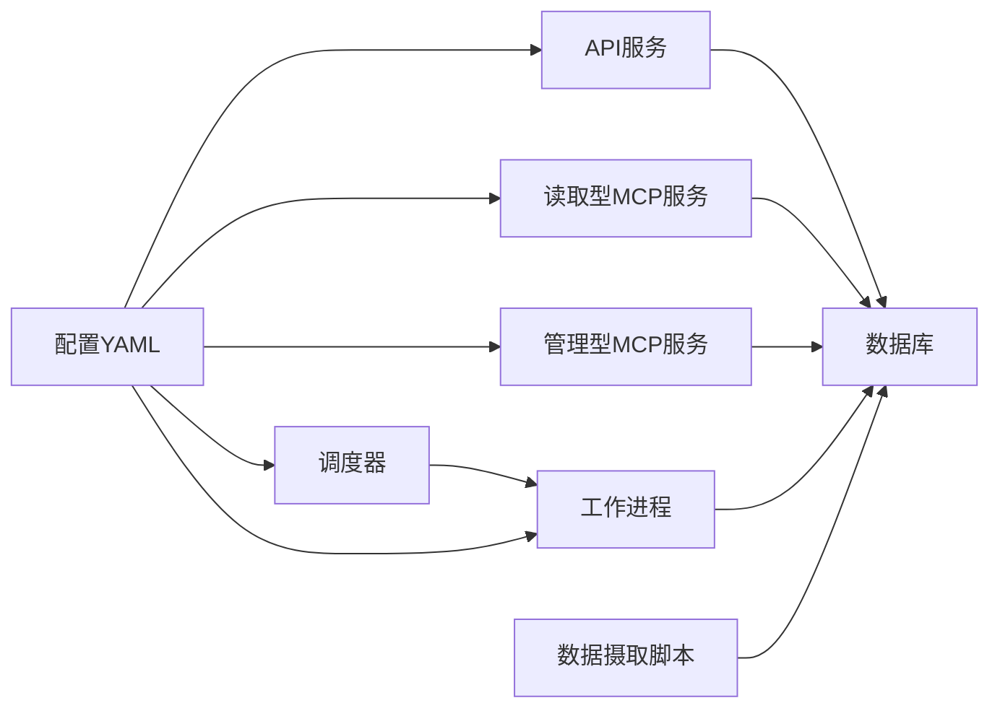

# 快速开始指南

<cite>
**本文引用的文件**   
- [README.md](file://README.md)
- [pyproject.toml](file://pyproject.toml)
- [deploy/docker-compose.yml](file://deploy/docker-compose.yml)
- [deploy/README.md](file://deploy/README.md)
- [configs/base.yaml](file://configs/base.yaml)
- [configs/dev.yaml](file://configs/dev.yaml)
- [apps/api/main.py](file://apps/api/main.py)
- [apps/quant-read-mcp/server.py](file://apps/quant-read-mcp/server.py)
- [apps/quant-admin-mcp/server.py](file://apps/quant-admin-mcp/server.py)
- [scripts/ingest_real_data.py](file://scripts/ingest_real_data.py)
- [scripts/ingest_fundamentals.py](file://scripts/ingest_fundamentals.py)
- [sql/migrations/env.py](file://sql/migrations/env.py)
- [alembic.ini](file://alembic.ini)
</cite>

## 目录
1. [简介](#简介)
2. [项目结构](#项目结构)
3. [核心组件](#核心组件)
4. [架构总览](#架构总览)
5. [详细组件分析](#详细组件分析)
6. [依赖关系分析](#依赖关系分析)
7. [性能考虑](#性能考虑)
8. [故障排查指南](#故障排查指南)
9. [结论](#结论)
10. [附录](#附录)

## 简介
本快速开始指南面向首次接触量化交易MCP项目的用户，目标是帮助你在最短时间内完成环境搭建、容器化部署与首个数据摄取任务的运行。你将学到：
- Python版本要求与依赖安装
- 数据库配置与迁移初始化
- Docker与docker-compose部署方式
- 第一个数据摄取任务（从配置到执行）的完整流程
- 常见问题定位与解决方案
- 最小可运行示例，确保在约30分钟内看到系统效果

## 项目结构
仓库采用多应用与多包的组织方式：
- apps：包含API服务、MCP服务器、调度器与工作进程等运行时组件
- configs：环境与配置管理
- deploy：Docker与编排相关资源
- scripts：常用脚本（数据摄取、回测、研究基线等）
- packages：领域功能包（数据源、特征、模型、风控等）
- sql/migrations：数据库迁移脚本
- tests：单元测试与集成测试

图表来源
- [apps/api/main.py](file://apps/api/main.py)
- [apps/quant-read-mcp/server.py](file://apps/quant-read-mcp/server.py)
- [apps/quant-admin-mcp/server.py](file://apps/quant-admin-mcp/server.py)
- [deploy/docker-compose.yml](file://deploy/docker-compose.yml)
- [configs/base.yaml](file://configs/base.yaml)
- [configs/dev.yaml](file://configs/dev.yaml)
- [sql/migrations/env.py](file://sql/migrations/env.py)
- [alembic.ini](file://alembic.ini)

章节来源
- [README.md](file://README.md)
- [deploy/docker-compose.yml](file://deploy/docker-compose.yml)
- [deploy/README.md](file://deploy/README.md)

## 核心组件
- API服务：提供REST接口，用于查询市场、标的、基本面、预测与组合等能力
- MCP服务：提供模型上下文协议（MCP）的读取与管理接口，便于外部工具调用
- 工作进程与调度器：负责异步任务执行与定时调度
- 配置中心：通过YAML配置文件管理不同环境的参数
- 数据摄取脚本：将外部数据写入数据库，供后续分析与建模使用
- 数据库迁移：基于Alembic进行数据库结构演进

章节来源
- [apps/api/main.py](file://apps/api/main.py)
- [apps/quant-read-mcp/server.py](file://apps/quant-read-mcp/server.py)
- [apps/quant-admin-mcp/server.py](file://apps/quant-admin-mcp/server.py)
- [configs/base.yaml](file://configs/base.yaml)
- [configs/dev.yaml](file://configs/dev.yaml)
- [scripts/ingest_real_data.py](file://scripts/ingest_real_data.py)
- [scripts/ingest_fundamentals.py](file://scripts/ingest_fundamentals.py)
- [sql/migrations/env.py](file://sql/migrations/env.py)
- [alembic.ini](file://alembic.ini)

## 架构总览
下图展示了本地开发与容器化部署的整体交互关系。API与MCP服务对外暴露接口；工作进程与调度器处理后台任务；数据摄取脚本将外部数据写入数据库；配置与迁移分别由YAML与Alembic管理。

图表来源
- [deploy/docker-compose.yml](file://deploy/docker-compose.yml)
- [apps/api/main.py](file://apps/api/main.py)
- [apps/quant-read-mcp/server.py](file://apps/quant-read-mcp/server.py)
- [apps/quant-admin-mcp/server.py](file://apps/quant-admin-mcp/server.py)
- [configs/base.yaml](file://configs/base.yaml)
- [sql/migrations/env.py](file://sql/migrations/env.py)
- [alembic.ini](file://alembic.ini)

## 详细组件分析

### 环境准备与依赖安装
- Python版本要求
  - 请查看项目根目录的依赖声明文件以确认Python版本约束与第三方库列表。
- 依赖安装
  - 推荐使用虚拟环境隔离依赖，然后依据依赖声明文件安装所需包。
- 数据库驱动与连接
  - 根据配置文件中数据库连接信息，确保已安装对应数据库驱动并正确设置连接字符串。

章节来源
- [pyproject.toml](file://pyproject.toml)
- [configs/base.yaml](file://configs/base.yaml)
- [configs/dev.yaml](file://configs/dev.yaml)

### 数据库配置与迁移初始化
- 配置数据库连接
  - 在配置文件中设置数据库URL、用户名、密码、主机与端口等关键参数。
- 初始化数据库结构
  - 使用Alembic对数据库进行迁移初始化与升级，确保表结构与字段定义就绪。
- 验证连通性
  - 启动后通过API或MCP服务的健康检查端点验证数据库连通性。

章节来源
- [configs/base.yaml](file://configs/base.yaml)
- [configs/dev.yaml](file://configs/dev.yaml)
- [sql/migrations/env.py](file://sql/migrations/env.py)
- [alembic.ini](file://alembic.ini)

### Docker容器化部署
- 使用docker-compose一键拉起服务
  - 参考编排文件与服务定义，启动API、MCP服务、工作进程与调度器等组件。
- 环境变量与配置挂载
  - 可通过环境变量覆盖默认配置，或将配置文件挂载至容器内指定路径。
- 数据持久化
  - 为数据库卷与日志目录配置持久化存储，避免重启导致数据丢失。
- 网络与端口映射
  - 确认宿主机端口未被占用，并根据需要调整端口映射。

章节来源
- [deploy/docker-compose.yml](file://deploy/docker-compose.yml)
- [deploy/README.md](file://deploy/README.md)
- [configs/base.yaml](file://configs/base.yaml)
- [configs/dev.yaml](file://configs/dev.yaml)

### 第一个数据摄取任务（端到端示例）
以下流程帮助你完成从配置到运行的完整闭环，建议在本地或容器中执行：
- 步骤一：准备环境
  - 确认Python版本满足要求，安装依赖，配置数据库连接。
- 步骤二：初始化数据库
  - 执行Alembic迁移，创建必要表结构。
- 步骤三：启动服务
  - 使用docker-compose启动API与MCP服务，或本地启动相应进程。
- 步骤四：运行数据摄取脚本
  - 选择“真实数据”或“基本面数据”摄取脚本，按提示填写必要参数（如数据源、时间范围、输出目标）。
- 步骤五：验证结果
  - 通过API或MCP服务查询数据状态，确认数据已成功入库并可被消费。

图表来源
- [scripts/ingest_real_data.py](file://scripts/ingest_real_data.py)
- [scripts/ingest_fundamentals.py](file://scripts/ingest_fundamentals.py)
- [apps/api/main.py](file://apps/api/main.py)
- [apps/quant-read-mcp/server.py](file://apps/quant-read-mcp/server.py)
- [sql/migrations/env.py](file://sql/migrations/env.py)

章节来源
- [scripts/ingest_real_data.py](file://scripts/ingest_real_data.py)
- [scripts/ingest_fundamentals.py](file://scripts/ingest_fundamentals.py)
- [apps/api/main.py](file://apps/api/main.py)
- [apps/quant-read-mcp/server.py](file://apps/quant-read-mcp/server.py)
- [sql/migrations/env.py](file://sql/migrations/env.py)

### 最小可运行示例（30分钟见效）
- 本地快速体验
  - 安装Python与依赖，配置数据库，执行迁移，启动API与MCP服务，运行一个轻量级数据摄取脚本，并通过API查询数据状态。
- 容器快速体验
  - 使用docker-compose拉起所有服务，执行数据摄取脚本（可在同一Compose网络中运行），随后通过API或MCP服务验证数据。

章节来源
- [deploy/docker-compose.yml](file://deploy/docker-compose.yml)
- [scripts/ingest_real_data.py](file://scripts/ingest_real_data.py)
- [apps/api/main.py](file://apps/api/main.py)
- [apps/quant-read-mcp/server.py](file://apps/quant-read-mcp/server.py)

## 依赖关系分析
- 组件耦合
  - API与MCP服务均依赖数据库与配置文件；工作进程与调度器依赖数据库与任务队列（若启用）。
- 外部依赖
  - 数据库驱动、HTTP框架、Alembic迁移工具、Docker与Compose。
- 潜在循环依赖
  - 当前结构清晰分层，未见明显循环导入；建议保持模块边界明确。

图表来源
- [apps/api/main.py](file://apps/api/main.py)
- [apps/quant-read-mcp/server.py](file://apps/quant-read-mcp/server.py)
- [apps/quant-admin-mcp/server.py](file://apps/quant-admin-mcp/server.py)
- [configs/base.yaml](file://configs/base.yaml)
- [configs/dev.yaml](file://configs/dev.yaml)

章节来源
- [apps/api/main.py](file://apps/api/main.py)
- [apps/quant-read-mcp/server.py](file://apps/quant-read-mcp/server.py)
- [apps/quant-admin-mcp/server.py](file://apps/quant-admin-mcp/server.py)
- [configs/base.yaml](file://configs/base.yaml)
- [configs/dev.yaml](file://configs/dev.yaml)

## 性能考虑
- 数据库连接池与超时
  - 合理配置连接池大小与超时，避免在高并发下出现连接耗尽。
- 任务批处理与分页
  - 数据摄取时采用分批写入与分页读取，降低内存峰值与单次事务压力。
- 缓存与索引
  - 对高频查询字段建立索引，必要时引入缓存层减少数据库负载。
- 容器资源限制
  - 为各服务设置CPU与内存上限，防止单服务抢占资源影响整体稳定性。

[本节为通用指导，不直接分析具体文件]

## 故障排查指南
- 数据库连接失败
  - 检查配置文件中的数据库URL、用户名、密码与主机端口是否正确；确认数据库服务已启动且允许远程访问。
- 迁移失败
  - 核对Alembic配置与迁移脚本版本；确保数据库权限足够执行DDL操作。
- 端口冲突
  - 修改docker-compose或服务配置中的端口映射，避免与宿主机其他服务冲突。
- 依赖缺失或版本不兼容
  - 重新安装依赖，确保Python版本与依赖声明一致；必要时更新或降级特定包。
- 数据未入库
  - 检查数据摄取脚本的参数与数据源可用性；查看日志定位异常堆栈。

章节来源
- [configs/base.yaml](file://configs/base.yaml)
- [configs/dev.yaml](file://configs/dev.yaml)
- [alembic.ini](file://alembic.ini)
- [deploy/docker-compose.yml](file://deploy/docker-compose.yml)
- [scripts/ingest_real_data.py](file://scripts/ingest_real_data.py)
- [scripts/ingest_fundamentals.py](file://scripts/ingest_fundamentals.py)

## 结论
通过本指南，你已完成环境搭建、容器化部署与首个数据摄取任务的运行。建议在此基础上逐步扩展数据源、完善监控与告警，并结合业务需求定制更多摄取与分析任务。

[本节为总结，不直接分析具体文件]

## 附录
- 常用命令速查
  - 安装依赖：参考依赖声明文件
  - 初始化数据库：执行Alembic迁移
  - 启动服务：使用docker-compose或本地启动
  - 运行摄取脚本：选择合适脚本并传入必要参数
- 参考文档
  - 部署说明：参见部署目录下的README
  - 配置样例：参考基础与开发配置文件

章节来源
- [deploy/README.md](file://deploy/README.md)
- [configs/base.yaml](file://configs/base.yaml)
- [configs/dev.yaml](file://configs/dev.yaml)
- [alembic.ini](file://alembic.ini)