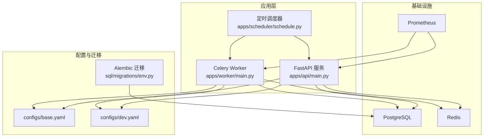
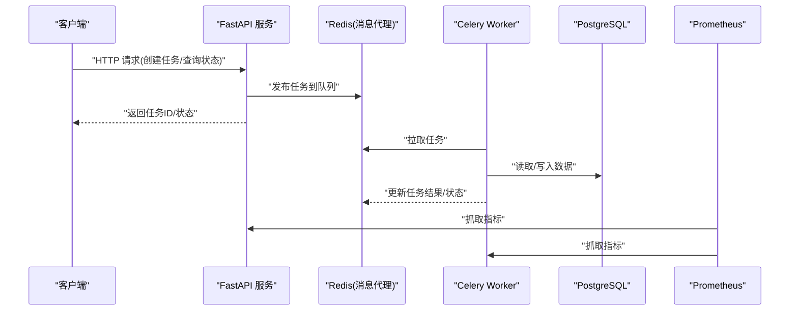
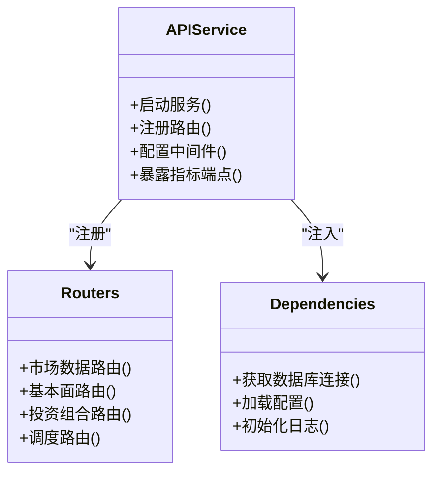
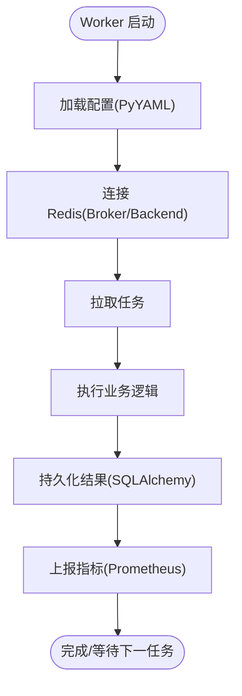
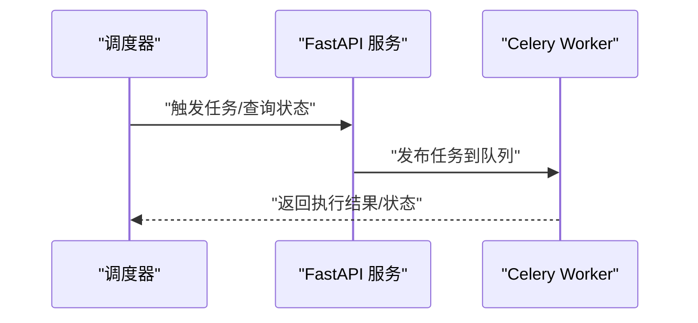
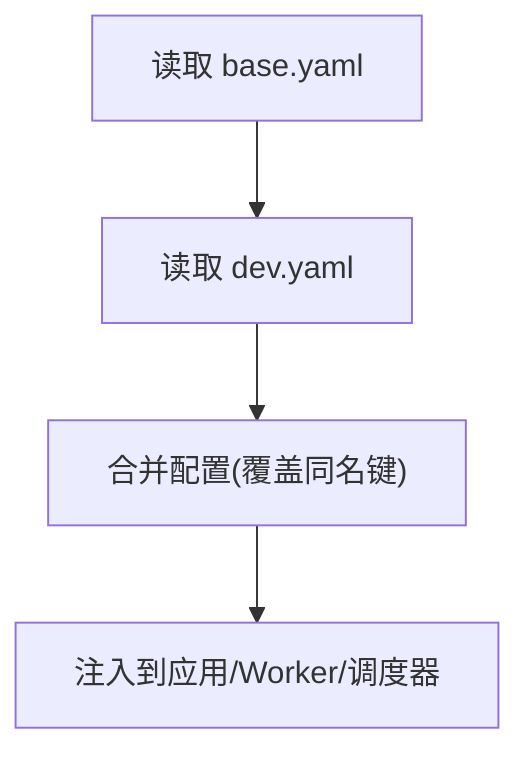
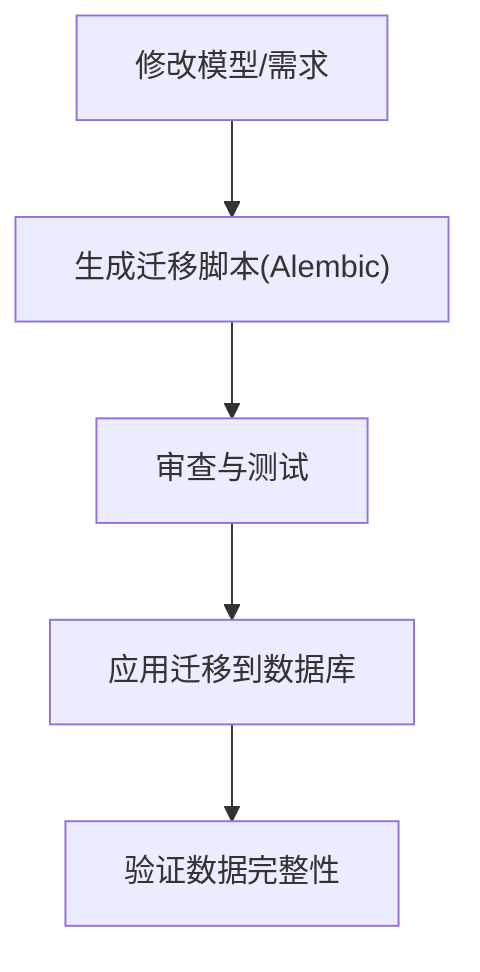
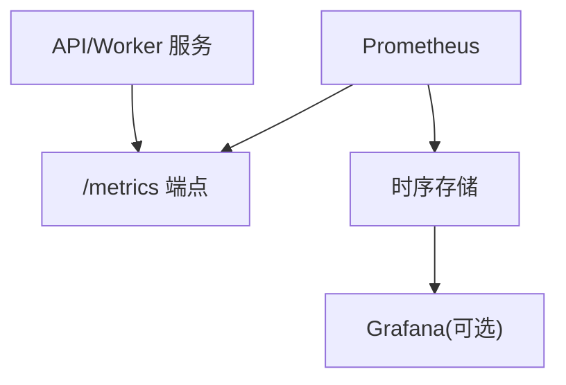
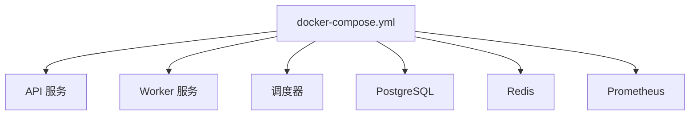
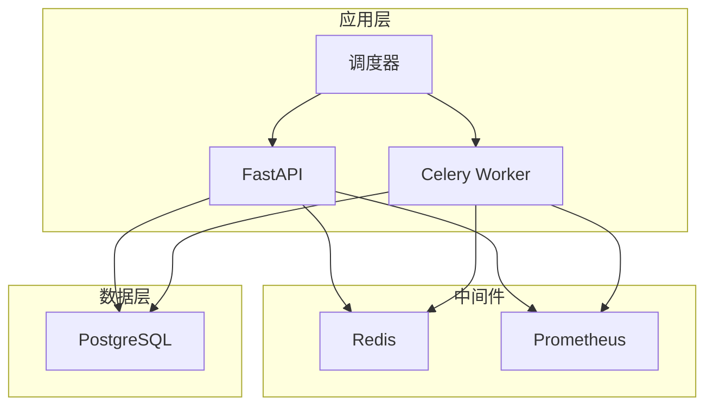

# 技术栈概览

<cite>
**本文引用的文件**   
- [pyproject.toml](file://pyproject.toml)
- [README.md](file://README.md)
- [apps/api/main.py](file://apps/api/main.py)
- [apps/worker/main.py](file://apps/worker/main.py)
- [apps/scheduler/schedule.py](file://apps/scheduler/schedule.py)
- [deploy/docker-compose.yml](file://deploy/docker-compose.yml)
- [deploy/prometheus.yml](file://deploy/prometheus.yml)
- [configs/base.yaml](file://configs/base.yaml)
- [configs/dev.yaml](file://configs/dev.yaml)
- [alembic.ini](file://alembic.ini)
- [sql/migrations/env.py](file://sql/migrations/env.py)
- [scripts/canonical_id.py](file://scripts/canonical_id.py)
- [skills/cross-market-quant-research/SKILL.md](file://skills/cross-market-quant-research/SKILL.md)
</cite>

## 目录
1. [简介](#简介)
2. [项目结构](#项目结构)
3. [核心组件](#核心组件)
4. [架构总览](#架构总览)
5. [详细组件分析](#详细组件分析)
6. [依赖关系分析](#依赖关系分析)
7. [性能与可扩展性](#性能与可扩展性)
8. [故障排查指南](#故障排查指南)
9. [结论](#结论)
10. [附录](#附录)

## 简介
本技术栈概览面向量化数据与策略研究平台，围绕以下目标展开：
- 后端服务：基于 FastAPI 提供高性能、类型友好的 REST API。
- 数据存储：使用 PostgreSQL + SQLAlchemy（Alembic 管理迁移）实现结构化持久化。
- 异步任务：通过 Celery + Redis 构建可伸缩的任务队列，支撑数据采集、加工与回测等耗时操作。
- 容器化与编排：以 Docker Compose 统一本地与开发环境，简化部署。
- 监控与可观测性：集成 Prometheus 指标采集，配合应用内埋点实现运行态可视化。
- 配置管理：采用 PyYAML 进行多环境配置（base.yaml、dev.yaml）。
- 质量与测试：pre-commit 保障代码风格与静态检查；pytest 覆盖单元与集成测试。

该文档既为初学者梳理关键技术概念，也为有经验的开发者提供深入的技术细节与最佳实践建议。

## 项目结构
仓库采用“按领域/功能分层”的组织方式：
- apps：应用层，包含 API 服务、Worker 任务执行器、调度器等。
- packages：业务包集合，如数据源、特征工程、回测、评估、风控、报告等。
- configs：多环境 YAML 配置。
- deploy：Docker Compose 与 Prometheus 配置文件。
- sql/migrations：数据库迁移脚本（Alembic）。
- tests：单元测试与集成测试。
- scripts：辅助脚本。
- skills：技能定义与参考文档。

图表来源
- [apps/api/main.py](file://apps/api/main.py)
- [apps/worker/main.py](file://apps/worker/main.py)
- [apps/scheduler/schedule.py](file://apps/scheduler/schedule.py)
- [deploy/docker-compose.yml](file://deploy/docker-compose.yml)
- [deploy/prometheus.yml](file://deploy/prometheus.yml)
- [configs/base.yaml](file://configs/base.yaml)
- [configs/dev.yaml](file://configs/dev.yaml)
- [sql/migrations/env.py](file://sql/migrations/env.py)

章节来源
- [README.md](file://README.md)
- [pyproject.toml](file://pyproject.toml)

## 核心组件
- 后端框架：FastAPI
  - 优势：高并发、自动 OpenAPI 文档、类型提示驱动、易于集成中间件与依赖注入。
  - 适用场景：REST API、微服务、快速原型与生产级服务。
- 数据库与 ORM：PostgreSQL + SQLAlchemy + Alembic
  - 优势：ACID 事务、丰富数据类型、成熟生态；SQLAlchemy 抽象 SQL 并支持多种方言；Alembic 管理版本化迁移。
  - 适用场景：强一致存储、复杂查询、历史数据归档。
- 任务队列：Celery + Redis
  - 优势：水平扩展、失败重试、延迟任务、结果持久化；Redis 作为消息代理与缓存。
  - 适用场景：批量数据处理、ETL、回测与训练任务。
- 容器化：Docker + Docker Compose
  - 优势：环境一致性、一键拉起依赖、便于 CI/CD。
- 监控：Prometheus
  - 优势：时序指标、灵活告警、与 Grafana 联动。
- 配置管理：PyYAML
  - 优势：多环境配置、易读易维护、支持嵌套结构与引用。
- 代码质量与测试：pre-commit + pytest
  - 优势：提交前自动化检查、统一的测试发现与断言、插件生态丰富。

章节来源
- [pyproject.toml](file://pyproject.toml)
- [deploy/docker-compose.yml](file://deploy/docker-compose.yml)
- [deploy/prometheus.yml](file://deploy/prometheus.yml)
- [configs/base.yaml](file://configs/base.yaml)
- [configs/dev.yaml](file://configs/dev.yaml)
- [alembic.ini](file://alembic.ini)
- [sql/migrations/env.py](file://sql/migrations/env.py)

## 架构总览
系统由 API 服务、Worker 任务执行器、调度器、数据库、消息代理与监控系统组成。API 暴露接口供外部调用；调度器触发周期性或事件型任务；Worker 消费队列中的任务，读写数据库；Prometheus 抓取各服务的指标端点。

图表来源
- [apps/api/main.py](file://apps/api/main.py)
- [apps/worker/main.py](file://apps/worker/main.py)
- [deploy/docker-compose.yml](file://deploy/docker-compose.yml)
- [deploy/prometheus.yml](file://deploy/prometheus.yml)

## 详细组件分析

### 后端服务（FastAPI）
- 职责：路由定义、请求校验、依赖注入、指标暴露、错误处理。
- 关键要点：
  - 启动入口与服务装配位于应用主模块。
  - 路由组织在 routers 目录下，按领域划分。
  - 依赖项（如数据库会话、配置对象）通过依赖注入统一管理。
  - 可选集成 Prometheus 中间件或端点，暴露 /metrics。

图表来源
- [apps/api/main.py](file://apps/api/main.py)

章节来源
- [apps/api/main.py](file://apps/api/main.py)

### 任务执行器（Celery + Redis）
- 职责：消费队列任务、执行业务逻辑、持久化结果、上报指标。
- 关键要点：
  - Worker 启动时加载配置与日志。
  - 任务定义在 tasks 模块中，按领域拆分。
  - 使用 Redis 作为 Broker 与 Backend（可选）。
  - 支持重试、超时、幂等性与去重键。

图表来源
- [apps/worker/main.py](file://apps/worker/main.py)
- [configs/base.yaml](file://configs/base.yaml)
- [configs/dev.yaml](file://configs/dev.yaml)

章节来源
- [apps/worker/main.py](file://apps/worker/main.py)

### 调度器（定时任务）
- 职责：周期性地触发任务或协调工作流。
- 关键要点：
  - 通过 schedule 模块定义调度规则。
  - 可与 API 或 Worker 交互，发布任务或触发 ETL。

图表来源
- [apps/scheduler/schedule.py](file://apps/scheduler/schedule.py)

章节来源
- [apps/scheduler/schedule.py](file://apps/scheduler/schedule.py)

### 配置管理（PyYAML）
- 职责：集中化管理多环境配置，包括数据库连接、Redis、Celery、日志与监控参数。
- 关键要点：
  - base.yaml 提供默认值，dev.yaml 覆盖开发环境差异。
  - 应用启动时合并配置，确保运行时一致性。

图表来源
- [configs/base.yaml](file://configs/base.yaml)
- [configs/dev.yaml](file://configs/dev.yaml)

章节来源
- [configs/base.yaml](file://configs/base.yaml)
- [configs/dev.yaml](file://configs/dev.yaml)

### 数据库与迁移（PostgreSQL + SQLAlchemy + Alembic）
- 职责：数据模型定义、ORM 访问、迁移管理与版本控制。
- 关键要点：
  - env.py 负责生成与执行迁移脚本。
  - alembic.ini 指定数据库 URL 与迁移目录。
  - 迁移脚本位于 sql/migrations/versions。

图表来源
- [alembic.ini](file://alembic.ini)
- [sql/migrations/env.py](file://sql/migrations/env.py)

章节来源
- [alembic.ini](file://alembic.ini)
- [sql/migrations/env.py](file://sql/migrations/env.py)

### 监控（Prometheus）
- 职责：采集服务指标、暴露 /metrics、告警与可视化。
- 关键要点：
  - prometheus.yml 定义抓取目标与标签。
  - 服务需暴露标准指标端点，供 Prometheus 定期拉取。

图表来源
- [deploy/prometheus.yml](file://deploy/prometheus.yml)

章节来源
- [deploy/prometheus.yml](file://deploy/prometheus.yml)

### 容器化（Docker Compose）
- 职责：统一编排服务与依赖，简化本地与开发环境搭建。
- 关键要点：
  - docker-compose.yml 定义 API、Worker、Scheduler、PostgreSQL、Redis、Prometheus 等服务。
  - 环境变量与卷挂载用于配置与数据持久化。

图表来源
- [deploy/docker-compose.yml](file://deploy/docker-compose.yml)

章节来源
- [deploy/docker-compose.yml](file://deploy/docker-compose.yml)

### 工具链与脚本
- pre-commit：提交前执行代码风格与静态检查。
- pytest：发现并运行单元测试与集成测试。
- 辅助脚本：例如 canonical_id.py 用于标识规范化与校验。
- 技能文档：SKILL.md 描述跨市场量化研究技能的使用规范。

章节来源
- [scripts/canonical_id.py](file://scripts/canonical_id.py)
- [skills/cross-market-quant-research/SKILL.md](file://skills/cross-market-quant-research/SKILL.md)

## 依赖关系分析
从应用层到基础设施的依赖关系如下：
- API 服务依赖配置、数据库、Redis、监控。
- Worker 依赖配置、消息代理、数据库、监控。
- 调度器依赖 API 与 Worker。
- 所有服务通过 Docker Compose 编排，共享网络与卷。

图表来源
- [apps/api/main.py](file://apps/api/main.py)
- [apps/worker/main.py](file://apps/worker/main.py)
- [apps/scheduler/schedule.py](file://apps/scheduler/schedule.py)
- [deploy/docker-compose.yml](file://deploy/docker-compose.yml)
- [deploy/prometheus.yml](file://deploy/prometheus.yml)

章节来源
- [pyproject.toml](file://pyproject.toml)
- [deploy/docker-compose.yml](file://deploy/docker-compose.yml)

## 性能与可扩展性
- 水平扩展：
  - Worker 可通过增加实例数提升吞吐；Redis 作为无状态消息代理，适合横向扩展。
  - API 服务可结合反向代理与负载均衡进行扩展。
- 数据库优化：
  - 合理索引与分区策略；读写分离与连接池调优。
- 任务设计：
  - 任务幂等与去重键；失败重试与退避策略；长任务分片与批处理。
- 监控与告警：
  - 关键指标：QPS、延迟、错误率、队列积压、CPU/内存、数据库连接池利用率。
  - 阈值告警与容量规划。

[本节为通用指导，不直接分析具体文件]

## 故障排查指南
- 常见问题定位：
  - 连接问题：检查数据库与 Redis 的连接字符串、端口与网络连通性。
  - 任务失败：查看 Worker 日志、重试次数与错误堆栈；确认任务幂等与资源释放。
  - 指标缺失：确认 /metrics 端点可达、Prometheus 抓取配置正确。
  - 迁移失败：核对 alembic.ini 与 env.py 配置，回滚或修复迁移脚本。
- 调试建议：
  - 启用详细日志与结构化输出。
  - 使用 Docker Compose 的日志聚合与滚动日志。
  - 在本地复现后，逐步隔离问题域（API/Worker/DB/Redis/Prom）。

章节来源
- [deploy/docker-compose.yml](file://deploy/docker-compose.yml)
- [deploy/prometheus.yml](file://deploy/prometheus.yml)
- [alembic.ini](file://alembic.ini)
- [sql/migrations/env.py](file://sql/migrations/env.py)

## 结论
本技术栈以 FastAPI 为核心，结合 PostgreSQL + SQLAlchemy、Celery + Redis、Docker Compose 与 Prometheus，形成高可用、可扩展且可观测的量化数据与策略研究平台。通过 PyYAML 的多环境配置与 pre-commit/pytest 的质量保障体系，团队可在保证稳定性的同时快速迭代。建议在后续演进中持续完善指标体系、任务治理与数据治理规范，进一步提升系统的可靠性与可维护性。

[本节为总结性内容，不直接分析具体文件]

## 附录
- 术语解释：
  - Broker：消息代理，负责任务的分发与传递（本方案使用 Redis）。
  - Backend：任务结果存储（可选，使用 Redis 或数据库）。
  - 幂等：同一任务多次执行不会产生副作用。
  - 迁移：对数据库结构的版本化变更管理。
- 参考路径：
  - 应用入口与路由：[apps/api/main.py](file://apps/api/main.py)
  - Worker 与任务：[apps/worker/main.py](file://apps/worker/main.py)
  - 调度器：[apps/scheduler/schedule.py](file://apps/scheduler/schedule.py)
  - 容器编排：[deploy/docker-compose.yml](file://deploy/docker-compose.yml)
  - 监控配置：[deploy/prometheus.yml](file://deploy/prometheus.yml)
  - 配置管理：[configs/base.yaml](file://configs/base.yaml)、[configs/dev.yaml](file://configs/dev.yaml)
  - 迁移管理：[alembic.ini](file://alembic.ini)、[sql/migrations/env.py](file://sql/migrations/env.py)
  - 工具与脚本：[scripts/canonical_id.py](file://scripts/canonical_id.py)、[skills/cross-market-quant-research/SKILL.md](file://skills/cross-market-quant-research/SKILL.md)