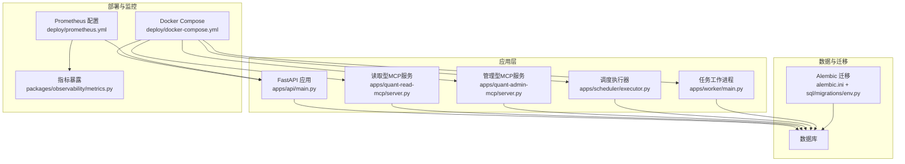
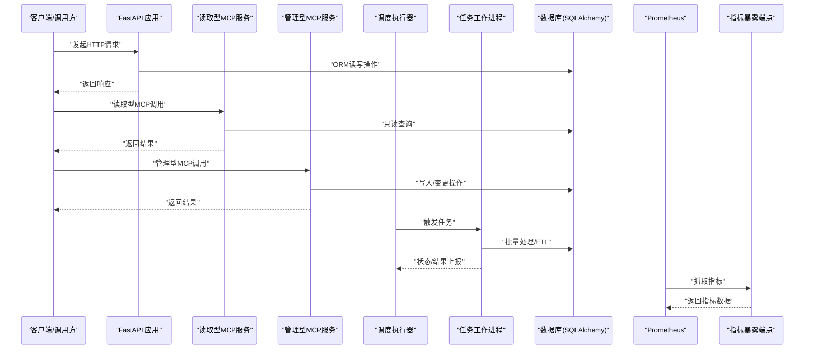
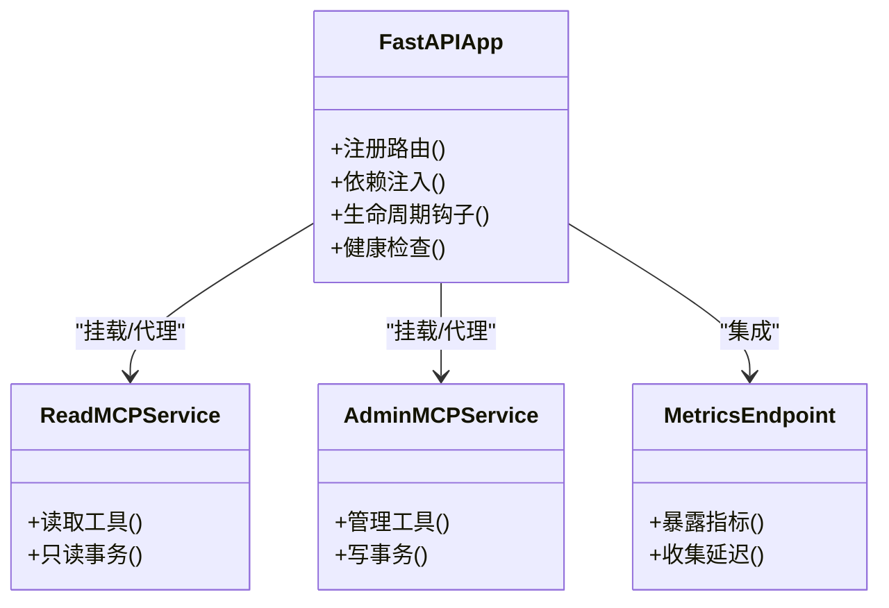
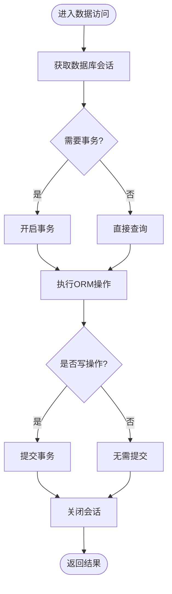
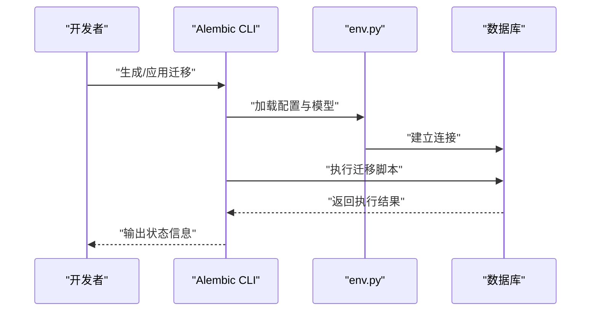
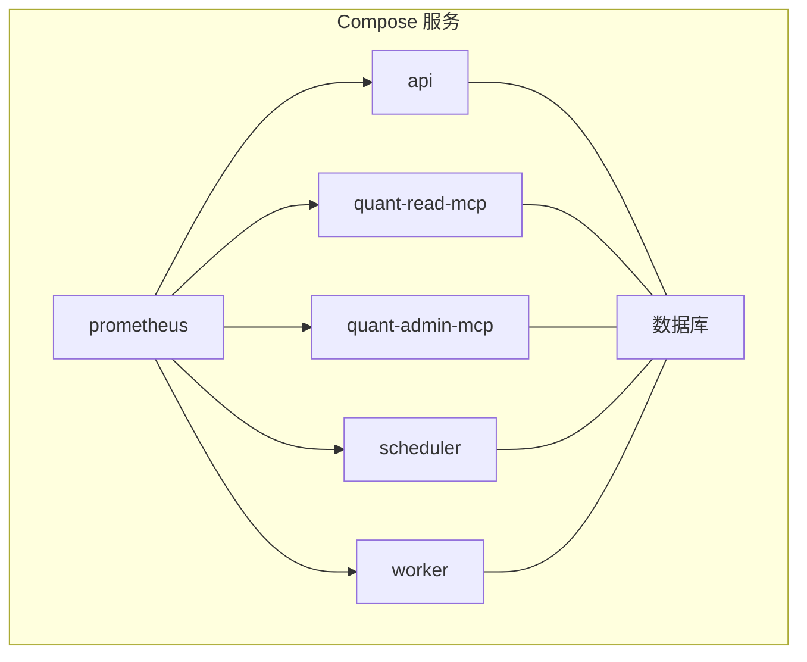
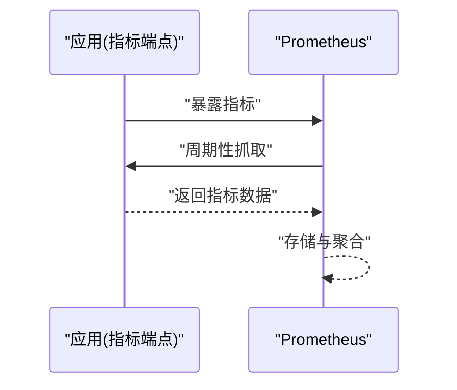

# 技术栈概览

<cite>
**本文引用的文件**   
- [README.md](file://README.md)
- [pyproject.toml](file://pyproject.toml)
- [apps/api/main.py](file://apps/api/main.py)
- [apps/quant-read-mcp/server.py](file://apps/quant-read-mcp/server.py)
- [apps/quant-admin-mcp/server.py](file://apps/quant-admin-mcp/server.py)
- [apps/scheduler/executor.py](file://apps/scheduler/executor.py)
- [apps/worker/main.py](file://apps/worker/main.py)
- [deploy/docker-compose.yml](file://deploy/docker-compose.yml)
- [deploy/prometheus.yml](file://deploy/prometheus.yml)
- [alembic.ini](file://alembic.ini)
- [sql/migrations/env.py](file://sql/migrations/env.py)
- [packages/observability/metrics.py](file://packages/observability/metrics.py)
</cite>

## 目录
1. [简介](#简介)
2. [项目结构](#项目结构)
3. [核心组件](#核心组件)
4. [架构总览](#架构总览)
5. [详细组件分析](#详细组件分析)
6. [依赖与兼容性分析](#依赖与兼容性分析)
7. [性能考量](#性能考量)
8. [故障排查指南](#故障排查指南)
9. [结论](#结论)
10. [附录：学习路径与选型参考](#附录学习路径与选型参考)

## 简介
本技术栈概览面向量化交易MCP项目的开发者与运维人员，系统梳理并解释本项目在Web框架、数据访问层、数据库迁移、容器化部署与可观测性监控等方面的核心技术选型及理由。重点覆盖以下方面：
- FastAPI作为Web框架的优势与集成方式
- SQLAlchemy ORM的数据访问层设计与使用
- Alembic数据库迁移管理与版本控制
- Docker容器化部署方案（含多服务编排）
- Prometheus监控系统集成与指标暴露
- 各组件的版本兼容性与依赖关系
- 架构图与交互关系说明
- 选型对比与替代方案评估（性能、生态成熟度、社区支持）
- 为开发者提供的学习路径与最佳实践建议

## 项目结构
仓库采用“应用+包”的模块化组织方式：
- apps：运行期应用入口与业务路由（API、MCP服务、调度器、工作进程）
- packages：领域能力与通用库（如可观测性、模型、特征、回测等）
- sql/migrations：Alembic迁移脚本与环境配置
- deploy：Docker Compose编排与Prometheus采集配置
- configs：YAML环境配置
- scripts：数据导入、回测、评测等工具脚本
- tests：单元测试与集成测试

图表来源
- [apps/api/main.py](file://apps/api/main.py)
- [apps/quant-read-mcp/server.py](file://apps/quant-read-mcp/server.py)
- [apps/quant-admin-mcp/server.py](file://apps/quant-admin-mcp/server.py)
- [apps/scheduler/executor.py](file://apps/scheduler/executor.py)
- [apps/worker/main.py](file://apps/worker/main.py)
- [alembic.ini](file://alembic.ini)
- [sql/migrations/env.py](file://sql/migrations/env.py)
- [deploy/docker-compose.yml](file://deploy/docker-compose.yml)
- [deploy/prometheus.yml](file://deploy/prometheus.yml)
- [packages/observability/metrics.py](file://packages/observability/metrics.py)

章节来源
- [README.md](file://README.md)
- [pyproject.toml](file://pyproject.toml)

## 核心组件
- Web框架：FastAPI
  - 优势：异步原生、类型提示驱动、自动生成OpenAPI文档、高性能ASGI服务器友好、生态完善（中间件、依赖注入、生命周期钩子）。
  - 在本项目中用于提供REST/MCP接口、统一鉴权与依赖注入、健康检查与监控集成点。
- 数据访问层：SQLAlchemy ORM
  - 通过Alembic进行迁移管理；ORM映射到关系型数据库，提供强类型建模与查询抽象。
- 数据库迁移：Alembic
  - 集中式迁移脚本与版本控制，支持回滚与分支合并策略，保证生产环境数据库演进安全可控。
- 容器化部署：Docker + docker-compose
  - 将API、MCP服务、调度器、工作进程与外部依赖（数据库、Prometheus）统一编排，简化本地与CI/CD环境一致性。
- 监控与可观测性：Prometheus + 自定义指标
  - 通过HTTP端点暴露指标，Prometheus定期抓取；结合日志与追踪形成完整可观测体系。

章节来源
- [apps/api/main.py](file://apps/api/main.py)
- [apps/quant-read-mcp/server.py](file://apps/quant-read-mcp/server.py)
- [apps/quant-admin-mcp/server.py](file://apps/quant-admin-mcp/server.py)
- [apps/scheduler/executor.py](file://apps/scheduler/executor.py)
- [apps/worker/main.py](file://apps/worker/main.py)
- [alembic.ini](file://alembic.ini)
- [sql/migrations/env.py](file://sql/migrations/env.py)
- [deploy/docker-compose.yml](file://deploy/docker-compose.yml)
- [deploy/prometheus.yml](file://deploy/prometheus.yml)
- [packages/observability/metrics.py](file://packages/observability/metrics.py)

## 架构总览
下图展示了从请求进入到数据处理、持久化与监控的关键路径，以及容器编排与监控采集的关系。

图表来源
- [apps/api/main.py](file://apps/api/main.py)
- [apps/quant-read-mcp/server.py](file://apps/quant-read-mcp/server.py)
- [apps/quant-admin-mcp/server.py](file://apps/quant-admin-mcp/server.py)
- [apps/scheduler/executor.py](file://apps/scheduler/executor.py)
- [apps/worker/main.py](file://apps/worker/main.py)
- [deploy/prometheus.yml](file://deploy/prometheus.yml)
- [packages/observability/metrics.py](file://packages/observability/metrics.py)

## 详细组件分析

### FastAPI 应用与服务
- 角色与职责
  - 提供统一的HTTP入口，承载业务路由与健康检查。
  - 通过依赖注入复用数据库会话、配置与认证逻辑。
  - 与监控集成，暴露指标与延迟统计。
- 关键实现要点
  - 应用启动时注册路由、中间件与生命周期钩子。
  - 对MCP服务进行挂载或反向代理，区分读取与管理面。
  - 错误处理与标准化响应格式。
- 与其他组件交互
  - 通过SQLAlchemy访问数据库。
  - 向Prometheus暴露指标端点。
  - 被Docker编排为独立服务。

图表来源
- [apps/api/main.py](file://apps/api/main.py)
- [apps/quant-read-mcp/server.py](file://apps/quant-read-mcp/server.py)
- [apps/quant-admin-mcp/server.py](file://apps/quant-admin-mcp/server.py)
- [packages/observability/metrics.py](file://packages/observability/metrics.py)

章节来源
- [apps/api/main.py](file://apps/api/main.py)
- [apps/quant-read-mcp/server.py](file://apps/quant-read-mcp/server.py)
- [apps/quant-admin-mcp/server.py](file://apps/quant-admin-mcp/server.py)

### 数据访问层（SQLAlchemy ORM）
- 设计目标
  - 以领域模型为中心，屏蔽底层SQL细节。
  - 提供一致的事务边界与连接池管理。
- 关键模式
  - 基于声明式模型定义表结构。
  - 通过Session/Engine管理连接与事务。
  - 在API与MCP服务中复用仓储或服务对象。
- 与迁移协作
  - 模型变更通过Alembic生成迁移脚本，确保开发/测试/生产一致性。

图表来源
- [sql/migrations/env.py](file://sql/migrations/env.py)
- [alembic.ini](file://alembic.ini)

章节来源
- [sql/migrations/env.py](file://sql/migrations/env.py)
- [alembic.ini](file://alembic.ini)

### 数据库迁移（Alembic）
- 作用与流程
  - 维护数据库版本历史，支持增量升级与回滚。
  - 通过env.py加载引擎与模型，自动检测变更生成迁移。
- 工程化实践
  - 迁移脚本纳入版本控制，配合CI进行自动化校验。
  - 针对复杂变更编写手动迁移脚本，避免数据不一致。

图表来源
- [alembic.ini](file://alembic.ini)
- [sql/migrations/env.py](file://sql/migrations/env.py)

章节来源
- [alembic.ini](file://alembic.ini)
- [sql/migrations/env.py](file://sql/migrations/env.py)

### 容器化部署（Docker + docker-compose）
- 服务划分
  - API服务、读取型MCP服务、管理型MCP服务、调度器、工作进程各自独立镜像与容器。
  - 数据库与Prometheus作为外部依赖服务。
- 编排要点
  - 环境变量注入、端口映射、网络隔离、卷挂载。
  - 健康检查与重启策略保障可用性。
- 与监控集成
  - 将指标端点暴露给Prometheus抓取。

图表来源
- [deploy/docker-compose.yml](file://deploy/docker-compose.yml)
- [deploy/prometheus.yml](file://deploy/prometheus.yml)

章节来源
- [deploy/docker-compose.yml](file://deploy/docker-compose.yml)
- [deploy/prometheus.yml](file://deploy/prometheus.yml)

### 监控与可观测性（Prometheus + 指标暴露）
- 指标暴露
  - 通过HTTP端点暴露应用指标（请求数、延迟、错误率、业务KPI等）。
- 采集与存储
  - Prometheus按周期抓取指标，持久化存储并提供查询与分析能力。
- 告警与可视化
  - 结合Grafana展示面板与Alertmanager告警规则（扩展方向）。

图表来源
- [deploy/prometheus.yml](file://deploy/prometheus.yml)
- [packages/observability/metrics.py](file://packages/observability/metrics.py)

章节来源
- [deploy/prometheus.yml](file://deploy/prometheus.yml)
- [packages/observability/metrics.py](file://packages/observability/metrics.py)

## 依赖与兼容性分析
- Python与包管理
  - 使用pyproject.toml声明依赖与构建配置，便于可重现构建与依赖锁定。
- Web框架与运行时
  - FastAPI基于ASGI，推荐搭配Uvicorn/Gunicorn等服务器以获得高并发性能。
- 数据层
  - SQLAlchemy与Alembic需保持版本兼容；数据库驱动（如psycopg2、pymysql等）应与目标数据库版本匹配。
- 容器与编排
  - Docker与docker-compose版本需满足镜像构建与网络特性要求。
- 监控
  - Prometheus抓取频率与指标粒度需平衡资源消耗与观测精度。

章节来源
- [pyproject.toml](file://pyproject.toml)

## 性能考量
- 异步I/O与连接池
  - 利用FastAPI异步处理能力与SQLAlchemy连接池，减少阻塞与上下文切换开销。
- 查询优化
  - 合理索引与分页、批量写入、只读副本分离，降低热点压力。
- 缓存与批处理
  - 对热点数据引入缓存层；对ETL任务采用批处理与分片策略。
- 资源隔离
  - 容器级别CPU/内存限制，避免相互影响；Prometheus抓取间隔调优。

[本节为通用指导，不直接分析具体文件]

## 故障排查指南
- 常见问题定位
  - 数据库连接失败：检查连接字符串、网络连通性与凭据。
  - 迁移冲突：查看迁移历史与当前版本，必要时手工修复。
  - 指标未采集：确认Prometheus配置与端点可达性。
- 诊断手段
  - 查看服务日志与健康检查状态。
  - 使用Prometheus查询语言检索异常指标。
  - 复现问题并最小化用例，逐步缩小范围。

章节来源
- [deploy/prometheus.yml](file://deploy/prometheus.yml)
- [alembic.ini](file://alembic.ini)
- [sql/migrations/env.py](file://sql/migrations/env.py)

## 结论
本项目以FastAPI为核心Web框架，结合SQLAlchemy ORM与Alembic迁移，构建了稳定高效的数据访问与版本管理能力；通过Docker与docker-compose实现服务化与可移植部署；借助Prometheus完成基础监控与指标采集。该组合在性能、生态成熟度与社区支持方面具备显著优势，适合量化交易场景下的高吞吐、低延迟与强一致性需求。

[本节为总结性内容，不直接分析具体文件]

## 附录：学习路径与选型参考
- 学习路径建议
  - FastAPI：官方教程、依赖注入与中间件、异步最佳实践。
  - SQLAlchemy/Alembic：声明式模型、事务与连接池、迁移策略与回滚。
  - Docker/docker-compose：镜像构建、网络与卷、健康检查与编排。
  - Prometheus：指标模型、抓取配置、查询与告警。
- 选型对比与理由
  - FastAPI vs Flask/Django：异步原生、类型提示、自动文档与更高并发潜力。
  - SQLAlchemy vs 原生SQL/其他ORM：强类型建模、迁移生态完善、跨数据库适配。
  - Alembic vs 自建迁移：版本化、可重复、社区活跃。
  - Docker vs 裸机部署：环境一致性、快速扩缩容、易于CI/CD集成。
  - Prometheus vs 其他监控：时序数据库成熟、生态丰富、云原生友好。

[本节为概念性内容，不直接分析具体文件]