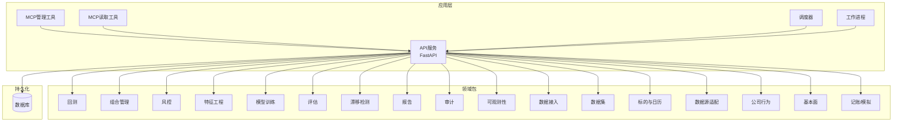
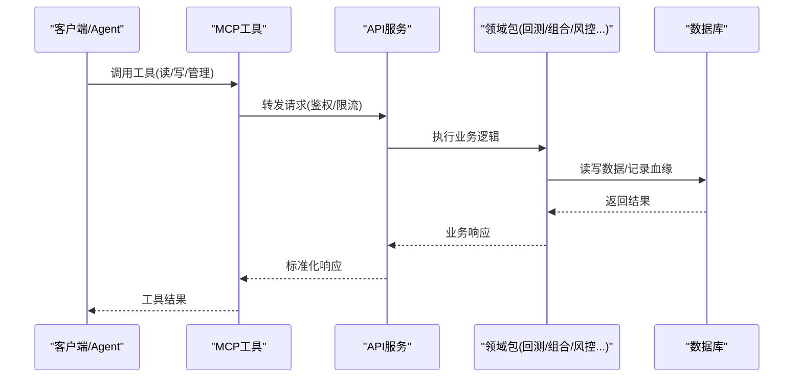
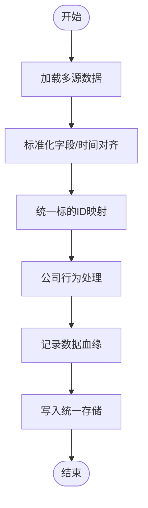
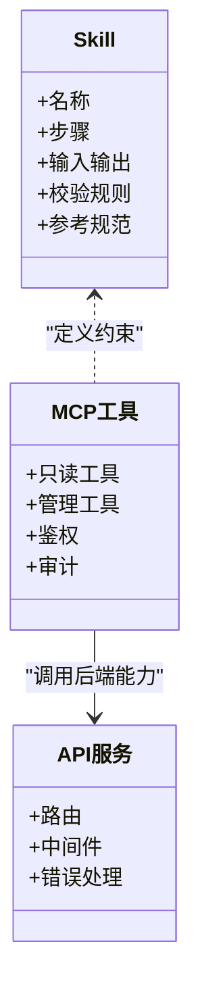
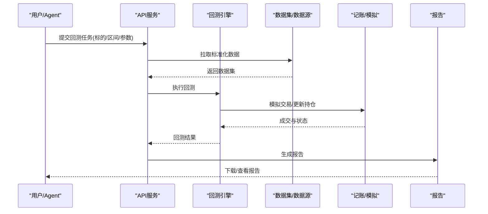
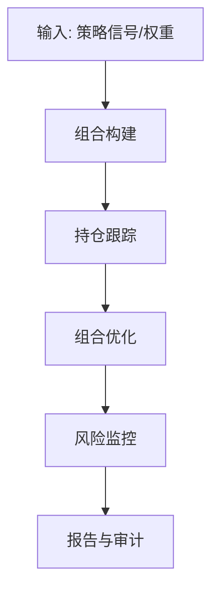
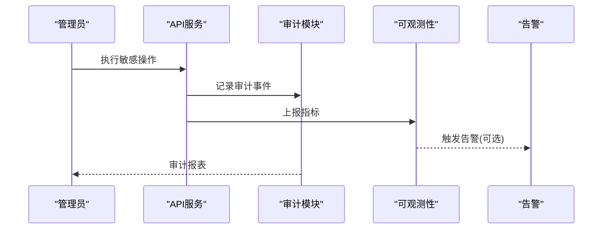
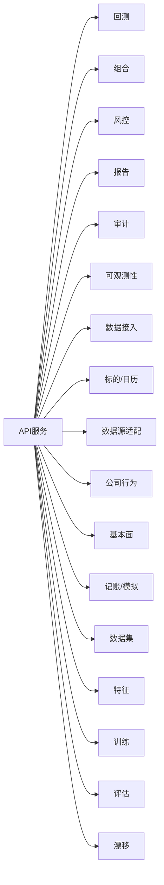

# 核心特性

<cite>
**本文引用的文件**   
- [apps/api/main.py](file://apps/api/main.py)
- [apps/api/routers/portfolio.py](file://apps/api/routers/portfolio.py)
- [apps/api/routers/instruments.py](file://apps/api/routers/instruments.py)
- [apps/api/routers/markets.py](file://apps/api/routers/markets.py)
- [apps/api/routers/fundamentals.py](file://apps/api/routers/fundamentals.py)
- [apps/api/routers/forecast.py](file://apps/api/routers/forecast.py)
- [apps/api/routers/data_status.py](file://apps/api/routers/data_status.py)
- [apps/api/routers/admin_ingestion.py](file://apps/api/routers/admin_ingestion.py)
- [apps/api/routers/scheduler.py](file://apps/api/routers/scheduler.py)
- [apps/quant-admin-mcp/tools.py](file://apps/quant-admin-mcp/tools.py)
- [apps/quant-read-mcp/tools.py](file://apps/quant-read-mcp/tools.py)
- [skills/cross-market-quant-research/SKILL.md](file://skills/cross-market-quant-research/SKILL.md)
- [skills/cross-market-quant-research/references/instrument-id-format.md](file://skills/cross-market-quant-research/references/instrument-id-format.md)
- [packages/backtest/__init__.py](file://packages/backtest/__init__.py)
- [packages/portfolio/__init__.py](file://packages/portfolio/__init__.py)
- [packages/audit/__init__.py](file://packages/audit/__init__.py)
- [packages/observability/__init__.py](file://packages/observability/__init__.py)
- [packages/ingestion/__init__.py](file://packages/ingestion/__init__.py)
- [packages/datasets/__init__.py](file://packages/datasets/__init__.py)
- [packages/instrument/__init__.py](file://packages/instrument/__init__.py)
- [packages/instruments/__init__.py](file://packages/instruments/__init__.py)
- [packages/data_sources/__init__.py](file://packages/data_sources/__init__.py)
- [packages/corporate_actions/__init__.py](file://packages/corporate_actions/__init__.py)
- [packages/calendar_rule/__init__.py](file://packages/calendar_rule/__init__.py)
- [packages/training/__init__.py](file://packages/training/__init__.py)
- [packages/features/__init__.py](file://packages/features/__init__.py)
- [packages/labels/__init__.py](file://packages/labels/__init__.py)
- [packages/models/__init__.py](file://packages/models/__init__.py)
- [packages/reporting/__init__.py](file://packages/reporting/__init__.py)
- [packages/risk/__init__.py](file://packages/risk/__init__.py)
- [packages/evaluation/__init__.py](file://packages/evaluation/__init__.py)
- [packages/drift/__init__.py](file://packages/drift/__init__.py)
- [packages/fundamentals/__init__.py](file://packages/fundamentals/__init__.py)
- [packages/ledger_paper/__init__.py](file://packages/ledger_paper/__init__.py)
- [sql/migrations/20260715_0001_instruments.py](file://sql/migrations/20260715_0001_instruments.py)
- [sql/migrations/20260715_0003_market_bar.py](file://sql/migrations/20260715_0003_market_bar.py)
- [sql/migrations/20260715_0004_corporate_action.py](file://sql/migrations/20260715_0004_corporate_action.py)
- [sql/migrations/20260715_0005_fundamental_fact.py](file://sql/migrations/20260715_0005_fundamental_fact.py)
- [sql/migrations/20260715_0006_fund_fx_portfolio.py](file://sql/migrations/20260715_0006_fund_fx_portfolio.py)
- [sql/migrations/20260715_0007_market_bar_provenance.py](file://sql/migrations/20260715_0007_market_bar_provenance.py)
- [sql/migrations/20/20260715_0008_ca_nav_provenance.py](file://sql/migrations/20260715_0008_ca_nav_provenance.py)
- [deploy/docker-compose.yml](file://deploy/docker-compose.yml)
- [deploy/prometheus.yml](file://deploy/prometheus.yml)
</cite>

## 目录
1. [简介](#简介)
2. [项目结构](#项目结构)
3. [核心组件](#核心组件)
4. [架构总览](#架构总览)
5. [详细组件分析](#详细组件分析)
6. [依赖关系分析](#依赖关系分析)
7. [性能考量](#性能考量)
8. [故障排查指南](#故障排查指南)
9. [结论](#结论)
10. [附录](#附录)

## 简介
本文件聚焦量化投资系统的核心特性，围绕以下能力展开：跨市场数据统一抽象（A股、美股、基金）、AI Agent集成（Skill技能与MCP工具协议）、策略回测引擎（历史回测、模拟交易、绩效分析）、投资组合管理（持仓跟踪、组合优化、风险监控），以及企业级能力（审计追踪、监控告警、权限控制）。文档通过架构图、流程图和时序图帮助读者快速理解系统边界与使用方式。

## 项目结构
系统采用“应用层 + 包层 + 配置/部署”的分层组织：
- 应用层 apps：API服务、MCP工具、调度器、工作进程
- 包层 packages：领域能力（回测、组合、风控、特征、训练等）
- 配置 deploy：容器编排与监控
- SQL migrations：数据库演进（标的、行情、公司行为、基本面、组合等）

图表来源
- [apps/api/main.py](file://apps/api/main.py)
- [apps/quant-admin-mcp/tools.py](file://apps/quant-admin-mcp/tools.py)
- [apps/quant-read-mcp/tools.py](file://apps/quant-read-mcp/tools.py)
- [packages/backtest/__init__.py](file://packages/backtest/__init__.py)
- [packages/portfolio/__init__.py](file://packages/portfolio/__init__.py)
- [packages/audit/__init__.py](file://packages/audit/__init__.py)
- [packages/observability/__init__.py](file://packages/observability/__init__.py)
- [packages/ingestion/__init__.py](file://packages/ingestion/__init__.py)
- [packages/datasets/__init__.py](file://packages/datasets/__init__.py)
- [packages/instrument/__init__.py](file://packages/instrument/__init__.py)
- [packages/instruments/__init__.py](file://packages/instruments/__init__.py)
- [packages/data_sources/__init__.py](file://packages/data_sources/__init__.py)
- [packages/corporate_actions/__init__.py](file://packages/corporate_actions/__init__.py)
- [packages/calendar_rule/__init__.py](file://packages/calendar_rule/__init__.py)
- [packages/training/__init__.py](file://packages/training/__init__.py)
- [packages/features/__init__.py](file://packages/features/__init__.py)
- [packages/labels/__init__.py](file://packages/labels/__init__.py)
- [packages/models/__init__.py](file://packages/models/__init__.py)
- [packages/reporting/__init__.py](file://packages/reporting/__init__.py)
- [packages/risk/__init__.py](file://packages/risk/__init__.py)
- [packages/evaluation/__init__.py](file://packages/evaluation/__init__.py)
- [packages/drift/__init__.py](file://packages/drift/__init__.py)
- [packages/fundamentals/__init__.py](file://packages/fundamentals/__init__.py)
- [packages/ledger_paper/__init__.py](file://packages/ledger_paper/__init__.py)

章节来源
- [apps/api/main.py](file://apps/api/main.py)
- [deploy/docker-compose.yml](file://deploy/docker-compose.yml)

## 核心组件
- 跨市场数据统一抽象
  - 通过统一的标的ID格式与标准化字段，屏蔽A股、美股、基金的差异；提供一致的查询接口与时间序列对齐能力。
  - 关键支撑：标的定义、日历规则、公司行为处理、多源数据适配、数据血缘记录。
- AI Agent集成（Skill + MCP）
  - Skill定义研究流程与约束；MCP暴露读写与管理工具，供Agent调用。
- 策略回测引擎
  - 支持历史数据回放、事件驱动或向量化回测、模拟交易撮合、绩效归因与报告输出。
- 投资组合管理
  - 覆盖持仓跟踪、权重计算、再平衡、风险指标与压力测试。
- 企业级能力
  - 审计日志、可观测性指标、权限控制（结合路由与MCP工具粒度）。

章节来源
- [skills/cross-market-quant-research/SKILL.md](file://skills/cross-market-quant-research/SKILL.md)
- [skills/cross-market-quant-research/references/instrument-id-format.md](file://skills/cross-market-quant-research/references/instrument-id-format.md)
- [apps/quant-admin-mcp/tools.py](file://apps/quant-admin-mcp/tools.py)
- [apps/quant-read-mcp/tools.py](file://apps/quant-read-mcp/tools.py)
- [packages/backtest/__init__.py](file://packages/backtest/__init__.py)
- [packages/portfolio/__init__.py](file://packages/portfolio/__init__.py)
- [packages/audit/__init__.py](file://packages/audit/__init__.py)
- [packages/observability/__init__.py](file://packages/observability/__init__.py)

## 架构总览
系统以API为核心入口，聚合各领域包能力，并通过MCP为Agent提供工具化访问；调度与工作进程负责批处理与任务执行；数据库承载结构化数据与血缘信息。

图表来源
- [apps/api/main.py](file://apps/api/main.py)
- [apps/quant-admin-mcp/tools.py](file://apps/quant-admin-mcp/tools.py)
- [apps/quant-read-mcp/tools.py](file://apps/quant-read-mcp/tools.py)
- [packages/ingestion/__init__.py](file://packages/ingestion/__init__.py)
- [packages/datasets/__init__.py](file://packages/datasets/__init__.py)
- [packages/instruments/__init__.py](file://packages/instruments/__init__.py)
- [packages/ledger_paper/__init__.py](file://packages/ledger_paper/__init__.py)

## 详细组件分析

### 跨市场数据统一抽象
- 目标
  - 将A股、美股、基金等不同市场的标的、行情、基本面与公司行为统一到一致的数据模型与接口中，便于研究与策略复用。
- 关键机制
  - 统一标的ID规范：跨市场唯一标识、映射与校验。
  - 标准化字段与时序对齐：统一时间戳、复权、涨跌停、休市等规则。
  - 多源数据适配：不同数据源的抽取、清洗、转换与入库。
  - 公司行为处理：分红、拆合股、退市等对价格与持仓的影响校正。
  - 数据血缘：记录数据来源、版本与加工链路，保障可追溯。
- 使用场景与价值
  - 场景：在同一框架下对比A股与美股因子表现；在基金与股票间进行资产配置。
  - 价值：减少重复适配成本，提升研究效率与策略迁移速度。

图表来源
- [packages/data_sources/__init__.py](file://packages/data_sources/__init__.py)
- [packages/instrument/__init__.py](file://packages/instrument/__init__.py)
- [packages/instruments/__init__.py](file://packages/instruments/__init__.py)
- [packages/corporate_actions/__init__.py](file://packages/corporate_actions/__init__.py)
- [sql/migrations/20260715_0001_instruments.py](file://sql/migrations/20260715_0001_instruments.py)
- [sql/migrations/20260715_0003_market_bar.py](file://sql/migrations/20260715_0003_market_bar.py)
- [sql/migrations/20260715_0004_corporate_action.py](file://sql/migrations/20260715_0004_corporate_action.py)
- [sql/migrations/20260715_0007_market_bar_provenance.py](file://sql/migrations/20260715_0007_market_bar_provenance.py)

章节来源
- [skills/cross-market-quant-research/references/instrument-id-format.md](file://skills/cross-market-quant-research/references/instrument-id-format.md)
- [packages/instrument/__init__.py](file://packages/instrument/__init__.py)
- [packages/instruments/__init__.py](file://packages/instruments/__init__.py)
- [packages/data_sources/__init__.py](file://packages/data_sources/__init__.py)
- [packages/corporate_actions/__init__.py](file://packages/corporate_actions/__init__.py)
- [sql/migrations/20260715_0001_instruments.py](file://sql/migrations/20260715_0001_instruments.py)
- [sql/migrations/20260715_0003_market_bar.py](file://sql/migrations/20260715_0003_market_bar.py)
- [sql/migrations/20260715_0004_corporate_action.py](file://sql/migrations/20260715_0004_corporate_action.py)
- [sql/migrations/20260715_0007_market_bar_provenance.py](file://sql/migrations/20260715_0007_market_bar_provenance.py)

### AI Agent集成架构（Skill + MCP）
- 目标
  - 通过Skill定义研究流程与约束，借助MCP工具暴露系统能力，使Agent能安全、可控地调用数据与研究能力。
- 关键机制
  - Skill定义：描述研究步骤、输入输出、校验与参考规范。
  - MCP工具：分读写两类，分别暴露只读查询与写入/管理操作。
  - 鉴权与审计：对工具调用进行鉴权与审计记录。
- 使用场景与价值
  - 场景：Agent自动完成“拉取数据→生成预测→回测→报告”的端到端流程。
  - 价值：降低人工操作门槛，提升迭代效率与一致性。

图表来源
- [skills/cross-market-quant-research/SKILL.md](file://skills/cross-market-quant-research/SKILL.md)
- [apps/quant-admin-mcp/tools.py](file://apps/quant-admin-mcp/tools.py)
- [apps/quant-read-mcp/tools.py](file://apps/quant-read-mcp/tools.py)
- [apps/api/main.py](file://apps/api/main.py)

章节来源
- [skills/cross-market-quant-research/SKILL.md](file://skills/cross-market-quant-research/SKILL.md)
- [apps/quant-admin-mcp/tools.py](file://apps/quant-admin-mcp/tools.py)
- [apps/quant-read-mcp/tools.py](file://apps/quant-read-mcp/tools.py)
- [apps/api/main.py](file://apps/api/main.py)

### 策略回测引擎
- 目标
  - 提供面向多资产的回测能力，包括历史数据回放、模拟交易、绩效分析与报告。
- 关键机制
  - 数据准备：从统一数据层获取标准化行情与基本面。
  - 执行模型：订单生成、滑点、手续费、冲击成本等。
  - 模拟交易：撮合与成交记录、资金与持仓更新。
  - 绩效分析：收益曲线、回撤、夏普、最大回撤、归因等。
- 使用场景与价值
  - 场景：因子有效性检验、策略参数扫描、策略上线前验证。
  - 价值：缩短策略研发周期，提高上线成功率。

图表来源
- [packages/backtest/__init__.py](file://packages/backtest/__init__.py)
- [packages/datasets/__init__.py](file://packages/datasets/__init__.py)
- [packages/ledger_paper/__init__.py](file://packages/ledger_paper/__init__.py)
- [packages/reporting/__init__.py](file://packages/reporting/__init__.py)
- [apps/api/routers/forecast.py](file://apps/api/routers/forecast.py)

章节来源
- [packages/backtest/__init__.py](file://packages/backtest/__init__.py)
- [packages/datasets/__init__.py](file://packages/datasets/__init__.py)
- [packages/ledger_paper/__init__.py](file://packages/ledger_paper/__init__.py)
- [packages/reporting/__init__.py](file://packages/reporting/__init__.py)
- [apps/api/routers/forecast.py](file://apps/api/routers/forecast.py)

### 投资组合管理
- 目标
  - 提供组合构建、持仓跟踪、再平衡与风险监控的一体化能力。
- 关键机制
  - 组合建模：账户、子组合、权重、基准。
  - 持仓跟踪：实时/日终持仓快照、盈亏与敞口。
  - 组合优化：均值方差、风险平价、约束优化等。
  - 风险监控：VaR、波动率、集中度、流动性、压力测试。
- 使用场景与价值
  - 场景：多策略组合、跨市场资产配置、合规风控。
  - 价值：提升组合稳定性与可解释性，满足机构风控要求。

图表来源
- [packages/portfolio/__init__.py](file://packages/portfolio/__init__.py)
- [packages/risk/__init__.py](file://packages/risk/__init__.py)
- [packages/reporting/__init__.py](file://packages/reporting/__init__.py)
- [packages/audit/__init__.py](file://packages/audit/__init__.py)
- [sql/migrations/20260715_0006_fund_fx_portfolio.py](file://sql/migrations/20260715_0006_fund_fx_portfolio.py)

章节来源
- [packages/portfolio/__init__.py](file://packages/portfolio/__init__.py)
- [packages/risk/__init__.py](file://packages/risk/__init__.py)
- [packages/reporting/__init__.py](file://packages/reporting/__init__.py)
- [packages/audit/__init__.py](file://packages/audit/__init__.py)
- [sql/migrations/20260715_0006_fund_fx_portfolio.py](file://sql/migrations/20260715_0006_fund_fx_portfolio.py)

### 企业级特性（审计、监控告警、权限控制）
- 审计追踪
  - 记录关键操作的主体、时间、对象与结果，支持回溯与合规检查。
- 监控告警
  - 采集系统指标与业务指标，异常阈值触发告警。
- 权限控制
  - 基于角色/资源的访问控制，结合MCP工具与API路由实现细粒度授权。
- 使用场景与价值
  - 场景：监管报送、内部合规、生产运维。
  - 价值：满足企业级治理要求，降低运营风险。

图表来源
- [packages/audit/__init__.py](file://packages/audit/__init__.py)
- [packages/observability/__init__.py](file://packages/observability/__init__.py)
- [deploy/prometheus.yml](file://deploy/prometheus.yml)
- [apps/api/routers/admin_ingestion.py](file://apps/api/routers/admin_ingestion.py)

章节来源
- [packages/audit/__init__.py](file://packages/audit/__init__.py)
- [packages/observability/__init__.py](file://packages/observability/__init__.py)
- [deploy/prometheus.yml](file://deploy/prometheus.yml)
- [apps/api/routers/admin_ingestion.py](file://apps/api/routers/admin_ingestion.py)

## 依赖关系分析
- 耦合与内聚
  - API层作为聚合入口，低耦合地调用各领域包；领域包之间通过明确接口交互，保持高内聚。
- 外部依赖
  - 数据库用于持久化标的、行情、公司行为、组合与审计事件；Prometheus用于指标采集。
- 潜在循环依赖
  - 通过分层与接口隔离避免循环依赖；必要时引入事件总线或消息队列解耦。

图表来源
- [apps/api/main.py](file://apps/api/main.py)
- [packages/backtest/__init__.py](file://packages/backtest/__init__.py)
- [packages/portfolio/__init__.py](file://packages/portfolio/__init__.py)
- [packages/risk/__init__.py](file://packages/risk/__init__.py)
- [packages/reporting/__init__.py](file://packages/reporting/__init__.py)
- [packages/audit/__init__.py](file://packages/audit/__init__.py)
- [packages/observability/__init__.py](file://packages/observability/__init__.py)
- [packages/ingestion/__init__.py](file://packages/ingestion/__init__.py)
- [packages/instruments/__init__.py](file://packages/instruments/__init__.py)
- [packages/data_sources/__init__.py](file://packages/data_sources/__init__.py)
- [packages/corporate_actions/__init__.py](file://packages/corporate_actions/__init__.py)
- [packages/fundamentals/__init__.py](file://packages/fundamentals/__init__.py)
- [packages/ledger_paper/__init__.py](file://packages/ledger_paper/__init__.py)
- [packages/datasets/__init__.py](file://packages/datasets/__init__.py)
- [packages/features/__init__.py](file://packages/features/__init__.py)
- [packages/training/__init__.py](file://packages/training/__init__.py)
- [packages/evaluation/__init__.py](file://packages/evaluation/__init__.py)
- [packages/drift/__init__.py](file://packages/drift/__init__.py)

章节来源
- [apps/api/main.py](file://apps/api/main.py)

## 性能考量
- 数据层
  - 使用列式存储与分区索引加速时间序列查询；对热点标的建立缓存。
- 计算层
  - 回测与特征计算并行化；向量化运算优先于逐行循环。
- I/O与网络
  - 批量拉取与增量同步结合；压缩传输与连接池优化。
- 资源与弹性
  - 容器化部署与水平扩展；按需扩缩容CPU/GPU资源。

## 故障排查指南
- 常见问题定位
  - 数据不一致：核对数据血缘与版本号，确认公司行为处理是否生效。
  - 回测异常：检查标的ID映射、日历规则与停牌/涨跌停处理。
  - 组合偏差：核对记账流水与成交记录，确认费用与滑点设置。
  - 监控告警：查看Prometheus指标与日志，定位瓶颈与异常。
- 建议步骤
  - 从API健康检查入手，逐步下沉到数据源与存储层。
  - 使用审计日志与可观测性指标交叉验证问题路径。

章节来源
- [apps/api/routers/data_status.py](file://apps/api/routers/data_status.py)
- [deploy/prometheus.yml](file://deploy/prometheus.yml)

## 结论
本系统以跨市场数据统一抽象为基础，结合AI Agent的Skill与MCP工具协议，构建了可扩展的策略研发与投研平台。回测引擎与组合管理能力覆盖从研究到实盘的关键环节，企业级特性确保合规与稳定运行。通过清晰的架构与模块化设计，系统具备良好的可维护性与扩展性。

## 附录
- 相关API路由
  - 组合：[portfolio.py](file://apps/api/routers/portfolio.py)
  - 标的：[instruments.py](file://apps/api/routers/instruments.py)
  - 市场：[markets.py](file://apps/api/routers/markets.py)
  - 基本面：[fundamentals.py](file://apps/api/routers/fundamentals.py)
  - 预测：[forecast.py](file://apps/api/routers/forecast.py)
  - 数据状态：[data_status.py](file://apps/api/routers/data_status.py)
  - 管理入站：[admin_ingestion.py](file://apps/api/routers/admin_ingestion.py)
  - 调度：[scheduler.py](file://apps/api/routers/scheduler.py)
- 数据库迁移
  - 标的、行情、公司行为、基本面、组合等表结构演进见sql/migrations目录。