# 核心特性说明

<cite>
**本文引用的文件**   
- [apps/api/main.py](file://apps/api/main.py)
- [apps/api/routers/admin_ingestion.py](file://apps/api/routers/admin_ingestion.py)
- [apps/api/routers/data_status.py](file://apps/api/routers/data_status.py)
- [apps/api/routers/forecast.py](file://apps/api/routers/forecast.py)
- [apps/api/routers/fundamentals.py](file://apps/api/routers/fundamentals.py)
- [apps/api/routers/instruments.py](file://apps/api/routers/instruments.py)
- [apps/api/routers/markets.py](file://apps/api/routers/markets.py)
- [apps/api/routers/portfolio.py](file://apps/api/routers/portfolio.py)
- [apps/api/routers/scheduler.py](file://apps/api/routers/scheduler.py)
- [apps/api/deps.py](file://apps/api/deps.py)
- [apps/quant-admin-mcp/server.py](file://apps/quant-admin-mcp/server.py)
- [apps/quant-admin-mcp/tools.py](file://apps/quant-admin-mcp/tools.py)
- [apps/quant-read-mcp/server.py](file://apps/quant-read-mcp/server.py)
- [apps/quant-read-mcp/tools.py](file://apps/quant-read-mcp/tools.py)
- [apps/quant-read-mcp/db_backends.py](file://apps/quant-read-mcp/db_backends.py)
- [apps/scheduler/executor.py](file://apps/scheduler/executor.py)
- [apps/scheduler/schedule.py](file://apps/scheduler/schedule.py)
- [apps/worker/main.py](file://apps/worker/main.py)
- [apps/worker/tasks.py](file://apps/worker/tasks.py)
- [packages/ingestion/adapters/base.py](file://packages/ingestion/adapters/base.py)
- [packages/ingestion/adapters/cn.py](file://packages/ingestion/adapters/cn.py)
- [packages/ingestion/adapters/us.py](file://packages/ingestion/adapters/us.py)
- [packages/ingestion/adapters/fx.py](file://packages/ingestion/adapters/fx.py)
- [packages/datasets/sql_bar_repo.py](file://packages/datasets/sql_bar_repo.py)
- [packages/features/engine.py](file://packages/features/engine.py)
- [packages/backtest/engine.py](file://packages/backtest/engine.py)
- [packages/evaluation/metrics.py](file://packages/evaluation/metrics.py)
- [packages/observability/metrics.py](file://packages/observability/metrics.py)
- [packages/audit/events.py](file://packages/audit/events.py)
- [packages/calendar_rule/rules.py](file://packages/calendar_rule/rules.py)
- [packages/instrument/service.py](file://packages/instrument/service.py)
- [packages/fundamentals/service.py](file://packages/fundamentals/service.py)
- [packages/fx/service.py](file://packages/fx/service.py)
- [packages/portfolio/service.py](file://packages/portfolio/service.py)
- [packages/models/family_registry.py](file://packages/models/family_registry.py)
- [packages/training/walk_forward.py](file://packages/training/walk_forward.py)
- [sql/migrations/20260715_0003_market_bar.py](file://sql/migrations/20260715_0003_market_bar.py)
- [sql/migrations/20260715_0004_corporate_action.py](file://sql/migrations/20260715_0004_corporate_action.py)
- [sql/migrations/20260715_0005_fundamental_fact.py](file://sql/migrations/20260715_0005_fundamental_fact.py)
- [sql/migrations/20260715_0006_fund_fx_portfolio.py](file://sql/migrations/20260715_0006_fund_fx_portfolio.py)
- [sql/migrations/20260715_0007_market_bar_provenance.py](file://sql/migrations/20260715_0007_market_bar_provenance.py)
- [sql/migrations/20260715_0008_ca_nav_provenance.py](file://sql/migrations/20260715_0008_ca_nav_provenance.py)
</cite>

## 目录
1. [简介](#简介)
2. [项目结构](#项目结构)
3. [核心组件](#核心组件)
4. [架构总览](#架构总览)
5. [详细组件分析](#详细组件分析)
6. [依赖关系分析](#依赖关系分析)
7. [性能考量](#性能考量)
8. [故障排查指南](#故障排查指南)
9. [结论](#结论)
10. [附录](#附录)

## 简介
本文件面向量化交易MCP项目的开发者与使用者，系统性阐述以下核心特性：
- 多代理协作框架（管理员代理、读取代理）
- 跨市场数据处理（A股、美股、外汇）
- 完整量化流水线（数据摄取、因子研究、策略回测、绩效分析）
- 企业级监控与审计
- API网关服务

文档将解释各特性的实现原理、技术亮点、使用价值，并通过“代码片段路径”指引具体接口调用方式，同时给出扩展与定制建议。

## 项目结构
项目采用分层与模块化组织：
- apps：应用层，包含API网关、MCP代理、调度器与任务执行器
- packages：领域包，涵盖数据源适配、数据集、特征工程、模型训练、回测、评估、可观测性、审计等
- sql：数据库迁移脚本，定义市场K线、公司行为、基本面、外汇、组合等表结构
- configs：配置管理
- deploy：部署编排与监控采集

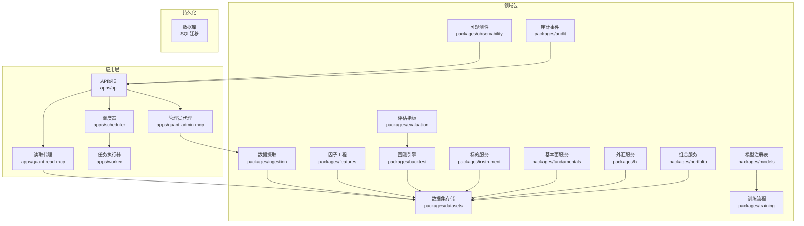

图表来源
- [apps/api/main.py:1-200](file://apps/api/main.py#L1-L200)
- [apps/quant-admin-mcp/server.py:1-200](file://apps/quant-admin-mcp/server.py#L1-L200)
- [apps/quant-read-mcp/server.py:1-200](file://apps/quant-read-mcp/server.py#L1-L200)
- [apps/scheduler/executor.py:1-200](file://apps/scheduler/executor.py#L1-L200)
- [apps/worker/tasks.py:1-200](file://apps/worker/tasks.py#L1-L200)
- [packages/ingestion/adapters/base.py:1-200](file://packages/ingestion/adapters/base.py#L1-L200)
- [packages/datasets/sql_bar_repo.py:1-200](file://packages/datasets/sql_bar_repo.py#L1-L200)
- [packages/features/engine.py:1-200](file://packages/features/engine.py#L1-L200)
- [packages/backtest/engine.py:1-200](file://packages/backtest/engine.py#L1-L200)
- [packages/evaluation/metrics.py:1-200](file://packages/evaluation/metrics.py#L1-L200)
- [packages/observability/metrics.py:1-200](file://packages/observability/metrics.py#L1-L200)
- [packages/audit/events.py:1-200](file://packages/audit/events.py#L1-L200)
- [packages/instrument/service.py:1-200](file://packages/instrument/service.py#L1-L200)
- [packages/fundamentals/service.py:1-200](file://packages/fundamentals/service.py#L1-L200)
- [packages/fx/service.py:1-200](file://packages/fx/service.py#L1-L200)
- [packages/portfolio/service.py:1-200](file://packages/portfolio/service.py#L1-L200)
- [packages/models/family_registry.py:1-200](file://packages/models/family_registry.py#L1-L200)
- [packages/training/walk_forward.py:1-200](file://packages/training/walk_forward.py#L1-L200)

章节来源
- [apps/api/main.py:1-200](file://apps/api/main.py#L1-L200)
- [apps/quant-admin-mcp/server.py:1-200](file://apps/quant-admin-mcp/server.py#L1-L200)
- [apps/quant-read-mcp/server.py:1-200](file://apps/quant-read-mcp/server.py#L1-L200)
- [apps/scheduler/executor.py:1-200](file://apps/scheduler/executor.py#L1-L200)
- [apps/worker/tasks.py:1-200](file://apps/worker/tasks.py#L1-L200)

## 核心组件
本节聚焦系统的关键能力与职责边界：
- API网关：统一入口，路由请求到业务模块，集成鉴权、限流、可观测性与审计
- 多代理协作：管理员代理负责写入与编排；读取代理提供只读查询与报表
- 跨市场数据：A股、美股、外汇的统一接入与标准化
- 量化流水线：从数据摄取到因子研究、回测与评估的端到端流程
- 企业级监控与审计：指标采集、日志追踪、审计事件记录
- 调度与任务：定时任务、工作队列与执行器

章节来源
- [apps/api/routers/admin_ingestion.py:1-200](file://apps/api/routers/admin_ingestion.py#L1-L200)
- [apps/api/routers/data_status.py:1-200](file://apps/api/routers/data_status.py#L1-L200)
- [apps/api/routers/forecast.py:1-200](file://apps/api/routers/forecast.py#L1-L200)
- [apps/api/routers/fundamentals.py:1-200](file://apps/api/routers/fundamentals.py#L1-L200)
- [apps/api/routers/instruments.py:1-200](file://apps/api/routers/instruments.py#L1-L200)
- [apps/api/routers/markets.py:1-200](file://apps/api/routers/markets.py#L1-L200)
- [apps/api/routers/portfolio.py:1-200](file://apps/api/routers/portfolio.py#L1-L200)
- [apps/api/routers/scheduler.py:1-200](file://apps/api/routers/scheduler.py#L1-L200)
- [apps/api/deps.py:1-200](file://apps/api/deps.py#L1-L200)

## 架构总览
整体架构遵循“API网关 + 多代理 + 领域包 + 持久化”的分层模式：
- API网关暴露REST接口，承载路由、依赖注入、中间件（审计、指标）
- 管理员代理通过工具集触发数据摄取、模型训练、回测编排
- 读取代理提供只读查询，对接数据集仓库与报表
- 调度器按规则触发任务，工作队列异步执行
- 领域包封装跨市场的标准接口与算法实现

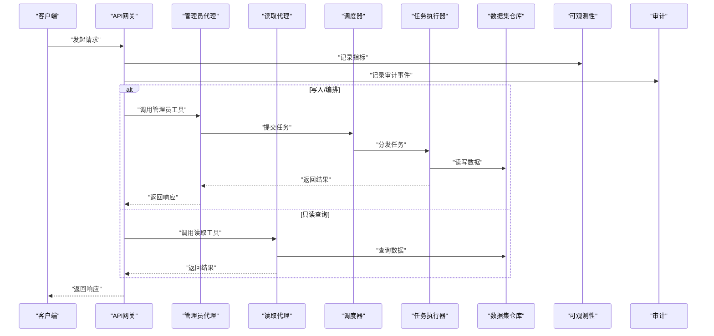

图表来源
- [apps/api/main.py:1-200](file://apps/api/main.py#L1-L200)
- [apps/quant-admin-mcp/server.py:1-200](file://apps/quant-admin-mcp/server.py#L1-L200)
- [apps/quant-read-mcp/server.py:1-200](file://apps/quant-read-mcp/server.py#L1-L200)
- [apps/scheduler/executor.py:1-200](file://apps/scheduler/executor.py#L1-L200)
- [apps/worker/tasks.py:1-200](file://apps/worker/tasks.py#L1-L200)
- [packages/datasets/sql_bar_repo.py:1-200](file://packages/datasets/sql_bar_repo.py#L1-L200)
- [packages/observability/metrics.py:1-200](file://packages/observability/metrics.py#L1-L200)
- [packages/audit/events.py:1-200](file://packages/audit/events.py#L1-L200)

## 详细组件分析

### 多代理协作框架（管理员代理、读取代理）
- 管理员代理：提供写入与编排能力，如触发数据摄取、启动回测、更新模型注册表
- 读取代理：提供只读查询能力，如获取行情、基本面、预测、组合信息
- 两者通过API网关暴露工具接口，便于外部系统集成

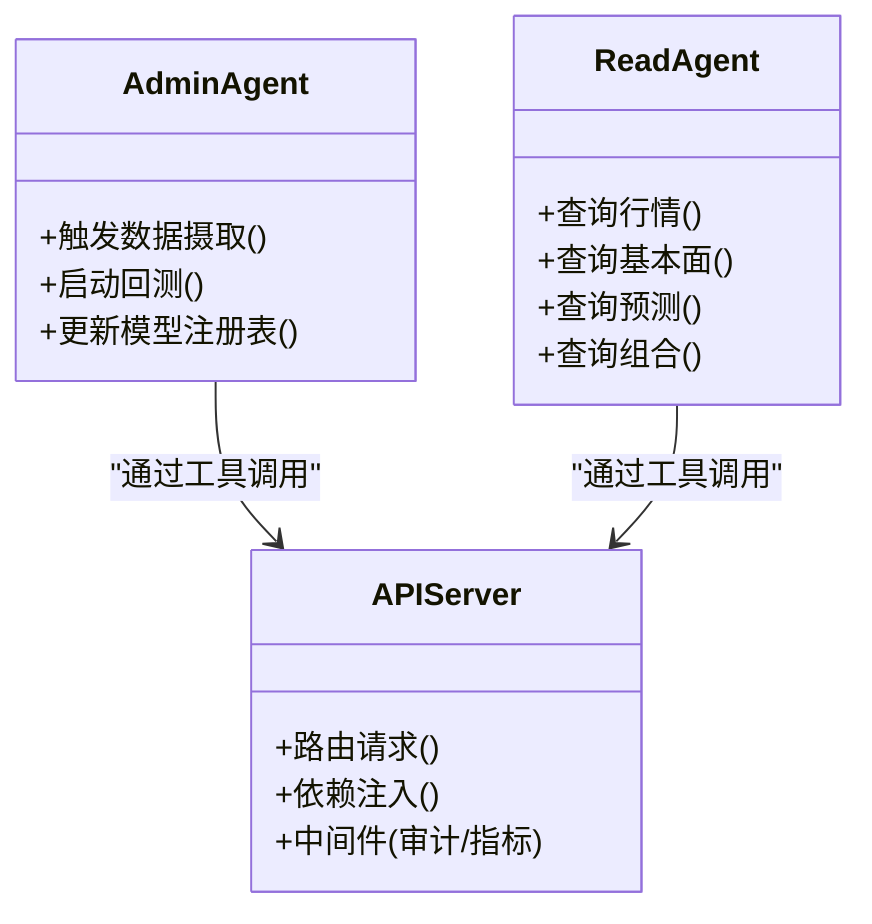

图表来源
- [apps/quant-admin-mcp/server.py:1-200](file://apps/quant-admin-mcp/server.py#L1-L200)
- [apps/quant-admin-mcp/tools.py:1-200](file://apps/quant-admin-mcp/tools.py#L1-200)
- [apps/quant-read-mcp/server.py:1-200](file://apps/quant-read-mcp/server.py#L1-L200)
- [apps/quant-read-mcp/tools.py:1-200](file://apps/quant-read-mcp/tools.py#L1-200)
- [apps/api/main.py:1-200](file://apps/api/main.py#L1-L200)

章节来源
- [apps/quant-admin-mcp/server.py:1-200](file://apps/quant-admin-mcp/server.py#L1-L200)
- [apps/quant-admin-mcp/tools.py:1-200](file://apps/quant-admin-mcp/tools.py#L1-200)
- [apps/quant-read-mcp/server.py:1-200](file://apps/quant-read-mcp/server.py#L1-L200)
- [apps/quant-read-mcp/tools.py:1-200](file://apps/quant-read-mcp/tools.py#L1-200)
- [apps/api/main.py:1-200](file://apps/api/main.py#L1-L200)

### 跨市场数据处理（A股、美股、外汇）
- 统一适配器抽象：不同市场的数据源通过适配器标准化为内部格式
- 市场特定逻辑：A股涨跌停、停牌；美股除权除息、夏令时；外汇交叉汇率
- 数据存储：统一的市场K线表与公司行为表，支持溯源字段

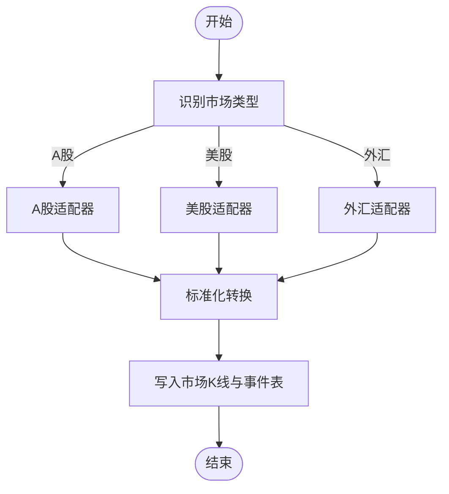

图表来源
- [packages/ingestion/adapters/base.py:1-200](file://packages/ingestion/adapters/base.py#L1-L200)
- [packages/ingestion/adapters/cn.py:1-200](file://packages/ingestion/adapters/cn.py#L1-L200)
- [packages/ingestion/adapters/us.py:1-200](file://packages/ingestion/adapters/us.py#L1-L200)
- [packages/ingestion/adapters/fx.py:1-200](file://packages/ingestion/adapters/fx.py#L1-L200)
- [sql/migrations/20260715_0003_market_bar.py:1-200](file://sql/migrations/20260715_0003_market_bar.py#L1-L200)
- [sql/migrations/20260715_0004_corporate_action.py:1-200](file://sql/migrations/20260715_0004_corporate_action.py#L1-L200)

章节来源
- [packages/ingestion/adapters/base.py:1-200](file://packages/ingestion/adapters/base.py#L1-L200)
- [packages/ingestion/adapters/cn.py:1-200](file://packages/ingestion/adapters/cn.py#L1-L200)
- [packages/ingestion/adapters/us.py:1-200](file://packages/ingestion/adapters/us.py#L1-L200)
- [packages/ingestion/adapters/fx.py:1-200](file://packages/ingestion/adapters/fx.py#L1-L200)
- [sql/migrations/20260715_0003_market_bar.py:1-200](file://sql/migrations/20260715_0003_market_bar.py#L1-L200)
- [sql/migrations/20260715_0004_corporate_action.py:1-200](file://sql/migrations/20260715_0004_corporate_action.py#L1-L200)

### 完整量化流水线（数据摄取、因子研究、策略回测、绩效分析）
- 数据摄取：通过管理员代理或API触发，跨市场适配器拉取并入库
- 因子研究：基于标准化数据集计算因子，支持滚动窗口与增量更新
- 策略回测：加载因子与价格序列，执行交易逻辑，生成订单与持仓
- 绩效分析：计算收益、风险、回撤、夏普比率等指标

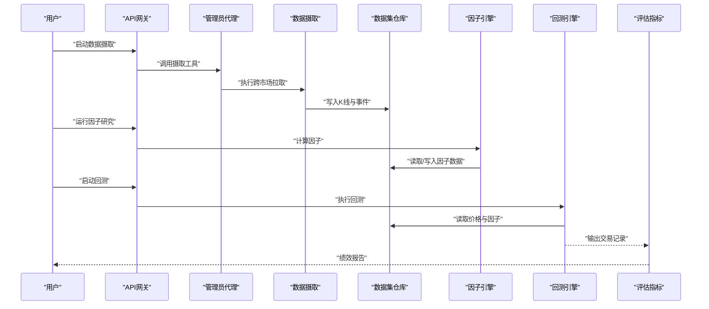

图表来源
- [apps/api/routers/admin_ingestion.py:1-200](file://apps/api/routers/admin_ingestion.py#L1-L200)
- [apps/quant-admin-mcp/tools.py:1-200](file://apps/quant-admin-mcp/tools.py#L1-200)
- [packages/ingestion/adapters/base.py:1-200](file://packages/ingestion/adapters/base.py#L1-L200)
- [packages/datasets/sql_bar_repo.py:1-200](file://packages/datasets/sql_bar_repo.py#L1-L200)
- [packages/features/engine.py:1-200](file://packages/features/engine.py#L1-L200)
- [packages/backtest/engine.py:1-200](file://packages/backtest/engine.py#L1-L200)
- [packages/evaluation/metrics.py:1-200](file://packages/evaluation/metrics.py#L1-L200)

章节来源
- [apps/api/routers/admin_ingestion.py:1-200](file://apps/api/routers/admin_ingestion.py#L1-L200)
- [packages/features/engine.py:1-200](file://packages/features/engine.py#L1-L200)
- [packages/backtest/engine.py:1-200](file://packages/backtest/engine.py#L1-L200)
- [packages/evaluation/metrics.py:1-200](file://packages/evaluation/metrics.py#L1-L200)

### 企业级监控和审计
- 可观测性：在API层采集请求指标、错误率、延迟分布
- 审计事件：记录关键操作（数据写入、模型更新、回测启动）
- 监控集成：Prometheus抓取指标，告警规则联动

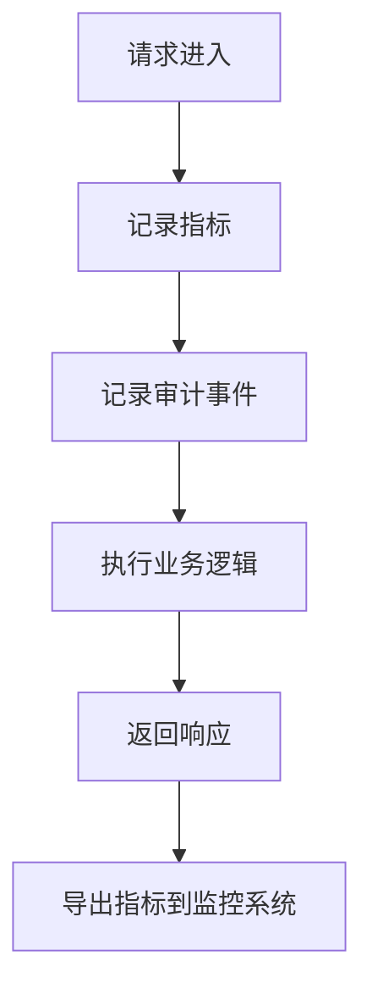

图表来源
- [packages/observability/metrics.py:1-200](file://packages/observability/metrics.py#L1-L200)
- [packages/audit/events.py:1-200](file://packages/audit/events.py#L1-L200)
- [apps/api/main.py:1-200](file://apps/api/main.py#L1-L200)

章节来源
- [packages/observability/metrics.py:1-200](file://packages/observability/metrics.py#L1-L200)
- [packages/audit/events.py:1-200](file://packages/audit/events.py#L1-L200)
- [apps/api/main.py:1-200](file://apps/api/main.py#L1-L200)

### API网关服务
- 路由组织：按功能域划分路由器（行情、基本面、预测、组合、调度等）
- 依赖注入：集中管理数据库连接、服务实例、配置
- 健康检查与状态：数据状态、市场状态、调度状态

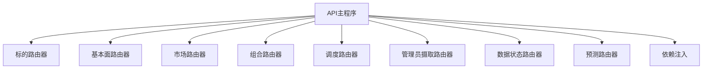

图表来源
- [apps/api/routers/instruments.py:1-200](file://apps/api/routers/instruments.py#L1-L200)
- [apps/api/routers/fundamentals.py:1-200](file://apps/api/routers/fundamentals.py#L1-L200)
- [apps/api/routers/markets.py:1-200](file://apps/api/routers/markets.py#L1-L200)
- [apps/api/routers/portfolio.py:1-200](file://apps/api/routers/portfolio.py#L1-L200)
- [apps/api/routers/scheduler.py:1-200](file://apps/api/routers/scheduler.py#L1-L200)
- [apps/api/routers/admin_ingestion.py:1-200](file://apps/api/routers/admin_ingestion.py#L1-L200)
- [apps/api/routers/data_status.py:1-200](file://apps/api/routers/data_status.py#L1-L200)
- [apps/api/routers/forecast.py:1-200](file://apps/api/routers/forecast.py#L1-L200)
- [apps/api/deps.py:1-200](file://apps/api/deps.py#L1-L200)
- [apps/api/main.py:1-200](file://apps/api/main.py#L1-L200)

章节来源
- [apps/api/routers/instruments.py:1-200](file://apps/api/routers/instruments.py#L1-L200)
- [apps/api/routers/fundamentals.py:1-200](file://apps/api/routers/fundamentals.py#L1-L200)
- [apps/api/routers/markets.py:1-200](file://apps/api/routers/markets.py#L1-L200)
- [apps/api/routers/portfolio.py:1-200](file://apps/api/routers/portfolio.py#L1-L200)
- [apps/api/routers/scheduler.py:1-200](file://apps/api/routers/scheduler.py#L1-L200)
- [apps/api/routers/admin_ingestion.py:1-200](file://apps/api/routers/admin_ingestion.py#L1-L200)
- [apps/api/routers/data_status.py:1-200](file://apps/api/routers/data_status.py#L1-L200)
- [apps/api/routers/forecast.py:1-200](file://apps/api/routers/forecast.py#L1-L200)
- [apps/api/deps.py:1-200](file://apps/api/deps.py#L1-L200)
- [apps/api/main.py:1-200](file://apps/api/main.py#L1-L200)

### 调度与任务执行
- 调度器：根据规则与时间计划触发任务
- 执行器：解析任务、分配资源、监控进度
- 任务定义：数据摄取、因子计算、回测、评估等

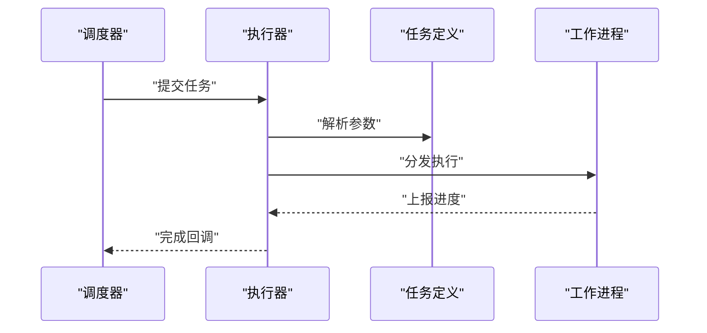

图表来源
- [apps/scheduler/schedule.py:1-200](file://apps/scheduler/schedule.py#L1-L200)
- [apps/scheduler/executor.py:1-200](file://apps/scheduler/executor.py#L1-L200)
- [apps/worker/tasks.py:1-200](file://apps/worker/tasks.py#L1-L200)
- [apps/worker/main.py:1-200](file://apps/worker/main.py#L1-L200)

章节来源
- [apps/scheduler/schedule.py:1-200](file://apps/scheduler/schedule.py#L1-L200)
- [apps/scheduler/executor.py:1-200](file://apps/scheduler/executor.py#L1-L200)
- [apps/worker/tasks.py:1-200](file://apps/worker/tasks.py#L1-L200)
- [apps/worker/main.py:1-200](file://apps/worker/main.py#L1-L200)

### 领域服务与数据模型
- 标的服务：维护标的元数据、映射与校验
- 基本面服务：财务指标、公告事件等
- 外汇服务：汇率、交叉汇率计算
- 组合服务：持仓、净值、风险敞口
- 模型注册表：模型族注册、版本管理
- 训练流程：滚动窗口训练、验证与选择

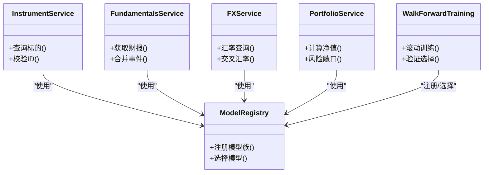

图表来源
- [packages/instrument/service.py:1-200](file://packages/instrument/service.py#L1-L200)
- [packages/fundamentals/service.py:1-200](file://packages/fundamentals/service.py#L1-L200)
- [packages/fx/service.py:1-200](file://packages/fx/service.py#L1-L200)
- [packages/portfolio/service.py:1-200](file://packages/portfolio/service.py#L1-L200)
- [packages/models/family_registry.py:1-200](file://packages/models/family_registry.py#L1-L200)
- [packages/training/walk_forward.py:1-200](file://packages/training/walk_forward.py#L1-L200)

章节来源
- [packages/instrument/service.py:1-200](file://packages/instrument/service.py#L1-L200)
- [packages/fundamentals/service.py:1-200](file://packages/fundamentals/service.py#L1-L200)
- [packages/fx/service.py:1-200](file://packages/fx/service.py#L1-L200)
- [packages/portfolio/service.py:1-200](file://packages/portfolio/service.py#L1-L200)
- [packages/models/family_registry.py:1-200](file://packages/models/family_registry.py#L1-L200)
- [packages/training/walk_forward.py:1-200](file://packages/training/walk_forward.py#L1-L200)

### 数据持久化与溯源
- 市场K线表：统一存储OHLCV与衍生字段
- 公司行为表：分红、拆合股、退市等事件
- 基本面事实表：财务指标与公告
- 外汇与组合表：汇率、持仓、净值
- 溯源字段：数据来源、处理链路与版本

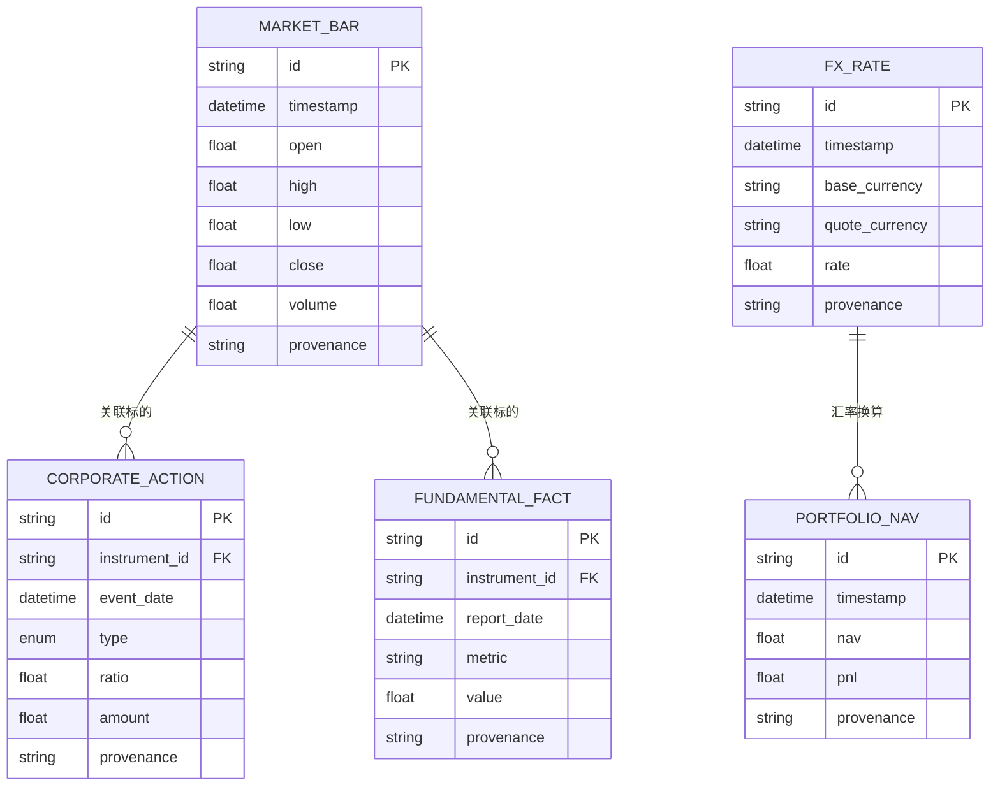

图表来源
- [sql/migrations/20260715_0003_market_bar.py:1-200](file://sql/migrations/20260715_0003_market_bar.py#L1-L200)
- [sql/migrations/20260715_0004_corporate_action.py:1-200](file://sql/migrations/20260715_0004_corporate_action.py#L1-L200)
- [sql/migrations/20260715_0005_fundamental_fact.py:1-200](file://sql/migrations/20260715_0005_fundamental_fact.py#L1-L200)
- [sql/migrations/20260715_0006_fund_fx_portfolio.py:1-200](file://sql/migrations/20260715_0006_fund_fx_portfolio.py#L1-L200)
- [sql/migrations/20260715_0007_market_bar_provenance.py:1-200](file://sql/migrations/20260715_0007_market_bar_provenance.py#L1-L200)
- [sql/migrations/20260715_0008_ca_nav_provenance.py:1-200](file://sql/migrations/20260715_0008_ca_nav_provenance.py#L1-L200)

章节来源
- [sql/migrations/20260715_0003_market_bar.py:1-200](file://sql/migrations/20260715_0003_market_bar.py#L1-L200)
- [sql/migrations/20260715_0004_corporate_action.py:1-200](file://sql/migrations/20260715_0004_corporate_action.py#L1-L200)
- [sql/migrations/20260715_0005_fundamental_fact.py:1-200](file://sql/migrations/20260715_0005_fundamental_fact.py#L1-L200)
- [sql/migrations/20260715_0006_fund_fx_portfolio.py:1-200](file://sql/migrations/20260715_0006_fund_fx_portfolio.py#L1-L200)
- [sql/migrations/20260715_0007_market_bar_provenance.py:1-200](file://sql/migrations/20260715_0007_market_bar_provenance.py#L1-L200)
- [sql/migrations/20260715_0008_ca_nav_provenance.py:1-200](file://sql/migrations/20260715_0008_ca_nav_provenance.py#L1-L200)

## 依赖关系分析
- 低耦合高内聚：每个领域包提供清晰接口，API网关仅依赖路由器与服务
- 直接依赖：API -> 路由器 -> 领域服务 -> 数据集仓库
- 间接依赖：可观测性与审计作为横切关注点，贯穿API层
- 外部依赖：数据库、消息队列（可选）、监控系统

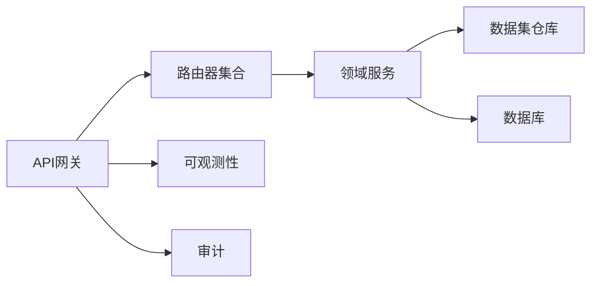

图表来源
- [apps/api/main.py:1-200](file://apps/api/main.py#L1-L200)
- [packages/datasets/sql_bar_repo.py:1-200](file://packages/datasets/sql_bar_repo.py#L1-L200)
- [packages/observability/metrics.py:1-200](file://packages/observability/metrics.py#L1-L200)
- [packages/audit/events.py:1-200](file://packages/audit/events.py#L1-L200)

章节来源
- [apps/api/main.py:1-200](file://apps/api/main.py#L1-L200)
- [packages/datasets/sql_bar_repo.py:1-200](file://packages/datasets/sql_bar_repo.py#L1-L200)
- [packages/observability/metrics.py:1-200](file://packages/observability/metrics.py#L1-L200)
- [packages/audit/events.py:1-200](file://packages/audit/events.py#L1-L200)

## 性能考量
- 批量写入：数据摄取阶段采用批量插入与事务控制，减少DB压力
- 索引优化：对时间戳、标的ID建立复合索引，提升查询效率
- 缓存策略：热点标的元数据与汇率缓存，降低重复计算
- 异步执行：长耗时任务（回测、训练）通过调度与工作队列异步处理
- 指标采样：可观测性指标按需采样，避免过度开销

[本节为通用指导，不直接分析具体文件]

## 故障排查指南
- 数据缺失：检查跨市场适配器日志与溯源字段，确认数据源可用性
- 回测异常：核对因子计算与价格对齐，检查公司行为调整
- 指标异常：查看可观测性指标与审计事件，定位瓶颈与错误
- 调度失败：检查调度规则与工作进程状态，重试机制是否生效

章节来源
- [packages/observability/metrics.py:1-200](file://packages/observability/metrics.py#L1-L200)
- [packages/audit/events.py:1-200](file://packages/audit/events.py#L1-L200)
- [apps/scheduler/executor.py:1-200](file://apps/scheduler/executor.py#L1-L200)
- [apps/worker/tasks.py:1-200](file://apps/worker/tasks.py#L1-L200)

## 结论
本项目以API网关为核心，结合多代理协作与领域包拆分，实现了跨市场数据统一接入、端到端量化流水线与企业级监控审计。通过清晰的依赖关系与可扩展的适配器设计，开发者可以快速扩展新市场、新因子与新策略，并在生产环境中获得良好的可观测性与稳定性。

[本节为总结，不直接分析具体文件]

## 附录
- 接口调用示例（代码片段路径）
  - 管理员代理触发数据摄取：[apps/quant-admin-mcp/tools.py:1-200](file://apps/quant-admin-mcp/tools.py#L1-200)
  - 读取代理查询行情：[apps/quant-read-mcp/tools.py:1-200](file://apps/quant-read-mcp/tools.py#L1-200)
  - API路由-标的查询：[apps/api/routers/instruments.py:1-200](file://apps/api/routers/instruments.py#L1-200)
  - API路由-基本面查询：[apps/api/routers/fundamentals.py:1-200](file://apps/api/routers/fundamentals.py#L1-200)
  - API路由-预测查询：[apps/api/routers/forecast.py:1-200](file://apps/api/routers/forecast.py#L1-200)
  - API路由-组合查询：[apps/api/routers/portfolio.py:1-200](file://apps/api/routers/portfolio.py#L1-200)
  - API路由-调度管理：[apps/api/routers/scheduler.py:1-200](file://apps/api/routers/scheduler.py#L1-L200)
  - 数据状态查询：[apps/api/routers/data_status.py:1-200](file://apps/api/routers/data_status.py#L1-L200)
  - 跨市场适配器-A股：[packages/ingestion/adapters/cn.py:1-200](file://packages/ingestion/adapters/cn.py#L1-L200)
  - 跨市场适配器-美股：[packages/ingestion/adapters/us.py:1-200](file://packages/ingestion/adapters/us.py#L1-L200)
  - 跨市场适配器-外汇：[packages/ingestion/adapters/fx.py:1-200](file://packages/ingestion/adapters/fx.py#L1-L200)
  - 因子引擎：[packages/features/engine.py:1-200](file://packages/features/engine.py#L1-L200)
  - 回测引擎：[packages/backtest/engine.py:1-200](file://packages/backtest/engine.py#L1-L200)
  - 评估指标：[packages/evaluation/metrics.py:1-200](file://packages/evaluation/metrics.py#L1-L200)
  - 可观测性指标：[packages/observability/metrics.py:1-200](file://packages/observability/metrics.py#L1-L200)
  - 审计事件：[packages/audit/events.py:1-200](file://packages/audit/events.py#L1-L200)
  - 数据集仓库（SQL K线）：[packages/datasets/sql_bar_repo.py:1-200](file://packages/datasets/sql_bar_repo.py#L1-L200)
  - 模型注册表：[packages/models/family_registry.py:1-200](file://packages/models/family_registry.py#L1-L200)
  - 滚动训练：[packages/training/walk_forward.py:1-200](file://packages/training/walk_forward.py#L1-L200)
  - 日历规则：[packages/calendar_rule/rules.py:1-200](file://packages/calendar_rule/rules.py#L1-L200)

- 扩展与定制建议
  - 新增市场适配器：继承基础适配器，实现标准化转换与事件处理
  - 新增因子：在因子引擎中注册计算函数，确保与数据集接口兼容
  - 新增策略：在回测引擎中注册策略类，定义信号与风控规则
  - 新增评估指标：在评估模块中实现指标计算，并与回测输出对接
  - 新增API路由：在API网关中添加路由器，绑定依赖注入与服务实例
  - 新增调度任务：在调度器中定义任务规则，在工作进程中实现执行逻辑

[本节为通用指导，不直接分析具体文件]