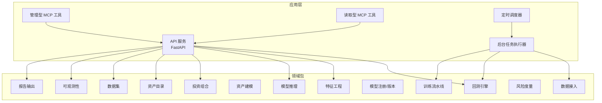
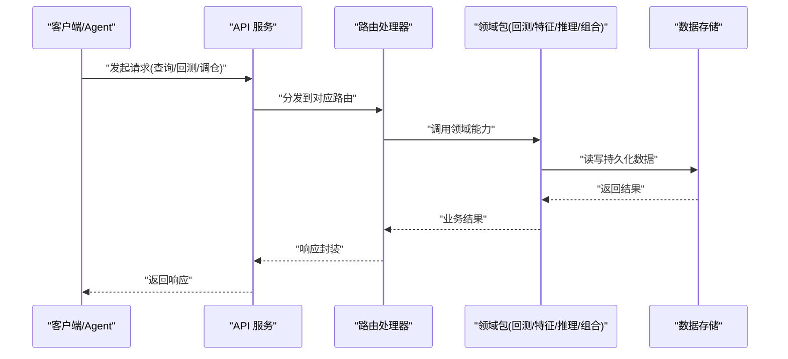
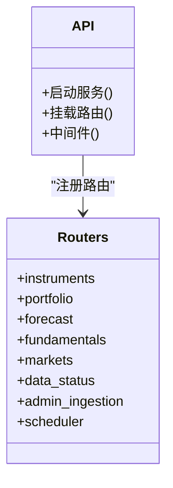
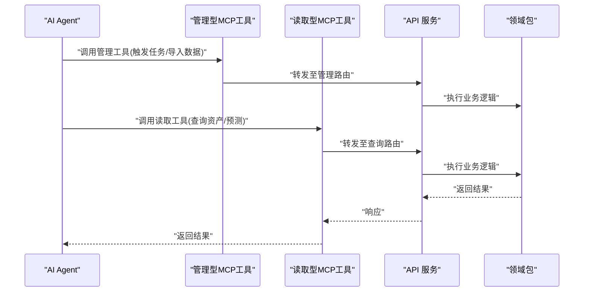
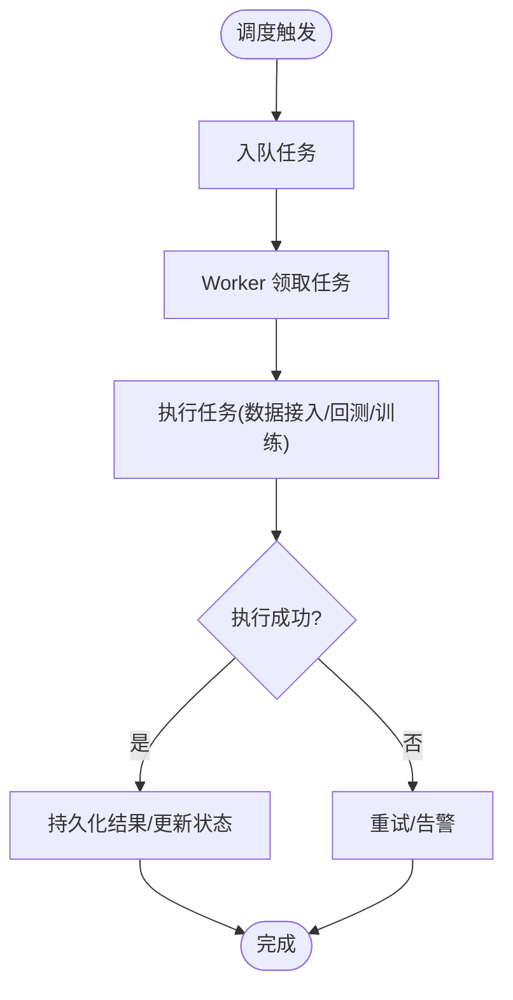
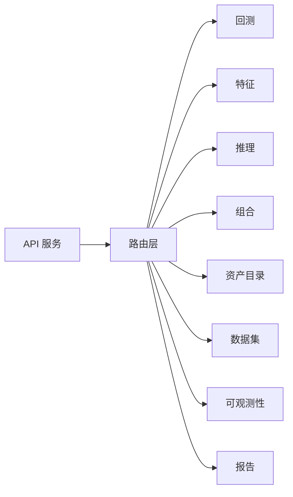

# 项目介绍

<cite>
**本文引用的文件**   
- [README.md](file://README.md)
- [apps/api/main.py](file://apps/api/main.py)
- [apps/api/routers/instruments.py](file://apps/api/routers/instruments.py)
- [apps/api/routers/portfolio.py](file://apps/api/routers/portfolio.py)
- [apps/api/routers/forecast.py](file://apps/api/routers/forecast.py)
- [apps/api/routers/fundamentals.py](file://apps/api/routers/fundamentals.py)
- [apps/api/routers/markets.py](file://apps/api/routers/markets.py)
- [apps/api/routers/data_status.py](file://apps/api/routers/data_status.py)
- [apps/api/routers/admin_ingestion.py](file://apps/api/routers/admin_ingestion.py)
- [apps/api/routers/scheduler.py](file://apps/api/routers/scheduler.py)
- [apps/quant-admin-mcp/tools.py](file://apps/quant-admin-mcp/tools.py)
- [apps/quant-read-mcp/tools.py](file://apps/quant-read-mcp/tools.py)
- [apps/scheduler/schedule.py](file://apps/scheduler/schedule.py)
- [apps/worker/main.py](file://apps/worker/main.py)
- [apps/worker/tasks.py](file://apps/worker/tasks.py)
- [packages/backtest/__init__.py](file://packages/backtest/__init__.py)
- [packages/features/__init__.py](file://packages/features/__init__.py)
- [packages/inference/__init__.py](file://packages/inference/__init__.py)
- [packages/ingestion/__init__.py](file://packages/ingestion/__init__.py)
- [packages/datasets/__init__.py](file://packages/datasets/__init__.py)
- [packages/instrument/__init__.py](file://packages/instrument/__init__.py)
- [packages/instruments/__init__.py](file://packages/instruments/__init__.py)
- [packages/portfolio/__init__.py](file://packages/portfolio/__init__.py)
- [packages/models/__init__.py](file://packages/models/__init__.py)
- [packages/observability/__init__.py](file://packages/observability/__init__.py)
- [packages/reporting/__init__.py](file://packages/reporting/__init__.py)
- [packages/risk/__init__.py](file://packages/risk/__init__.py)
- [packages/training/__init__.py](file://packages/training/__init__.py)
- [skills/cross-market-quant-research/SKILL.md](file://skills/cross-market-quant-research/SKILL.md)
- [readme/A股美股基金量化Agent_Skill+MCP模块实施规格_V4.md](file://readme/A股美股基金量化Agent_Skill+MCP模块实施规格_V4.md)
</cite>

## 目录
1. [简介](#简介)
2. [项目结构](#项目结构)
3. [核心组件](#核心组件)
4. [架构总览](#架构总览)
5. [详细组件分析](#详细组件分析)
6. [依赖关系分析](#依赖关系分析)
7. [性能与可扩展性](#性能与可扩展性)
8. [故障排查指南](#故障排查指南)
9. [结论](#结论)
10. [附录](#附录)

## 简介
本项目是一个面向多市场（A股、美股、基金）的量化投资平台，提供从数据接入、特征工程、模型推理、策略回测到投资组合管理与报告输出的端到端能力。系统以“Skill + MCP”为Agent集成范式，结合微服务化与插件化扩展设计，支持研究员快速迭代策略、AI开发者便捷接入工具、运维人员稳定部署与可观测运行。

核心价值主张：
- 跨市场统一数据与资产建模，降低多源异构数据处理成本
- 将研究流程产品化：从数据到信号、从信号到组合、从组合到报告
- 通过Skill+MCP将AI Agent无缝嵌入研究与生产工作流
- 以微服务与插件化提升系统的可维护性与可扩展性

适用人群与场景：
- 量化研究员：快速完成因子研发、回测验证与绩效归因
- AI开发者：基于MCP工具集构建与编排Agent，驱动自动化研究与运营任务
- 运维与SRE：通过标准化API、调度与可观测性实现高可用交付

## 项目结构
仓库采用应用层与包层分离的组织方式：
- apps：对外暴露的服务与入口，包括HTTP API、MCP工具、定时调度与后台Worker
- packages：按领域划分的业务包，如回测、特征、推理、数据接入、数据集、资产、组合、风控、训练、可观测性等
- skills：面向Agent的“技能”规范与参考文档，定义跨市场研究的标准流程与校验脚本
- sql/migrations：数据库迁移脚本，支撑资产、行情、公司行为、基本面等核心实体
- configs：基础与开发环境配置
- deploy：容器编排与监控采集配置

图表来源
- [apps/api/main.py](file://apps/api/main.py)
- [apps/quant-admin-mcp/tools.py](file://apps/quant-admin-mcp/tools.py)
- [apps/quant-read-mcp/tools.py](file://apps/quant-read-mcp/tools.py)
- [apps/scheduler/schedule.py](file://apps/scheduler/schedule.py)
- [apps/worker/main.py](file://apps/worker/main.py)
- [packages/backtest/__init__.py](file://packages/backtest/__init__.py)
- [packages/features/__init__.py](file://packages/features/__init__.py)
- [packages/inference/__init__.py](file://packages/inference/__init__.py)
- [packages/ingestion/__init__.py](file://packages/ingestion/__init__.py)
- [packages/datasets/__init__.py](file://packages/datasets/__init__.py)
- [packages/instrument/__init__.py](file://packages/instrument/__init__.py)
- [packages/instruments/__init__.py](file://packages/instruments/__init__.py)
- [packages/portfolio/__init__.py](file://packages/portfolio/__init__.py)
- [packages/models/__init__.py](file://packages/models/__init__.py)
- [packages/observability/__init__.py](file://packages/observability/__init__.py)
- [packages/reporting/__init__.py](file://packages/reporting/__init__.py)
- [packages/risk/__init__.py](file://packages/risk/__init__.py)
- [packages/training/__init__.py](file://packages/training/__init__.py)

章节来源
- [README.md](file://README.md)

## 核心组件
- 跨市场数据与资产建模
  - 统一资产标识与日历规则，覆盖A股、美股与基金
  - 公司行为处理（拆合股、分红、停复牌等）与净值事件
- 特征工程与模型推理
  - 标准化特征管线与模型家族路由，支持多模型族与在线/离线推理
- 策略回测引擎
  - 事件驱动或向量化回测，支持交易成本、滑点与资金约束
- 投资组合管理
  - 组合创建、调仓、持仓快照、绩效与风险指标计算
- 数据接入与质量
  - 多源适配器、转换与血缘追踪，保障数据一致性与可追溯
- 可观测性与报告
  - 指标采集、日志与审计事件，生成研究报告与合规材料
- Skill+MCP Agent集成
  - 通过MCP工具暴露研究与运营能力，Skill定义标准流程与校验

章节来源
- [packages/instrument/__init__.py](file://packages/instrument/__init__.py)
- [packages/instruments/__init__.py](file://packages/instruments/__init__.py)
- [packages/features/__init__.py](file://packages/features/__init__.py)
- [packages/inference/__init__.py](file://packages/inference/__init__.py)
- [packages/backtest/__init__.py](file://packages/backtest/__init__.py)
- [packages/portfolio/__init__.py](file://packages/portfolio/__init__.py)
- [packages/ingestion/__init__.py](file://packages/ingestion/__init__.py)
- [packages/observability/__init__.py](file://packages/observability/__init__.py)
- [packages/reporting/__init__.py](file://packages/reporting/__init__.py)
- [skills/cross-market-quant-research/SKILL.md](file://skills/cross-market-quant-research/SKILL.md)

## 架构总览
系统采用微服务化分层：
- 接口层：REST API 与 MCP 工具，作为统一入口
- 业务层：各领域包封装核心能力
- 执行层：调度器与Worker负责异步与批处理任务
- 数据层：数据库迁移与存储，支撑资产、行情、基本面与组合数据

图表来源
- [apps/api/main.py](file://apps/api/main.py)
- [apps/api/routers/instruments.py](file://apps/api/routers/instruments.py)
- [apps/api/routers/portfolio.py](file://apps/api/routers/portfolio.py)
- [apps/api/routers/forecast.py](file://apps/api/routers/forecast.py)
- [apps/api/routers/fundamentals.py](file://apps/api/routers/fundamentals.py)
- [apps/api/routers/markets.py](file://apps/api/routers/markets.py)
- [apps/api/routers/data_status.py](file://apps/api/routers/data_status.py)
- [apps/api/routers/admin_ingestion.py](file://apps/api/routers/admin_ingestion.py)
- [apps/api/routers/scheduler.py](file://apps/api/routers/scheduler.py)

## 详细组件分析

### API 服务与路由
- 作用：提供统一的REST接口，承载资产、预测、基本面、市场状态、数据健康检查、管理型数据接入与调度控制等能力
- 关键路由：
  - 资产相关：instruments
  - 投资组合：portfolio
  - 预测与信号：forecast
  - 基本面数据：fundamentals
  - 市场与日历：markets
  - 数据状态与健康：data_status
  - 管理型数据接入：admin_ingestion
  - 调度控制：scheduler

图表来源
- [apps/api/main.py](file://apps/api/main.py)
- [apps/api/routers/instruments.py](file://apps/api/routers/instruments.py)
- [apps/api/routers/portfolio.py](file://apps/api/routers/portfolio.py)
- [apps/api/routers/forecast.py](file://apps/api/routers/forecast.py)
- [apps/api/routers/fundamentals.py](file://apps/api/routers/fundamentals.py)
- [apps/api/routers/markets.py](file://apps/api/routers/markets.py)
- [apps/api/routers/data_status.py](file://apps/api/routers/data_status.py)
- [apps/api/routers/admin_ingestion.py](file://apps/api/routers/admin_ingestion.py)
- [apps/api/routers/scheduler.py](file://apps/api/routers/scheduler.py)

章节来源
- [apps/api/main.py](file://apps/api/main.py)
- [apps/api/routers/instruments.py](file://apps/api/routers/instruments.py)
- [apps/api/routers/portfolio.py](file://apps/api/routers/portfolio.py)
- [apps/api/routers/forecast.py](file://apps/api/routers/forecast.py)
- [apps/api/routers/fundamentals.py](file://apps/api/routers/fundamentals.py)
- [apps/api/routers/markets.py](file://apps/api/routers/markets.py)
- [apps/api/routers/data_status.py](file://apps/api/routers/data_status.py)
- [apps/api/routers/admin_ingestion.py](file://apps/api/routers/admin_ingestion.py)
- [apps/api/routers/scheduler.py](file://apps/api/routers/scheduler.py)

### MCP 工具（Skill+MCP）
- 管理型工具：用于数据接入、任务触发、系统管理等操作
- 读取型工具：用于查询资产、行情、预测、组合等只读能力
- 与Skill配合：Skill定义跨市场研究的标准流程与校验脚本，MCP工具作为Agent可调用的能力面

图表来源
- [apps/quant-admin-mcp/tools.py](file://apps/quant-admin-mcp/tools.py)
- [apps/quant-read-mcp/tools.py](file://apps/quant-read-mcp/tools.py)
- [apps/api/routers/admin_ingestion.py](file://apps/api/routers/admin_ingestion.py)
- [apps/api/routers/instruments.py](file://apps/api/routers/instruments.py)
- [apps/api/routers/forecast.py](file://apps/api/routers/forecast.py)

章节来源
- [apps/quant-admin-mcp/tools.py](file://apps/quant-admin-mcp/tools.py)
- [apps/quant-read-mcp/tools.py](file://apps/quant-read-mcp/tools.py)
- [skills/cross-market-quant-research/SKILL.md](file://skills/cross-market-quant-research/SKILL.md)
- [readme/A股美股基金量化Agent_Skill+MCP模块实施规格_V4.md](file://readme/A股美股基金量化Agent_Skill+MCP模块实施规格_V4.md)

### 调度与后台任务
- 调度器：负责任务编排与周期触发
- Worker：执行耗时任务，如数据接入、回测批量执行、训练流水线等

图表来源
- [apps/scheduler/schedule.py](file://apps/scheduler/schedule.py)
- [apps/worker/main.py](file://apps/worker/main.py)
- [apps/worker/tasks.py](file://apps/worker/tasks.py)

章节来源
- [apps/scheduler/schedule.py](file://apps/scheduler/schedule.py)
- [apps/worker/main.py](file://apps/worker/main.py)
- [apps/worker/tasks.py](file://apps/worker/tasks.py)

### 领域包概览
- 回测引擎：策略回放、成交模拟、绩效统计
- 特征工程：因子计算、标准化、缺失值处理
- 模型推理：模型加载、预测、版本管理
- 数据接入：多源适配、清洗、转换、血缘记录
- 数据集：常用数据集与基准
- 资产建模与目录：统一标识、分类、映射
- 投资组合：组合构建、调仓、持仓快照、绩效与风险
- 模型注册：模型元数据与版本
- 可观测性：指标、日志、审计
- 报告输出：研究与合规报告
- 风控：风险指标与限额
- 训练：模型训练流水线

章节来源
- [packages/backtest/__init__.py](file://packages/backtest/__init__.py)
- [packages/features/__init__.py](file://packages/features/__init__.py)
- [packages/inference/__init__.py](file://packages/inference/__init__.py)
- [packages/ingestion/__init__.py](file://packages/ingestion/__init__.py)
- [packages/datasets/__init__.py](file://packages/datasets/__init__.py)
- [packages/instrument/__init__.py](file://packages/instrument/__init__.py)
- [packages/instruments/__init__.py](file://packages/instruments/__init__.py)
- [packages/portfolio/__init__.py](file://packages/portfolio/__init__.py)
- [packages/models/__init__.py](file://packages/models/__init__.py)
- [packages/observability/__init__.py](file://packages/observability/__init__.py)
- [packages/reporting/__init__.py](file://packages/reporting/__init__.py)
- [packages/risk/__init__.py](file://packages/risk/__init__.py)
- [packages/training/__init__.py](file://packages/training/__init__.py)

## 依赖关系分析
- 低耦合高内聚：API仅依赖路由与领域包，领域包之间通过清晰的接口交互
- 外部依赖：数据库迁移脚本定义核心实体与关系，确保数据一致性
- 插件化扩展：新增市场或数据源可通过适配器与路由扩展，无需改动核心逻辑

图表来源
- [apps/api/main.py](file://apps/api/main.py)
- [packages/backtest/__init__.py](file://packages/backtest/__init__.py)
- [packages/features/__init__.py](file://packages/features/__init__.py)
- [packages/inference/__init__.py](file://packages/inference/__init__.py)
- [packages/portfolio/__init__.py](file://packages/portfolio/__init__.py)
- [packages/instruments/__init__.py](file://packages/instruments/__init__.py)
- [packages/datasets/__init__.py](file://packages/datasets/__init__.py)
- [packages/observability/__init__.py](file://packages/observability/__init__.py)
- [packages/reporting/__init__.py](file://packages/reporting/__init__.py)

## 性能与可扩展性
- 微服务化：API、调度、Worker独立部署，便于水平扩展与弹性伸缩
- 异步任务：耗时任务下沉至Worker，避免阻塞API响应
- 插件化：数据源、模型族、特征管线可按需替换与扩展
- 可观测性：指标与日志贯穿全链路，便于定位瓶颈与容量规划

[本节为通用指导，不直接分析具体文件]

## 故障排查指南
- 数据健康检查：通过数据状态路由确认数据新鲜度与完整性
- 管理型数据接入：使用管理路由进行数据导入与任务触发，关注错误码与日志
- 调度与Worker：检查调度任务是否按时触发，Worker是否成功消费并持久化结果
- 可观测性：查看指标与审计事件，定位异常与慢查询

章节来源
- [apps/api/routers/data_status.py](file://apps/api/routers/data_status.py)
- [apps/api/routers/admin_ingestion.py](file://apps/api/routers/admin_ingestion.py)
- [apps/api/routers/scheduler.py](file://apps/api/routers/scheduler.py)
- [apps/worker/tasks.py](file://apps/worker/tasks.py)
- [packages/observability/__init__.py](file://packages/observability/__init__.py)

## 结论
本平台以“Skill+MCP”为核心创新点，将AI Agent深度融入量化研究与生产流程；通过微服务与插件化架构，实现了跨市场数据统一、策略回测与投资组合管理的闭环能力。对量化研究员、AI开发者与运维人员均能提供高效、稳定、可扩展的工作体验。

[本节为总结性内容，不直接分析具体文件]

## 附录
- 技术优势与创新点
  - Skill+MCP：标准化研究流程与工具暴露，Agent可编排复杂任务
  - 微服务架构：职责清晰、易于扩展与部署
  - 插件化扩展：数据源、模型族、特征管线按需替换
- 适用场景
  - 量化研究员：因子研发、回测验证、组合优化
  - AI开发者：构建与研究驱动的Agent工作流
  - 运维人员：稳定交付、监控告警、容量规划

[本节为概念性说明，不直接分析具体文件]