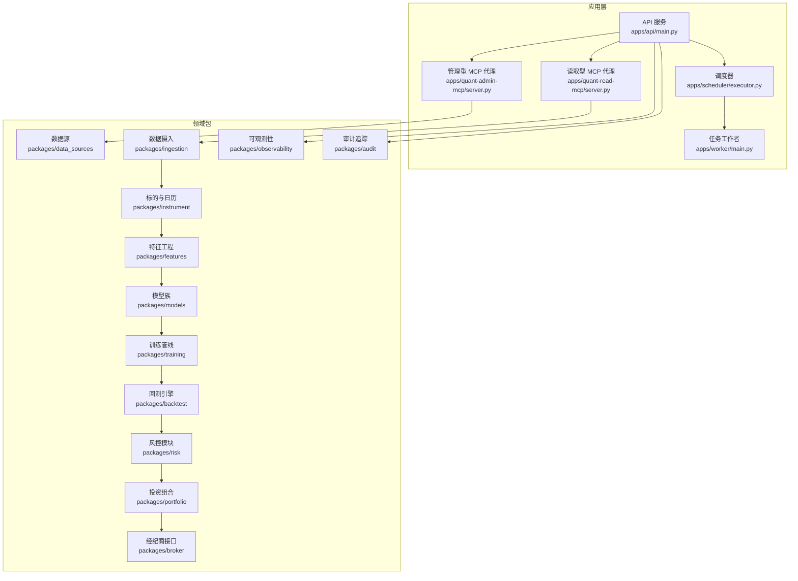
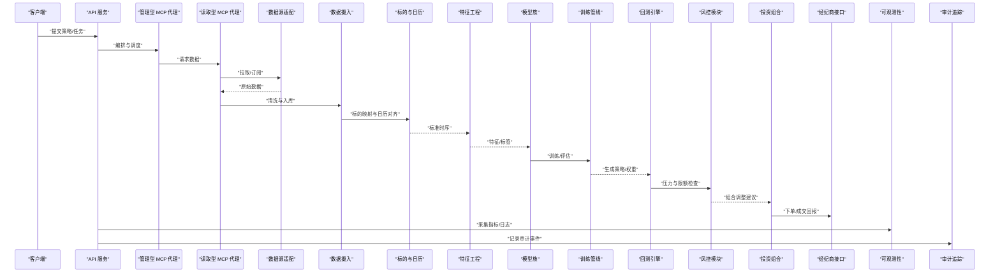
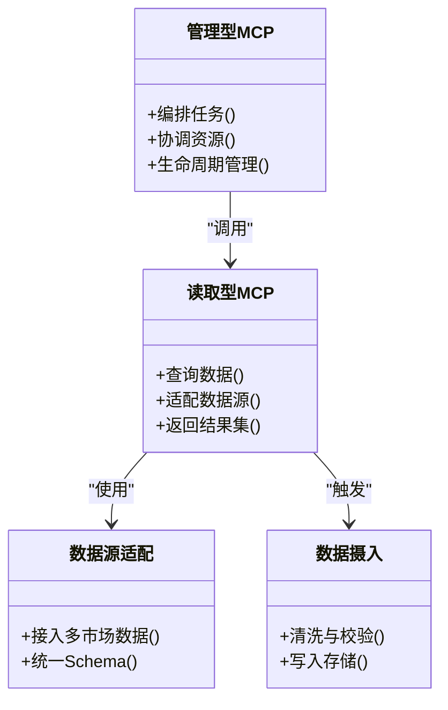
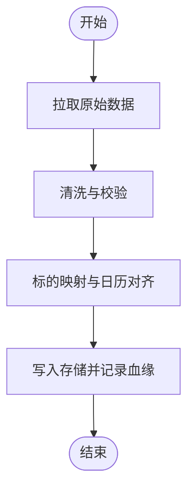
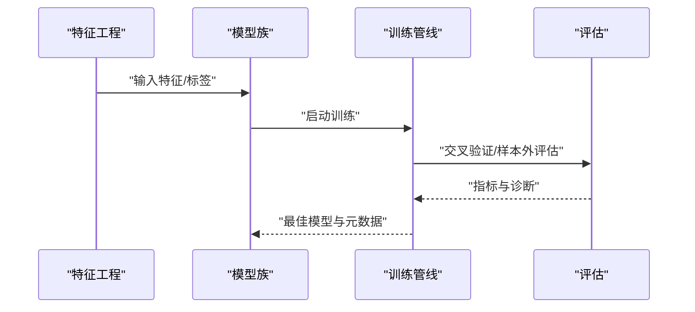
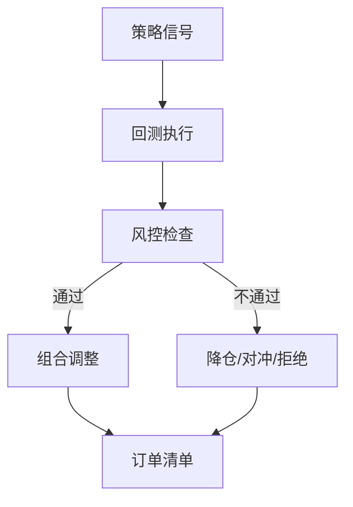
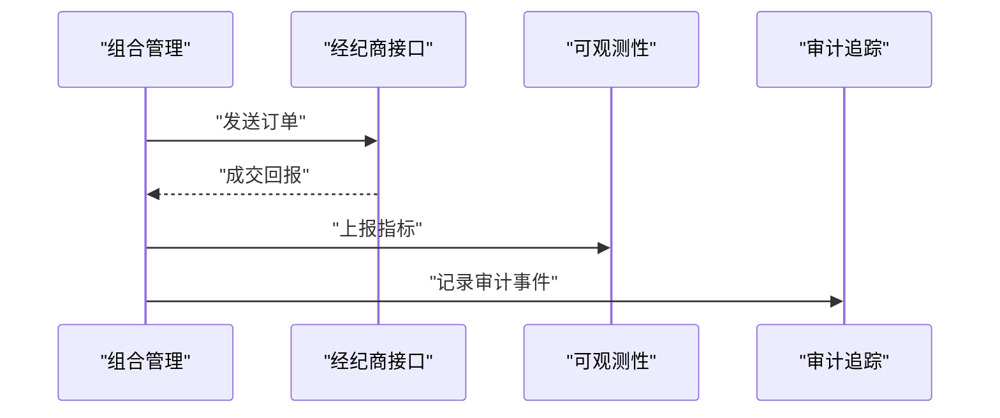
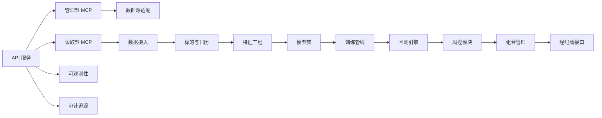

# 项目介绍与目标

<cite>
**本文引用的文件**   
- [README.md](file://README.md)
- [apps/api/main.py](file://apps/api/main.py)
- [apps/quant-admin-mcp/server.py](file://apps/quant-admin-mcp/server.py)
- [apps/quant-read-mcp/server.py](file://apps/quant-read-mcp/server.py)
- [apps/scheduler/executor.py](file://apps/scheduler/executor.py)
- [apps/worker/main.py](file://apps/worker/main.py)
- [packages/data_sources/__init__.py](file://packages/data_sources/__init__.py)
- [packages/ingestion/__init__.py](file://packages/ingestion/__init__.py)
- [packages/instrument/__init__.py](file://packages/instrument/__init__.py)
- [packages/features/__init__.py](file://packages/features/__init__.py)
- [packages/models/__init__.py](file://packages/models/__init__.py)
- [packages/backtest/__init__.py](file://packages/backtest/__init__.py)
- [packages/training/__init__.py](file://packages/training/__init__.py)
- [packages/risk/__init__.py](file://packages/risk/__init__.py)
- [packages/portfolio/__init__.py](file://packages/portfolio/__init__.py)
- [packages/broker/__init__.py](file://packages/broker/__init__.py)
- [packages/observability/__init__.py](file://packages/observability/__init__.py)
- [packages/audit/__init__.py](file://packages/audit/__init__.py)
- [deploy/docker-compose.yml](file://deploy/docker-compose.yml)
</cite>

## 目录
1. [引言](#引言)
2. [项目结构](#项目结构)
3. [核心组件](#核心组件)
4. [架构总览](#架构总览)
5. [详细组件分析](#详细组件分析)
6. [依赖关系分析](#依赖关系分析)
7. [性能考量](#性能考量)
8. [故障排查指南](#故障排查指南)
9. [结论](#结论)
10. [附录](#附录)

## 引言
本项目是一个基于多代理协作（MCP）的量化交易平台，旨在打通“数据—研究—回测—训练—评估—上线—监控—审计”的全链路。其核心目标是：
- 跨市场数据统一处理：将不同市场、不同来源的数据进行标准化接入、清洗与对齐，形成一致的研究与交易基座。
- AI代理智能协作：通过MCP协议在多个专业代理之间分工协作，完成从因子挖掘、模型训练到策略执行与风控的一体化流程。
- 端到端流水线：提供可编排、可观测、可审计的流水线能力，支持从离线研究到在线实盘的平滑迁移。

与传统方案相比，本项目的独特价值在于：
- 以MCP为通信契约的多代理体系，使数据、研究、交易等子系统解耦且可插拔扩展。
- 企业级可观测性与审计追踪，覆盖关键操作与数据血缘，满足合规与复盘需求。
- 面向实战的插件化架构，便于快速接入新数据源、新模型族与新交易渠道。

## 项目结构
仓库采用“应用层 + 领域包 + 部署配置”的分层组织方式：
- apps：对外暴露的服务与运行入口，包括API服务、MCP代理、调度器与任务工作者。
- packages：按领域划分的可复用模块，涵盖数据源、特征工程、模型、回测、风控、组合、经纪商、可观测与审计等。
- deploy：容器化部署与监控集成配置。
- scripts：常用脚本，用于数据导入、基线实验、自思考工作流、模拟盘等。
- skills：技能与校验脚本，规范研究产出与风险追踪。

图表来源
- [apps/api/main.py](file://apps/api/main.py)
- [apps/quant-admin-mcp/server.py](file://apps/quant-admin-mcp/server.py)
- [apps/quant-read-mcp/server.py](file://apps/quant-read-mcp/server.py)
- [apps/scheduler/executor.py](file://apps/scheduler/executor.py)
- [apps/worker/main.py](file://apps/worker/main.py)
- [packages/data_sources/__init__.py](file://packages/data_sources/__init__.py)
- [packages/ingestion/__init__.py](file://packages/ingestion/__init__.py)
- [packages/instrument/__init__.py](file://packages/instrument/__init__.py)
- [packages/features/__init__.py](file://packages/features/__init__.py)
- [packages/models/__init__.py](file://packages/models/__init__.py)
- [packages/backtest/__init__.py](file://packages/backtest/__init__.py)
- [packages/training/__init__.py](file://packages/training/__init__.py)
- [packages/risk/__init__.py](file://packages/risk/__init__.py)
- [packages/portfolio/__init__.py](file://packages/portfolio/__init__.py)
- [packages/broker/__init__.py](file://packages/broker/__init__.py)
- [packages/observability/__init__.py](file://packages/observability/__init__.py)
- [packages/audit/__init__.py](file://packages/audit/__init__.py)

章节来源
- [README.md](file://README.md)
- [deploy/docker-compose.yml](file://deploy/docker-compose.yml)

## 核心组件
- 多代理协作（MCP）
  - 管理型代理负责策略编排、资源协调与生命周期管理。
  - 读取型代理专注数据访问与查询，屏蔽底层异构数据源的差异。
- 数据与标的治理
  - 数据源抽象与适配，统一接入多市场数据。
  - 标的主数据与日历规则，保证时间序列对齐与事件处理一致性。
- 研究与建模
  - 特征工程与标签构建，支撑因子与信号研发。
  - 模型注册与训练管线，支持多种模型族与版本管理。
- 回测与评估
  - 回测引擎与评估指标，保障策略稳健性与泛化能力。
- 交易与风控
  - 组合管理与订单路由，对接经纪商或模拟环境。
  - 风控模块贯穿全流程，实现事前、事中、事后控制。
- 可观测与审计
  - 指标、日志与追踪采集，配合审计事件记录，满足合规与复盘。

章节来源
- [apps/quant-admin-mcp/server.py](file://apps/quant-admin-mcp/server.py)
- [apps/quant-read-mcp/server.py](file://apps/quant-read-mcp/server.py)
- [packages/data_sources/__init__.py](file://packages/data_sources/__init__.py)
- [packages/ingestion/__init__.py](file://packages/ingestion/__init__.py)
- [packages/instrument/__init__.py](file://packages/instrument/__init__.py)
- [packages/features/__init__.py](file://packages/features/__init__.py)
- [packages/models/__init__.py](file://packages/models/__init__.py)
- [packages/backtest/__init__.py](file://packages/backtest/__init__.py)
- [packages/training/__init__.py](file://packages/training/__init__.py)
- [packages/risk/__init__.py](file://packages/risk/__init__.py)
- [packages/portfolio/__init__.py](file://packages/portfolio/__init__.py)
- [packages/broker/__init__.py](file://packages/broker/__init__.py)
- [packages/observability/__init__.py](file://packages/observability/__init__.py)
- [packages/audit/__init__.py](file://packages/audit/__init__.py)

## 架构总览
系统由API网关、MCP代理、调度器与工作者组成，内部通过领域包协同完成数据与研究到交易的闭环。

图表来源
- [apps/api/main.py](file://apps/api/main.py)
- [apps/quant-admin-mcp/server.py](file://apps/quant-admin-mcp/server.py)
- [apps/quant-read-mcp/server.py](file://apps/quant-read-mcp/server.py)
- [packages/data_sources/__init__.py](file://packages/data_sources/__init__.py)
- [packages/ingestion/__init__.py](file://packages/ingestion/__init__.py)
- [packages/instrument/__init__.py](file://packages/instrument/__init__.py)
- [packages/features/__init__.py](file://packages/features/__init__.py)
- [packages/models/__init__.py](file://packages/models/__init__.py)
- [packages/training/__init__.py](file://packages/training/__init__.py)
- [packages/backtest/__init__.py](file://packages/backtest/__init__.py)
- [packages/risk/__init__.py](file://packages/risk/__init__.py)
- [packages/portfolio/__init__.py](file://packages/portfolio/__init__.py)
- [packages/broker/__init__.py](file://packages/broker/__init__.py)
- [packages/observability/__init__.py](file://packages/observability/__init__.py)
- [packages/audit/__init__.py](file://packages/audit/__init__.py)

## 详细组件分析

### 多代理协作（MCP）
- 管理型代理：负责任务编排、状态同步与资源分配，驱动端到端流水线。
- 读取型代理：封装数据访问细节，提供统一的查询语义，屏蔽多源异构差异。
- 通信机制：基于MCP协议的标准化消息格式与工具调用约定，确保代理间松耦合与高内聚。

图表来源
- [apps/quant-admin-mcp/server.py](file://apps/quant-admin-mcp/server.py)
- [apps/quant-read-mcp/server.py](file://apps/quant-read-mcp/server.py)
- [packages/data_sources/__init__.py](file://packages/data_sources/__init__.py)
- [packages/ingestion/__init__.py](file://packages/ingestion/__init__.py)

章节来源
- [apps/quant-admin-mcp/server.py](file://apps/quant-admin-mcp/server.py)
- [apps/quant-read-mcp/server.py](file://apps/quant-read-mcp/server.py)

### 数据与标的治理
- 数据源抽象：定义统一接口，支持批量拉取与增量更新。
- 数据摄入：负责去重、对齐、异常检测与血缘记录。
- 标的与日历：维护主数据、交易日历与事件表，确保时间轴一致。

图表来源
- [packages/data_sources/__init__.py](file://packages/data_sources/__init__.py)
- [packages/ingestion/__init__.py](file://packages/ingestion/__init__.py)
- [packages/instrument/__init__.py](file://packages/instrument/__init__.py)

章节来源
- [packages/data_sources/__init__.py](file://packages/data_sources/__init__.py)
- [packages/ingestion/__init__.py](file://packages/ingestion/__init__.py)
- [packages/instrument/__init__.py](file://packages/instrument/__init__.py)

### 研究与建模
- 特征工程：从标准时序构造因子与标签，支持滚动窗口与前瞻偏差防护。
- 模型族：提供多种算法族与注册机制，便于替换与对比。
- 训练管线：自动化训练、验证与评估，输出可复现实验产物。

图表来源
- [packages/features/__init__.py](file://packages/features/__init__.py)
- [packages/models/__init__.py](file://packages/models/__init__.py)
- [packages/training/__init__.py](file://packages/training/__init__.py)

章节来源
- [packages/features/__init__.py](file://packages/features/__init__.py)
- [packages/models/__init__.py](file://packages/models/__init__.py)
- [packages/training/__init__.py](file://packages/training/__init__.py)

### 回测与风控
- 回测引擎：支持事件驱动与向量化两种模式，提供滑点、手续费与流动性约束。
- 风控模块：贯穿策略前后，实现头寸、杠杆、回撤与集中度限制。
- 组合管理：根据信号与风控建议动态调仓，输出可执行的订单清单。

图表来源
- [packages/backtest/__init__.py](file://packages/backtest/__init__.py)
- [packages/risk/__init__.py](file://packages/risk/__init__.py)
- [packages/portfolio/__init__.py](file://packages/portfolio/__init__.py)

章节来源
- [packages/backtest/__init__.py](file://packages/backtest/__init__.py)
- [packages/risk/__init__.py](file://packages/risk/__init__.py)
- [packages/portfolio/__init__.py](file://packages/portfolio/__init__.py)

### 交易执行与可观测性
- 经纪商接口：统一订单路由与回报解析，支持模拟与真实通道切换。
- 可观测性：采集指标、日志与追踪，辅助定位问题与性能优化。
- 审计追踪：记录关键决策与变更，满足合规与复盘要求。

图表来源
- [packages/broker/__init__.py](file://packages/broker/__init__.py)
- [packages/observability/__init__.py](file://packages/observability/__init__.py)
- [packages/audit/__init__.py](file://packages/audit/__init__.py)

章节来源
- [packages/broker/__init__.py](file://packages/broker/__init__.py)
- [packages/observability/__init__.py](file://packages/observability/__init__.py)
- [packages/audit/__init__.py](file://packages/audit/__init__.py)

## 依赖关系分析
- 应用层依赖领域包：API与MCP代理通过依赖注入或显式引用调用领域能力。
- 领域包内聚与解耦：每个包聚焦单一职责，通过清晰接口交互，降低耦合度。
- 外部集成点：数据源、存储、消息队列与监控系统通过适配器或配置接入。

图表来源
- [apps/api/main.py](file://apps/api/main.py)
- [apps/quant-admin-mcp/server.py](file://apps/quant-admin-mcp/server.py)
- [apps/quant-read-mcp/server.py](file://apps/quant-read-mcp/server.py)
- [packages/data_sources/__init__.py](file://packages/data_sources/__init__.py)
- [packages/ingestion/__init__.py](file://packages/ingestion/__init__.py)
- [packages/instrument/__init__.py](file://packages/instrument/__init__.py)
- [packages/features/__init__.py](file://packages/features/__init__.py)
- [packages/models/__init__.py](file://packages/models/__init__.py)
- [packages/training/__init__.py](file://packages/training/__init__.py)
- [packages/backtest/__init__.py](file://packages/backtest/__init__.py)
- [packages/risk/__init__.py](file://packages/risk/__init__.py)
- [packages/portfolio/__init__.py](file://packages/portfolio/__init__.py)
- [packages/broker/__init__.py](file://packages/broker/__init__.py)
- [packages/observability/__init__.py](file://packages/observability/__init__.py)
- [packages/audit/__init__.py](file://packages/audit/__init__.py)

章节来源
- [apps/api/main.py](file://apps/api/main.py)
- [apps/quant-admin-mcp/server.py](file://apps/quant-admin-mcp/server.py)
- [apps/quant-read-mcp/server.py](file://apps/quant-read-mcp/server.py)

## 性能考量
- 数据接入与摄入：优先增量更新与并行拉取，减少全量重复计算；对热点标的做缓存与预聚合。
- 特征与模型：利用向量化计算与批处理，避免逐条循环；对训练任务进行资源隔离与弹性伸缩。
- 回测与执行：事件驱动模式下注意内存占用与I/O瓶颈；订单路由采用异步与重试机制提升吞吐。
- 可观测与审计：采样与分层落盘，避免高频指标影响主路径性能。

[本节为通用指导，无需具体文件来源]

## 故障排查指南
- 数据不一致：核对标的映射与日历对齐逻辑，检查数据血缘与版本标记。
- 模型退化：查看训练日志与评估指标，确认特征泄露与样本外表现。
- 回测异常：检查滑点、手续费与流动性假设，复核事件顺序与缺失值处理。
- 执行失败：确认经纪商连接与认证，核查订单校验与风控拦截原因。
- 监控告警：结合指标与日志定位瓶颈，必要时启用更细粒度的追踪。

章节来源
- [packages/observability/__init__.py](file://packages/observability/__init__.py)
- [packages/audit/__init__.py](file://packages/audit/__init__.py)

## 结论
本项目以MCP协议为核心，构建了多代理协作的量化交易基础设施。通过统一的数据治理、可扩展的研究与建模、严谨的回测与风控、以及完善的可观测与审计能力，实现了从研究到实盘的完整闭环。对于希望快速搭建高质量量化平台的团队与个人而言，该项目提供了开箱即用的能力与灵活的扩展空间。

[本节为总结性内容，无需具体文件来源]

## 附录
- 适用人群
  - 量化研究员：快速完成数据准备、因子研发与模型迭代。
  - 策略工程师：便捷地将策略落地为可回测、可上线的工程化产品。
  - 运维与合规人员：借助可观测与审计能力保障系统稳定与合规。
- 典型应用场景
  - 跨市场多资产策略研发与回测
  - 多模型融合与自动机器学习流水线
  - 实时信号生成与低延迟执行
  - 策略监控、归因分析与风险预警

[本节为概念性说明，无需具体文件来源]