# 项目概述

<cite>
**本文引用的文件**   
- [README.md](file://README.md)
- [pyproject.toml](file://pyproject.toml)
- [apps/api/main.py](file://apps/api/main.py)
- [apps/worker/main.py](file://apps/worker/main.py)
- [apps/scheduler/schedule.py](file://apps/scheduler/schedule.py)
- [deploy/docker-compose.yml](file://deploy/docker-compose.yml)
- [packages/backtest/__init__.py](file://packages/backtest/__init__.py)
- [packages/ingestion/__init__.py](file://packages/ingestion/__init__.py)
- [packages/data_sources/__init__.py](file://packages/data_sources/__init__.py)
- [packages/datasets/__init__.py](file://packages/datasets/__init__.py)
- [packages/instruments/__init__.py](file://packages/instruments/__init__.py)
- [packages/features/__init__.py](file://packages/features/__init__.py)
- [packages/models/__init__.py](file://packages/models/__init__.py)
- [packages/training/__init__.py](file://packages/training/__init__.py)
- [packages/inference/__init__.py](file://packages/inference/__init__.py)
- [packages/portfolio/__init__.py](file://packages/portfolio/__init__.py)
- [packages/risk/__init__.py](file://packages/risk/__init__.py)
- [packages/evaluation/__init__.py](file://packages/evaluation/__init__.py)
- [packages/reporting/__init__.py](file://packages/reporting/__init__.py)
- [packages/observability/__init__.py](file://packages/observability/__init__.py)
- [packages/corporate_actions/__init__.py](file://packages/corporate_actions/__init__.py)
- [packages/calendar_rule/__init__.py](file://packages/calendar_rule/__init__.py)
- [packages/fundamentals/__init__.py](file://packages/fundamentals/__init__.py)
- [packages/audit/__init__.py](file://packages/audit/__init__.py)
- [packages/data_quality/__init__.py](file://packages/data_quality/__init__.py)
- [packages/ledger_paper/__init__.py](file://packages/ledger_paper/__init__.py)
- [packages/drift/__init__.py](file://packages/drift/__init__.py)
- [packages/labels/__init__.py](file://packages/labels/__init__.py)
- [sql/migrations/env.py](file://sql/migrations/env.py)
- [alembic.ini](file://alembic.ini)
- [configs/base.yaml](file://configs/base.yaml)
- [configs/dev.yaml](file://configs/dev.yaml)
- [skills/cross-market-quant-research/SKILL.md](file://skills/cross-market-quant-research/SKILL.md)
</cite>

## 目录
1. [简介](#简介)
2. [项目结构](#项目结构)
3. [核心组件](#核心组件)
4. [架构总览](#架构总览)
5. [详细组件分析](#详细组件分析)
6. [依赖关系分析](#依赖关系分析)
7. [性能考量](#性能考量)
8. [故障排查指南](#故障排查指南)
9. [结论](#结论)
10. [附录](#附录)

## 简介
本项目是一个面向多市场的量化投资系统，围绕“数据—特征—模型—回测—评估—报告”的完整闭环构建。系统采用微服务与插件化设计，结合事件驱动模式，支持跨市场（如A股、美股、基金）的数据接入、统一标识、公司行为处理、因子与标签工程、训练与推理、组合与风控、回测与评估、可观测性与审计追踪等能力。同时提供API服务、定时调度与后台任务执行器，便于在本地或容器环境中快速部署与扩展。

## 项目结构
仓库采用“应用层 + 领域包 + 配置与部署 + 迁移脚本 + 技能规范”的分层组织方式：
- apps：对外暴露的服务与任务执行入口（API、Worker、Scheduler）
- packages：按领域划分的可复用模块（数据源、数据集、标的、特征、模型、训练、推理、组合、风控、回测、评估、报告、可观测性、审计、日历规则、公司行为、基本面、漂移检测、标签、账本与模拟交易等）
- configs：环境与运行配置
- deploy：容器编排与监控配置
- sql/migrations：数据库迁移脚本
- skills：跨市场量化研究技能规范与校验工具
- tests：单元与集成测试

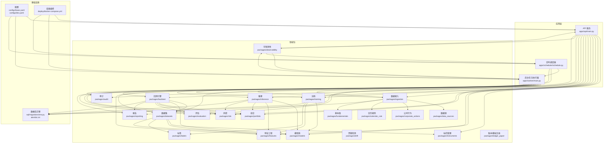

图表来源
- [apps/api/main.py](file://apps/api/main.py)
- [apps/worker/main.py](file://apps/worker/main.py)
- [apps/scheduler/schedule.py](file://apps/scheduler/schedule.py)
- [packages/ingestion/__init__.py](file://packages/ingestion/__init__.py)
- [packages/data_sources/__init__.py](file://packages/data_sources/__init__.py)
- [packages/datasets/__init__.py](file://packages/datasets/__init__.py)
- [packages/instruments/__init__.py](file://packages/instruments/__init__.py)
- [packages/features/__init__.py](file://packages/features/__init__.py)
- [packages/models/__init__.py](file://packages/models/__init__.py)
- [packages/training/__init__.py](file://packages/training/__init__.py)
- [packages/inference/__init__.py](file://packages/inference/__init__.py)
- [packages/portfolio/__init__.py](file://packages/portfolio/__init__.py)
- [packages/risk/__init__.py](file://packages/risk/__init__.py)
- [packages/backtest/__init__.py](file://packages/backtest/__init__.py)
- [packages/evaluation/__init__.py](file://packages/evaluation/__init__.py)
- [packages/reporting/__init__.py](file://packages/reporting/__init__.py)
- [packages/observability/__init__.py](file://packages/observability/__init__.py)
- [packages/audit/__init__.py](file://packages/audit/__init__.py)
- [packages/corporate_actions/__init__.py](file://packages/corporate_actions/__init__.py)
- [packages/calendar_rule/__init__.py](file://packages/calendar_rule/__init__.py)
- [packages/fundamentals/__init__.py](file://packages/fundamentals/__init__.py)
- [packages/drift/__init__.py](file://packages/drift/__init__.py)
- [packages/labels/__init__.py](file://packages/labels/__init__.py)
- [packages/ledger_paper/__init__.py](file://packages/ledger_paper/__init__.py)
- [sql/migrations/env.py](file://sql/migrations/env.py)
- [alembic.ini](file://alembic.ini)
- [configs/base.yaml](file://configs/base.yaml)
- [configs/dev.yaml](file://configs/dev.yaml)
- [deploy/docker-compose.yml](file://deploy/docker-compose.yml)

章节来源
- [README.md](file://README.md)
- [pyproject.toml](file://pyproject.toml)
- [deploy/docker-compose.yml](file://deploy/docker-compose.yml)

## 核心组件
- 数据接入与治理
  - 数据源适配：统一封装多市场数据源，屏蔽差异
  - 数据接入管道：清洗、对齐、去重、时间线补齐、缺失值处理
  - 公司行为与日历：除权除息、停牌复牌、节假日与早收市处理
  - 质量与审计：数据血缘、版本化、变更审计与回溯
- 标的与数据集
  - 标的主数据：跨市场统一标识、映射与生命周期管理
  - 数据集工厂：按策略需求拼装Bar、基本面、标签等面板数据
- 特征与标签工程
  - 因子库：技术指标、截面/时序因子、宏观与另类数据融合
  - 标签体系：预测目标定义、滚动窗口与前瞻偏差控制
- 模型与训练
  - 模型族抽象：树模型、线性模型、深度学习等统一接口
  - 训练流水线：交叉验证、超参搜索、早停与模型注册
- 推理与组合
  - 在线/离线推理：批量与流式推理、延迟与吞吐控制
  - 组合构建：权重优化、约束与再平衡、交易成本建模
- 风控与评估
  - 风险度量：波动率、回撤、VaR、压力测试、归因分析
  - 评估指标：夏普、信息比率、换手率、滑点与冲击
- 回测引擎
  - 事件驱动回测：撮合、订单簿、成交与持仓更新
  - 多资产与多频率：Tick/分钟/日线混合回测
- 报告与可观测性
  - 报告生成：PDF/HTML/JSON，含净值曲线、风险与归因
  - 可观测性：指标、日志、链路追踪与告警
- 服务与调度
  - API服务：REST接口，暴露数据、模型、回测与报告查询
  - 后台任务：异步执行长耗时任务（ETL、训练、回测）
  - 定时调度：周期任务编排与重试

章节来源
- [packages/ingestion/__init__.py](file://packages/ingestion/__init__.py)
- [packages/data_sources/__init__.py](file://packages/data_sources/__init__.py)
- [packages/corporate_actions/__init__.py](file://packages/corporate_actions/__init__.py)
- [packages/calendar_rule/__init__.py](file://packages/calendar_rule/__init__.py)
- [packages/instruments/__init__.py](file://packages/instruments/__init__.py)
- [packages/datasets/__init__.py](file://packages/datasets/__init__.py)
- [packages/features/__init__.py](file://packages/features/__init__.py)
- [packages/labels/__init__.py](file://packages/labels/__init__.py)
- [packages/models/__init__.py](file://packages/models/__init__.py)
- [packages/training/__init__.py](file://packages/training/__init__.py)
- [packages/inference/__init__.py](file://packages/inference/__init__.py)
- [packages/portfolio/__init__.py](file://packages/portfolio/__init__.py)
- [packages/risk/__init__.py](file://packages/risk/__init__.py)
- [packages/evaluation/__init__.py](file://packages/evaluation/__init__.py)
- [packages/backtest/__init__.py](file://packages/backtest/__init__.py)
- [packages/reporting/__init__.py](file://packages/reporting/__init__.py)
- [packages/observability/__init__.py](file://packages/observability/__init__.py)
- [packages/audit/__init__.py](file://packages/audit/__init__.py)
- [packages/drift/__init__.py](file://packages/drift/__init__.py)
- [packages/fundamentals/__init__.py](file://packages/fundamentals/__init__.py)
- [packages/ledger_paper/__init__.py](file://packages/ledger_paper/__init__.py)
- [apps/api/main.py](file://apps/api/main.py)
- [apps/worker/main.py](file://apps/worker/main.py)
- [apps/scheduler/schedule.py](file://apps/scheduler/schedule.py)

## 架构总览
系统采用“微服务 + 插件化 + 事件驱动”的总体架构：
- 微服务边界清晰：API服务负责请求路由与编排；Worker负责异步任务；Scheduler负责周期任务
- 插件化扩展：数据源、模型族、特征与标签、风控与评估均可通过插件机制替换与扩展
- 事件驱动：以数据集与模型版本为事件中心，触发训练、推理、回测与报告生成

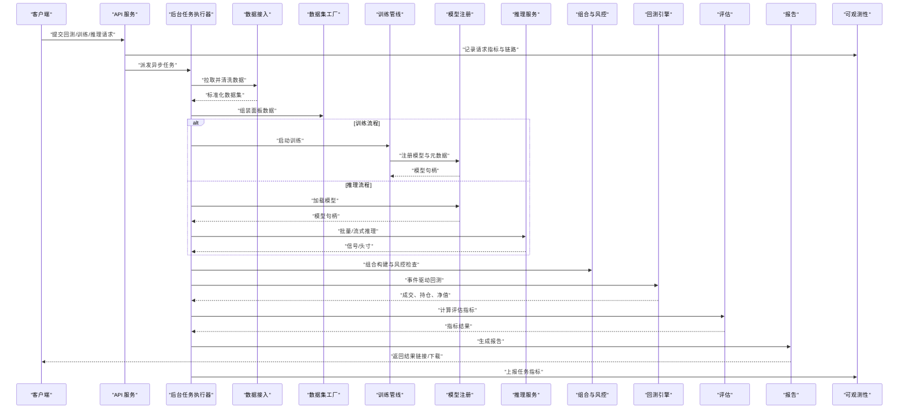

图表来源
- [apps/api/main.py](file://apps/api/main.py)
- [apps/worker/main.py](file://apps/worker/main.py)
- [packages/ingestion/__init__.py](file://packages/ingestion/__init__.py)
- [packages/datasets/__init__.py](file://packages/datasets/__init__.py)
- [packages/training/__init__.py](file://packages/training/__init__.py)
- [packages/models/__init__.py](file://packages/models/__init__.py)
- [packages/inference/__init__.py](file://packages/inference/__init__.py)
- [packages/portfolio/__init__.py](file://packages/portfolio/__init__.py)
- [packages/risk/__init__.py](file://packages/risk/__init__.py)
- [packages/backtest/__init__.py](file://packages/backtest/__init__.py)
- [packages/evaluation/__init__.py](file://packages/evaluation/__init__.py)
- [packages/reporting/__init__.py](file://packages/reporting/__init__.py)
- [packages/observability/__init__.py](file://packages/observability/__init__.py)

## 详细组件分析

### 数据接入与治理（Ingestion & Data Sources）
- 职责：对接多市场数据源，完成清洗、对齐、去重、时间线补齐与公司行为调整
- 关键能力：
  - 多源适配器：统一接口，支持增量与全量同步
  - 公司行为：拆合股、分红派息、暂停/恢复上市
  - 日历规则：交易日识别、早收市、节假日
  - 质量与审计：数据血缘、版本化、变更审计
- 典型流程：拉取原始数据 → 标准化 → 公司行为调整 → 写入持久化存储 → 发布数据集事件

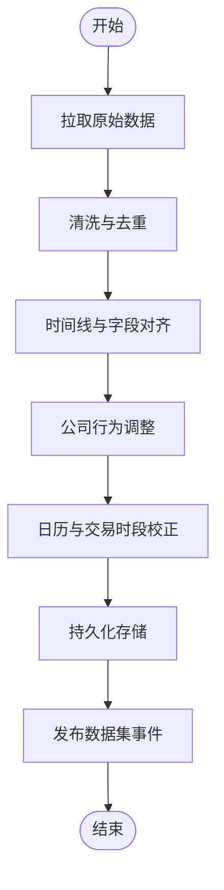

图表来源
- [packages/ingestion/__init__.py](file://packages/ingestion/__init__.py)
- [packages/data_sources/__init__.py](file://packages/data_sources/__init__.py)
- [packages/corporate_actions/__init__.py](file://packages/corporate_actions/__init__.py)
- [packages/calendar_rule/__init__.py](file://packages/calendar_rule/__init__.py)
- [packages/audit/__init__.py](file://packages/audit/__init__.py)

章节来源
- [packages/ingestion/__init__.py](file://packages/ingestion/__init__.py)
- [packages/data_sources/__init__.py](file://packages/data_sources/__init__.py)
- [packages/corporate_actions/__init__.py](file://packages/corporate_actions/__init__.py)
- [packages/calendar_rule/__init__.py](file://packages/calendar_rule/__init__.py)
- [packages/audit/__init__.py](file://packages/audit/__init__.py)

### 标的与数据集（Instruments & Datasets）
- 职责：维护跨市场标的主数据，按策略需求拼装面板数据
- 关键能力：
  - 统一标识：跨市场ID规范化与映射
  - 生命周期：上市、退市、更名、代码变更
  - 数据集工厂：Bar、基本面、标签、衍生数据的按需装配
- 使用建议：在特征与模型前明确标的范围与时间窗，避免未来函数与幸存者偏差

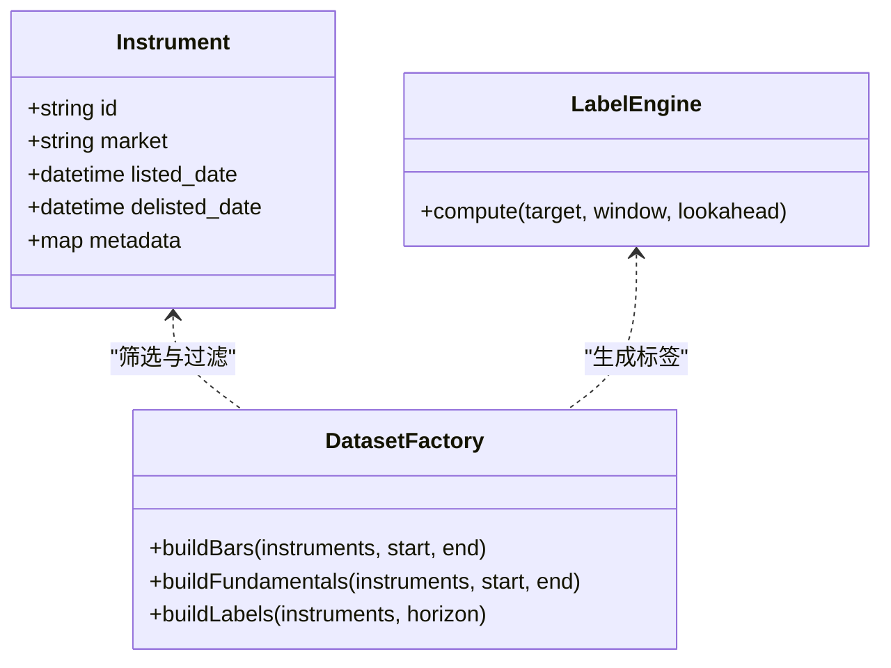

图表来源
- [packages/instruments/__init__.py](file://packages/instruments/__init__.py)
- [packages/datasets/__init__.py](file://packages/datasets/__init__.py)
- [packages/labels/__init__.py](file://packages/labels/__init__.py)

章节来源
- [packages/instruments/__init__.py](file://packages/instruments/__init__.py)
- [packages/datasets/__init__.py](file://packages/datasets/__init__.py)
- [packages/labels/__init__.py](file://packages/labels/__init__.py)

### 特征与标签工程（Features & Labels）
- 职责：实现因子与标签的计算、缓存与版本化
- 关键能力：
  - 因子库：技术指标、截面/时序因子、基本面因子
  - 标签体系：收益率、涨跌分类、波动区间等
  - 防泄漏：严格的时间切分与前瞻期控制
- 最佳实践：对因子进行标准化与中性化处理，避免过拟合

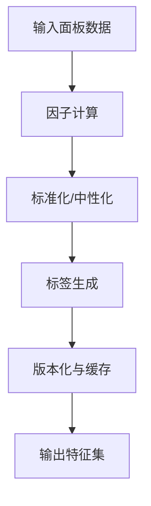

图表来源
- [packages/features/__init__.py](file://packages/features/__init__.py)
- [packages/labels/__init__.py](file://packages/labels/__init__.py)

章节来源
- [packages/features/__init__.py](file://packages/features/__init__.py)
- [packages/labels/__init__.py](file://packages/labels/__init__.py)

### 模型与训练（Models & Training）
- 职责：提供统一的模型接口与训练流水线
- 关键能力：
  - 模型族抽象：树模型、线性模型、深度学习等
  - 训练管线：交叉验证、超参搜索、早停、模型注册
  - 可复现：随机种子、环境快照、数据与特征版本绑定
- 建议：将模型与特征/数据版本强绑定，确保线上一致性

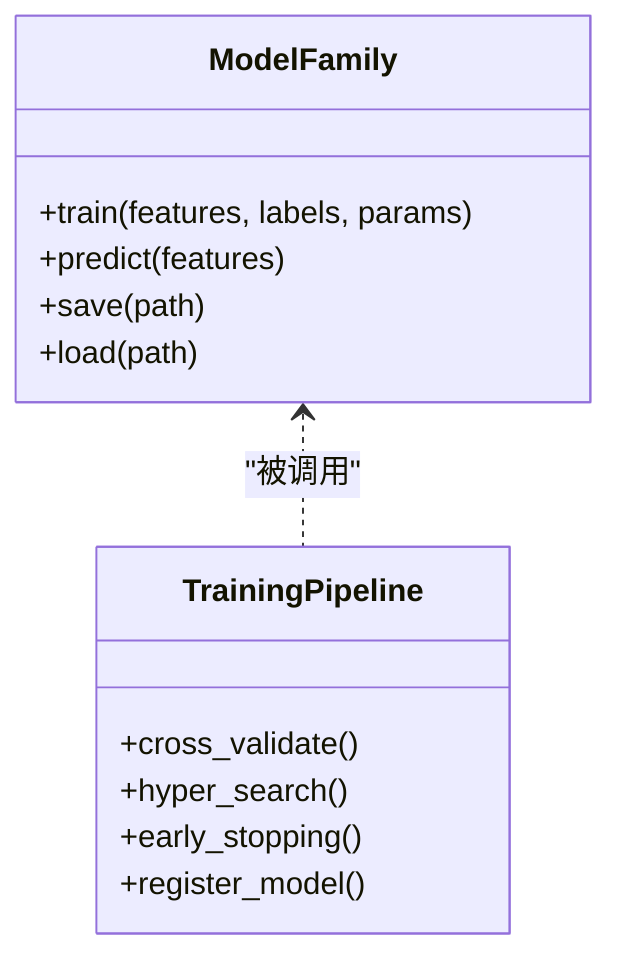

图表来源
- [packages/models/__init__.py](file://packages/models/__init__.py)
- [packages/training/__init__.py](file://packages/training/__init__.py)

章节来源
- [packages/models/__init__.py](file://packages/models/__init__.py)
- [packages/training/__init__.py](file://packages/training/__init__.py)

### 推理与组合（Inference & Portfolio）
- 职责：将模型信号转化为可执行的组合头寸
- 关键能力：
  - 批量/流式推理：低延迟与高吞吐
  - 组合构建：权重优化、约束、再平衡
  - 交易成本与流动性建模
- 建议：设置最大换手率与集中度限制，降低交易摩擦

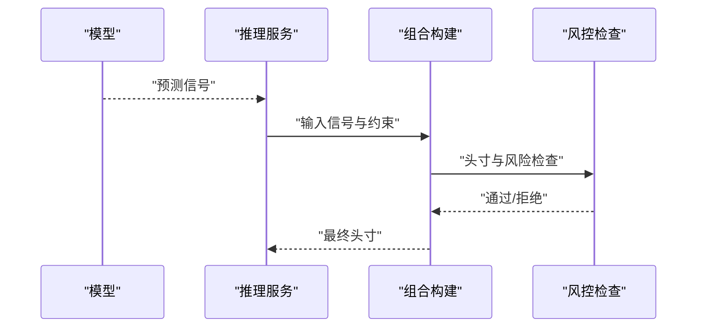

图表来源
- [packages/inference/__init__.py](file://packages/inference/__init__.py)
- [packages/portfolio/__init__.py](file://packages/portfolio/__init__.py)
- [packages/risk/__init__.py](file://packages/risk/__init__.py)

章节来源
- [packages/inference/__init__.py](file://packages/inference/__init__.py)
- [packages/portfolio/__init__.py](file://packages/portfolio/__init__.py)
- [packages/risk/__init__.py](file://packages/risk/__init__.py)

### 回测引擎（Backtest）
- 职责：基于事件驱动的仿真交易，评估策略历史表现
- 关键能力：
  - 事件循环：行情、信号、成交、持仓、净值更新
  - 撮合与滑点：限价/市价单、部分成交、滑点与冲击
  - 多资产与多频率：Tick/分钟/日线混合
- 建议：在回测中纳入真实交易成本与流动性约束，避免过度乐观

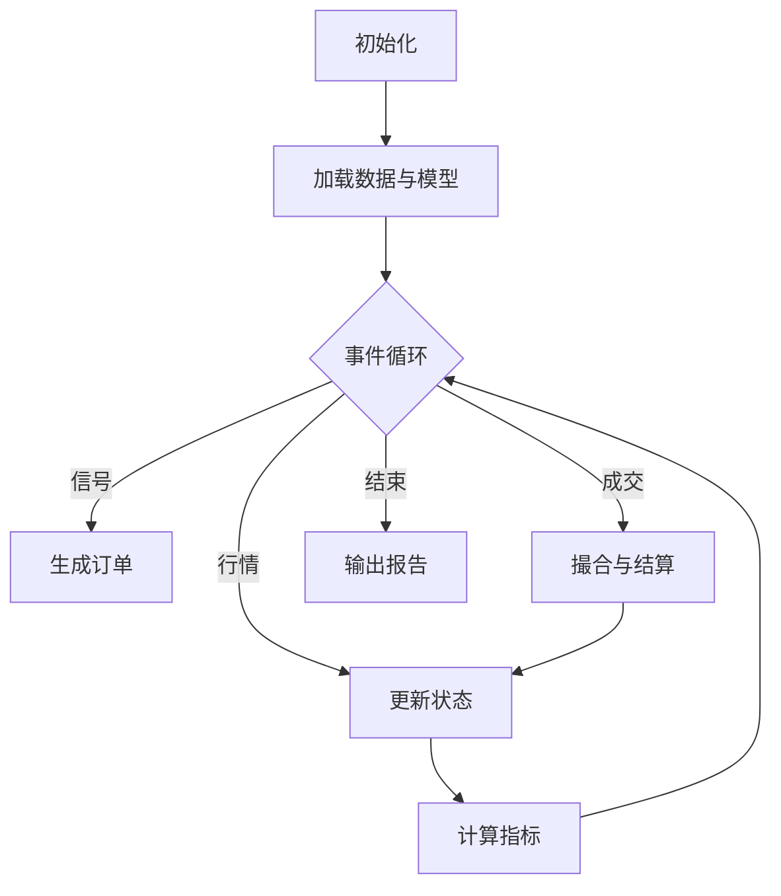

图表来源
- [packages/backtest/__init__.py](file://packages/backtest/__init__.py)
- [packages/portfolio/__init__.py](file://packages/portfolio/__init__.py)
- [packages/risk/__init__.py](file://packages/risk/__init__.py)

章节来源
- [packages/backtest/__init__.py](file://packages/backtest/__init__.py)
- [packages/portfolio/__init__.py](file://packages/portfolio/__init__.py)
- [packages/risk/__init__.py](file://packages/risk/__init__.py)

### 评估与报告（Evaluation & Reporting）
- 职责：计算策略绩效与风险指标，生成可视化报告
- 关键能力：
  - 指标：夏普、信息比率、最大回撤、换手率、滑点
  - 归因：行业/风格/因子贡献分解
  - 报告：PDF/HTML/JSON，包含净值曲线、风险热力图
- 建议：报告需附带数据与模型版本，保证可追溯

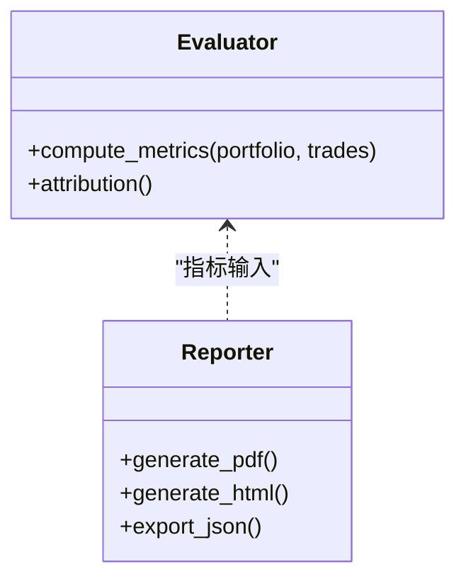

图表来源
- [packages/evaluation/__init__.py](file://packages/evaluation/__init__.py)
- [packages/reporting/__init__.py](file://packages/reporting/__init__.py)

章节来源
- [packages/evaluation/__init__.py](file://packages/evaluation/__init__.py)
- [packages/reporting/__init__.py](file://packages/reporting/__init__.py)

### 可观测性与审计（Observability & Audit）
- 职责：提供指标、日志、链路追踪与审计能力
- 关键能力：
  - 指标采集：任务耗时、吞吐、错误率
  - 日志与追踪：结构化日志、分布式追踪
  - 审计：数据与模型变更审计、操作留痕
- 建议：在生产环境开启采样与分级日志，避免性能影响

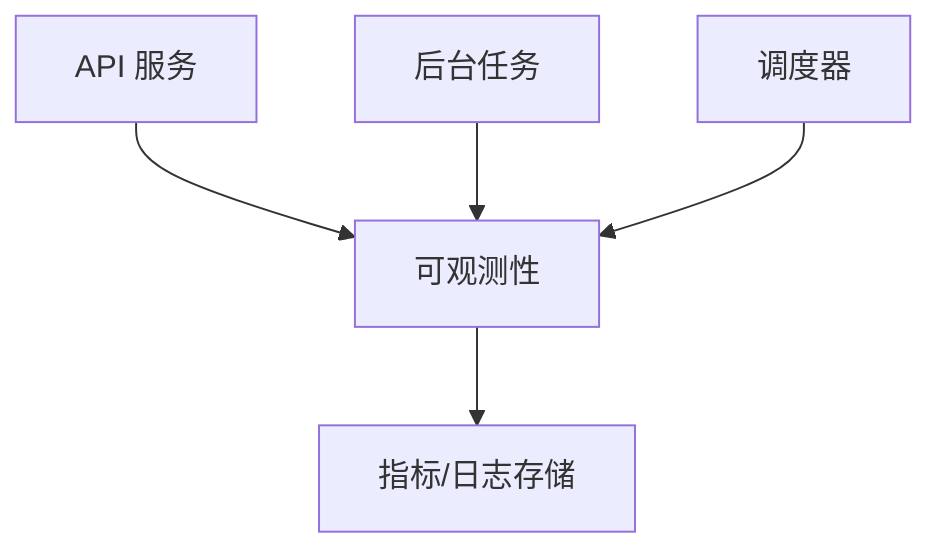

图表来源
- [packages/observability/__init__.py](file://packages/observability/__init__.py)
- [packages/audit/__init__.py](file://packages/audit/__init__.py)
- [apps/api/main.py](file://apps/api/main.py)
- [apps/worker/main.py](file://apps/worker/main.py)
- [apps/scheduler/schedule.py](file://apps/scheduler/schedule.py)

章节来源
- [packages/observability/__init__.py](file://packages/observability/__init__.py)
- [packages/audit/__init__.py](file://packages/audit/__init__.py)
- [apps/api/main.py](file://apps/api/main.py)
- [apps/worker/main.py](file://apps/worker/main.py)
- [apps/scheduler/schedule.py](file://apps/scheduler/schedule.py)

### 基础数据与辅助能力（Fundamentals, Drift, Ledger/Paper）
- 基本面：财务指标、公告、估值等数据接入与加工
- 漂移检测：数据分布与模型性能漂移监测与告警
- 账本与模拟交易：记录交易流水、持仓与资金变动，支撑回测与实盘对照

章节来源
- [packages/fundamentals/__init__.py](file://packages/fundamentals/__init__.py)
- [packages/drift/__init__.py](file://packages/drift/__init__.py)
- [packages/ledger_paper/__init__.py](file://packages/ledger_paper/__init__.py)

## 依赖关系分析
- 应用层依赖领域包：API/Worker/Scheduler通过依赖注入或配置选择具体实现
- 领域包之间松耦合：通过接口与事件通信，减少直接耦合
- 外部依赖：数据库迁移由Alembic管理，容器编排由Docker Compose管理

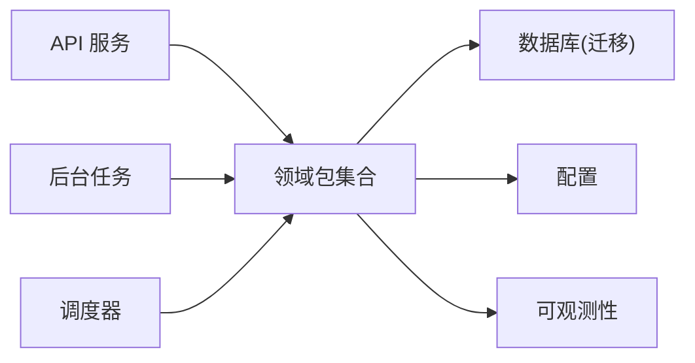

图表来源
- [apps/api/main.py](file://apps/api/main.py)
- [apps/worker/main.py](file://apps/worker/main.py)
- [apps/scheduler/schedule.py](file://apps/scheduler/schedule.py)
- [sql/migrations/env.py](file://sql/migrations/env.py)
- [alembic.ini](file://alembic.ini)
- [configs/base.yaml](file://configs/base.yaml)
- [configs/dev.yaml](file://configs/dev.yaml)
- [packages/observability/__init__.py](file://packages/observability/__init__.py)

章节来源
- [alembic.ini](file://alembic.ini)
- [sql/migrations/env.py](file://sql/migrations/env.py)
- [configs/base.yaml](file://configs/base.yaml)
- [configs/dev.yaml](file://configs/dev.yaml)

## 性能考量
- 数据接入：并行拉取与批处理，增量同步减少重复IO
- 特征与标签：向量化计算与缓存，避免重复计算
- 训练与推理：GPU加速、批大小调优、模型量化与剪枝
- 回测：事件循环优化、内存池与对象复用、磁盘IO合并
- 可观测性：采样与异步上报，避免阻塞主流程

[本节为通用指导，不直接分析具体文件]

## 故障排查指南
- 数据问题
  - 检查数据源连通性与权限
  - 核对公司行为与日历规则是否生效
  - 查看数据血缘与审计日志定位异常
- 模型问题
  - 确认特征与数据版本一致
  - 检查训练日志与指标收敛情况
  - 对比离线与在线推理结果差异
- 回测问题
  - 核查订单撮合与滑点参数
  - 检查组合约束与风控阈值
  - 关注极端行情下的流动性假设
- 服务问题
  - 查看API/Worker/Scheduler日志
  - 检查容器资源与依赖服务健康
  - 使用可观测性面板定位瓶颈

章节来源
- [packages/audit/__init__.py](file://packages/audit/__init__.py)
- [packages/observability/__init__.py](file://packages/observability/__init__.py)
- [apps/api/main.py](file://apps/api/main.py)
- [apps/worker/main.py](file://apps/worker/main.py)
- [apps/scheduler/schedule.py](file://apps/scheduler/schedule.py)

## 结论
本系统以微服务与插件化为核心，结合事件驱动与完善的数据治理，构建了从数据到策略落地的全链路能力。通过标准化的数据接入、灵活的因子与标签工程、可扩展的模型族、严谨的回测与评估以及完善的可观测性与审计，系统既适合初学者快速上手，也满足专业团队的深度定制需求。

[本节为总结性内容，不直接分析具体文件]

## 附录

### 快速开始
- 环境要求
  - Python 与依赖：参见项目依赖声明
  - 数据库：用于持久化标的、数据集与审计信息
  - 可选：GPU（训练与推理加速）
- 安装步骤
  - 克隆仓库并进入项目根目录
  - 安装依赖（参考依赖声明）
  - 初始化数据库迁移（参考迁移配置）
  - 准备配置文件（开发/生产）
  - 启动服务（API、Worker、Scheduler）
- 基本使用示例
  - 通过API提交数据接入任务
  - 创建数据集并生成特征与标签
  - 训练模型并注册
  - 发起回测并下载报告
  - 查看可观测性面板与审计日志

章节来源
- [pyproject.toml](file://pyproject.toml)
- [alembic.ini](file://alembic.ini)
- [sql/migrations/env.py](file://sql/migrations/env.py)
- [configs/base.yaml](file://configs/base.yaml)
- [configs/dev.yaml](file://configs/dev.yaml)
- [deploy/docker-compose.yml](file://deploy/docker-compose.yml)
- [apps/api/main.py](file://apps/api/main.py)
- [apps/worker/main.py](file://apps/worker/main.py)
- [apps/scheduler/schedule.py](file://apps/scheduler/schedule.py)

### 技术栈与兼容性
- 语言与框架：Python生态，遵循依赖声明中的版本约束
- 数据库迁移：Alembic管理
- 容器编排：Docker Compose
- 可观测性：指标、日志与链路追踪（按配置启用）
- 兼容性：不同环境通过配置文件切换（开发/生产），确保依赖与服务版本一致

章节来源
- [pyproject.toml](file://pyproject.toml)
- [alembic.ini](file://alembic.ini)
- [deploy/docker-compose.yml](file://deploy/docker-compose.yml)
- [configs/base.yaml](file://configs/base.yaml)
- [configs/dev.yaml](file://configs/dev.yaml)

### 跨市场研究与AI Agent集成
- 跨市场研究技能：提供统一的研究规范、校验脚本与模板，覆盖A股、美股与基金场景
- AI Agent集成：通过MCP工具与Skill规范，将研究流程与Agent工作流对接，提升自动化程度

章节来源
- [skills/cross-market-quant-research/SKILL.md](file://skills/cross-market-quant-research/SKILL.md)