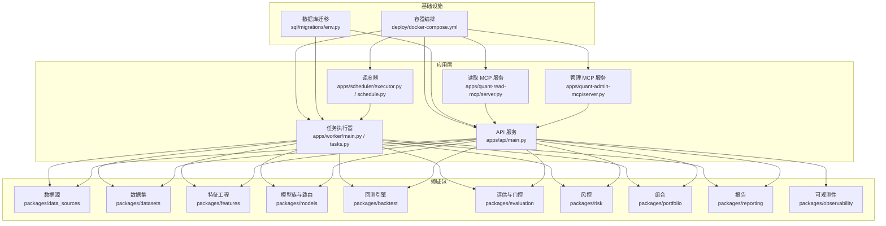
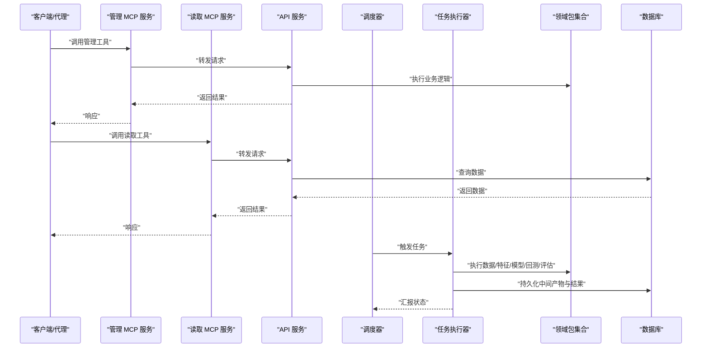
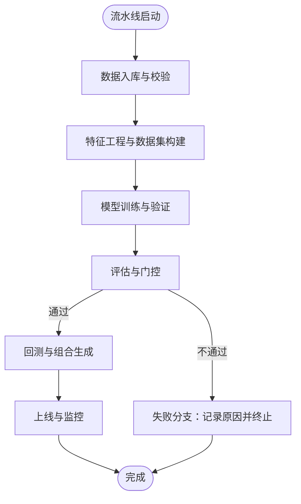
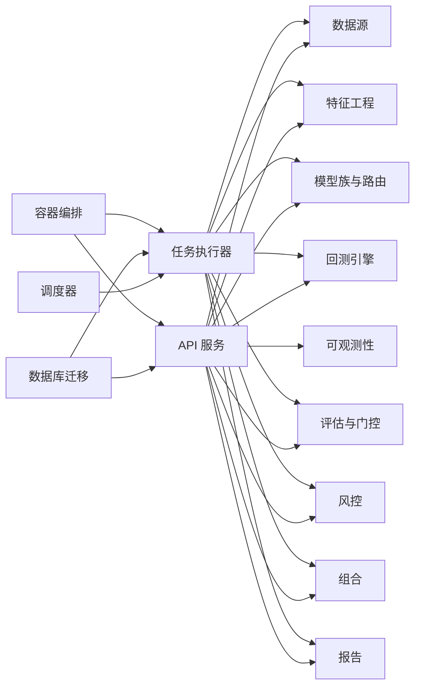

# 项目概述

<cite>
**本文引用的文件**   
- [README.md](file://README.md)
- [pyproject.toml](file://pyproject.toml)
- [apps/api/main.py](file://apps/api/main.py)
- [apps/quant-admin-mcp/server.py](file://apps/quant-admin-mcp/server.py)
- [apps/quant-read-mcp/server.py](file://apps/quant-read-mcp/server.py)
- [apps/scheduler/executor.py](file://apps/scheduler/executor.py)
- [apps/scheduler/schedule.py](file://apps/scheduler/schedule.py)
- [apps/worker/main.py](file://apps/worker/main.py)
- [apps/worker/tasks.py](file://apps/worker/tasks.py)
- [deploy/docker-compose.yml](file://deploy/docker-compose.yml)
- [skills/cross-market-quant-research/SKILL.md](file://skills/cross-market-quant-research/SKILL.md)
- [sql/migrations/env.py](file://sql/migrations/env.py)
</cite>

## 目录
1. [简介](#简介)
2. [项目结构](#项目结构)
3. [核心组件](#核心组件)
4. [架构总览](#架构总览)
5. [详细组件分析](#详细组件分析)
6. [依赖关系分析](#依赖关系分析)
7. [性能考量](#性能考量)
8. [故障排查指南](#故障排查指南)
9. [结论](#结论)
10. [附录：快速开始](#附录快速开始)

## 简介
本项目是一个面向多市场、多资产类别的量化交易MCP（Model Control Plane）平台，围绕“数据—特征—模型—回测—评估—上线—监控”的完整流水线构建。其核心目标包括：
- 统一跨市场与跨资产的数据接入、标准化与治理，提供一致化的工具与服务接口
- 以多代理协作的方式组织研究、工程与运维职责，形成可复用的研究与生产工作流
- 提供从离线回测到在线推理与纸交易的端到端能力，并内置风险、审计与可观测性
- 通过MCP服务暴露统一的工具与查询能力，降低使用门槛并提升复用度

本概述为初学者提供清晰的概念介绍，同时为有经验的开发者提供足够的技术深度与落地指引。

## 项目结构
仓库采用应用分层与领域包分离的组织方式：
- apps：运行态服务与应用入口，包含API服务、MCP服务器、调度器与任务执行器
- packages：领域能力包，覆盖数据源、数据集、特征、模型、训练、回测、评估、风控、组合、报告等
- sql：数据库迁移脚本，支撑市场条线、公司行为、基本面、外汇、组合等实体
- deploy：容器化部署配置与监控采集
- scripts：常用脚本，涵盖数据入库、注册评估、纸交易与研究基线等
- skills：跨市场量化研究技能与校验脚本，规范研究产出与质量门禁
- tests：单元与集成测试，覆盖关键路径与边界场景

图表来源
- [apps/api/main.py](file://apps/api/main.py)
- [apps/quant-admin-mcp/server.py](file://apps/quant-admin-mcp/server.py)
- [apps/quant-read-mcp/server.py](file://apps/quant-read-mcp/server.py)
- [apps/scheduler/executor.py](file://apps/scheduler/executor.py)
- [apps/scheduler/schedule.py](file://apps/scheduler/schedule.py)
- [apps/worker/main.py](file://apps/worker/main.py)
- [apps/worker/tasks.py](file://apps/worker/tasks.py)
- [sql/migrations/env.py](file://sql/migrations/env.py)
- [deploy/docker-compose.yml](file://deploy/docker-compose.yml)

章节来源
- [README.md](file://README.md)
- [pyproject.toml](file://pyproject.toml)

## 核心组件
- API 服务：聚合各领域的查询与操作能力，对外暴露REST接口，供前端、MCP服务与外部系统调用
- MCP 服务：将领域能力封装为“工具”，支持管理与读取两类场景，便于AI代理或自动化流程直接调用
- 调度器与任务执行器：基于定时与事件驱动的任务编排，负责数据入库、特征计算、模型训练、回测与评估等流水线的执行
- 领域包：按功能域划分，提供高内聚低耦合的能力实现，贯穿数据、特征、模型、回测、评估、风控、组合与报告
- 数据库迁移：以版本化迁移管理市场条线、公司行为、基本面、外汇、组合等核心实体与血缘信息
- 部署与可观测性：容器编排与监控采集，保障服务稳定运行与问题定位

章节来源
- [apps/api/main.py](file://apps/api/main.py)
- [apps/quant-admin-mcp/server.py](file://apps/quant-admin-mcp/server.py)
- [apps/quant-read-mcp/server.py](file://apps/quant-read-mcp/server.py)
- [apps/scheduler/executor.py](file://apps/scheduler/executor.py)
- [apps/scheduler/schedule.py](file://apps/scheduler/schedule.py)
- [apps/worker/main.py](file://apps/worker/main.py)
- [apps/worker/tasks.py](file://apps/worker/tasks.py)
- [sql/migrations/env.py](file://sql/migrations/env.py)

## 架构总览
整体采用“服务+包”的分层架构：API与MCP作为统一入口，调度器与任务执行器驱动流水线，领域包提供业务能力，数据库与容器编排提供基础设施支撑。

图表来源
- [apps/quant-admin-mcp/server.py](file://apps/quant-admin-mcp/server.py)
- [apps/quant-read-mcp/server.py](file://apps/quant-read-mcp/server.py)
- [apps/api/main.py](file://apps/api/main.py)
- [apps/scheduler/executor.py](file://apps/scheduler/executor.py)
- [apps/worker/main.py](file://apps/worker/main.py)
- [apps/worker/tasks.py](file://apps/worker/tasks.py)
- [sql/migrations/env.py](file://sql/migrations/env.py)

## 详细组件分析

### 多代理协作系统设计理念
- 角色分工：管理代理负责策略注册、参数调优、资源编排；读取代理专注数据与指标查询；调度与执行代理负责流水线编排与容错重试
- 工具契约：通过MCP服务暴露的工具定义统一输入输出格式，屏蔽底层差异，使不同代理可协同完成复杂任务
- 可观测与审计：所有关键操作记录审计事件，结合可观测性指标进行追踪与告警

章节来源
- [apps/quant-admin-mcp/server.py](file://apps/quant-admin-mcp/server.py)
- [apps/quant-read-mcp/server.py](file://apps/quant-read-mcp/server.py)
- [apps/api/main.py](file://apps/api/main.py)

### 跨市场量化交易实现方式
- 统一标识与日历规则：通过统一的标的标识与交易日历规则，屏蔽不同市场的休市、节假日与交易时段差异
- 公司行为与基本面融合：在数据层处理除权除息、分红、退市等事件，并在基本面维度对齐时间序列
- 外汇与多币种支持：在外汇模块中处理交叉汇率与币种转换，确保组合与风险在多币种环境下的一致性

章节来源
- [skills/cross-market-quant-research/SKILL.md](file://skills/cross-market-quant-research/SKILL.md)
- [sql/migrations/env.py](file://sql/migrations/env.py)

### 完整的量化流水线工作流程
- 数据入库：从多源拉取原始数据，清洗、对齐与落库，生成血缘信息
- 特征工程：基于市场条线与因子库构建特征集，输出标准化数据集
- 模型训练与评估：选择模型族与路由策略，进行训练与滚动验证，输出评估报告与门控结果
- 回测与组合：在历史与模拟环境中进行回测，生成组合头寸与交易信号
- 上线与监控：将模型与策略纳入生产环境，持续监控表现与风险指标

图表来源
- [apps/scheduler/executor.py](file://apps/scheduler/executor.py)
- [apps/scheduler/schedule.py](file://apps/scheduler/schedule.py)
- [apps/worker/main.py](file://apps/worker/main.py)
- [apps/worker/tasks.py](file://apps/worker/tasks.py)

## 依赖关系分析
- 应用层依赖领域包：API与MCP服务通过API聚合领域能力，调度器与任务执行器直接调用领域包完成具体任务
- 基础设施依赖：数据库迁移由Alembic驱动，容器编排通过docker-compose统一管理服务生命周期
- 外部依赖：遵循Python生态与量化相关库，版本约束在工程文件中声明

图表来源
- [apps/api/main.py](file://apps/api/main.py)
- [apps/scheduler/executor.py](file://apps/scheduler/executor.py)
- [apps/worker/main.py](file://apps/worker/main.py)
- [sql/migrations/env.py](file://sql/migrations/env.py)
- [deploy/docker-compose.yml](file://deploy/docker-compose.yml)

章节来源
- [pyproject.toml](file://pyproject.toml)
- [deploy/docker-compose.yml](file://deploy/docker-compose.yml)

## 性能考量
- 批处理与并行：数据入库与特征计算采用批处理与并行执行，减少I/O瓶颈
- 增量更新：对高频数据采用增量更新策略，避免全量重算
- 缓存与物化：对热点查询与中间结果进行缓存与物化，提升API响应速度
- 资源隔离：通过容器编排限制CPU与内存配额，防止任务间相互影响
- 监控与告警：关键指标与错误率纳入监控，设置阈值告警以便及时干预

[本节为通用指导，无需代码引用]

## 故障排查指南
- 服务健康检查：通过API健康端点确认服务可用性
- 任务日志与审计：查看任务执行日志与审计事件，定位失败阶段与原因
- 数据库连接与迁移：确认数据库连通性与迁移状态，必要时回滚或修复
- 容器状态：检查容器运行状态与端口占用，重启异常服务
- 指标与链路追踪：结合可观测性指标与链路追踪，分析性能瓶颈与错误根因

章节来源
- [apps/api/main.py](file://apps/api/main.py)
- [apps/worker/tasks.py](file://apps/worker/tasks.py)
- [sql/migrations/env.py](file://sql/migrations/env.py)
- [deploy/docker-compose.yml](file://deploy/docker-compose.yml)

## 结论
本项目以MCP为核心，构建了跨市场、跨资产的量化交易平台。通过多代理协作与统一工具契约，显著降低了研究与生产的复杂度；以领域包为核心的架构提升了复用性与可维护性；完善的流水线与可观测性保障了从研究到生产的稳定性与可追溯性。

[本节为总结，无需代码引用]

## 附录：快速开始
- 环境要求
  - Python环境与依赖管理（参考工程文件中的依赖声明）
  - 数据库（用于存储市场条线、公司行为、基本面、外汇、组合等实体）
  - 容器运行时（用于一键拉起服务）
- 安装步骤
  - 克隆仓库并进入项目目录
  - 初始化数据库迁移（根据迁移脚本创建表结构与初始数据）
  - 使用容器编排启动API、MCP、调度器与任务执行器
- 基本使用示例
  - 通过管理MCP服务注册策略与参数
  - 通过读取MCP服务查询数据与指标
  - 使用调度器触发一次完整的流水线任务
  - 查看报告与审计事件，评估模型与组合表现

章节来源
- [README.md](file://README.md)
- [pyproject.toml](file://pyproject.toml)
- [deploy/docker-compose.yml](file://deploy/docker-compose.yml)
- [sql/migrations/env.py](file://sql/migrations/env.py)